# Localization and Globalization in Blazor Data Grid

The [Blazor Data Grid](https://www.syncfusion.com/blazor-components/blazor-datagrid) supports globalization to make applications accessible across regions and languages. Display content in the preferred culture with localized text and culture-aware formats.

## Localization

The Blazor Data Grid supports localization for static text elements such as **group drop area text** and **pager information**. Localization can be applied for cultures such as **Arabic**, **Deutsch**, **French**, and others.

- Use localization to replace default UI text with culture-specific translations.
- Configure localization by referring to the [Blazor Localization Documentation](https://blazor.syncfusion.com/documentation/common/localization).

A subset of localizable strings used by the Data Grid is listed for reference.

**Data Rendering**

Locale keywords | Text | Screenshot
-----|-----|-----
Grid_EmptyRecord | No records to display | 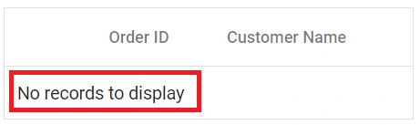
Grid_EmptyDataSourceError | DataSource must not be empty at initial load since columns are generated from dataSource in AutoGenerate Column Data Grid

**Columns**

Locale keywords | Text | Screenshot
-----|-----|-----
Grid_True | true | 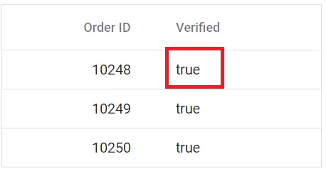
Grid_False | false | 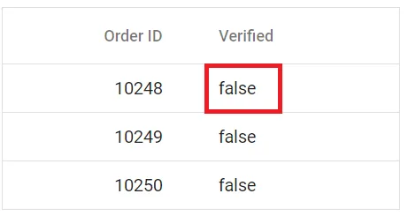

**ColumnChooser**

Locale keywords | Text | Screenshot
-----|-----|-----
Grid_Columnchooser | Columns | 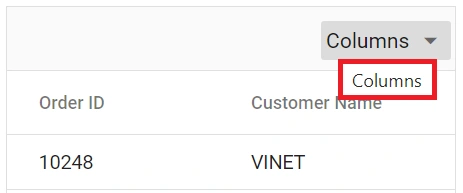
Grid_ChooseColumns | Choose Column | 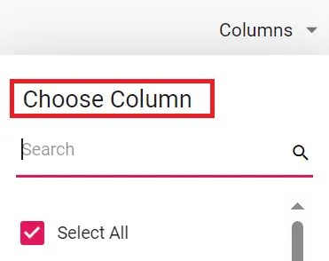

**Editing**

Locale keywords | Text | Screenshot
-----|-----|-----
Grid_Add | Add | 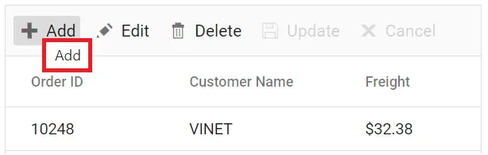
Grid_Edit| Edit | 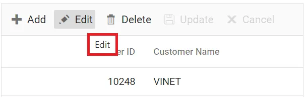
Grid_Cancel| Cancel | 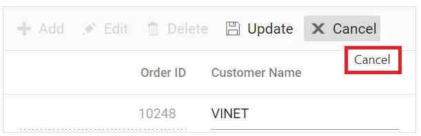
Grid_Update| Update | 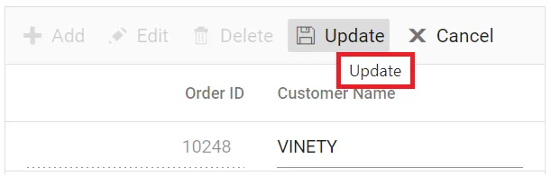
Grid_Delete | Delete | 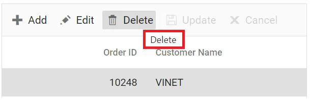
Grid_Save | Save | 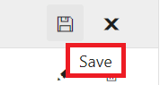
Grid_EditOperationAlert | No records selected for edit operation | 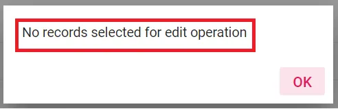
Grid_DeleteOperationAlert | No records selected for delete operation | 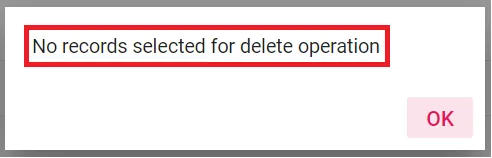
Grid_SaveButton | Save | 
Grid_OKButton | OK | 
Grid_CancelButton | Cancel | 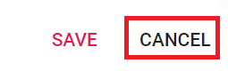
Grid_EditFormTitle | Details of | 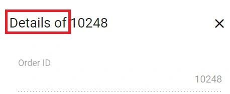
Grid_AddFormTitle | Add New Record | 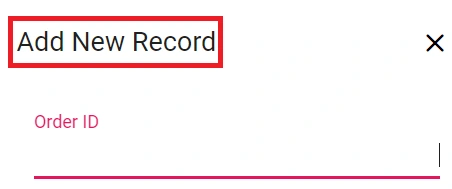
Grid_BatchSaveConfirm | Are you sure you want to save changes? | 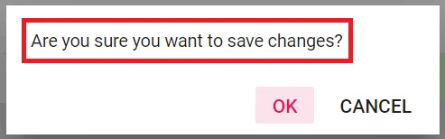
Grid_BatchSaveLostChanges | Unsaved changes will be lost. Are you sure you want to continue? | 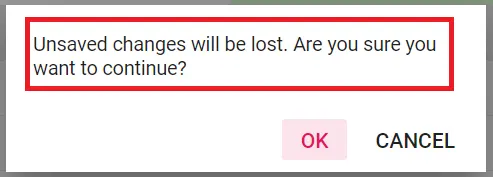
Grid_ConfirmDelete | Are you sure you want to Delete Record? | 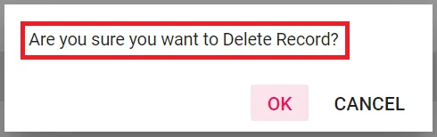
Grid_CancelEdit | Are you sure you want to Cancel the changes? | 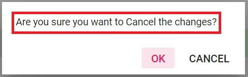

**Grouping**

Locale keywords | Text | Screenshot
-----|-----|-----
Grid_GroupDropArea | Drag a column header here to group its column | 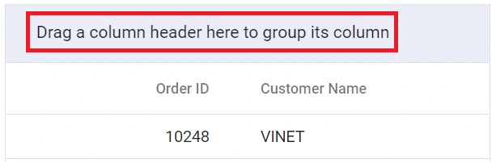
Grid_UnGroup | Click here to ungroup | 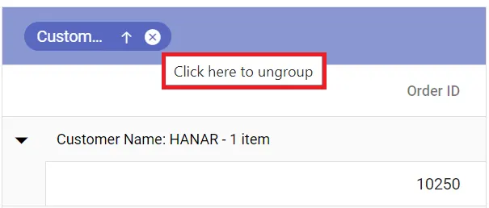
Grid_GroupDisable | Grouping is disabled for this column | 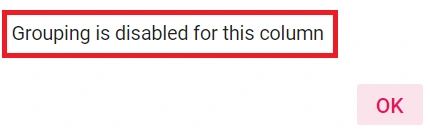
Grid_Item | item | 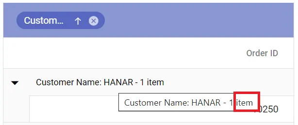
Grid_Items | items | 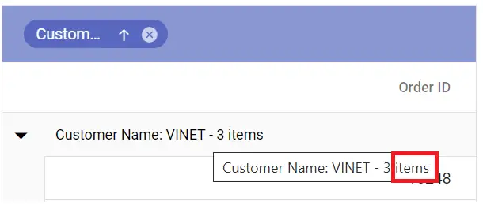
Grid_UnGroupButton | Click here to ungroup | 
Grid_GroupDescription | Press Ctrl space to group | 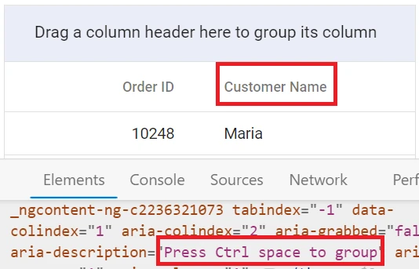

**Filtering**

Locale keywords | Text | Screenshot
-----|-----|-----
Grid_InvalidFilterMessage | Invalid Filter Data | -
Grid_FilterbarTitle | filter bar cell | 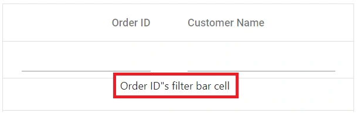
Grid_Matchs | No Matches Found | 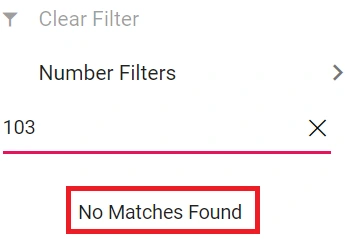
Grid_FilterButton | Filter | 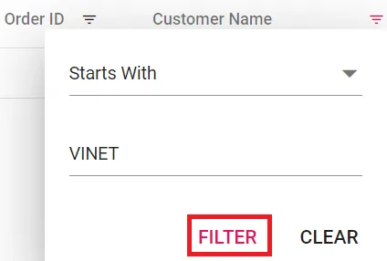
Grid_ClearButton | Clear | 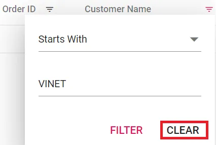
Grid_StartsWith | Starts With | 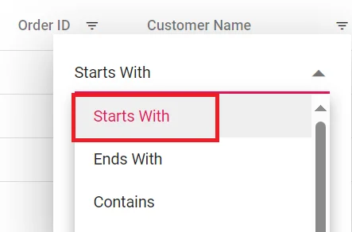
Grid_EndsWith | Ends With | 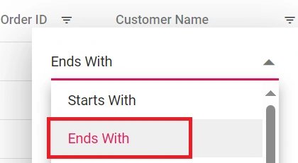
Grid_Contains | Contains | 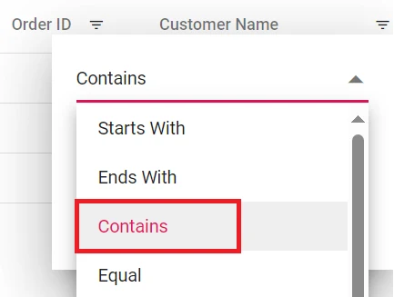
Grid_Equal | Equal | 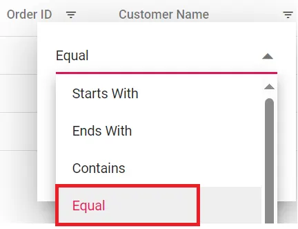
Grid_NotEqual | Not Equal | 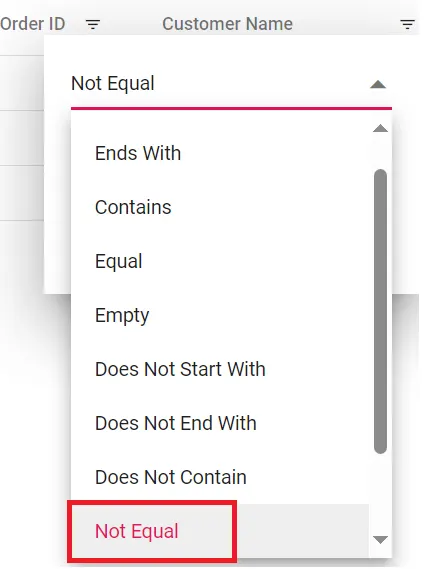
Grid_LessThan | Less Than | 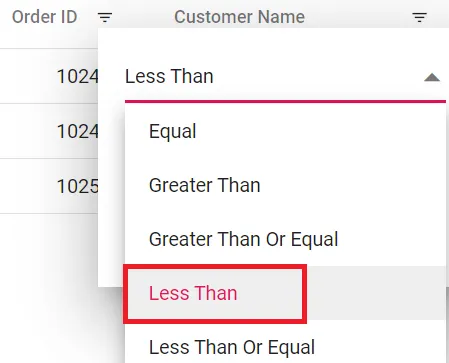
Grid_LessThanOrEqual | Less Than Or Equal | 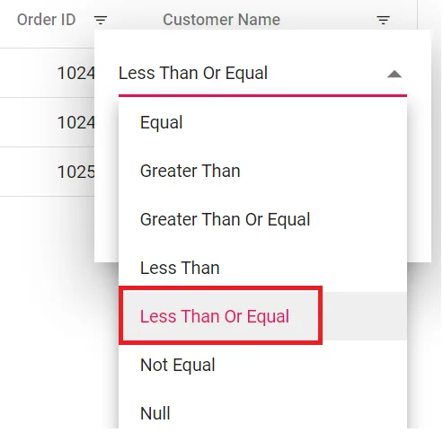
Grid_GreaterThan | Greater Than | 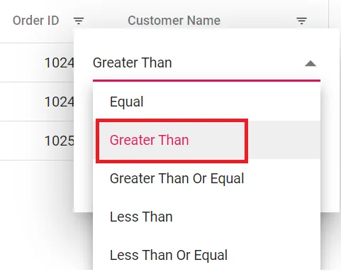
Grid_GreaterThanOrEqual | Greater Than Or Equal | 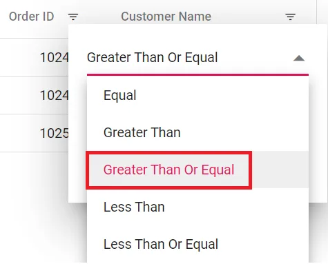
Grid_ChooseDate | Choose a Date | 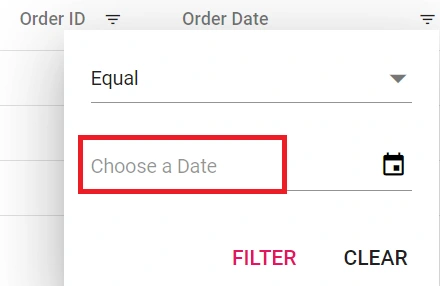
Grid_EnterValue | Enter the value | 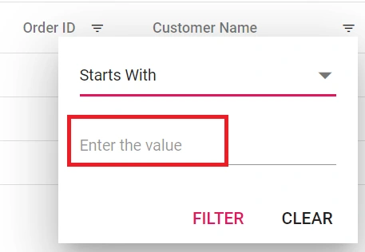
Grid_SelectAll | Select All | 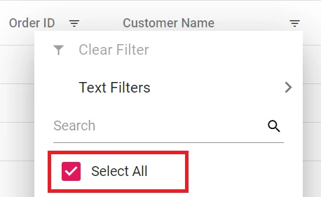
Grid_Blanks | Blanks | 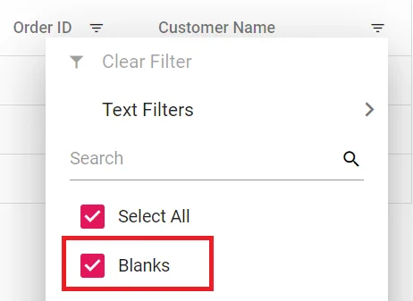
Grid_FilterTrue | True | 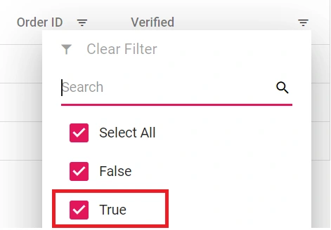
Grid_FilterFalse | False | 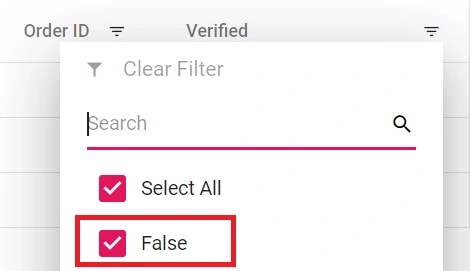
Grid_NoResult | No Matches Found | 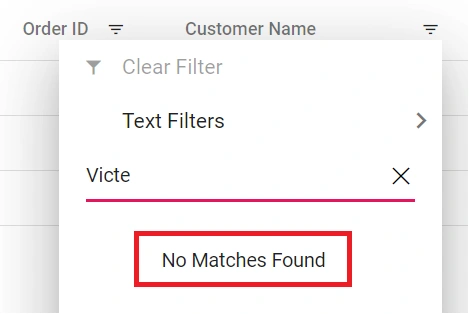
Grid_ClearFilter | Clear Filter | 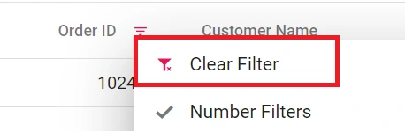
Grid_NumberFilter | Number Filters | 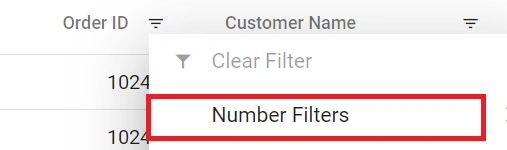
Grid_TextFilter | Text Filters | 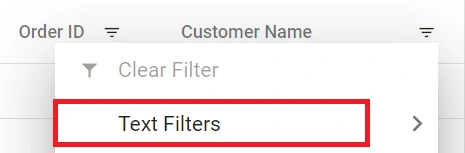
Grid_DateFilter | Date Filters | 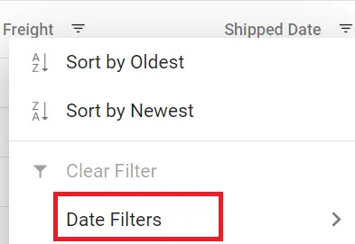
Grid_DateTimeFilter | DateTime Filters | 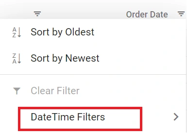
Grid_MatchCase | Match Case | 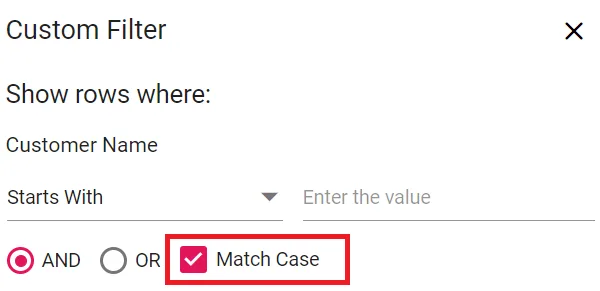
Grid_Between | Between | 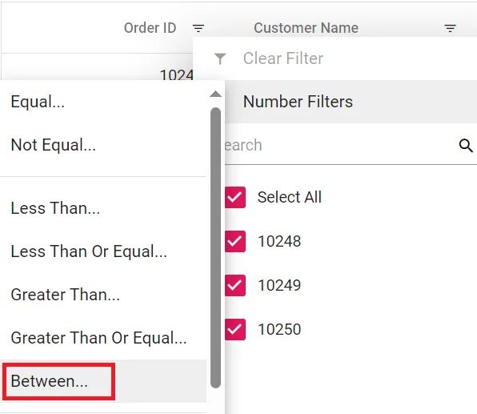
Grid_CustomFilter | Custom Filter | 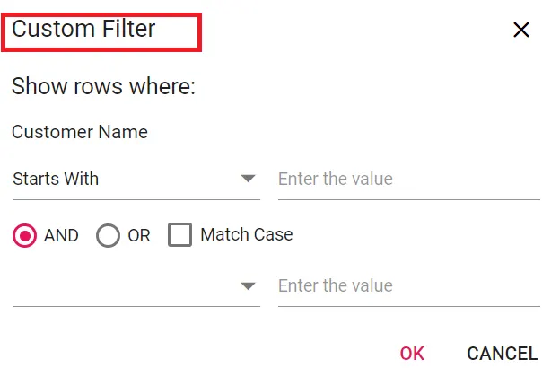
Grid_CustomFilterPlaceHolder | Enter the value | 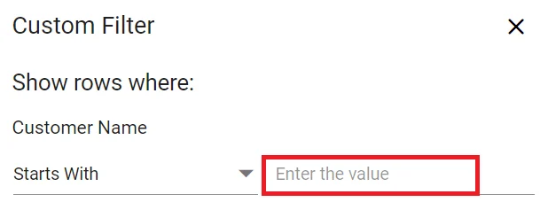
Grid_CustomFilterDatePlaceHolder | Choose a date | 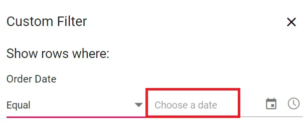
Grid_AND | AND | 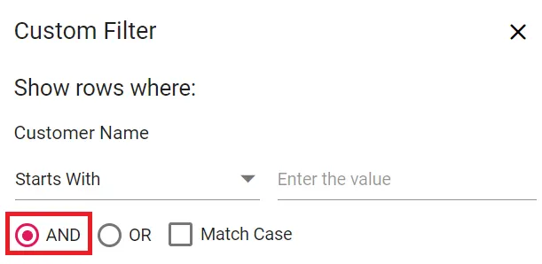
Grid_OR | OR | 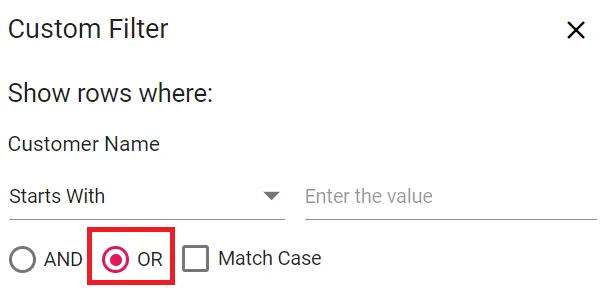
Grid_ShowRowsWhere | Show rows where: | 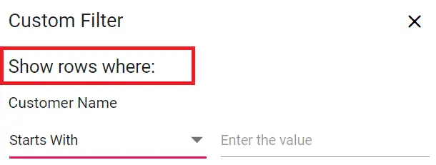

**Searching**

Locale keywords | Text | Screenshot
-----|-----|-----
Grid_Search | Search | 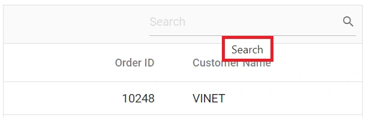
Grid_SearchColumns | search columns | -

**Toolbar**

Locale keywords | Text | Screenshot
-----|-----|-----
Grid_Print | Print | 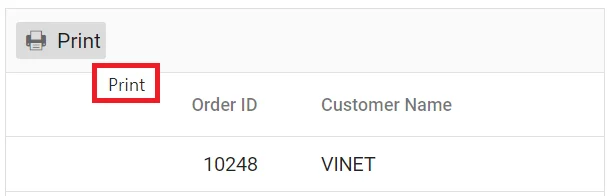
Grid_Pdfexport | PDF Export | 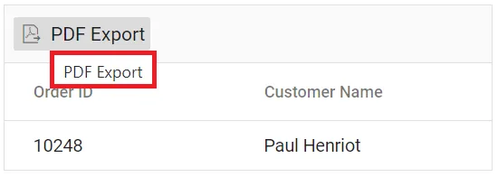
Grid_Excelexport | Excel Export | 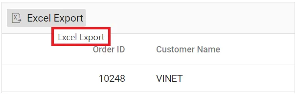
Grid_Csvexport | CSV Export | 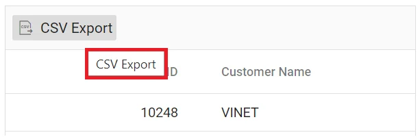

**ColumnMenu**

Locale keywords | Text | Screenshot
-----|-----|-----
Grid_FilterMenu | Filter | 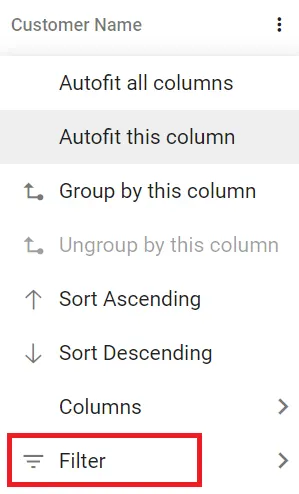
Grid_AutoFitAll | Autofit all columns | 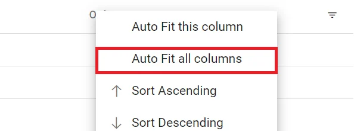
Grid_AutoFit | Autofit this column | 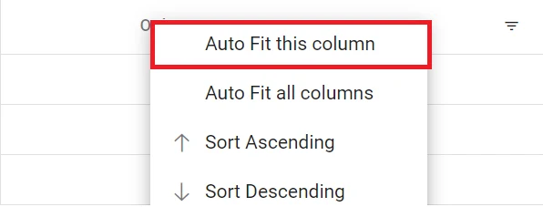

**ContextMenu**

Locale keywords | Text | Screenshot
-----|-----|-----
Grid_Copy | Copy | 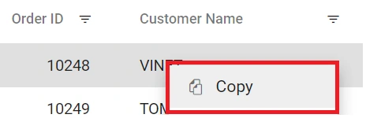
Grid_Group | Group by this column | 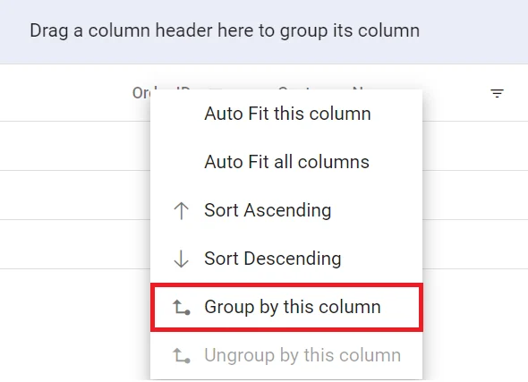
Grid_Ungroup | Ungroup by this column | 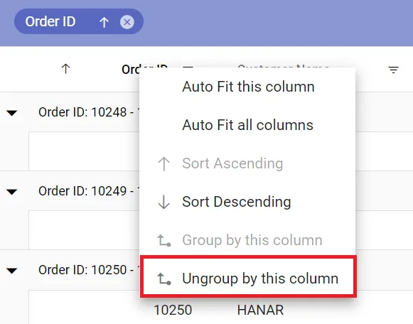
Grid_autoFitAll | Auto Fit all columns | 
Grid_autoFit | Auto Fit this column | 
Grid_Export | Export | 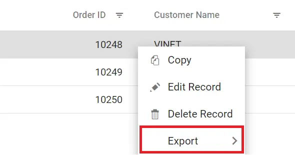
Grid_FirstPage | First Page | 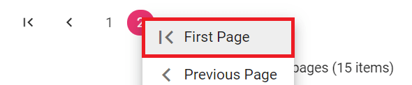
Grid_LastPage | Last Page | 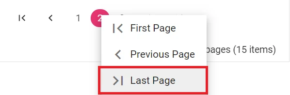
Grid_PreviousPage | Previous Page | 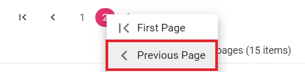
Grid_NextPage | Next Page | 
Grid_SortAscending | Sort Ascending | 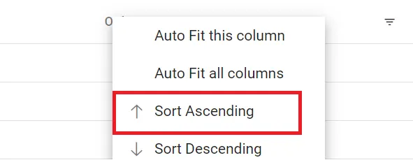
Grid_SortDescending | Sort Descending | 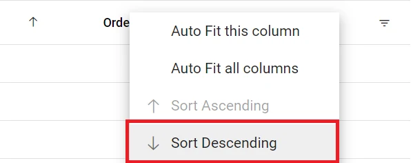
Grid_EditRecord | Edit Record | 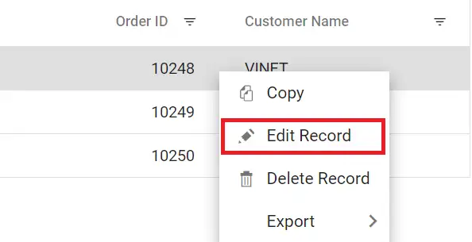
Grid_DeleteRecord | Delete Record | 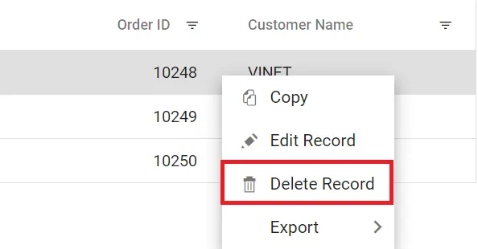

### Switching Localization

- The Blazor Data Grid allows switching the localization from one culture to another at runtime. Runtime culture changes support user preferences and application context. For more details, see [Dynamically set the culture](https://blazor.syncfusion.com/documentation/common/localization#dynamically-set-the-culture).

- To configure localization in a Blazor Data Grid and switch to a different culture (e.g., French, German, Arabic), follow these steps:

**Step 1: Create a Blazor Web App**
 
Create the app using [Microsoft Templates](https://learn.microsoft.com/en-us/aspnet/core/blazor/tooling?view=aspnetcore-8.0&pivots=vs) or the [Blazor Extension](https://blazor.syncfusion.com/documentation/visual-studio-integration/template-studio), then configure the [render mode](https://learn.microsoft.com/en-us/aspnet/core/blazor/components/render-modes?view=aspnetcore-8.0#render-modes) and [interactivity location](https://learn.microsoft.com/en-us/aspnet/core/blazor/tooling?view=aspnetcore-8.0&pivots=vs#interactivity-location).

**Step 2: Install Blazor Data Grid NuGet Packages**
 
- For Blazor Web Apps using WebAssembly or Auto render modes, install the packages in the client project. For Interactive Server render mode, install the packages in the server project.

- Install the following packages through NuGet Package Manager:

- [Syncfusion.Blazor.Grid](https://www.nuget.org/packages/Syncfusion.Blazor.Grid/)
- [Syncfusion.Blazor.Themes](https://www.nuget.org/packages/Syncfusion.Blazor.Themes/)
- [Syncfusion.Blazor.Buttons](https://www.nuget.org/packages/Syncfusion.Blazor.Buttons/)
 
- Use the Package Manager Console commands below as an alternative:
 
```powershell
Install-Package Syncfusion.Blazor.Grid -Version {{ site.releaseversion }}
Install-Package Syncfusion.Blazor.Themes -Version {{ site.releaseversion }}
Install-Package Syncfusion.Blazor.Buttons -Version {{ site.releaseversion }}
```
 
> Blazor components are available on [nuget.org](https://www.nuget.org/packages?q=syncfusion.blazor). Refer to the [NuGet packages](https://blazor.syncfusion.com/documentation/nuget-packages) documentation for a complete list of available packages.
 
**Step 3: Register Blazor Service**
 
Open the **~/_Imports.razor** file and import the required namespaces.
 
```cs
@using Syncfusion.Blazor
@using Syncfusion.Blazor.Grids
@using Syncfusion.Blazor.Buttons
```

- Register the Blazor service in **Program.cs**:

```cs
    builder.Services.AddSyncfusionBlazor();
```

**Step 4: Add Stylesheet and Script Resources**
 
Include the theme stylesheet and script references in the **~/Components/App.razor** file:
 
```html
<head>
    ...
    <link href="_content/Syncfusion.Blazor.Themes/bootstrap5.css" rel="stylesheet" />
</head>
<body>
    ...
    <script src="_content/Syncfusion.Blazor.Core/scripts/syncfusion-blazor.min.js" type="text/javascript"></script>
</body>
```
 
> * Refer to the [Blazor Themes](https://blazor.syncfusion.com/documentation/appearance/themes) documentation for theme inclusion methods (Static Web Assets, CDN, or CRG). 
> * Set the render mode to **InteractiveServer** or **InteractiveAuto** in the Blazor Web App configuration.

**Step 5: Create and Register Localization Service**

Create a **SyncfusionLocalizer.cs** file with this code. For complete setup details, see the [Localization Documentation](https://blazor.syncfusion.com/documentation/common/localization#create-and-register-localization-service).

Create a **Resources** folder in the client project. Add **SfResources.resx** for the default culture and one culture-specific resource file for each supported culture, such as **SfResources.fr-FR.resx**. Use the `Grid_` locale keys in the resource files. The generated resource class namespace must match `LocalizationSample.Client.Resources.SfResources` as referenced in **SyncfusionLocalizer.cs**. During the build process, culture-specific resource files are compiled into satellite assemblies.




using Syncfusion.Blazor;

namespace LocalizationSample.Client
{
    public class SyncfusionLocalizer : ISyncfusionStringLocalizer
    {
        // To get the locale key from mapped resources file
        public string GetText(string key)
        {
            return this.ResourceManager.GetString(key);
        }

        // To access the resource file and get the exact value for locale key

        public System.Resources.ResourceManager ResourceManager
        {
            get
            {
                // Replace ApplicationNamespace with the application name.
                return LocalizationSample.Client.Resources.SfResources.ResourceManager;
            }
        }
    }
}




**Step 6: Configure Program.cs**

- **Set the culture of the application:** In the client-side **~/Program.cs**, use JavaScript interop to retrieve the user's culture from local storage. If none is found, set the default to en-US.
- **Register services:** Register the SyncfusionLocalizer and Blazor services in **~/Program.cs**.




using LocalizationSample.Client;
using Microsoft.AspNetCore.Components.WebAssembly.Hosting;
using Microsoft.JSInterop;
using Syncfusion.Blazor;
using System.Globalization;

var builder = WebAssemblyHostBuilder.CreateDefault(args);

// Register the Blazor services.
builder.Services.AddSyncfusionBlazor();

// Register the locale service to localize Blazor components.
builder.Services.AddSingleton(typeof(ISyncfusionStringLocalizer), typeof(SyncfusionLocalizer));

// Register the Syncfusion license.
Syncfusion.Licensing.SyncfusionLicenseProvider.RegisterLicense("YOUR LICENSE KEY");
var host = builder.Build();

// Setting culture of the application.
var JsInterop = host.Services.GetRequiredService<IJSRuntime>();
var Result = await JsInterop.InvokeAsync<string>("cultureInfo.get");
CultureInfo Culture;
if (Result != null)
{
    Culture = new CultureInfo(Result);
}
else
{
    Culture = new CultureInfo("en-US");
    await JsInterop.InvokeVoidAsync("cultureInfo.set", "en-US");
}
CultureInfo.DefaultThreadCurrentCulture = Culture;
CultureInfo.DefaultThreadCurrentUICulture = Culture;
await host.RunAsync();




**Step 7: Update Project File**

Add this property to the client project file, such as LocalizationSample.csproj:

```
<PropertyGroup>
    <BlazorWebAssemblyLoadAllGlobalizationData>true</BlazorWebAssemblyLoadAllGlobalizationData>
</PropertyGroup>

```
 
**Step 8: Add JavaScript for Culture Management**

Add the JavaScript function to **App.razor** (after the Blazor script tag, before `</body>`):




<!DOCTYPE html>
<html lang="en">
<head>
    <meta charset="utf-8" />
    <meta name="viewport" content="width=device-width, initial-scale=1.0" />
    <base href="/" />
    <link rel="stylesheet" href="bootstrap/bootstrap.min.css" />
    <link rel="stylesheet" href="app.css" />
    <link rel="stylesheet" href="LocalizationSample.styles.css" />
    <link rel="icon" type="image/png" href="favicon.png" />
    <link href="_content/Syncfusion.Blazor.Themes/bootstrap5.css" rel="stylesheet" />
    <HeadOutlet />
</head>
<body>
    <Routes />
    <script src="_framework/blazor.web.js"></script>
    <script>
        window.cultureInfo = {
            get: () => window.localStorage['BlazorCulture'],
            set: (value) => window.localStorage['BlazorCulture'] = value
        };
    </script>
    <script src="_content/Syncfusion.Blazor.Core/scripts/syncfusion-blazor.min.js" type="text/javascript"></script>
</body>
</html>




**Step 9: Configure Culture Switching in Blazor Data Grid**

In the **Counter.razor** file (or another page, e.g., Index.razor), add code to enable culture switching and display a Data Grid with buttons to toggle between English (en-US) and French (fr-FR):
 



@page "/counter"
@rendermode InteractiveAuto
@using System.Globalization
@inject IJSRuntime JSRuntime
@inject NavigationManager NavigationManager
@using LocalizationSample.Client.Data

<div style="padding: 10px 10px">
    <SfButton CssClass="e-outline" @onclick='() => ChangeCulture("en-US")' Content="Change to English (en-US)"></SfButton>
    <SfButton CssClass="e-outline" style="margin-left: 5px;" @onclick='() => ChangeCulture("fr-FR")' Content="Change to French (fr-FR)"></SfButton>
</div>

<SfGrid DataSource="@Orders" AllowFiltering="true" AllowPaging="true" Height="315">
    <GridFilterSettings Type="FilterType.Menu"></GridFilterSettings>
    <GridColumns>
        <GridColumn Field=@nameof(OrderData.OrderID) HeaderText="Order ID" TextAlign="TextAlign.Right" Width="120"></GridColumn>
        <GridColumn Field=@nameof(OrderData.CustomerID) HeaderText="Customer Name" Width="150"></GridColumn>
        <GridColumn Field=@nameof(OrderData.Freight) HeaderText="Freight" Format="C2" TextAlign="TextAlign.Right" Width="120"></GridColumn>
        <GridColumn Field=@nameof(OrderData.ShipCity) HeaderText="Ship City" Width="130"></GridColumn>
        <GridColumn Field=@nameof(OrderData.ShipCountry) HeaderText="Ship Country" Width="130"></GridColumn>
    </GridColumns>
</SfGrid>

@code {
    private List<OrderData> Orders { get; set; }

    protected override void OnInitialized()
    {
        Orders = OrderData.GetAllRecords();
    }

    private async Task ChangeCulture(string Culture)
    {
        await JSRuntime.InvokeVoidAsync("cultureInfo.set", Culture);
        NavigationManager.NavigateTo(NavigationManager.Uri, forceLoad: true);
    }
}
 



The `forceLoad: true` option reloads the page so the selected culture applies to the Data Grid.


**Step 10: Create a Model Class**

Create a **Data** folder and add an **OrderData.cs** file to define the model class for the Data Grid:




namespace LocalizationSample.Client.Data
{
    public sealed class OrderData
    {
        public OrderData(int orderID, string customerID, double freight, string shipCity, string shipCountry)
        {
            OrderID = orderID;
            CustomerID = customerID;
            Freight = freight;
            ShipCity = shipCity;
            ShipCountry = shipCountry;
        }

        public static List<OrderData> GetAllRecords()
        {
            return new List<OrderData>
            {
                new OrderData(10248, "VINET", 32.38, "Reims", "France"),
                new OrderData(10249, "TOMSP", 11.61, "Münster", "Germany"),
                new OrderData(10250, "HANAR", 65.83, "Rio de Janeiro", "Brazil"),
                new OrderData(10251, "VICTE", 41.34, "Lyon", "France"),
                new OrderData(10252, "SUPRD", 51.30, "Charleroi", "Belgium"),
                new OrderData(10253, "HANAR", 58.17, "Rio de Janeiro", "Brazil"),
                new OrderData(10254, "CHOPS", 22.98, "Bern", "Switzerland"),
                new OrderData(10255, "RICSU", 148.33, "Genève", "France"),
                new OrderData(10256, "WELLI", 13.97, "Resende", "Brazil"),
                new OrderData(10257, "HILAA", 81.91, "San Cristóbal", "Mexico"),
                new OrderData(10258, "ERNSH", 140.51, "Graz", "Austria"),
                new OrderData(10259, "CENTC", 3.25, "México D.F.", "Mexico"),
                new OrderData(10260, "OTTIK", 55.09, "Köln", "Germany"),
                new OrderData(10261, "QUEDE", 3.05, "Rio de Janeiro", "Brazil"),
                new OrderData(10262, "RATTC", 48.29, "Albuquerque", "USA")
            };
        }

        public int OrderID { get; set; }
        public string CustomerID { get; set; }
        public double Freight { get; set; }
        public string ShipCity { get; set; }
        public string ShipCountry { get; set; }
    }
}




**Step 11: Run the Application**
 
Run the application; the culture switcher updates UI elements, such as **pager text** and **currency formats**, based on the selected culture.

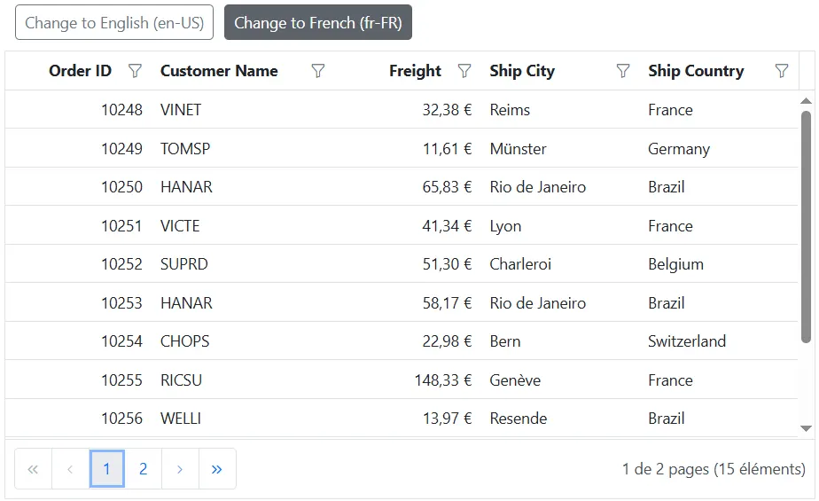

## Right-to-Left (RTL) in Blazor Data Grid

- The RTL feature reverses layout and text direction for languages such as **Arabic**, **Farsi**, and **Urdu**. The RTL layout improves readability and accessibility for native speakers.

- To enable RTL, set the [EnableRtl](https://help.syncfusion.com/cr/blazor/Syncfusion.Blazor.Grids.SfGrid-1.html#Syncfusion_Blazor_Grids_SfGrid_1_EnableRtl) property to **true** in the Data Grid component.

- Use the steps below to configure RTL with a specific culture:

**Step 1: Complete Initial Localization Setup**

Complete **steps 1** through **5** from [Switching Localization](https://blazor.syncfusion.com/documentation/datagrid/global-local#switch-the-different-localization) to set up the Blazor Web App, install NuGet packages, register services, and include theme resources.

**Step 2: Configure ~/Program.cs**

Register Blazor and localization services in **~/Program.cs**:




using LocalizationSample.Client;
using Syncfusion.Blazor;

builder.Services.AddSyncfusionBlazor();
builder.Services.AddSingleton(typeof(ISyncfusionStringLocalizer), typeof(SyncfusionLocalizer));




**Step 3: Set Culture in Blazor Start Option**

* Add the **autostart="false"** attribute to the Blazor `<script>` tag to prevent Blazor from starting automatically.
* Add the script block below Blazor’s `<script>` tag and before the closing `</body>` tag to start Blazor with a specific culture.
* Use the **Blazor.start** method and set **applicationCulture** to the desired culture code.




<!DOCTYPE html>
<html lang="en">
<head>
    <meta charset="utf-8" />
    <meta name="viewport" content="width=device-width, initial-scale=1.0" />
    <base href="/" />
    <link rel="stylesheet" href="bootstrap/bootstrap.min.css" />
    <link rel="stylesheet" href="app.css" />
    <link rel="stylesheet" href="LocalizationSample.styles.css" />
    <link rel="icon" type="image/png" href="favicon.png" />
    <link href="_content/Syncfusion.Blazor.Themes/bootstrap5.css" rel="stylesheet" />
    <HeadOutlet />
</head>
<body>
    <Routes />
    <script src="_framework/blazor.web.js" autostart="false"></script>
    <script>
        Blazor.start({
            webAssembly: {
                applicationCulture: 'ar'
            }
        });
    </script>
</body>
</html>




**Step 4: Enable or Disable RTL Mode with Toggle Switch**

Use a [Toggle Switch Button](https://blazor.syncfusion.com/documentation/toggle-switch-button/getting-started-webapp) to toggle RTL. The [ValueChange](https://help.syncfusion.com/cr/blazor/Syncfusion.Blazor.Buttons.SfSwitch-1.html#Syncfusion_Blazor_Buttons_SfSwitch_1_ValueChange) event updates the [EnableRtl](https://help.syncfusion.com/cr/blazor/Syncfusion.Blazor.Grids.SfGrid-1.html#Syncfusion_Blazor_Grids_SfGrid_1_EnableRtl) property.




@page "/counter"
@rendermode InteractiveAuto
@using Syncfusion.Blazor.Grids
@using Syncfusion.Blazor.Buttons
@using LocalizationSample.Client.Models

<div style="display: flex; align-items: center; gap: 10px; padding: 10px;">
    <label style="margin: 0;">Enable or Disable RTL Mode</label>
    <SfSwitch ValueChange="Change" TChecked="bool"></SfSwitch>
</div>


<SfGrid @ref="Grid" DataSource="@Orders" AllowSorting="true" AllowGrouping="true" AllowFiltering="true" ShowColumnMenu="true" ShowColumnChooser="true" AllowPaging="true" Height="315" EnableRtl="@IsRtlEnabled" Toolbar="@(new List<string>() { "Add", "Edit", "Delete", "Update", "Cancel" })">
    <GridFilterSettings Type="FilterType.Menu"></GridFilterSettings>
    <GridEditSettings AllowAdding="true" AllowEditing="true" AllowDeleting="true" Mode="EditMode.Normal"></GridEditSettings>
    <GridColumns>
        <GridColumn Field=@nameof(OrderData.OrderID) HeaderText="Order ID" TextAlign="TextAlign.Right" Width="120"></GridColumn>
        <GridColumn Field=@nameof(OrderData.CustomerID) HeaderText="Customer Name" Width="150"></GridColumn>
        <GridColumn Field=@nameof(OrderData.Freight) HeaderText="Freight" Format="C2" TextAlign="TextAlign.Right" Width="120"></GridColumn>
        <GridColumn Field=@nameof(OrderData.ShipCity) HeaderText="Ship City" Width="130"></GridColumn>
        <GridColumn Field=@nameof(OrderData.ShipCountry) HeaderText="Ship Country" Width="130"></GridColumn>
    </GridColumns>
</SfGrid>

@code {
    private SfGrid<OrderData> Grid;
    private List<OrderData> Orders { get; set; }
    private bool IsRtlEnabled { get; set; } = false;

    protected override void OnInitialized()
    {
        Orders = OrderData.GetAllRecords();
    }

    private void Change(Syncfusion.Blazor.Buttons.ChangeEventArgs<bool> args)
    {
        IsRtlEnabled = args.Checked;
        Grid.Refresh();
    }
}
 



**Step 5: Create a Model Class**

Create a **Data** folder and add an **OrderData.cs** file to define the model class for the Data Grid:




namespace LocalizationSample.Client.Models
{
    public class OrderData
    {
        public OrderData(int orderID, string customerID, double freight, string shipCity, string shipCountry)
        {
            this.OrderID = orderID;
            this.CustomerID = customerID;
            this.Freight = freight;
            this.ShipCity = shipCity;
            this.ShipCountry = shipCountry;
        }
        public static List<OrderData> GetAllRecords()
        {
            return new List<OrderData>
            {
                new OrderData(10248, "VINET", 32.38, "Reims", "France"),
                new OrderData(10249, "TOMSP", 11.61, "Münster", "Germany"),
                new OrderData(10250, "HANAR", 65.83, "Rio de Janeiro", "Brazil"),
                new OrderData(10251, "VICTE", 41.34, "Lyon", "France"),
                new OrderData(10252, "SUPRD", 51.30, "Charleroi", "Belgium"),
                new OrderData(10253, "HANAR", 58.17, "Rio de Janeiro", "Brazil"),
                new OrderData(10254, "CHOPS", 22.98, "Bern", "Switzerland"),
                new OrderData(10255, "RICSU", 148.33, "Genève", "France"),
                new OrderData(10256, "WELLI", 13.97, "Resende", "Brazil"),
                new OrderData(10257, "HILAA", 81.91, "San Cristóbal", "Mexico"),
                new OrderData(10258, "ERNSH", 140.51, "Graz", "Austria"),
                new OrderData(10259, "CENTC", 3.25, "México D.F.", "Mexico"),
                new OrderData(10260, "OTTIK", 55.09, "Köln", "Germany"),
                new OrderData(10261, "QUEDE", 3.05, "Rio de Janeiro", "Brazil"),
                new OrderData(10262, "RATTC", 48.29, "Albuquerque", "USA")
            };
        }

        public int OrderID { get; set; }
        public string CustomerID { get; set; }
        public double Freight { get; set; }
        public string ShipCity { get; set; }
        public string ShipCountry { get; set; }
    }
}




**Step 6: Run the Application**
 
Run the application; toggle the switch to enable or disable RTL layout.

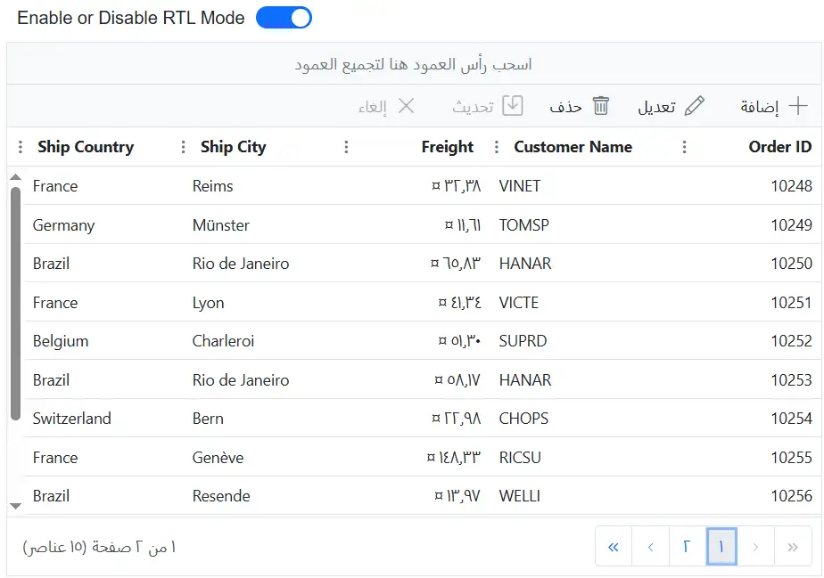

## See Also

- [Globalization in Blazor Application](https://blazor.syncfusion.com/documentation/common/globalization).
