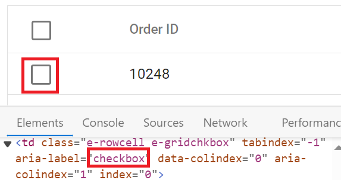
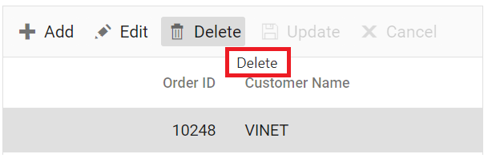
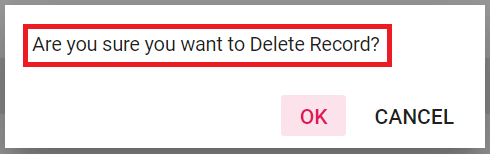
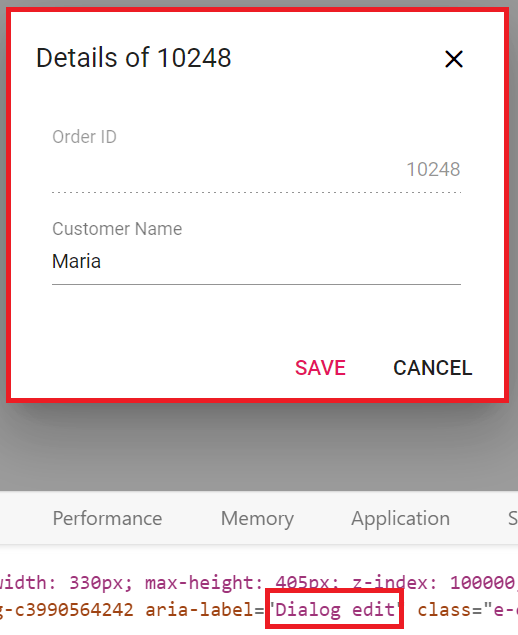
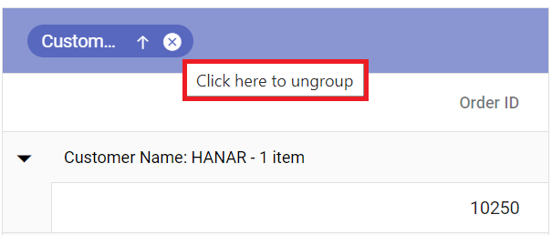
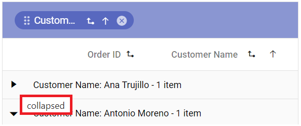
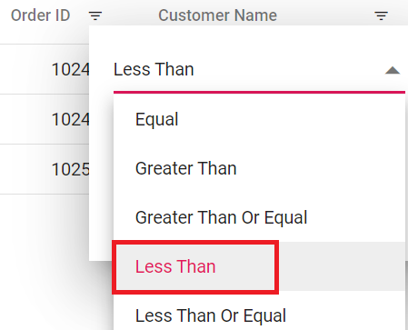
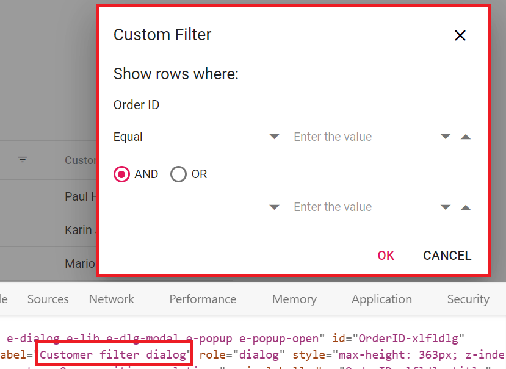
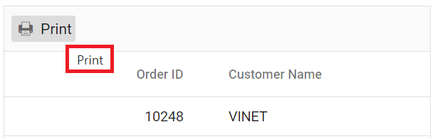
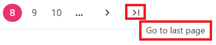

# Globalization in Syncfusion Blazor DataGrid

The Syncfusion Blazor DataGrid provides a feature known as Globalization (global and local), which makes the application more accessible and useful for individuals from different regions and language backgrounds. You have the ability to view data in your preferred language and format, resulting in an enhanced overall experience.

## Localization

The Syncfusion Blazor DataGrid supports localization, allowing you to customize the text used in the Grid to suit different languages or cultural preferences. With this library, With this feature, you can change static text on various elements, such as **group drop area text** and **pager information text**, to different cultures, such as **Arabic**, **Deutsch**, **French**, and more. For detailed instructions, refer to the [Blazor Localization](https://blazor.syncfusion.com/documentation/common/localization) topic to localize Syncfusion Blazor components.

The following list of properties and its values are used in the Grid.

**Data Rendering**

Locale key words |Text | Example 
-----|-----|-----
EmptyRecord | No records to display | 
EmptyDataSourceError | DataSource must not be empty at initial load since columns are generated from dataSource in AutoGenerate Column Grid

**Columns**

Locale key words |Text | Example 
-----|-----|-----
True | true | 
False | false | 
ColumnHeader | column header  | 
TemplateCell | is template cell | 
ClipBoard | clipboard | 
CheckBoxLabel | checkbox | 

**ColumnChooser**

Locale key words |Text | Example 
-----|-----|-----
Columnchooser | Columns | 
ChooseColumns | Choose Column | 
ColumnChooserDialogARIA | Column chooser | 

**Editing**

Locale key words |Text | Example 
-----|-----|-----
Add | Add | 
Edit| Edit | 
Cancel| Cancel | 
Update| Update | 
Delete | Delete | 
Save | Save | 
EditOperationAlert | No records selected for edit operation | 
DeleteOperationAlert | No records selected for delete operation | 
SaveButton | Save | 
OKButton | OK | 
CancelButton | Cancel | 
EditFormTitle | Details of | 
AddFormTitle | Add New Record | 
BatchSaveConfirm | Are you sure you want to save changes? | 
BatchSaveLostChanges | Unsaved changes will be lost. Are you sure you want to continue? | 
ConfirmDelete | Are you sure you want to Delete Record? | 
CancelEdit | Are you sure you want to Cancel the changes? | 
DialogEditARIA | Edit dialog | 
CommandColumnAria | is Command column column header  | 
DialogEdit | Dialog edit | 

**Grouping**

Locale key words |Text | Example 
-----|-----|-----
GroupDropArea | Drag a column header here to group its column | 
UnGroup | Click here to ungroup | 
GroupDisable | Grouping is disabled for this column | 
Item | item | 
Items | items | 
UnGroupButton | Click here to ungroup |
GroupDescription | Press Ctrl space to group | 
GroupButton | Group button | 
UnGroupAria | ungroup button | 
GroupSeperator | Separator for the grouped columns | 
UnGroupIcon | ungroup the grouped column  | 
GroupedSortIcon | sort the grouped column  | 
GroupedDrag | Drag the grouped column | 
GroupCaption | is groupcaption cell | 
Expanded | Expanded | 
Collapsed | Collapsed | 

**Filtering**

Locale key words |Text | Example 
-----|-----|-----
InvalidFilterMessage | Invalid Filter Data
FilterbarTitle | \s filter bar cell | 
Matchs | No Matches Found | 
FilterButton | Filter | 
ClearButton | Clear | 
StartsWith | Starts With | 
EndsWith | Ends With | 
Contains | Contains | 
Equal | Equal | 
NotEqual | Not Equal | 
LessThan | Less Than | 
LessThanOrEqual | Less Than Or Equal | 
GreaterThan | Greater Than | 
GreaterThanOrEqual | Greater Than Or Equal | 
ChooseDate | Choose a Date | 
EnterValue | Enter the value | 
SelectAll | Select All | 
Blanks | Blanks | 
FilterTrue | True | 
FilterFalse | False | 
NoResult | No Matches Found | 
ClearFilter | Clear Filter | 
NumberFilter | Number Filters | 
TextFilter | Text Filters | 
DateFilter | Date Filters | 
DateTimeFilter | DateTime Filters | 
MatchCase | Match Case | 
Between | Between | 
CustomFilter | Custom Filter | 
CustomFilterPlaceHolder | Enter the value | 
CustomFilterDatePlaceHolder | Choose a date | 
AND | AND | 
OR | OR | 
ShowRowsWhere | Show rows where: | 
NotStartsWith | Does Not Start With | 
Like | Like | 
NotEndsWith | Does Not End With | 
NotContains | Does Not Contain | 
IsNull | Null | 
NotNull | Not Null | 
IsEmpty | Empty | 
IsNotEmpty | Not Empty | 
AddCurrentSelection | Add current selection to filter | 
FilterMenuDialogARIA | Filter menu dialog | 
ExcelFilterDialogARIA | Excel filter dialog | 
CustomFilterDialogARIA | Custom filter dialog | 
SortAtoZ | Sort A to Z | 
SortZtoA | Sort Z to A | 
SortByOldest | Sort by Oldest | 
SortByNewest | Sort by Newest | 
SortSmallestToLargest | Sort Smallest to Largest | 
SortLargestToSmallest | Sort Largest to Smallest | 
FilterDescription | Press Alt Down to open filter Menu | 

**Searching**

Locale key words |Text | Example 
-----|-----|-----
Search | Search | 
SearchColumns | search columns
Clear | Clear | 

**Sorting**

Locale key words |Text | Example 
-----|-----|-----
Sort | Sort | 
SortDescription | Press Enter to sort | 

**Toolbar**

Locale key words |Text | Example 
-----|-----|-----
Print | Print | 
Pdfexport | PDF Export | 
Excelexport | Excel Export | 
Csvexport | CSV Export | 

**ColumnMenu**

Locale key words |Text | Example 
-----|-----|-----
FilterMenu | Filter | 
AutoFitAll | Autofit all columns |
AutoFit | Autofit this column |
ColumnMenuDialogARIA | Column menu dialog | 
ColumnMenuDescription | Press Alt Down to open Column Menu | 

**ContextMenu**

Locale key words |Text | Example 
-----|-----|-----
Copy | Copy | 
Group | Group by this column | 
Ungroup | Ungroup by this column | 
autoFitAll | Auto Fit all columns | 
autoFit | Auto Fit this column | 
Export | Export | 
FirstPage | First Page | 
LastPage | Last Page | 
PreviousPage | Previous Page | 
NextPage | Next Page | 
SortAscending | Sort Ascending | 
SortDescending | Sort Descending | 
EditRecord | Edit Record | 
DeleteRecord | Delete Record | 

**Pager**

Locale key words |Text | Example 
-----|-----|-----
currentPageInfo | {0} of {1} pages | 
totalItemsInfo | ({0} items) | 
firstPageTooltip | Go to first page | 
lastPageTooltip | Go to last page | 
nextPageTooltip | Go to next page | 
previousPageTooltip | Go to previous page | 
nextPagerTooltip | Go to next pager items | 
previousPagerTooltip | Go to previous pager items | 
pagerDropDown | Items per page | 
pagerAllDropDown | Items | 
All | All | 
totalItemInfo | ({0} item) | 
Container | Pager Container | 
Information | Pager Information |
ExternalMsg | Pager external message | 
Page | Page  |
Of |  of  | 
Pages |  Pages |

### Switch the different localization

The Syncfusion Blazor DataGrid allows you to switch the localization from one culture to another culture. This will be useful when you want to change the localization based on your requirements. For more details, you can refer to the official documentation on [dynamically setting the culture](https://blazor.syncfusion.com/documentation/common/localization?cs-save-lang=1&cs-lang=razor#dynamically-set-the-culture).

To switch to a different localization, follow these steps:

**1. Create a Blazor web app**
 
You can create a **Blazor Web App** named **LocalizationSample** using Visual Studio 2022, either via [Microsoft Templates](https://learn.microsoft.com/en-us/aspnet/core/blazor/tooling?view=aspnetcore-8.0) or the [Syncfusion<sup style="font-size:70%">&reg;</sup> Blazor Extension](https://blazor.syncfusion.com/documentation/visual-studio-integration/template-studio). Make sure to configure the appropriate [interactive render mode](https://learn.microsoft.com/en-us/aspnet/core/blazor/components/render-modes?view=aspnetcore-8.0#render-modes) and [interactivity location](https://learn.microsoft.com/en-us/aspnet/core/blazor/tooling?view=aspnetcore-8.0&pivots=windows).

**2. Install Syncfusion Blazor Grid and Themes NuGet packages**
 
To add the Blazor DataGrid in the app, open the NuGet Package Manager in Visual Studio (*Tools → NuGet Package Manager → Manage NuGet Packages for Solution*), search and install [Syncfusion.Blazor.Grid](https://www.nuget.org/packages/Syncfusion.Blazor.Grid/) and [Syncfusion.Blazor.Themes](https://www.nuget.org/packages/Syncfusion.Blazor.Themes/).
 
If your Blazor Web App uses `WebAssembly` or `Auto` render modes, install the Syncfusion Blazor NuGet packages in the client project.
 
Alternatively, use the following Package Manager commands:
 
```powershell
Install-Package Syncfusion.Blazor.Grid -Version {{ site.releaseversion }}
Install-Package Syncfusion.Blazor.Themes -Version {{ site.releaseversion }}
Install-Package Syncfusion.Blazor.Buttons -Version {{ site.releaseversion }}
```
 
> Syncfusion Blazor components are available on [nuget.org](https://www.nuget.org/packages?q=syncfusion.blazor). Refer to the [NuGet packages](https://blazor.syncfusion.com/documentation/nuget-packages) topic for a complete list of available packages.
 
**3. Register Syncfusion Blazor service**
 
- Open the **~/_Imports.razor** file and import the required namespaces.
 
```razor
@using Syncfusion.Blazor
@using Syncfusion.Blazor.Grids
@using Syncfusion.Blazor.Buttons
```
  
**4. Add stylesheet and script resources**
 
Include the theme stylesheet and script references in the **~/Components/App.razor** file.
 
```html
<head>
    ....
    <link href="_content/Syncfusion.Blazor.Themes/bootstrap5.css" rel="stylesheet" />
</head>
....
<body>
    ....
    <script src="_content/Syncfusion.Blazor.Core/scripts/syncfusion-blazor.min.js" type="text/javascript"></script>
</body>
```
 
> * Refer to the [Blazor Themes](https://blazor.syncfusion.com/documentation/appearance/themes) topic for various methods to include themes (e.g., Static Web Assets, CDN, or CRG).
> * Set the `rendermode` to **InteractiveServer** or **InteractiveAuto** in your Blazor Web App configuration.

**5. Create and register localization service**

Create a **SyncfusionLocalizer.cs** file and add the following code. For detailed steps on creating and registering a localization service, refer to the [Blazor Localization documentation](https://blazor.syncfusion.com/documentation/common/localization?cs-save-lang=1&cs-lang=csharp#create-and-register-localization-service).




using Syncfusion.Blazor;

namespace LocalizationSample.Client
{
    public class SyncfusionLocalizer : ISyncfusionStringLocalizer
    {
        // To get the locale key from mapped resources file
        public string GetText(string key)
        {
            return this.ResourceManager.GetString(key);
        }

        // To access the resource file and get the exact value for locale key

        public System.Resources.ResourceManager ResourceManager
        {
            get
            {
                // Replace the ApplicationNamespace with your application name.
                return LocalizationSample.Client.Resources.SfResources.ResourceManager;
            }
        }
    }
}




**6. Configure ~/Program.cs file**

* **Set the Culture of the Application:** In the client-side **~/Program.cs** , use JavaScript Interop to retrieve the user's culture setting from local storage. If none is found, set the default to **en-US**.

* **Register Services:** Register the `SyncfusionLocalizer` and Syncfusion Blazor services in both **~/Program.cs**  files.




using LocalizationSample.Client;
using Microsoft.AspNetCore.Components.WebAssembly.Hosting;
using Microsoft.JSInterop;
using Syncfusion.Blazor;
using System.Globalization;

var builder = WebAssemblyHostBuilder.CreateDefault(args);

// Register the Syncfusion Blazor services.
builder.Services.AddSyncfusionBlazor();

//Register the Syncfusion locale service to localize Syncfusion Blazor components.
builder.Services.AddSingleton(typeof(ISyncfusionStringLocalizer), typeof(SyncfusionLocalizer));
Syncfusion.Licensing.SyncfusionLicenseProvider.RegisterLicense("YOUR LICENSE KEY");
var host = builder.Build();

//Setting culture of the application.
var jsInterop = host.Services.GetRequiredService<IJSRuntime>();
var result = await jsInterop.InvokeAsync<string>("cultureInfo.get");
CultureInfo culture;
if (result != null)
{
    culture = new CultureInfo(result);
}
else
{
    culture = new CultureInfo("en-US");
    await jsInterop.InvokeVoidAsync("cultureInfo.set", "en-US");
}
CultureInfo.DefaultThreadCurrentCulture = culture;
CultureInfo.DefaultThreadCurrentUICulture = culture;
await builder.Build().RunAsync();




**7: In the project file, add the following code:**

```
<PropertyGroup>
    <BlazorWebAssemblyLoadAllGlobalizationData>true</BlazorWebAssemblyLoadAllGlobalizationData>
</PropertyGroup>

```
 
**8. Add javaScript function for culture management**

For a Blazor Web App, add the following JavaScript function to the **~/Components/App.razor** file (after the Blazor `<script>` tag and before the closing `</body>`). This function retrieves and sets the user's selected culture in the browser's local storage.




<!DOCTYPE html>
<html lang="en">
<head>
    <meta charset="utf-8" />
    <meta name="viewport" content="width=device-width, initial-scale=1.0" />
    <base href="/" />
    <link rel="stylesheet" href="bootstrap/bootstrap.min.css" />
    <link rel="stylesheet" href="app.css" />
    <link rel="stylesheet" href="LocalizationSample.styles.css" />
    <link rel="icon" type="image/png" href="favicon.png" />
    <link href="_content/Syncfusion.Blazor.Themes/bootstrap5.css" rel="stylesheet" />
    <HeadOutlet />
</head>
<body>
    <Routes />
    <script src="_framework/blazor.web.js"></script>
    <script>
        window.cultureInfo = {
            get: () => window.localStorage['BlazorCulture'],
            set: (value) => window.localStorage['BlazorCulture'] = value
        };
    </script>
    <script src="_content/Syncfusion.Blazor.Core/scripts/syncfusion-blazor.min.js" type="text/javascript"></script>
</body>
</html>




**9. Configure culture switching with Syncfusion Grid** 

In the **Counter.razor** file, add the following code to change the culture and display a Syncfusion Grid with a Button to switch between English (en-US) and French (fr-FR):
 



@page "/counter"
@rendermode InteractiveAuto
@using System.Globalization
@inject IJSRuntime JSRuntime
@inject NavigationManager NavigationManager
@using LocalizationSample.Client.Data

<div style="padding: 10px 10px">
    <SfButton CssClass="e-outline" @onclick='() => ChangeCulture("en-US")' Content="Change to English (en-US)"></SfButton>
    <SfButton CssClass="e-outline" style="margin-left: 5px;" @onclick='() => ChangeCulture("fr-FR")' Content="Change to French (fr-FR)"></SfButton>
</div>

<SfGrid DataSource="@Orders" AllowFiltering="true" AllowPaging="true" Height="315">
    <GridFilterSettings Type="Syncfusion.Blazor.Grids.FilterType.Menu"></GridFilterSettings>
    <GridColumns>
        <GridColumn Field=@nameof(OrderData.OrderID) HeaderText="Order ID" TextAlign="TextAlign.Right" Width="120"></GridColumn>
        <GridColumn Field=@nameof(OrderData.CustomerID) HeaderText="Customer Name" Width="150"></GridColumn>
        <GridColumn Field=@nameof(OrderData.Freight) HeaderText="Freight" Format="C2" TextAlign="TextAlign.Right" Width="120"></GridColumn>
        <GridColumn Field=@nameof(OrderData.ShipCity) HeaderText="Ship City" Width="130"></GridColumn>
        <GridColumn Field=@nameof(OrderData.ShipCountry) HeaderText="Ship Country" Width="130"></GridColumn>
    </GridColumns>
</SfGrid>

@code {
    public List<OrderData> Orders { get; set; }

    protected override void OnInitialized()
    {
        Orders = OrderData.GetAllRecords();
    }

    private async Task ChangeCulture(string culture)
    {
        await JSRuntime.InvokeVoidAsync("cultureInfo.set", culture);
        NavigationManager.NavigateTo(NavigationManager.Uri, forceLoad: true);
    }
}
 




**11. Create a model class**

Create a new folder named **Data**. Then, add a model class named **OrderData.cs** in the **Data** folder to represent the order data.




namespace LocalizationSample.Client.Data
{
    public class OrderData
    {
        public OrderData(int orderID, string customerID, double freight, string shipCity, string shipCountry)
        {
            this.OrderID = orderID;
            this.CustomerID = customerID;
            this.Freight = freight;
            this.ShipCity = shipCity;
            this.ShipCountry = shipCountry;
        }
        public static List<OrderData> GetAllRecords()
        {
            return new List<OrderData>
            {
                new OrderData(10248, "VINET", 32.38, "Reims", "France"),
                new OrderData(10249, "TOMSP", 11.61, "Münster", "Germany"),
                new OrderData(10250, "HANAR", 65.83, "Rio de Janeiro", "Brazil"),
                new OrderData(10251, "VICTE", 41.34, "Lyon", "France"),
                new OrderData(10252, "SUPRD", 51.30, "Charleroi", "Belgium"),
                new OrderData(10253, "HANAR", 58.17, "Rio de Janeiro", "Brazil"),
                new OrderData(10254, "CHOPS", 22.98, "Bern", "Switzerland"),
                new OrderData(10255, "RICSU", 148.33, "Genève", "France"),
                new OrderData(10256, "WELLI", 13.97, "Resende", "Brazil"),
                new OrderData(10257, "HILAA", 81.91, "San Cristóbal", "Mexico"),
                new OrderData(10258, "ERNSH", 140.51, "Graz", "Austria"),
                new OrderData(10259, "CENTC", 3.25, "México D.F.", "Mexico"),
                new OrderData(10260, "OTTIK", 55.09, "Köln", "Germany"),
                new OrderData(10261, "QUEDE", 3.05, "Rio de Janeiro", "Brazil"),
                new OrderData(10262, "RATTC", 48.29, "Albuquerque", "USA")
            };
        }
        public int OrderID { get; set; }
        public string CustomerID { get; set; }
        public double Freight { get; set; }
        public string ShipCity { get; set; }
        public string ShipCountry { get; set; }
    }
}




**12. Run the application**
 
When you run the application, the Blazor DataGrid will display data fetched from the API.


## Right to Left - RTL

The Right to Left (RTL) feature in the Syncfusion Blazor DataGrid allows you to switch the text direction and layout from left-to-right to right-to-left. This feature is especially beneficial for interacting with the grid in languages that are written and read from right to left, such as **Arabic**, **Farsi,** **Urdu**, and others. Enabling RTL significantly improves the experience and accessibility for such languages.

To enable RTL in the Syncfusion Blazor DataGrid, you can use the [EnableRtl](https://help.syncfusion.com/cr/blazor/Syncfusion.Blazor.Grids.SfGrid-1.html#Syncfusion_Blazor_Grids_SfGrid_1_EnableRtl) property. This property switches the text direction and layout from left-to-right to right-to-left.

To achieve this, follow the steps below:

**1. Create a Blazor web app**
 
You can create a **Blazor Web App** named **LocalizationSample** using Visual Studio 2022, either via [Microsoft Templates](https://learn.microsoft.com/en-us/aspnet/core/blazor/tooling?view=aspnetcore-8.0) or the [Syncfusion<sup style="font-size:70%">&reg;</sup> Blazor Extension](https://blazor.syncfusion.com/documentation/visual-studio-integration/template-studio). Make sure to configure the appropriate [interactive render mode](https://learn.microsoft.com/en-us/aspnet/core/blazor/components/render-modes?view=aspnetcore-8.0#render-modes) and [interactivity location](https://learn.microsoft.com/en-us/aspnet/core/blazor/tooling?view=aspnetcore-8.0&pivots=windows).

**2. Install Syncfusion Blazor Grid and Themes NuGet packages**
 
To add the Blazor DataGrid in the app, open the NuGet Package Manager in Visual Studio (*Tools → NuGet Package Manager → Manage NuGet Packages for Solution*), search and install [Syncfusion.Blazor.Grid](https://www.nuget.org/packages/Syncfusion.Blazor.Grid/) and [Syncfusion.Blazor.Themes](https://www.nuget.org/packages/Syncfusion.Blazor.Themes/).
 
If your Blazor Web App uses `WebAssembly` or `Auto` render modes, install the Syncfusion Blazor NuGet packages in the client project.
 
Alternatively, use the following Package Manager commands:
 
```powershell
Install-Package Syncfusion.Blazor.Grid -Version {{ site.releaseversion }}
Install-Package Syncfusion.Blazor.Themes -Version {{ site.releaseversion }}
Install-Package Syncfusion.Blazor.Buttons -Version {{ site.releaseversion }}
```
 
> Syncfusion Blazor components are available on [nuget.org](https://www.nuget.org/packages?q=syncfusion.blazor). Refer to the [NuGet packages](https://blazor.syncfusion.com/documentation/nuget-packages) topic for a complete list of available packages.
 
**3. Register Syncfusion Blazor service**
 
- Open the **~/_Imports.razor** file and import the required namespaces.
 
```razor
@using Syncfusion.Blazor
@using Syncfusion.Blazor.Grids
@using Syncfusion.Blazor.Buttons
```
  
**4. Add stylesheet and script resources**
 
Include the theme stylesheet and script references in the **~/Components/App.razor** file.
 
```html
<head>
    ....
    <link href="_content/Syncfusion.Blazor.Themes/bootstrap5.css" rel="stylesheet" />
</head>
....
<body>
    ....
    <script src="_content/Syncfusion.Blazor.Core/scripts/syncfusion-blazor.min.js" type="text/javascript"></script>
</body>
```
 
> * Refer to the [Blazor Themes](https://blazor.syncfusion.com/documentation/appearance/themes) topic for various methods to include themes (e.g., Static Web Assets, CDN, or CRG).
> * Set the `rendermode` to **InteractiveServer** or **InteractiveAuto** in your Blazor Web App configuration.

**5. Create and register localization service**

Create a **SyncfusionLocalizer.cs** file and add the following code. For detailed steps on creating and registering a localization service, refer to the [Blazor Localization documentation](https://blazor.syncfusion.com/documentation/common/localization?cs-save-lang=1&cs-lang=csharp#create-and-register-localization-service).




using Syncfusion.Blazor;

namespace LocalizationSample.Client
{
    public class SyncfusionLocalizer : ISyncfusionStringLocalizer
    {
        // To get the locale key from mapped resources file
        public string GetText(string key)
        {
            return this.ResourceManager.GetString(key);
        }

        // To access the resource file and get the exact value for locale key

        public System.Resources.ResourceManager ResourceManager
        {
            get
            {
                // Replace the ApplicationNamespace with your application name.
                return LocalizationSample.Client.Resources.SfResources.ResourceManager;
            }
        }
    }
}




**6. Configure ~/Program.cs file**

Register the `SyncfusionLocalizer` and Syncfusion Blazor services in both **~/Program.cs**  files.
 



using LocalizationSample.Client;
using Syncfusion.Blazor;

builder.Services.AddSyncfusionBlazor();
builder.Services.AddSingleton(typeof(ISyncfusionStringLocalizer), typeof(SyncfusionLocalizer));




**8. Setting the culture in Blazor start option**

* Add the **autostart="false"** attribute to the Blazor <script> tag to prevent Blazor from starting automatically.

* Add the script block below Blazor’s `<script>` tag and before the closing `</body>` tag to start blazor with specific culture.

* Use the `Blazor.start` method and set the `applicationCulture` to the desired culture code.




<!DOCTYPE html>
<html lang="en">
<head>
    <meta charset="utf-8" />
    <meta name="viewport" content="width=device-width, initial-scale=1.0" />
    <base href="/" />
    <link rel="stylesheet" href="bootstrap/bootstrap.min.css" />
    <link rel="stylesheet" href="app.css" />
    <link rel="stylesheet" href="LocalizationSample.styles.css" />
    <link rel="icon" type="image/png" href="favicon.png" />
    <link href="_content/Syncfusion.Blazor.Themes/bootstrap5.css" rel="stylesheet" />
    <HeadOutlet />
</head>
<body>
    <Routes />
    <script src="_framework/blazor.web.js" autostart="false"></script>
    <script>
        Blazor.start({
            webAssembly: {
                applicationCulture: 'ar'
            }
        });
    </script>
</body>
</html>




**9. Enable or disable RTL mode using toggle Switch**

The [EJ2 Toggle Switch Button](https://blazor.syncfusion.com/documentation/toggle-switch-button) is added to enable or disable the Right-to-Left (RTL) feature for the Arabic (ar-AE) locale. When the switch is toggled, the [ValueChange](http://help.syncfusion.com/cr/blazor/Syncfusion.Blazor.Buttons.SfSwitch-1.html#Syncfusion_Blazor_Buttons_SfSwitch_1_ValueChange) event is triggered, and the [EnableRtl](https://help.syncfusion.com/cr/blazor/Syncfusion.Blazor.Grids.SfGrid-1.html#Syncfusion_Blazor_Grids_SfGrid_1_EnableRtl) property of the Grid is updated accordingly.




@page "/counter"
@rendermode InteractiveAuto

@using LocalizationSample.Client.Models

<div style="display: flex; align-items: center; gap: 10px; padding: 10px;">
    <label style="margin: 0;">Enable or Disable RTL Mode</label>
    <SfSwitch ValueChange="Change" TChecked="bool"></SfSwitch>
</div>


<SfGrid @ref="Grid" DataSource="@Orders" AllowSorting="true" AllowGrouping="true" AllowFiltering="true" ShowColumnMenu="true" ShowColumnChooser="true" AllowPaging="true" Height="315" EnableRtl="@IsRtl" Toolbar="@(new List<string>() { "Add", "Edit", "Delete", "Update", "Cancel" })">
    <GridFilterSettings Type="Syncfusion.Blazor.Grids.FilterType.Menu"></GridFilterSettings>
    <GridEditSettings AllowAdding="true" AllowEditing="true" AllowDeleting="true" Mode="EditMode.Normal"></GridEditSettings>
    <GridColumns>
        <GridColumn Field=@nameof(OrderData.OrderID) HeaderText="Order ID" TextAlign="TextAlign.Right" Width="120"></GridColumn>
        <GridColumn Field=@nameof(OrderData.CustomerID) HeaderText="Customer Name" Width="150"></GridColumn>
        <GridColumn Field=@nameof(OrderData.Freight) HeaderText="Freight" Format="C2" TextAlign="TextAlign.Right" Width="120"></GridColumn>
        <GridColumn Field=@nameof(OrderData.ShipCity) HeaderText="Ship City" Width="130"></GridColumn>
        <GridColumn Field=@nameof(OrderData.ShipCountry) HeaderText="Ship Country" Width="130"></GridColumn>
    </GridColumns>
</SfGrid>

@code {
    private SfGrid<OrderData> Grid;

    public List<OrderData> Orders { get; set; }
    public bool IsRtl { get; set; } = false;

    protected override void OnInitialized()
    {
        Orders = OrderData.GetAllRecords();
    }

    private void Change(Syncfusion.Blazor.Buttons.ChangeEventArgs<bool> args)
    {
        IsRtl = args.Checked;
        Grid.Refresh();
    }
}
 



**11. Create a model class**

Create a new folder named **Models**. Then, add a model class named **OrderData.cs** in the **Models** folder to represent the order data.




namespace LocalizationSample.Client.Models
{
    public class OrderData
    {
        public OrderData(int orderID, string customerID, double freight, string shipCity, string shipCountry)
        {
            this.OrderID = orderID;
            this.CustomerID = customerID;
            this.Freight = freight;
            this.ShipCity = shipCity;
            this.ShipCountry = shipCountry;
        }
        public static List<OrderData> GetAllRecords()
        {
            return new List<OrderData>
            {
                new OrderData(10248, "VINET", 32.38, "Reims", "France"),
                new OrderData(10249, "TOMSP", 11.61, "Münster", "Germany"),
                new OrderData(10250, "HANAR", 65.83, "Rio de Janeiro", "Brazil"),
                new OrderData(10251, "VICTE", 41.34, "Lyon", "France"),
                new OrderData(10252, "SUPRD", 51.30, "Charleroi", "Belgium"),
                new OrderData(10253, "HANAR", 58.17, "Rio de Janeiro", "Brazil"),
                new OrderData(10254, "CHOPS", 22.98, "Bern", "Switzerland"),
                new OrderData(10255, "RICSU", 148.33, "Genève", "France"),
                new OrderData(10256, "WELLI", 13.97, "Resende", "Brazil"),
                new OrderData(10257, "HILAA", 81.91, "San Cristóbal", "Mexico"),
                new OrderData(10258, "ERNSH", 140.51, "Graz", "Austria"),
                new OrderData(10259, "CENTC", 3.25, "México D.F.", "Mexico"),
                new OrderData(10260, "OTTIK", 55.09, "Köln", "Germany"),
                new OrderData(10261, "QUEDE", 3.05, "Rio de Janeiro", "Brazil"),
                new OrderData(10262, "RATTC", 48.29, "Albuquerque", "USA")
            };
        }
        public int OrderID { get; set; }
        public string CustomerID { get; set; }
        public double Freight { get; set; }
        public string ShipCity { get; set; }
        public string ShipCountry { get; set; }
    }
}




**12. Run the application**
 
When you run the application, the Blazor DataGrid will display data fetched from the API.

