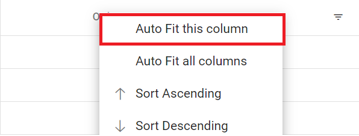

# Globalization in Blazor DataGrid

The Syncfusion<sup style="font-size:70%">&reg;</sup> Blazor DataGrid supports globalization to make applications accessible across regions and languages. Content can be displayed in the preferred culture with localized texts and culture-aware formats for a better user experience.

## Localization

The Syncfusion<sup style="font-size:70%">&reg;</sup> Blazor DataGrid supports localization, allowing customization of static texts used in the Grid for different languages or cultures. Text labels such as `group drop area text` and `pager information` can be localized to cultures like Arabic, Deutsch, French, and more. For detailed instructions, refer to the Blazor Localization documentation: [Localization](https://blazor.syncfusion.com/documentation/common/localization).

A subset of localizable strings used by the DataGrid is listed below.

**Data Rendering**

Locale key words |Text | Example 
-----|-----|-----
Grid_EmptyRecord | No records to display | 
Grid_EmptyDataSourceError | DataSource must not be empty at initial load since columns are generated from dataSource in AutoGenerate Column Grid

**Columns**

Locale key words |Text | Example 
-----|-----|-----
Grid_True | true | 
Grid_False | false | 

**ColumnChooser**

Locale key words |Text | Example 
-----|-----|-----
Grid_Columnchooser | Columns | 
Grid_ChooseColumns | Choose Column | 

**Editing**

Locale key words |Text | Example 
-----|-----|-----
Grid_Add | Add | 
Grid_Edit| Edit | 
Grid_Cancel| Cancel | 
Grid_Update| Update | 
Grid_Delete | Delete | 
Grid_Save | Save | 
Grid_EditOperationAlert | No records selected for edit operation | 
Grid_DeleteOperationAlert | No records selected for delete operation | 
Grid_SaveButton | Save | 
Grid_OKButton | OK | 
Grid_CancelButton | Cancel | 
Grid_EditFormTitle | Details of | 
Grid_AddFormTitle | Add New Record | 
Grid_BatchSaveConfirm | Are you sure you want to save changes? | 
Grid_BatchSaveLostChanges | Unsaved changes will be lost. Are you sure you want to continue? | 
Grid_ConfirmDelete | Are you sure you want to Delete Record? | 
Grid_CancelEdit | Are you sure you want to Cancel the changes? | 

**Grouping**

Locale key words |Text | Example 
-----|-----|-----
Grid_GroupDropArea | Drag a column header here to group its column | 
Grid_UnGroup | Click here to ungroup | 
Grid_GroupDisable | Grouping is disabled for this column | 
Grid_Item | item | 
Grid_Items | items | 
Grid_UnGroupButton | Click here to ungroup |
Grid_GroupDescription | Press Ctrl space to group | 

**Filtering**

Locale key words |Text | Example 
-----|-----|-----
Grid_InvalidFilterMessage | Invalid Filter Data
Grid_FilterbarTitle | \s filter bar cell | 
Grid_Matchs | No Matches Found | 
Grid_FilterButton | Filter | 
Grid_ClearButton | Clear | 
Grid_StartsWith | Starts With | 
Grid_EndsWith | Ends With | 
Grid_Contains | Contains | 
Grid_Equal | Equal | 
Grid_NotEqual | Not Equal | 
Grid_LessThan | Less Than | 
Grid_LessThanOrEqual | Less Than Or Equal | 
Grid_GreaterThan | Greater Than | 
Grid_GreaterThanOrEqual | Greater Than Or Equal | 
Grid_ChooseDate | Choose a Date | 
Grid_EnterValue | Enter the value | 
Grid_SelectAll | Select All | 
Grid_Blanks | Blanks | 
Grid_FilterTrue | True | 
Grid_FilterFalse | False | 
Grid_NoResult | No Matches Found | 
Grid_ClearFilter | Clear Filter | 
Grid_NumberFilter | Number Filters | 
Grid_TextFilter | Text Filters | 
Grid_DateFilter | Date Filters | 
Grid_DateTimeFilter | DateTime Filters | 
Grid_MatchCase | Match Case | 
Grid_Between | Between | 
Grid_CustomFilter | Custom Filter | 
Grid_CustomFilterPlaceHolder | Enter the value | 
Grid_CustomFilterDatePlaceHolder | Choose a date | 
Grid_AND | AND | 
Grid_OR | OR | 
Grid_ShowRowsWhere | Show rows where: | 

**Searching**

Locale key words |Text | Example 
-----|-----|-----
Grid_Search | Search | 
Grid_SearchColumns | search columns

**Toolbar**

Locale key words |Text | Example 
-----|-----|-----
Grid_Print | Print | 
Grid_Pdfexport | PDF Export | 
Grid_Excelexport | Excel Export | 
Grid_Csvexport | CSV Export | 

**ColumnMenu**

Locale key words |Text | Example 
-----|-----|-----
Grid_FilterMenu | Filter | 
Grid_AutoFitAll | Autofit all columns |
Grid_AutoFit | Autofit this column |

**ContextMenu**

Locale key words |Text | Example 
-----|-----|-----
Grid_Copy | Copy | 
Grid_Group | Group by this column | 
Grid_Ungroup | Ungroup by this column | 
Grid_autoFitAll | Auto Fit all columns | 
Grid_autoFit | Auto Fit this column | 
Grid_Export | Export | 
Grid_FirstPage | First Page | 
Grid_LastPage | Last Page | 
Grid_PreviousPage | Previous Page | 
Grid_NextPage | Next Page | 
Grid_SortAscending | Sort Ascending | 
Grid_SortDescending | Sort Descending | 
Grid_EditRecord | Edit Record | 
Grid_DeleteRecord | Delete Record | 

### Switch the different localization

The Syncfusion<sup style="font-size:70%">&reg;</sup> Blazor DataGrid allows switching the localization from one culture to another at runtime. This is useful when the culture needs to be changed based on user preference or application context. For more details, see [Dynamically set the culture](https://blazor.syncfusion.com/documentation/common/localization#dynamically-set-the-culture).

To switch to a different localization, follow these steps:

**Step 1: Create a Blazor web app**
 
Create a `Blazor Web App` named LocalizationSample using Visual Studio 2022, either via [Microsoft Templates](https://learn.microsoft.com/aspnet/core/blazor/tooling) or the [Syncfusion<sup style="font-size:70%">&reg;</sup> Blazor Extension](https://blazor.syncfusion.com/documentation/visual-studio-integration/template-studio). Configure the appropriate [interactive render mode](https://learn.microsoft.com/aspnet/core/blazor/components/render-modes#render-modes) and [interactivity location](https://learn.microsoft.com/aspnet/core/blazor/tooling?pivots=windows).

**Step 2: Install Syncfusion<sup style="font-size:70%">&reg;</sup> Blazor DataGrid and Themes NuGet packages**
 
To add the Syncfusion<sup style="font-size:70%">&reg;</sup> Blazor DataGrid, open NuGet Package Manager (*Tools → NuGet Package Manager → Manage NuGet Packages for Solution*), then install [Syncfusion.Blazor.Grid](https://www.nuget.org/packages/Syncfusion.Blazor.Grid/) and [Syncfusion.Blazor.Themes](https://www.nuget.org/packages/Syncfusion.Blazor.Themes/).
 
If the Blazor Web App uses WebAssembly or Auto render modes, install the Syncfusion<sup style="font-size:70%">&reg;</sup> Blazor NuGet packages in the client project.
 
Alternatively, use the following Package Manager commands:
 
```powershell
Install-Package Syncfusion.Blazor.Grid -Version {{ site.releaseversion }}
Install-Package Syncfusion.Blazor.Themes -Version {{ site.releaseversion }}
Install-Package Syncfusion.Blazor.Buttons -Version {{ site.releaseversion }}
```
 
> Syncfusion<sup style="font-size:70%">&reg;</sup> Blazor components are available on [nuget.org](https://www.nuget.org/packages?q=syncfusion.blazor). Refer to the [NuGet packages](https://blazor.syncfusion.com/documentation/nuget-packages) topic for a complete list of available packages.
 
**Step 3: Register Syncfusion<sup style="font-size:70%">&reg;</sup> Blazor service**
 
- Open the **~/_Imports.razor** file and import the required namespaces.
 
```cs
@using Syncfusion.Blazor
@using Syncfusion.Blazor.Grids
@using Syncfusion.Blazor.Buttons
```
  
**Step 4: Add stylesheet and script resources**
 
Include the theme stylesheet and script references in the **~/Components/App.razor** file for a Blazor Web App.
 
```html
<head>
    ....
    <link href="_content/Syncfusion.Blazor.Themes/bootstrap5.css" rel="stylesheet" />
</head>
....
<body>
    ....
    <script src="_content/Syncfusion.Blazor.Core/scripts/syncfusion-blazor.min.js" type="text/javascript"></script>
</body>
```
 
> * Refer to the [Blazor Themes](https://blazor.syncfusion.com/documentation/appearance/themes) topic for various methods to include themes (Static Web Assets, CDN, or CRG).
> * Set the rendermode to `InteractiveServer` or `InteractiveAuto` in the Blazor Web App configuration.

**Step 5: Create and register localization service**

Create a **SyncfusionLocalizer.cs** file and add the following code. For detailed steps on creating and registering a localization service, refer to the [Localization](https://blazor.syncfusion.com/documentation/common/localization#create-and-register-localization-service) documentation.




using Syncfusion.Blazor;

namespace LocalizationSample.Client
{
    public class SyncfusionLocalizer : ISyncfusionStringLocalizer
    {
        // To get the locale key from mapped resources file
        public string GetText(string key)
        {
            return this.ResourceManager.GetString(key);
        }

        // To access the resource file and get the exact value for locale key

        public System.Resources.ResourceManager ResourceManager
        {
            get
            {
                // Replace the ApplicationNamespace with your application name.
                return LocalizationSample.Client.Resources.SfResources.ResourceManager;
            }
        }
    }
}




**Step 6: Configure ~/Program.cs file**

- **Set the culture of the application:** In the client-side **~/Program.cs**, use JavaScript interop to retrieve the user's culture from local storage. If none is found, set the default to en-US.
- **Register services:** Register the SyncfusionLocalizer and Syncfusion<sup style="font-size:70%">&reg;</sup> Blazor services in **~/Program.cs**.




using LocalizationSample.Client;
using Microsoft.AspNetCore.Components.WebAssembly.Hosting;
using Microsoft.JSInterop;
using Syncfusion.Blazor;
using System.Globalization;

var builder = WebAssemblyHostBuilder.CreateDefault(args);

// Register the Syncfusion Blazor services.
builder.Services.AddSyncfusionBlazor();

//Register the Syncfusion locale service to localize Syncfusion Blazor components.
builder.Services.AddSingleton(typeof(ISyncfusionStringLocalizer), typeof(SyncfusionLocalizer));
Syncfusion.Licensing.SyncfusionLicenseProvider.RegisterLicense("YOUR LICENSE KEY");
var host = builder.Build();

//Setting culture of the application.
var jsInterop = host.Services.GetRequiredService<IJSRuntime>();
var result = await jsInterop.InvokeAsync<string>("cultureInfo.get");
CultureInfo culture;
if (result != null)
{
    culture = new CultureInfo(result);
}
else
{
    culture = new CultureInfo("en-US");
    await jsInterop.InvokeVoidAsync("cultureInfo.set", "en-US");
}
CultureInfo.DefaultThreadCurrentCulture = culture;
CultureInfo.DefaultThreadCurrentUICulture = culture;
await builder.Build().RunAsync();




**Step 7: In the project file, add the following code:**

```
<PropertyGroup>
    <BlazorWebAssemblyLoadAllGlobalizationData>true</BlazorWebAssemblyLoadAllGlobalizationData>
</PropertyGroup>

```
 
**Step 8: Add JavaScript function for culture management**

For a Blazor Web App, add the following JavaScript function to the **~/Components/App.razor** file (after the Blazor `<script>` tag and before the closing `</body>`). This function retrieves and sets the user's selected culture in the browser's local storage.




<!DOCTYPE html>
<html lang="en">
<head>
    <meta charset="utf-8" />
    <meta name="viewport" content="width=device-width, initial-scale=1.0" />
    <base href="/" />
    <link rel="stylesheet" href="bootstrap/bootstrap.min.css" />
    <link rel="stylesheet" href="app.css" />
    <link rel="stylesheet" href="LocalizationSample.styles.css" />
    <link rel="icon" type="image/png" href="favicon.png" />
    <link href="_content/Syncfusion.Blazor.Themes/bootstrap5.css" rel="stylesheet" />
    <HeadOutlet />
</head>
<body>
    <Routes />
    <script src="_framework/blazor.web.js"></script>
    <script>
        window.cultureInfo = {
            get: () => window.localStorage['BlazorCulture'],
            set: (value) => window.localStorage['BlazorCulture'] = value
        };
    </script>
    <script src="_content/Syncfusion.Blazor.Core/scripts/syncfusion-blazor.min.js" type="text/javascript"></script>
</body>
</html>




**Step 9: Configure culture switching with Syncfusion<sup style="font-size:70%">&reg;</sup> Blazor DataGrid** 

In the **Counter.razor** file, add the following code to change the culture and display a Grid with a button to switch between English (en-US) and French (fr-FR):
 



@page "/counter"
@rendermode InteractiveAuto
@using System.Globalization
@inject IJSRuntime JSRuntime
@inject NavigationManager NavigationManager
@using LocalizationSample.Client.Data

<div style="padding: 10px 10px">
    <SfButton CssClass="e-outline" @onclick='() => ChangeCulture("en-US")' Content="Change to English (en-US)"></SfButton>
    <SfButton CssClass="e-outline" style="margin-left: 5px;" @onclick='() => ChangeCulture("fr-FR")' Content="Change to French (fr-FR)"></SfButton>
</div>

<SfGrid DataSource="@Orders" AllowFiltering="true" AllowPaging="true" Height="315">
    <GridFilterSettings Type="Syncfusion.Blazor.Grids.FilterType.Menu"></GridFilterSettings>
    <GridColumns>
        <GridColumn Field=@nameof(OrderData.OrderID) HeaderText="Order ID" TextAlign="TextAlign.Right" Width="120"></GridColumn>
        <GridColumn Field=@nameof(OrderData.CustomerID) HeaderText="Customer Name" Width="150"></GridColumn>
        <GridColumn Field=@nameof(OrderData.Freight) HeaderText="Freight" Format="C2" TextAlign="TextAlign.Right" Width="120"></GridColumn>
        <GridColumn Field=@nameof(OrderData.ShipCity) HeaderText="Ship City" Width="130"></GridColumn>
        <GridColumn Field=@nameof(OrderData.ShipCountry) HeaderText="Ship Country" Width="130"></GridColumn>
    </GridColumns>
</SfGrid>

@code {
    public List<OrderData> Orders { get; set; }

    protected override void OnInitialized()
    {
        Orders = OrderData.GetAllRecords();
    }

    private async Task ChangeCulture(string culture)
    {
        await JSRuntime.InvokeVoidAsync("cultureInfo.set", culture);
        NavigationManager.NavigateTo(NavigationManager.Uri, forceLoad: true);
    }
}
 




**Step 10: Create a model class**

Create a new folder named `Data`. Then add a model class named `OrderData.cs` in the `Data` folder to represent the order data.




namespace LocalizationSample.Client.Data
{
    public class OrderData
    {
        public OrderData(int orderID, string customerID, double freight, string shipCity, string shipCountry)
        {
            this.OrderID = orderID;
            this.CustomerID = customerID;
            this.Freight = freight;
            this.ShipCity = shipCity;
            this.ShipCountry = shipCountry;
        }
        public static List<OrderData> GetAllRecords()
        {
            return new List<OrderData>
            {
                new OrderData(10248, "VINET", 32.38, "Reims", "France"),
                new OrderData(10249, "TOMSP", 11.61, "Münster", "Germany"),
                new OrderData(10250, "HANAR", 65.83, "Rio de Janeiro", "Brazil"),
                new OrderData(10251, "VICTE", 41.34, "Lyon", "France"),
                new OrderData(10252, "SUPRD", 51.30, "Charleroi", "Belgium"),
                new OrderData(10253, "HANAR", 58.17, "Rio de Janeiro", "Brazil"),
                new OrderData(10254, "CHOPS", 22.98, "Bern", "Switzerland"),
                new OrderData(10255, "RICSU", 148.33, "Genève", "France"),
                new OrderData(10256, "WELLI", 13.97, "Resende", "Brazil"),
                new OrderData(10257, "HILAA", 81.91, "San Cristóbal", "Mexico"),
                new OrderData(10258, "ERNSH", 140.51, "Graz", "Austria"),
                new OrderData(10259, "CENTC", 3.25, "México D.F.", "Mexico"),
                new OrderData(10260, "OTTIK", 55.09, "Köln", "Germany"),
                new OrderData(10261, "QUEDE", 3.05, "Rio de Janeiro", "Brazil"),
                new OrderData(10262, "RATTC", 48.29, "Albuquerque", "USA")
            };
        }
        public int OrderID { get; set; }
        public string CustomerID { get; set; }
        public double Freight { get; set; }
        public string ShipCity { get; set; }
        public string ShipCountry { get; set; }
    }
}




**Step 11: Run the application**
 
When the application runs, the Grid displays localized content and formats based on the current culture.


## Right to Left - RTL

The Right-to-left (RTL) feature switches the text direction and layout from left-to-right to right-to-left. This is beneficial for languages written and read right to left, such as `Arabic`, `Farsi`, and `Urdu`. Enabling RTL improves usability and accessibility for these languages.

To enable RTL in the Grid, set the [EnableRtl](https://help.syncfusion.com/cr/blazor/Syncfusion.Blazor.Grids.SfGrid-1.html#Syncfusion_Blazor_Grids_SfGrid_1_EnableRtl) property. This switches text direction and layout to right-to-left.

To achieve this, follow the steps below:

**Step 1:** Follow the steps from Step 1 to Step 5 in the following [link](https://blazor.syncfusion.com/documentation/datagrid/global-local#switch-the-different-localization), then continue with the steps below: [Switch the different localization](https://blazor.syncfusion.com/documentation/datagrid/global-local#switch-the-different-localization)

**Step 2: Configure ~/Program.cs file**

Register the SyncfusionLocalizer and Syncfusion<sup style="font-size:70%">&reg;</sup> Blazor services in both ~/Program.cs files.
 



using LocalizationSample.Client;
using Syncfusion.Blazor;

builder.Services.AddSyncfusionBlazor();
builder.Services.AddSingleton(typeof(ISyncfusionStringLocalizer), typeof(SyncfusionLocalizer));




**Step 3: Setting the culture in Blazor start option**

- Add the `autostart="false"` attribute to the Blazor <script> tag to prevent Blazor from starting automatically.
- Add the script block below Blazor’s `<script>` tag and before the closing `</body>` tag to start Blazor with a specific culture.
- Use the `Blazor.start` method and set `applicationCulture` to the desired culture code.




<!DOCTYPE html>
<html lang="en">
<head>
    <meta charset="utf-8" />
    <meta name="viewport" content="width=device-width, initial-scale=1.0" />
    <base href="/" />
    <link rel="stylesheet" href="bootstrap/bootstrap.min.css" />
    <link rel="stylesheet" href="app.css" />
    <link rel="stylesheet" href="LocalizationSample.styles.css" />
    <link rel="icon" type="image/png" href="favicon.png" />
    <link href="_content/Syncfusion.Blazor.Themes/bootstrap5.css" rel="stylesheet" />
    <HeadOutlet />
</head>
<body>
    <Routes />
    <script src="_framework/blazor.web.js" autostart="false"></script>
    <script>
        Blazor.start({
            webAssembly: {
                applicationCulture: 'ar'
            }
        });
    </script>
</body>
</html>




**Step 4: Enable or disable RTL mode using toggle Switch**

The [Toggle Switch Button](https://blazor.syncfusion.com/documentation/toggle-switch-button) is added to enable or disable the RTL feature for the Arabic (ar-AE) locale. When the switch is toggled, the [ValueChange](https://help.syncfusion.com/cr/blazor/Syncfusion.Blazor.Buttons.SfSwitch-1.html#Syncfusion_Blazor_Buttons_SfSwitch_1_ValueChange) event is triggered, and the [EnableRtl](https://help.syncfusion.com/cr/blazor/Syncfusion.Blazor.Grids.SfGrid-1.html#Syncfusion_Blazor_Grids_SfGrid_1_EnableRtl) property of the Grid is updated accordingly.




@page "/counter"
@rendermode InteractiveAuto

@using LocalizationSample.Client.Models

<div style="display: flex; align-items: center; gap: 10px; padding: 10px;">
    <label style="margin: 0;">Enable or Disable RTL Mode</label>
    <SfSwitch ValueChange="Change" TChecked="bool"></SfSwitch>
</div>


<SfGrid @ref="Grid" DataSource="@Orders" AllowSorting="true" AllowGrouping="true" AllowFiltering="true" ShowColumnMenu="true" ShowColumnChooser="true" AllowPaging="true" Height="315" EnableRtl="@isRTLEnabled" Toolbar="@(new List<string>() { "Add", "Edit", "Delete", "Update", "Cancel" })">
    <GridFilterSettings Type="Syncfusion.Blazor.Grids.FilterType.Menu"></GridFilterSettings>
    <GridEditSettings AllowAdding="true" AllowEditing="true" AllowDeleting="true" Mode="EditMode.Normal"></GridEditSettings>
    <GridColumns>
        <GridColumn Field=@nameof(OrderData.OrderID) HeaderText="Order ID" TextAlign="TextAlign.Right" Width="120"></GridColumn>
        <GridColumn Field=@nameof(OrderData.CustomerID) HeaderText="Customer Name" Width="150"></GridColumn>
        <GridColumn Field=@nameof(OrderData.Freight) HeaderText="Freight" Format="C2" TextAlign="TextAlign.Right" Width="120"></GridColumn>
        <GridColumn Field=@nameof(OrderData.ShipCity) HeaderText="Ship City" Width="130"></GridColumn>
        <GridColumn Field=@nameof(OrderData.ShipCountry) HeaderText="Ship Country" Width="130"></GridColumn>
    </GridColumns>
</SfGrid>

@code {
    private SfGrid<OrderData> Grid;

    public List<OrderData> Orders { get; set; }
    public bool isRTLEnabled { get; set; } = false;

    protected override void OnInitialized()
    {
        Orders = OrderData.GetAllRecords();
    }

    private void Change(Syncfusion.Blazor.Buttons.ChangeEventArgs<bool> args)
    {
        isRTLEnabled = args.Checked;
        Grid.Refresh();
    }
}
 



**Step 5: Create a model class**

Create a new folder named **Models**. Then add a model class named `OrderData.cs` in the `Models` folder to represent the order data.




namespace LocalizationSample.Client.Models
{
    public class OrderData
    {
        public OrderData(int orderID, string customerID, double freight, string shipCity, string shipCountry)
        {
            this.OrderID = orderID;
            this.CustomerID = customerID;
            this.Freight = freight;
            this.ShipCity = shipCity;
            this.ShipCountry = shipCountry;
        }
        public static List<OrderData> GetAllRecords()
        {
            return new List<OrderData>
            {
                new OrderData(10248, "VINET", 32.38, "Reims", "France"),
                new OrderData(10249, "TOMSP", 11.61, "Münster", "Germany"),
                new OrderData(10250, "HANAR", 65.83, "Rio de Janeiro", "Brazil"),
                new OrderData(10251, "VICTE", 41.34, "Lyon", "France"),
                new OrderData(10252, "SUPRD", 51.30, "Charleroi", "Belgium"),
                new OrderData(10253, "HANAR", 58.17, "Rio de Janeiro", "Brazil"),
                new OrderData(10254, "CHOPS", 22.98, "Bern", "Switzerland"),
                new OrderData(10255, "RICSU", 148.33, "Genève", "France"),
                new OrderData(10256, "WELLI", 13.97, "Resende", "Brazil"),
                new OrderData(10257, "HILAA", 81.91, "San Cristóbal", "Mexico"),
                new OrderData(10258, "ERNSH", 140.51, "Graz", "Austria"),
                new OrderData(10259, "CENTC", 3.25, "México D.F.", "Mexico"),
                new OrderData(10260, "OTTIK", 55.09, "Köln", "Germany"),
                new OrderData(10261, "QUEDE", 3.05, "Rio de Janeiro", "Brazil"),
                new OrderData(10262, "RATTC", 48.29, "Albuquerque", "USA")
            };
        }
        public int OrderID { get; set; }
        public string CustomerID { get; set; }
        public double Freight { get; set; }
        public string ShipCity { get; set; }
        public string ShipCountry { get; set; }
    }
}




**Step 6: Run the application**
 
When the application runs, the Grid reflects RTL layout and text direction according to the selected culture.

