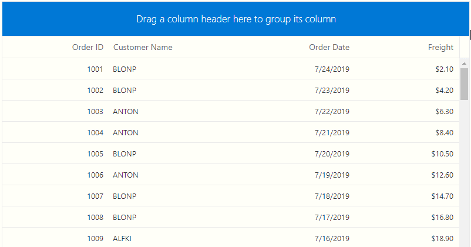

# Grouping in Blazor DataGrid Component

The DataGrid has options to group records by dragging and dropping the column header to the group drop area. When grouping is applied, datagrid records are organized into a hierarchical structure to facilitate easier expansion and collapse of records.

To enable grouping in the datagrid, set the [`AllowGrouping`](https://help.syncfusion.com/cr/blazor/Syncfusion.Blazor.Grids.SfGrid-1.html#Syncfusion_Blazor_Grids_SfGrid_1_AllowGrouping) as true. Grouping options can be configured through the [`GridGroupSettings`](https://help.syncfusion.com/cr/blazor/Syncfusion.Blazor.Grids.SfGrid-1.html#Syncfusion_Blazor_Grids_SfGrid_1_GroupSettings) component.

```cshtml
@using Syncfusion.Blazor.Grids

<SfGrid DataSource="@Orders" AllowGrouping="true" Height="400">
   <GridColumns>
     <GridColumn Field=@nameof(Order.OrderID) HeaderText="Order ID" TextAlign="TextAlign.Right" Width="120"></GridColumn>
     <GridColumn Field=@nameof(Order.CustomerID) HeaderText="Customer Name" Width="150"></GridColumn>
     <GridColumn Field=@nameof(Order.OrderDate) HeaderText=" Order Date" Format="d" Type="ColumnType.Date" TextAlign="TextAlign.Right" Width="130"></GridColumn>
     <GridColumn Field=@nameof(Order.Freight) HeaderText="Freight" Format="C2" TextAlign="TextAlign.Right" Width="120"></GridColumn>
   </GridColumns>
</SfGrid>

@code{
    public List<Order> Orders { get; set; }

    protected override void OnInitialized()
    {
        Orders = Enumerable.Range(1, 75).Select(x => new Order()
        {
            OrderID = 1000 + x,
            CustomerID = (new string[] { "ALFKI", "ANANTR", "ANTON", "BLONP", "BOLID" })[new Random().Next(5)],
            Freight = 2.1 * x,
            OrderDate = DateTime.Now.AddDays(-x),
        }).ToList();
    }

    public class Order {
        public int? OrderID { get; set; }
        public string CustomerID { get; set; }
        public DateTime? OrderDate { get; set; }
        public double? Freight { get; set; }
    }
}
```

The following GIF image represents a DataGrid Grouping.



> * You can group and ungroup columns by using the **GroupColumn** and **UngroupColumn** methods.
> * To disable grouping for a particular column, set the [AllowGrouping](https://help.syncfusion.com/cr/blazor/Syncfusion.Blazor.Grids.GridColumn.html#Syncfusion_Blazor_Grids_GridColumn_AllowGrouping) to false in **GridColumn** component.

## Initial group

To apply group at initial rendering, set the column field name in the [`Columns`](https://help.syncfusion.com/cr/blazor/Syncfusion.Blazor.Grids.GridGroupSettings.html#Syncfusion_Blazor_Grids_GridGroupSettings_Columns) property of **GridGroupSettings** component.

```cshtml
@using Syncfusion.Blazor.Grids

@{
    var Initial = (new string[] { "OrderID" });
}
<SfGrid DataSource="@Orders" AllowGrouping="true" Height="400">
     <GridGroupSettings Columns="@Initial"></GridGroupSettings>
    <GridColumns>
        <GridColumn Field=@nameof(Order.OrderID) HeaderText="Order ID" TextAlign="TextAlign.Right" Width="120"></GridColumn>
        <GridColumn Field=@nameof(Order.CustomerID) HeaderText="Customer Name" Width="150"></GridColumn>
        <GridColumn Field=@nameof(Order.OrderDate) HeaderText=" Order Date" Format="d" Type="ColumnType.Date" TextAlign="TextAlign.Right" Width="130"></GridColumn>
        <GridColumn Field=@nameof(Order.Freight) HeaderText="Freight" Format="C2" TextAlign="TextAlign.Right" Width="120"></GridColumn>
    </GridColumns>
</SfGrid>

@code{
    public List<Order> Orders { get; set; }

    protected override void OnInitialized()
    {
        Orders = Enumerable.Range(1, 75).Select(x => new Order()
        {
            OrderID = 1000 + x,
            CustomerID = (new string[] { "ALFKI", "ANANTR", "ANTON", "BLONP", "BOLID" })[new Random().Next(5)],
            Freight = 2.1 * x,
            OrderDate = DateTime.Now.AddDays(-x),
        }).ToList();
    }

    public class Order {
        public int? OrderID { get; set; }
        public string CustomerID { get; set; }
        public DateTime? OrderDate { get; set; }
        public double? Freight { get; set; }
    }
}
```

The following screenshot represents a DataGrid with initial grouping.


## Hide drop area

To avoid ungrouping or further grouping of a column after initial column grouping, define the [`ShowDropArea`](https://help.syncfusion.com/cr/blazor/Syncfusion.Blazor.Grids.GridGroupSettings.html#Syncfusion_Blazor_Grids_GridGroupSettings_ShowDropArea) of **GridGroupSettings** as false.

```cshtml
@using Syncfusion.Blazor.Grids

@{
    var Hide = (new string[] {"Freight"});
}
<SfGrid DataSource="@Orders" AllowGrouping="true" Height="400">
    <GridGroupSettings ShowDropArea="false" Columns=@Hide></GridGroupSettings>
    <GridColumns>
        <GridColumn Field=@nameof(Order.OrderID) HeaderText="Order ID" TextAlign="TextAlign.Right" Width="120"></GridColumn>
        <GridColumn Field=@nameof(Order.CustomerID) HeaderText="Customer Name" Width="150"></GridColumn>
        <GridColumn Field=@nameof(Order.OrderDate) HeaderText=" Order Date" Format="d" Type="ColumnType.Date" TextAlign="TextAlign.Right" Width="130"></GridColumn>
        <GridColumn Field=@nameof(Order.Freight) HeaderText="Freight" Format="C2" TextAlign="TextAlign.Right" Width="120"></GridColumn>
    </GridColumns>
</SfGrid>

@code{
    public List<Order> Orders { get; set; }

    protected override void OnInitialized()
    {
        Orders = Enumerable.Range(1, 75).Select(x => new Order()
        {
            OrderID = 1000 + x,
            CustomerID = (new string[] { "ALFKI", "ANANTR", "ANTON", "BLONP", "BOLID" })[new Random().Next(5)],
            Freight = 2.1 * x,
            OrderDate = DateTime.Now.AddDays(-x),
        }).ToList();
    }

    public class Order {
        public int? OrderID { get; set; }
        public string CustomerID { get; set; }
        public DateTime? OrderDate { get; set; }
        public double? Freight { get; set; }
    }
}
```

The following screenshot represents hiding the Group drop area in DataGrid.


<!--Group with paging

On grouping columns with paging feature, the aggregated information and total items are displayed based on the current page. The grid does not consider aggregated information and total items from other pages. To get additional details (aggregated information and total items) from other pages, set the [`DisablePageWiseAggregates`](https://help.syncfusion.com/cr/blazor/Syncfusion.Blazor.Grids.GridGroupSettings.html#Syncfusion_Blazor_Grids_GridGroupSettings_DisablePageWiseAggregates) property of **GridGroupSettings** to false.

> If remote data is bound to grid dataSource, two requests will be sent when performing grouping action; one for getting the grouped data and another for getting aggregate details and total items count. -->

## Group by format

By default, a column will be grouped by the data or value present for the particular row. To group the numeric or datetime column based on the mentioned format, you have to enable the [`EnableGroupByFormat`](https://help.syncfusion.com/cr/blazor/Syncfusion.Blazor.Grids.GridColumn.html#Syncfusion_Blazor_Grids_GridColumn_EnableGroupByFormat) property of the corresponding datagrid columns.

```cshtml
@using Syncfusion.Blazor.Grids

@{
    var Format = (new string[] { "Freight" });
}
<SfGrid DataSource="@Orders" AllowGrouping="true" Height="400">
    <GridGroupSettings ShowDropArea="false" Columns=@Format></GridGroupSettings>
    <GridColumns>
        <GridColumn Field=@nameof(Order.OrderID) HeaderText="Order ID" TextAlign="TextAlign.Right" Width="120"></GridColumn>
        <GridColumn Field=@nameof(Order.CustomerID) HeaderText="Customer Name" Width="150"></GridColumn>
        <GridColumn Field=@nameof(Order.OrderDate) HeaderText=" Order Date" Format="d" Type="ColumnType.Date" TextAlign="TextAlign.Right" Width="130"></GridColumn>
        <GridColumn Field=@nameof(Order.Freight) HeaderText="Freight" Format="C2" TextAlign="TextAlign.Right" EnableGroupByFormat="true" Width="120"></GridColumn>
    </GridColumns>
</SfGrid>

@code{
    public List<Order> Orders { get; set; }

    protected override void OnInitialized()
    {
        Orders = Enumerable.Range(1, 75).Select(x => new Order()
        {
            OrderID = 1000 + x,
            CustomerID = (new string[] { "ALFKI", "ANANTR", "ANTON", "BLONP", "BOLID" })[new Random().Next(5)],
            Freight = 2.1 * x,
            OrderDate = DateTime.Now.AddDays(-x),
        }).ToList();
    }

    public class Order {
        public int? OrderID { get; set; }
        public string CustomerID { get; set; }
        public DateTime? OrderDate { get; set; }
        public double? Freight { get; set; }
    }
}
```

## Grouping events

During the group action, the datagrid component triggers two events. The [`OnActionBegin`](https://help.syncfusion.com/cr/blazor/Syncfusion.Blazor.Grids.SfGrid-1.html) event triggers before the group action starts and the [`OnActionComplete`](https://help.syncfusion.com/cr/blazor/Syncfusion.Blazor.Grids.SfGrid-1.html) event triggers after the group action is completed. Using these events you can perform any action.

```cshtml
@using Syncfusion.Blazor.Grids

<SfGrid DataSource="@Orders" AllowGrouping="true">
    <GridEvents OnActionComplete="GroupActionHandler" OnActionBegin="GroupActionHandler" TValue="Order"></GridEvents>
    <GridColumns>
        <GridColumn Field=@nameof(Order.OrderID) HeaderText="Order ID" TextAlign="TextAlign.Right" Width="120"></GridColumn>
        <GridColumn Field=@nameof(Order.CustomerID) HeaderText="Customer Name" Width="150"></GridColumn>
        <GridColumn Field=@nameof(Order.OrderDate) HeaderText=" Order Date" Format="d" Type="ColumnType.Date" TextAlign="TextAlign.Right" Width="130"></GridColumn>
        <GridColumn Field=@nameof(Order.Freight) HeaderText="Freight" Format="C2" TextAlign="TextAlign.Right" Width="120"></GridColumn>
        <GridColumn Field=@nameof(Order.ShipCountry) HeaderText="Ship Country" Width="150"></GridColumn>
        </GridColumns>
</SfGrid>

@code{
    public List<Order> Orders { get; set; }

    protected override void OnInitialized()
    {
        Orders = Enumerable.Range(1, 75).Select(x => new Order()
        {
            OrderID = 1000 + x,
            CustomerID = (new string[] { "ALFKI", "ANANTR", "ANTON", "BLONP", "BOLID" })[new Random().Next(5)],
            Freight = 2.1 * x,
            OrderDate = DateTime.Now.AddDays(-x),
            ShipCountry = (new string[] { "USA", "UK", "JAPAN" })[new Random().Next(3)],
        }).ToList();
    }

    public class Order {
        public int? OrderID { get; set; }
        public string CustomerID { get; set; }
        public DateTime? OrderDate { get; set; }
        public double? Freight { get; set; }
        public string ShipCountry { get; set; }
    }
    public void GroupActionHandler(ActionEventArgs<Order> args){
        // You can get args.RequestType and other details.
    }
}
```

> The **args.RequestType** is based on the current action name. For example, when grouping, the **args.RequestType** value will be 'grouping'.

## Caption template

You can customize the group caption by using the [`CaptionTemplate`](https://help.syncfusion.com/cr/blazor/Syncfusion.Blazor.Grids.GridGroupSettings.html#Syncfusion_Blazor_Grids_GridGroupSettings_CaptionTemplate) of the [`GridGroupSettings`](https://help.syncfusion.com/cr/aspnetcore-blazor/Syncfusion.Blazor.Grids.GridGroupSettings.html) component.

The following sample code demonstrates the above,

```cshtml
@using Syncfusion.Blazor.Grids

@{
    var Template = (new string[] { "OrderID" });
}
<SfGrid  DataSource="@Orders" AllowGrouping="true" Height="400">
    <GridColumns>
        <GridColumn Field=@nameof(Order.OrderID) HeaderText="Order ID" TextAlign="TextAlign.Right" Width="120"></GridColumn>
        <GridColumn Field=@nameof(Order.CustomerID) HeaderText="Customer Name" Width="150"></GridColumn>
        <GridColumn Field=@nameof(Order.OrderDate) HeaderText=" Order Date" Format="d" Type="ColumnType.Date" TextAlign="TextAlign.Right" Width="130"></GridColumn>
        <GridColumn Field=@nameof(Order.Freight) HeaderText="Freight" Format="C2" TextAlign="TextAlign.Right" Width="120"></GridColumn>
    </GridColumns>
    <GridGroupSettings Columns=@Template>
        <CaptionTemplate>
            @{
                var order = (context as CaptionTemplateContext);
                <div>@order.Field - @order.Key</div>
            }
        </CaptionTemplate>
    </GridGroupSettings>
</SfGrid>

@code{
    public List<Order> Orders { get; set; }

    protected override void OnInitialized()
    {
        Orders = Enumerable.Range(1, 75).Select(x => new Order()
        {
            OrderID = 1000 + x,
            CustomerID = (new string[] { "ALFKI", "ANANTR", "ANTON", "BLONP", "BOLID" })[new Random().Next(5)],
            Freight = 2.1 * x,
            OrderDate = DateTime.Now.AddDays(-x),
        }).ToList();
    }

    public class Order
    {
        public int OrderID { get; set; }
        public string CustomerID { get; set; }
        public DateTime? OrderDate { get; set; }
        public double? Freight { get; set; }
    }
}
```

The following screenshot represents a DataGrid with customized group caption,


> You can refer to our [Blazor DataGrid](https://www.syncfusion.com/blazor-components/blazor-datagrid) feature tour page for its groundbreaking feature representations. You can also explore our [Blazor DataGrid example](https://blazor.syncfusion.com/demos/datagrid/overview?theme=bootstrap4) to understand how to present and manipulate data.

## Lazy Load Grouping

The lazy load grouping allows you to load grouped records to the Grid through the on-demand concept. So, you can use this feature to load a huge amount of grouped data to the Grid without any performance degradation.

When you enable this feature, the Grid will render only the initial level caption rows in the collapsed state at grouping. The child rows of each caption will be fetched from the server and render in the Grid when you expand the caption row.

The caption row expand/collapse state will be persisted on paging and Grid pages count will be determined based on the caption and child rows.

To enable lazy load grouping in the datagrid, set the **EnableLazyLoading** as true in [`GridGroupSettings`](https://help.syncfusion.com/cr/blazor/Syncfusion.Blazor.Grids.SfGrid-1.html#Syncfusion_Blazor_Grids_SfGrid_1_GroupSettings) component.

The following sample code demonstrates the above,

```cshtml
@using Syncfusion.Blazor.Grids

<SfGrid DataSource="@Orders" AllowPaging="true" AllowGrouping="true">
    <GridGroupSettings EnableLazyLoading="true" Columns="@Initial"></GridGroupSettings>
    <GridColumns>
        <GridColumn Field=@nameof(Order.OrderID) HeaderText="Order ID" TextAlign="TextAlign.Right" Width="120"></GridColumn>
        <GridColumn Field=@nameof(Order.CustomerID) HeaderText="Customer Name" Width="150"></GridColumn>
        <GridColumn Field=@nameof(Order.OrderDate) HeaderText=" Order Date" Format="d" Type="ColumnType.Date" TextAlign="TextAlign.Right" Width="130"></GridColumn>
        <GridColumn Field=@nameof(Order.Freight) HeaderText="Freight" Format="C2" TextAlign="TextAlign.Right" Width="120"></GridColumn>
    </GridColumns>
</SfGrid>

@code{
    public string[] Initial = (new string[] { "CustomerID" });
    public List<Order> Orders { get; set; }

    protected override void OnInitialized()
    {
        Orders = Enumerable.Range(1, 75).Select(x => new Order()
        {
            OrderID = 1000 + x,
            CustomerID = (new string[] { "ALFKI", "ANANTR", "ANTON", "BLONP", "BOLID","Maria", "Ana Trujillo", "Antonio Moreno", "Thomas Hardy", "Christina Berglund", "Hanna Moos", "Frédérique Citeaux", "Martín Sommer", "Laurence Lebihan", "Elizabeth Lincoln",
                    "Victoria Ashworth", "Patricio Simpson", "Francisco Chang", "Yang Wang", "Pedro Afonso" })[new Random().Next(20)],
            Freight = 2.1 * x,
            OrderDate = DateTime.Now.AddDays(-x),
        }).ToList();
    }

    public class Order
    {
        public int OrderID { get; set; }
        public string CustomerID { get; set; }
        public DateTime? OrderDate { get; set; }
        public double? Freight { get; set; }
    }
}
```

The following GIF represents the lazy load grouping functionality with paging in DataGrid


### Lazy Load Grouping With Row Virtualization

When you enable lazy load grouping with virtualization feature, the Grid will render only the initial level caption rows in the collapsed state at grouping. The child rows of each caption will be fetched from the server and render in the Grid when you expand the caption row. The caption row expand/collapse state will be persisted while scrolling.

The following sample code demonstrates the above,

```cshtml
@using Syncfusion.Blazor.Grids
@using Syncfusion.Blazor.Data

<SfGrid TValue="Customer" DataSource="customers" ID="Grid" AllowGrouping="true" EnableVirtualization="true" Height="400"  AllowSorting="true">
    <GridGroupSettings EnableLazyLoading="true" Columns="@GroupedColumns">
    </GridGroupSettings>
    <GridColumns>
        <GridColumn Field=@nameof(Customer.OrderID) HeaderText="Order ID" AllowGrouping="false" TextAlign="@TextAlign.Center" Width="180"></GridColumn>
        <GridColumn Field=@nameof(Customer.ProductName) HeaderText="Product" Width="200"></GridColumn>
        <GridColumn Field=@nameof(Customer.CustomerID) HeaderText="Customer Name" Width="170"></GridColumn>
        <GridColumn Field=@nameof(Customer.UnitsInStock) HeaderText="Units In Stock" TextAlign="TextAlign.Right" Width="120"></GridColumn>
    </GridColumns>
</SfGrid>

@code{
    public string[] GroupedColumns = new string[] { "ProductName"};

    public List<Customer> customers { get; set; } = Customer.GetAllRecords();

    public class Customer
    {
        public int OrderID { get; set; }
        public string CustomerID { get; set; }
        public string CustomerName { get; set; }
        public string CustomerAddress { get; set; }
        public string ProductName { get; set; }
        public int ProductID { get; set; }
        public string Quantity { get; set; }
        public int UnitsInStock { get; set; }
        public static List<Customer> GetAllRecords()
        {
            List<Customer> customers = new List<Customer>();
            string[] CustomerId = {"VINET", "TOMSP", "HANAR", "VICTE", "SUPRD", "HANAR", "CHOPS", "RICSU", "WELLI", "HILAA", "ERNSH", "CENTC",
                "OTTIK", "QUEDE", "RATTC", "ERNSH", "FOLKO", "BLONP", "WARTH", "FRANK", "GROSR", "WHITC", "WARTH", "SPLIR", "RATTC", "QUICK", "VINET",
                "MAGAA", "TORTU", "MORGK", "BERGS", "LEHMS", "BERGS", "ROMEY", "ROMEY", "LILAS", "LEHMS", "QUICK", "QUICK", "RICAR", "REGGC", "BSBEV",
                "COMMI", "QUEDE", "TRADH", "TORTU", "RATTC", "VINET", "LILAS", "BLONP", "HUNGO", "RICAR", "MAGAA", "WANDK", "SUPRD", "GODOS", "TORTU",
                "OLDWO", "ROMEY", "LONEP", "ANATR", "HUNGO", "THEBI", "DUMON", "WANDK", "QUICK", "RATTC", "ISLAT", "RATTC", "LONEP", "ISLAT", "TORTU",
                "WARTH", "ISLAT", "PERIC", "KOENE", "SAVEA", "KOENE", "BOLID", "FOLKO", "FURIB", "SPLIR", "LILAS", "BONAP", "MEREP", "WARTH", "VICTE",
                "HUNGO", "PRINI", "FRANK", "OLDWO", "MEREP", "BONAP", "SIMOB", "FRANK", "LEHMS", "WHITC", "QUICK", "RATTC", "FAMIA" };
            string[] Product = { "Chai", "Chang", "Syrup", "Corn Snacks", "Gumbo Mix", "Seeds",
                "Dried Pears", "Sauce", "Mishi Kobe Niku", "Ikura", "Queso Cabrales", "Queso Manchego Pastora", "Konbu",
                "Tofu", "Genen Shouyu", "Pavlova", "Alice Mutton", "Biscuits", "Teatime Chocolate Biscuits", "Sir Rodney\"s Marmalade", "Sir Rodney\"s Scones",
                "Gustaf\"s Knäckebröd", "Tunnbröd", "Guaraná Fantástica", "Nougat-Creme", "Gumbär Gummibärchen", "Schoggi Schokolade", "Rössle Sauerkraut",
                "Thüringer Rostbratwurst", "Nord-Ost Matjeshering", "Gorgonzola Telino", "Mascarpone Fabioli", "Geitost", "Sasquatch Ale", "Steeleye Stout", "Inlagd Sill",
                "Gravad lax", "Nuts", "Chips", "Crab Meat", "Jack\"s Clam Chowder", "Singaporean Fried Mee", "Ipoh Coffee",
                "Gula Malacca", "Rogede sild", "Spegesild", "Zaanse koeken", "Chocolade", "Maxilaku", "Valkoinen suklaa", "Manjimup Dried Apples", "Filo Mix", "Perth Pasties",
                "Tourtičre", "Pâté chinois", "Ipoh Coffee", "Ravioli Angelo", "Escargots Bourgogne", "Raclette Courdavault", "Cake", "Sirop d\"érable",
                "Tarte au sucre", "Vegie-spread", "Lakkalikri", "Louisiana Pepper Sauce", "Louisiana Hot Spiced Okra", "Lumberjack Lager", "Scottish Longbreads",
                "Gudbrandsdalsost", "Outback Lager", "Flotemysost", "Mozzarella di Giovanni", "Röd Kaviar", "Longlife Tofu", "Rhönbräu Klosterbier", "Lakkalikööri", "Original Frankfurter" };
            string[] CustomerName = { "Maria", "Ana Trujillo", "Antonio Moreno", "Thomas Hardy", "Christina Berglund", "Hanna Moos", "Frédérique Citeaux", "Martín Sommer", "Laurence Lebihan", "Elizabeth Lincoln",
                "Victoria Ashworth", "Patricio Simpson", "Francisco Chang", "Yang Wang", "Pedro Afonso", "Elizabeth Brown", "Sven Ottlieb", "Janine Labrune", "Ann Devon", "Roland Mendel", "Aria Cruz", "Diego Roel",
                "Martine Rancé", "Maria Larsson", "Peter Franken", "Carine Schmitt", "Paolo Accorti", "Lino Rodriguez", "Eduardo Saavedra", "José Pedro Freyre", "André Fonseca", "Howard Snyder", "Manuel Pereira",
                "Mario Pontes", "Carlos Hernández", "Yoshi Latimer", "Patricia McKenna", "Helen Bennett", "Philip Cramer", "Daniel Tonini", "Annette Roulet", "Yoshi Tannamuri", "John Steel", "Renate Messner", "Jaime Yorres",
                "Carlos González", "Felipe Izquierdo", "Fran Wilson", "Giovanni Rovelli", "Catherine Dewey", "Jean Fresničre", "Alexander Feuer", "Simon Crowther", "Yvonne Moncada", "Rene Phillips", "Henriette Pfalzheim",
                "Marie Bertrand", "Guillermo Fernández", "Georg Pipps", "Isabel de Castro", "Bernardo Batista", "Lúcia Carvalho", "Horst Kloss", "Sergio Gutiérrez", "Paula Wilson", "Maurizio Moroni", "Janete Limeira", "Michael Holz",
                "Alejandra Camino", "Jonas Bergulfsen", "Jose Pavarotti", "Hari Kumar", "Jytte Petersen", "Dominique Perrier", "Art Braunschweiger", "Pascale Cartrain", "Liz Nixon", "Liu Wong", "Karin Josephs", "Miguel Angel Paolino",
                "Anabela Domingues", "Helvetius Nagy", "Palle Ibsen", "Mary Saveley", "Paul Henriot", "Rita Müller", "Pirkko Koskitalo", "Paula Parente", "Karl Jablonski", "Matti Karttunen", "Zbyszek Piestrzeniewicz" };
            string[] CustomerAddress = { "507 - 20th Ave. E.\r\nApt. 2A", "908 W. Capital Way", "722 Moss Bay Blvd.", "4110 Old Redmond Rd.", "14 Garrett Hill", "Coventry House\r\nMiner Rd.", "Edgeham Hollow\r\nWinchester Way",
                "4726 - 11th Ave. N.E.", "7 Houndstooth Rd.", "59 rue de l\"Abbaye", "Luisenstr. 48", "908 W. Capital Way", "722 Moss Bay Blvd.", "4110 Old Redmond Rd.", "14 Garrett Hill", "Coventry House\r\nMiner Rd.", "Edgeham Hollow\r\nWinchester Way",
                "7 Houndstooth Rd.", "2817 Milton Dr.", "Kirchgasse 6", "Sierras de Granada 9993", "Mehrheimerstr. 369", "Rua da Panificadora, 12", "2817 Milton Dr.", "Mehrheimerstr. 369" };
            string[] QuantityPerUnit = { "10 boxes x 20 bags", "24 - 12 oz bottles", "12 - 550 ml bottles", "48 - 6 oz jars", "36 boxes", "12 - 8 oz jars", "12 - 1 lb pkgs.", "12 - 12 oz jars", "18 - 500 g pkgs.", "12 - 200 ml jars",
                "1 kg pkg.", "10 - 500 g pkgs.", "2 kg box", "40 - 100 g pkgs.", "24 - 250 ml bottles", "32 - 500 g boxes", "20 - 1 kg tins", "16 kg pkg.", "10 boxes x 12 pieces", "30 gift boxes", "24 pkgs. x 4 pieces", "24 - 500 g pkgs.", "12 - 250 g pkgs.",
                "12 - 355 ml cans", "20 - 450 g glasses", "100 - 250 g bags" };
            int OrderID = 1001;
            int i = 0; int j = 0; int k = 0; int l = 0; int m = 0;
            for (int x = 0; x < 20000; x++)
            {
                i = i >= CustomerId.Length ? 0 : i; j = j >= CustomerName.Length ? 0 : j; k = k >= CustomerAddress.Length ? 0 : k; l = l >= Product.Length ? 0 : l; m = m >= QuantityPerUnit.Length ? 0 : m;
                customers.Add(new Customer() { OrderID = OrderID + x, CustomerID = CustomerId[i], CustomerName = CustomerName[j], CustomerAddress = CustomerAddress[k], ProductName = Product[l], ProductID = x, Quantity = QuantityPerUnit[m], UnitsInStock = new Random().Next(1, 1000) });
                i++; j++; k++; l++; m++;
            }
            return customers;
        }
    }
}
```

The following GIF represents the lazy load grouping functionality with virtualization in DataGrid


### Lazy Load Grouping With Custom Adaptor

You can use the Custom Adaptor of DataManager when binding the remote data. Along with the default server request, this feature will additionally send the below details to handle the lazy load grouping. In the server end, these details are bound with the **LazyLoad** and **LazyExpandAllGroup** parameters in the DataManagerRequest model.

| Property Name | Description |
|-------|---------|
| LazyLoad | To differentiate between default grouping and lazy load grouping.|
| LazyExpandAllGroup | To handle ExpandAll support for lazy load grouping.|

The following code example describes the lazy load grouping handled at the server-side with other grid actions.

```csharp
 // Implementing custom adaptor by extending the DataAdaptor class
    public class CustomAdaptor : DataAdaptor
    {
        public List<Customer> customers { get; set; } = Customer.GetAllRecords();
        // Performs data Read operation
        public override object Read(DataManagerRequest dm, string key = null)
        {
            IEnumerable<Customer> DataSource = customers;
            if (dm.Search != null && dm.Search.Count > 0)
            {
                // Searching
                DataSource = DataOperations.PerformSearching(DataSource, dm.Search);
            }
            if (dm.Sorted != null && dm.Sorted.Count > 0)
            {
                // Sorting
                DataSource = DataOperations.PerformSorting(DataSource, dm.Sorted);
            }
            if (dm.Where != null && dm.Where.Count > 0)
            {
                // Filtering
                DataSource = DataOperations.PerformFiltering(DataSource, dm.Where, dm.Where[0].Operator);
            }
            int count = DataSource.Cast<Customer>().Count();
            if (dm.Skip != 0)
            {
                //Paging
                DataSource = DataOperations.PerformSkip(DataSource, dm.Skip);
            }
            if (dm.Take != 0)
            {
                DataSource = DataOperations.PerformTake(DataSource, dm.Take);
            }
            DataResult DataObject = new DataResult();
            if (dm.Group != null)
            {
                // Grouping (Perform lazy load grouping need to send LazyLoad property in Group method)
                IEnumerable ResultData = DataSource.ToList();
                ResultData = DataUtil.Group<Customer>(DataSource, dm.Group[0], dm.Aggregates, 0, dm.GroupByFormatter, dm.LazyLoad, dm.LazyExpandAllGroup);
                DataObject.Result = ResultData;
                DataObject.Count = ResultData.Cast<object>().Count();
                return dm.RequiresCounts ? DataObject : (object)ResultData;
            }
            return dm.RequiresCounts ? new DataResult() { Result = DataSource, Count = count } : (object)DataSource;
        }
    }
```