# Hierarchy Grid in Syncfusion Blazor DataGrid

The Hierarchy Grid in an Syncfusion Blazor DataGrid is typically used when you need to display hierarchical data in a tabular format with expandable and collapsible rows. It allows you to represent parent and child relationships within the Grid, making it easier for you to navigate and understand the data.

To achieve this, you can define a [DetailTemplate](https://help.syncfusion.com/cr/blazor/Syncfusion.Blazor.Grids.GridTemplates.html#Syncfusion_Blazor_Grids_GridTemplates_DetailTemplate) within [GridTemplates](https://help.syncfusion.com/cr/blazor/Syncfusion.Blazor.Grids.GridTemplates.html).

The following example demonstrates how to enable the hierarchy feature in the Grid:




@using Syncfusion.Blazor.Grids
@using BlazorApp1.Data
@using Syncfusion.Blazor.Data

<SfGrid DataSource="@Employees" Height="265px">
    <GridTemplates>
        <DetailTemplate>
            @{
                var employee = (context as EmployeeData);
            }
            <SfGrid DataSource="@Orders" Query="@(new Query().Where("EmployeeID", "equal", employee.EmployeeID))">
                <GridColumns>
                    <GridColumn Field="@nameof(OrderData.OrderID)" HeaderText="Order ID" TextAlign="TextAlign.Right" Width="110" />
                    <GridColumn Field="@nameof(OrderData.CustomerID)" HeaderText="Customer ID" Width="110" />
                    <GridColumn Field="@nameof(OrderData.ShipCity)" HeaderText="Ship City" Width="110" />
                    <GridColumn Field="@nameof(OrderData.ShipName)" HeaderText="Ship Name" Width="110" />
                </GridColumns>
            </SfGrid>
        </DetailTemplate>
    </GridTemplates>
    <GridColumns>
        <GridColumn Field="@nameof(EmployeeData.EmployeeID)" HeaderText="Employee ID" TextAlign="TextAlign.Right" Width="110" />
        <GridColumn Field="@nameof(EmployeeData.FirstName)" HeaderText="First Name" Width="110" />
        <GridColumn Field="@nameof(EmployeeData.LastName)" HeaderText="Last Name" Width="110" />
        <GridColumn Field="@nameof(EmployeeData.Country)" HeaderText="Country" Width="110" />
    </GridColumns>
</SfGrid>

@code {
    public List<OrderData> Orders { get; set; }
    public List<EmployeeData> Employees { get; set; }

    protected override void OnInitialized()
    {
        Employees = EmployeeData.GetAllRecords();
        Orders = OrderData.GetAllRecords();
    }
}





public class EmployeeData
{
    public int EmployeeID { get; set; }
    public string FirstName { get; set; }
    public string LastName { get; set; }
    public string Country { get; set; }

    public static List<EmployeeData> GetAllRecords()
    {
        return new List<EmployeeData>
        {
            new EmployeeData { EmployeeID = 1, FirstName = "Nancy", LastName = "Davolio", Country = "USA" },
            new EmployeeData { EmployeeID = 2, FirstName = "Andrew", LastName = "Fuller", Country = "UK" },
            new EmployeeData { EmployeeID = 3, FirstName = "Janet", LastName = "Leverling", Country = "USA" },
            new EmployeeData { EmployeeID = 4, FirstName = "Margaret", LastName = "Peacock", Country = "Canada" },
            new EmployeeData { EmployeeID = 5, FirstName = "Steven", LastName = "Buchanan", Country = "USA" },
            new EmployeeData { EmployeeID = 6, FirstName = "Michael", LastName = "Suyama", Country = "Japan" },
            new EmployeeData { EmployeeID = 7, FirstName = "Robert", LastName = "King", Country = "UK" },
            new EmployeeData { EmployeeID = 8, FirstName = "Laura", LastName = "Callahan", Country = "USA" },
            new EmployeeData { EmployeeID = 9, FirstName = "Anne", LastName = "Dodsworth", Country = "Germany" },
            new EmployeeData { EmployeeID = 10, FirstName = "Paul", LastName = "Henriot", Country = "France" },
            new EmployeeData { EmployeeID = 11, FirstName = "Thomas", LastName = "Hardy", Country = "UK" },
            new EmployeeData { EmployeeID = 12, FirstName = "Maria", LastName = "Anders", Country = "Germany" }
        };
    }
}





public class OrderData
{
    public int OrderID { get; set; }
    public string CustomerID { get; set; }
    public string ShipCity { get; set; }
    public string ShipName { get; set; }
    public int EmployeeID { get; set; }
    public static List<OrderData> GetAllRecords()
    {
        return new List<OrderData>
        {
            new OrderData { OrderID = 10248, CustomerID = "VINET", ShipCity = "Reims", ShipName = "Vins et alcools Chevalier", EmployeeID = 5 },
            new OrderData { OrderID = 10249, CustomerID = "TOMSP", ShipCity = "Münster", ShipName = "Toms Spezialitäten", EmployeeID = 6 },
            new OrderData { OrderID = 10250, CustomerID = "HANAR", ShipCity = "Rio de Janeiro", ShipName = "Hanari Carnes", EmployeeID = 4 },
            new OrderData { OrderID = 10251, CustomerID = "VICTE", ShipCity = "Lyon", ShipName = "Victuailles en stock", EmployeeID = 3 },
            new OrderData { OrderID = 10252, CustomerID = "SUPRD", ShipCity = "Charleroi", ShipName = "Suprêmes délices", EmployeeID = 2 },
            new OrderData { OrderID = 10253, CustomerID = "HANAR", ShipCity = "Rio de Janeiro", ShipName = "Hanari Carnes", EmployeeID = 7 },
            new OrderData { OrderID = 10254, CustomerID = "CHOPS", ShipCity = "Bern", ShipName = "Chop-suey Chinese", EmployeeID = 5 },
            new OrderData { OrderID = 10255, CustomerID = "RICSU", ShipCity = "Genève", ShipName = "Richter Supermarkt", EmployeeID = 9 },
            new OrderData { OrderID = 10256, CustomerID = "WELLI", ShipCity = "Resende", ShipName = "Wellington Importadora", EmployeeID = 3 },
            new OrderData { OrderID = 10257, CustomerID = "HILAA", ShipCity = "San Cristóbal", ShipName = "HILARION-Abastos", EmployeeID = 4 },
            new OrderData { OrderID = 10258, CustomerID = "ERNSH", ShipCity = "Graz", ShipName = "Ernst Handel", EmployeeID = 1 },
            new OrderData { OrderID = 10259, CustomerID = "CENTC", ShipCity = "México D.F.", ShipName = "Centro comercial Moctezuma", EmployeeID = 4 },
            new OrderData { OrderID = 10260, CustomerID = "OTTIK", ShipCity = "Köln", ShipName = "Ottilies Käseladen", EmployeeID = 4 },
            new OrderData { OrderID = 10261, CustomerID = "QUEDE", ShipCity = "Rio de Janeiro", ShipName = "Que Delícia", EmployeeID = 4 },
            new OrderData { OrderID = 10262, CustomerID = "RATTC", ShipCity = "Albuquerque", ShipName = "Rattlesnake Canyon Grocery", EmployeeID = 8 }
        };
    }
}






## Expand child Grid initially

Expanding the child Grid initially in the Syncfusion Blazor DataGrid is helpful when you want to display the child rows of the hierarchical Grid expanded by default upon Grid load. This can be beneficial in scenarios where you want to provide immediate visibility into the hierarchical data without requiring you to manually expand each child row.

To achieve this, you can use the [ExpandCollapseDetailRowAsync](https://help.syncfusion.com/cr/blazor/Syncfusion.Blazor.Grids.SfGrid-1.html#Syncfusion_Blazor_Grids_SfGrid_1_ExpandCollapseDetailRowAsync_System_String_System_Object_) method with the specified field name and row data value in the [DataBound](https://help.syncfusion.com/cr/blazor/Syncfusion.Blazor.Grids.GridEvents-1.html#Syncfusion_Blazor_Grids_GridEvents_1_DataBound) event of the Grid.

>* You can also use the `ExpandCollapseDetailRowAsync` method with the specified row data in the `DataBound` event.

In the following example, the record with **EmployeeID** as 1 is expanded using the `ExpandCollapseDetailRowAsync` method within the `DataBound` event.




@using Syncfusion.Blazor.Grids
@using Syncfusion.Blazor.Data

<SfGrid @ref="grid" DataSource="@Employees" Height="265px">
    <GridEvents DataBound="DataBoundHandler" TValue="EmployeeData"></GridEvents>
    <GridTemplates>
        <DetailTemplate>
            @{
                var employee = (context as EmployeeData);
            }
            <SfGrid DataSource="@Orders" Query="@(new Query().Where("EmployeeID", "equal", employee.EmployeeID))">
                <GridColumns>
                    <GridColumn Field="@nameof(OrderData.OrderID)" HeaderText="Order ID" TextAlign="TextAlign.Right" Width="110" />
                    <GridColumn Field="@nameof(OrderData.CustomerID)" HeaderText="Customer ID" Width="110" />
                    <GridColumn Field="@nameof(OrderData.ShipCity)" HeaderText="Ship City" Width="110" />
                    <GridColumn Field="@nameof(OrderData.ShipName)" HeaderText="Ship Name" Width="110" />
                </GridColumns>
            </SfGrid>
        </DetailTemplate>
    </GridTemplates>
    <GridColumns>
        <GridColumn Field="@nameof(EmployeeData.EmployeeID)" HeaderText="Employee ID" TextAlign="TextAlign.Right" Width="110" />
        <GridColumn Field="@nameof(EmployeeData.FirstName)" HeaderText="First Name" Width="110" />
        <GridColumn Field="@nameof(EmployeeData.LastName)" HeaderText="Last Name" Width="110" />
        <GridColumn Field="@nameof(EmployeeData.Country)" HeaderText="Country" Width="110" />
    </GridColumns>
</SfGrid>

@code {
    private SfGrid<EmployeeData> grid;
    public List<OrderData> Orders { get; set; }
    public List<EmployeeData> Employees { get; set; }

    protected override void OnInitialized()
    {
        Employees = EmployeeData.GetAllRecords();
        Orders = OrderData.GetAllRecords();
    }

    public async Task DataBoundHandler()
    {
        await grid.ExpandCollapseDetailRowAsync("EmployeeID", 1);

    }
}





public class EmployeeData
{
    public int EmployeeID { get; set; }
    public string FirstName { get; set; }
    public string LastName { get; set; }
    public string Country { get; set; }

    public static List<EmployeeData> GetAllRecords()
    {
        return new List<EmployeeData>
        {
            new EmployeeData { EmployeeID = 1, FirstName = "Nancy", LastName = "Davolio", Country = "USA" },
            new EmployeeData { EmployeeID = 2, FirstName = "Andrew", LastName = "Fuller", Country = "UK" },
            new EmployeeData { EmployeeID = 3, FirstName = "Janet", LastName = "Leverling", Country = "USA" },
            new EmployeeData { EmployeeID = 4, FirstName = "Margaret", LastName = "Peacock", Country = "Canada" },
            new EmployeeData { EmployeeID = 5, FirstName = "Steven", LastName = "Buchanan", Country = "USA" },
            new EmployeeData { EmployeeID = 6, FirstName = "Michael", LastName = "Suyama", Country = "Japan" },
            new EmployeeData { EmployeeID = 7, FirstName = "Robert", LastName = "King", Country = "UK" },
            new EmployeeData { EmployeeID = 8, FirstName = "Laura", LastName = "Callahan", Country = "USA" },
            new EmployeeData { EmployeeID = 9, FirstName = "Anne", LastName = "Dodsworth", Country = "Germany" },
            new EmployeeData { EmployeeID = 10, FirstName = "Paul", LastName = "Henriot", Country = "France" },
            new EmployeeData { EmployeeID = 11, FirstName = "Thomas", LastName = "Hardy", Country = "UK" },
            new EmployeeData { EmployeeID = 12, FirstName = "Maria", LastName = "Anders", Country = "Germany" }
        };
    }
}





public class OrderData
{
    public int OrderID { get; set; }
    public string CustomerID { get; set; }
    public string ShipCity { get; set; }
    public string ShipName { get; set; }
    public int EmployeeID { get; set; }
    public static List<OrderData> GetAllRecords()
    {
        return new List<OrderData>
        {
            new OrderData { OrderID = 10248, CustomerID = "VINET", ShipCity = "Reims", ShipName = "Vins et alcools Chevalier", EmployeeID = 5 },
            new OrderData { OrderID = 10249, CustomerID = "TOMSP", ShipCity = "Münster", ShipName = "Toms Spezialitäten", EmployeeID = 6 },
            new OrderData { OrderID = 10250, CustomerID = "HANAR", ShipCity = "Rio de Janeiro", ShipName = "Hanari Carnes", EmployeeID = 4 },
            new OrderData { OrderID = 10251, CustomerID = "VICTE", ShipCity = "Lyon", ShipName = "Victuailles en stock", EmployeeID = 3 },
            new OrderData { OrderID = 10252, CustomerID = "SUPRD", ShipCity = "Charleroi", ShipName = "Suprêmes délices", EmployeeID = 2 },
            new OrderData { OrderID = 10253, CustomerID = "HANAR", ShipCity = "Rio de Janeiro", ShipName = "Hanari Carnes", EmployeeID = 7 },
            new OrderData { OrderID = 10254, CustomerID = "CHOPS", ShipCity = "Bern", ShipName = "Chop-suey Chinese", EmployeeID = 5 },
            new OrderData { OrderID = 10255, CustomerID = "RICSU", ShipCity = "Genève", ShipName = "Richter Supermarkt", EmployeeID = 9 },
            new OrderData { OrderID = 10256, CustomerID = "WELLI", ShipCity = "Resende", ShipName = "Wellington Importadora", EmployeeID = 3 },
            new OrderData { OrderID = 10257, CustomerID = "HILAA", ShipCity = "San Cristóbal", ShipName = "HILARION-Abastos", EmployeeID = 4 },
            new OrderData { OrderID = 10258, CustomerID = "ERNSH", ShipCity = "Graz", ShipName = "Ernst Handel", EmployeeID = 1 },
            new OrderData { OrderID = 10259, CustomerID = "CENTC", ShipCity = "México D.F.", ShipName = "Centro comercial Moctezuma", EmployeeID = 4 },
            new OrderData { OrderID = 10260, CustomerID = "OTTIK", ShipCity = "Köln", ShipName = "Ottilies Käseladen", EmployeeID = 4 },
            new OrderData { OrderID = 10261, CustomerID = "QUEDE", ShipCity = "Rio de Janeiro", ShipName = "Que Delícia", EmployeeID = 4 },
            new OrderData { OrderID = 10262, CustomerID = "RATTC", ShipCity = "Albuquerque", ShipName = "Rattlesnake Canyon Grocery", EmployeeID = 8 }
        };
    }
}






## Render aggregates in child Grid

The Aggregates feature in the Syncfusion Blazor DataGrid allows you to display aggregate values in the footer, group footer, and group caption of the child Grid. With this feature, you can easily perform calculations on specific columns and show summary information.

Rendering aggregates in a child Grid involves displaying summary data at the footer or group caption of the Grid. This can be particularly useful in hierarchical Grids where each child Grid represents detailed data that needs to be summarized.

The following example demonstrates how to render aggregates in a child Grid to display the sum and maximum values of the **Freight** column.




@using Syncfusion.Blazor.Grids
@using Syncfusion.Blazor.Data

<SfGrid @ref="parentGrid" DataSource="@Employees" Height="300px">
    <GridTemplates>
        <DetailTemplate>
          @{
                var employee = (context as EmployeeData);
            }
            <SfGrid DataSource="@Orders" Query="@(new Query().Where("EmployeeID", "equal", employee.EmployeeID))">
                <GridAggregates>
                    <GridAggregate>
                        <GridAggregateColumns>
                            <GridAggregateColumn Field="@nameof(OrderData.Freight)" Format='C2' Type="AggregateType.Sum">
                                <FooterTemplate Context="footerContext">
                                    @{
                                        var aggregate = (footerContext as AggregateTemplateContext);
                                    }
                                    <div>
                                        Sum: @aggregate.Sum
                                    </div>
                                </FooterTemplate>
                            </GridAggregateColumn>
                        </GridAggregateColumns>
                    </GridAggregate>
                    <GridAggregate>
                        <GridAggregateColumns>
                            <GridAggregateColumn Field="@nameof(OrderData.Freight)" Format='C2' Type="AggregateType.Max">
                                <FooterTemplate Context="footerContext">
                                    @{
                                        var aggregate = (footerContext as AggregateTemplateContext);
                                    }
                                    <div>
                                        Max: @aggregate.Max
                                    </div>
                                </FooterTemplate>
                            </GridAggregateColumn>
                        </GridAggregateColumns>
                    </GridAggregate>
                </GridAggregates>
                <GridColumns>
                    <GridColumn Field="@nameof(OrderData.OrderID)" HeaderText="Order ID" TextAlign="Syncfusion.Blazor.Grids.TextAlign.Right" Width="100" />
                    <GridColumn Field="@nameof(OrderData.CustomerID)" HeaderText="Customer ID" Width="120" />
                    <GridColumn Field="@nameof(OrderData.Freight)" HeaderText="Freight" TextAlign="Syncfusion.Blazor.Grids.TextAlign.Right" Format="C2" Width="100" />
                    <GridColumn Field="@nameof(OrderData.ShipCity)" HeaderText="Ship City" Width="120" />
                    <GridColumn Field="@nameof(OrderData.ShipName)" HeaderText="Ship Name" Width="150" />
                </GridColumns>
            </SfGrid>
        </DetailTemplate>
    </GridTemplates>
    <GridColumns>
        <GridColumn Field="@nameof(EmployeeData.EmployeeID)" HeaderText="Employee ID" IsPrimaryKey="true" TextAlign="Syncfusion.Blazor.Grids.TextAlign.Right" Width="120" />
        <GridColumn Field="@nameof(EmployeeData.FirstName)" HeaderText="First Name" Width="150" />
        <GridColumn Field="@nameof(EmployeeData.LastName)" HeaderText="Last Name" Width="150" />
        <GridColumn Field="@nameof(EmployeeData.Country)" HeaderText="Country" Width="120" />
    </GridColumns>
</SfGrid>

@code {
    private SfGrid<EmployeeData> parentGrid;
    public List<EmployeeData> Employees { get; set; }
    public List<OrderData> Orders { get; set; }

    protected override void OnInitialized()
    {
        Employees = EmployeeData.GetAllRecords();
        Orders = OrderData.GetAllRecords();
    }
}





public class EmployeeData
{
    public int EmployeeID { get; set; }
    public string FirstName { get; set; }
    public string LastName { get; set; }
    public string Country { get; set; }

    public static List<EmployeeData> GetAllRecords()
    {
        return new List<EmployeeData>
        {
            new EmployeeData { EmployeeID = 1, FirstName = "Nancy", LastName = "Davolio", Country = "USA" },
            new EmployeeData { EmployeeID = 2, FirstName = "Andrew", LastName = "Fuller", Country = "UK" },
            new EmployeeData { EmployeeID = 3, FirstName = "Janet", LastName = "Leverling", Country = "USA" },
            new EmployeeData { EmployeeID = 4, FirstName = "Margaret", LastName = "Peacock", Country = "Canada" },
            new EmployeeData { EmployeeID = 5, FirstName = "Steven", LastName = "Buchanan", Country = "USA" },
            new EmployeeData { EmployeeID = 6, FirstName = "Michael", LastName = "Suyama", Country = "Japan" },
            new EmployeeData { EmployeeID = 7, FirstName = "Robert", LastName = "King", Country = "UK" },
            new EmployeeData { EmployeeID = 8, FirstName = "Laura", LastName = "Callahan", Country = "USA" },
            new EmployeeData { EmployeeID = 9, FirstName = "Anne", LastName = "Dodsworth", Country = "Germany" },
            new EmployeeData { EmployeeID = 10, FirstName = "Paul", LastName = "Henriot", Country = "France" },
            new EmployeeData { EmployeeID = 11, FirstName = "Thomas", LastName = "Hardy", Country = "UK" },
            new EmployeeData { EmployeeID = 12, FirstName = "Maria", LastName = "Anders", Country = "Germany" }
        };
    }
}





public class OrderData
{
    public int OrderID { get; set; }
    public string CustomerID { get; set; }
    public string ShipCity { get; set; }
    public string ShipName { get; set; }
    public int EmployeeID { get; set; }
    public double Freight { get; set; } 

    public static List<OrderData> GetAllRecords()
    {
        return new List<OrderData>
        {
            new OrderData { OrderID = 10248, CustomerID = "VINET", ShipCity = "Reims", ShipName = "Vins et alcools Chevalier", EmployeeID = 5, Freight = 32.38 },
            new OrderData { OrderID = 10249, CustomerID = "TOMSP", ShipCity = "Münster", ShipName = "Toms Spezialitäten", EmployeeID = 6, Freight = 11.61 },
            new OrderData { OrderID = 10250, CustomerID = "HANAR", ShipCity = "Rio de Janeiro", ShipName = "Hanari Carnes", EmployeeID = 4, Freight = 65.83 },
            new OrderData { OrderID = 10251, CustomerID = "VICTE", ShipCity = "Lyon", ShipName = "Victuailles en stock", EmployeeID = 3, Freight = 41.34 },
            new OrderData { OrderID = 10252, CustomerID = "SUPRD", ShipCity = "Charleroi", ShipName = "Suprêmes délices", EmployeeID = 2, Freight = 51.30 },
            new OrderData { OrderID = 10253, CustomerID = "HANAR", ShipCity = "Rio de Janeiro", ShipName = "Hanari Carnes", EmployeeID = 7, Freight = 58.17 },
            new OrderData { OrderID = 10254, CustomerID = "CHOPS", ShipCity = "Bern", ShipName = "Chop-suey Chinese", EmployeeID = 5, Freight = 22.98 },
            new OrderData { OrderID = 10255, CustomerID = "RICSU", ShipCity = "Genève", ShipName = "Richter Supermarkt", EmployeeID = 9, Freight = 148.33 },
            new OrderData { OrderID = 10256, CustomerID = "WELLI", ShipCity = "Resende", ShipName = "Wellington Importadora", EmployeeID = 3, Freight = 13.97 },
            new OrderData { OrderID = 10257, CustomerID = "HILAA", ShipCity = "San Cristóbal", ShipName = "HILARION-Abastos", EmployeeID = 4, Freight = 81.91 },
            new OrderData { OrderID = 10258, CustomerID = "ERNSH", ShipCity = "Graz", ShipName = "Ernst Handel", EmployeeID = 1, Freight = 140.51 },
            new OrderData { OrderID = 10259, CustomerID = "CENTC", ShipCity = "México D.F.", ShipName = "Centro comercial Moctezuma", EmployeeID = 4, Freight = 3.25 },
            new OrderData { OrderID = 10260, CustomerID = "OTTIK", ShipCity = "Köln", ShipName = "Ottilies Käseladen", EmployeeID = 1, Freight = 55.09 },
            new OrderData { OrderID = 10261, CustomerID = "QUEDE", ShipCity = "Rio de Janeiro", ShipName = "Que Delícia", EmployeeID = 4, Freight = 3.05 },
            new OrderData { OrderID = 10262, CustomerID = "RATTC", ShipCity = "Albuquerque", ShipName = "Rattlesnake Canyon Grocery", EmployeeID = 8, Freight = 48.29 },
            new OrderData { OrderID = 10263, CustomerID = "ERNSH", ShipCity = "Graz", ShipName = "Ernst Handel", EmployeeID = 9, Freight = 76.13 },
            new OrderData { OrderID = 10264, CustomerID = "FOLKO", ShipCity = "Bräcke", ShipName = "Folk och fä HB", EmployeeID = 6, Freight = 3.67 },
            new OrderData { OrderID = 10265, CustomerID = "BLONP", ShipCity = "Strasbourg", ShipName = "Blondel père et fils", EmployeeID = 2, Freight = 55.28 },
            new OrderData { OrderID = 10266, CustomerID = "WARTH", ShipCity = "Stavern", ShipName = "Wartian Herkku", EmployeeID = 3, Freight = 25.73 },
            new OrderData { OrderID = 10267, CustomerID = "FRANK", ShipCity = "München", ShipName = "Frankenversand", EmployeeID = 4, Freight = 208.58 }

        };
    }
}






## Template column in child Grid

A template column in a child Grid within the Syncfusion Blazor DataGrid is valuable when you want to customize the appearance and functionality of specific columns in the child Grid. It is useful for incorporating interactive elements, custom formatting, or complex data representation within specific columns of the child Grid.

To achieve this, you can utilize the `Template` property of a column to display a custom element instead of a field value in the Grid.

The following example demonstrates, how to show a custom image in the **Employee Image** column of the child Grid by utilizing the `Template` property of the column.




@using Syncfusion.Blazor.Grids
@using Syncfusion.Blazor.Data

<SfGrid DataSource="@Employees" Height="300px">
    <GridTemplates>
        <DetailTemplate>
            @{
                var employee = (context as EmployeeData);
            }
            <SfGrid DataSource="@Orders" Query="@(new Query().Where("EmployeeID", "equal", employee.EmployeeID))">
                <GridColumns>
                    <GridColumn HeaderText="Employee Image" TextAlign="TextAlign.Center" Width="120">
                        <Template Context="orderContext">
                            @{
                                var order = orderContext as OrderData;
                            }
                            <div class="image">
                                
                            </div>
                        </Template>
                    </GridColumn>
                    <GridColumn Field="@nameof(OrderData.OrderID)" HeaderText="Order ID" TextAlign="TextAlign.Right" Width="110" />
                    <GridColumn Field="@nameof(OrderData.CustomerID)" HeaderText="Customer ID" Width="110" />
                    <GridColumn Field="@nameof(OrderData.ShipCity)" HeaderText="Ship City" Width="110" />
                    <GridColumn Field="@nameof(OrderData.ShipName)" HeaderText="Ship Name" Width="110" />
                </GridColumns>
            </SfGrid>
        </DetailTemplate>
    </GridTemplates>
    <GridColumns>
        <GridColumn Field="@nameof(EmployeeData.EmployeeID)" HeaderText="Employee ID" TextAlign="TextAlign.Right" Width="110" />
        <GridColumn Field="@nameof(EmployeeData.FirstName)" HeaderText="First Name" Width="110" />
        <GridColumn Field="@nameof(EmployeeData.LastName)" HeaderText="Last Name" Width="110" />
        <GridColumn Field="@nameof(EmployeeData.Country)" HeaderText="Country" Width="110" />
    </GridColumns>
</SfGrid>
<style>
.image img {
    height: 55px;
    width: 55px;
    border-radius: 50px;
    box-shadow: inset 0 0 1px #e0e0e0, inset 0 0 14px rgba(0,0,0,0.2);
}
</style>
@code {
    public List<EmployeeData> Employees { get; set; }
    public List<OrderData> Orders { get; set; }

    protected override void OnInitialized()
    {
        Employees = EmployeeData.GetAllRecords();
        Orders = OrderData.GetAllRecords();
    }
}





public class EmployeeData
{
    public int EmployeeID { get; set; }
    public string FirstName { get; set; }
    public string LastName { get; set; }
    public string Country { get; set; }

    public static List<EmployeeData> GetAllRecords()
    {
        return new List<EmployeeData>
        {
            new EmployeeData { EmployeeID = 1, FirstName = "Nancy", LastName = "Davolio", Country = "USA" },
            new EmployeeData { EmployeeID = 2, FirstName = "Andrew", LastName = "Fuller", Country = "UK" },
            new EmployeeData { EmployeeID = 3, FirstName = "Janet", LastName = "Leverling", Country = "USA" },
            new EmployeeData { EmployeeID = 4, FirstName = "Margaret", LastName = "Peacock", Country = "Canada" },
            new EmployeeData { EmployeeID = 5, FirstName = "Steven", LastName = "Buchanan", Country = "USA" },
            new EmployeeData { EmployeeID = 6, FirstName = "Michael", LastName = "Suyama", Country = "Japan" },
            new EmployeeData { EmployeeID = 7, FirstName = "Robert", LastName = "King", Country = "UK" },
            new EmployeeData { EmployeeID = 8, FirstName = "Laura", LastName = "Callahan", Country = "USA" },
            new EmployeeData { EmployeeID = 9, FirstName = "Anne", LastName = "Dodsworth", Country = "Germany" },
            new EmployeeData { EmployeeID = 10, FirstName = "Paul", LastName = "Henriot", Country = "France" },
            new EmployeeData { EmployeeID = 11, FirstName = "Thomas", LastName = "Hardy", Country = "UK" },
            new EmployeeData { EmployeeID = 12, FirstName = "Maria", LastName = "Anders", Country = "Germany" }
        };
    }
}





public class OrderData
{
    public int OrderID { get; set; }
    public string CustomerID { get; set; }
    public string ShipCity { get; set; }
    public string ShipName { get; set; }
    public int EmployeeID { get; set; }
    public double Freight { get; set; } 

    public static List<OrderData> GetAllRecords()
    {
        return new List<OrderData>
        {
            new OrderData { OrderID = 10248, CustomerID = "VINET", ShipCity = "Reims", ShipName = "Vins et alcools Chevalier", EmployeeID = 5, Freight = 32.38 },
            new OrderData { OrderID = 10249, CustomerID = "TOMSP", ShipCity = "Münster", ShipName = "Toms Spezialitäten", EmployeeID = 6, Freight = 11.61 },
            new OrderData { OrderID = 10250, CustomerID = "HANAR", ShipCity = "Rio de Janeiro", ShipName = "Hanari Carnes", EmployeeID = 4, Freight = 65.83 },
            new OrderData { OrderID = 10251, CustomerID = "VICTE", ShipCity = "Lyon", ShipName = "Victuailles en stock", EmployeeID = 3, Freight = 41.34 },
            new OrderData { OrderID = 10252, CustomerID = "SUPRD", ShipCity = "Charleroi", ShipName = "Suprêmes délices", EmployeeID = 2, Freight = 51.30 },
            new OrderData { OrderID = 10253, CustomerID = "HANAR", ShipCity = "Rio de Janeiro", ShipName = "Hanari Carnes", EmployeeID = 7, Freight = 58.17 },
            new OrderData { OrderID = 10254, CustomerID = "CHOPS", ShipCity = "Bern", ShipName = "Chop-suey Chinese", EmployeeID = 5, Freight = 22.98 },
            new OrderData { OrderID = 10255, CustomerID = "RICSU", ShipCity = "Genève", ShipName = "Richter Supermarkt", EmployeeID = 9, Freight = 148.33 },
            new OrderData { OrderID = 10256, CustomerID = "WELLI", ShipCity = "Resende", ShipName = "Wellington Importadora", EmployeeID = 3, Freight = 13.97 },
            new OrderData { OrderID = 10257, CustomerID = "HILAA", ShipCity = "San Cristóbal", ShipName = "HILARION-Abastos", EmployeeID = 4, Freight = 81.91 },
            new OrderData { OrderID = 10258, CustomerID = "ERNSH", ShipCity = "Graz", ShipName = "Ernst Handel", EmployeeID = 1, Freight = 140.51 },
            new OrderData { OrderID = 10259, CustomerID = "CENTC", ShipCity = "México D.F.", ShipName = "Centro comercial Moctezuma", EmployeeID = 4, Freight = 3.25 },
            new OrderData { OrderID = 10260, CustomerID = "OTTIK", ShipCity = "Köln", ShipName = "Ottilies Käseladen", EmployeeID = 1, Freight = 55.09 },
            new OrderData { OrderID = 10261, CustomerID = "QUEDE", ShipCity = "Rio de Janeiro", ShipName = "Que Delícia", EmployeeID = 4, Freight = 3.05 },
            new OrderData { OrderID = 10262, CustomerID = "RATTC", ShipCity = "Albuquerque", ShipName = "Rattlesnake Canyon Grocery", EmployeeID = 8, Freight = 48.29 },
            new OrderData { OrderID = 10263, CustomerID = "ERNSH", ShipCity = "Graz", ShipName = "Ernst Handel", EmployeeID = 9, Freight = 76.13 },
            new OrderData { OrderID = 10264, CustomerID = "FOLKO", ShipCity = "Bräcke", ShipName = "Folk och fä HB", EmployeeID = 6, Freight = 3.67 },
            new OrderData { OrderID = 10265, CustomerID = "BLONP", ShipCity = "Strasbourg", ShipName = "Blondel père et fils", EmployeeID = 2, Freight = 55.28 },
            new OrderData { OrderID = 10266, CustomerID = "WARTH", ShipCity = "Stavern", ShipName = "Wartian Herkku", EmployeeID = 3, Freight = 25.73 },
            new OrderData { OrderID = 10267, CustomerID = "FRANK", ShipCity = "München", ShipName = "Frankenversand", EmployeeID = 4, Freight = 208.58 }
        };
    }
}





## Expand all by external button

The Hierarchy Grid in the Syncfusion Blazor DataGrid allows you to expand all child Grid rows using an external button. This feature provides you with a convenient overview of all the hierarchical data within the Grid, eliminating the need to manually expand each row individually.

By default, Grid renders all child Grid rows in collapsed state. To expand all child Grid rows in the Grid using an external button, you can utilize the `ExpandAllDetailRowAsync` method. Similarly, to collapse all Grid rows, you can use the `CollapseAllDetailRowAsync` method.

The following example demonstrates how to expand and collapse the hierarchy Grid using an external button click function.




@using Syncfusion.Blazor.Grids
@using Syncfusion.Blazor.Buttons
@using Syncfusion.Blazor.Data

<div style="margin-bottom: 20px;">
    <SfButton @onclick="Expand" style="margin-right: 20px;">Expand</SfButton>
    <SfButton @onclick="Collapse">Collapse</SfButton>
</div>

<SfGrid @ref="parentGrid" DataSource="@Employees" Height="300px">
    <GridTemplates>
        <DetailTemplate>
            @{
                var employee = (context as EmployeeData);
            }
            <SfGrid DataSource="@Orders" Query="@(new Query().Where("EmployeeID", "equal", employee.EmployeeID))">
                <GridColumns>
                    <GridColumn Field="@nameof(OrderData.OrderID)" HeaderText="Order ID" TextAlign="TextAlign.Right" Width="100" />
                    <GridColumn Field="@nameof(OrderData.CustomerID)" HeaderText="Customer ID" Width="120" />
                    <GridColumn Field="@nameof(OrderData.ShipCity)" HeaderText="Ship City" Width="120" />
                    <GridColumn Field="@nameof(OrderData.ShipName)" HeaderText="Ship Name" Width="150" />
                </GridColumns>
            </SfGrid>
        </DetailTemplate>
    </GridTemplates>
    <GridColumns>
        <GridColumn Field="@nameof(EmployeeData.EmployeeID)" HeaderText="Employee ID" IsPrimaryKey="true" TextAlign="TextAlign.Right" Width="120" />
        <GridColumn Field="@nameof(EmployeeData.FirstName)" HeaderText="First Name" Width="150" />
        <GridColumn Field="@nameof(EmployeeData.LastName)" HeaderText="Last Name" Width="150" />
        <GridColumn Field="@nameof(EmployeeData.Country)" HeaderText="Country" Width="120" />
    </GridColumns>
</SfGrid>

@code {
    private SfGrid<EmployeeData> parentGrid;
    public List<EmployeeData> Employees { get; set; }
    public List<OrderData> Orders { get; set; }

    protected override void OnInitialized()
    {
        Employees = EmployeeData.GetAllRecords();
        Orders = OrderData.GetAllRecords();
    }
    private async Task Expand()
    {
        await parentGrid.ExpandAllDetailRowAsync();
    }

    private async Task Collapse()
    {
        await parentGrid.CollapseAllDetailRowAsync();
    }
}





public class EmployeeData
{
    public int EmployeeID { get; set; }
    public string FirstName { get; set; }
    public string LastName { get; set; }
    public string Country { get; set; }

    public static List<EmployeeData> GetAllRecords()
    {
        return new List<EmployeeData>
        {
            new EmployeeData { EmployeeID = 1, FirstName = "Nancy", LastName = "Davolio", Country = "USA" },
            new EmployeeData { EmployeeID = 2, FirstName = "Andrew", LastName = "Fuller", Country = "UK" },
            new EmployeeData { EmployeeID = 3, FirstName = "Janet", LastName = "Leverling", Country = "USA" },
            new EmployeeData { EmployeeID = 4, FirstName = "Margaret", LastName = "Peacock", Country = "Canada" },
            new EmployeeData { EmployeeID = 5, FirstName = "Steven", LastName = "Buchanan", Country = "USA" },
            new EmployeeData { EmployeeID = 6, FirstName = "Michael", LastName = "Suyama", Country = "Japan" },
            new EmployeeData { EmployeeID = 7, FirstName = "Robert", LastName = "King", Country = "UK" },
            new EmployeeData { EmployeeID = 8, FirstName = "Laura", LastName = "Callahan", Country = "USA" },
            new EmployeeData { EmployeeID = 9, FirstName = "Anne", LastName = "Dodsworth", Country = "Germany" },
            new EmployeeData { EmployeeID = 10, FirstName = "Paul", LastName = "Henriot", Country = "France" },
            new EmployeeData { EmployeeID = 11, FirstName = "Thomas", LastName = "Hardy", Country = "UK" },
            new EmployeeData { EmployeeID = 12, FirstName = "Maria", LastName = "Anders", Country = "Germany" }
        };
    }
}





public class OrderData
{
    public int OrderID { get; set; }
    public string CustomerID { get; set; }
    public string ShipCity { get; set; }
    public string ShipName { get; set; }
    public int EmployeeID { get; set; }
    public double Freight { get; set; } 

    public static List<OrderData> GetAllRecords()
    {
        return new List<OrderData>
        {
            new OrderData { OrderID = 10248, CustomerID = "VINET", ShipCity = "Reims", ShipName = "Vins et alcools Chevalier", EmployeeID = 5, Freight = 32.38 },
            new OrderData { OrderID = 10249, CustomerID = "TOMSP", ShipCity = "Münster", ShipName = "Toms Spezialitäten", EmployeeID = 6, Freight = 11.61 },
            new OrderData { OrderID = 10250, CustomerID = "HANAR", ShipCity = "Rio de Janeiro", ShipName = "Hanari Carnes", EmployeeID = 4, Freight = 65.83 },
            new OrderData { OrderID = 10251, CustomerID = "VICTE", ShipCity = "Lyon", ShipName = "Victuailles en stock", EmployeeID = 3, Freight = 41.34 },
            new OrderData { OrderID = 10252, CustomerID = "SUPRD", ShipCity = "Charleroi", ShipName = "Suprêmes délices", EmployeeID = 2, Freight = 51.30 },
            new OrderData { OrderID = 10253, CustomerID = "HANAR", ShipCity = "Rio de Janeiro", ShipName = "Hanari Carnes", EmployeeID = 7, Freight = 58.17 },
            new OrderData { OrderID = 10254, CustomerID = "CHOPS", ShipCity = "Bern", ShipName = "Chop-suey Chinese", EmployeeID = 5, Freight = 22.98 },
            new OrderData { OrderID = 10255, CustomerID = "RICSU", ShipCity = "Genève", ShipName = "Richter Supermarkt", EmployeeID = 9, Freight = 148.33 },
            new OrderData { OrderID = 10256, CustomerID = "WELLI", ShipCity = "Resende", ShipName = "Wellington Importadora", EmployeeID = 3, Freight = 13.97 },
            new OrderData { OrderID = 10257, CustomerID = "HILAA", ShipCity = "San Cristóbal", ShipName = "HILARION-Abastos", EmployeeID = 4, Freight = 81.91 },
            new OrderData { OrderID = 10258, CustomerID = "ERNSH", ShipCity = "Graz", ShipName = "Ernst Handel", EmployeeID = 1, Freight = 140.51 },
            new OrderData { OrderID = 10259, CustomerID = "CENTC", ShipCity = "México D.F.", ShipName = "Centro comercial Moctezuma", EmployeeID = 4, Freight = 3.25 },
            new OrderData { OrderID = 10260, CustomerID = "OTTIK", ShipCity = "Köln", ShipName = "Ottilies Käseladen", EmployeeID = 1, Freight = 55.09 },
            new OrderData { OrderID = 10261, CustomerID = "QUEDE", ShipCity = "Rio de Janeiro", ShipName = "Que Delícia", EmployeeID = 4, Freight = 3.05 },
            new OrderData { OrderID = 10262, CustomerID = "RATTC", ShipCity = "Albuquerque", ShipName = "Rattlesnake Canyon Grocery", EmployeeID = 8, Freight = 48.29 },
            new OrderData { OrderID = 10263, CustomerID = "ERNSH", ShipCity = "Graz", ShipName = "Ernst Handel", EmployeeID = 9, Freight = 76.13 },
            new OrderData { OrderID = 10264, CustomerID = "FOLKO", ShipCity = "Bräcke", ShipName = "Folk och fä HB", EmployeeID = 6, Freight = 3.67 },
            new OrderData { OrderID = 10265, CustomerID = "BLONP", ShipCity = "Strasbourg", ShipName = "Blondel père et fils", EmployeeID = 2, Freight = 55.28 },
            new OrderData { OrderID = 10266, CustomerID = "WARTH", ShipCity = "Stavern", ShipName = "Wartian Herkku", EmployeeID = 3, Freight = 25.73 },
            new OrderData { OrderID = 10267, CustomerID = "FRANK", ShipCity = "München", ShipName = "Frankenversand", EmployeeID = 4, Freight = 208.58 }

        };
    }
}






## Customize hierarchy Grid icons

You can customize the default expand/collapse icons in the Hierarchy Grid of Syncfusion Grid using custom CSS, allowing you to modify their visual representation. To achieve this, add the following CSS to your index.html file:

```css

.e-grid .e-icon-grightarrow::before,
.e-grid-menu .e-icon-grightarrow::before {
    content: '\e7f9';
}
.e-grid .e-icon-gdownarrow::before,
.e-grid-menu .e-icon-gdownarrow::before {
    content: '\e7d8';
}

```




@using Syncfusion.Blazor.Grids
@using Syncfusion.Blazor.Data

<SfGrid DataSource="@Employees" Height="265px">
    <GridTemplates>
        <DetailTemplate>
            @{
                var employee = (context as EmployeeData);
            }
            <SfGrid DataSource="@Orders" Query="@(new Query().Where("EmployeeID", "equal", employee.EmployeeID))">
                <GridColumns>
                    <GridColumn Field="@nameof(OrderData.OrderID)" HeaderText="Order ID" TextAlign="TextAlign.Right" Width="110" />
                    <GridColumn Field="@nameof(OrderData.CustomerID)" HeaderText="Customer ID" Width="110" />
                    <GridColumn Field="@nameof(OrderData.ShipCity)" HeaderText="Ship City" Width="110" />
                    <GridColumn Field="@nameof(OrderData.ShipName)" HeaderText="Ship Name" Width="110" />
                </GridColumns>
            </SfGrid>
        </DetailTemplate>
    </GridTemplates>
    <GridColumns>
        <GridColumn Field="@nameof(EmployeeData.EmployeeID)" HeaderText="Employee ID" TextAlign="TextAlign.Right" Width="110" />
        <GridColumn Field="@nameof(EmployeeData.FirstName)" HeaderText="First Name" Width="110" />
        <GridColumn Field="@nameof(EmployeeData.LastName)" HeaderText="Last Name" Width="110" />
        <GridColumn Field="@nameof(EmployeeData.Country)" HeaderText="Country" Width="110" />
    </GridColumns>
</SfGrid>
<style>
    .e-grid .e-icon-grightarrow::before,
    .e-grid-menu .e-icon-grightarrow::before {
        content: '\e7f9';
    }
    .e-grid .e-icon-gdownarrow::before,
    .e-grid-menu .e-icon-gdownarrow::before {
        content: '\e7d8';
    }
</style>

@code {
    public List<OrderData> Orders { get; set; }
    public List<EmployeeData> Employees { get; set; }

    protected override void OnInitialized()
    {
        Employees = EmployeeData.GetAllRecords();
        Orders = OrderData.GetAllRecords();
    }
}





public class EmployeeData
{
    public int EmployeeID { get; set; }
    public string FirstName { get; set; }
    public string LastName { get; set; }
    public string Country { get; set; }

    public static List<EmployeeData> GetAllRecords()
    {
        return new List<EmployeeData>
        {
            new EmployeeData { EmployeeID = 1, FirstName = "Nancy", LastName = "Davolio", Country = "USA" },
            new EmployeeData { EmployeeID = 2, FirstName = "Andrew", LastName = "Fuller", Country = "UK" },
            new EmployeeData { EmployeeID = 3, FirstName = "Janet", LastName = "Leverling", Country = "USA" },
            new EmployeeData { EmployeeID = 4, FirstName = "Margaret", LastName = "Peacock", Country = "Canada" },
            new EmployeeData { EmployeeID = 5, FirstName = "Steven", LastName = "Buchanan", Country = "USA" },
            new EmployeeData { EmployeeID = 6, FirstName = "Michael", LastName = "Suyama", Country = "Japan" },
            new EmployeeData { EmployeeID = 7, FirstName = "Robert", LastName = "King", Country = "UK" },
            new EmployeeData { EmployeeID = 8, FirstName = "Laura", LastName = "Callahan", Country = "USA" },
            new EmployeeData { EmployeeID = 9, FirstName = "Anne", LastName = "Dodsworth", Country = "Germany" },
            new EmployeeData { EmployeeID = 10, FirstName = "Paul", LastName = "Henriot", Country = "France" },
            new EmployeeData { EmployeeID = 11, FirstName = "Thomas", LastName = "Hardy", Country = "UK" },
            new EmployeeData { EmployeeID = 12, FirstName = "Maria", LastName = "Anders", Country = "Germany" }
        };
    }
}





public class OrderData
{
    public int OrderID { get; set; }
    public string CustomerID { get; set; }
    public string ShipCity { get; set; }
    public string ShipName { get; set; }
    public int EmployeeID { get; set; }
    public double Freight { get; set; } 

    public static List<OrderData> GetAllRecords()
    {
        return new List<OrderData>
        {
            new OrderData { OrderID = 10248, CustomerID = "VINET", ShipCity = "Reims", ShipName = "Vins et alcools Chevalier", EmployeeID = 5, Freight = 32.38 },
            new OrderData { OrderID = 10249, CustomerID = "TOMSP", ShipCity = "Münster", ShipName = "Toms Spezialitäten", EmployeeID = 6, Freight = 11.61 },
            new OrderData { OrderID = 10250, CustomerID = "HANAR", ShipCity = "Rio de Janeiro", ShipName = "Hanari Carnes", EmployeeID = 4, Freight = 65.83 },
            new OrderData { OrderID = 10251, CustomerID = "VICTE", ShipCity = "Lyon", ShipName = "Victuailles en stock", EmployeeID = 3, Freight = 41.34 },
            new OrderData { OrderID = 10252, CustomerID = "SUPRD", ShipCity = "Charleroi", ShipName = "Suprêmes délices", EmployeeID = 2, Freight = 51.30 },
            new OrderData { OrderID = 10253, CustomerID = "HANAR", ShipCity = "Rio de Janeiro", ShipName = "Hanari Carnes", EmployeeID = 7, Freight = 58.17 },
            new OrderData { OrderID = 10254, CustomerID = "CHOPS", ShipCity = "Bern", ShipName = "Chop-suey Chinese", EmployeeID = 5, Freight = 22.98 },
            new OrderData { OrderID = 10255, CustomerID = "RICSU", ShipCity = "Genève", ShipName = "Richter Supermarkt", EmployeeID = 9, Freight = 148.33 },
            new OrderData { OrderID = 10256, CustomerID = "WELLI", ShipCity = "Resende", ShipName = "Wellington Importadora", EmployeeID = 3, Freight = 13.97 },
            new OrderData { OrderID = 10257, CustomerID = "HILAA", ShipCity = "San Cristóbal", ShipName = "HILARION-Abastos", EmployeeID = 4, Freight = 81.91 },
            new OrderData { OrderID = 10258, CustomerID = "ERNSH", ShipCity = "Graz", ShipName = "Ernst Handel", EmployeeID = 1, Freight = 140.51 },
            new OrderData { OrderID = 10259, CustomerID = "CENTC", ShipCity = "México D.F.", ShipName = "Centro comercial Moctezuma", EmployeeID = 4, Freight = 3.25 },
            new OrderData { OrderID = 10260, CustomerID = "OTTIK", ShipCity = "Köln", ShipName = "Ottilies Käseladen", EmployeeID = 1, Freight = 55.09 },
            new OrderData { OrderID = 10261, CustomerID = "QUEDE", ShipCity = "Rio de Janeiro", ShipName = "Que Delícia", EmployeeID = 4, Freight = 3.05 },
            new OrderData { OrderID = 10262, CustomerID = "RATTC", ShipCity = "Albuquerque", ShipName = "Rattlesnake Canyon Grocery", EmployeeID = 8, Freight = 48.29 },
            new OrderData { OrderID = 10263, CustomerID = "ERNSH", ShipCity = "Graz", ShipName = "Ernst Handel", EmployeeID = 9, Freight = 76.13 },
            new OrderData { OrderID = 10264, CustomerID = "FOLKO", ShipCity = "Bräcke", ShipName = "Folk och fä HB", EmployeeID = 6, Freight = 3.67 },
            new OrderData { OrderID = 10265, CustomerID = "BLONP", ShipCity = "Strasbourg", ShipName = "Blondel père et fils", EmployeeID = 2, Freight = 55.28 },
            new OrderData { OrderID = 10266, CustomerID = "WARTH", ShipCity = "Stavern", ShipName = "Wartian Herkku", EmployeeID = 3, Freight = 25.73 },
            new OrderData { OrderID = 10267, CustomerID = "FRANK", ShipCity = "München", ShipName = "Frankenversand", EmployeeID = 4, Freight = 208.58 }

        };
    }
}






## Hide the expand/collapse icon in parent row when no record in child Grid

The Syncfusion Blazor DataGrid allows you to hide the expand/collapse icon in the parent row when there are no records in the child Grid. However, in certain scenarios, you may want to hide the expand/collapse icon for parent rows that do not have any child records, providing a cleaner and more intuitive interface by eliminating unnecessary icons in empty parent rows.

To achieve this, you can use the [RowDataBound](https://help.syncfusion.com/cr/blazor/Syncfusion.Blazor.Grids.GridEvents-1.html#Syncfusion_Blazor_Grids_GridEvents_1_RowDataBound) event, which is triggered when a row is created in the Grid. In this event, you can check whether the child Grid has any records by inspecting the current record's details and the child Grid's datasource. Based on this condition, you can add a specific class to the row using the `AddClass` method. Then, you can target that row element to hide the expand/collapse icon and disable pointer events.

The following example demonstrates how to hide the expand/collapse icon in the row with **EmployeeID** as **1**, which does not have record in child Grid.




@using Syncfusion.Blazor.Grids
@using Syncfusion.Blazor.Data

<SfGrid DataSource="@Employees" Height="300px">
    <GridEvents RowDataBound="RowDataBound" TValue="EmployeeData"></GridEvents>
    <GridTemplates>
        <DetailTemplate>
            @{
                var employee = (context as EmployeeData);
            }
            <SfGrid DataSource="@Orders" Query="@(new Query().Where("EmployeeID", "equal", employee.EmployeeID))">
                <GridColumns>
                    <GridColumn Field="@nameof(OrderData.OrderID)" HeaderText="Order ID" TextAlign="TextAlign.Right" Width="110" />
                    <GridColumn Field="@nameof(OrderData.CustomerID)" HeaderText="Customer ID" Width="110"/>
                    <GridColumn Field="@nameof(OrderData.ShipCity)" HeaderText="Ship City" Width="110" />
                    <GridColumn Field="@nameof(OrderData.ShipName)" HeaderText="Ship Name" Width="110" />
                </GridColumns>
            </SfGrid>
        </DetailTemplate>
    </GridTemplates>
    <GridColumns>
        <GridColumn Field="@nameof(EmployeeData.EmployeeID)" HeaderText="Employee ID" TextAlign="TextAlign.Right" Width="110" />
        <GridColumn Field="@nameof(EmployeeData.FirstName)" HeaderText="First Name" Width="110" />
        <GridColumn Field="@nameof(EmployeeData.LastName)" HeaderText="Last Name" Width="110" />
        <GridColumn Field="@nameof(EmployeeData.Country)" HeaderText="Country" Width="110" />
    </GridColumns>
</SfGrid>
<style>
    .e-detail-disable .e-detailrowcollapse {
       pointer-events: none;
    }
    .e-detail-disable .e-detailrowcollapse .e-icon-grightarrow {
        visibility: hidden;
    }
</style>
@code {
    public List<EmployeeData> Employees { get; set; }
    public List<OrderData> Orders { get; set; }

    protected override void OnInitialized()
    {
        Employees = EmployeeData.GetAllRecords();
        Orders = OrderData.GetAllRecords();
    }
    public void RowDataBound(RowDataBoundEventArgs<EmployeeData> Args) 
    {
        if (Orders.Where(x => x.EmployeeID == Args.Data.EmployeeID).ToList().Count == 0) 
        {
            Args.Row.AddClass(new string[] { "e-detail-disable" });
        }
    }
}





public class EmployeeData
{
    public int EmployeeID { get; set; }
    public string FirstName { get; set; }
    public string LastName { get; set; }
    public string Country { get; set; }

    public static List<EmployeeData> GetAllRecords()
    {
        return new List<EmployeeData>
        {
            new EmployeeData { EmployeeID = 1, FirstName = "Nancy", LastName = "Davolio", Country = "USA" },
            new EmployeeData { EmployeeID = 2, FirstName = "Andrew", LastName = "Fuller", Country = "UK" },
            new EmployeeData { EmployeeID = 3, FirstName = "Janet", LastName = "Leverling", Country = "USA" },
            new EmployeeData { EmployeeID = 4, FirstName = "Margaret", LastName = "Peacock", Country = "Canada" },
            new EmployeeData { EmployeeID = 5, FirstName = "Steven", LastName = "Buchanan", Country = "USA" },
            new EmployeeData { EmployeeID = 6, FirstName = "Michael", LastName = "Suyama", Country = "Japan" },
            new EmployeeData { EmployeeID = 7, FirstName = "Robert", LastName = "King", Country = "UK" },
            new EmployeeData { EmployeeID = 8, FirstName = "Laura", LastName = "Callahan", Country = "USA" },
            new EmployeeData { EmployeeID = 9, FirstName = "Anne", LastName = "Dodsworth", Country = "Germany" },
            new EmployeeData { EmployeeID = 10, FirstName = "Paul", LastName = "Henriot", Country = "France" },
            new EmployeeData { EmployeeID = 11, FirstName = "Thomas", LastName = "Hardy", Country = "UK" },
            new EmployeeData { EmployeeID = 12, FirstName = "Maria", LastName = "Anders", Country = "Germany" }
        };
    }
}





public class OrderData
{
    public int OrderID { get; set; }
    public string CustomerID { get; set; }
    public string ShipCity { get; set; }
    public string ShipName { get; set; }
    public int EmployeeID { get; set; }
    public double Freight { get; set; } 

    public static List<OrderData> GetAllRecords()
    {
        return new List<OrderData>
        {
            new OrderData { OrderID = 10248, CustomerID = "VINET", ShipCity = "Reims", ShipName = "Vins et alcools Chevalier", EmployeeID = 5, Freight = 32.38 },
            new OrderData { OrderID = 10249, CustomerID = "TOMSP", ShipCity = "Münster", ShipName = "Toms Spezialitäten", EmployeeID = 6, Freight = 11.61 },
            new OrderData { OrderID = 10250, CustomerID = "HANAR", ShipCity = "Rio de Janeiro", ShipName = "Hanari Carnes", EmployeeID = 4, Freight = 65.83 },
            new OrderData { OrderID = 10251, CustomerID = "VICTE", ShipCity = "Lyon", ShipName = "Victuailles en stock", EmployeeID = 3, Freight = 41.34 },
            new OrderData { OrderID = 10252, CustomerID = "SUPRD", ShipCity = "Charleroi", ShipName = "Suprêmes délices", EmployeeID = 2, Freight = 51.30 },
            new OrderData { OrderID = 10253, CustomerID = "HANAR", ShipCity = "Rio de Janeiro", ShipName = "Hanari Carnes", EmployeeID = 7, Freight = 58.17 },
            new OrderData { OrderID = 10254, CustomerID = "CHOPS", ShipCity = "Bern", ShipName = "Chop-suey Chinese", EmployeeID = 5, Freight = 22.98 },
            new OrderData { OrderID = 10255, CustomerID = "RICSU", ShipCity = "Genève", ShipName = "Richter Supermarkt", EmployeeID = 9, Freight = 148.33 },
            new OrderData { OrderID = 10256, CustomerID = "WELLI", ShipCity = "Resende", ShipName = "Wellington Importadora", EmployeeID = 3, Freight = 13.97 },
            new OrderData { OrderID = 10257, CustomerID = "HILAA", ShipCity = "San Cristóbal", ShipName = "HILARION-Abastos", EmployeeID = 4, Freight = 81.91 },
            new OrderData { OrderID = 10258, CustomerID = "ERNSH", ShipCity = "Graz", ShipName = "Ernst Handel", EmployeeID = 4, Freight = 140.51 },
            new OrderData { OrderID = 10259, CustomerID = "CENTC", ShipCity = "México D.F.", ShipName = "Centro comercial Moctezuma", EmployeeID = 4, Freight = 3.25 },
            new OrderData { OrderID = 10260, CustomerID = "OTTIK", ShipCity = "Köln", ShipName = "Ottilies Käseladen", EmployeeID = 3, Freight = 55.09 },
            new OrderData { OrderID = 10261, CustomerID = "QUEDE", ShipCity = "Rio de Janeiro", ShipName = "Que Delícia", EmployeeID = 4, Freight = 3.05 },
            new OrderData { OrderID = 10262, CustomerID = "RATTC", ShipCity = "Albuquerque", ShipName = "Rattlesnake Canyon Grocery", EmployeeID = 8, Freight = 48.29 },
            new OrderData { OrderID = 10263, CustomerID = "ERNSH", ShipCity = "Graz", ShipName = "Ernst Handel", EmployeeID = 9, Freight = 76.13 },
            new OrderData { OrderID = 10264, CustomerID = "FOLKO", ShipCity = "Bräcke", ShipName = "Folk och fä HB", EmployeeID = 6, Freight = 3.67 },
            new OrderData { OrderID = 10265, CustomerID = "BLONP", ShipCity = "Strasbourg", ShipName = "Blondel père et fils", EmployeeID = 2, Freight = 55.28 },
            new OrderData { OrderID = 10266, CustomerID = "WARTH", ShipCity = "Stavern", ShipName = "Wartian Herkku", EmployeeID = 3, Freight = 25.73 },
            new OrderData { OrderID = 10267, CustomerID = "FRANK", ShipCity = "München", ShipName = "Frankenversand", EmployeeID = 4, Freight = 208.58 }
        };
    }
}






## Customize the child Grid

The Syncfusion Blazor DataGrid offers various ways to customize the child Grid appearance using both default CSS and custom themes. To access the child Grid elements, you can use the **.e-detailcell** class selector, which targets the child Grid.

### Header

You can customize the appearance of the header elements in the child Grid using CSS. Here are examples of how to customize the child Grid header, header cell, and header cell div element.

**Customizing the child Grid header**

To customize the appearance of the child Grid header root element, you can use the following CSS code:

```css
.e-detailcell .e-grid .e-headercontent{
    border: 2px solid green;
}
```
In this example, the **.e-detailcell** class targets the child Grid and **.e-headercontent** targets its header root element. You can modify the `border` property to change the style of the header border. This customization allows you to override the thin line between the header and content of the child Grid.


**Customizing the child Grid header cell**

To customize the appearance of the Grid header cell elements, you can use the following CSS code:

```css
.e-detailcell .e-grid .e-headercontent .e-headercell{
    color: #ffffff;
    background-color: #1ea8bd;
}
```
In this example, the **.e-headercell** class targets the header cell elements. You can modify the `color` and `background-color` properties to change the text color and background of the child Grid's header cells.

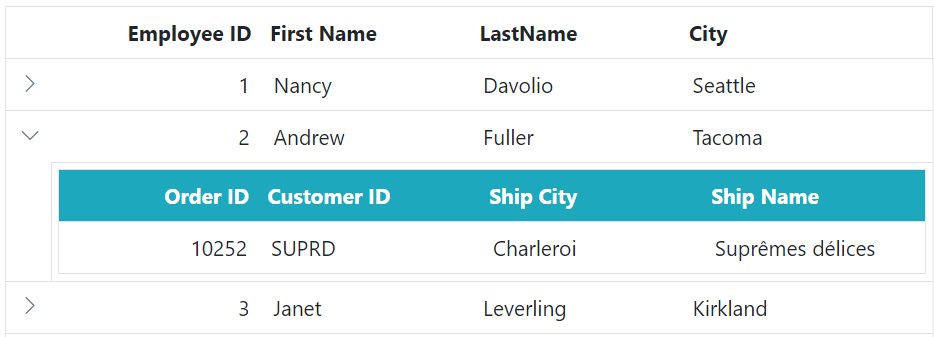

**Customizing the child Grid header cell div element**

To customize the appearance of the child Grid header cell div element, you can use the following CSS code:

```css
.e-detailcell .e-grid .e-headercelldiv {
    font-size: 15px;
    font-weight: bold;
    color: darkblue;
}
```
In this example, the **.e-headercelldiv** class targets the div element within the header cell of the child Grid. You can modify the `font-size`, `font-weight`, `color` properties to change the font size, font-weight and color of the header text content.

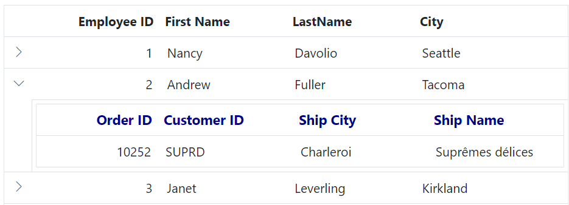

### Paging

You can customize the appearance of the paging elements in the child Grid using CSS. Here are examples of how to customize the pager root element, pager container element, pager navigation elements, pager page numeric link elements, and pager current page numeric element of the child Grid.

**Customizing the child Grid pager root element**

To customize the appearance of the child Grid pager root element, you can use the following CSS code:

```css
.e-detailcell .e-grid  .e-gridpager {
    font-family: cursive;
    background-color: #deecf9;
}
```
In this example, the **.e-detailcell** class targets the child Grid and the **.e-gridpager** class targets the pager root element. You can modify the `font-family` to change the font family and `background-color` property to change the background color of the pager.

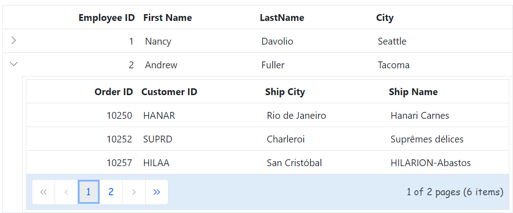

**Customizing the child Grid pager container element**

To customize the appearance of the child Grid pager container element, you can use the following CSS code:

```css
.e-detailcell .e-grid .e-pagercontainer {
    border: 2px solid #00b5ff;
    font-family: cursive;
}
```

In this example, the **.e-pagercontainer** class targets the pager container element. You can modify the `border` property and `font-family` property to change the border color and font family of the pager container.


**Customizing the child Grid pager navigation elements**

To customize the appearance of the child Grid pager navigation elements, you can use the following CSS code:

```css
.e-detailcell .e-grid .e-gridpager .e-prevpagedisabled,
.e-detailcell .e-grid .e-gridpager .e-prevpage,
.e-detailcell .e-grid .e-gridpager .e-nextpage,
.e-detailcell .e-grid .e-gridpager .e-nextpagedisabled,
.e-detailcell .e-grid .e-gridpager .e-lastpagedisabled,
.e-detailcell .e-grid .e-gridpager .e-lastpage,
.e-detailcell .e-grid .e-gridpager .e-firstpage,
.e-detailcell .e-grid .e-gridpager .e-firstpagedisabled {
    background-color: #deecf9;
}
```

In this example, the classes **.e-prevpagedisabled, .e-prevpage, .e-nextpage, .e-nextpagedisabled, .e-lastpagedisabled, .e-lastpage, .e-firstpage,** and **.e-firstpagedisabled** target the various pager navigation elements of the child Grid. You can modify the `background-color` property to change the background color of these elements.


**Customizing the child Grid pager page numeric link elements**

To customize the appearance of the child Grid pager current page numeric link elements, you can use the following CSS code:

```css
.e-detailcell .e-grid .e-gridpager .e-numericitem {
    background-color: #5290cb;
    color: #ffffff;
    cursor: pointer;
}

.e-detailcell .e-grid .e-gridpager .e-numericitem:hover {
    background-color: white;
    color: #007bff;
}
```

In this example, the **.e-numericitem** class targets the page numeric link elements. You can modify the `background-color`, `color` properties to change the background color and text color of these elements.


**Customizing the child Grid pager current page numeric element**

To customize the appearance of the child Grid pager current page numeric element, you can use the following CSS code:

```css
.e-detailcell .e-grid .e-gridpager .e-currentitem {
    background-color: #0078d7;
    color: #fff;
}
```

In this example, the **.e-currentitem** class targets the current page numeric item. You can modify the `background-color` property to change the background color of this element and `color` property to change the text color.


### Sorting

You can customize the appearance of the sorting icons and multi sorting icons in the child Grid using CSS.You can use the available Syncfusion [icons](https://blazor.syncfusion.com/documentation/appearance/icons#bootstrap-5) based on your theme. Here's how to do it:

**Customizing the child Grid sorting icon**

To customize the sorting icon that appears in the child Grid header when sorting is applied, you can use the following CSS code:

```css
.e-detailcell .e-grid .e-icon-ascending::before {
    content: '\e7a3';
    /* Icon code for ascending order */
}

.e-detailcell .e-grid .e-icon-descending::before {
    content: '\e7b6';
    /* Icon code for descending order */
}
```
In this example, the **.e-detailcell** class targets the child Grid and the **.e-icon-ascending::before** class targets the sorting icon for ascending order, and the **.e-icon-descending::before** class targets the sorting icon for descending order.

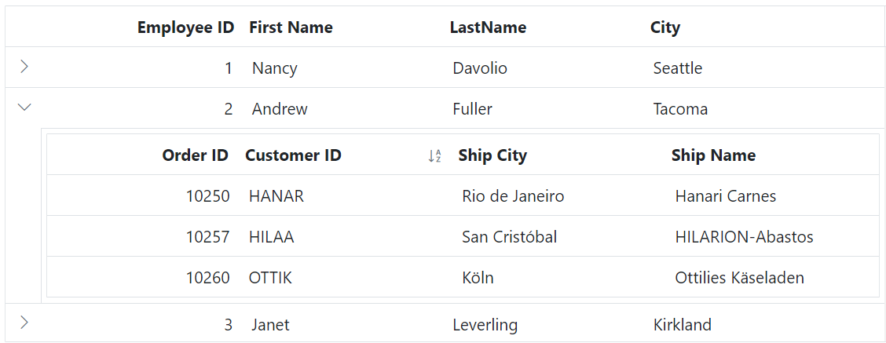

**Customizing the child Grid multi sorting icon**

To customize the multi sorting icon that appears in the child Grid header when multiple columns are sorted, you can use the following CSS code:

```css
.e-detailcell .e-grid .e-sortnumber {
    background-color: #deecf9;
    font-family: cursive;
}
```

In this example, the **.e-sortnumber** class targets the background color and font family of the multi sorting icon. You can modify the `background-color` and `font-family` properties to customize the appearance of the multi sorting icon.


### Filtering

You can customize the appearance of filtering elements in the child Grid using CSS. Below are examples of how to customize various filtering elements, including filter bar cell elements, filter bar input elements, focus styles, clear icons, filter icons, filter dialog content, filter dialog footer, filter dialog input elements, filter dialog button elements, and Excel filter dialog number filters.

**Customizing the child Grid filter bar cell element**

To customize the appearance of the filter bar cell element in the child Grid header, you can use the following CSS code:

```css
.e-detailcell .e-grid .e-filterbar .e-filterbarcell {
  background-color: #045fb4;
}

```
In this example, the **.e-detailcell** class targets the child Grid and the **.e-filterbarcell** class targets the filter bar cell element in the child Grid header. You can modify the `background-color` property to change the color of the filter bar cell element.

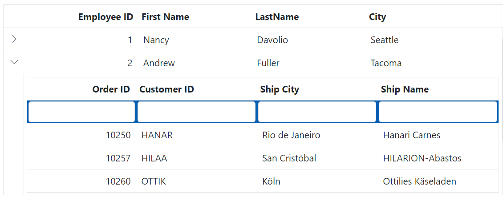

**Customizing the child Grid filter bar input element**

To customize the appearance of the filter bar input element in the child Grid header, you can use the following CSS code:

```css
.e-detailcell .e-grid .e-filterbarcell .e-input-group input.e-input{
    font-family: cursive;
}
```
In this example, the **.e-filterbarcell** class targets the filter bar cell element, and the **.e-input** class targets the input element within the cell. You can modify the `font-family` property to change the font of the filter bar input element.


**Customizing the child Grid filter bar input focus**

To customize the appearance of the child Grid's filter bar input element's focus highlight, you can use the following CSS code:

```css
.e-detailcell .e-grid .e-filterbarcell .e-input-group.e-input-focus{
    background-color: #deecf9;
}
```
In this example, the **.e-filterbarcell** class targets the filter bar cell element, and the **.e-input-group.e-input-focus** class targets the focused input element. You can modify the `background-color` property to change the color of the focus highlight.


**Customizing the child Grid filter bar input clear icon**

To customize the appearance of the child Grid's filter bar input element's clear icon, you can use the following CSS code:

```css
.e-detailcell .e-grid .e-filterbarcell .e-input-group .e-clear-icon::before {
    content: '\e72c';
}
```
In this example, the **.e-clear-icon** class targets the clear icon element within the input group. You can modify the `content` property to change the icon displayed.


**Customizing the child Grid child Grid filtering icon**

To customize the appearance of the filtering icon in the child Grid header, you can use the following CSS code:

```css
.e-detailcell .e-grid .e-icon-filter::before{
    content: '\e81e';
}
```
In this example, the **.e-icon-filter** class targets the filtering icon element. You can modify the `content` property to change the icon displayed.

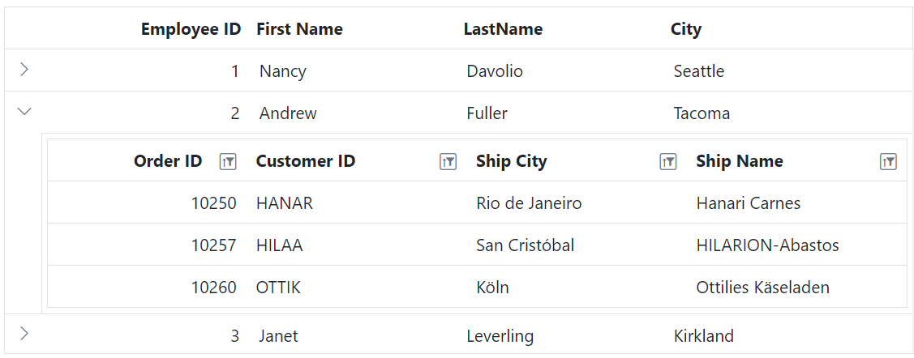

**Customizing the child Grid filter dialog content**

To customize the appearance of the child Grid's filter dialog's content element, you can use the following CSS code:

```css
.e-detailcell .e-grid .e-filter-popup .e-dlg-content {
    background-color: #deecf9;
}
```
In this example, the **.e-filter-popup .e-dlg-content** classes target the content element within the filter dialog. You can modify the `background-color` property to change the color of the dialog's content.

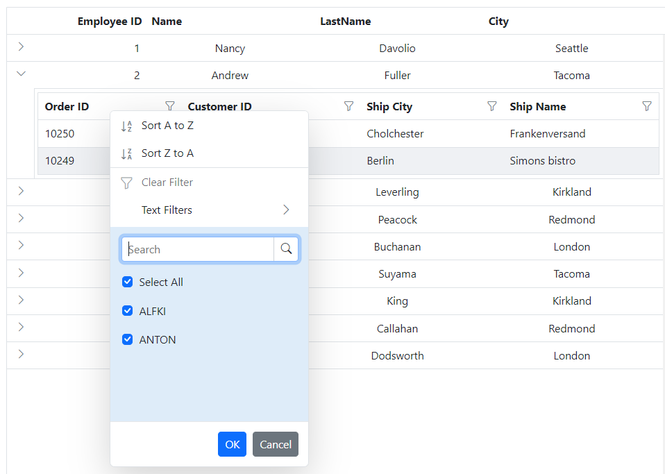

**Customizing the child Grid filter dialog footer**

To customize the appearance of the child Grid's filter dialog's footer element, you can use the following CSS code:

```css
.e-detailcell .e-grid .e-filter-popup .e-footer-content {
    background-color: #deecf9;
}
```
In this example, the **.e-filter-popup .e-footer-content** classes target the footer element within the filter dialog. You can modify the `background-color` property to change the color of the dialog's footer.


**Customizing the child Grid filter dialog input element**

To customize the appearance of the child Grid's filter dialog's input elements, you can use the following CSS code:

```css
.e-detailcell .e-grid .e-filter-popup .e-input-group input.e-input{
    font-family: cursive;
}
```
In this example, the **.e-filter-popup** class targets the filter dialog, and the **.e-input** class targets the input elements within the dialog. You can modify the `font-family` property to change the font of the input elements.

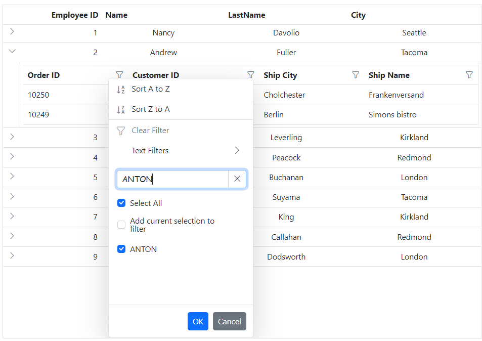

**Customizing the child Grid filter dialog button element**

To customize the appearance of the child Grid's filter dialog's button elements, you can use the following CSS code:

```css
.e-detailcell .e-grid .e-filter-popup .e-btn{
    font-family: cursive;
}
```
In this example, the **.e-filter-popup** class targets the filter dialog, and the **.e-btn** class targets the button elements within the dialog. You can modify the `font-family` property to change the font of the button elements.


**Customizing the child Grid excel filter dialog number filters element**

To customize the appearance of the excel filter dialog's number filters in the child Grid, you can use the following CSS code:

```css
.e-detailcell .e-grid .e-filter-popup .e-contextmenu {
    background-color: #deecf9;
}
```
In this example, the **.e-filter-popup .e-contextmenu-wrapper** ul classes target the number filter elements within the excel filter dialog. You can modify the `background-color` property to change the color of these elements.


### Grouping

You can customize the appearance of grouping elements in the child Grid using CSS. Here are examples of how to customize the group header, group expand/collapse icons, group caption row, and grouping indent cell.

**Customizing the child Grid group header**

To customize the appearance of the child Grid's group header element, you can use the following CSS code:

```css
.e-detailcell .e-grid .e-groupdroparea {
    background-color: #132f49;
}
```
In this example, the **.e-detailcell** class targets the child Grid and the **.e-groupdroparea** class targets the group header element. You can modify the `background-color` property to change the color of the group header.


**Customizing the child Grid group expand or collapse icons**

To customize the appearance of the group expand/collapse icons in the child Grid, you can use the following CSS code:

```css
.e-detailcell .e-grid .e-icon-gdownarrow::before{
    content:'\e7c9'
}
.e-detailcell .e-grid .e-icon-grightarrow::before{
    content:'\e80f'
}
```

In this example, the **.e-icon-gdownarrow** and **.e-icon-grightarrow** classes target the expand and collapse icons, respectively. You can modify the `content` property to change the icon displayed. You can use the available Syncfusion<sup style="font-size:70%">&reg;</sup> icons based on your theme.

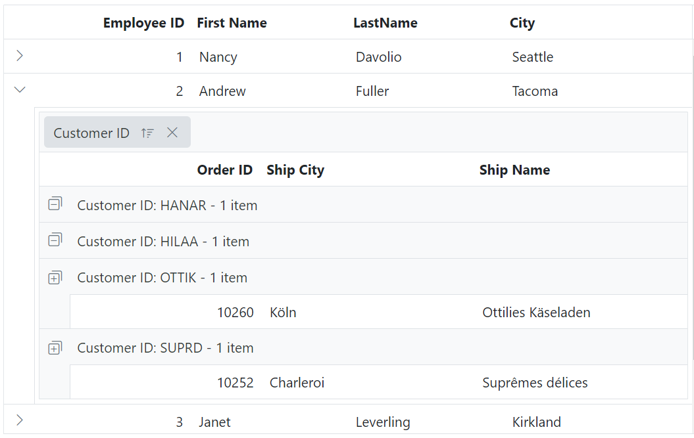

**Customizing the child Grid group caption row**

To customize the appearance of the child Grid's group caption row and the icons indicating record expansion or collapse, you can use the following CSS code:

```css
.e-detailcell .e-grid .e-groupcaption {
    background-color: #deecf9;
}

.e-detailcell .e-grid .e-recordplusexpand,
.e-detailcell .e-grid .e-recordpluscollapse {
    background-color: #deecf9;
}
```

In this example, the **.e-groupcaption** class targets the group caption row element, and the **.e-recordplusexpand** and **.e-recordpluscollapse** classes target the icons indicating record expansion or collapse. You can modify the `background-color` property to change the color of these elements.


**Customizing the child Grid grouping indent cell**

To customize the appearance of the child Grid's grouping indent cell element, you can use the following CSS code:

```css
.e-detailcell .e-grid .e-indentcell {
    background-color: #deecf9;
}
```

In this example, the **.e-indentcell** class targets the grouping indent cell element. You can modify the `background-color` property to change the color of the indent cell.

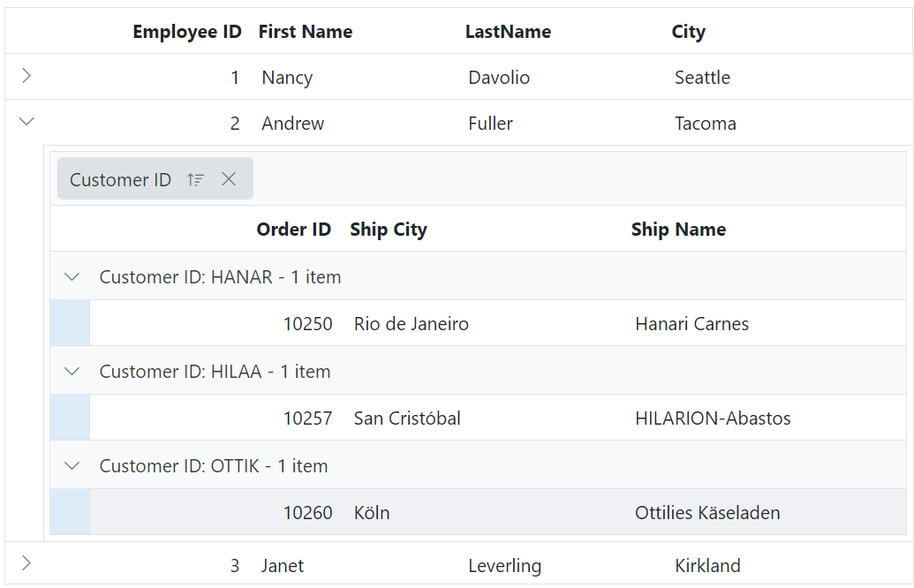

### Toolbar

You can customize the appearance of the toolbar in the child Grid using CSS. Here are examples of how to customize the toolbar root element and toolbar button element.

**Customizing the child Grid toolbar root element**

To customize the appearance of the child Grid's toolbar root element, you can use the following CSS code:

```css
.e-detailcell .e-grid .e-toolbar-items {
    background-color: #deecf9;
}
```

In this example, the **.e-detailcell** class targets the child Grid and the **.e-toolbar-items** class targets the background color of the toolbar root element. You can modify the `background-color` property to change the background color of the toolbar.


**Customizing the child Grid toolbar button element**

To customize the appearance of the child Grid's toolbar buttons, you can use the following CSS code:

```css
.e-detailcell .e-grid .e-toolbar .e-btn {
    background-color: #deecf9;
}
```

In this example, the **.e-toolbar .e-btn** selector targets the background color of the toolbar button elements. You can modify the `background-color` property to change the background color of the toolbar buttons.


### Editing

You can customize the appearance of editing-related elements in the child Grid using CSS. Below are examples of how to customize various editing-related elements.

**Customizing the child Grid edited and added row element**

To customize the appearance of edited and added row table elements in the child Grid, you can use the following CSS code:

```css
.e-detailcell .e-grid .e-editedrow table, 
.e-detailcell .e-grid .e-addedrow table {
	background-color: #62b2eb;
}
```
In this example, the **.e-detailcell** class targets the child Grid and the .**e-editedrow** class represents the edited row element, and the **.e-addedrow** class represents the added row element. You can modify the `background-color` property to change the color of these row table elements.


**Customizing the child Grid edited row input element**

To customize the appearance of edited row input elements in the child Grid, you can use the following CSS code:

```css
.e-detailcell .e-grid .e-editedrow .e-input-group input.e-input{
  font-family: cursive;
  color:rgb(214, 33, 123)
}
```
In this example, the **.e-editedrow** class represents the edited row element, and the **.e-input** class represents the input elements within the form. You can modify the `font-family` property to change the font and `color` property  to change text color of the input elements.


**Customizing the child Grid edit dialog header element**

To customize the appearance of the edit dialog header element in the child Grid, you can use the following CSS code:

```css
.e-edit-dialog .e-dlg-header-content {
    background-color: #deecf9;
}
```
In this example, the **.e-edit-dialog** class represents the edit dialog, and the **.e-dlg-header-content** class targets the header content within the dialog. You can modify the `background-color` property to change the color of the header element.


**Customizing the child Grid command column buttons**

To customize the appearance of the child Grid's command column buttons such as edit, delete, update, and cancel, you can use the following CSS code:

```css
.e-detailcell .e-grid .e-delete::before ,.e-grid .e-cancel-icon::before{
    color: #f51717;
}
.e-detailcell .e-grid .e-edit::before, .e-grid .e-update::before {
    color: #077005;
}
```
In this example, the **.e-edit, .e-delete, .e-update, and .e-cancel-icon** classes represent the respective command column buttons. You can modify the `color` property to change the color of these buttons.


### Aggregate

You can customize the appearance of aggregate elements in the child Grid using CSS. Below are examples of how to customize the aggregate root element and the aggregate cell elements.

**Customizing the child Grid aggregate root element**

To customize the appearance of the child Grid's aggregate root elements, you can use the following CSS code:

```css
.e-detailcell .e-grid .e-gridfooter {
    font-family: cursive;
}
```

In this example, the **.e-detailcell** class targets the child Grid and the **e-gridfooter** class represents the root element of the aggregate row in the grid footer. You can modify the `font-family` property to change the font of the aggregate root element.


**Customizing the child Grid aggregate cell elements**

To customize the appearance of the child Grid's aggregate cell elements (summary row cell elements), you can use the following CSS code:

```css
.e-detailcell .e-grid .e-summaryrow .e-summarycell {
    background-color: #deecf9;
}
```

In this example, the **e-summaryrow** class represents the summary row containing aggregate cells, and the **e-summarycell** class targets individual aggregate cells within the summary row. You can modify the `background-color` property to change the `color` of the aggregate cell elements.

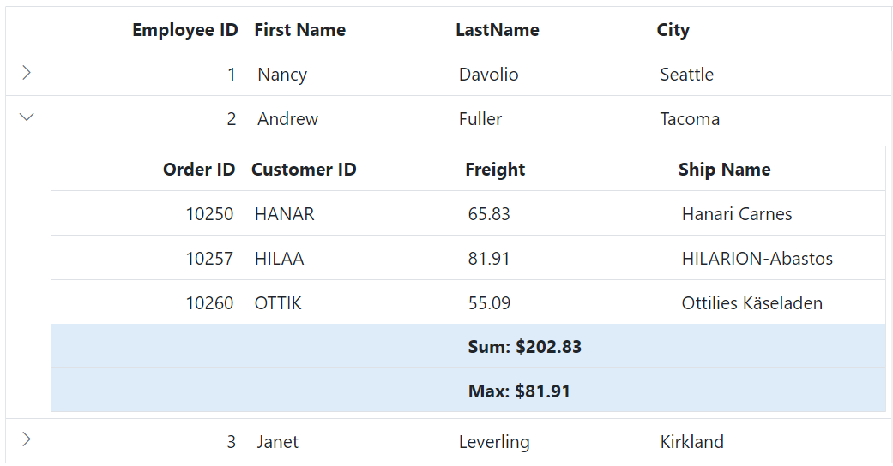

### Selection

You can customize the appearance of the selection in the child Grid using CSS. Here are examples of how to customize the row selection background, cell selection background, and column selection background.

**Customizing the child Grid row selection background**

To customize the appearance of the child Grid's row selection, you can use the following CSS code:

```css
.e-detailcell .e-grid td.e-selectionbackground {
    background-color: #00b7ea;
}
```
In this example, the **.e-detailcell** class targets the child Grid and the **.e-selectionbackground** class targets the background color of the row selection. You can modify the `background-color` property to change the background color of the selected rows.

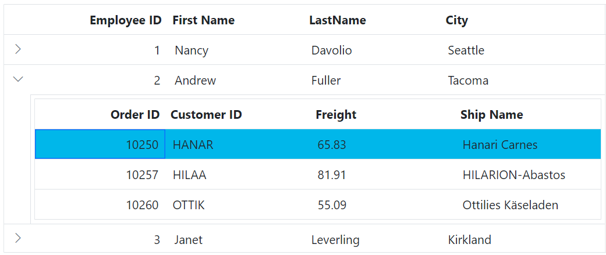

**Customizing the child Grid cell selection background**

To customize the appearance of the child Grid's cell selection, you can use the following CSS code:

```css
.e-detailcell .e-grid td.e-cellselectionbackground {
    background-color: #00b7ea;
}
```

In this example, the **.e-cellselectionbackground** class targets the background color of the cell selection. You can modify the `background-color` property to change the background color of the selected cells.

