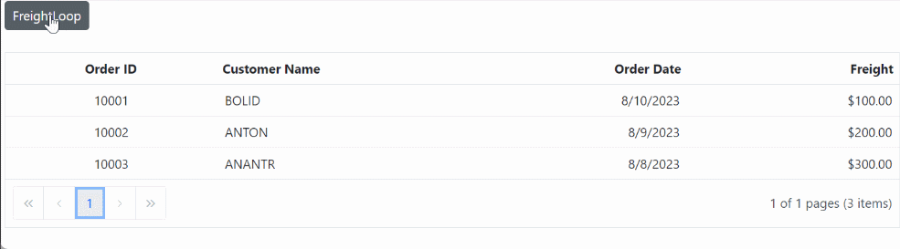

---

layout: post
title: Blinking Animation for Grid Cells in Blazor DataGrid | Syncfusion
description: Learn how to create a blinking animation effect for Grid cell values using CSS in Syncfusion Blazor DataGrid.
platform: Blazor
control: DataGrid
documentation: ug
---

# Blinking animation for Grid cells using CSS

The Syncfusion Blazor DataGrid allows you to enhance the visual feedback of your data by adding a blinking animation effect to Grid cells.

This is useful when you want to draw attention to specific cell values that change dynamically, such as live data updates or alerts. For example, you can make a cell blink when a value exceeds a threshold or when new data is received.

The blinking effect can be achieved using CSS animations in combination with the [QueryCellInfo](https://help.syncfusion.com/cr/blazor/Syncfusion.Blazor.Grids.GridEvents-1.html#Syncfusion_Blazor_Grids_GridEvents_1_QueryCellInfo) event, which enables dynamic customization of cell content. Syncfusion Blazor components also support automatic data updates using [ObservableCollection](https://learn.microsoft.com/en-us/dotnet/api/system.collections.objectmodel.observablecollection-1?view=netframework-4.8) and [INotifyPropertyChanged](https://learn.microsoft.com/en-us/dotnet/api/system.componentmodel.inotifypropertychanged?view=netframework-4.8), ensuring that changes are reflected in real time.

The following example demonstrates how to apply a blinking animation to Grid cells using CSS and the `QueryCellInfo` event:




@using Syncfusion.Blazor.Grids
@using Syncfusion.Blazor.Buttons
@using System.Collections.ObjectModel;
@using System.ComponentModel;
@using System;
@using System.Threading.Tasks;
@using System.Runtime.CompilerServices;
@using System.Threading;
<SfButton ID="Button" @onclick="FreightLoop">FreightLoop</SfButton>
<SfGrid DataSource="@observableData" AllowPaging="true">
    <GridEvents QueryCellInfo="CustomizeCell" TValue="DataOrder"></GridEvents>
    <GridColumns>
        <GridColumn Field=@nameof(DataOrder.OrderID) HeaderText="Order ID" IsPrimaryKey="true" TextAlign="@TextAlign.Center" HeaderTextAlign="@TextAlign.Center" Width="140"></GridColumn>
        <GridColumn Field=@nameof(DataOrder.CustomerID) HeaderText="Customer Name" Width="150"></GridColumn>
        <GridColumn Field=@nameof(DataOrder.OrderDate) HeaderText="Order Date" EditType="EditType.DatePickerEdit" Format="d" TextAlign="TextAlign.Right" Type="ColumnType.Date" Width="160"></GridColumn>
        <GridColumn Field=@nameof(DataOrder.Freight) HeaderText="Freight" EditType="EditType.NumericEdit" Format="C2" Width="140" TextAlign="@TextAlign.Right" HeaderTextAlign="@TextAlign.Right"></GridColumn>
    </GridColumns>
</SfGrid>
@code {
    private ObservableCollection<DataOrder> observableData { get; set; }
    SfGrid<DataOrder> Grid;
    SfButton Button;
    protected override void OnInitialized()
    {
        observableData = new ObservableCollection<DataOrder>(Enumerable.Range(1, 3).Select(x => new DataOrder()
            {
                OrderID = 10000 + x,
                CustomerID = (new string[] { "ALFKI", "ANANTR", "ANTON", "BLONP", "BOLID" })[new Random().Next(5)],
                Freight = 100 * x,
                OrderDate = DateTime.Now.AddDays(-x),
            }));
    }
    private void FreightLoop()
    {
        Thread loop = new Thread(new ThreadStart(UpdatePrice));
        loop.Start();
    }
    public async void UpdatePrice()
    {
        int i = 0;
        while (true)
        {
            i++;
            switch (i)
            {
                case 1:
                    observableData[0].Freight = observableData[0].Freight + 10;
                    break;
                case 2:
                    observableData[1].Freight = observableData[1].Freight + 10;
                    break;
                case 3:
                    observableData[2].Freight = observableData[2].Freight + 10;
                    break;
                default:
                    i = 0;
                    break;
            }
            await InvokeAsync(() =>
                {
                    base.StateHasChanged();
                });
            Thread.Sleep(250);
        }
    }
    public async Task CustomizeCell(QueryCellInfoEventArgs<DataOrder> args)
    {
        if (args.Column.Field == "Freight")
        {
            if (args.Data.freight > 100 && args.Data.freight < 200)
            {
                args.Cell.AddClass(new string[] { "below-30" });
            }
            else if (args.Data.freight > 200 && args.Data.freight < 300)
            {
                args.Cell.AddClass(new string[] { "below-80" });
            }
            else if (args.Data.freight > 300 && args.Data.freight < 400)
            {
                args.Cell.AddClass(new string[] { "above-80" });
            }
            else
            {
                args.Cell.AddStyle(new string[] { "background-color: white" });
            }
        }
    }
 
    public class DataOrder : INotifyPropertyChanged
    {
        public int OrderID { get; set; }
        public string CustomerID { get; set; }
        public DateTime OrderDate { get; set; }
        public decimal freight { get; set; }
        public decimal Freight
        {
            get { return freight; }
            set
            {
                this.freight = value;
                OnPropertyChanged();
            }
        }
        public event PropertyChangedEventHandler PropertyChanged;
        private void NotifyPropertyChanged(string propertyName)
        {
            var handler = PropertyChanged;
            if (handler != null)
            {
                handler(this, new PropertyChangedEventArgs(propertyName));
            }
        }
        async Task OnPropertyChanged([CallerMemberName] string name = null)
        {
            PropertyChanged?.Invoke(this, new PropertyChangedEventArgs(name));
        }
    }
}




