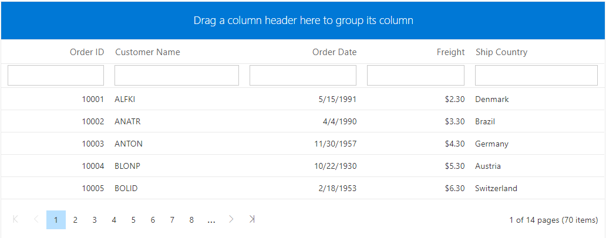

<!-- markdownlint-disable MD024 -->

# Getting Started with Blazor WebAssembly DataGrid Using CLI

This article provides a step-by-step introduction to configure Syncfusion Blazor setup, build and run a simple Blazor WebAssembly application using [.NET Core CLI](https://dotnet.microsoft.com/download/dotnet-core/3.1).

> **Note:** Starting with version 17.4.0.39 (2019 Volume 4), you need to include a valid license key (either paid or trial key) within your applications. Please refer to this [help topic](https://help.syncfusion.com/common/essential-studio/licensing/license-key#blazor) for more information.

## Prerequisites

* [.NET Core SDK 3.1.3](https://dotnet.microsoft.com/download/dotnet-core/3.1)

## Create a Blazor WebAssembly project using .NET Core CLI

1. Install the Blazor project templates by using below command line in the command prompt:

    ```bash
    dotnet new -i Microsoft.AspNetCore.Components.WebAssembly.Templates::3.2.0-rc1.20223.4
    ````

2. Once project templates installed, run the following command line to create a new Blazor WebAssembly application.

    ```bash
        dotnet new blazorwasm -o WebApplication1
        cd WebApplication1
    ```

## Importing Syncfusion Blazor component in the application

1. Now, add **Syncfusion.Blazor** NuGet package to the new application using the below command line.

    ```bash
        dotnet add package Syncfusion.Blazor -v '{:nuget-version:}'
        dotnet restore
    ```

2. The Syncfusion Blazor package will be included in the newly created project after the installation process is completed.

3. Open **~/_Imports.razor** file and import the `Syncfusion.Blazor`.

    ```csharp
    @using Syncfusion.Blazor
    @using Syncfusion.Blazor.Grids
    ```

4. Open the **~/Program.cs** file and register the Syncfusion Blazor Service.

    ```csharp
    using Syncfusion.Blazor;

    namespace WebApplication1
    {
        public class Program
        {
            public static async Task Main(string[] args)
            {
                ....
                ....
                builder.Services.AddSyncfusionBlazor();
                await builder.Build().RunAsync();
            }
        }
    }
    ```

5. Add the Syncfusion bootstrap4 theme in the `<head>` element of the **~/wwwroot/index.html** page.

    ```html
    <head>
        ....
        ....
        <link href="_content/Syncfusion.Blazor/styles/bootstrap4.css" rel="stylesheet" />
    </head>
    ```

> **Note:** The same theme file can be referred through the CDN version by using [`https://cdn.syncfusion.com/blazor/{:version:}/styles/bootstrap4.css`](https://cdn.syncfusion.com/blazor/18.2.44/styles/bootstrap4.css).
> To use manual scripts other than the scripts from NuGet package, register the Blazor service in **~/Program.cs** file by using true parameter as mentioned below.

  ```csharp
     using Syncfusion.Blazor;
     namespace WebApplication1
     {
        public class Program
       {
             public static async Task Main(string[] args)
             {
                ....
                ....
                builder.Services.AddSyncfusionBlazor(true);
                await builder.Build.RunAsync();
             }
         }
     }
  ```

## Add DataGrid Component

To initialize the DataGrid component add the below code to your **Index.razor** view page which is present under **~/Pages** folder. For example, the DataGrid component is added in the **~/Pages/Index.razor** page.

```csharp
<SfGrid >

</SfGrid>
```

## Defining Row Data

To bind data for the DataGrid component, you can assign a IEnumerable object to the [`dataSource`](https://help.syncfusion.com/cr/blazor/Syncfusion.Blazor.Grids.SfGrid-1.html#Syncfusion_Blazor_Grids_SfGrid_1_DataSource) property. The list data source can also be provided as an instance of the `DataManager`. You can assign the data source through the **OnInitialized** lifecycle of the page.

```csharp
<SfGrid DataSource="@gridData">

</SfGrid>

@code{
    public List<OrdersDetails> gridData { get; set; }
    protected override void OnInitialized()
    {
        gridData = OrdersDetails.GetAllRecords();
    }
}
```

## Defining Columns

The columns are automatically generated when columns declaration is empty or undefined while initializing the datagrid.

The DataGrid has an option to define columns using [`GridColumns`](https://help.syncfusion.com/cr/aspnetcore-blazor/Syncfusion.Blazor.Grids.GridColumns.html) component. In `GridColumn` component we have properties to customize columns.

Let’s check the properties used here:

* We have added [`Field`](https://help.syncfusion.com/cr/blazor/Syncfusion.Blazor.Grids.GridColumn.html#Syncfusion_Blazor_Grids_GridColumn_Field) to map with a property name an array of JavaScript objects.
* We have added [`HeaderText`](https://help.syncfusion.com/cr/blazor/Syncfusion.Blazor.Grids.GridColumn.html#Syncfusion_Blazor_Grids_GridColumn_HeaderText) to change the title of columns.
* We have used [`TextAlign`](https://help.syncfusion.com/cr/blazor/Syncfusion.Blazor.Grids.GridColumn.html#Syncfusion_Blazor_Grids_GridColumn_TextAlign) to change the alignment of columns. By default, columns will be left aligned. To change columns to right align, we need to define `TextAlign` as `Right`.
* Also, we have used another useful property, [`Format`](https://help.syncfusion.com/cr/blazor/Syncfusion.Blazor.Grids.GridColumn.html#Syncfusion_Blazor_Grids_GridColumn_Format). Using this, we can format number and date values to standard or custom formats.

```csharp
<SfGrid DataSource="@gridData">
    <GridColumns>
        <GridColumn Field=@nameof(OrdersDetails.OrderID) HeaderText="Order ID" TextAlign="TextAlign.Right" Width="120"></GridColumn>
        <GridColumn Field=@nameof(OrdersDetails.CustomerID) HeaderText="Customer Name" Width="150"></GridColumn>
        <GridColumn Field=@nameof(OrdersDetails.OrderDate) HeaderText=" Order Date" Format="d" Type="ColumnType.Date" TextAlign="TextAlign.Right" Width="130"></GridColumn>
        <GridColumn Field=@nameof(OrdersDetails.Freight) HeaderText="Freight" Format="C2" TextAlign="TextAlign.Right" Width="120"></GridColumn>
        <GridColumn Field=@nameof(OrdersDetails.ShipCountry) HeaderText="Ship Country" Width="150"></GridColumn>
    </GridColumns>
</SfGrid>

@code{
    public List<OrdersDetails> gridData { get; set; }
    protected override void OnInitialized()
    {
        gridData = OrdersDetails.GetAllRecords();
    }
}
```

## Enable Paging

The paging feature enables users to view the datagrid record in a paged view. It can be enabled by setting the [`AllowPaging`](https://help.syncfusion.com/cr/blazor/Syncfusion.Blazor.Grids.SfGrid-1.html#Syncfusion_Blazor_Grids_SfGrid_1_AllowPaging) property to true. Pager can be customized using the [`GridPageSettings`](https://help.syncfusion.com/cr/blazor/Syncfusion.Blazor.Grids.SfGrid-1.html#Syncfusion_Blazor_Grids_SfGrid_1_PageSettings) component.

```csharp
<SfGrid DataSource="@gridData" AllowPaging="true">
 <GridPageSettings PageSize="5"></GridPageSettings>
   <GridColumns>
     <GridColumn Field=@nameof(OrdersDetails.OrderID) HeaderText="Order ID" TextAlign="TextAlign.Right" Width="120"></GridColumn>
     <GridColumn Field=@nameof(OrdersDetails.CustomerID) HeaderText="Customer Name" Width="150"></GridColumn>
     <GridColumn Field=@nameof(OrdersDetails.OrderDate) HeaderText=" Order Date" Format="d" Type="ColumnType.Date" TextAlign="TextAlign.Right" Width="130"></GridColumn>
     <GridColumn Field=@nameof(OrdersDetails.Freight) HeaderText="Freight" Format="C2" TextAlign="TextAlign.Right" Width="120"></GridColumn>
     <GridColumn Field=@nameof(OrdersDetails.ShipCountry) HeaderText="Ship Country" Width="150"></GridColumn>
   </GridColumns>
</SfGrid>

@code{
    public List<OrdersDetails> gridData { get; set; }
    protected override void OnInitialized()
    {
        gridData = OrdersDetails.GetAllRecords();
    }
}
```

## Enable Sorting

The sorting feature enables you to order the records. It can be enabled by setting the [`AllowSorting`](https://help.syncfusion.com/cr/blazor/Syncfusion.Blazor.Grids.SfGrid-1.html#Syncfusion_Blazor_Grids_SfGrid_1_AllowSorting) property as true. Sorting feature can be customized using the [`GridSortSettings`](https://help.syncfusion.com/cr/blazor/Syncfusion.Blazor.Grids.SfGrid-1.html#Syncfusion_Blazor_Grids_SfGrid_1_SortSettings) component.

```csharp
<SfGrid DataSource="@gridData" AllowPaging="true" AllowSorting="true">
 <GridPageSettings PageSize="5"></GridPageSettings>
   <GridColumns>
     <GridColumn Field=@nameof(OrdersDetails.OrderID) HeaderText="Order ID" TextAlign="TextAlign.Right" Width="120"></GridColumn>
     <GridColumn Field=@nameof(OrdersDetails.CustomerID) HeaderText="Customer Name" Width="150"></GridColumn>
     <GridColumn Field=@nameof(OrdersDetails.OrderDate) HeaderText=" Order Date" Format="d" Type="ColumnType.Date" TextAlign="TextAlign.Right" Width="130"></GridColumn>
     <GridColumn Field=@nameof(OrdersDetails.Freight) HeaderText="Freight" Format="C2" TextAlign="TextAlign.Right" Width="120"></GridColumn>
     <GridColumn Field=@nameof(OrdersDetails.ShipCountry) HeaderText="Ship Country" Width="150"></GridColumn>
   </GridColumns>
</SfGrid>

@code{
    public List<OrdersDetails> gridData { get; set; }
    protected override void OnInitialized()
    {
        gridData = OrdersDetails.GetAllRecords();
    }
}
```

## Enable Filtering

The filtering feature enables you to view reduced amount of records based on filter criteria. It can be enabled by setting the [`AllowFiltering`](https://help.syncfusion.com/cr/blazor/Syncfusion.Blazor.Grids.SfGrid-1.html#Syncfusion_Blazor_Grids_SfGrid_1_AllowFiltering) property as true. Filtering feature can be customized using the [`GridFilterSettings`](https://help.syncfusion.com/cr/blazor/Syncfusion.Blazor.Grids.SfGrid-1.html#Syncfusion_Blazor_Grids_SfGrid_1_FilterSettings) component.

```csharp
<SfGrid DataSource="@gridData" AllowPaging="true" AllowSorting="true" AllowFiltering="true">
 <GridPageSettings PageSize="5"></GridPageSettings>
   <GridColumns>
     <GridColumn Field=@nameof(OrdersDetails.OrderID) HeaderText="Order ID" TextAlign="TextAlign.Right" Width="120"></GridColumn>
     <GridColumn Field=@nameof(OrdersDetails.CustomerID) HeaderText="Customer Name" Width="150"></GridColumn>
     <GridColumn Field=@nameof(OrdersDetails.OrderDate) HeaderText=" Order Date" Format="d" Type="ColumnType.Date" TextAlign="TextAlign.Right" Width="130"></GridColumn>
     <GridColumn Field=@nameof(OrdersDetails.Freight) HeaderText="Freight" Format="C2" TextAlign="TextAlign.Right" Width="120"></GridColumn>
     <GridColumn Field=@nameof(OrdersDetails.ShipCountry) HeaderText="Ship Country" Width="150"></GridColumn>
   </GridColumns>
</SfGrid>

@code{
    public List<OrdersDetails> gridData { get; set; }
    protected override void OnInitialized()
    {
        gridData = OrdersDetails.GetAllRecords();
    }
}
```

## Enable Grouping

The grouping feature enables you to view the datagrid record in a grouped view. It can be enabled by setting the [`AllowGrouping`](https://help.syncfusion.com/cr/blazor/Syncfusion.Blazor.Grids.SfGrid-1.html#Syncfusion_Blazor_Grids_SfGrid_1_AllowGrouping) property as true. Grouping feature can be customized using the [`GridGroupSettings`](https://help.syncfusion.com/cr/blazor/Syncfusion.Blazor.Grids.SfGrid-1.html#Syncfusion_Blazor_Grids_SfGrid_1_GroupSettings) component.

```csharp
<SfGrid DataSource="@gridData" AllowPaging="true" AllowSorting="true" AllowFiltering="true" AllowGrouping="true">
 <GridPageSettings PageSize="5"></GridPageSettings>
   <GridColumns>
     <GridColumn Field=@nameof(OrdersDetails.OrderID) HeaderText="Order ID" TextAlign="TextAlign.Right" Width="120"></GridColumn>
     <GridColumn Field=@nameof(OrdersDetails.CustomerID) HeaderText="Customer Name" Width="150"></GridColumn>
     <GridColumn Field=@nameof(OrdersDetails.OrderDate) HeaderText=" Order Date" Format="d" Type="ColumnType.Date" TextAlign="TextAlign.Right" Width="130"></GridColumn>
     <GridColumn Field=@nameof(OrdersDetails.Freight) HeaderText="Freight" Format="C2" TextAlign="TextAlign.Right" Width="120"></GridColumn>
     <GridColumn Field=@nameof(OrdersDetails.ShipCountry) HeaderText="Ship Country" Width="150"></GridColumn>
   </GridColumns>
</SfGrid>

@code{
    public List<OrdersDetails> gridData { get; set; }
    protected override void OnInitialized()
    {
        gridData = OrdersDetails.GetAllRecords();
    }
}
```

Output be like the below.



## See Also

* [Getting Started with Syncfusion DataGrid in Blazor WebAssembly using Visual Studio 2019](./blazor-webassembly-datagrid-using-visual-studio)

* [Getting Started with Syncfusion DataGrid in Blazor Server-Side using Visual Studio 2019](../getting-started)

* [Getting Started with Syncfusion DataGrid in Blazor Server-Side using .NET Core CLI](./server-side-using-cli)
