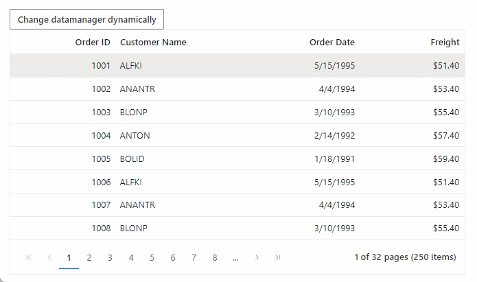

# Change SfDataManager Dynamically in Blazor DataGrid Component

You can change the data by using the [Json](https://help.syncfusion.com/cr/blazor/Syncfusion.Blazor.DataManager.html#Syncfusion_Blazor_DataManager_Json) property of the [SfDataManager](https://help.syncfusion.com/cr/blazor/Syncfusion.Blazor.Data.SfDataManager.html) component through an external button. After changing the data, invoke the [Refresh](https://help.syncfusion.com/cr/blazor/Syncfusion.Blazor.Grids.SfGrid-1.html#Syncfusion_Blazor_Grids_SfGrid_1_Refresh) method of the DataGrid component to reflect the changes in the grid.

This is demonstrated in the following sample code where the [SfDataManager](https://help.syncfusion.com/cr/blazor/Syncfusion.Blazor.Data.SfDataManager.html) is dynamically modified using the [Json](https://help.syncfusion.com/cr/blazor/Syncfusion.Blazor.DataManager.html#Syncfusion_Blazor_DataManager_Json) property,

```cshtml
@using Syncfusion.Blazor.Grids
@using Syncfusion.Blazor.Buttons
@using Syncfusion.Blazor.Data

<SfButton OnClick="Change">Change datamanager dynamically</SfButton>

<SfGrid TValue="Order" AllowPaging="true" @ref=Grid>
    <SfDataManager Json=@Orders></SfDataManager>
    <GridPageSettings PageSize="8"></GridPageSettings>
    <GridColumns>
        <GridColumn Field=@nameof(Order.OrderID) HeaderText="Order ID" TextAlign="TextAlign.Right" Width="120"></GridColumn>
        <GridColumn Field=@nameof(Order.CustomerID) HeaderText="Customer Name" Width="150"></GridColumn>
        <GridColumn Field=@nameof(Order.OrderDate) HeaderText=" Order Date" Format="d" Type=ColumnType.Date TextAlign="TextAlign.Right" Width="130"></GridColumn>
        <GridColumn Field=@nameof(Order.Freight) HeaderText="Freight" Format="C2" TextAlign="TextAlign.Right" Width="120"></GridColumn>
    </GridColumns>
</SfGrid>

@code {
    public List<Order> Orders { get; set; }

    private SfGrid<Order> Grid { get; set; }

    protected override void OnInitialized()
    {
        List<Order> data = new List<Order>();
        int count = 1000;
        for (int i = 0; i < 50; i++)
        {
            data.Add(new Order() { OrderID = count + 1, CustomerID = "ALFKI", OrderDate = new DateTime(1995, 05, 15), Freight = 25.7 * 2 });
            data.Add(new Order() { OrderID = count + 2, CustomerID = "ANANTR", OrderDate = new DateTime(1994, 04, 04), Freight = 26.7 * 2 });
            data.Add(new Order() { OrderID = count + 3, CustomerID = "BLONP", OrderDate = new DateTime(1993, 03, 10), Freight = 27.7 * 2 });
            data.Add(new Order() { OrderID = count + 4, CustomerID = "ANTON", OrderDate = new DateTime(1992, 02, 14), Freight = 28.7 * 2 });
            data.Add(new Order() { OrderID = count + 5, CustomerID = "BOLID", OrderDate = new DateTime(1991, 01, 18), Freight = 29.7 * 2 });
            count += 5;
        }
        Orders = data;
    }

    public async Task Change()
    {
        //Datamanager's Json property is modified dynamically
        List<Order> data = new List<Order>();
        int count = 0;
        for (int i = 0; i < 50; i++)
        {
            data.Add(new Order() { OrderID = count + 1, CustomerID = "BLONP", OrderDate = new DateTime(1995, 05, 15), Freight = 25.7 });
            data.Add(new Order() { OrderID = count + 2, CustomerID = "BOLID", OrderDate = new DateTime(1994, 04, 04), Freight = 26.7 });
            data.Add(new Order() { OrderID = count + 3, CustomerID = "ANTON", OrderDate = new DateTime(1993, 03, 10), Freight = 27.7 });
            data.Add(new Order() { OrderID = count + 4, CustomerID = "ALFKI", OrderDate = new DateTime(1992, 02, 14), Freight = 28.7 });
            data.Add(new Order() { OrderID = count + 5, CustomerID = "ANANTR", OrderDate = new DateTime(1991, 01, 18), Freight = 29.7 });
            count += 5;
        }
        Orders = data;

        //Invoke the Refresh method
        await Grid.Refresh();
    }

    public class Order
    {
        public int? OrderID { get; set; }
        public string CustomerID { get; set; }
        public DateTime? OrderDate { get; set; }
        public double? Freight { get; set; }
    }
}
```

The following GIF represents [SfDataManager](https://help.syncfusion.com/cr/blazor/Syncfusion.Blazor.Data.SfDataManager.html) is modified dynamically on button click,


