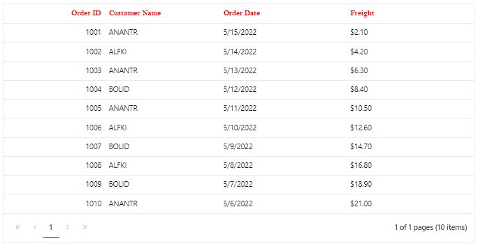

# Customize Column Styles in Blazor DataGrid Component

You can customize the appearance of the header and content of a particular column using the [CustomAttributes](https://help.syncfusion.com/cr/blazor/Syncfusion.Blazor.Grids.GridColumn.html#Syncfusion_Blazor_Grids_GridColumn_CustomAttributes) property.

To customize the datagrid column, follow the given steps:

**Step 1**:

Create a CSS class with custom style to override the default style for row cell and header cell.

```css
.e-attr{
        background: #5DADE2;
        font-family: "Bell MT";
        color: red;
        font-size: 5px;
    }
```

**Step 2**:

Add the custom CSS class to the specified column by using the [CustomAttributes](https://help.syncfusion.com/cr/blazor/Syncfusion.Blazor.Grids.GridColumn.html#Syncfusion_Blazor_Grids_GridColumn_CustomAttributes) property.

```cshtml
@using Syncfusion.Blazor
@using Syncfusion.Blazor.Grids

<SfGrid DataSource="@Orders" AllowPaging="true" Height="200" @ref="Grid">
    <GridColumns>
        <GridColumn Field=@nameof(Order.OrderID) HeaderText="Order ID" TextAlign="TextAlign.Right" Width="120"></GridColumn>
        <GridColumn Field=@nameof(Order.CustomerID) HeaderText="Customer Name" Width="150" ></GridColumn>
        <GridColumn Field=@nameof(Order.OrderDate) HeaderText=" Order Date" Format="d" Type="ColumnType.Date" CustomAttributes="@(new Dictionary<string, object>(){ { "class", "e-attr" }})" TextAlign="TextAlign.Right" Width="130"></GridColumn>
        <GridColumn Field=@nameof(Order.Freight) HeaderText="Freight" Format="C2" TextAlign="TextAlign.Right" Width="120"></GridColumn>
    </GridColumns>
</SfGrid>
<style>
    .e-attr{
        background: #5DADE2;
        font-family: "Bell MT";
        color: red;
        font-size: 5px;
    }
</style>

@code{
    SfGrid<Order> Grid;
    public List<Order> Orders { get; set; }
    protected override void OnInitialized()
    {
        Orders = Enumerable.Range(1, 10).Select(x => new Order()
        {
            OrderID = 1000 + x,
            CustomerID = (new string[] { "ALFKI", "ANANTR", "ANTON", "BLONP", "BOLID" })[new Random().Next(5)],
            Freight = 2.1 * x,
            OrderDate = DateTime.Now.AddDays(-x),
        }).ToList();
    }

    public class Order
    {
        public int? OrderID { get; set; }
        public string CustomerID { get; set; }
        public DateTime? OrderDate { get; set; }
        public double? Freight { get; set; }
    }
}
```


## Customize column header style

You can customize the column header using the **e-headercell** CSS class.

In the following sample, you can override the default style for column headers using the **e-headercell** CSS class.

N> You can find the fully working sample [here](https://github.com/SyncfusionExamples/blazor-datagrid-customize-column-header).

```cshtml
@using Syncfusion.Blazor
@using Syncfusion.Blazor.Grids

<SfGrid DataSource="@Orders" AllowPaging="true"  Width="900" @ref="Grid">
    <GridColumns>
        <GridColumn Field=@nameof(Order.OrderID) HeaderText="Order ID" TextAlign="TextAlign.Right" Width="80"></GridColumn>
        <GridColumn Field=@nameof(Order.CustomerID) HeaderText="Customer Name" Width="90" ></GridColumn>
        <GridColumn Field=@nameof(Order.OrderDate) HeaderText=" Order Date" Format="d" Type="ColumnType.Date"  Width="100"></GridColumn>
        <GridColumn Field=@nameof(Order.Freight) HeaderText="Freight" Format="C2"  Width="100"></GridColumn>
    </GridColumns>
</SfGrid>
<style>
    .e-headercell{
        font-family: "Bell MT";
        color: red;
        font-size: 5px;
    }
</style>

@code{
    SfGrid<Order> Grid;
    public List<Order> Orders { get; set; }
    protected override void OnInitialized()
    {
        Orders = Enumerable.Range(1, 10).Select(x => new Order()
        {
            OrderID = 1000 + x,
            CustomerID = (new string[] { "ALFKI", "ANANTR", "ANTON", "BLONP", "BOLID" })[new Random().Next(5)],
            Freight = 2.1 * x,
            OrderDate = DateTime.Now.AddDays(-x),
        }).ToList();
    }

    public class Order
    {
        public int? OrderID { get; set; }
        public string CustomerID { get; set; }
        public DateTime? OrderDate { get; set; }
        public double? Freight { get; set; }
    }
}

```


