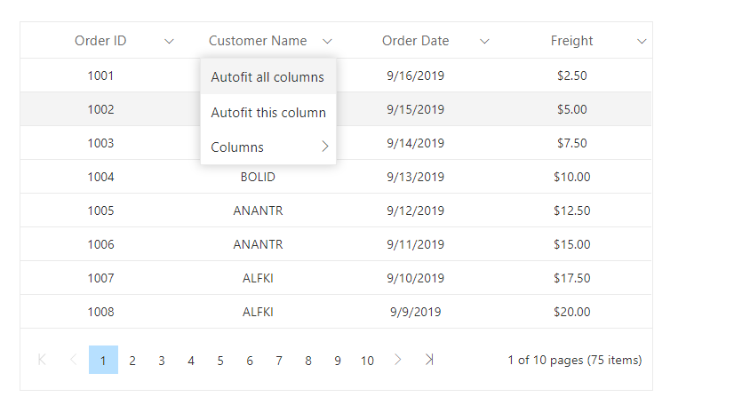

# Customize column menu icon

You can customize the column menu icon by overriding the default icon class `.e-icons.e-columnmenu` with the `content` property.

```css
.e-grid .e-columnheader .e-icons.e-columnmenu::before {
    content: "\e941";
}
```

This is demonstrated in the below sample code,

```csharp
@using Syncfusion.Blazor.Grids

<SfGrid DataSource="@Orders" AllowPaging="true" ShowColumnMenu="true">
    <GridPageSettings PageSize="8"></GridPageSettings>
    <GridColumns>
        <GridColumn Field=@nameof(Order.OrderID) HeaderText="Order ID" TextAlign="TextAlign.Center" Width="120"></GridColumn>
        <GridColumn Field=@nameof(Order.CustomerID) HeaderText="Customer Name" TextAlign="TextAlign.Center" Width="120"></GridColumn>
        <GridColumn Field=@nameof(Order.OrderDate) HeaderText=" Order Date" Format="d" Type=ColumnType.Date TextAlign="TextAlign.Center" Width="120"></GridColumn>
        <GridColumn Field=@nameof(Order.Freight) HeaderText="Freight" Format="C2" TextAlign="TextAlign.Center" Width="120"></GridColumn>
    </GridColumns>
</SfGrid>

@code{

    public List<Order> Orders { get; set; }

    protected override void OnInitialized()
    {
        Orders = Enumerable.Range(1, 75).Select(x => new Order()
        {
            OrderID = 1000 + x,
            CustomerID = (new string[] { "ALFKI", "ANANTR", "ANTON", "BLONP", "BOLID" })[new Random().Next(5)],
            Freight = 2.5 * x,
            OrderDate = DateTime.Now.AddDays(-x),
        }).ToList();
    }
    public class Order
    {
        public int? OrderID { get; set; }
        public string CustomerID { get; set; }
        public DateTime? OrderDate { get; set; }
        public double? Freight { get; set; }
    }
}

<style>
    .e-grid .e-columnheader .e-icons.e-columnmenu::before {
        .content: "\e84f";
    }
</style>
```

The following image represents datagrid with customized column menu icon
