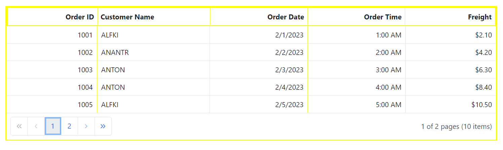

# Styling and Appearance in Blazor DataGrid Component

To modify the Grid appearance, you need to override the default CSS of grid. Find the list of CSS classes and their corresponding section in grid. Also, you have an option to create your own custom theme for all the Syncfusion Blazor components using our [Theme Studio](https://blazor.syncfusion.com/themestudio/?theme=material).

|Section|CSS class|Purpose of CSS class |
|-----|-----|----- |
|**Root**|e-grid|This class is in the root element (div) of the grid control.|
|**Header**|e-gridheader|This class is added in the root element of header element. In this class, You can override thin line between header and content of the grid.|
| |e-table|This class is added at 'table' of the grid header. This CSS class makes table width as 100 %.|
| |e-columnheader|This class is added at 'tr' of the grid header.|
| |e-headercell|This class is added in 'th' element of grid header. You can override background color of header and border color.|
| |e-headercelldiv|This class is added in the div which presents 'th' element in the header. Use the e-headercelldiv to override the skeleton of the header.|
|**Body**|e-gridcontent|This class is added at root of body content. This is to override background color of the body.|
| |e-table|This class is added to the table of content. This CSS class makes table width as 100 %.|
| |e-altrow|This class is added to alternate rows of grid. This is to override alternate row color of the grid.|
| |e-rowcell|This class is added to all cells in the grid. This is to override cells appearance and styling.|
| |e-groupcaption|This class is added to the 'td' of group caption which is to change the background color of caption cell.|
| |e-selectionbackground|This class is added to rowcell's of the grid. This is override selection.|
|**Pager**|e-pager|This class is added to root element of the pager. This to change appearance of the background color and color of font.|
| |e-pagercontainer|This class is added to numeric items of the pager.|
| |e-parentmsgbar|This class is added to pager info of the pager.|
|**Summary**|e-gridfooter|This class is added to root of the summary div.|
| |e-summaryrow|This class is added to rows of grid summary.|
| |e-summarycell|This class is added to cells of summary row. This is to override background color of summary.|

## How to customize the color of grid lines

The Syncfusion Blazor Grid component allows you to customize the color of grid lines to match your application's design and style. To customize the color of grid lines, use the GridLines property along with CSS styling to achieve this customization.

```cshtml
@using Syncfusion.Blazor.Grids

<SfGrid DataSource="@Orders" AllowPaging="true" GridLines="GridLine.Both">
    <GridPageSettings PageSize="5"></GridPageSettings>
    <GridColumns>
        <GridColumn Field=@nameof(Order.OrderID) HeaderText="Order ID" TextAlign="TextAlign.Right" Width="120"></GridColumn>
        <GridColumn Field=@nameof(Order.CustomerID) HeaderText="Customer Name" Width="150"></GridColumn>
        <GridColumn Field=@nameof(Order.OrderDate) HeaderText="Order Date" Format="d" Type="ColumnType.DateOnly" TextAlign="TextAlign.Right" Width="130"></GridColumn>
        <GridColumn Field=@nameof(Order.OrderTime) HeaderText="Order Time" Type="ColumnType.TimeOnly" TextAlign="TextAlign.Right" Width="130"></GridColumn>
        <GridColumn Field=@nameof(Order.Freight) HeaderText="Freight" Format="C2" TextAlign="TextAlign.Right" Width="120"></GridColumn>
    </GridColumns>
</SfGrid>

<style>
    .e-grid .e-gridheader, .e-grid .e-headercell, .e-grid .e-rowcell, .e-grid {
        border-color: yellow;
        border-style: solid;
        border-width: 2px;
        
    }
</style>

@code {
    public List<Order> Orders { get; set; }

    protected override void OnInitialized()
    {
        Orders = Enumerable.Range(1, 10).Select(x => new Order()
            {
                OrderID = 1000 + x,
                CustomerID = (new string[] { "ALFKI", "ANANTR", "ANTON", "BLONP", "BOLID" })[new Random().Next(5)],
                Freight = 2.1 * x,
                OrderDate = new DateOnly(2023, 2, x),
                OrderTime = new TimeOnly(x, 00)
            }).ToList();
    }

    public class Order
    {
        public int? OrderID { get; set; }
        public string CustomerID { get; set; }
        public DateOnly? OrderDate { get; set; }
        public TimeOnly? OrderTime { get; set; }
        public double? Freight { get; set; }
    }
}
```
The following image represents customized DataGrid lines,



## Icons

CSS class|Purpose of CSS class
-----|-----
e-add|This class is added to icon of Add toolbar button.
e-edit|This class is added to icon of Edit toolbar button.
e-delete|This class is added to icon of Delete toolbar button.
e-cancel|This class is added to icon of Cancel toolbar button.
e-update|This class is added to icon of Update toolbar button.
e-excelexport|This class is added to icon of ExcelExport toolbar button.
e-csvexport|This class is added to icon of CsvExport toolbar button.
e-pdfexport|This class is added to icon of PdfExport toolbar button.
e-search-icon|This class is added to icon of Search toolbar button.
e-icon-ascending|This class is added to Sort ascending notify icon in grid header.
e-icon-descending|This class is added to Sort descending notify icon in grid header.
e-icon-filter|This class is added to Filter icon in grid header.
e-icon-group|This class is added to Group icon in grid header.
e-columnmenu|This class is added to ColumnMenu icon in grid header.
e-columnchooser-btn|This class is added to ColumnChooser button icon in grid toolbar.
e-icon-gdownarrow|This class is added to collapse icon in grouped/detail row.
e-icon-grightarrow|This class is added to expand icon in grouped/detail row.
e-icon-first|This class is added to pager arrow icon which makes navigation to first page.
e-icon-prev|This class is added to pager arrow icon which makes navigation to previous page.
e-icon-last|This class is added to pager arrow icon which makes navigation to last page.
e-icon-next|This class is added to pager arrow icon which makes navigation to next page.
e-ddl-icon|This class is added to icon of pager dropdown arrow.