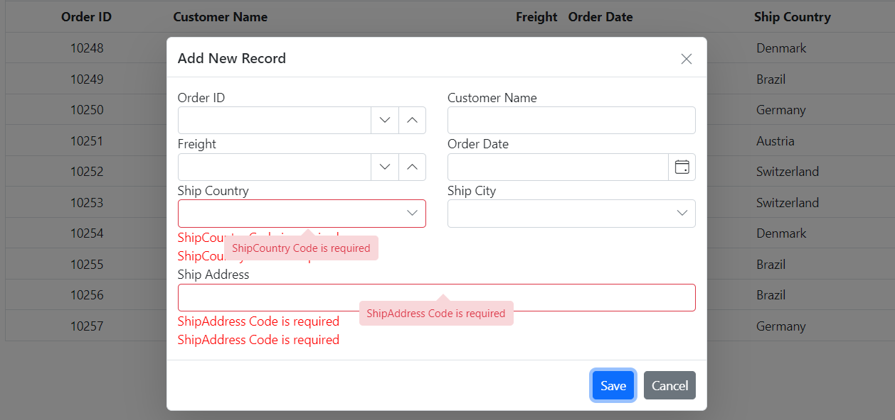
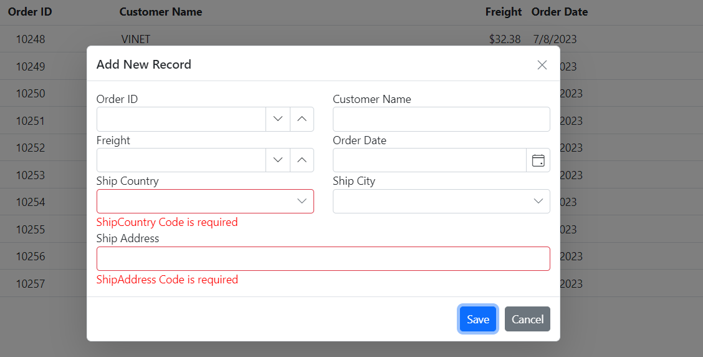

# Resolve the issue of two default validation messages shown in Grid default dialog editor:

**Error screenshot**



By default, the DataGrid uses two validator components. This issue occurs because the DataGrid uses both data annotation enabled and the ValidationMessage property defined in DataGrid component, which can lead to the issue mentioned above. To resolve this issue, disable the built-in validator and achieve column validation solely using Data Annotations or wise versa.

> For more detailed information about this topic [here](https://blazor.syncfusion.com/documentation/datagrid/column-validation#disable-in-built-validator-component).

Following a code example to how to implement column validation using the DataAnnotationValidator component instead of the built-in validator in the DataGrid component.

```cshtml
@using Syncfusion.Blazor.Grids
@using Syncfusion.Blazor.Calendars
@using Syncfusion.Blazor.DropDowns
@using Syncfusion.Blazor.Inputs
@using System.ComponentModel.DataAnnotations

<SfGrid DataSource="@GridData" Toolbar="@(new string[] {"Add", "Edit" ,"Delete","Update","Cancel" })">
    <GridEditSettings AllowAdding="true" AllowEditing="true" AllowDeleting="true" Mode="@EditMode.Dialog">
        <Validator>
            <DataAnnotationsValidator></DataAnnotationsValidator>
        </Validator>
        <Template>
            @{
                var Order = (context as OrdersDetails);
                <div>

                    <div class="row">
                        <div class="col-md-6">
                            <label class="e-label-top">Order ID</label>
                            <SfNumericTextBox ID="OrderID" @bind-Value="@(Order.OrderID)" Enabled="@((Order.OrderID == null) ? true : false)"></SfNumericTextBox>
                        </div>
                        <div class="col-md-6">
                            <label class="e-label-top">Customer Name</label>
                            <SfAutoComplete ID="customerID" TItem="OrdersDetails" @bind-Value="@(Order.CustomerID)" TValue="string" DataSource="@GridData">
                                <AutoCompleteFieldSettings Value="CustomerID"></AutoCompleteFieldSettings>
                            </SfAutoComplete>
                        </div>
                    </div>
                    <div class="row">
                        <div class="col-md-6">
                            <label class="e-label-top">Freight</label>
                            <SfNumericTextBox ID="Freight" @bind-Value="@(Order.Freight)" TValue="double?"></SfNumericTextBox>
                        </div>
                        <div class="col-md-6">
                            <label class="e-label-top">Order Date</label>
                            <SfDatePicker ID="OrderDate" @bind-Value="@(Order.OrderDate)"></SfDatePicker>
                        </div>
                    </div>
                    <div class="row">
                        <div class="col-md-6">
                            <label class="e-label-top">Ship Country</label>
                            <SfDropDownList ID="ShipCountry" @bind-Value="@(Order.ShipCountry)" TItem="OrdersDetails" TValue="string" DataSource="@GridData">
                                <DropDownListFieldSettings Value="ShipCountry" Text="ShipCountry"></DropDownListFieldSettings>
                            </SfDropDownList>
                            <ValidationMessage For="() => Order.ShipCountry" />
                        </div>
                        <div class="col-md-6">
                            <label class="e-label-top">Ship City</label>
                            <SfDropDownList ID="ShipCity" @bind-Value="@(Order.ShipCity)" TItem="OrdersDetails" TValue="string" DataSource="@GridData">
                                <DropDownListFieldSettings Value="ShipCity" Text="ShipCity"></DropDownListFieldSettings>
                            </SfDropDownList>

                        </div>
                    </div>
                    <div class="row">
                        <div class="col-md-12">
                            <label class="e-label-top">Ship Address</label>
                            <SfTextBox ID="ShipAddress" @bind-Value="@(Order.ShipAddress)"></SfTextBox>

                            <ValidationMessage For="() => Order.ShipAddress" />
                        </div>
                    </div>
                </div>
            }
        </Template>
    </GridEditSettings>
    <GridColumns>
        <GridColumn Field=@nameof(OrdersDetails.OrderID) HeaderText="Order ID" IsPrimaryKey="true" TextAlign="@TextAlign.Center" HeaderTextAlign="@TextAlign.Center" Width="140"></GridColumn>
        <GridColumn Field=@nameof(OrdersDetails.CustomerID) HeaderText="Customer Name" Width="150" MinWidth="200"></GridColumn>
        <GridColumn Field=@nameof(OrdersDetails.Freight) HeaderText="Freight" Format="C2" Width="140" TextAlign="@TextAlign.Right" HeaderTextAlign="@TextAlign.Right"></GridColumn>
        <GridColumn Field=@nameof(OrdersDetails.OrderDate) HeaderText="Order Date" Format="d"  Type="ColumnType.Date" Width="160"></GridColumn>
        <GridColumn Field=@nameof(OrdersDetails.ShipCountry)  HeaderText="Ship Country" Width="150"></GridColumn>
        <GridColumn Field=@nameof(OrdersDetails.ShipAddress) HeaderText="Ship Address" Width="150"></GridColumn>
    </GridColumns>
</SfGrid>

@code {
    public List<OrdersDetails> GridData = new List<OrdersDetails>
    {
        new OrdersDetails() { OrderID = 10248, CustomerID = "VINET", Freight = 32.38, ShipCity = "Berlin", OrderDate = DateTime.Now.AddDays(-2), ShipName = "Vins et alcools Chevalier", ShipCountry = "Denmark", ShipAddress = "Kirchgasse 6" },
        new OrdersDetails() { OrderID = 10249, CustomerID = "TOMSP", Freight = 11.61, ShipCity = "Madrid", OrderDate = DateTime.Now.AddDays(-5), ShipName = "Toms Spezialitäten", ShipCountry = "Brazil", ShipAddress = "Avda. Azteca 123" },
        new OrdersDetails() { OrderID = 10250, CustomerID = "HANAR", Freight = 65.83, ShipCity = "Cholchester", OrderDate = DateTime.Now.AddDays(-12), ShipName = "Hanari Carnes", ShipCountry = "Germany", ShipAddress = "Carrera 52 con Ave. Bolívar #65-98 Llano Largo" },
        new OrdersDetails() { OrderID = 10251, CustomerID = "VICTE", Freight = 41.34, ShipCity = "Marseille", OrderDate = DateTime.Now.AddDays(-18), ShipName = "Victuailles en stock", ShipCountry = "Austria", ShipAddress = "Magazinweg 7" },
        new OrdersDetails() { OrderID = 10252, CustomerID = "SUPRD", Freight = 51.3, ShipCity = "Tsawassen", OrderDate = DateTime.Now.AddDays(-22), ShipName = "Suprêmes délices", ShipCountry = "Switzerland", ShipAddress = "1029 - 12th Ave. S." },
        new OrdersDetails() { OrderID = 10253, CustomerID = "HANAR", Freight = 58.17, ShipCity = "Tsawassen", OrderDate = DateTime.Now.AddDays(-26), ShipName = "Hanari Carnes", ShipCountry = "Switzerland", ShipAddress = "1029 - 12th Ave. S." },
        new OrdersDetails() { OrderID = 10254, CustomerID = "CHOPS", Freight = 22.98, ShipCity = "Berlin", OrderDate = DateTime.Now.AddDays(-34), ShipName = "Chop-suey Chinese", ShipCountry = "Denmark", ShipAddress = "Kirchgasse 6" },
        new OrdersDetails() { OrderID = 10255, CustomerID = "RICSU", Freight = 148.33, ShipCity = "Madrid", OrderDate = DateTime.Now.AddDays(-39), ShipName = "Richter Supermarket", ShipCountry = "Brazil", ShipAddress = "Avda. Azteca 123" },
        new OrdersDetails() { OrderID = 10256, CustomerID = "WELLI", Freight = 13.97, ShipCity = "Madrid", OrderDate = DateTime.Now.AddDays(-43), ShipName = "Wellington Importadora", ShipCountry = "Brazil", ShipAddress = "Avda. Azteca 123" },
        new OrdersDetails() { OrderID = 10257, CustomerID = "HILAA", Freight = 81.91, ShipCity = "Cholchester", OrderDate = DateTime.Now.AddDays(-48), ShipName = "HILARION-Abastos", ShipCountry = "Germany", ShipAddress = "Carrera 52 con Ave. Bolívar #65-98 Llano Largo" }
    };

    public class OrdersDetails
    {
        public int? OrderID { get; set; }
        public string CustomerID { get; set; }
        public double? Freight { get; set; }
        public string ShipCity { get; set; }
        public DateTime? OrderDate { get; set; }
        public string ShipName { get; set; }
        [Required]
        public string ShipCountry { get; set; }
        [Required]
        public string ShipAddress { get; set; }
    }
}
```

