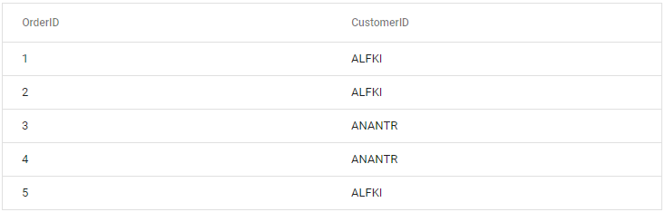

<!-- markdownlint-disable MD024 -->

# Blazor DataGrid Component in Server Side App using CLI

This article provides a step-by-step instructions for building Blazor Server App with `Blazor DataGrid` using the [.NET CLI](https://dotnet.microsoft.com/en-us/download/dotnet/3.1).

## Prerequisites

Latest version of the [.NET Core SDK](https://dotnet.microsoft.com/en-us/download). If you previously installed the SDK, you can determine the installed version by executing the following command in a command prompt (Windows) or terminal (macOS) or command shell (Linux).




dotnet --version




## Create a Blazor Server side project using .NET Core CLI

Run the `dotnet new blazorserver` command to create a new Blazor Server application in a command prompt (Windows) or terminal (macOS) or command shell (Linux).




dotnet new blazorserver -o BlazorApp
cd BlazorApp




This command creates new Blazor app project and places it in a new directory called BlazorApp inside your current location. See [Create Blazor app topic](https://dotnet.microsoft.com/en-us/learn/aspnet/blazor-tutorial/create) and [dotnet new CLI](https://learn.microsoft.com/en-us/dotnet/core/tools/dotnet-new) command topics for more details.

N> If you have installed multiple SDK versions and need any specific framework version (net5.0/netcoreapp3.1) project, then add -f flag along with dotnet new blazorserver comment. Refer [here](https://learn.microsoft.com/en-us/dotnet/core/tools/dotnet-new) for the available options.

## Install Syncfusion Blazor packages in the App

Syncfusion Blazor components are available in [nuget.org](https://www.nuget.org/packages?q=syncfusion.blazor). To use Syncfusion Blazor components in the application, add reference to the corresponding NuGet. Refer to [NuGet packages topic](https://blazor.syncfusion.com/documentation/nuget-packages) for available NuGet packages list with component details.

Add `Syncfusion.Blazor.Grid` NuGet package to the application using the following command in the command prompt (Windows) or terminal (Linux and macOS) to install a NuGet package. See [Install and manage packages using the dotnet CLI](https://learn.microsoft.com/en-us/nuget/consume-packages/install-use-packages-dotnet-cli) topics for more details.




dotnet add package Syncfusion.Blazor.Grid --version {{ site.releaseversion }}
dotnet restore




## Register Syncfusion Blazor Service

Open **~/_Imports.razor** file and import the `Syncfusion.Blazor` namespace.




@using Syncfusion.Blazor




Now, register the Syncfusion Blazor Service in the Blazor Server App. Here, Syncfusion Blazor Service is registered by setting [IgnoreScriptIsolation](https://help.syncfusion.com/cr/blazor/Syncfusion.Blazor.GlobalOptions.html#Syncfusion_Blazor_GlobalOptions_IgnoreScriptIsolation) property as true to load the scripts externally in the [next steps](#add-script-reference).

N> From 2022 Vol-1 (20.1) version, the default value of `IgnoreScriptIsolation` is changed to `true`. It is not necessary to set the `IgnoreScriptIsolation` property to refer scripts externally, since the default value has already been changed to true, and this property is obsolete.

* For **.NET 6 and .NET 7** app, open the **~/Program.cs** file and register the Syncfusion Blazor Service.

* For **.NET 5 and .NET 3.X** app, open the **~/Startup.cs** file and register the Syncfusion Blazor Service.




using Microsoft.AspNetCore.Components;
using Microsoft.AspNetCore.Components.Web;
using Syncfusion.Blazor;

var builder = WebApplication.CreateBuilder(args);

// Add services to the container.
builder.Services.AddRazorPages();
builder.Services.AddServerSideBlazor();
builder.Services.AddSyncfusionBlazor();

var app = builder.Build();
....





using Syncfusion.Blazor;

namespace BlazorApp
{
    public class Startup
    {
        ...
        public void ConfigureServices(IServiceCollection services)
        {
            services.AddRazorPages();
            services.AddServerSideBlazor();
            services.AddSyncfusionBlazor();
        }
        ...
    }
}




## Add style sheet

Checkout the [Blazor Themes topic](https://blazor.syncfusion.com/documentation/appearance/themes) to learn different ways ([Static Web Assets](https://blazor.syncfusion.com/documentation/appearance/themes#static-web-assets), [CDN](https://sfblazor.azurewebsites.net/staging/documentation/appearance/themes#cdn-reference) and [CRG](https://blazor.syncfusion.com/documentation/common/custom-resource-generator)) to refer themes in Blazor application, and to have the expected appearance for Syncfusion Blazor components. Here, the theme is referred using [Static Web Assets](https://blazor.syncfusion.com/documentation/appearance/themes#static-web-assets).

To add theme to the app, add `Syncfusion.Blazor.Themes` NuGet package to the application using the following command in the command prompt (Windows) or terminal (Linux and macOS) to install a NuGet package.




dotnet add package Syncfusion.Blazor.Themes --version {{ site.releaseversion }}
dotnet restore




Then, the theme style sheet from NuGet can be referred inside the `<head>` as follows,

* **~/Pages/_Layout.cshtml** file for **.NET 6**.
* **~/Pages/_Host.cshtml** file for **.NET 3.X, .NET 5 and .NET 7**.




<head>
    ....
    <link href="_content/Syncfusion.Blazor.Themes/bootstrap5.css" rel="stylesheet" />
</head>





<head>
    ....
    <link href="_content/Syncfusion.Blazor.Themes/bootstrap5.css" rel="stylesheet" />
</head>




## Add script reference

Checkout [Adding Script Reference topic](https://blazor.syncfusion.com/documentation/common/adding-script-references) to learn different ways to add script reference in Blazor Application. In this getting started walk-through, the required scripts are referred using [Static Web Assets](https://sfblazor.azurewebsites.net/staging/documentation/common/adding-script-references#static-web-assets) externally inside the `<head>` as follows,

* **~/Pages/_Layout.cshtml** for **.NET 6**.
* **~/Pages/_Host.cshtml** file for **.NET 3.X, .NET 5 and .NET 7**.




<head>
    ....
    <link href="_content/Syncfusion.Blazor.Themes/bootstrap5.css" rel="stylesheet" />
    
</head>





<head>
    ....
    <link href="_content/Syncfusion.Blazor.Themes/bootstrap5.css" rel="stylesheet" />
    
</head>




N> Syncfusion recommends to reference scripts using [Static Web Assets](https://blazor.syncfusion.com/documentation/common/adding-script-references#static-web-assets), [CDN](https://blazor.syncfusion.com/documentation/common/adding-script-references#cdn-reference) and [CRG](https://blazor.syncfusion.com/documentation/common/custom-resource-generator) by [disabling JavaScript isolation](https://blazor.syncfusion.com/documentation/common/adding-script-references#disable-javascript-isolation) for better loading performance of the Blazor application. Generate scripts and theme assets using [CRG](https://blazor.syncfusion.com/documentation/common/custom-resource-generator) by selecting the components you were using in the application.

## Add Blazor DataGrid component

* Open **~/_Imports.razor** file or any other page under the `~/Pages` folder where the component is to be added and import the **Syncfusion.Blazor.Grids** namespace.




@using Syncfusion.Blazor
@using Syncfusion.Blazor.Grids




* Now, add the Syncfusion DataGrid component in razor file. Here, the DataGrid component is added in the **~/Pages/Index.razor** file under the **~/Pages** folder.




<SfGrid DataSource="@Orders" />

@code{
    public List<Order> Orders { get; set; }

    protected override void OnInitialized()
    {
        Orders = Enumerable.Range(1, 5).Select(x => new Order()
        {
            OrderID = 0 + x,
            CustomerID = (new string[] { "ALFKI", "ANANTR", "ANTON", "BLONP", "BOLID" })[new Random().Next(5)],
        }).ToList();
    }

    public class Order
    {
        public int? OrderID { get; set; }
        public string CustomerID { get; set; }

    }
}




* In the command prompt (Windows) or terminal (Linux and macOS) to run the following command to build and start the app. The app listening on `http://localhost:<port number>` and view it in the browser.




dotnet run




N> You need to include a valid license key (either paid or trial key) within your applications. Refer to this [help topic](https://blazor.syncfusion.com/documentation/getting-started/license-key/overview) for more information.

## Defining Row Data

To bind data for the DataGrid component, you can assign a IEnumerable object to the [DataSource](https://help.syncfusion.com/cr/blazor/Syncfusion.Blazor.Grids.SfGrid-1.html#Syncfusion_Blazor_Grids_SfGrid_1_DataSource) property. The list data source can also be provided as an instance of the `DataManager`. You can assign the data source through the `OnInitialized` life cycle of the page.




<SfGrid DataSource="@Orders" />

@code{
    public List<Order> Orders { get; set; }

    protected override void OnInitialized()
    {
        Orders = Enumerable.Range(1, 75).Select(x => new Order()
        {
            OrderID = 1000 + x,
            CustomerID = (new string[] { "ALFKI", "ANANTR", "ANTON", "BLONP", "BOLID" })[new Random().Next(5)],
            Freight = 2.1 * x,
            OrderDate = DateTime.Now.AddDays(-x),
        }).ToList();
    }

    public class Order {
        public int? OrderID { get; set; }
        public string CustomerID { get; set; }
        public DateTime? OrderDate { get; set; }
        public double? Freight { get; set; }
    }
}




## Defining columns

The columns are automatically generated when columns declaration is empty or undefined while initializing the datagrid.

The DataGrid has an option to define columns using [GridColumns](https://help.syncfusion.com/cr/aspnetcore-blazor/Syncfusion.Blazor.Grids.GridColumns.html) component. In `GridColumn` component we have properties to customize columns.

Let’s check the properties used here:

* [Field](https://help.syncfusion.com/cr/blazor/Syncfusion.Blazor.Grids.GridColumn.html#Syncfusion_Blazor_Grids_GridColumn_Field) is added to map with a property name an array of JavaScript objects.
* [HeaderText](https://help.syncfusion.com/cr/blazor/Syncfusion.Blazor.Grids.GridColumn.html#Syncfusion_Blazor_Grids_GridColumn_HeaderText) is added to change the title of columns.
* [TextAlign](https://help.syncfusion.com/cr/blazor/Syncfusion.Blazor.Grids.GridColumn.html#Syncfusion_Blazor_Grids_GridColumn_TextAlign) is used to change the alignment of columns. By default, columns will be left aligned. To change columns to right align, define `TextAlign` as `Right`.
* Also, we have used another useful property, [Format](https://help.syncfusion.com/cr/blazor/Syncfusion.Blazor.Grids.GridColumn.html#Syncfusion_Blazor_Grids_GridColumn_Format). Using this, you can format number and date values to standard or custom formats.




<SfGrid DataSource="@Orders">
    <GridColumns>
        <GridColumn Field=@nameof(Order.OrderID) HeaderText="Order ID" TextAlign="TextAlign.Right" Width="120"></GridColumn>
        <GridColumn Field=@nameof(Order.CustomerID) HeaderText="Customer Name" Width="150"></GridColumn>
        <GridColumn Field=@nameof(Order.OrderDate) HeaderText=" Order Date" Format="d" Type="ColumnType.Date" TextAlign="TextAlign.Right" Width="130"></GridColumn>
        <GridColumn Field=@nameof(Order.Freight) HeaderText="Freight" Format="C2" TextAlign="TextAlign.Right" Width="120"></GridColumn>
    </GridColumns>
</SfGrid>




## Enable paging

The paging feature enables users to view the datagrid record in a paged view. It can be enabled by setting the [AllowPaging](https://help.syncfusion.com/cr/blazor/Syncfusion.Blazor.Grids.SfGrid-1.html#Syncfusion_Blazor_Grids_SfGrid_1_AllowPaging) property to true. Pager can be customized using the [GridPageSettings](https://help.syncfusion.com/cr/blazor/Syncfusion.Blazor.Grids.SfGrid-1.html#Syncfusion_Blazor_Grids_SfGrid_1_PageSettings) component.




<SfGrid DataSource="@Orders" AllowPaging="true">
 <GridPageSettings PageSize="5"></GridPageSettings>
   <GridColumns>
     <GridColumn Field=@nameof(Order.OrderID) HeaderText="Order ID" TextAlign="TextAlign.Right" Width="120"></GridColumn>
     <GridColumn Field=@nameof(Order.CustomerID) HeaderText="Customer Name" Width="150"></GridColumn>
     <GridColumn Field=@nameof(Order.OrderDate) HeaderText=" Order Date" Format="d" Type="ColumnType.Date" TextAlign="TextAlign.Right" Width="130"></GridColumn>
     <GridColumn Field=@nameof(Order.Freight) HeaderText="Freight" Format="C2" TextAlign="TextAlign.Right" Width="120"></GridColumn>
   </GridColumns>
</SfGrid>




## Enable sorting

The sorting feature enables you to order the records. It can be enabled by setting the [AllowSorting](https://help.syncfusion.com/cr/blazor/Syncfusion.Blazor.Grids.SfGrid-1.html#Syncfusion_Blazor_Grids_SfGrid_1_AllowSorting) property as true. Sorting feature can be customized using the [GridSortSettings](https://help.syncfusion.com/cr/blazor/Syncfusion.Blazor.Grids.SfGrid-1.html#Syncfusion_Blazor_Grids_SfGrid_1_SortSettings) component.




<SfGrid DataSource="@Orders" AllowPaging="true" AllowSorting="true">
 <GridPageSettings PageSize="5"></GridPageSettings>
   <GridColumns>
     <GridColumn Field=@nameof(Order.OrderID) HeaderText="Order ID" TextAlign="TextAlign.Right" Width="120"></GridColumn>
     <GridColumn Field=@nameof(Order.CustomerID) HeaderText="Customer Name" Width="150"></GridColumn>
     <GridColumn Field=@nameof(Order.OrderDate) HeaderText=" Order Date" Format="d" Type="ColumnType.Date" TextAlign="TextAlign.Right" Width="130"></GridColumn>
     <GridColumn Field=@nameof(Order.Freight) HeaderText="Freight" Format="C2" TextAlign="TextAlign.Right" Width="120"></GridColumn>
   </GridColumns>
</SfGrid>




## Enable filtering

The filtering feature enables you to view reduced amount of records based on filter criteria. It can be enabled by setting the [AllowFiltering](https://help.syncfusion.com/cr/blazor/Syncfusion.Blazor.Grids.SfGrid-1.html#Syncfusion_Blazor_Grids_SfGrid_1_AllowFiltering) property as true. Filtering feature can be customized using the [GridFilterSettings](https://help.syncfusion.com/cr/blazor/Syncfusion.Blazor.Grids.SfGrid-1.html#Syncfusion_Blazor_Grids_SfGrid_1_FilterSettings) component.




<SfGrid DataSource="@Orders" AllowPaging="true" AllowSorting="true" AllowFiltering="true">
 <GridPageSettings PageSize="5"></GridPageSettings>
   <GridColumns>
     <GridColumn Field=@nameof(Order.OrderID) HeaderText="Order ID" TextAlign="TextAlign.Right" Width="120"></GridColumn>
     <GridColumn Field=@nameof(Order.CustomerID) HeaderText="Customer Name" Width="150"></GridColumn>
     <GridColumn Field=@nameof(Order.OrderDate) HeaderText=" Order Date" Format="d" Type="ColumnType.Date" TextAlign="TextAlign.Right" Width="130"></GridColumn>
     <GridColumn Field=@nameof(Order.Freight) HeaderText="Freight" Format="C2" TextAlign="TextAlign.Right" Width="120"></GridColumn>
   </GridColumns>
</SfGrid>




## Enable grouping

The grouping feature enables you to view the datagrid record in a grouped view. It can be enabled by setting the [AllowGrouping](https://help.syncfusion.com/cr/blazor/Syncfusion.Blazor.Grids.SfGrid-1.html#Syncfusion_Blazor_Grids_SfGrid_1_AllowGrouping) property as true. Grouping feature can be customized using the [GridGroupSettings](https://help.syncfusion.com/cr/blazor/Syncfusion.Blazor.Grids.SfGrid-1.html#Syncfusion_Blazor_Grids_SfGrid_1_GroupSettings) component.




<SfGrid DataSource="@Orders" AllowPaging="true" AllowSorting="true" AllowFiltering="true" AllowGrouping="true">
 <GridPageSettings PageSize="5"></GridPageSettings>
   <GridColumns>
     <GridColumn Field=@nameof(Order.OrderID) HeaderText="Order ID" TextAlign="TextAlign.Right" Width="120"></GridColumn>
     <GridColumn Field=@nameof(Order.CustomerID) HeaderText="Customer Name" Width="150"></GridColumn>
     <GridColumn Field=@nameof(Order.OrderDate) HeaderText=" Order Date" Format="d" Type="ColumnType.Date" TextAlign="TextAlign.Right" Width="130"></GridColumn>
     <GridColumn Field=@nameof(Order.Freight) HeaderText="Freight" Format="C2" TextAlign="TextAlign.Right" Width="120"></GridColumn>
   </GridColumns>
</SfGrid>




## See also

* [Getting Started with Syncfusion DataGrid in Blazor Server-Side using Visual Studio 2019](../getting-started)

* [Getting started with Syncfusion Data Grid in Blazor WebAssembly App using .NET Core CLI](./blazor-webassembly-data-grid-using-cli)

* [Getting Started with Syncfusion DataGrid in Blazor WebAssembly using Visual Studio 2019](./blazor-webassembly-datagrid-using-visual-studio)
