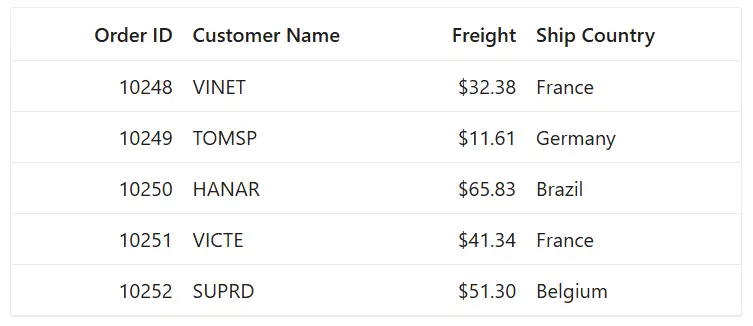
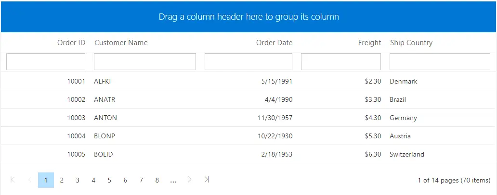

# Blazor Data Grid Server App Using .NET CLI

The article explains how to build a Blazor Web App with [Blazor Data Grid](https://www.syncfusion.com/blazor-components/blazor-datagrid) using the [.NET CLI](https://dotnet.microsoft.com/en-us/download/dotnet). The instructions target .NET 8 and .NET 9 with Server interactivity.

## Manually creating a project

Manual project creation uses the .NET CLI to create a Blazor Web App with Server interactivity.

### Prerequisites

Install the [.NET SDK](https://dotnet.microsoft.com/en-us/download) for .NET 8 or .NET 9. Verify installed SDKs with the command below:




dotnet --list-sdks




To check the current default .NET SDK version installed on a system, run the command below in a terminal or command prompt:




dotnet --version




### Create a Blazor Server project using the .NET CLI

Create a new standalone Blazor Server application using the .NET CLI by running the command below:




dotnet new blazorserver -o BlazorApp
cd BlazorApp




The command creates a standalone Blazor Server app in a directory named BlazorApp within the current working location. For more details, refer to the [Create a Blazor app](https://dotnet.microsoft.com/en-us/learn/aspnet/blazor-tutorial/create) and [dotnet new CLI](https://learn.microsoft.com/en-us/dotnet/core/tools/dotnet-new) documentation.

N> The `-f` option selects the target framework. Use `net8.0` with the .NET 8 SDK or `net9.0` with the .NET 9 SDK. Refer to the [dotnet new options](https://learn.microsoft.com/en-us/dotnet/core/tools/dotnet-new) for available flags.

### Install Blazor Data Grid and Themes NuGet in the app

To add the `Syncfusion.Blazor.Grid` NuGet package to the application, run the command below in the command prompt (Windows) or terminal (Linux/macOS). For more details, refer to [Install and manage packages using the dotnet CLI](https://learn.microsoft.com/en-us/nuget/consume-packages/install-use-packages-dotnet-cli).




dotnet add package Syncfusion.Blazor.Grid --version {{ site.releaseversion }}
dotnet add package Syncfusion.Blazor.Themes --version {{ site.releaseversion }}
dotnet restore




N> Blazor components are available on [nuget.org](https://www.nuget.org/packages?q=syncfusion.blazor). Refer to the [NuGet packages](https://blazor.syncfusion.com/documentation/nuget-packages) topic for the list of available packages and component details. For projects requiring a license key, see the [licensing](https://blazor.syncfusion.com/documentation/common/essential-studio/licensing/overview) topic to register the license key at startup.

### Register Blazor services

1. Import namespaces:

Open the **~/_Imports.razor** file and add the namespaces below:

```razor

@using Syncfusion.Blazor
@using Syncfusion.Blazor.Grids

```
2. Register the service:

In **~/Program.cs**, register the Blazor services and map Server-interactive components:




using Microsoft.AspNetCore.Components;
using Microsoft.AspNetCore.Components.Web;
using Syncfusion.Blazor;

var builder = WebApplication.CreateBuilder(args);

// Add services to the container.
builder.Services.AddRazorPages();
builder.Services.AddServerSideBlazor();
builder.Services.AddSyncfusionBlazor();

var app = builder.Build();
....




### Add stylesheet and script resources

Theme stylesheet and script resources can be accessed from NuGet through [Static Web Assets](https://blazor.syncfusion.com/documentation/appearance/themes#static-web-assets). Reference the stylesheet in the `<head>` section and the script before the closing `<body>` tag in **~/Components/App.razor**:

```razor
<head>
    <link href="_content/Syncfusion.Blazor.Themes/bootstrap5.css" rel="stylesheet" />
</head>

<body>
    <script src="_content/Syncfusion.Blazor.Core/scripts/syncfusion-blazor.min.js" type="text/javascript"></script>
</body>

```
N> Review the [Blazor Themes](https://blazor.syncfusion.com/documentation/appearance/themes) topic to learn various methods ([Static Web Assets](https://blazor.syncfusion.com/documentation/appearance/themes#static-web-assets), [CDN](https://blazor.syncfusion.com/documentation/appearance/themes#cdn-reference), and [CRG](https://blazor.syncfusion.com/documentation/common/custom-resource-generator)) for referencing themes in a Blazor application. Also, see [Adding Script Reference](https://blazor.syncfusion.com/documentation/common/adding-script-references) for approaches to add script references.

### Add Blazor Data Grid

Add the Blazor Data Grid in the **~/Components/Pages/Home.razor** file. Add `@rendermode InteractiveServer` to enable Server interactivity on the page. Empty column markup enables automatic column generation from the public properties of `OrderData`.




@using Syncfusion.Blazor.Grids
@rendermode InteractiveServer

<SfGrid DataSource="@Orders"></SfGrid>

@code {
    private List<OrderData> Orders { get; set; } = OrderData.GetAllRecords();
}




public class OrderData
{
    public OrderData(int? orderId, string customerId)
    {
        OrderID = orderId;
        CustomerID = customerId;
    }
    public static List<OrderData> GetAllRecords()
    {
        return new List<OrderData>
        {
            new OrderData(1, "ALFKI"),
            new OrderData(2, "ALFKI"),
            new OrderData(3, "ANANTR"),
            new OrderData(4, "ANANTR"),
            new OrderData(5, "ALFKI")
        };
    }
    public int? OrderID { get; set; }
    public string CustomerID { get; set; }
}




Build and run the Blazor Server app with the command below:




dotnet run




The terminal displays the local application URLs after startup. Open `https://localhost:5001` in a browser, or open the HTTPS URL displayed by `dotnet run` when a different port is assigned.





### Defining row data

To bind data for the Blazor Data Grid, assign a `List<OrderData>` (or any collection that implements `IEnumerable<OrderData>`) to the [DataSource](https://help.syncfusion.com/cr/blazor/Syncfusion.Blazor.Grids.SfGrid-1.html#Syncfusion_Blazor_Grids_SfGrid_1_DataSource) property. A list data source can also be provided as an instance of the `DataManager`. Data assignment commonly occurs in the `OnInitialized` lifecycle method of the page.




@using Syncfusion.Blazor.Grids

@rendermode InteractiveServer

<SfGrid DataSource="@Orders"></SfGrid>

@code {
    private List<OrderData> Orders { get; set; } = OrderData.GetAllRecords();
}




public class OrderData
{
    public OrderData(int? orderId, string customerId, DateTime? orderDate, double? freight)
    {
        OrderID = orderId;
        CustomerID = customerId;
        OrderDate = orderDate;
        Freight = freight;
    }
    public static List<OrderData> GetAllRecords()
    {
        return new List<OrderData>
        {
            new OrderData(10248, "VINET", new DateTime(1996, 07, 07), 32.38),
            new OrderData(10249, "TOMSP", new DateTime(1996, 07, 07), 92.38),
            new OrderData(10250, "HANAR", new DateTime(1996, 07, 07), 62.77),
            new OrderData(10251, "VICTE", new DateTime(1996, 07, 07), 12.38),
            new OrderData(10252, "SUPRD", new DateTime(1996, 07, 07), 82.38),
            new OrderData(10253, "CHOPS", new DateTime(1996, 07, 07), 31.31),
            new OrderData(10254, "RICSU", new DateTime(1996, 07, 07), 22.37),
            new OrderData(10255, "WELLI", new DateTime(1996, 07, 07), 44.34),
            new OrderData(10256, "RICSU", new DateTime(1996, 07, 07), 31.33)
        };
    }
    public int? OrderID { get; set; }
    public string CustomerID { get; set; }
    public DateTime? OrderDate { get; set; }
    public double? Freight { get; set; }
} 





### Defining columns

Columns are automatically generated when the column declaration is empty or undefined during initialization of the Blazor Data Grid.

The Blazor Data Grid also supports defining columns using [GridColumns](https://help.syncfusion.com/cr/blazor/Syncfusion.Blazor.Grids.GridColumns.html). In `GridColumn`, several properties are available to customize column behavior.

Key properties in the configuration:

* [Field](https://help.syncfusion.com/cr/blazor/Syncfusion.Blazor.Grids.GridColumn.html#Syncfusion_Blazor_Grids_GridColumn_Field) : Binds the column to a property in the data model.

* [HeaderText](https://help.syncfusion.com/cr/blazor/Syncfusion.Blazor.Grids.GridColumn.html#Syncfusion_Blazor_Grids_GridColumn_HeaderText) : Sets the displayed column title.

* [TextAlign](https://help.syncfusion.com/cr/blazor/Syncfusion.Blazor.Grids.GridColumn.html#Syncfusion_Blazor_Grids_GridColumn_TextAlign) : Controls the horizontal alignment of cell text. By default, text is left-aligned; set `TextAlign.Right` to right-align.

* [Format](https://help.syncfusion.com/cr/blazor/Syncfusion.Blazor.Grids.GridColumn.html#Syncfusion_Blazor_Grids_GridColumn_Format) : Applies standard or custom formatting to numeric and date values.

* [Type](https://help.syncfusion.com/cr/blazor/Syncfusion.Blazor.Grids.GridColumn.html#Syncfusion_Blazor_Grids_GridColumn_Type) : Specifies the column data type.

* [Width](https://help.syncfusion.com/cr/blazor/Syncfusion.Blazor.Grids.GridColumn.html#Syncfusion_Blazor_Grids_GridColumn_Width) : Sets the column width.




@using Syncfusion.Blazor.Grids

@rendermode InteractiveServer

<SfGrid DataSource="@Orders">
    <GridColumns>
        <GridColumn Field=@nameof(OrderData.OrderID) HeaderText="Order ID" TextAlign="Syncfusion.Blazor.Grids.TextAlign.Right" Width="120"></GridColumn>
        <GridColumn Field=@nameof(OrderData.CustomerID) HeaderText="Customer ID" Width="150"></GridColumn>
        <GridColumn Field=@nameof(OrderData.Freight) HeaderText="Freight" Format="C2" TextAlign="Syncfusion.Blazor.Grids.TextAlign.Right" Width="120"></GridColumn>
        <GridColumn Field=@nameof(OrderData.OrderDate) HeaderText="Order Date" Format="d" Type="Syncfusion.Blazor.Grids.ColumnType.Date" TextAlign="Syncfusion.Blazor.Grids.TextAlign.Right" Width="130"></GridColumn>
    </GridColumns>
</SfGrid>

@code {
    private List<OrderData> Orders { get; set; } = OrderData.GetAllRecords();
}




public class OrderData
{
    public OrderData()
    {

    }
    public OrderData(int? orderId, string customerId, DateTime? orderDate, double? freight)
    {
        OrderID = orderId;
        CustomerID = customerId;
        OrderDate = orderDate;
        Freight = freight;
    }
    public static List<OrderData> GetAllRecords()
    {
        return new List<OrderData>
        {
            new OrderData(10248, "VINET", new DateTime(1996, 07, 07), 32.38),
            new OrderData(10249, "TOMSP", new DateTime(1996, 07, 07), 92.38),
            new OrderData(10250, "HANAR", new DateTime(1996, 07, 07), 62.77),
            new OrderData(10251, "VICTE", new DateTime(1996, 07, 07), 12.38),
            new OrderData(10252, "SUPRD", new DateTime(1996, 07, 07), 82.38),
            new OrderData(10253, "CHOPS", new DateTime(1996, 07, 07), 31.31),
            new OrderData(10254, "RICSU", new DateTime(1996, 07, 07), 22.37),
            new OrderData(10255, "WELLI", new DateTime(1996, 07, 07), 44.34),
            new OrderData(10256, "RICSU", new DateTime(1996, 07, 07), 31.33)
        };
    }
    public int? OrderID { get; set; }
    public string CustomerID { get; set; }
    public DateTime? OrderDate { get; set; }
    public double? Freight { get; set; }
} 





### Enable paging

The Blazor Data Grid can display records in a paged format. Set the [AllowPaging](https://help.syncfusion.com/cr/blazor/Syncfusion.Blazor.Grids.SfGrid-1.html#Syncfusion_Blazor_Grids_SfGrid_1_AllowPaging) property to **true** and set the [PageSize](https://help.syncfusion.com/cr/blazor/Syncfusion.Blazor.Grids.GridPageSettings.html#Syncfusion_Blazor_Grids_GridPageSettings_PageSize) property inside `GridPageSettings` to control the number of records per page.




@using Syncfusion.Blazor.Grids

@rendermode InteractiveServer

<SfGrid DataSource="@Orders" AllowPaging="true">
     <GridPageSettings PageSize="5"></GridPageSettings>
    <GridColumns>
        <GridColumn Field=@nameof(OrderData.OrderID) HeaderText="Order ID" TextAlign="Syncfusion.Blazor.Grids.TextAlign.Right" Width="120"></GridColumn>
        <GridColumn Field=@nameof(OrderData.CustomerID) HeaderText="Customer ID" Width="150"></GridColumn>
        <GridColumn Field=@nameof(OrderData.Freight) HeaderText="Freight" Format="C2" TextAlign="Syncfusion.Blazor.Grids.TextAlign.Right" Width="120"></GridColumn>
        <GridColumn Field=@nameof(OrderData.OrderDate) HeaderText="Order Date" Format="d" Type="Syncfusion.Blazor.Grids.ColumnType.Date" TextAlign="Syncfusion.Blazor.Grids.TextAlign.Right" Width="130"></GridColumn>
    </GridColumns>
</SfGrid>

@code {
    private List<OrderData> Orders { get; set; } = OrderData.GetAllRecords();
}




public class OrderData
{
    public OrderData()
    {

    }
    public OrderData(int? orderId, string customerId, DateTime? orderDate, double? freight)
    {
        OrderID = orderId;
        CustomerID = customerId;
        OrderDate = orderDate;
        Freight = freight;
    }
    public static List<OrderData> GetAllRecords()
    {
        return new List<OrderData>
        {
            new OrderData(10248, "VINET", new DateTime(1996, 07, 07), 32.38),
            new OrderData(10249, "TOMSP", new DateTime(1996, 07, 07), 92.38),
            new OrderData(10250, "HANAR", new DateTime(1996, 07, 07), 62.77),
            new OrderData(10251, "VICTE", new DateTime(1996, 07, 07), 12.38),
            new OrderData(10252, "SUPRD", new DateTime(1996, 07, 07), 82.38),
            new OrderData(10253, "CHOPS", new DateTime(1996, 07, 07), 31.31),
            new OrderData(10254, "RICSU", new DateTime(1996, 07, 07), 22.37),
            new OrderData(10255, "WELLI", new DateTime(1996, 07, 07), 44.34),
            new OrderData(10256, "RICSU", new DateTime(1996, 07, 07), 31.33)
        };
    }
    public int? OrderID { get; set; }
    public string CustomerID { get; set; }
    public DateTime? OrderDate { get; set; }
    public double? Freight { get; set; }
} 





### Enable sorting

The Blazor Data Grid can sort records in ascending or descending order. Set the [AllowSorting](https://help.syncfusion.com/cr/blazor/Syncfusion.Blazor.Grids.SfGrid-1.html#Syncfusion_Blazor_Grids_SfGrid_1_AllowSorting) property to **true**.




@using Syncfusion.Blazor.Grids

@rendermode InteractiveServer

<SfGrid DataSource="@Orders" AllowSorting="true">
    <GridColumns>
        <GridColumn Field=@nameof(OrderData.OrderID) HeaderText="Order ID" TextAlign="Syncfusion.Blazor.Grids.TextAlign.Right" Width="120"></GridColumn>
        <GridColumn Field=@nameof(OrderData.CustomerID) HeaderText="Customer ID" Width="150"></GridColumn>
        <GridColumn Field=@nameof(OrderData.Freight) HeaderText="Freight" Format="C2" TextAlign="Syncfusion.Blazor.Grids.TextAlign.Right" Width="120"></GridColumn>
        <GridColumn Field=@nameof(OrderData.OrderDate) HeaderText="Order Date" Format="d" Type="Syncfusion.Blazor.Grids.ColumnType.Date" TextAlign="Syncfusion.Blazor.Grids.TextAlign.Right" Width="130"></GridColumn>
    </GridColumns>
</SfGrid>

@code {
    private List<OrderData> Orders { get; set; } = OrderData.GetAllRecords();
}




public class OrderData
{
    public OrderData()
    {

    }
    public OrderData(int? orderId, string customerId, DateTime? orderDate, double? freight)
    {
        OrderID = orderId;
        CustomerID = customerId;
        OrderDate = orderDate;
        Freight = freight;
    }
    public static List<OrderData> GetAllRecords()
    {
        return new List<OrderData>
        {
            new OrderData(10248, "VINET", new DateTime(1996, 07, 07), 32.38),
            new OrderData(10249, "TOMSP", new DateTime(1996, 07, 07), 92.38),
            new OrderData(10250, "HANAR", new DateTime(1996, 07, 07), 62.77),
            new OrderData(10251, "VICTE", new DateTime(1996, 07, 07), 12.38),
            new OrderData(10252, "SUPRD", new DateTime(1996, 07, 07), 82.38),
            new OrderData(10253, "CHOPS", new DateTime(1996, 07, 07), 31.31),
            new OrderData(10254, "RICSU", new DateTime(1996, 07, 07), 22.37),
            new OrderData(10255, "WELLI", new DateTime(1996, 07, 07), 44.34),
            new OrderData(10256, "RICSU", new DateTime(1996, 07, 07), 31.33)
        };
    }
    public int? OrderID { get; set; }
    public string CustomerID { get; set; }
    public DateTime? OrderDate { get; set; }
    public double? Freight { get; set; }
} 





### Enable filtering

The Blazor Data Grid can filter records to display only records that meet specific criteria. To enable filtering, set the [AllowFiltering](https://help.syncfusion.com/cr/blazor/Syncfusion.Blazor.Grids.SfGrid-1.html#Syncfusion_Blazor_Grids_SfGrid_1_AllowFiltering) property to **true**. Customize filtering behavior using the [GridFilterSettings](https://help.syncfusion.com/cr/blazor/Syncfusion.Blazor.Grids.SfGrid-1.html#Syncfusion_Blazor_Grids_SfGrid_1_FilterSettings).




@using Syncfusion.Blazor.Grids

@rendermode InteractiveServer

<SfGrid DataSource="@Orders" AllowFiltering="true">
    <GridColumns>
        <GridColumn Field=@nameof(OrderData.OrderID) HeaderText="Order ID" TextAlign="Syncfusion.Blazor.Grids.TextAlign.Right" Width="120"></GridColumn>
        <GridColumn Field=@nameof(OrderData.CustomerID) HeaderText="Customer ID" Width="150"></GridColumn>
        <GridColumn Field=@nameof(OrderData.Freight) HeaderText="Freight" Format="C2" TextAlign="Syncfusion.Blazor.Grids.TextAlign.Right" Width="120"></GridColumn>
        <GridColumn Field=@nameof(OrderData.OrderDate) HeaderText="Order Date" Format="d" Type="Syncfusion.Blazor.Grids.ColumnType.Date" TextAlign="Syncfusion.Blazor.Grids.TextAlign.Right" Width="130"></GridColumn>
    </GridColumns>
</SfGrid>

@code {
    private List<OrderData> Orders { get; set; } = OrderData.GetAllRecords();
}




public class OrderData
{
    public OrderData()
    {

    }
    public OrderData(int? orderId, string customerId, DateTime? orderDate, double? freight)
    {
        OrderID = orderId;
        CustomerID = customerId;
        OrderDate = orderDate;
        Freight = freight;
    }
    public static List<OrderData> GetAllRecords()
    {
        return new List<OrderData>
        {
            new OrderData(10248, "VINET", new DateTime(1996, 07, 07), 32.38),
            new OrderData(10249, "TOMSP", new DateTime(1996, 07, 07), 92.38),
            new OrderData(10250, "HANAR", new DateTime(1996, 07, 07), 62.77),
            new OrderData(10251, "VICTE", new DateTime(1996, 07, 07), 12.38),
            new OrderData(10252, "SUPRD", new DateTime(1996, 07, 07), 82.38),
            new OrderData(10253, "CHOPS", new DateTime(1996, 07, 07), 31.31),
            new OrderData(10254, "RICSU", new DateTime(1996, 07, 07), 22.37),
            new OrderData(10255, "WELLI", new DateTime(1996, 07, 07), 44.34),
            new OrderData(10256, "RICSU", new DateTime(1996, 07, 07), 31.33)
        };
    }
    public int? OrderID { get; set; }
    public string CustomerID { get; set; }
    public DateTime? OrderDate { get; set; }
    public double? Freight { get; set; }
} 






### Enable grouping

The Blazor Data Grid can group records by one or more columns. Set the [AllowGrouping](https://help.syncfusion.com/cr/blazor/Syncfusion.Blazor.Grids.SfGrid-1.html#Syncfusion_Blazor_Grids_SfGrid_1_AllowGrouping) property to **true**.




@using Syncfusion.Blazor.Grids

@rendermode InteractiveServer

<SfGrid DataSource="@Orders" AllowGrouping="true">
    <GridColumns>
        <GridColumn Field=@nameof(OrderData.OrderID) HeaderText="Order ID" TextAlign="Syncfusion.Blazor.Grids.TextAlign.Right" Width="120"></GridColumn>
        <GridColumn Field=@nameof(OrderData.CustomerID) HeaderText="Customer ID" Width="150"></GridColumn>
        <GridColumn Field=@nameof(OrderData.Freight) HeaderText="Freight" Format="C2" TextAlign="Syncfusion.Blazor.Grids.TextAlign.Right" Width="120"></GridColumn>
        <GridColumn Field=@nameof(OrderData.OrderDate) HeaderText="Order Date" Format="d" Type="Syncfusion.Blazor.Grids.ColumnType.Date" TextAlign="Syncfusion.Blazor.Grids.TextAlign.Right" Width="130"></GridColumn>
    </GridColumns>
</SfGrid>

@code {
    private List<OrderData> Orders { get; set; } = OrderData.GetAllRecords();
}




public class OrderData
{
    public OrderData()
    {

    }
    public OrderData(int? orderId, string customerId, DateTime? orderDate, double? freight)
    {
        OrderID = orderId;
        CustomerID = customerId;
        OrderDate = orderDate;
        Freight = freight;
    }
    public static List<OrderData> GetAllRecords()
    {
        return new List<OrderData>
        {
            new OrderData(10248, "VINET", new DateTime(1996, 07, 07), 32.38),
            new OrderData(10249, "TOMSP", new DateTime(1996, 07, 07), 92.38),
            new OrderData(10250, "HANAR", new DateTime(1996, 07, 07), 62.77),
            new OrderData(10251, "VICTE", new DateTime(1996, 07, 07), 12.38),
            new OrderData(10252, "SUPRD", new DateTime(1996, 07, 07), 82.38),
            new OrderData(10253, "CHOPS", new DateTime(1996, 07, 07), 31.31),
            new OrderData(10254, "RICSU", new DateTime(1996, 07, 07), 22.37),
            new OrderData(10255, "WELLI", new DateTime(1996, 07, 07), 44.34),
            new OrderData(10256, "RICSU", new DateTime(1996, 07, 07), 31.33)
        };
    }
    public int? OrderID { get; set; }
    public string CustomerID { get; set; }
    public DateTime? OrderDate { get; set; }
    public double? Freight { get; set; }
} 








> Source files are available in the [GitHub location](https://github.com/SyncfusionExamples/How-to-Getting-Started-Blazor-DataGrid-Samples/tree/master/BlazorServerApp).

## See also

* [Getting Started with Blazor Data Grid in Blazor Server App](https://blazor.syncfusion.com/documentation/datagrid/getting-started-with-server-app)

* [Add Data Grid to Blazor WebAssembly Using .NET CLI](https://blazor.syncfusion.com/documentation/datagrid/how-to/blazor-webassembly-data-grid-using-cli)

* [Getting Started with Blazor Data Grid in Blazor WASM App](https://blazor.syncfusion.com/documentation/datagrid/getting-started)