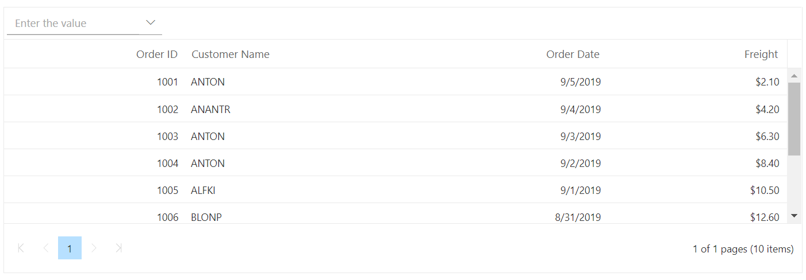

# Create Custom Toolbar with Drop-down List in Blazor DataGrid Component

You can create your own ToolBar items in the DataGrid. It can be added by defining the [Toolbar](https://help.syncfusion.com/cr/blazor/Syncfusion.Blazor.Grids.SfGrid-1.html#Syncfusion_Blazor_Grids_SfGrid_1_Toolbar). Actions for this ToolBar template items are defined in the [ToolbarClick`]

**Step 1**:

Initialize the template for your custom component. Using the following code add the DropDownList component to the ToolBar.

```cshtml
<SfToolbar>
        <ToolbarItems>
            <ToolbarItem Type="ItemType.Input">
                <Template>
                    <SfDropDownList TValue="string" TItem="Select" Placeholder="Enter the value"  DataSource=@LocalData Width="200">
                        <DropDownListFieldSettings Text="text" Value="text"> </DropDownListFieldSettings>
                        <DropDownListEvents TValue="string" TItem="Select" ValueChange="OnChange"> </DropDownListEvents>
                    </SfDropDownList>
                </Template>
            </ToolbarItem>
        </ToolbarItems>
    </SfToolbar>
```

**Step 2**:

To render the DropDownList component, use the [DropDownListEvents](https://help.syncfusion.com/cr/blazor/Syncfusion.Blazor.DropDowns.DropDownListEvents-2.html). You can select the datagrid row index based on the selected data in the DropDownList. The output will appear as follows.

```cshtml
@using Syncfusion.Blazor
@using Syncfusion.Blazor.Grids
@using Syncfusion.Blazor.Navigations
@using Syncfusion.Blazor.DropDowns


<SfGrid DataSource="@Orders" AllowPaging="true" Height="200" @ref="Grid">
    <GridEvents TValue="Order"></GridEvents>
    <SfToolbar>
        <ToolbarItems>
            <ToolbarItem Type="ItemType.Input">
                <Template>
                    <SfDropDownList TValue="string" TItem="Select" Placeholder="Enter the value" DataSource=@LocalData Width="200">
                        <DropDownListFieldSettings Text="text" Value="text"> </DropDownListFieldSettings>
                        <DropDownListEvents TValue="string" TItem="Select" ValueChange="OnChange"> </DropDownListEvents>
                    </SfDropDownList>
                </Template>
            </ToolbarItem>
        </ToolbarItems>
    </SfToolbar>

    <GridColumns>
        <GridColumn Field=@nameof(Order.OrderID) HeaderText="Order ID" TextAlign="TextAlign.Right" Width="120"></GridColumn>
        <GridColumn Field=@nameof(Order.CustomerID) HeaderText="Customer Name" Width="150"></GridColumn>
        <GridColumn Field=@nameof(Order.OrderDate) HeaderText=" Order Date" Format="d" Type="ColumnType.Date" TextAlign="TextAlign.Right" Width="130"></GridColumn>
        <GridColumn Field=@nameof(Order.Freight) HeaderText="Freight" Format="C2" TextAlign="TextAlign.Right" Width="120"></GridColumn>
    </GridColumns>
</SfGrid>

@code{

    SfGrid<Order> Grid;
    public List<Order> Orders { get; set; }
    public class Select
    {
        public string text { get; set; }
    }
     List<Select> LocalData = new List<Select>
    {
            new Select() { text = "0"},
            new Select() { text = "1"},
            new Select() { text = "2"},
            new Select() { text = "3"},
            new Select() { text = "4"},
            new Select() { text = "5"},
            new Select() { text = "6"},
            new Select() { text = "7"},
            new Select() { text = "8"},
            new Select() { text = "9"},
    };
    protected override void OnInitialized()
    {
        Orders = Enumerable.Range(1, 10).Select(x => new Order()
        {
            OrderID = 1000 + x,
            CustomerID = (new string[] { "ALFKI", "ANANTR", "ANTON", "BLONP", "BOLID" })[new Random().Next(5)],
            Freight = 2.1 * x,
            OrderDate = DateTime.Now.AddDays(-x),
        }).ToList();
    }
    public  async Task OnChange(Syncfusion.Blazor.DropDowns.ChangeEventArgs<string,Select> args)
    {
        await this.Grid.SelectRow(int.Parse(args.Value));
    }

    public class Order
    {
        public int? OrderID { get; set; }
        public string CustomerID { get; set; }
        public DateTime? OrderDate { get; set; }
        public double? Freight { get; set; }
    }
}
```


