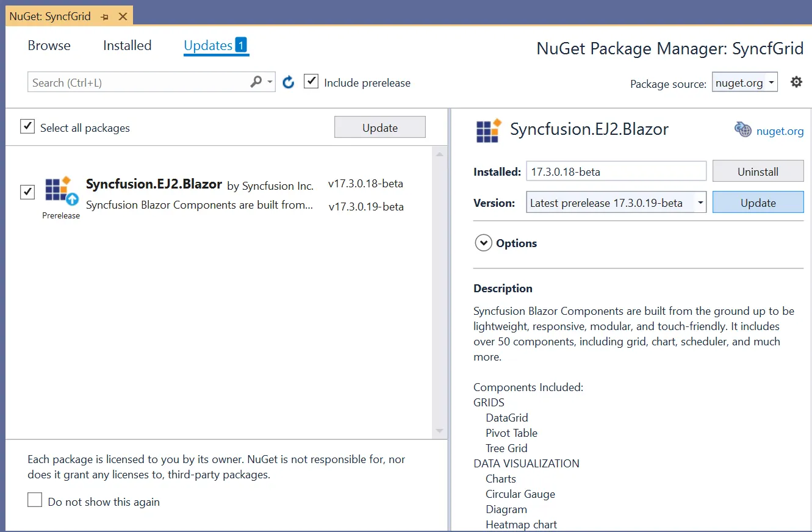

# Upgrade NuGet Package to Latest Version in Blazor Data Grid

**Step 1:** Update to the latest Blazor [NuGet](https://www.nuget.org/packages/Syncfusion.Blazor.Grid) package using the NuGet Package Manager in the application.



## Compatible .NET version

The latest Blazor components are compatible with the latest .NET (for example, .NET 9). It is recommended to upgrade the .NET SDK on the machine before updating to the latest version.

## Client resource file references

Ensure the required Syncfusion stylesheet and script resources are referenced in the application.

* For a Blazor Web App or Blazor Server app, add the stylesheet and script references in **~/Components/App.razor**.

* For a Blazor WebAssembly app, add the following style file reference in **~/wwwroot/index.html**.

```html
<head>
    ...
    <link href="_content/Syncfusion.Blazor.Themes/bootstrap5.css" rel="stylesheet" />
    <script src="_content/Syncfusion.Blazor.Grid/scripts/sf-grid.min.js" type="text/javascript"></script>
</head>
```

N> For production scenarios and minimal footprint, Syncfusion provides the Custom Resource Generator (CRG) web tool to generate scripts and styles for selected controls. Refer to this [link](https://crg.syncfusion.com/) for more details on CRG.

## Breaking changes

Some changes may occur across releases that affect existing applications. Review the breaking changes and notes for the target version before upgrading. Select the release-notes page that matches the target package version. Refer to the Blazor components [release notes](https://blazor.syncfusion.com/documentation/release-notes) for details.

## Cache problem

Before restoring NuGet packages, clear any cached versions of the Syncfusion.Blazor package to avoid conflicts.

The following steps explain how to clean the cache:
The following steps explain how to clean package cache and restore packages when individual Syncfusion packages are used (for example, `Syncfusion.Blazor.Grids`).

1. Identify Syncfusion package IDs used by the project by checking the project file (`*.csproj`) or the NuGet Package Manager. Common package IDs include `syncfusion.blazor.grid`, `syncfusion.blazor.core`, and `syncfusion.blazor.themes`.

2. Delete or clear the matching package folders from the global NuGet cache: `{System drive}/Users/{user-name}/.nuget/packages/<package-id>`. On Windows, the installed location can also be accessed using `%userprofile%/.nuget/packages/<package-id>`.

    Example folder names:

    - `%userprofile%/.nuget/packages/syncfusion.blazor.grid`
    - `%userprofile%/.nuget/packages/syncfusion.blazor.core`
    - `%userprofile%/.nuget/packages/syncfusion.blazor.themes`

3. Update the specific Syncfusion packages used by the project to the target version (for example, `Syncfusion.Blazor.Grids`, `Syncfusion.Blazor.Core`, `Syncfusion.Blazor.Themes`). Use the NuGet Package Manager or update the package version entries in the project file.

4. Restore NuGet packages so missing packages are downloaded again and then build the project. Restoring is required because deleting cache folders removes the local copies; restore fetches the packages from configured sources.

```bash
dotnet restore
dotnet build
```
