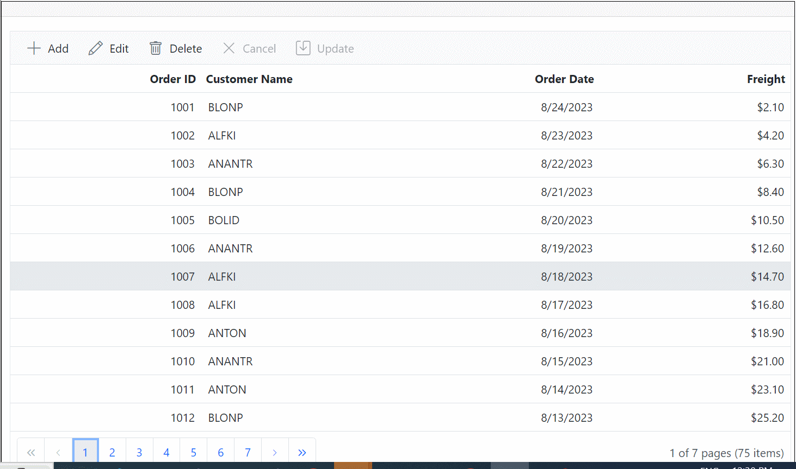

# Inline Editing in Blazor DataGrid Component

In Normal edit mode, when you start editing the currently selected record is changed to edit state. You can change the cell values and save edited data to the data source. To enable the Normal edit, set the [EditSettings.Mode](https://help.syncfusion.com/cr/blazor/Syncfusion.Blazor.Grids.GridEditSettings.html#Syncfusion_Blazor_Grids_GridEditSettings_Mode) as **Normal**.

```cshtml
@using Syncfusion.Blazor.Grids

<SfGrid DataSource="@Orders" AllowPaging="true" Toolbar="@(new List<string>() { "Add", "Edit", "Delete", "Cancel", "Update" })" Height="315">
    <GridEditSettings AllowAdding="true" AllowEditing="true" AllowDeleting="true" Mode="EditMode.Normal"></GridEditSettings>
    <GridColumns>
        <GridColumn Field=@nameof(Order.OrderID) HeaderText="Order ID" IsPrimaryKey="true" ValidationRules="@(new ValidationRules{ Required=true})" TextAlign="TextAlign.Right" Width="120"></GridColumn>
        <GridColumn Field=@nameof(Order.CustomerID) HeaderText="Customer Name" ValidationRules="@(new ValidationRules{ Required=true})" Width="120"></GridColumn>
        <GridColumn Field=@nameof(Order.OrderDate) HeaderText=" Order Date" EditType="EditType.DatePickerEdit" Format="d" TextAlign="TextAlign.Right" Width="130" Type="ColumnType.Date"></GridColumn>
        <GridColumn Field=@nameof(Order.Freight) HeaderText="Freight" Format="C2" TextAlign="TextAlign.Right" EditType="EditType.NumericEdit" Width="120"></GridColumn>
        <GridColumn Field=@nameof(Order.ShipCountry) HeaderText="Ship Country" EditType="EditType.DropDownEdit" Width="150"></GridColumn>
    </GridColumns>
</SfGrid>

@code{
    public List<Order> Orders { get; set; }

    protected override void OnInitialized()
    {
        Orders = Enumerable.Range(1, 75).Select(x => new Order()
        {
            OrderID = 1000 + x,
            CustomerID = (new string[] { "ALFKI", "ANANTR", "ANTON", "BLONP", "BOLID" })[new Random().Next(5)],
            Freight = 2.1 * x,
            OrderDate = DateTime.Now.AddDays(-x),
            ShipCountry = (new string[] { "USA", "UK", "CHINA", "RUSSIA", "INDIA" })[new Random().Next(5)]
        }).ToList();
    }

    public class Order
    {
        public int? OrderID { get; set; }
        public string CustomerID { get; set; }
        public DateTime? OrderDate { get; set; }
        public double? Freight { get; set; }
        public string ShipCountry { get; set; }
    }
}
```

The following screenshot represents Editing in Normal Mode.


N> Normal edit mode is the default mode of editing.

## Provide new item or edited item using events

Grid uses `Activator.CreateInstance<TValue>()` to create or clone new record instance during add and edit operations, so it must have parameterless constructors defined for the model class and any referenced complex type classes.

There are cases where custom logic is required for creating new object or new object instance cannot be created using  `Activator.CreateInstance<TValue>()`. In such cases you can provide model object instance manually using events.

You can use OnActionBegin event to provide new object instance during editing operation. The new object should be assigned to the `OnActionBegin<TValue>.Data` property.

In the following example:

* A model class with no parameter-less constructor is bound with the grid.
* Enabled inline editing feature in grid.
* `OnActionBegin` event callback is assigned in which `Data` property is assigned with custom object for both add and edit operation.

```csharp

<SfGrid DataSource="@Orders" Toolbar="@(new List<string>() { "Add", "Edit", "Delete", "Update", "Cancel" })">
    <GridEditSettings AllowEditing="true" AllowAdding="true" Mode="EditMode.Normal"></GridEditSettings>
    <GridColumns>
        <GridColumn Field=@nameof(Order.OrderID) HeaderText="Order ID" IsPrimaryKey="true" TextAlign="TextAlign.Right" Width="120"></GridColumn>
        <GridColumn Field=@nameof(Order.CustomerID) HeaderText="Customer Name" Width="150"></GridColumn>
        <GridColumn Field=@nameof(Order.OrderDate) HeaderText=" Order Date" Format="d" Type="ColumnType.Date" TextAlign="TextAlign.Right" Width="130"></GridColumn>
        <GridColumn Field=@nameof(Order.Freight) HeaderText="Freight" Format="C2" TextAlign="TextAlign.Right" Width="120"></GridColumn>
    </GridColumns>
    <GridEvents TValue="Order" OnActionBegin="ActionBegin"></GridEvents>
</SfGrid>

@code {

    List<Order> Orders { get; set; }

    protected override void OnInitialized()
    {
        Orders = Enumerable.Range(1, 10).Select(x => new Order(1000 + x)
        {
            OrderID = 1000 + x,
            CustomerID = (new string[] { "ALFKI",
                "ANANTR", "ANTON", "BLONP", "BOLID" })[new Random().Next(5)],
            Freight = (new double[] { 2, 1, 4, 5, 3 })[new Random().Next(5)] * x,
            OrderDate = (new DateTime[] { new DateTime(2019, 01, 01), new DateTime(2019, 01, 02) })[new Random().Next(2)]
        }).ToList();
    }

    public void ActionBegin(ActionEventArgs<Order> arg)
    {
        //Handles add operation
        if (arg.RequestType.Equals(Syncfusion.Blazor.Grids.Action.Add))
        {
            arg.Data = new Order(0) { CustomerID = "Customer ID" };
        }

        //Handles edit operation. During edit operation, original object will be cloned.
        if (arg.RequestType.Equals(Syncfusion.Blazor.Grids.Action.BeginEdit))
        {
            arg.Data = new Order(arg.RowData.OrderID)
            {
                CustomerID = arg.RowData.CustomerID,
                Freight = arg.RowData.Freight,
                OrderDate = arg.RowData.OrderDate
            };
        }
    }

    // This class does not contain any parameter-less constructor, hence this cannot be instantiated using Activator.CreateInstance.
    public class Order
    {
        public Order(int? orderid) => OrderID = orderid;

        public int? OrderID { get; set; }
        public string CustomerID { get; set; }
        public DateTime? OrderDate { get; set; }
        public double? Freight { get; set; }
    }
}

```

## Confirmation dialog

The delete confirms dialog can be shown on deleting a record by setting the [ShowDeleteConfirmDialog](https://help.syncfusion.com/cr/blazor/Syncfusion.Blazor.Grids.GridEditSettings.html#Syncfusion_Blazor_Grids_GridEditSettings_ShowDeleteConfirmDialog) property of the [GridEditSettings](https://help.syncfusion.com/cr/aspnetcore-blazor/Syncfusion.Blazor.Grids.GridEditSettings.html) component as **true**.

The following sample code demonstrates enabling delete confirmation dialog in the DataGrid component,

```cshtml
@using Syncfusion.Blazor.Grids

<SfGrid DataSource="@Orders" Height="315" AllowPaging="true" Toolbar="@(new List<string>() { "Add", "Edit", "Delete", "Update", "Cancel" })">
    <GridEditSettings AllowAdding="true" AllowEditing="true" AllowDeleting="true" ShowDeleteConfirmDialog="true"></GridEditSettings>
    <GridColumns>
        <GridColumn Field=@nameof(Order.OrderID) HeaderText="Order ID" IsPrimaryKey="true" TextAlign="TextAlign.Right" Width="120"></GridColumn>
        <GridColumn Field=@nameof(Order.CustomerID) HeaderText="Customer Name" Width="120"></GridColumn>
        <GridColumn Field=@nameof(Order.OrderDate) HeaderText=" Order Date" EditType="EditType.DatePickerEdit" Format="d" TextAlign="TextAlign.Right" Width="130" Type="ColumnType.Date"></GridColumn>
        <GridColumn Field=@nameof(Order.Freight) HeaderText="Freight" Format="C2" TextAlign="TextAlign.Right" Width="120"></GridColumn>
    </GridColumns>
</SfGrid>

@code{
    public List<Order> Orders { get; set; }

    protected override void OnInitialized()
    {
        Orders = Enumerable.Range(1, 75).Select(x => new Order()
        {
            OrderID = 1000 + x,
            CustomerID = (new string[] { "ALFKI", "ANANTR", "ANTON", "BLONP", "BOLID" })[new Random().Next(5)],
            Freight = 2.1 * x,
            OrderDate = DateTime.Now.AddDays(-x),
        }).ToList();
    }

    public class Order
    {
        public int? OrderID { get; set; }
        public string CustomerID { get; set; }
        public DateTime? OrderDate { get; set; }
        public double? Freight { get; set; }
    }
}
```

The following GIF represents the delete confirmation dialog displayed while deleting a record in DataGrid,


N> The [ShowDeleteConfirmDialog](https://help.syncfusion.com/cr/blazor/Syncfusion.Blazor.Grids.GridEditSettings.html#Syncfusion_Blazor_Grids_GridEditSettings_ShowDeleteConfirmDialog) supports all type of edit modes.

## Hiding Columns During Normal Editing in Blazor Grid

To hide specific columns during the editing process in a Blazor Grid component.

In the provided sample, this demonstrates how to hide specific columns while editing a record in a Blazor Grid. During editing, the OnToolbarClick event and OnActionBegin event are triggered. Within these events, the default action is prevented, the index of the selected record is stored, and the hiding of columns for editing is initiated using the HideAndEdit function. Inside the HideAndEdit function, the code utilizes the Grid's HideColumnsAsync method to hide those columns. Subsequently, the Grid is refreshed to display the changes. Afterward, the OnActionComplete event is triggered. If the request type is "Refresh" and the StartEdit flag is set to "true," the code chooses the same row once again by employing the SelectRowAsync method, which was stored during the initial edit. This is followed by initiating editing using the StartEditAsync method. In case the request type is "Save" or "Cancel," the columns are displayed again after editing, facilitated by the ShowColumnsAsync method.

```csharp
@using Syncfusion.Blazor.Grids

<SfGrid @ref="Grid" DataSource="@Orders" AllowPaging="true" Toolbar="@(new List<string>() { "Add", "Edit", "Delete", "Cancel", "Update" })">
    <GridEditSettings AllowAdding="true" AllowEditing="true" AllowDeleting="true"  Mode="EditMode.Normal"></GridEditSettings>
    <GridEvents OnToolbarClick="ToolbarClickHandler" OnActionBegin="ActionBeginHandler" OnActionComplete="ActionCompletedHandler" TValue="Order"></GridEvents>
    <GridColumns>
        <GridColumn Field=@nameof(Order.OrderID) HeaderText="Order ID" IsPrimaryKey="true" TextAlign="TextAlign.Right" Width="120"></GridColumn>
        <GridColumn Field=@nameof(Order.CustomerID) HeaderText="Customer Name" Width="120"></GridColumn>
        <GridColumn Field=@nameof(Order.OrderDate) HeaderText="Order Date" EditType="EditType.DatePickerEdit" Format="d" TextAlign="TextAlign.Right" Width="130" Type="ColumnType.Date"></GridColumn>
        <GridColumn Field=@nameof(Order.Freight) HeaderText="Freight" Format="C2" TextAlign="TextAlign.Right" Width="120"></GridColumn>
    </GridColumns>
</SfGrid>

@code {
    public SfGrid<Order> Grid { get; set; }
    public List<Order> Orders { get; set; }

    public string[] cols = new string[] { "Order ID", "Order Date" };
    public bool StartEdit = false;
    public int SelectedRowIndex { get; set; }

    public async Task ToolbarClickHandler(Syncfusion.Blazor.Navigations.ClickEventArgs Args)
    {
        if(Args.Item.Text == "Edit")
        {
            // Cancel the default action
            Args.Cancel = true;
            var val = await Grid.GetSelectedRowIndexesAsync();
            //Store the selected record index
            SelectedRowIndex = val[0];       
            //Hide the columns and refresh the Grid
            await HideAndEdit();
        }
    }
    public async Task HideAndEdit()
    {
        //Boolean to indicate that hiding is initiate for editing operation.
        StartEdit = true;
        //Hide the columns
        await Grid.HideColumnsAsync(cols, "HeaderText");
        //Refreshing the Grid after hiding the column
        await Grid.Refresh();
       
    }
    public async Task ActionBeginHandler(ActionEventArgs<Order> Args)
    {
        if (Args.RequestType == Syncfusion.Blazor.Grids.Action.BeginEdit)
        {
            if (!StartEdit)
            {
                //Preventing the default edit operation. 
                Args.Cancel = true;
                //Storing the selecting record index
                SelectedRowIndex = Args.RowIndex;
                //Hiding the column
                await HideAndEdit();
            }
        }
    }
    public async Task ActionCompletedHandler(ActionEventArgs<Order> Args)
    {      
        if(Args.RequestType == Syncfusion.Blazor.Grids.Action.Refresh && StartEdit)
        {
            //While refreshing this RequestType will trigger and based on boolean StartEdit, we select the record
            await Grid.SelectRowAsync(SelectedRowIndex);
            //Editing the selected record
            await Grid.StartEditAsync();
        }
        if(Args.RequestType == Syncfusion.Blazor.Grids.Action.Save || Args.RequestType == Syncfusion.Blazor.Grids.Action.Cancel)
        {
            //Updating the boolean variable
            StartEdit = false;
            //Displaying the columns again after editing
            await Grid.ShowColumnsAsync(cols, "HeaderText");
        }
    }

    protected override void OnInitialized()
    {
        Orders = Enumerable.Range(1, 75).Select(x => new Order()
            {
                OrderID = 1000 + x,
                CustomerID = (new string[] { "ALFKI", "ANANTR", "ANTON", "BLONP", "BOLID" })[new Random().Next(5)],
                Freight = 2.1 * x,
                OrderDate = DateTime.Now.AddDays(-x),
            }).ToList();
    }

    public class Order
    {
        public int? OrderID { get; set; }
        public string CustomerID { get; set; }
        public DateTime? OrderDate { get; set; }
        public double? Freight { get; set; }
    }
}
```

The following screenshot shows Hiding Columns During Normal Editing,


