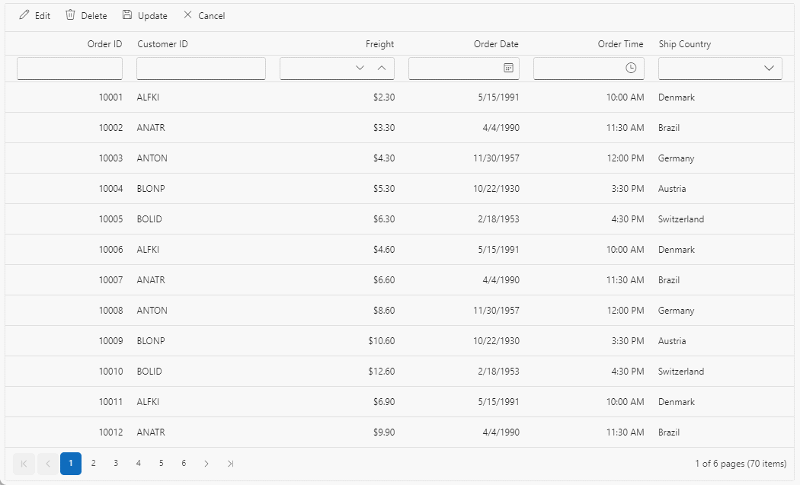

# Inline editing in Blazor DataGrid component

The Blazor DataGrid component provides a powerful in-line editing feature that allows you to edit cell values of row directly within the grid. This feature is especially useful when you want to quickly modify data without the need for a separate edit form. In normal edit mode, the selected record is changed to an edit state, and you can modify the cell values and save the edited data to the data source.

To enable in-line editing in the grid component, you need to set the [EditSettings.Mode](https://help.syncfusion.com/cr/blazor/Syncfusion.Blazor.Grids.GridEditSettings.html#Syncfusion_Blazor_Grids_GridEditSettings_Mode) property of the Grid's configuration to **Normal**. This property determines the editing mode of the Grid.



@using Syncfusion.Blazor.Grids

<SfGrid DataSource="@OrderData" Toolbar="@(new List<string>() { "Add", "Edit", "Delete", "Update", "Cancel" })" Height="315">
    <GridEditSettings AllowAdding="true" AllowEditing="true" AllowDeleting="true" Mode="EditMode.Normal"></GridEditSettings>
    <GridColumns>
        <GridColumn Field=@nameof(OrderDetails.OrderID) HeaderText="Order ID" IsPrimaryKey="true" ValidationRules="@(new ValidationRules{ Required=true})" TextAlign="TextAlign.Right" Width="120"></GridColumn>
        <GridColumn Field=@nameof(OrderDetails.CustomerID) HeaderText="Customer Name" ValidationRules="@(new ValidationRules{ Required=true, MinLength=5})" Width="120"></GridColumn>
        <GridColumn Field=@nameof(OrderDetails.Freight) HeaderText="Freight" ValidationRules="@(new ValidationRules{ Required=true, Min=1, Max=1000})" Format="C2" TextAlign="TextAlign.Right" EditType="EditType.NumericEdit" Width="120"></GridColumn>
        <GridColumn Field=@nameof(OrderDetails.ShipCountry) HeaderText="Ship Country" EditType="EditType.DropDownEdit" Width="150"></GridColumn>
    </GridColumns>
</SfGrid>

@code {
    public List<OrderDetails> OrderData { get; set; }
    protected override void OnInitialized()
    {
        OrderData = OrderDetails.GetAllRecords();
    }
}


public class OrderDetails
{
    public static List<OrderDetails> Order = new List<OrderDetails>();
    public OrderDetails(int OrderID, string CustomerId, double Freight, string ShipCountry)
    {
        this.OrderID = OrderID;
        this.CustomerID = CustomerId;
        this.Freight = Freight;
        this.ShipCountry = ShipCountry;    
    }
    public static List<OrderDetails> GetAllRecords()
    {
        if (Order.Count == 0)
        {
            Order.Add(new OrderDetails(10248, "VINET", 32.38, "France"));
            Order.Add(new OrderDetails(10249, "TOMSP", 11.61, "Germany"));
            Order.Add(new OrderDetails(10250, "HANAR", 65.83, "Brazil"));
            Order.Add(new OrderDetails(10251, "VICTE", 41.34, "France"));
            Order.Add(new OrderDetails(10252, "SUPRD", 51.3, "Belgium"));
            Order.Add(new OrderDetails(10253, "HANAR", 58.17, "Brazil"));
            Order.Add(new OrderDetails(10254, "CHOPS", 22.98, "Switzerland"));
            Order.Add(new OrderDetails(10255, "RICSU", 148.33, "Switzerland"));
            Order.Add(new OrderDetails(10256, "WELLI", 13.97, "Brazil"));
            Order.Add(new OrderDetails(10257, "HILAA", 81.91, "Venezuela"));
            Order.Add(new OrderDetails(10258, "ERNSH", 140.51, "Austria"));
            Order.Add(new OrderDetails(10259, "CENTC", 3.25, "Mexico"));
            Order.Add(new OrderDetails(10260, "OTTIK", 55.09, "Germany"));
            Order.Add(new OrderDetails(10261, "QUEDE", 3.05, "Brazil"));
            Order.Add(new OrderDetails(10262, "RATTC", 48.29, "USA"));
        }
        return Order;
    }
    public int OrderID { get; set; }
    public string CustomerID { get; set; }
    public double Freight { get; set; }
    public string ShipCountry { get; set; }
}





> Normal edit mode is default mode of editing.
> When enabling editing, it is necessary to set the [IsPrimaryKey](https://help.syncfusion.com/cr/blazor/Syncfusion.Blazor.Grids.GridColumn.html#Syncfusion_Blazor_Grids_GridColumn_IsPrimaryKey) property value to **true** for the unique column.

## Automatically update a specific column based on another column edited value

You can automatically update the value of a column based on the edited value of another column using Cell Edit Template feature. This feature is useful when you want to dynamically calculate and update a column's value in real-time based on changes made to another related column. 

You can update the column value based on another column’s edited value in normal mode by using the [RowUpdating](https://help.syncfusion.com/cr/blazor/Syncfusion.Blazor.Grids.GridEvents-1.html#Syncfusion_Blazor_Grids_GridEvents_1_RowUpdating) and the [RowEdited](https://help.syncfusion.com/cr/blazor/Syncfusion.Blazor.Grids.GridEvents-1.html#Syncfusion_Blazor_Grids_GridEvents_1_RowEdited) events, along with the [EditTemplate](https://help.syncfusion.com/cr/blazor/Syncfusion.Blazor.Grids.GridColumn.html#Syncfusion_Blazor_Grids_GridColumn_EditTemplate) property of the Grid.

In the following example, the **TotalCost** column value is updated based on changes to the **UnitPrice** and **UnitInStock** columns during normal editing.



@using Syncfusion.Blazor.Grids
@using Syncfusion.Blazor.Inputs

<SfGrid @ref="Grid" DataSource="@ProductData" Toolbar="@(new List<string>() { "Add", "Edit", "Delete", "Update", "Cancel" })" Height="273">
    <GridEvents TValue="ProductDetails" RowEdited="EditHandler" RowUpdating="UpdateHandler"></GridEvents>
    <GridEditSettings AllowAdding="true" AllowEditing="true" AllowDeleting="true" Mode="EditMode.Normal"></GridEditSettings>
    <GridColumns>
        <GridColumn Field="@nameof(ProductDetails.ProductID)" HeaderText="Product ID" TextAlign="TextAlign.Right" IsPrimaryKey="true" ValidationRules="@(new ValidationRules { Required = true })" Width="100"></GridColumn>
        <GridColumn Field="@nameof(ProductDetails.ProductName)" HeaderText="Product Name" ValidationRules="@(new ValidationRules { Required = true })" Width="120">
        </GridColumn>
        <GridColumn Field="@nameof(ProductDetails.UnitPrice)" HeaderText="Unit Price" Width="150" TextAlign="TextAlign.Right" ValidationRules="@(new ValidationRules { Required = true, Min = 1 })" Format="C2">
            <EditTemplate>
                @{
                    var Data = context as ProductDetails;
                    <SfNumericTextBox @ref="UnitPriceReference" TValue="double" @bind-Value="@Data.UnitPrice" Min="1">
                        <NumericTextBoxEvents TValue="double" ValueChange="@ValueChangeHandler"></NumericTextBoxEvents>
                    </SfNumericTextBox>
                }
            </EditTemplate>
        </GridColumn>
        <GridColumn Field="@nameof(ProductDetails.UnitsInStock)" HeaderText="Units In Stock" Width="150" TextAlign="TextAlign.Right" ValidationRules="@(new ValidationRules { Required = true, Min = 1 })">
            <EditTemplate>
                @{
                    var Data = context as ProductDetails;
                    <SfNumericTextBox @ref="UnitsInStockReference" TValue="double" @bind-Value="@Data.UnitsInStock" Min="1">
                        <NumericTextBoxEvents TValue="double" ValueChange="ValueChangeHandler"></NumericTextBoxEvents>
                    </SfNumericTextBox>
                }
            </EditTemplate>
        </GridColumn>
        <GridColumn Field="@nameof(ProductDetails.TotalCost)" HeaderText="Total Cost" Width="150" AllowEditing="false" Format="C2" TextAlign="TextAlign.Right">
            <EditTemplate>
                @{
                    <SfNumericTextBox TValue="double" Value="@TotalValue" Enabled="false">
                    </SfNumericTextBox>
                }
            </EditTemplate>
        </GridColumn>
    </GridColumns>
</SfGrid>

@code {
    private SfGrid<ProductDetails> Grid;
    SfNumericTextBox<double> UnitPriceReference;
    SfNumericTextBox<double> UnitsInStockReference;
    public double TotalValue { get; set; }
    public List<ProductDetails> ProductData { get; set; }
    protected override void OnInitialized()
    {
        ProductData = ProductDetails.GetAllRecords();
    }
    public async Task UpdateHandler(RowUpdatingEventArgs<ProductDetails> args)
    {        
        args.Data.TotalCost = TotalValue;
    }
    public async Task EditHandler(RowEditedEventArgs<ProductDetails> args)
    {     
        TotalValue = args.Data.TotalCost;
    }
    private void ValueChangeHandler()
    {
        TotalValue = Convert.ToDouble(UnitPriceReference.Value * UnitsInStockReference.Value);
        Grid.PreventRender(false);
    }
}


public class ProductDetails
{
    public static List<ProductDetails> Products = new List<ProductDetails>();
    public ProductDetails(int productID, string productName, double unitPrice, double unitsInStock, double totalCost)
    {
        this.ProductID = productID;
        this.ProductName = productName;
        this.UnitPrice = unitPrice;
        this.UnitsInStock = unitsInStock;
        this.TotalCost = totalCost;
    }
    public static List<ProductDetails> GetAllRecords()
    {
        if (Products.Count == 0)
        {
            Products.Add(new ProductDetails(1, "Chai", 18.0, 39, 702));
            Products.Add(new ProductDetails(2, "Chang", 19.0, 17, 323));
            Products.Add(new ProductDetails(3, "Aniseed Syrup", 10.0, 13, 130));
            Products.Add(new ProductDetails(4, "Chef Anton's Cajun Seasoning", 22.0, 53, 1166));
            Products.Add(new ProductDetails(5, "Chef Anton's Gumbo Mix", 21.35, 0, 0));
            Products.Add(new ProductDetails(6, "Chef Anton's Gumbo", 23.35, 0, 0));
            Products.Add(new ProductDetails(7, "Chef Anton's Mix", 25.35, 0, 0));
            Products.Add(new ProductDetails(8, "Chef Gumbo Mix", 27.39, 0, 0));
        }
        return Products;
    }
    public int ProductID { get; set; }
    public string ProductName { get; set; }
    public double UnitPrice { get; set; }
    public double UnitsInStock { get; set; }
    public double TotalCost { get; set; }
}





## Cancel edit based on condition

The grid provides the ability to cancel the edit operations for particular row or cell based on specific conditions. This feature allows you to control over whether editing should be allowed or prevented for certain rows or cells in the grid. 

To cancel the edit operation based on a specific condition, you can handle the following events of grid component. These events are triggered when a CRUD (Create, Read, Update, Delete) operation is performed in the grid.

1. [RowCreating](https://help.syncfusion.com/cr/blazor/Syncfusion.Blazor.Grids.GridEvents-1.html#Syncfusion_Blazor_Grids_GridEvents_1_RowCreating): Triggered before an add action is executed in the grid.

2. [RowDeleting](https://help.syncfusion.com/cr/blazor/Syncfusion.Blazor.Grids.GridEvents-1.html#Syncfusion_Blazor_Grids_GridEvents_1_RowDeleting): Triggered before a delete action is executed in the grid.

3. [RowEditing](https://help.syncfusion.com/cr/blazor/Syncfusion.Blazor.Grids.GridEvents-1.html#Syncfusion_Blazor_Grids_GridEvents_1_RowEditing): Triggered before an edit action is executed in the grid.

By applying your desired condition, you can cancel the edit, delete, or add operation by setting the args.Cancel property to **true**.

In the below demo, prevent the CRUD operation based on the **Role** column value. If the Role Column is **Admin**, then edit/delete action is prevented for that row.



@using Syncfusion.Blazor.Grids
@using Syncfusion.Blazor.Buttons

<SfButton CssClass="e-outline" Content="@Content" OnClick="ToggleGridAddability" style="margin-bottom:5px"></SfButton>
<SfGrid DataSource="@EmployeeData" Toolbar="@(new List<string>() { "Add", "Edit", "Delete", "Update", "Cancel" })" Height="315">
    <GridEditSettings AllowAdding="true" AllowEditing="true" AllowDeleting="true" Mode="EditMode.Normal"></GridEditSettings>
    <GridEvents TValue="EmployeeDetails" RowEditing="RowEditingHandler" RowCreating="RowAddingHandler" RowDeleting="RowDeletingHandler"></GridEvents>
    <GridColumns>
        <GridColumn Field=@nameof(EmployeeDetails.EmployeeID) HeaderText="Employee ID" IsPrimaryKey="true" ValidationRules="@(new ValidationRules{ Required=true})" TextAlign="TextAlign.Right" Width="120"></GridColumn>
        <GridColumn Field=@nameof(EmployeeDetails.EmployeeName) HeaderText="Employee Name" ValidationRules="@(new ValidationRules{ Required=true})" Width="120"></GridColumn>
        <GridColumn Field=@nameof(EmployeeDetails.Role) HeaderText="Role" ValidationRules="@(new ValidationRules{ Required=true})" TextAlign="TextAlign.Right" Width="120"></GridColumn>
        <GridColumn Field=@nameof(EmployeeDetails.EmployeeCountry) HeaderText="Employee Country" EditType="EditType.DropDownEdit" Width="150"></GridColumn>
    </GridColumns>
</SfGrid>

@code {
    private string Content => IsAddable ? "Grid is Addable" : "Grid is Not Addable";
    private bool IsAddable = true;

    public List<EmployeeDetails> EmployeeData { get; set; }
    
    protected override void OnInitialized()
    {
        EmployeeData = EmployeeDetails.GetAllRecords();
    }
    public void RowAddingHandler(RowCreatingEventArgs<EmployeeDetails> args)
    {
        if (!IsAddable)
        {
            args.Cancel = true; 
        }
    }
    public void RowEditingHandler(RowEditingEventArgs<EmployeeDetails> args)
    {
        if (args.Data.Role == "Admin") 
        {
            args.Cancel = true;
        }
    }
    public void RowDeletingHandler(RowDeletingEventArgs<EmployeeDetails> args)
    {
        if (args.Datas[0].Role == "Admin")
        {
            args.Cancel = true;
        }
    }
    public void ToggleGridAddability()
    {
        IsAddable = !IsAddable;
    }
}


public class EmployeeDetails
{
    public static List<EmployeeDetails> Employees = new List<EmployeeDetails>();
    public EmployeeDetails(int employeeID, string employeeName, string role, string employeeCountry)
    {
        this.EmployeeID = employeeID;
        this.EmployeeName = employeeName;
        this.Role = role;
        this.EmployeeCountry = employeeCountry;
    }
    public static List<EmployeeDetails> GetAllRecords()
    {
        if (Employees.Count == 0)
        {
            Employees.Add(new EmployeeDetails(1, "Davolio", "Admin", "France"));
            Employees.Add(new EmployeeDetails(2, "Buchanan", "Employee", "Germany"));
            Employees.Add(new EmployeeDetails(3, "Fuller", "Admin", "Brazil"));
            Employees.Add(new EmployeeDetails(4, "Leverling", "Manager", "France"));
            Employees.Add(new EmployeeDetails(5, "Peacock", "Manager", "Belgium"));
            Employees.Add(new EmployeeDetails(6, "Janet", "Admin", "Brazil"));
            Employees.Add(new EmployeeDetails(7, "Suyama", "Employee", "Switzerland"));
            Employees.Add(new EmployeeDetails(8, "Robert", "Admin", "Switzerland"));
            Employees.Add(new EmployeeDetails(9, "Andrew", "Employee", "Brazil"));
            Employees.Add(new EmployeeDetails(14, "Michael", "Admin", "Venezuela"));
            Employees.Add(new EmployeeDetails(11, "Ana Trujillo", "Manager", "Austria"));
            Employees.Add(new EmployeeDetails(10, "Antonio Moreno", "Manager", "Mexico"));
            Employees.Add(new EmployeeDetails(12, "VICTE", "Admin", "Germany"));
            Employees.Add(new EmployeeDetails(13, "Christina Berglund", "Manager", "Brazil"));
            Employees.Add(new EmployeeDetails(15, "Hanna Moos", "Employee", "USA"));
        }
        return Employees;
    }
    public int EmployeeID { get; set; }
    public string EmployeeName { get; set; }
    public string Role { get; set; }
    public string EmployeeCountry { get; set; }
}





## Perform CRUD action programmatically

Performing CRUD actions programmatically refers to the ability to create, read, update, and delete data in a system or application using code instead of manual user interaction.

* To add a new record to the Grid, use the [AddRecordAsync](https://help.syncfusion.com/cr/blazor/Syncfusion.Blazor.Grids.SfGrid-1.html#Syncfusion_Blazor_Grids_SfGrid_1_AddRecordAsync__0_System_Nullable_System_Int32__) method. In this method, you can pass the **data** parameter to add a new record to the Grid, and the **index** parameter to add a record at a specific index. If you call this method without any parameters, it will create an empty row in the Grid. If an index is not specified, the newly added record will be displayed at the zeroth index.

* To change the selected row to the edit state, use the [StartEditAsync](https://help.syncfusion.com/cr/blazor/Syncfusion.Blazor.Grids.SfGrid-1.html#Syncfusion_Blazor_Grids_SfGrid_1_StartEditAsync) method. Before invoking this method, it is necessary to select a row in the grid.

* If you need to update the row data in the Grid’s data source, you can use the [UpdateRowAsync](https://help.syncfusion.com/cr/blazor/Syncfusion.Blazor.Grids.SfGrid-1.html#Syncfusion_Blazor_Grids_SfGrid_1_UpdateRowAsync_System_Int32__0_) method. In this method, you need to pass the **index** value of the row to be updated along with the updated **data**.

* If you need to update the particular cell in the row, you can use the [SetCellValueAsync](https://help.syncfusion.com/cr/blazor/Syncfusion.Blazor.Grids.SfGrid-1.html#Syncfusion_Blazor_Grids_SfGrid_1_SetCellValueAsync_System_Object_System_String_System_Object_) method. In this method, you need to pass the primary key value of the data source, field name, and new value for the particular cell. When using this method, any changes made to a cell will only be reflected visually in the UI of Grid alone, not persisted or saved in the underlying data source. This method is commonly employed for unbound columns, such as auto-calculated columns or formula columns, where the values are derived or computed based on other data within the Grid or external calculations. By using this method, you can update the visual representation of these unbound columns without modifying the actual data source.

* To remove a selected row from the Grid, use the [DeleteRecordAsync](https://help.syncfusion.com/cr/blazor/Syncfusion.Blazor.Grids.SfGrid-1.html#Syncfusion_Blazor_Grids_SfGrid_1_DeleteRecordAsync) method. For both edit and delete operations, you must select a row first.

> In both normal and dialog editing modes, these methods can be used.

## Show confirmation dialog while deleting

Displaying a confirmation dialog adds an extra layer of confirmation when deleting a record from the grid. This dialog prompts for confirmation before proceeding with the deletion, ensuring that accidental or undesired deletions are avoided. The deletion can proceed only if the decision is certain. The grid component provides a built-in confirmation dialog that can be used to confirm a deleting action.

To enable the confirmation dialog for the delete operation in the Grid, you can set the [ShowDeleteConfirmDialog](https://help.syncfusion.com/cr/blazor/Syncfusion.Blazor.Grids.GridEditSettings.html#Syncfusion_Blazor_Grids_GridEditSettings_ShowDeleteConfirmDialog) property of the `EditSettings` configuration to **true**. By default, this property is set to **false**.



@using Syncfusion.Blazor.Grids
@using Syncfusion.Blazor.Buttons

<div style="margin-bottom:5px">
<label> Enable or Disable show delete confirmation dialog:</label>
<SfSwitch ValueChange="Change" TChecked="bool" style="margin-top:5px"></SfSwitch>
</div>
<SfGrid DataSource="@OrderData" Toolbar="@(new List<string>() { "Add", "Delete", "Update", "Cancel" })" Height="315">
    <GridEditSettings AllowAdding="true" AllowEditing="true" AllowDeleting="true" Mode="EditMode.Normal" ShowDeleteConfirmDialog="@DeleteConfirmDialog"></GridEditSettings>
    <GridColumns>
        <GridColumn Field=@nameof(OrderDetails.OrderID) HeaderText="Order ID" IsPrimaryKey="true" ValidationRules="@(new ValidationRules{ Required=true})" TextAlign="TextAlign.Right" Width="120"></GridColumn>
        <GridColumn Field=@nameof(OrderDetails.CustomerID) HeaderText="Customer Name" ValidationRules="@(new ValidationRules{ Required=true, MinLength=5})" Width="120"></GridColumn>
        <GridColumn Field=@nameof(OrderDetails.Freight) HeaderText="Freight" ValidationRules="@(new ValidationRules{ Required=true, Min=1, Max=1000})" Format="C2" TextAlign="TextAlign.Right" EditType="EditType.NumericEdit" Width="120"></GridColumn>
        <GridColumn Field=@nameof(OrderDetails.ShipCountry) HeaderText="Ship Country" EditType="EditType.DropDownEdit" Width="150"></GridColumn>
    </GridColumns>
</SfGrid>

@code {
    public bool DeleteConfirmDialog { get; set; } = false;
    public List<OrderDetails> OrderData { get; set; }
    protected override void OnInitialized()
    {
        OrderData = OrderDetails.GetAllRecords();
    }
    private void Change(Syncfusion.Blazor.Buttons.ChangeEventArgs<bool> args)
    {
        DeleteConfirmDialog = args.Checked;
    }
}


public class OrderDetails
{
    public static List<OrderDetails> Order = new List<OrderDetails>();
    public OrderDetails(int OrderID, string CustomerId, double Freight, string ShipCountry)
    {
        this.OrderID = OrderID;
        this.CustomerID = CustomerId;
        this.Freight = Freight;
        this.ShipCountry = ShipCountry;    
    }
    public static List<OrderDetails> GetAllRecords()
    {
        if (Order.Count == 0)
        {
            Order.Add(new OrderDetails(10248, "VINET", 32.38, "France"));
            Order.Add(new OrderDetails(10249, "TOMSP", 11.61, "Germany"));
            Order.Add(new OrderDetails(10250, "HANAR", 65.83, "Brazil"));
            Order.Add(new OrderDetails(10251, "VICTE", 41.34, "France"));
            Order.Add(new OrderDetails(10252, "SUPRD", 51.3, "Belgium"));
            Order.Add(new OrderDetails(10253, "HANAR", 58.17, "Brazil"));
            Order.Add(new OrderDetails(10254, "CHOPS", 22.98, "Switzerland"));
            Order.Add(new OrderDetails(10255, "RICSU", 148.33, "Switzerland"));
            Order.Add(new OrderDetails(10256, "WELLI", 13.97, "Brazil"));
            Order.Add(new OrderDetails(10257, "HILAA", 81.91, "Venezuela"));
            Order.Add(new OrderDetails(10258, "ERNSH", 140.51, "Austria"));
            Order.Add(new OrderDetails(10259, "CENTC", 3.25, "Mexico"));
            Order.Add(new OrderDetails(10260, "OTTIK", 55.09, "Germany"));
            Order.Add(new OrderDetails(10261, "QUEDE", 3.05, "Brazil"));
            Order.Add(new OrderDetails(10262, "RATTC", 48.29, "USA"));
        }
        return Order;
    }
    public int OrderID { get; set; }
    public string CustomerID { get; set; }
    public double Freight { get; set; }
    public string ShipCountry { get; set; }
}





> The `ShowDeleteConfirmDialog` property supports all type of edit modes.

## Display default value for columns while adding

This feature is useful when you want to pre-fill certain column values with default values to streamline the data entry process. The grid component allows you to set default values for columns when adding a new record. 

To set a default value for a specific column in the Grid, you can use the [DefaultValue](https://ej2.syncfusion.com/angular/documentation/api/grid/column/#defaultvalue) property of the `Columns` configuration. By providing a default value, the grid will automatically populate that value in the corresponding column when a new row is added.

Here's an example of how to set a default value for a column:



@using Syncfusion.Blazor.Grids

<SfGrid DataSource="@OrderData" Toolbar="@(new List<string>() { "Add", "Edit","Delete", "Update", "Cancel" })" Height="315">
    <GridEditSettings AllowAdding="true" AllowEditing="true" AllowDeleting="true" Mode="EditMode.Normal" ></GridEditSettings>
    <GridColumns>
        <GridColumn Field=@nameof(OrderDetails.OrderID) HeaderText="Order ID" IsPrimaryKey="true" ValidationRules="@(new ValidationRules{ Required=true})" TextAlign="TextAlign.Right" Width="120"></GridColumn>
        <GridColumn Field=@nameof(OrderDetails.CustomerID) HeaderText="Customer Name" ValidationRules="@(new ValidationRules{ Required=true, MinLength=5})" DefaultValue="@CustomerValue" Width="120"></GridColumn>
        <GridColumn Field=@nameof(OrderDetails.Freight) HeaderText="Freight" ValidationRules="@(new ValidationRules{ Required=true, Min=1, Max=1000})" DefaultValue="@FreightValue" Format="C2" TextAlign="TextAlign.Right" EditType="EditType.NumericEdit" Width="120"></GridColumn>
        <GridColumn Field=@nameof(OrderDetails.ShipCountry) HeaderText="Ship Country" DefaultValue="@CountryValue" EditType="EditType.DropDownEdit" Width="150"></GridColumn>
    </GridColumns>
</SfGrid>

@code {
    public string CustomerValue { get; set; } = "HANAR";
    public int FreightValue { get; set; } = 1;
    public string CountryValue { get; set; } = "France";
    public List<OrderDetails> OrderData { get; set; }
    protected override void OnInitialized()
    {
        OrderData = OrderDetails.GetAllRecords();
    }
}


public class OrderDetails
{
    public static List<OrderDetails> Order = new List<OrderDetails>();
    public OrderDetails(int OrderID, string CustomerId, double Freight, string ShipCountry)
    {
        this.OrderID = OrderID;
        this.CustomerID = CustomerId;
        this.Freight = Freight;
        this.ShipCountry = ShipCountry;    
    }
    public static List<OrderDetails> GetAllRecords()
    {
        if (Order.Count == 0)
        {
            Order.Add(new OrderDetails(10248, "VINET", 32.38, "France"));
            Order.Add(new OrderDetails(10249, "TOMSP", 11.61, "Germany"));
            Order.Add(new OrderDetails(10250, "HANAR", 65.83, "Brazil"));
            Order.Add(new OrderDetails(10251, "VICTE", 41.34, "France"));
            Order.Add(new OrderDetails(10252, "SUPRD", 51.3, "Belgium"));
            Order.Add(new OrderDetails(10253, "HANAR", 58.17, "Brazil"));
            Order.Add(new OrderDetails(10254, "CHOPS", 22.98, "Switzerland"));
            Order.Add(new OrderDetails(10255, "RICSU", 148.33, "Switzerland"));
            Order.Add(new OrderDetails(10256, "WELLI", 13.97, "Brazil"));
            Order.Add(new OrderDetails(10257, "HILAA", 81.91, "Venezuela"));
            Order.Add(new OrderDetails(10258, "ERNSH", 140.51, "Austria"));
            Order.Add(new OrderDetails(10259, "CENTC", 3.25, "Mexico"));
            Order.Add(new OrderDetails(10260, "OTTIK", 55.09, "Germany"));
            Order.Add(new OrderDetails(10261, "QUEDE", 3.05, "Brazil"));
            Order.Add(new OrderDetails(10262, "RATTC", 48.29, "USA"));
        }
        return Order;
    }
    public int OrderID { get; set; }
    public string CustomerID { get; set; }
    public double Freight { get; set; }
    public string ShipCountry { get; set; }
}






## Provide new item or edited item using events

Grid uses `Activator.CreateInstance<TValue>()` to create or clone new record instance during add and edit operations, so it must have parameterless constructors defined for the model class and any referenced complex type classes.

There are cases where custom logic is required for creating new object or new object instance cannot be created using  `Activator.CreateInstance<TValue>()`. In such cases you can provide model object instance manually using events.

You can use OnActionBegin event to provide new object instance during editing operation. The new object should be assigned to the `OnActionBegin<TValue>.Data` property.

In the following example:

* A model class with no parameter-less constructor is bound with the grid.
* Enabled inline editing feature in grid.
* `OnActionBegin` event callback is assigned in which `Data` property is assigned with custom object for both add and edit operation.

```csharp

<SfGrid DataSource="@Orders" Toolbar="@(new List<string>() { "Add", "Edit", "Delete", "Update", "Cancel" })">
    <GridEditSettings AllowEditing="true" AllowAdding="true" Mode="EditMode.Normal"></GridEditSettings>
    <GridColumns>
        <GridColumn Field=@nameof(Order.OrderID) HeaderText="Order ID" IsPrimaryKey="true" TextAlign="TextAlign.Right" Width="120"></GridColumn>
        <GridColumn Field=@nameof(Order.CustomerID) HeaderText="Customer Name" Width="150"></GridColumn>
        <GridColumn Field=@nameof(Order.OrderDate) HeaderText=" Order Date" Format="d" Type="ColumnType.Date" TextAlign="TextAlign.Right" Width="130"></GridColumn>
        <GridColumn Field=@nameof(Order.Freight) HeaderText="Freight" Format="C2" TextAlign="TextAlign.Right" Width="120"></GridColumn>
    </GridColumns>
    <GridEvents TValue="Order" OnActionBegin="ActionBegin"></GridEvents>
</SfGrid>

@code {

    List<Order> Orders { get; set; }

    protected override void OnInitialized()
    {
        Orders = Enumerable.Range(1, 10).Select(x => new Order(1000 + x)
        {
            OrderID = 1000 + x,
            CustomerID = (new string[] { "ALFKI",
                "ANANTR", "ANTON", "BLONP", "BOLID" })[new Random().Next(5)],
            Freight = (new double[] { 2, 1, 4, 5, 3 })[new Random().Next(5)] * x,
            OrderDate = (new DateTime[] { new DateTime(2019, 01, 01), new DateTime(2019, 01, 02) })[new Random().Next(2)]
        }).ToList();
    }

    public void ActionBegin(ActionEventArgs<Order> arg)
    {
        //Handles add operation
        if (arg.RequestType.Equals(Syncfusion.Blazor.Grids.Action.Add))
        {
            arg.Data = new Order(0) { CustomerID = "Customer ID" };
        }

        //Handles edit operation. During edit operation, original object will be cloned.
        if (arg.RequestType.Equals(Syncfusion.Blazor.Grids.Action.BeginEdit))
        {
            arg.Data = new Order(arg.RowData.OrderID)
            {
                CustomerID = arg.RowData.CustomerID,
                Freight = arg.RowData.Freight,
                OrderDate = arg.RowData.OrderDate
            };
        }
    }

    // This class does not contain any parameter-less constructor, hence this cannot be instantiated using Activator.CreateInstance.
    public class Order
    {
        public Order(int? orderid) => OrderID = orderid;

        public int? OrderID { get; set; }
        public string CustomerID { get; set; }
        public DateTime? OrderDate { get; set; }
        public double? Freight { get; set; }
    }
}

```

## Confirmation dialog

The delete confirms dialog can be shown on deleting a record by setting the [ShowDeleteConfirmDialog](https://help.syncfusion.com/cr/blazor/Syncfusion.Blazor.Grids.GridEditSettings.html#Syncfusion_Blazor_Grids_GridEditSettings_ShowDeleteConfirmDialog) property of the [GridEditSettings](https://help.syncfusion.com/cr/aspnetcore-blazor/Syncfusion.Blazor.Grids.GridEditSettings.html) component as **true**.

The following sample code demonstrates enabling delete confirmation dialog in the DataGrid component,

```cshtml
@using Syncfusion.Blazor.Grids

<SfGrid DataSource="@Orders" Height="315" AllowPaging="true" Toolbar="@(new List<string>() { "Add", "Edit", "Delete", "Update", "Cancel" })">
    <GridEditSettings AllowAdding="true" AllowEditing="true" AllowDeleting="true" ShowDeleteConfirmDialog="true"></GridEditSettings>
    <GridColumns>
        <GridColumn Field=@nameof(Order.OrderID) HeaderText="Order ID" IsPrimaryKey="true" TextAlign="TextAlign.Right" Width="120"></GridColumn>
        <GridColumn Field=@nameof(Order.CustomerID) HeaderText="Customer Name" Width="120"></GridColumn>
        <GridColumn Field=@nameof(Order.OrderDate) HeaderText=" Order Date" EditType="EditType.DatePickerEdit" Format="d" TextAlign="TextAlign.Right" Width="130" Type="ColumnType.Date"></GridColumn>
        <GridColumn Field=@nameof(Order.Freight) HeaderText="Freight" Format="C2" TextAlign="TextAlign.Right" Width="120"></GridColumn>
    </GridColumns>
</SfGrid>

@code{
    public List<Order> Orders { get; set; }

    protected override void OnInitialized()
    {
        Orders = Enumerable.Range(1, 75).Select(x => new Order()
        {
            OrderID = 1000 + x,
            CustomerID = (new string[] { "ALFKI", "ANANTR", "ANTON", "BLONP", "BOLID" })[new Random().Next(5)],
            Freight = 2.1 * x,
            OrderDate = DateTime.Now.AddDays(-x),
        }).ToList();
    }

    public class Order
    {
        public int? OrderID { get; set; }
        public string CustomerID { get; set; }
        public DateTime? OrderDate { get; set; }
        public double? Freight { get; set; }
    }
}
```

The following GIF represents the delete confirmation dialog displayed while deleting a record in DataGrid,


N> The [ShowDeleteConfirmDialog](https://help.syncfusion.com/cr/blazor/Syncfusion.Blazor.Grids.GridEditSettings.html#Syncfusion_Blazor_Grids_GridEditSettings_ShowDeleteConfirmDialog) supports all type of edit modes.

## Show add new row always in grid

The Syncfusion<sup style="font-size:70%">&reg;</sup> Grid simplifies the addition of new records by consistently presenting a blank, “add new row” form within the grid. To enable this feature, you can set the [ShowAddNewRow](https://help.syncfusion.com/cr/blazor/Syncfusion.Blazor.Grids.GridEditSettings.html#Syncfusion_Blazor_Grids_GridEditSettings_ShowAddNewRow) property within the [GridEditSettings](https://help.syncfusion.com/cr/blazor/Syncfusion.Blazor.Grids.GridEditSettings.html) configuration to **true**. This allows for continuous addition of new records. You can display the add a new row at either the top or bottom of the grid content, depending on the [NewRowPosition](https://help.syncfusion.com/cr/blazor/Syncfusion.Blazor.Grids.GridEditSettings.html#Syncfusion_Blazor_Grids_GridEditSettings_NewRowPosition) property of `GridEditSettings`. By default, the add new row is displayed at the top row of the grid content.

The following sample demonstrates how to add a new record continuously using `ShowAddNewRow` property.

```cshtml
@using Syncfusion.Blazor
@using Syncfusion.Blazor.Data
@using Syncfusion.Blazor.Grids

<SfGrid DataSource="@Orders" ID="Grid" @ref="Grid" AllowPaging="true" Toolbar="@(new List<string>() { "Add", "Edit", "Delete", "Cancel", "Update" })" Height="315">
     <GridEditSettings AllowAdding="true" AllowDeleting="true" ShowAddNewRow="true" AllowEditing="true"></GridEditSettings>
    <GridColumns>
        <GridColumn Field=@nameof(Order.OrderID) HeaderText="Order ID" IsPrimaryKey="true" ValidationRules="@(new Syncfusion.Blazor.Grids.ValidationRules{ Required=true})" TextAlign="Syncfusion.Blazor.Grids.TextAlign.Right" Width="120"></GridColumn>
        <GridColumn Field=@nameof(Order.CustomerID) HeaderText="Customer Name" ValidationRules="@(new Syncfusion.Blazor.Grids.ValidationRules{ Required=true})" Width="120"></GridColumn>
        <GridColumn Field=@nameof(Order.Freight) HeaderText="Freight" Format="C2" TextAlign="Syncfusion.Blazor.Grids.TextAlign.Right" EditType="Syncfusion.Blazor.Grids.EditType.NumericEdit" Width="120"></GridColumn>
        <GridColumn Field=@nameof(Order.OrderDate) HeaderText=" Order Date" EditType="Syncfusion.Blazor.Grids.EditType.DatePickerEdit" Format="d" TextAlign="Syncfusion.Blazor.Grids.TextAlign.Right" Width="130" Type="Syncfusion.Blazor.Grids.ColumnType.Date"></GridColumn>
        <GridColumn Field=@nameof(Orders.OrderTime) HeaderText="Order Time" Type="ColumnType.TimeOnly" TextAlign="TextAlign.Right" Width="140"></GridColumn>
        <GridColumn Field=@nameof(Order.ShipCountry) HeaderText="Ship Country" EditType="Syncfusion.Blazor.Grids.EditType.DropDownEdit" Width="150"></GridColumn>
    </GridColumns>
</SfGrid>

@code {
    public List<Order> Orders { get; set; }

    SfGrid<Order> Grid {get;set;}

    protected override void OnInitialized()
    {
        Orders = Enumerable.Range(1, 75).Select(x => new Order()
            {
                OrderID = 1000 + x,
                CustomerID = (new string[] { "ALFKI", "ANANTR", "ANTON", "BLONP", "BOLID" })[new Random().Next(5)],
                Freight = 2.1 * x,
                OrderDate = DateTime.Now.AddDays(-x),
                OrderTime = DateTime.Now.AddHours(x),
                ShipCountry = (new string[] { "USA", "UK", "CHINA", "RUSSIA", "INDIA" })[new Random().Next(5)]
            }).ToList();
    }

    public class Order
    {
        public int? OrderID { get; set; }
        public string CustomerID { get; set; }
        public double? Freight { get; set; }
        public DateTime? OrderDate { get; set; }
        public DateTime? OrderTime { get; set; }
        public string ShipCountry { get; set; }
    }
}
```



N> To save the newly added records, you can either hit the **Enter** key or click on the **Update** button located on the toolbar after filling in the new add form.

**Limitations**

* This feature is supported only for Inline/Normal editing mode and is not compatible with other edit modes.
* The new blank add row form will always be displayed at the top, even if you have set the new row position as the bottom for Virtual Scrolling and Infinite Scrolling enabled grid.
* This feature is not compatible with the column virtualization feature.
