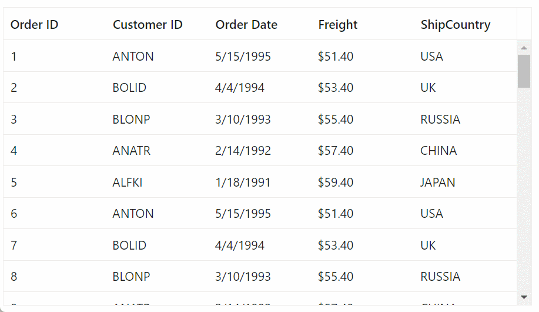
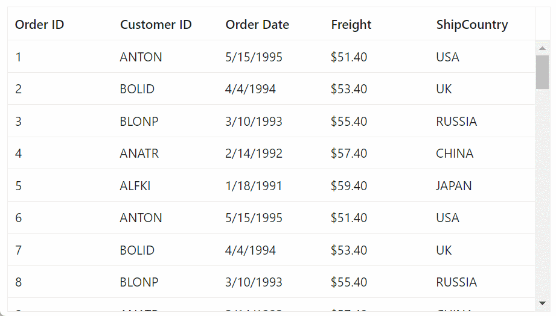

# Infinite Scrolling in Blazor DataGrid

The Infinite Scrolling feature in the DataGrid is a powerful tool for seamlessly handling extensive data sets without compromising grid performance. It operates on a "load-on-demand" concept, ensuring that data is fetched only when needed. In the default infinite scrolling mode, a new block of data is loaded each time the scrollbar reaches the end of the vertical scroller. This approach significantly enhances the user experience when working with large data collections in the Blazor DataGrid.

In this mode, a block of data accumulates every time the scrollbar reaches the end of the scroller. To clarify, in this context, a "block" represents the [PageSize](https://help.syncfusion.com/cr/blazor/Syncfusion.Blazor.Grids.GridPageSettings.html#Syncfusion_Blazor_Grids_GridPageSettings_PageSize) of the Grid. If the `PageSize` is not explicitly specified, the Grid will automatically calculate it based on the grid viewport height and row height.

To enable infinite scrolling, you need to define
[EnableInfiniteScrolling](https://help.syncfusion.com/cr/blazor/Syncfusion.Blazor.Grids.SfGrid-1.html#Syncfusion_Blazor_Grids_SfGrid_1_EnableInfiniteScrolling) as true and content height by [Height](https://help.syncfusion.com/cr/blazor/Syncfusion.Blazor.Grids.SfGrid-1.html#Syncfusion_Blazor_Grids_SfGrid_1_Height) property.

N> In this feature, the Grid will not initiate a new data request when revisiting the same page.

N> The [Height](https://help.syncfusion.com/cr/blazor/Syncfusion.Blazor.Grids.SfGrid-1.html#Syncfusion_Blazor_Grids_SfGrid_1_Height)  property must be specified when enabling `EnableInfiniteScrolling`.

```csharp

@using Syncfusion.Blazor.Grids

<SfGrid @ref="Grid" ID="Grid" DataSource="@Orders" Height="300" EnableInfiniteScrolling="true">
    <GridPageSettings PageSize="20"></GridPageSettings>
    <GridColumns>
        <GridColumn Field=@nameof(Order.OrderID) HeaderText="Order ID" IsPrimaryKey=true Width="120"></GridColumn>
        <GridColumn Field=@nameof(Order.CustomerID) HeaderText="Customer ID" Width="150"></GridColumn>
        <GridColumn Field=@nameof(Order.OrderDate) HeaderText="Order Date" Format="d" Type="ColumnType.Date" Width="130"></GridColumn>
        <GridColumn Field=@nameof(Order.Freight) HeaderText="Freight" Format="C2" Width="120"></GridColumn>
        <GridColumn Field=@nameof(Order.ShipCountry) HeaderText="ShipCountry" Width="150"></GridColumn>
    </GridColumns>
</SfGrid>

@code {
    public List<Order> Orders { get; set; }
    public SfGrid<Order> Grid { get; set; }
    protected override void OnInitialized()
    {
        Orders = GetAllRecords();
    }
    public List<Order> GetAllRecords()
    {
        List<Order> data = new List<Order>();
        int count = 0;
        int id = 10;
        for (int i = 0; i < 200; i++)
        {
            data.Add(new Order() { OrderID = count + 1, CustomerID = "ANTON", OrderDate = new DateTime(1995, 05, 15), Freight = 25.7 * 2, ShipCountry = "USA" });
            data.Add(new Order() { OrderID = count + 2, CustomerID = "BOLID", OrderDate = new DateTime(1994, 04, 04), Freight = 26.7 * 2, ShipCountry = "UK" });
            data.Add(new Order() { OrderID = count + 3, CustomerID = "BLONP", OrderDate = new DateTime(1993, 03, 10), Freight = 27.7 * 2, ShipCountry = "RUSSIA" });
            data.Add(new Order() { OrderID = count + 4, CustomerID = "ANATR", OrderDate = new DateTime(1992, 02, 14), Freight = 28.7 * 2, ShipCountry = "CHINA" });
            data.Add(new Order() { OrderID = count + 5, CustomerID = "ALFKI", OrderDate = new DateTime(1991, 01, 18), Freight = 29.7 * 2, ShipCountry = "JAPAN" });
            count += 5;
            id += 5;
        }
        return data;
    }

    public class Order
    {
        public int? OrderID { get; set; }
        public string CustomerID { get; set; }
        public DateTime? OrderDate { get; set; }
        public double? Freight { get; set; }
        public string ShipCountry { get; set; }
    }
}
```

The following GIF represents the infinite scrolling functionality in DataGrid



## Number of blocks rendered during initial loading

The number of blocks to be initially rendered when the Grid is loaded. Each block corresponds to a page size of the Grid, resulting in the rendering of a certain number of row elements determined by multiplying the initial block size with the page size.

You can define the initial loading pages count by using [InitialBlocks](https://help.syncfusion.com/cr/blazor/Syncfusion.Blazor.Grids.GridInfiniteScrollSettings.html) property of [GridInfiniteScrollSettings](https://help.syncfusion.com/cr/blazor/Syncfusion.Blazor.Grids.GridInfiniteScrollSettings.html) class. By default, this property loads three pages during the initial rendering. Subsequently, additional data is buffered and loaded based on either the page size or the number of rows rendered within the provided height.

In the below demo, `InitialBlocks` property value is changed as 4 instead of 3.
```csharp

@using Syncfusion.Blazor.Grids

<SfGrid @ref="Grid" ID="Grid" DataSource="@Orders" Height="300" EnableInfiniteScrolling="true">
    <GridPageSettings PageSize="20"></GridPageSettings>
    <GridInfiniteScrollSettings InitialBlocks="4"></GridInfiniteScrollSettings>
    <GridColumns>
        <GridColumn Field=@nameof(Order.OrderID) HeaderText="Order ID" IsPrimaryKey=true Width="120"></GridColumn>
        <GridColumn Field=@nameof(Order.CustomerID) HeaderText="Customer ID" Width="150"></GridColumn>
        <GridColumn Field=@nameof(Order.OrderDate) HeaderText="Order Date" Format="d" Type="ColumnType.Date" Width="130"></GridColumn>
        <GridColumn Field=@nameof(Order.Freight) HeaderText="Freight" Format="C2" Width="120"></GridColumn>
        <GridColumn Field=@nameof(Order.ShipCountry) HeaderText="ShipCountry" Width="150"></GridColumn>
    </GridColumns>
</SfGrid>

@code {
    public List<Order> Orders { get; set; }
    public SfGrid<Order> Grid { get; set; }
    protected override void OnInitialized()
    {
        Orders = GetAllRecords();
    }
    public List<Order> GetAllRecords()
    {
        List<Order> data = new List<Order>();
        int count = 0;
        int id = 10;
        for (int i = 0; i < 200; i++)
        {
            data.Add(new Order() { OrderID = count + 1, CustomerID = "ANTON", OrderDate = new DateTime(1995, 05, 15), Freight = 25.7 * 2, ShipCountry = "USA" });
            data.Add(new Order() { OrderID = count + 2, CustomerID = "BOLID", OrderDate = new DateTime(1994, 04, 04), Freight = 26.7 * 2, ShipCountry = "UK" });
            data.Add(new Order() { OrderID = count + 3, CustomerID = "BLONP", OrderDate = new DateTime(1993, 03, 10), Freight = 27.7 * 2, ShipCountry = "RUSSIA" });
            data.Add(new Order() { OrderID = count + 4, CustomerID = "ANATR", OrderDate = new DateTime(1992, 02, 14), Freight = 28.7 * 2, ShipCountry = "CHINA" });
            data.Add(new Order() { OrderID = count + 5, CustomerID = "ALFKI", OrderDate = new DateTime(1991, 01, 18), Freight = 29.7 * 2, ShipCountry = "JAPAN" });
            count += 5;
            id += 5;
        }
        return data;
    }

    public class Order
    {
        public int? OrderID { get; set; }
        public string CustomerID { get; set; }
        public DateTime? OrderDate { get; set; }
        public double? Freight { get; set; }
        public string ShipCountry { get; set; }
    }
}
```

## Efficient data caching and DOM management in grid cache mode

In Grid cache mode, cached data blocks are reused when revisiting them, reducing the need for frequent data requests while navigating the same block. This mode also manages DOM row elements based on the [MaximumBlocks](https://help.syncfusion.com/cr/blazor/Syncfusion.Blazor.Grids.GridInfiniteScrollSettings.html) count value. If this limit is exceeded, it removes a block of row elements to create new rows.

To enable cache mode, you need to define [EnableCache](https://help.syncfusion.com/cr/blazor/Syncfusion.Blazor.Grids.GridInfiniteScrollSettings.html) property of `GridInfiniteScrollSettings` class as **true**.

To enable maximum blocks, you need to define `MaximumBlocks` count of [GridInfiniteScrollSettings](https://help.syncfusion.com/cr/blazor/Syncfusion.Blazor.Grids.GridInfiniteScrollSettings.html) class, By default this property value is 3.

In the below demo, the `EnableCache` in `GridInfiniteScrollSettings` property is enabled, here three pages of records get loaded for each request.
```csharp

@using Syncfusion.Blazor.Grids

<SfGrid @ref="Grid" ID="Grid" DataSource="@Orders" Height="300" EnableInfiniteScrolling=true>
    <GridPageSettings PageSize="20"></GridPageSettings>
    <GridInfiniteScrollSettings EnableCache="true"></GridInfiniteScrollSettings>
    <GridColumns>
        <GridColumn Field=@nameof(Order.OrderID) HeaderText="Order ID" IsPrimaryKey=true Width="120"></GridColumn>
        <GridColumn Field=@nameof(Order.CustomerID) HeaderText="Customer ID" Width="150"></GridColumn>
        <GridColumn Field=@nameof(Order.OrderDate) HeaderText="Order Date" Format="d" Type="ColumnType.Date" Width="130"></GridColumn>
        <GridColumn Field=@nameof(Order.Freight) HeaderText="Freight" Format="C2" Width="120"></GridColumn>
        <GridColumn Field=@nameof(Order.ShipCountry) HeaderText="ShipCountry" Width="150"></GridColumn>
    </GridColumns>
</SfGrid>

@code {
    public List<Order> Orders { get; set; }
    public SfGrid<Order> Grid { get; set; }
    protected override void OnInitialized()
    {
        Orders = GetAllRecords();
    }
    
    public List<Order> GetAllRecords()
    {
        List<Order> data = new List<Order>();
        int count = 0;
        int id = 10;
        for (int i = 0; i < 200; i++)
        {
            data.Add(new Order() { OrderID = count + 1, CustomerID = "ANTON", OrderDate = new DateTime(1995, 05, 15), Freight = 25.7 * 2, ShipCountry = "USA" });
            data.Add(new Order() { OrderID = count + 2, CustomerID = "BOLID", OrderDate = new DateTime(1994, 04, 04), Freight = 26.7 * 2, ShipCountry = "UK" });
            data.Add(new Order() { OrderID = count + 3, CustomerID = "BLONP", OrderDate = new DateTime(1993, 03, 10), Freight = 27.7 * 2, ShipCountry = "RUSSIA" });
            data.Add(new Order() { OrderID = count + 4, CustomerID = "ANATR", OrderDate = new DateTime(1992, 02, 14), Freight = 28.7 * 2, ShipCountry = "CHINA" });
            data.Add(new Order() { OrderID = count + 5, CustomerID = "ALFKI", OrderDate = new DateTime(1991, 01, 18), Freight = 29.7 * 2, ShipCountry = "JAPAN" });
            count += 5;
            id += 5;
        }
        return data;
    }

    public class Order
    {
        public int? OrderID { get; set; }
        public string CustomerID { get; set; }
        public DateTime? OrderDate { get; set; }
        public double? Freight { get; set; }
        public string ShipCountry { get; set; }
    }
}
```
The following GIF represents the infinite scrolling with cache mode functionality in DataGrid



## Limitations

* Due to the element height limitation in browsers, the maximum number of records loaded by the grid is limited due to the browser capability.

* The combined height of the initially loaded rows must exceed the height of the viewport.

* Infinite scrolling is not compatible with batch editing, detail template and hierarchy features.

* Drag selection is only compatible with the current viewport data items in the grid when infinite scrolling is enabled.

* Cell selection will not be persisted in cache mode.

* In normal grouping, infinite scrolling is not supported for child items when performing expand and collapse actions on caption rows. All child items are loaded when the caption rows are expanded or collapsed in grid.

* The aggregated information and total group items are displayed based on the current view items.

* In lazy load grouping with infinite scrolling, cache mode is not supported, and infinite scrolling mode is only available for parent-level caption rows in lazy load grouping with infinite scrolling.

* Programmatic selection using the [SelectRowsAsync](https://help.syncfusion.com/cr/blazor/Syncfusion.Blazor.Grids.SfGrid-1.html#Syncfusion_Blazor_Grids_SfGrid_1_SelectRowsAsync_System_Int32___) and [SelectRowAsync](https://help.syncfusion.com/cr/blazor/Syncfusion.Blazor.Grids.SfGrid-1.html#Syncfusion_Blazor_Grids_SfGrid_1_SelectRowAsync_System_Int32_System_Nullable_System_Boolean__)  method is not supported in infinite scrolling.

## See also

* [Infinite scrolling with Lazy load grouping in DataGrid](https://blazor.syncfusion.com/documentation/datagrid/lazy-load-grouping#lazy-load-grouping-with-infinite-scrolling)
