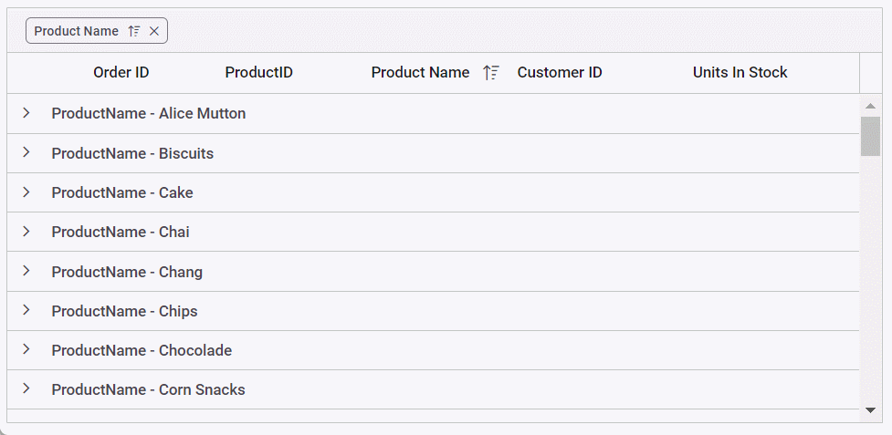

# Lazy Load Grouping in Blazor DataGrid Component

The lazy load grouping allows you to load grouped records to the Grid through the on-demand concept. So, you can use this feature to load a huge amount of grouped data to the Grid without any performance degradation.

When you enable this feature, the Grid will render only the initial level caption rows in the collapsed state at grouping. The child rows of each caption will be fetched from the server and render in the Grid when you expand the caption row.

The caption row expand/collapse state will be persisted on paging and grid pages count will be determined based on the caption and child rows.

To enable lazy load grouping in the datagrid, set the `EnableLazyLoading` as true in [GridGroupSettings](https://help.syncfusion.com/cr/blazor/Syncfusion.Blazor.Grids.SfGrid-1.html#Syncfusion_Blazor_Grids_SfGrid_1_GroupSettings) component.

The following sample code demonstrates the above,

```cshtml
@using Syncfusion.Blazor.Grids

<SfGrid DataSource="@Orders" AllowPaging="true" AllowGrouping="true">
    <GridGroupSettings EnableLazyLoading="true" Columns="@Initial"></GridGroupSettings>
    <GridColumns>
        <GridColumn Field=@nameof(Order.OrderID) HeaderText="Order ID" TextAlign="TextAlign.Right" Width="120"></GridColumn>
        <GridColumn Field=@nameof(Order.CustomerID) HeaderText="Customer Name" Width="150"></GridColumn>
        <GridColumn Field=@nameof(Order.OrderDate) HeaderText=" Order Date" Format="d" Type="ColumnType.Date" TextAlign="TextAlign.Right" Width="130"></GridColumn>
        <GridColumn Field=@nameof(Order.Freight) HeaderText="Freight" Format="C2" TextAlign="TextAlign.Right" Width="120"></GridColumn>
    </GridColumns>
</SfGrid>

@code{
    public string[] Initial = (new string[] { "CustomerID" });
    public List<Order> Orders { get; set; }

    protected override void OnInitialized()
    {
        Orders = Enumerable.Range(1, 75).Select(x => new Order()
        {
            OrderID = 1000 + x,
            CustomerID = (new string[] { "ALFKI", "ANANTR", "ANTON", "BLONP", "BOLID","Maria", "Ana Trujillo", "Antonio Moreno", "Thomas Hardy", "Christina Berglund", "Hanna Moos", "Frédérique Citeaux", "Martín Sommer", "Laurence Lebihan", "Elizabeth Lincoln",
                    "Victoria Ashworth", "Patricio Simpson", "Francisco Chang", "Yang Wang", "Pedro Afonso" })[new Random().Next(20)],
            Freight = 2.1 * x,
            OrderDate = DateTime.Now.AddDays(-x),
        }).ToList();
    }

    public class Order
    {
        public int OrderID { get; set; }
        public string CustomerID { get; set; }
        public DateTime? OrderDate { get; set; }
        public double? Freight { get; set; }
    }
}
```

The following GIF represents the lazy load grouping functionality with paging in DataGrid


## Lazy load grouping with virtual scrolling

When you enable lazy load grouping with the virtual scrolling feature, the Grid will render only the initial level caption rows in the collapsed state at grouping. The child rows of each caption will be fetched from the server and rendered in the Grid when you expand the caption row. The caption row expand/collapse state will be persisted while scrolling. In addition, for great performance, a loading placeholder indicator(masked row) is shown between the time of fetching the new data and binding it to the grid. Also, the same set of DOM elements is reused to improve performance.

To enable lazy load grouping with virtual scrolling in the datagrid, you need to define the [EnableVirtualization](https://help.syncfusion.com/cr/blazor/Syncfusion.Blazor.Grids.SfGrid-1.html#Syncfusion_Blazor_Grids_SfGrid_1_EnableVirtualization) property as **true** and the [EnableLazyLoading](https://help.syncfusion.com/cr/blazor/Syncfusion.Blazor.Grids.GridGroupSettings.html#Syncfusion_Blazor_Grids_GridGroupSettings_EnableLazyLoading) property of the [GridGroupSettings](https://help.syncfusion.com/cr/blazor/Syncfusion.Blazor.Grids.GridGroupSettings.html) class as **true**.

N> When `EnableLazyLoading` is enabled with `EnableVirtualization`, the [PageSize](https://help.syncfusion.com/cr/blazor/Syncfusion.Blazor.Grids.GridPageSettings.html#Syncfusion_Blazor_Grids_GridPageSettings_PageSize) property of the [GridPageSettings](https://help.syncfusion.com/cr/blazor/Syncfusion.Blazor.Grids.GridPageSettings.html) class and the [RowHeight](https://help.syncfusion.com/cr/blazor/Syncfusion.Blazor.Grids.SfGrid-1.html#Syncfusion_Blazor_Grids_SfGrid_1_RowHeight) property must be defined.

N> When enabling lazy load grouping with virtual scrolling, the [EnableVirtualMaskRow](https://help.syncfusion.com/cr/blazor/Syncfusion.Blazor.Grids.SfGrid-1.html#Syncfusion_Blazor_Grids_SfGrid_1_EnableVirtualMaskRow) property is enabled by default. There is no need to use this property explicitly.

The following sample code demonstrates the above:

```cshtml
@using Syncfusion.Blazor.Grids
@using Syncfusion.Blazor.Data

<SfGrid TValue="Customer" DataSource="customers" ID="Grid" RowHeight="36" AllowGrouping="true" EnableVirtualization="true" Height="400">
    <GridGroupSettings ShowGroupedColumn=true EnableLazyLoading="true" Columns="@GroupedColumns">
        <CaptionTemplate>
            @{
                var customer = (context as CaptionTemplateContext);
                <div>@customer.Field - @customer.Key</div>
            }
        </CaptionTemplate>
    </GridGroupSettings>
    <GridPageSettings PageSize=40></GridPageSettings>
    <GridColumns>
        <GridColumn Field=@nameof(Customer.OrderID) HeaderText="Order ID" IsPrimaryKey=true AllowGrouping="false" TextAlign="@TextAlign.Center" Width="120"></GridColumn>
        <GridColumn Field=@nameof(Customer.ProductID) HeaderText="ProductID" Width="120"></GridColumn>
        <GridColumn Field=@nameof(Customer.ProductName) HeaderText="Product Name" Width="200"></GridColumn>
        <GridColumn Field=@nameof(Customer.CustomerID) HeaderText="Customer ID" Width="170"></GridColumn>
        <GridColumn Field=@nameof(Customer.UnitsInStock) HeaderText="Units In Stock" Width="120"></GridColumn>
    </GridColumns>
</SfGrid>

@code{
    public string[] GroupedColumns = new string[] {"ProductName","CustomerID"};
    public List<Customer> customers { get; set; } = Customer.GetAllRecords();
    public class Customer
    {
        public int OrderID { get; set; }
        public string CustomerID { get; set; }
        public string CustomerName { get; set; }
        public string CustomerAddress { get; set; }
        public string ProductName { get; set; }
        public int ProductID { get; set; }
        public string Quantity { get; set; }
        public int UnitsInStock { get; set; }
        public static List<Customer> GetAllRecords()
        {
            List<Customer> customers = new List<Customer>();
            string[] CustomerId ={"VINET", "TOMSP", "HANAR", "VICTE", "SUPRD", "HANAR", "CHOPS", "RICSU", "WELLI", "HILAA", "ERNSH", "CENTC",
                "OTTIK", "QUEDE", "RATTC", "ERNSH", "FOLKO", "BLONP", "WARTH", "FRANK", "GROSR", "WHITC", "WARTH", "SPLIR", "RATTC", "QUICK", "VINET",
                "MAGAA", "TORTU", "MORGK", "BERGS", "LEHMS", "BERGS", "ROMEY", "ROMEY", "LILAS", "LEHMS", "QUICK", "QUICK", "RICAR", "REGGC", "BSBEV",
                "COMMI", "QUEDE", "TRADH", "TORTU", "RATTC", "VINET", "LILAS", "BLONP", "HUNGO", "RICAR", "MAGAA", "WANDK", "SUPRD", "GODOS", "TORTU",
                "OLDWO", "ROMEY", "LONEP", "ANATR", "HUNGO", "THEBI", "DUMON", "WANDK", "QUICK", "RATTC", "ISLAT", "RATTC", "LONEP", "ISLAT", "TORTU",
                "WARTH", "ISLAT", "PERIC", "KOENE", "SAVEA", "KOENE", "BOLID", "FOLKO", "FURIB", "SPLIR", "LILAS", "BONAP", "MEREP", "WARTH", "VICTE",
                "HUNGO", "PRINI", "FRANK", "OLDWO", "MEREP", "BONAP", "SIMOB", "FRANK", "LEHMS", "WHITC", "QUICK", "RATTC", "FAMIA" };          
            string[] Product = { "Chai", "Chang", "Syrup", "Corn Snacks", "Gumbo Mix", "Seeds",
                "Dried Pears", "Sauce", "Mishi Kobe Niku", "Ikura", "Queso Cabrales", "Queso Manchego Pastora", "Konbu",
                "Tofu", "Genen Shouyu", "Pavlova", "Alice Mutton", "Biscuits", "Teatime Chocolate Biscuits", "Sir Rodney\"s Marmalade", "Sir Rodney\"s Scones",
                "Gustaf\"s Knäckebröd", "Tunnbröd", "Guaraná Fantástica", "Nougat-Creme", "Gumbär Gummibärchen", "Schoggi Schokolade", "Rössle Sauerkraut",
                "Thüringer Rostbratwurst", "Nord-Ost Matjeshering", "Gorgonzola Telino", "Mascarpone Fabioli", "Geitost", "Sasquatch Ale", "Steeleye Stout", "Inlagd Sill",
                "Gravad lax", "Nuts", "Chips", "Crab Meat", "Jack\"s Clam Chowder", "Singaporean Fried Mee", "Ipoh Coffee",
                "Gula Malacca", "Rogede sild", "Spegesild", "Zaanse koeken", "Chocolade", "Maxilaku", "Valkoinen suklaa", "Manjimup Dried Apples", "Filo Mix", "Perth Pasties",
                "Tourtičre", "Pâté chinois", "Ipoh Coffee", "Ravioli Angelo", "Escargots Bourgogne", "Raclette Courdavault", "Cake", "Sirop d\"érable",
                "Tarte au sucre", "Vegie-spread", "Lakkalikri", "Louisiana Pepper Sauce", "Louisiana Hot Spiced Okra", "Lumberjack Lager", "Scottish Longbreads",
                "Gudbrandsdalsost", "Outback Lager", "Flotemysost", "Mozzarella di Giovanni", "Röd Kaviar", "Longlife Tofu", "Rhönbräu Klosterbier", "Lakkalikööri", "Original Frankfurter" };
            int OrderID = 1001;
            int i = 0; int j = 0; int k = 0; int l = 0; int m = 0;
            for (int x = 0; x < 500000; x++)
            {
                i = i >= CustomerId.Length ? 0 : i; 
                l = l >= Product.Length ? 0 : l; 
                customers.Add(new Customer() 
                { 
                    OrderID = OrderID + x, 
                    ProductID = x % 1000,
                    CustomerID = CustomerId[i],                  
                    ProductName = Product[l],  
                    UnitsInStock = new Random().Next(1, 10000) 
                });
                i++; j++; k++; l++; m++;
            }
            return customers;
        }
    }
}
```

The following GIF represents the lazy load grouping functionality with virtualization in DataGrid


## Lazy load grouping with custom adaptor

You can use the Custom Adaptor of `SfDataManager` when binding the remote data. Along with the default server request, this feature will additionally send the below details to handle the lazy load grouping. In the server end, these details are bound with the **LazyLoad** and **LazyExpandAllGroup** parameters in the `DataManagerRequest` model.

| Property Name | Description |
|-------|---------|
| LazyLoad | To differentiate between default grouping and lazy load grouping.|
| LazyExpandAllGroup | To handle ExpandAll support for lazy load grouping.|

The following code example describes the lazy load grouping handled at the server-side with other grid actions.

```csharp
 // Implementing custom adaptor by extending the DataAdaptor class
    public class CustomAdaptor : DataAdaptor
    {
        public List<Customer> customers { get; set; } = Customer.GetAllRecords();
        // Performs data Read operation
        public override object Read(DataManagerRequest dm, string key = null)
        {
            IEnumerable<Customer> DataSource = customers;
            if (dm.Search != null && dm.Search.Count > 0)
            {
                // Searching
                DataSource = DataOperations.PerformSearching(DataSource, dm.Search);
            }
            if (dm.Sorted != null && dm.Sorted.Count > 0)
            {
                // Sorting
                DataSource = DataOperations.PerformSorting(DataSource, dm.Sorted);
            }
            if (dm.Where != null && dm.Where.Count > 0)
            {
                // Filtering
                DataSource = DataOperations.PerformFiltering(DataSource, dm.Where, dm.Where[0].Operator);
            }
            int count = DataSource.Cast<Customer>().Count();
            if (dm.Skip != 0)
            {
                //Paging
                DataSource = DataOperations.PerformSkip(DataSource, dm.Skip);
            }
            if (dm.Take != 0)
            {
                DataSource = DataOperations.PerformTake(DataSource, dm.Take);
            }
            DataResult DataObject = new DataResult();
            if (dm.Group != null)
            {
                // Grouping (Perform lazy load grouping need to send LazyLoad property in Group method)
                IEnumerable ResultData = DataSource.ToList();
                ResultData = DataUtil.Group<Customer>(DataSource, dm.Group[0], dm.Aggregates, 0, dm.GroupByFormatter, dm.LazyLoad, dm.LazyExpandAllGroup);
                DataObject.Result = ResultData;
                DataObject.Count = ResultData.Cast<object>().Count();
                return dm.RequiresCounts ? DataObject : (object)ResultData;
            }
            return dm.RequiresCounts ? new DataResult() { Result = DataSource, Count = count } : (object)DataSource;
        }
    }
```
## Lazy load grouping with infinite scrolling

When you enable lazy load grouping with infinite scrolling, the Grid initially renders only the caption rows in a collapsed state during grouping. This feature supports parent-level caption rows and fetches additional caption rows when the scrollbar reaches the end of the scroller. For child items, it fetches data for the expanded caption rows using the row virtualization concept while performing a vertical scroll. In addition, for better performance, a loading placeholder indicator (masked row) is shown between the time of fetching the new data and binding it to the grid for rendering child items.

To enable lazy load grouping with infinite scrolling in the datagrid, you need to define the [EnableInfiniteScrolling](https://help.syncfusion.com/cr/blazor/Syncfusion.Blazor.Grids.SfGrid-1.html#Syncfusion_Blazor_Grids_SfGrid_1_EnableInfiniteScrolling) property as **true** and the [EnableLazyLoading](https://help.syncfusion.com/cr/blazor/Syncfusion.Blazor.Grids.GridGroupSettings.html#Syncfusion_Blazor_Grids_GridGroupSettings_EnableLazyLoading) property of the [GridGroupSettings](https://help.syncfusion.com/cr/blazor/Syncfusion.Blazor.Grids.GridGroupSettings.html) class as **true**.

N> When `EnableLazyLoading` is enabled with `EnableInfiniteScrolling`, the [Height](https://help.syncfusion.com/cr/blazor/Syncfusion.Blazor.Grids.SfGrid-1.html#Syncfusion_Blazor_Grids_SfGrid_1_Height) and the [RowHeight](https://help.syncfusion.com/cr/blazor/Syncfusion.Blazor.Grids.SfGrid-1.html#Syncfusion_Blazor_Grids_SfGrid_1_RowHeight) property must be defined.

The following sample code demonstrates the above:

```cshtml
@using Syncfusion.Blazor.Grids
@using Syncfusion.Blazor.Data

<SfGrid TValue="Customer" DataSource="customers" ID="Grid" EnableInfiniteScrolling="true" RowHeight="36" AllowGrouping="true" Height="300">
    <GridGroupSettings ShowGroupedColumn=true EnableLazyLoading="true" Columns="@GroupedColumns">
        <CaptionTemplate>
            @{
                var customer = (context as CaptionTemplateContext);
                <div>@customer.Field - @customer.Key</div>
            }
        </CaptionTemplate>
    </GridGroupSettings>
    <GridPageSettings PageSize=20></GridPageSettings>
    <GridColumns>
        <GridColumn Field=@nameof(Customer.OrderID) HeaderText="Order ID" IsPrimaryKey=true AllowGrouping="false" TextAlign="@TextAlign.Center" Width="120"></GridColumn>
        <GridColumn Field=@nameof(Customer.ProductID) HeaderText="ProductID" Width="120"></GridColumn>
        <GridColumn Field=@nameof(Customer.ProductName) HeaderText="Product Name" Width="200"></GridColumn>
        <GridColumn Field=@nameof(Customer.CustomerID) HeaderText="Customer ID" Width="170"></GridColumn>
        <GridColumn Field=@nameof(Customer.UnitsInStock) HeaderText="Units In Stock" Width="120"></GridColumn>
    </GridColumns>
</SfGrid>

@code{
    public string[] GroupedColumns = new string[] {"ProductName","CustomerID"};
    public List<Customer> customers { get; set; } = Customer.GetAllRecords();
    public class Customer
    {
        public int OrderID { get; set; }
        public string CustomerID { get; set; }
        public string CustomerName { get; set; }
        public string CustomerAddress { get; set; }
        public string ProductName { get; set; }
        public int ProductID { get; set; }
        public string Quantity { get; set; }
        public int UnitsInStock { get; set; }
        public static List<Customer> GetAllRecords()
        {
            List<Customer> customers = new List<Customer>();
            string[] CustomerId ={"VINET", "TOMSP", "HANAR", "VICTE", "SUPRD", "HANAR", "CHOPS", "RICSU", "WELLI", "HILAA", "ERNSH", "CENTC",
                "OTTIK", "QUEDE", "RATTC", "ERNSH", "FOLKO", "BLONP", "WARTH", "FRANK", "GROSR", "WHITC", "WARTH", "SPLIR", "RATTC", "QUICK", "VINET",
                "MAGAA", "TORTU", "MORGK", "BERGS", "LEHMS", "BERGS", "ROMEY", "ROMEY", "LILAS", "LEHMS", "QUICK", "QUICK", "RICAR", "REGGC", "BSBEV",
                "COMMI", "QUEDE", "TRADH", "TORTU", "RATTC", "VINET", "LILAS", "BLONP", "HUNGO", "RICAR", "MAGAA", "WANDK", "SUPRD", "GODOS", "TORTU",
                "OLDWO", "ROMEY", "LONEP", "ANATR", "HUNGO", "THEBI", "DUMON", "WANDK", "QUICK", "RATTC", "ISLAT", "RATTC", "LONEP", "ISLAT", "TORTU",
                "WARTH", "ISLAT", "PERIC", "KOENE", "SAVEA", "KOENE", "BOLID", "FOLKO", "FURIB", "SPLIR", "LILAS", "BONAP", "MEREP", "WARTH", "VICTE",
                "HUNGO", "PRINI", "FRANK", "OLDWO", "MEREP", "BONAP", "SIMOB", "FRANK", "LEHMS", "WHITC", "QUICK", "RATTC", "FAMIA" };          
            string[] Product = { "Chai", "Chang", "Syrup", "Corn Snacks", "Gumbo Mix", "Seeds",
                "Dried Pears", "Sauce", "Mishi Kobe Niku", "Ikura", "Queso Cabrales", "Queso Manchego Pastora", "Konbu",
                "Tofu", "Genen Shouyu", "Pavlova", "Alice Mutton", "Biscuits", "Teatime Chocolate Biscuits", "Sir Rodney\"s Marmalade", "Sir Rodney\"s Scones",
                "Gustaf\"s Knäckebröd", "Tunnbröd", "Guaraná Fantástica", "Nougat-Creme", "Gumbär Gummibärchen", "Schoggi Schokolade", "Rössle Sauerkraut",
                "Thüringer Rostbratwurst", "Nord-Ost Matjeshering", "Gorgonzola Telino", "Mascarpone Fabioli", "Geitost", "Sasquatch Ale", "Steeleye Stout", "Inlagd Sill",
                "Gravad lax", "Nuts", "Chips", "Crab Meat", "Jack\"s Clam Chowder", "Singaporean Fried Mee", "Ipoh Coffee",
                "Gula Malacca", "Rogede sild", "Spegesild", "Zaanse koeken", "Chocolade", "Maxilaku", "Valkoinen suklaa", "Manjimup Dried Apples", "Filo Mix", "Perth Pasties",
                "Tourtičre", "Pâté chinois", "Ipoh Coffee", "Ravioli Angelo", "Escargots Bourgogne", "Raclette Courdavault", "Cake", "Sirop d\"érable",
                "Tarte au sucre", "Vegie-spread", "Lakkalikri", "Louisiana Pepper Sauce", "Louisiana Hot Spiced Okra", "Lumberjack Lager", "Scottish Longbreads",
                "Gudbrandsdalsost", "Outback Lager", "Flotemysost", "Mozzarella di Giovanni", "Röd Kaviar", "Longlife Tofu", "Rhönbräu Klosterbier", "Lakkalikööri", "Original Frankfurter" };
            int OrderID = 1001;
            int i = 0; int j = 0; int k = 0; int l = 0; int m = 0;
            for (int x = 0; x < 500000; x++)
            {
                i = i >= CustomerId.Length ? 0 : i; 
                l = l >= Product.Length ? 0 : l; 
                customers.Add(new Customer() 
                { 
                    OrderID = OrderID + x, 
                    ProductID = x % 1000,
                    CustomerID = CustomerId[i],                  
                    ProductName = Product[l],  
                    UnitsInStock = new Random().Next(1, 10000) 
                });
                i++; j++; k++; l++; m++;
            }
            return customers;
        }
    }
}
```

The following GIF represents the lazy load grouping with infinite scrolling functionality in DataGrid


