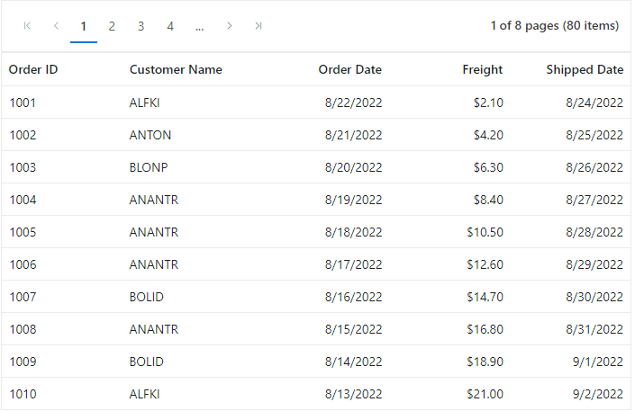

# Paging in Blazor DataGrid Component

[Paging](https://www.syncfusion.com/blazor-components/blazor-datagrid/paging) provides an option to display DataGrid data in page segments. To enable paging, set the [AllowPaging](https://help.syncfusion.com/cr/blazor/Syncfusion.Blazor.Grids.SfGrid-1.html#Syncfusion_Blazor_Grids_SfGrid_1_AllowPaging) to true. When paging is enabled, pager component renders at the bottom of the datagrid.
Paging options can be configured through the [GridPageSettings](https://help.syncfusion.com/cr/blazor/Syncfusion.Blazor.Grids.SfGrid-1.html#Syncfusion_Blazor_Grids_SfGrid_1_PageSettings) component.

In the following sample, [PageSize](https://help.syncfusion.com/cr/blazor/Syncfusion.Blazor.Grids.GridPageSettings.html#Syncfusion_Blazor_Grids_GridPageSettings_PageSize) is calculated based on the datagrid height by using the [OnLoad](https://help.syncfusion.com/cr/blazor/Syncfusion.Blazor.Grids.SfGrid-1.html) event.

```cshtml
@using Syncfusion.Blazor.Grids

<SfGrid @ref="DefaultGrid" DataSource="@Orders" AllowPaging="true" Height="200">
    <GridEvents OnLoad="Load" TValue="Order"></GridEvents>
    <GridPageSettings PageCount="2"></GridPageSettings>
    <GridColumns>
        <GridColumn Field=@nameof(Order.OrderID) HeaderText="Order ID" TextAlign="TextAlign.Right" Width="120"></GridColumn>
        <GridColumn Field=@nameof(Order.CustomerID) HeaderText="Customer Name" Width="150"></GridColumn>
        <GridColumn Field=@nameof(Order.OrderDate) HeaderText=" Order Date" Format="d" Type="ColumnType.Date" TextAlign="TextAlign.Right" Width="130"></GridColumn>
        <GridColumn Field=@nameof(Order.Freight) HeaderText="Freight" Visible="false" Format="C2" TextAlign="TextAlign.Right" Width="120"></GridColumn>
    </GridColumns>
</SfGrid>

@code{
    private SfGrid<Order> DefaultGrid;
    public int GridHeight;
    public List<Order> Orders { get; set; }

    protected override void OnInitialized()
    {
        Orders = Enumerable.Range(1, 75).Select(x => new Order()
        {
            OrderID = 1000 + x,
            CustomerID = (new string[] { "ALFKI", "ANANTR", "ANTON", "BLONP", "BOLID" })[new Random().Next(5)],
            Freight = 2.1 * x,
            OrderDate = DateTime.Now.AddDays(-x),
        }).ToList();
    }

    public class Order
    {
        public int? OrderID { get; set; }
        public string CustomerID { get; set; }
        public DateTime? OrderDate { get; set; }
        public double? Freight { get; set; }
    }

    public void Load(object args)
    {
        var RowHeight = 37; //height of the each row
        Int32.TryParse(this.DefaultGrid.Height, out GridHeight); //datagrid height
        var PageSize = (this.DefaultGrid.PageSettings as GridPageSettings).PageSize; //initial page size
        decimal PageResize = ((GridHeight) - (PageSize * RowHeight)) / RowHeight; //new page size is obtained here
        #pragma warning disable BL0005
        (this.DefaultGrid.PageSettings as GridPageSettings).PageSize = PageSize + (int)Math.Round(PageResize);
        #pragma warning restore BL0005
    }
}

```

N> You can achieve better performance by using datagrid paging to fetch only a pre-defined number of records from the data source.

## Pager with page size dropdown

The pager dropdown allows you to change the number of records in the DataGrid dynamically. It can be enabled by defining the [PageSizes](https://help.syncfusion.com/cr/blazor/Syncfusion.Blazor.Grids.GridPageSettings.html#Syncfusion_Blazor_Grids_GridPageSettings_PageSizes) property of **GridPageSettings** as true.

N> By default, dropdown list will show values as **new int[]{ 5, 10, 12, 20 }**. You can customize the dropdown values using the **PageSizes** property itself.

```cshtml
@using Syncfusion.Blazor.Grids

<SfGrid DataSource="@Orders" AllowPaging="true">
    <GridPageSettings PageSizes="true"></GridPageSettings>
    <GridColumns>
        <GridColumn Field=@nameof(Order.OrderID) HeaderText="Order ID" TextAlign="TextAlign.Right" Width="120"></GridColumn>
        <GridColumn Field=@nameof(Order.CustomerID) HeaderText="Customer Name" Width="150"></GridColumn>
        <GridColumn Field=@nameof(Order.OrderDate) HeaderText=" Order Date" Format="d" Type="ColumnType.Date" TextAlign="TextAlign.Right" Width="130"></GridColumn>
        <GridColumn Field=@nameof(Order.Freight) HeaderText="Freight" Format="C2" TextAlign="TextAlign.Right" Width="120"></GridColumn>
    </GridColumns>
</SfGrid>

@code{
    public List<Order> Orders { get; set; }

    protected override void OnInitialized()
    {
        Orders = Enumerable.Range(1, 75).Select(x => new Order()
        {
            OrderID = 1000 + x,
            CustomerID = (new string[] { "ALFKI", "ANANTR", "ANTON", "BLONP", "BOLID" })[new Random().Next(5)],
            Freight = 2.1 * x,
            OrderDate = DateTime.Now.AddDays(-x),
        }).ToList();
    }

    public class Order {
        public int? OrderID { get; set; }
        public string CustomerID { get; set; }
        public DateTime? OrderDate { get; set; }
        public double? Freight { get; set; }
    }
}
```

N> You can refer to our [Blazor Grid Paging](https://www.syncfusion.com/blazor-components/blazor-datagrid/paging) Feature tour page to know about paging and its feature representations.
<br/> You can refer to our [Blazor DataGrid](https://www.syncfusion.com/blazor-components/blazor-datagrid) feature tour page for its groundbreaking feature representations. You can also explore our [Blazor DataGrid example](https://blazor.syncfusion.com/demos/datagrid/overview?theme=bootstrap4) to understand how to present and manipulate data.

## Display All records through pager dropdown

The Grid component has the option to show all the records through the pager dropdown during the initial rendering. This can be achieved by defining the total record count in the [PageSize](https://help.syncfusion.com/cr/blazor/Syncfusion.Blazor.Grids.GridPageSettings.html#Syncfusion_Blazor_Grids_GridPageSettings_PageSize) property of the [GridPageSettings](https://help.syncfusion.com/cr/blazor/Syncfusion.Blazor.Grids.GridPageSettings.html) class and customizing the dropdown values using the [PageSizes](https://help.syncfusion.com/cr/blazor/Syncfusion.Blazor.Grids.GridPageSettings.html#Syncfusion_Blazor_Grids_GridPageSettings_PageSizes) property. This total count will select the "All" page size drop-down on initial rendering.

This can be demonstrated in the following sample.

```cshtml
@using Syncfusion.Blazor.Grids

<SfGrid DataSource="@Orders" @ref= "DefaultGrid" AllowPaging="true">
    <GridPageSettings PageSizes="@(new string[] { "5", "10", "15", "20", "50", "All" })" PageSize="@pageSize"></GridPageSettings>
    <GridColumns>
        <GridColumn Field=@nameof(Order.OrderID) HeaderText="Order ID" TextAlign="TextAlign.Right" Width="120"></GridColumn>
        <GridColumn Field=@nameof(Order.CustomerID) HeaderText="Customer Name" Width="150"></GridColumn>
        <GridColumn Field=@nameof(Order.OrderDate) HeaderText=" Order Date" Format="d" Type="ColumnType.Date" TextAlign="TextAlign.Right" Width="130"></GridColumn>
        <GridColumn Field=@nameof(Order.Freight) HeaderText="Freight" Format="C2" TextAlign="TextAlign.Right" Width="120"></GridColumn>
    </GridColumns>
</SfGrid>

@code{
    public List<Order> Orders { get; set; }
    public SfGrid<Order> DefaultGrid;
    public int pageSize { get; set; }

    protected override void OnInitialized()
    {
        Orders = Enumerable.Range(1, 75).Select(x => new Order()
        {
            OrderID = 1000 + x,
            CustomerID = (new string[] { "Nancy", "ANANTR", "ANTON", "BLONP", "BOLID" })[new Random().Next(5)],
            Freight = 2.1 * x,
            OrderDate = DateTime.Now.AddDays(-x),
        }).ToList();
        pageSize = Orders.Count;
    }
    public class Order
    {
        public int? OrderID { get; set; }
        public string CustomerID { get; set; }
        public DateTime? OrderDate { get; set; }
        public double? Freight { get; set; }
    }
}
```

## Pager template

Blazor DataGrid provides a way to customize the pager UI using the pager template feature. You can use the **Template** property of the [GridPageSettings](https://help.syncfusion.com/cr/blazor/Syncfusion.Blazor.Grids.GridPageSettings.html) component to customize the pager template of DataGrid component.

N> Inside the **Template** RenderFragment, you can access the parameters passed to the pager templates using implicit parameter named context matching with the [PagerTemplateContent](https://help.syncfusion.com/cr/blazor/Syncfusion.Blazor.Grids.PagerTemplateContext.html) class name.  

In the below sample, we have customized the Pager component in DataGrid control with custom button and input element to navigate between Grid pages. We have used **GotoPageAsync** method of Grid to navigate to specific page in DataGrid control.

```cshtml

@using Syncfusion.Blazor.Grids

<SfGrid @ref="defaultGrid" DataSource="students" AllowPaging="true">
    <GridPageSettings PageSize="10">
        <Template>
            <div class="PagerTemplate">
                <div class="@($"e-first e-icons e-icon-first {ValidateFirst()} align-icons e-firstpage")" @onclick="ShowFirstPage" title="Go to first page">
                </div>
                <div class="@($"e-prev e-icons e-icon-prev {ValidateBack()} align-icons")" @onclick="ShowPreviousPage" title="Go to previous page"></div>
                <div>
                    <input class="textbox add-border" type="text" @bind="pageNo" size="2" @oninput="LaunchEnteredPage" />
                    <div id="totalpages" class="textbox"> of @totalPages pages </div>
                </div>
                <div class="@($"e-next e-icons e-icon-next   {ValidateForward()} align-icons e-next")" @onclick="ShowNextPage" title="Go to next page"></div>
                <div class="@($"e-last e-icons e-icon-last {ValidateLast()} align-icons")" @onclick="ShowLastPage" title="Go to last page"></div>
            </div>
            <style>
                .PagerTemplate {
                    width: 1000px;
                    height: 64px;
                    left: 183px;
                    top: 615px;
                    border-radius: 0px;
                }

                .textbox {
                    margin-top: 9px;
                    margin-bottom: 9px;
                    margin-right: 2px;
                    text-align: center;
                }

                .add-border {
                    border: #ddd 1px solid;
                }

                .align-icons {
                    margin-top: 9px;
                    margin-bottom: 9px;
                    margin-right: 16px;
                    cursor: pointer;
                }

                .e-firstpage {
                    margin-left: 6px;
                }

                .e-next {
                    margin-left: 16px;
                }

                .disableFirst {
                    pointer-events: none;
                    opacity: 0.3;
                }

                .disableLast {
                    pointer-events: none;
                    opacity: 0.3;
                }

                .disableFront {
                    pointer-events: none;
                    opacity: 0.3;
                }

                .disableBack {
                    pointer-events: none;
                    opacity: 0.3;
                }
            </style>
        </Template>
    </GridPageSettings>
    <GridColumns>
        <GridColumn Field="@nameof(Order.OrderID)" HeaderText="Order ID" TextAlign="TextAlign.Right" Width="120"></GridColumn>
        <GridColumn Field="@nameof(Order.CustomerID)" HeaderText="Customer ID" TextAlign="TextAlign.Left" Width="150"></GridColumn>
        <GridColumn Field="@nameof(Order.OrderDate)" HeaderText="Order Date" TextAlign="TextAlign.Center" Width="130" Format="d" Type="ColumnType.Date"></GridColumn>
        <GridColumn Field="@nameof(Order.Freight)" HeaderText="Freight" Format="c2" TextAlign="TextAlign.Right" Width="130"></GridColumn>
        <GridColumn Field="@nameof(Order.ShipCountry)" HeaderText="Ship Country" TextAlign="TextAlign.Left" Width="140"></GridColumn>
    </GridColumns>
</SfGrid>

@code {
    public SfGrid<Order> defaultGrid;
    public List<Order> students { get; set; }
    public int pageNo { get; set; }
    public int totalPages { get; set; }
    public bool DisableBackIcon = false;
    public bool DisableForwardIcon = false;
    public bool DisableFirstIcon = false;
    public bool DisableLastIcon = false;
    protected override void OnInitialized()
    {
        base.OnInitialized();
        students = Enumerable.Range(1, 100).Select((x) => new Order()
            {
                OrderID = x,
                CustomerID = (new string[] { "ALFKI", "ANATR", "ANTON", "BLONP", "BOLID" })[new Random().Next(5)],
                Freight = 2.1 * x,
                ShipCountry = new string[] { "Denmark", "Germany", "Austria", "Brazil", "Switzerland" }[new Random().Next(5)],
                OrderDate = new DateTime[] { new DateTime(2010, 12, 19), new DateTime(2005, 08, 20), new DateTime(1991, 01, 10), new DateTime(1992, 10, 11), new DateTime(1999, 12, 14) }[new Random().Next(5)]
            }).ToList();
    }
    protected override void OnAfterRender(bool firstRender)
    {
        base.OnAfterRender(firstRender);
        if (firstRender)
        {
            totalPages = defaultGrid.TotalItemCount / defaultGrid.PageSettings.PageSize;
        }
        pageNo = defaultGrid.PageSettings.CurrentPage;
        if (defaultGrid.PageSettings.CurrentPage == totalPages)
        {
            DisableForwardIcon = true;
            DisableLastIcon = true;
        }
        else
        {
            DisableForwardIcon = false;
            DisableLastIcon = false;
        }
        if (defaultGrid.PageSettings.CurrentPage == 1)
        {
            DisableBackIcon = true;
            DisableFirstIcon = true;
        }
        else
        {
            DisableBackIcon = false;
            DisableFirstIcon = false;
        }
        StateHasChanged();
    }
    public class Order
    {
        public int OrderID { get; set; }
        public string CustomerID { get; set; }
        public double Freight { get; set; }
        public string ShipCountry { get; set; }
        public DateTime OrderDate { get; set; }
    }
    public string ValidateFirst()
    {
        if (DisableFirstIcon)
        {
            return "disableFirst";
        }
        return "";
    }
    public string ValidateLast()
    {
        if (DisableLastIcon)
        {
            return "disableLast";
        }
        return "";
    }
    public string ValidateForward()
    {
        if (DisableForwardIcon)
        {
            return "disableFront";
        }
        return "";
    }
    public string ValidateBack()
    {
        if (DisableBackIcon)
        {
            return "disableBack";
        }
        return "";
    }
    public void ShowNextPage()
    {
        defaultGrid.GoToPageAsync((defaultGrid.PageSettings.CurrentPage) + 1);
    }
    public void ShowPreviousPage()
    {
        defaultGrid.GoToPageAsync((defaultGrid.PageSettings.CurrentPage) - 1);
    }
    public void ShowFirstPage()
    {
        defaultGrid.GoToPageAsync(1);
    }
    public void ShowLastPage()
    {
        defaultGrid.GoToPageAsync(totalPages);
    }
    public void LaunchEnteredPage(Microsoft.AspNetCore.Components.ChangeEventArgs page)
    {
        if (page.Value == null || page.Value.ToString() == "")
        {
            return;
        }
        else
        {
            int enteredPage = Convert.ToInt32(page.Value);
            if (enteredPage <= totalPages)
                defaultGrid.GoToPageAsync(enteredPage);
        }
    }
}
```

N> You can refer to our [Blazor Grid Pager Template](https://blazor.syncfusion.com/demos/datagrid/pager-template) online demo of Pager Template feature in Blazor DataGrid.

## How to render Pager at the top of the Grid

By default, the Pager component will be rendered at the bottom of the Grid when the [AllowPaging](https://help.syncfusion.com/cr/blazor/Syncfusion.Blazor.Grids.SfGrid-1.html#Syncfusion_Blazor_Grids_SfGrid_1_AllowPaging) property is enabled. Using the `SfPager` component, it is possible to render the Pager at the top of the grid. This can be achieved by disabling the default pager of the Grid using the `AllowPaging` property and rendering the `SfPager` component externally. Now, syncing the paging action with the Grid can be performed by following the step below:

In the following sample, the SfPager component is rendered on top of the grid. Initially, using the [PageSize](https://help.syncfusion.com/cr/blazor/Syncfusion.Blazor.Navigations.SfPager.html#Syncfusion_Blazor_Navigations_SfPager_PageSize) property of the Pager, the data for the Grid component is bound to the current page. In the following code snippet, the `PageSize` is defined as "10" so that the first ten records from the data source of the Grid will be displayed on the current page using the Skip and Take values. Through the navigation of the pager items, you can view the records on the Grid page by page. This can be achieved by using the [ItemClick](https://help.syncfusion.com/cr/blazor/Syncfusion.Blazor.Navigations.SfPager.html#Syncfusion_Blazor_Navigations_SfPager_Click) event of the Pager. In the `ItemClick` event of the Pager, the SkipValue and TakeValue are calculated using the `PageSize` property and arguments of the `ItemClick` event (CurrentPage, PreviousPage). Based on these details, you can view the records on the Grid page by page.

```cshtml
@using Syncfusion.Blazor.Data
@using Syncfusion.Blazor.Navigations
@using Syncfusion.Blazor.Grids

<SfPager @ref="Page" PageSize="@TakeValue" NumericItemsCount=4 TotalItemsCount="@count" ItemClick="Click">
</SfPager>

@{
    var Data = Orders.Skip(SkipValue).Take(TakeValue).ToList();
    <SfGrid @ref="Grid" DataSource="@Data" >
        <GridColumns>
            <GridColumn Field=@nameof(Order.OrderID) HeaderText="Order ID" TextAlign="TextAlign.Right" Width="120"></GridColumn>
            <GridColumn Field=@nameof(Order.CustomerID) HeaderText="Customer Name" Width="150"></GridColumn>
            <GridColumn Field=@nameof(Order.OrderDate) HeaderText=" Order Date" Format="d" Type="ColumnType.Date" TextAlign="TextAlign.Right" Width="130"></GridColumn>
            <GridColumn Field=@nameof(Order.Freight) HeaderText="Freight" Format="C2" TextAlign="TextAlign.Right" Width="120"></GridColumn>
            <GridColumn Field=@nameof(Order.ShippedDate) HeaderText=" Shipped Date" Format="d" Type="ColumnType.Date" TextAlign="TextAlign.Right" Width="130"></GridColumn>
        </GridColumns>
    </SfGrid>
}

@code
{
    public int SkipValue;
    public SfGrid<Order> Grid { get; set; }   
    public int TakeValue = 10;
    public List<Order> Orders { get; set; }
    public int count { get; set; }
    public SfPager Page { get; set; }

    public void Click(PagerItemClickEventArgs args)
    {
        SkipValue = (args.CurrentPage * Page.PageSize) - Page.PageSize;
        TakeValue = Page.PageSize;
    }

    protected override void OnInitialized()
    {
        Orders = Enumerable.Range(1, 80).Select(x => new Order()
        {
            OrderID = 1000 + x,
            CustomerID = (new string[] { "ALFKI", "ANANTR", "ANTON", "BLONP", "BOLID" })[new Random().Next(5)],
            Freight = 2.1 * x,
            OrderDate = DateTime.Now.AddDays(-x),
            ShippedDate = DateTime.Now.AddDays(x),
        }).ToList();
        count = Orders.Count;
    }

    public class Order 
    {
        public int? OrderID { get; set; }
        public string CustomerID { get; set; }
        public DateTime? OrderDate { get; set; }
        public double? Freight { get; set; }
        public DateTime? ShippedDate { get; set; }
    }
}

```



N> Here, default pager action of the Grid component is disabled.

## See also

* [How to customize page size dropdown value of pager](https://www.syncfusion.com/forums/166711/how-to-customize-the-grid-page-size-dropdown)
