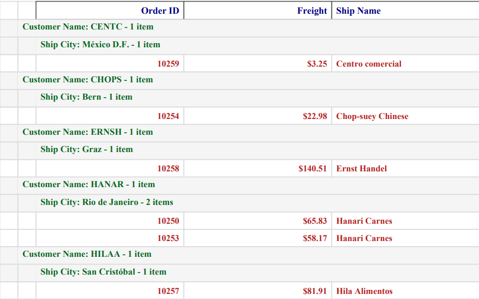
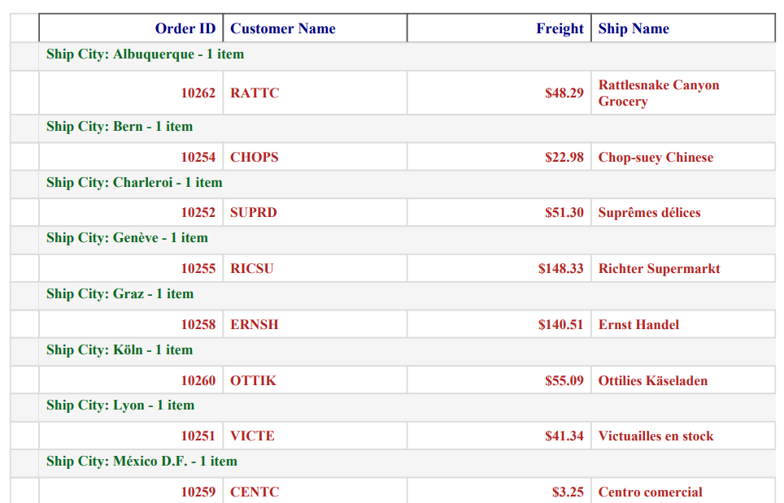

# PDF export options in Blazor DataGrid

The Syncfusion Blazor DataGrid allows you to customize the PDF export options functionality. This flexibility enables you to have greater control over the exported content and layout to meet your specific requirements.

The PDF export action can be customized based on your requirements using the [PdfExportProperties](https://help.syncfusion.com/cr/blazor/Syncfusion.Blazor.Grids.PdfExportProperties.html) property. By using the `PdfExportProperties` property, you can export the current page records, selected records, or filtered records, exclude or include hidden column, export with custom data source and change the file name. Additionally, you can customize the page alignments using the `PdfExportProperties` property.

## Export current page records

Exporting the current page in Syncfusion Blazor DataGrid to a PDF document provides the ability to export the currently displayed page records. This feature allows for generating PDF documents that specifically include the content from the current page of the Grid. 

To export the current page of the Grid to a PDF document, you need to specify the [ExportType](https://help.syncfusion.com/cr/blazor/Syncfusion.Blazor.Grids.PdfExportProperties.html#Syncfusion_Blazor_Grids_PdfExportProperties_ExportType) property. This property allows you to define which records you want to export. You can choose between two options:

1. **CurrentPage**: Exports only the records on the current Grid page.
2. **AllPages**: Exports all the records from the Grid.

The following example demonstrates how to export current page to a PDF document when a toolbar item is clicked, using the  [OnToolbarClick](https://help.syncfusion.com/cr/blazor/Syncfusion.Blazor.Grids.GridEvents-1.html#Syncfusion_Blazor_Grids_GridEvents_1_OnToolbarClick) event and the [ExportToPdfAsync](https://help.syncfusion.com/cr/blazor/Syncfusion.Blazor.Grids.SfGrid-1.html#Syncfusion_Blazor_Grids_SfGrid_1_ExportToPdfAsync_Syncfusion_Blazor_Grids_PdfExportProperties_) method.




@using Syncfusion.Blazor.Grids
@using Syncfusion.Blazor.DropDowns

<div style="display: flex; align-items: center; margin-bottom: 15px;font-weight: bold">
    <label style="padding-right: 10px;">Change export type:</label>
    <SfDropDownList TValue="string" TItem="DropDownOrder" @bind-Value="SelectedExportType" DataSource="@DropDownValue" Width="150px">
        <DropDownListFieldSettings Text="Text" Value="Value" />
    </SfDropDownList>
</div>

<SfGrid ID="Grid" @ref="Grid" DataSource="@Orders" AllowPaging="true" AllowPdfExport="true" Toolbar="@(new List<string>() { "PdfExport" })" Height="300">
    <GridEvents TValue="EmployeeData" OnToolbarClick="ToolbarClickHandler"></GridEvents>
    <GridPageSettings PageSize="8"></GridPageSettings>
    <GridColumns>
        <GridColumn Field=@nameof(EmployeeData.EmployeeID) HeaderText="Employee ID" TextAlign="TextAlign.Right" Width="120" IsPrimaryKey="true" />
        <GridColumn Field=@nameof(EmployeeData.FirstName) HeaderText="First Name" Width="150" />
        <GridColumn Field=@nameof(EmployeeData.LastName) HeaderText="Last Name" Width="150" />
        <GridColumn Field=@nameof(EmployeeData.City) HeaderText="City" Width="150" />
    </GridColumns>
</SfGrid>

@code {
    private SfGrid<EmployeeData> Grid;
    public List<EmployeeData> Orders { get; set; }
    private string SelectedExportType = "CurrentPage";
    List<DropDownOrder> DropDownValue = new List<DropDownOrder>
    {
        new DropDownOrder { Text = "CurrentPage", Value = "CurrentPage" },
        new DropDownOrder { Text = "AllPages", Value = "AllPages" },
    };

    protected override void OnInitialized()
    {
        Orders = EmployeeData.GetAllRecords();
    }

    public async Task ToolbarClickHandler(ClickEventArgs args)
    {
        if (args.Item.Id == "Grid_pdfexport") //Id is combination of Grid's ID and itemname.
        {
            var exportProperties = new PdfExportProperties
                {
                    ExportType = SelectedExportType == "AllPages" ? ExportType.AllPages : ExportType CurrentPage
                };
            await Grid.ExportToPdfAsync(exportProperties);
        }
    }

    public class DropDownOrder
    {
        public string Text { get; set; }
        public string Value { get; set; }
    }

}




 public class EmployeeData
 {
     public static List<EmployeeData> Employees = new List<EmployeeData>();

     public EmployeeData(int employeeID, string firstName, string lastName, string city)
     {
         this.EmployeeID = employeeID;
         this.FirstName = firstName;
         this.LastName = lastName;
         this.City = city;
     }

     public static List<EmployeeData> GetAllRecords()
     {
         if (Employees.Count == 0)
         {
             Employees.Add(new EmployeeData(1001, "Nancy", "Davolio", "Seattle"));
             Employees.Add(new EmployeeData(1002, "Andrew", "Fuller", "Tacoma"));
             Employees.Add(new EmployeeData(1003, "Janet", "Leverling", "Kirkland"));
             Employees.Add(new EmployeeData(1004, "Margaret", "Peacock", "Redmond"));
             Employees.Add(new EmployeeData(1005, "Steven", "Buchanan", "London"));
             Employees.Add(new EmployeeData(1006, "Michael", "Suyama", "London"));
             Employees.Add(new EmployeeData(1007, "Robert", "King", "London"));
             Employees.Add(new EmployeeData(1008, "Laura", "Callahan", "Seattle"));
             Employees.Add(new EmployeeData(1009, "Anne", "Dodsworth", "London"));
         }
         return Employees;
     }

     public int EmployeeID { get; set; }
     public string FirstName { get; set; }
     public string LastName { get; set; }
     public string City { get; set; }
 }






## Export selected records

Exporting only the selected records from the Syncfusion Blazor DataGrid allows generating PDF document that include only the desired data from the Grid. This feature provides the flexibility to export specific records that are relevant to the needs, enabling more focused and targeted PDF exports.

To export the selected records from the Grid to a PDF document, you can follow these steps:

1. Handle the [OnToolbarClick](https://help.syncfusion.com/cr/blazor/Syncfusion.Blazor.Grids.GridEvents-1.html#Syncfusion_Blazor_Grids_GridEvents_1_OnToolbarClick) event of the Grid and retrieve the selected records using the [GetSelectedRecordsAsync](https://help.syncfusion.com/cr/blazor/Syncfusion.Blazor.Grids.SfGrid-1.html#Syncfusion_Blazor_Grids_SfGrid_1_GetSelectedRecordsAsync) method.

2. Assign the selected data to the [ExportProperties.DataSource](https://help.syncfusion.com/cr/blazor/Syncfusion.Blazor.Grids.PdfExportProperties.html#Syncfusion_Blazor_Grids_PdfExportProperties_DataSource) property.

3. Trigger the export operation using the [ExportToPdfAsync](https://help.syncfusion.com/cr/blazor/Syncfusion.Blazor.Grids.SfGrid-1.html#Syncfusion_Blazor_Grids_SfGrid_1_ExportToPdfAsync_Syncfusion_Blazor_Grids_PdfExportProperties_) method.

The following example demonstrates how to export the selected records to a PDF document when a toolbar item is clicked.




@using Syncfusion.Blazor.Grids

<SfGrid ID="Grid" @ref="Grid" DataSource="@Orders" AllowPaging="true" AllowPdfExport="true" Toolbar="@(new List<string>() { "PdfExport" })" Height="348">
    <GridEvents OnToolbarClick="ToolbarClickHandler" TValue="OrderData"></GridEvents>
    <GridSelectionSettings EnableSimpleMultiRowSelection="true" Type="SelectionType.Multiple"></GridSelectionSettings>
    <GridColumns>
        <GridColumn Field=@nameof(OrderData.OrderID) HeaderText="Order ID" TextAlign="TextAlign.Right" Width="120" IsPrimaryKey="true" />
        <GridColumn Field=@nameof(OrderData.CustomerID) HeaderText="Customer Name" Width="150" />
        <GridColumn Field=@nameof(OrderData.Freight) HeaderText="Freight" Format="C2" TextAlign="TextAlign.Right" Width="120" />
        <GridColumn Field=@nameof(OrderData.ShipCity) HeaderText="Ship City" Width="150" />
    </GridColumns>
</SfGrid>

@code {
    private SfGrid<OrderData> Grid;
    public List<OrderData> Orders { get; set; }

    protected override void OnInitialized()
    {
        Orders = OrderData.GetAllRecords();
    }

    public async Task ToolbarClickHandler(ClickEventArgs args)
    {
        if (args.Item.Id == "Grid_pdfexport") //Id is combination of Grid's ID and itemname.
        {
            var selectedRecords = await Grid.GetSelectedRecordsAsync();
            PdfExportProperties exportProperties = new PdfExportProperties
                {
                    DataSource = selectedRecords
                };
            await this.Grid.ExportToPdfAsync(exportProperties);
        }
    }
}




public class OrderData
{
    public static List<OrderData> Orders = new List<OrderData>();

    public OrderData(int orderID, string customerID, double freight, string shipCity)
    {
        this.OrderID = orderID;
        this.CustomerID = customerID;
        this.Freight = freight;
        this.ShipCity = shipCity;
    }

    public static List<OrderData> GetAllRecords()
    {
        if (Orders.Count == 0)
        {
            Orders.Add(new OrderData(10248, "VINET", 32.38, "Reims"));
            Orders.Add(new OrderData(10249, "TOMSP", 11.61, "Münster"));
            Orders.Add(new OrderData(10250, "HANAR", 65.83, "Rio de Janeiro"));
            Orders.Add(new OrderData(10251, "VICTE", 41.34, "Lyon"));
            Orders.Add(new OrderData(10252, "SUPRD", 51.3, "Charleroi"));
            Orders.Add(new OrderData(10253, "HANAR", 58.17, "Rio de Janeiro"));
            Orders.Add(new OrderData(10254, "CHOPS", 22.98, "Bern"));
            Orders.Add(new OrderData(10255, "RICSU", 148.33, "Genève"));
            Orders.Add(new OrderData(10256, "WELLI", 13.97, "Resende"));
            Orders.Add(new OrderData(10257, "HILAA", 81.91, "San Cristóbal"));
            Orders.Add(new OrderData(10258, "ERNSH", 140.51, "Graz"));
            Orders.Add(new OrderData(10259, "CENTC", 3.25, "México D.F."));
            Orders.Add(new OrderData(10260, "OTTIK", 55.09, "Köln"));
            Orders.Add(new OrderData(10261, "QUEDE", 3.05, "Rio de Janeiro"));
            Orders.Add(new OrderData(10262, "RATTC", 48.29, "Albuquerque"));
        }

        return Orders;
    }

    public int OrderID { get; set; }
    public string CustomerID { get; set; }
    public double Freight { get; set; }
    public string ShipCity { get; set; }
}






## Export filtered records

Exporting only the filtered records from the Syncfusion Blazor DataGrid allows you to generate PDF document that include only the data that matches your applied filters. This feature is useful when you want to export a subset of data based on specific criteria.

This can be achieved by defining the filtered data in the [ExportProperties.DataSource](https://help.syncfusion.com/cr/blazor/Syncfusion.Blazor.Grids.PdfExportProperties.html#Syncfusion_Blazor_Grids_PdfExportProperties_DataSource) property before initiating the export.

To export only the filtered data from the Grid to a PDF document, you can follow these steps:

1. Apply the desired filter to the Grid data.

2. Get the filtered data using the [GetFilteredRecords](https://help.syncfusion.com/cr/blazor/Syncfusion.Blazor.Grids.SfGrid-1.html#Syncfusion_Blazor_Grids_SfGrid_1_GetFilteredRecordsAsync_System_Boolean_) method.

3. Assign the filtered data to the `ExportProperties.DataSource` property.

4. Trigger the export operation using the [ExportToPdfAsync](https://help.syncfusion.com/cr/blazor/Syncfusion.Blazor.Grids.SfGrid-1.html#Syncfusion_Blazor_Grids_SfGrid_1_ExportToPdfAsync_Syncfusion_Blazor_Grids_PdfExportProperties_) method.

The following example demonstrates how to export the filtered records to a PDF document.




@using Syncfusion.Blazor.Grids

<SfGrid ID="Grid" @ref="Grid" DataSource="@Orders" AllowFiltering="true" AllowPaging="true" AllowPdfExport="true" Toolbar="@(new List<string>() { "PdfExport" })" Height="348">
    <GridPageSettings PageSize="5" PageCount="5"></GridPageSettings>
    <GridEvents OnToolbarClick="ToolbarClickHandler" TValue="OrderData"></GridEvents>
    <GridColumns>
        <GridColumn Field=@nameof(OrderData.OrderID) HeaderText="Order ID" TextAlign="TextAlign.Right" Width="120" IsPrimaryKey="true" />
        <GridColumn Field=@nameof(OrderData.CustomerID) HeaderText="Customer Name" Width="150" />
        <GridColumn Field=@nameof(OrderData.Freight) HeaderText="Freight" Format="C2" TextAlign="TextAlign.Right" Width="120" />
        <GridColumn Field=@nameof(OrderData.ShipCity) HeaderText="Ship City" Width="150" />
    </GridColumns>
</SfGrid>

@code {
    private SfGrid<OrderData> Grid;
    public List<OrderData> Orders { get; set; }

    protected override void OnInitialized()
    {
        Orders = OrderData.GetAllRecords();
    }

    public async Task ToolbarClickHandler(ClickEventArgs args)
    {
        if (args.Item.Id == "Grid_pdfexport") //Id is combination of Grid's ID and itemname.
        {
        var FilterdRecords = (IEnumerable<OrderData>)await Grid.GetFilteredRecordsAsync();
        PdfExportProperties exportProperties = new PdfExportProperties
            {
                DataSource = FilterdRecords
            };
        await this.Grid.ExportToPdfAsync(exportProperties);
        }
    }
}




public class OrderData
{
    public static List<OrderData> Orders = new List<OrderData>();

    public OrderData(int orderID, string customerID, double freight, string shipCity)
    {
        this.OrderID = orderID;
        this.CustomerID = customerID;
        this.Freight = freight;
        this.ShipCity = shipCity;
    }

    public static List<OrderData> GetAllRecords()
    {
        if (Orders.Count == 0)
        {
            Orders.Add(new OrderData(10248, "VINET", 32.38, "Reims"));
            Orders.Add(new OrderData(10249, "TOMSP", 11.61, "Münster"));
            Orders.Add(new OrderData(10250, "HANAR", 65.83, "Rio de Janeiro"));
            Orders.Add(new OrderData(10251, "VICTE", 41.34, "Lyon"));
            Orders.Add(new OrderData(10252, "SUPRD", 51.3, "Charleroi"));
            Orders.Add(new OrderData(10253, "HANAR", 58.17, "Rio de Janeiro"));
            Orders.Add(new OrderData(10254, "CHOPS", 22.98, "Bern"));
            Orders.Add(new OrderData(10255, "RICSU", 148.33, "Genève"));
            Orders.Add(new OrderData(10256, "WELLI", 13.97, "Resende"));
            Orders.Add(new OrderData(10257, "HILAA", 81.91, "San Cristóbal"));
            Orders.Add(new OrderData(10258, "ERNSH", 140.51, "Graz"));
            Orders.Add(new OrderData(10259, "CENTC", 3.25, "México D.F."));
            Orders.Add(new OrderData(10260, "OTTIK", 55.09, "Köln"));
            Orders.Add(new OrderData(10261, "QUEDE", 3.05, "Rio de Janeiro"));
            Orders.Add(new OrderData(10262, "RATTC", 48.29, "Albuquerque"));
        }

        return Orders;
    }

    public int OrderID { get; set; }
    public string CustomerID { get; set; }
    public double Freight { get; set; }
    public string ShipCity { get; set; }
}






## Export with hidden columns

Exporting hidden columns in the Syncfusion Blazor DataGrid allows you to include hidden columns in the exported PDF document. This feature is useful when you have columns that are hidden in the UI but still need to be included in the exported document.

To export hidden columns of the Grid to a PDF document, you need to set the [IncludeHiddenColumn](https://help.syncfusion.com/cr/blazor/Syncfusion.Blazor.Grids.PdfExportPropertiesBase.html#Syncfusion_Blazor_Grids_PdfExportPropertiesBase_IncludeHiddenColumn) property as **true** in the [PdfExportProperties](https://help.syncfusion.com/cr/blazor/Syncfusion.Blazor.Grids.PdfExportProperties.html) property.

The following example demonstrates how to export hidden columns to a PDF document using the [OnToolbarClick](https://help.syncfusion.com/cr/blazor/Syncfusion.Blazor.Grids.GridEvents-1.html#Syncfusion_Blazor_Grids_GridEvents_1_OnToolbarClick) event and the [ExportToPdfAsync](https://help.syncfusion.com/cr/blazor/Syncfusion.Blazor.Grids.SfGrid-1.html#Syncfusion_Blazor_Grids_SfGrid_1_ExportToPdfAsync_Syncfusion_Blazor_Grids_PdfExportProperties_) method. In this example, the **ShipCity** column, which is not visible in the UI, is exported to the PDF document. You can also export the Grid by changing the `PdfExportProperties.IncludeHiddenColumn` property based on the switch toggle using the `bind-Checked` property of the [Blazor Toggle Switch Button](https://blazor.syncfusion.com/documentation/toggle-switch-button/getting-started-webapp).




@using Syncfusion.Blazor.Grids
@using Syncfusion.Blazor.Buttons

<div style="display: flex; align-items: center; gap: 10px; margin-bottom: 15px;">
    <label style="font-weight: bold">Include or exclude hidden columns</label>
    <SfSwitch @bind-Checked="IncludeHiddenColumns"></SfSwitch>
</div>

<SfGrid ID="Grid" @ref="Grid" DataSource="@Orders" AllowPaging="true" AllowPdfExport="true" Toolbar="@(new List<string>() { "PdfExport" })" Height="348">
    <GridEvents OnToolbarClick="ToolbarClickHandler" TValue="OrderData"></GridEvents>
    <GridColumns>
        <GridColumn Field=@nameof(OrderData.OrderID) HeaderText="Order ID" TextAlign="TextAlign.Right" Width="120" IsPrimaryKey="true" />
        <GridColumn Field=@nameof(OrderData.CustomerID) HeaderText="Customer Name" Width="150" />
        <GridColumn Field=@nameof(OrderData.Freight) HeaderText="Freight" Format="C2" TextAlign="TextAlign.Right" Width="120" />
        <GridColumn Field=@nameof(OrderData.ShipCity) HeaderText="Ship City" Width="150" Visible="false" />
        <GridColumn Field=@nameof(OrderData.ShipCountry) HeaderText="Ship Country" Width="150" />
    </GridColumns>
</SfGrid>

@code {
    private SfGrid<OrderData> Grid;
    public List<OrderData> Orders { get; set; }

    public bool IncludeHiddenColumns { get; set; } = false;

    protected override void OnInitialized()
    {
        Orders = OrderData.GetAllRecords();
    }

    public async Task ToolbarClickHandler(ClickEventArgs args)
    {
        if (args.Item.Id == "Grid_pdfexport") //Id is combination of Grid's ID and itemname.
        {
            PdfExportProperties exportProperties = new PdfExportProperties
                {
                    IncludeHiddenColumn = IncludeHiddenColumns
                };

            await Grid.ExportToPdfAsync(exportProperties);
        }
    }
}





public class OrderData
{
    public static List<OrderData> Orders = new List<OrderData>();

    public OrderData(int orderID, string customerID, double freight, string shipCity, string shipName, string shipCountry)
    {
        this.OrderID = orderID;
        this.CustomerID = customerID;
        this.Freight = freight;
        this.ShipCity = shipCity;
        this.ShipName = shipName;
        this.ShipCountry = shipCountry;
    }

    public static List<OrderData> GetAllRecords()
    {
        if (Orders.Count == 0)
        {
            Orders.Add(new OrderData(10248, "VINET", 32.38, "Reims", "Vins et alcools Chevalier", "France"));
            Orders.Add(new OrderData(10249, "TOMSP", 11.61, "Münster", "Toms Spezialitäten", "Germany"));
            Orders.Add(new OrderData(10250, "HANAR", 65.83, "Rio de Janeiro", "Hanari Carnes", "Brazil"));
            Orders.Add(new OrderData(10251, "VICTE", 41.34, "Lyon", "Victuailles en stock", "France"));
            Orders.Add(new OrderData(10252, "SUPRD", 51.3, "Charleroi", "Suprêmes délices", "Belgium"));
            Orders.Add(new OrderData(10253, "HANAR", 58.17, "Rio de Janeiro", "Hanari Carnes", "Brazil"));
            Orders.Add(new OrderData(10254, "CHOPS", 22.98, "Bern", "Chop-suey Chinese", "Switzerland"));
            Orders.Add(new OrderData(10255, "RICSU", 148.33, "Genève", "Richter Supermarkt", "Switzerland"));
            Orders.Add(new OrderData(10256, "WELLI", 13.97, "Resende", "Wellington Import Export", "Brazil"));
            Orders.Add(new OrderData(10257, "HILAA", 81.91, "San Cristóbal", "Hila Alimentos", "Venezuela"));
            Orders.Add(new OrderData(10258, "ERNSH", 140.51, "Graz", "Ernst Handel", "Austria"));
            Orders.Add(new OrderData(10259, "CENTC", 3.25, "México D.F.", "Centro comercial", "Mexico"));
            Orders.Add(new OrderData(10260, "OTTIK", 55.09, "Köln", "Ottilies Käseladen", "Germany"));
            Orders.Add(new OrderData(10261, "QUEDE", 3.05, "Rio de Janeiro", "Que delícia", "Brazil"));
            Orders.Add(new OrderData(10262, "RATTC", 48.29, "Albuquerque", "Rattlesnake Canyon Grocery", "USA"));
        }

        return Orders;
    }

    public int OrderID { get; set; }
    public string CustomerID { get; set; }
    public double Freight { get; set; }
    public string ShipCity { get; set; }
    public string ShipName { get; set; }
    public string ShipCountry { get; set; }
}






## Show or hide columns while exporting

The Syncfusion Blazor DataGrid provides the functionality to show or hide columns dynamically during the export process. This feature allows you to selectively display or hide specific columns based on your requirements.

To show or hide columns based on user interaction during the export process, you can follow these steps:

1. Handle the [OnToolbarClick](https://help.syncfusion.com/cr/blazor/Syncfusion.Blazor.Grids.GridEvents-1.html#Syncfusion_Blazor_Grids_GridEvents_1_OnToolbarClick) event of the Grid and update the visibility of the desired columns by setting the [Visible](https://help.syncfusion.com/cr/blazor/Syncfusion.Blazor.Grids.GridColumn.html#Syncfusion_Blazor_Grids_GridColumn_Visible) property of the column to **true** or **false**.

2. Export the Grid to PDF document.

3. Handle the [ExportComplete](https://help.syncfusion.com/cr/blazor/Syncfusion.Blazor.Grids.GridEvents-1.html#Syncfusion_Blazor_Grids_GridEvents_1_ExportComplete) event to restore the column visibility to its original state.

In the following example, the **CustomerID** is initially a hidden column in the Grid. However, during the export process, the **CustomerID** column is made visible, while the **ShipCity** column is hidden.




@using Syncfusion.Blazor.Grids

<SfGrid ID="Grid" @ref="Grid" DataSource="@Orders"  AllowPdfExport="true"
Toolbar="@(new List<string>() { "PdfExport" })" Height="348">
    <GridEvents OnToolbarClick="ToolbarClickHandler" ExportComplete="ExportCompleteHandler" TValue="OrderData"></GridEvents>
    <GridColumns>
        <GridColumn Field=@nameof(OrderData.OrderID) HeaderText="Order ID" TextAlign="TextAlign.Right" Width="120" IsPrimaryKey="true" />
        <GridColumn Field=@nameof(OrderData.CustomerID) HeaderText="Customer Name" Visible="@isCustomerIDVisible" Width="150" />
        <GridColumn Field=@nameof(OrderData.Freight) HeaderText="Freight" Format="C2" TextAlign="TextAlign.Right" Width="120" />
        <GridColumn Field=@nameof(OrderData.ShipCity) HeaderText="Ship City" Visible="@ShipCityVisible" Width="150" />
        <GridColumn Field=@nameof(OrderData.ShipCountry) HeaderText="Ship Country" Width="150" />
    </GridColumns>
</SfGrid>

@code {
    private SfGrid<OrderData> Grid;
    public List<OrderData> Orders { get; set; }
    public bool isCustomerIDVisible { get; set; } = false;
    public bool ShipCityVisible { get; set; }

    protected override void OnInitialized()
    {
        Orders = OrderData.GetAllRecords();
    }

    public async Task ToolbarClickHandler(ClickEventArgs args)
    {
        if (args.Item.Id == "Grid_pdfexport") //Id is combination of Grid's ID and itemname.
        {
            isCustomerIDVisible = true;
            ShipCityVisible=false;
            await Grid.ExportToPdfAsync();
        }
    }

    public void ExportCompleteHandler(object args)
    {
        isCustomerIDVisible = false;
        ShipCityVisible=true;
    }
}




public class OrderData
{
    public static List<OrderData> Orders = new List<OrderData>();

    public OrderData(int orderID, string customerID, double freight, string shipCity, string shipName, string shipCountry)
    {
        this.OrderID = orderID;
        this.CustomerID = customerID;
        this.Freight = freight;
        this.ShipCity = shipCity;
        this.ShipName = shipName;
        this.ShipCountry = shipCountry;
    }

    public static List<OrderData> GetAllRecords()
    {
        if (Orders.Count == 0)
        {
            Orders.Add(new OrderData(10248, "VINET", 32.38, "Reims", "Vins et alcools Chevalier", "France"));
            Orders.Add(new OrderData(10249, "TOMSP", 11.61, "Münster", "Toms Spezialitäten", "Germany"));
            Orders.Add(new OrderData(10250, "HANAR", 65.83, "Rio de Janeiro", "Hanari Carnes", "Brazil"));
            Orders.Add(new OrderData(10251, "VICTE", 41.34, "Lyon", "Victuailles en stock", "France"));
            Orders.Add(new OrderData(10252, "SUPRD", 51.3, "Charleroi", "Suprêmes délices", "Belgium"));
            Orders.Add(new OrderData(10253, "HANAR", 58.17, "Rio de Janeiro", "Hanari Carnes", "Brazil"));
            Orders.Add(new OrderData(10254, "CHOPS", 22.98, "Bern", "Chop-suey Chinese", "Switzerland"));
            Orders.Add(new OrderData(10255, "RICSU", 148.33, "Genève", "Richter Supermarkt", "Switzerland"));
            Orders.Add(new OrderData(10256, "WELLI", 13.97, "Resende", "Wellington Import Export", "Brazil"));
            Orders.Add(new OrderData(10257, "HILAA", 81.91, "San Cristóbal", "Hila Alimentos", "Venezuela"));
            Orders.Add(new OrderData(10258, "ERNSH", 140.51, "Graz", "Ernst Handel", "Austria"));
            Orders.Add(new OrderData(10259, "CENTC", 3.25, "México D.F.", "Centro comercial", "Mexico"));
            Orders.Add(new OrderData(10260, "OTTIK", 55.09, "Köln", "Ottilies Käseladen", "Germany"));
            Orders.Add(new OrderData(10261, "QUEDE", 3.05, "Rio de Janeiro", "Que delícia", "Brazil"));
            Orders.Add(new OrderData(10262, "RATTC", 48.29, "Albuquerque", "Rattlesnake Canyon Grocery", "USA"));
        }

        return Orders;
    }

    public int OrderID { get; set; }
    public string CustomerID { get; set; }
    public double Freight { get; set; }
    public string ShipCity { get; set; }
    public string ShipName { get; set; }
    public string ShipCountry { get; set; }
}






## Change page orientation

The Syncfusion Blazor DataGrid allows you to change the page orientation of the exported PDF document from the default portrait mode to landscape mode. This feature provides the flexibility to adjust the layout and presentation of the exported PDF according to your needs.

To change the page orientation to landscape for the exported document, you can set the [PageOrientation](https://help.syncfusion.com/cr/blazor/Syncfusion.Blazor.Grids.PdfExportPropertiesBase.html#Syncfusion_Blazor_Grids_PdfExportPropertiesBase_PageOrientation) property of the [PdfExportProperties](https://help.syncfusion.com/cr/blazor/Syncfusion.Blazor.Grids.PdfExportProperties.html) property. 

The supported `PageOrientation` options are:

1. **Landscape**: Exports the Grid with a landscape PDF page orientation.

2. **Portrait**: Exports the Grid with a portrait PDF page orientation.

The following example demonstrates how to export the Grid into PDF document by setting the `PdfExportProperties.PageOrientation` property using the [Value](https://help.syncfusion.com/cr/blazor/Syncfusion.Blazor.DropDowns.SfDropDownList-2.html#Syncfusion_Blazor_DropDowns_SfDropDownList_2_Value)property of the `DropDownList`.




@using Syncfusion.Blazor.Grids
@using Syncfusion.Blazor.DropDowns
@using Syncfusion.Blazor.Navigations
@using System.Collections.Generic

<div style="display: flex; align-items: center; margin-bottom: 10px;">
    <label style="padding: 10px 10px 26px 0">Change the page orientation property:</label>
    <SfDropDownList TValue="string" TItem="OrientationItem" @bind-Value="SelectedOrientation" DataSource="@Orientations" Placeholder="Select Orientation" PopupHeight="150px" Width="120px">
        <DropDownListFieldSettings Text="Text" Value="Value"></DropDownListFieldSettings>
    </SfDropDownList>
</div>

<SfGrid ID="Grid" @ref="Grid" DataSource="@Data" AllowPaging="true" AllowPdfExport="true" Toolbar="@(new List<string>() { "PdfExport" })" Height="272">
    <GridEvents TValue="OrderData" OnToolbarClick="ToolbarClickHandler"></GridEvents>
    <GridColumns>
        <GridColumn Field="OrderID" HeaderText="Order ID" Width="90" TextAlign="TextAlign.Right" />
        <GridColumn Field="CustomerID" HeaderText="Customer ID" Width="100" />
        <GridColumn Field="ShipCity" HeaderText="Ship City" Width="120" />
        <GridColumn Field="ShipName" HeaderText="Ship Name" Width="100" />
    </GridColumns>
</SfGrid>

@code {
    private SfGrid<OrderData> Grid;
    public List<OrderData> Data { get; set; }

    public class OrientationItem
    {
        public string Text { get; set; }
        public string Value { get; set; }
    }

    public string SelectedOrientation { get; set; } = "Portrait";

    public List<OrientationItem> Orientations = new List<OrientationItem>
    {
        new OrientationItem { Text = "Portrait", Value = "Portrait" },
        new OrientationItem { Text = "Landscape", Value = "Landscape" }
    };

    protected override void OnInitialized()
    {
        Data = OrderData.GetAllRecords(); 
    }

    public async Task ToolbarClickHandler(ClickEventArgs args)
    {
        if (args.Item.Id.Contains("pdfexport", StringComparison.OrdinalIgnoreCase))
        {
            var exportProps = new PdfExportProperties
            {
                PageOrientation = SelectedOrientation == "Landscape" ? PageOrientation.Landscape : PageOrientation.Portrait
            };
            await Grid.ExportToPdfAsync(exportProps);
        }
    }
}





public class OrderData
{
    public static List<OrderData> Orders = new List<OrderData>();

    public OrderData(int orderID, string customerID, double freight, string shipCity, string shipName, string shipCountry)
    {
        this.OrderID = orderID;
        this.CustomerID = customerID;
        this.Freight = freight;
        this.ShipCity = shipCity;
        this.ShipName = shipName;
        this.ShipCountry = shipCountry;
    }

    public static List<OrderData> GetAllRecords()
    {
        if (Orders.Count == 0)
        {
            Orders.Add(new OrderData(10248, "VINET", 32.38, "Reims", "Vins et alcools Chevalier", "France"));
            Orders.Add(new OrderData(10249, "TOMSP", 11.61, "Münster", "Toms Spezialitäten", "Germany"));
            Orders.Add(new OrderData(10250, "HANAR", 65.83, "Rio de Janeiro", "Hanari Carnes", "Brazil"));
            Orders.Add(new OrderData(10251, "VICTE", 41.34, "Lyon", "Victuailles en stock", "France"));
            Orders.Add(new OrderData(10252, "SUPRD", 51.3, "Charleroi", "Suprêmes délices", "Belgium"));
            Orders.Add(new OrderData(10253, "HANAR", 58.17, "Rio de Janeiro", "Hanari Carnes", "Brazil"));
            Orders.Add(new OrderData(10254, "CHOPS", 22.98, "Bern", "Chop-suey Chinese", "Switzerland"));
            Orders.Add(new OrderData(10255, "RICSU", 148.33, "Genève", "Richter Supermarkt", "Switzerland"));
            Orders.Add(new OrderData(10256, "WELLI", 13.97, "Resende", "Wellington Import Export", "Brazil"));
            Orders.Add(new OrderData(10257, "HILAA", 81.91, "San Cristóbal", "Hila Alimentos", "Venezuela"));
            Orders.Add(new OrderData(10258, "ERNSH", 140.51, "Graz", "Ernst Handel", "Austria"));
            Orders.Add(new OrderData(10259, "CENTC", 3.25, "México D.F.", "Centro comercial", "Mexico"));
            Orders.Add(new OrderData(10260, "OTTIK", 55.09, "Köln", "Ottilies Käseladen", "Germany"));
            Orders.Add(new OrderData(10261, "QUEDE", 3.05, "Rio de Janeiro", "Que delícia", "Brazil"));
            Orders.Add(new OrderData(10262, "RATTC", 48.29, "Albuquerque", "Rattlesnake Canyon Grocery", "USA"));
        }
        return Orders;
    }

    public int OrderID { get; set; }
    public string CustomerID { get; set; }
    public double Freight { get; set; }
    public string ShipCity { get; set; }
    public string ShipName { get; set; }
    public string ShipCountry { get; set; }
}






## Change page size

The Syncfusion Blazor DataGrid allows you to customize the page size of the exported PDF document according to your requirements. This feature provides the flexibility to adjust the layout and dimensions of the exported PDF to fit different paper sizes or printing needs. 

To customize the page size for the exported document, you can set the [PageSize](https://help.syncfusion.com/cr/blazor/Syncfusion.Blazor.Grids.PdfExportPropertiesBase.html#Syncfusion_Blazor_Grids_PdfExportPropertiesBase_PageSize) property of the [PdfExportProperties](https://help.syncfusion.com/cr/blazor/Syncfusion.Blazor.Grids.PdfExportProperties.html) property to the desired page size. 

Supported `PdfPageSize` are:
* Letter
* Note
* Legal
* A0
* A1
* A2
* A3
* A4
* A5
* A6
* A7
* A8
* A9
* B0
* B1
* B2
* B3
* B4
* B5
* Archa
* Archb
* Archc
* Archd
* Arche
* Flsa
* HalfLetter
* Letter11x17
* Ledger

The following example demonstrates how to export the Grid into PDF document by setting the `PdfExportProperties.PageSize` property by using [Value](https://help.syncfusion.com/cr/blazor/Syncfusion.Blazor.DropDowns.SfDropDownList-2.html#Syncfusion_Blazor_DropDowns_SfDropDownList_2_Value)property of the `DropDownList`.




@using Syncfusion.Blazor.Grids
@using Syncfusion.Blazor.DropDowns
@using Syncfusion.Blazor.Navigations
@using Syncfusion.Blazor

<div style="display: flex; align-items: center; margin-bottom: 15px; font-weight: bold">
    <label style="padding-right: 10px;">Change the page size:</label>
    <SfDropDownList TValue="string" TItem="PageSizeOption" @bind-Value="SelectedPageSize" DataSource="@PageSizes" Width="150px">
        <DropDownListFieldSettings Text="Text" Value="Value" />
    </SfDropDownList>
</div>

<SfGrid @ref="Grid" DataSource="@Orders" AllowPaging="true" AllowPdfExport="true" Toolbar="@(new List<string>() { "PdfExport" })" Height="300">
    <GridEvents TValue="OrderData" OnToolbarClick="ToolbarClickHandler" />
    <GridColumns>
        <GridColumn Field="OrderID" HeaderText="Order ID" Width="90" TextAlign="TextAlign.Right" />
        <GridColumn Field="CustomerID" HeaderText="Customer ID" Width="100" />
        <GridColumn Field="ShipCity" HeaderText="Ship City" Width="100" />
        <GridColumn Field="ShipName" HeaderText="Ship Name" Width="120" />
    </GridColumns>
</SfGrid>

@code {
    private SfGrid<OrderData> Grid;
    public List<OrderData> Orders { get; set; }

    private string SelectedPageSize = "A4";

    public List<PageSizeOption> PageSizes = new()
    {
        new PageSizeOption { Text = "Letter", Value = "Letter" },
        new PageSizeOption { Text = "Note", Value = "Note" },
        new PageSizeOption { Text = "Legal", Value = "Legal" },
        new PageSizeOption { Text = "A0", Value = "A0" },
        new PageSizeOption { Text = "A1", Value = "A1" },
        new PageSizeOption { Text = "A2", Value = "A2" },
        new PageSizeOption { Text = "A3", Value = "A3" },
        new PageSizeOption { Text = "A4", Value = "A4" },
        new PageSizeOption { Text = "A5", Value = "A5" },
        new PageSizeOption { Text = "A6", Value = "A6" },
        new PageSizeOption { Text = "B4", Value = "B4" },
        new PageSizeOption { Text = "B5", Value = "B5" },
        new PageSizeOption { Text = "Flsa", Value = "Flsa" },
        new PageSizeOption { Text = "HalfLetter", Value = "HalfLetter" },
        new PageSizeOption { Text = "Ledger", Value = "Ledger" },
        new PageSizeOption { Text = "Letter11x17", Value = "Letter11x17" },
        new PageSizeOption { Text = "ArchC", Value = "ArchC" },
        new PageSizeOption { Text = "ArchD", Value = "ArchD" },
        new PageSizeOption { Text = "ArchE", Value = "ArchE" },
    };

    protected override void OnInitialized()
    {
        Orders = OrderData.GetAllRecords();
    }

    public async Task ToolbarClickHandler(ClickEventArgs args)
    {
        if (args.Item.Id == "Grid_pdfexport") //Id is combination of Grid's ID and itemname.
        {
            var exportProps = new PdfExportProperties
            {
                PageSize = Enum.TryParse<PdfPageSize>(SelectedPageSize, out var size) ? size : PdfPageSize.A4
            };
            await Grid.ExportToPdfAsync(exportProps);
        }
    }

    public class PageSizeOption
    {
        public string Text { get; set; }
        public string Value { get; set; }
    }  
}




public class OrderData
{
    public static List<OrderData> Orders = new List<OrderData>();

    public OrderData(int orderID, string customerID, double freight, string shipCity, string shipName)
    {
        this.OrderID = orderID;
        this.CustomerID = customerID;
        this.Freight = freight;
        this.ShipCity = shipCity;
        this.ShipName = shipName;
    }

    public static List<OrderData> GetAllRecords()
    {
        if (Orders.Count == 0)
        {
            Orders.Add(new OrderData(10248, "VINET", 32.38, "Reims", "Vins et alcools Chevalier"));
            Orders.Add(new OrderData(10249, "TOMSP", 11.61, "Münster", "Toms Spezialitäten"));
            Orders.Add(new OrderData(10250, "HANAR", 65.83, "Rio de Janeiro", "Hanari Carnes"));
            Orders.Add(new OrderData(10251, "VICTE", 41.34, "Lyon", "Victuailles en stock"));
            Orders.Add(new OrderData(10252, "SUPRD", 51.3, "Charleroi", "Suprêmes délices"));
            Orders.Add(new OrderData(10253, "HANAR", 58.17, "Rio de Janeiro", "Hanari Carnes"));
            Orders.Add(new OrderData(10254, "CHOPS", 22.98, "Bern", "Chop-suey Chinese"));
            Orders.Add(new OrderData(10255, "RICSU", 148.33, "Genève", "Richter Supermarkt"));
            Orders.Add(new OrderData(10256, "WELLI", 13.97, "Resende", "Wellington Import Export"));
            Orders.Add(new OrderData(10257, "HILAA", 81.91, "San Cristóbal", "Hila Alimentos"));
            Orders.Add(new OrderData(10258, "ERNSH", 140.51, "Graz", "Ernst Handel"));
            Orders.Add(new OrderData(10259, "CENTC", 3.25, "México D.F.", "Centro comercial"));
            Orders.Add(new OrderData(10260, "OTTIK", 55.09, "Köln", "Ottilies Käseladen"));
            Orders.Add(new OrderData(10261, "QUEDE", 3.05, "Rio de Janeiro", "Que delícia"));
            Orders.Add(new OrderData(10262, "RATTC", 48.29, "Albuquerque", "Rattlesnake Canyon Grocery"));
        }
        return Orders;
    }

    public int OrderID { get; set; }
    public string CustomerID { get; set; }
    public double Freight { get; set; }
    public string ShipCity { get; set; }
    public string ShipName { get; set; }
}






## Define file name

The Syncfusion Blazor DataGrid allows you to specify a custom file name for the exported PDF document. This feature enables you to provide a meaningful and descriptive name for the exported file, making it easier to identify and manage the exported data.

To assign a custom file name for the exported document, you can set the [FileName](https://help.syncfusion.com/cr/blazor/Syncfusion.Blazor.Grids.PdfExportPropertiesBase.html#Syncfusion_Blazor_Grids_PdfExportPropertiesBase_FileName) property of the [PdfExportProperties](https://help.syncfusion.com/cr/blazor/Syncfusion.Blazor.Grids.PdfExportPropertiesBase.html) property in the [OnToolbarClick](https://help.syncfusion.com/cr/blazor/Syncfusion.Blazor.Grids.GridEvents-1.html#Syncfusion_Blazor_Grids_GridEvents_1_OnToolbarClick) event and pass it to the [ExportToPdfAsync](https://help.syncfusion.com/cr/blazor/Syncfusion.Blazor.Grids.SfGrid-1.html#Syncfusion_Blazor_Grids_SfGrid_1_ExportToPdfAsync_Syncfusion_Blazor_Grids_PdfExportProperties_) method.

The following example demonstrates how to define a file name using `PdfExportProperties.FileName` property when exporting to PDF document, based on the entered value as the file name.




@using Syncfusion.Blazor.Grids

<SfGrid ID="Grid" @ref="DefaultGrid" DataSource="@Orders" Height="315" Toolbar="@(new List<string>() { "PdfExport" })" AllowPdfExport="true">
    <GridEvents OnToolbarClick="ToolbarClickHandler" TValue="OrderDetails"></GridEvents>
    <GridColumns>
        <GridColumn Field=@nameof(OrderDetails.OrderID) HeaderText="Order ID" TextAlign="TextAlign.Right" Width="120"></GridColumn>
        <GridColumn Field=@nameof(OrderDetails.CustomerID) HeaderText="Customer ID" Width="150"></GridColumn>
        <GridColumn Field=@nameof(OrderDetails.ShipCity) HeaderText="Ship City" Width="150"></GridColumn>
        <GridColumn Field=@nameof(OrderDetails.ShipName) HeaderText="Ship Name" Width="150"></GridColumn>
    </GridColumns>
</SfGrid>

@code {
    private SfGrid<OrderDetails> DefaultGrid;
    public List<OrderDetails> Orders { get; set; }

    public async Task ToolbarClickHandler(ClickEventArgs args)
    {
        if (args.Item.Id == "Grid_pdfexport")  //Id is combination of Grid's ID and itemname.
        {
            PdfExportProperties ExportProperties = new PdfExportProperties();
            ExportProperties.FileName = "New.pdf";
            await this.DefaultGrid.PdfExport(ExportProperties);
        }
    }
    protected override void OnInitialized()
    {
        Orders = OrderDetails.GetAllRecords();
    }
}





public class OrderDetails
{
    public static List<OrderDetails> order = new List<OrderDetails>();
    public OrderDetails(int OrderID, string CustomerId, string ShipCity, string ShipName)
    {
        this.OrderID = OrderID;
        this.CustomerID = CustomerId;
        this.ShipCity = ShipCity;
        this.ShipName = ShipName;
    }
    public static List<OrderDetails> GetAllRecords()
    {
        if (order.Count == 0)
        {
            order.Add(new OrderDetails(10248, "VINET", "Reims", "Vins et alcools Chevalier"));
            order.Add(new OrderDetails(10249, "TOMSP", "Münster", "Toms Spezialitäten"));
            order.Add(new OrderDetails(10250, "HANAR", "Rio de Janeiro", "Hanari Carnes"));
            order.Add(new OrderDetails(10251, "VICTE", "Lyon", "Victuailles en stock"));
            order.Add(new OrderDetails(10252, "SUPRD", "Charleroi", "Suprêmes délices"));
            order.Add(new OrderDetails(10253, "HANAR", "Rio de Janeiro", "Hanari Carnes"));
            order.Add(new OrderDetails(10254, "CHOPS", "Bern", "Chop-suey Chinese"));
            order.Add(new OrderDetails(10255, "RICSU", "Genève", "Richter Supermarkt"));
            order.Add(new OrderDetails(10256, "WELLI", "Resende", "Wellington Importadora"));
            order.Add(new OrderDetails(10257, "HILAA", "San Cristóbal", "HILARION-Abastos"));
            order.Add(new OrderDetails(10258, "ERNSH", "Graz", "Ernst Handel"));
            order.Add(new OrderDetails(10259, "CENTC", "México D.F.", "Centro comercial Moctezuma"));
            order.Add(new OrderDetails(10260, "OTTIK", "Köln", "Ottilies Käseladen"));
            order.Add(new OrderDetails(10261, "QUEDE", "Rio de Janeiro", "Que Delícia"));
            order.Add(new OrderDetails(10262, "RATTC", "Albuquerque", "Rattlesnake Canyon Grocery"));
        }
        return order;
    }
    public int OrderID { get; set; }
    public string CustomerID { get; set; }
    public string ShipCity { get; set; }
    public string ShipName { get; set; }
}






## Enabling horizontal overflow

The Syncfusion Blazor DataGrid allows you to display all defined Grid columns on a single page even when the number of columns exceeds the maximum limits for columns in the exported PDF document. This ensures that your exported PDF document maintains its readability and comprehensiveness.

You can achieve this by utilizing the [PdfExportProperties.AllowHorizontalOverflow](https://help.syncfusion.com/cr/blazor/Syncfusion.Blazor.Grids.PdfExportProperties.html#Syncfusion_Blazor_Grids_PdfExportProperties_AllowHorizontalOverflow) property of the Grid.

In the following example, the [Blazor Toggle Switch Button](https://blazor.syncfusion.com/documentation/toggle-switch-button/getting-started-webapp) is added to enable and disable the `PdfExportProperties.AllowHorizontalOverflow` property. Based on the switch toggle, the `PdfExportProperties.AllowHorizontalOverflow` property is updated using the `Checked` property, and the export action is performed accordingly when the toolbar is clicked.




@using Syncfusion.Blazor.Grids
@using Syncfusion.Blazor.Navigations
@using Syncfusion.Blazor.Buttons

<div style="margin-bottom: 15px;">
    <label style="padding-right: 10px;">Enable or disable Horizontal Overflow property</label>
    <SfSwitch @bind-Checked="DisableHorizontalOverflow" />
</div>

<SfGrid ID="Grid" @ref="Grid" DataSource="@Orders" AllowPaging="true" AllowPdfExport="true" Toolbar="@(new List<string>() { "PdfExport" })" Height="348">
    <GridEvents OnToolbarClick="ToolbarClickHandler" TValue="OrderData"></GridEvents>
    <GridColumns>
        <GridColumn Field="OrderID" HeaderText="Order ID" Width="90" TextAlign="TextAlign.Right" />
        <GridColumn Field="CustomerID" HeaderText="Customer ID" Width="100" />
        <GridColumn Field="ShipCity" HeaderText="Ship City" Width="100" />
        <GridColumn Field="ShipName" HeaderText="Ship Name" Width="120" />
        <GridColumn Field="ShipAddress" HeaderText="Ship Address" Width="130" />
        <GridColumn Field="ShipRegion" HeaderText="Ship Region" Width="90" />
        <GridColumn Field="ShipPostalCode" HeaderText="Ship Postal Code" Width="90" />
        <GridColumn Field="ShipCountry" HeaderText="Ship Country" Width="100" />
    </GridColumns>
</SfGrid>

@code {
    private SfGrid<OrderData> Grid;
    private bool DisableHorizontalOverflow = false;

    public List<OrderData> Orders { get; set; }

    protected override void OnInitialized()
    {
        Orders = OrderData.GetAllRecords();
    }
    public async Task ToolbarClickHandler(ClickEventArgs args)
    {
        if (args.Item.Id == "Grid_pdfexport") //Id is combination of Grid's ID and itemname.
        {
            var pdfExportProps = new PdfExportProperties
                {
                    AllowHorizontalOverflow = !DisableHorizontalOverflow
                };
            await Grid.ExportToPdfAsync(pdfExportProps);
        }
    }
}





 public class OrderData
 {
     public static List<OrderData> Orders = new();

     public OrderData(int orderID, string customerID, string shipCity, string shipName, string shipAddress, string shipRegion, string shipPostalCode, string shipCountry)
     {
         OrderID = orderID;
         CustomerID = customerID;
         ShipCity = shipCity;
         ShipName = shipName;
         ShipAddress = shipAddress;
         ShipRegion = shipRegion;
         ShipPostalCode = shipPostalCode;
         ShipCountry = shipCountry;
     }

     public static List<OrderData> GetAllRecords()
     {
         if (Orders.Count == 0)
         {
             Orders.Add(new OrderData(10248, "VINET", "Reims", "Vins et alcools Chevalier", "59 rue de l'Abbaye", "", "51100", "France"));
             Orders.Add(new OrderData(10249, "TOMSP", "Münster", "Toms Spezialitäten", "Luisenstr. 48", "", "44087", "Germany"));
             Orders.Add(new OrderData(10250, "HANAR", "Rio de Janeiro", "Hanari Carnes", "Rua do Paço, 67", "RJ", "05454-876", "Brazil"));
             Orders.Add(new OrderData(10251, "VICTE", "Lyon", "Victuailles en stock", "2, rue du Commerce", "", "69004", "France"));
             Orders.Add(new OrderData(10252, "SUPRD", "Charleroi", "Suprêmes délices", "Boulevard Tirou, 255", "", "B-6000", "Belgium"));
             Orders.Add(new OrderData(10253, "HANAR", "Rio de Janeiro", "Hanari Carnes", "Rua do Paço, 67", "RJ", "05454-876", "Brazil"));
             Orders.Add(new OrderData(10254, "CHOPS", "Bern", "Chop-suey Chinese", "Hauptstr. 31", "", "3012", "Switzerland"));
             Orders.Add(new OrderData(10255, "RICSU", "Genève", "Richter Supermarkt", "Starenweg 5", "", "1204", "Switzerland"));
             Orders.Add(new OrderData(10256, "WELLI", "Resende", "Wellington Importadora", "Rua do Mercado, 12", "SP", "08737-363", "Brazil"));
             Orders.Add(new OrderData(10257, "HILAA", "San Cristóbal", "HILARION-Abastos", "Carrera 22 con Ave. Carlos Soublette #8-35", "Táchira", "5022", "Venezuela"));
         }

         return Orders;
     }

     public int OrderID { get; set; }
     public string CustomerID { get; set; } = string.Empty;
     public string ShipCity { get; set; } = string.Empty;
     public string ShipName { get; set; } = string.Empty;
     public string ShipAddress { get; set; } = string.Empty;
     public string ShipRegion { get; set; } = string.Empty;
     public string ShipPostalCode { get; set; } = string.Empty;
     public string ShipCountry { get; set; } = string.Empty;
 }





## Customizing columns on export

The Syncfusion Blazor DataGrid allows you to customize the appearance of Grid columns in your exported PDF documents. This feature empowers you to tailor specific column attributes such as field, header text, and text alignment, ensuring that your exported PDFs align perfectly with your design and reporting requirements.

To customize the Grid columns, you can follow these steps:

1. Handle the [OnToolbarClick](https://help.syncfusion.com/cr/blazor/Syncfusion.Blazor.Grids.GridEvents-1.html#Syncfusion_Blazor_Grids_GridEvents_1_OnToolbarClick) event, and access the [PdfExportProperties.Columns](https://help.syncfusion.com/cr/blazor/Syncfusion.Blazor.Grids.PdfExportProperties.html#Syncfusion_Blazor_Grids_PdfExportProperties_Columns) property of the Grid.

2. Define new list of GridColumn objects with the desired properties such as Field, HeaderText, TextAlign, Format, and Width for each column to be exported.

3. Assign this list to the `Columns` property of the `PdfExportProperties` object, then pass it to the [ExportToPdfAsync](https://help.syncfusion.com/cr/blazor/Syncfusion.Blazor.Grids.SfGrid-1.html#Syncfusion_Blazor_Grids_SfGrid_1_ExportToPdfAsync_Syncfusion_Blazor_Grids_PdfExportProperties_)to apply the customizations during export.

The following example demonstrates how to customize the Grid columns when exporting a document. In this scenario, the attributes for different columns have been customized: **OrderID** with `HeaderText` set to **Order Number**, **CustomerID** with headerText as **Customer Name**, and **Freight** with a center-aligned `TextAlign` property, which is not rendered in the Grid columns:




@using Syncfusion.Blazor.Grids

<SfGrid ID="Grid" @ref="Grid" DataSource="@Orders" AllowPdfExport="true" Toolbar="@(new List<string>() { "PdfExport" })" Height="348">
    <GridEvents OnToolbarClick="ToolbarClickHandler" TValue="OrderData"></GridEvents>
    <GridColumns>
        <GridColumn Field=@nameof(OrderData.OrderID) HeaderText="Order ID" TextAlign="TextAlign.Right" Width="120" IsPrimaryKey="true" />
        <GridColumn Field=@nameof(OrderData.CustomerID) HeaderText="Customer Name" Width="150" />
        <GridColumn Field=@nameof(OrderData.ShipCity) HeaderText="Ship City" Width="150" />
        <GridColumn Field=@nameof(OrderData.ShipCountry) HeaderText="Ship Country" Width="150" />
    </GridColumns>
</SfGrid>

@code {
    private SfGrid<OrderData> Grid;
    public List<OrderData> Orders { get; set; }

    protected override void OnInitialized()
    {
        Orders = OrderData.GetAllRecords();
    }

    public async Task ToolbarClickHandler(ClickEventArgs args)
    {
        if (args.Item.Id == "Grid_pdfexport") //Id is combination of Grid's ID and itemname.
        {
            List<GridColumn> ExportColumns = new List<GridColumn>();
            ExportColumns.Add(new GridColumn() { Field = "OrderID", HeaderText = "Order Number", Width = "120" });
            ExportColumns.Add(new GridColumn() { Field = "CustomerID", HeaderText = "Customer Name", Width = "120" });
            ExportColumns.Add(new GridColumn() { Field = "Freight", HeaderText = "Freight", Width = "120", Format = "C2", TextAlign = Syncfusion.Blazor.Grids.TextAlign.Center });

            var exportProperties = new PdfExportProperties
            {
                Columns = ExportColumns
            };
            await Grid.ExportToPdfAsync(exportProperties);
        }
    }
}





public class OrderData
{
    public static List<OrderData> Orders = new List<OrderData>();

    public OrderData(int orderID, string customerID, double freight, string shipCity, string shipName, string shipCountry)
    {
        this.OrderID = orderID;
        this.CustomerID = customerID;
        this.Freight = freight;
        this.ShipCity = shipCity;
        this.ShipName = shipName;
        this.ShipCountry = shipCountry;
    }

    public static List<OrderData> GetAllRecords()
    {
        if (Orders.Count == 0)
        {
            Orders.Add(new OrderData(10248, "VINET", 32.38, "Reims", "Vins et alcools Chevalier", "France"));
            Orders.Add(new OrderData(10249, "TOMSP", 11.61, "Münster", "Toms Spezialitäten", "Germany"));
            Orders.Add(new OrderData(10250, "HANAR", 65.83, "Rio de Janeiro", "Hanari Carnes", "Brazil"));
            Orders.Add(new OrderData(10251, "VICTE", 41.34, "Lyon", "Victuailles en stock", "France"));
            Orders.Add(new OrderData(10252, "SUPRD", 51.3, "Charleroi", "Suprêmes délices", "Belgium"));
            Orders.Add(new OrderData(10253, "HANAR", 58.17, "Rio de Janeiro", "Hanari Carnes", "Brazil"));
            Orders.Add(new OrderData(10254, "CHOPS", 22.98, "Bern", "Chop-suey Chinese", "Switzerland"));
            Orders.Add(new OrderData(10255, "RICSU", 148.33, "Genève", "Richter Supermarkt", "Switzerland"));
            Orders.Add(new OrderData(10256, "WELLI", 13.97, "Resende", "Wellington Import Export", "Brazil"));
            Orders.Add(new OrderData(10257, "HILAA", 81.91, "San Cristóbal", "Hila Alimentos", "Venezuela"));
            Orders.Add(new OrderData(10258, "ERNSH", 140.51, "Graz", "Ernst Handel", "Austria"));
            Orders.Add(new OrderData(10259, "CENTC", 3.25, "México D.F.", "Centro comercial", "Mexico"));
            Orders.Add(new OrderData(10260, "OTTIK", 55.09, "Köln", "Ottilies Käseladen", "Germany"));
            Orders.Add(new OrderData(10261, "QUEDE", 3.05, "Rio de Janeiro", "Que delícia", "Brazil"));
            Orders.Add(new OrderData(10262, "RATTC", 48.29, "Albuquerque", "Rattlesnake Canyon Grocery", "USA"));
        }

        return Orders;
    }

    public int OrderID { get; set; }
    public string CustomerID { get; set; }
    public double Freight { get; set; }
    public string ShipCity { get; set; }
    public string ShipName { get; set; }
    public string ShipCountry { get; set; }
}






## Font and color customization

The Syncfusion Blazor DataGrid provides the ability to customize the font in the exported PDF document. This feature allows you to control the appearance and styling of the text in the exported file, ensuring consistency with your application's design.

To apply a theme to the exported PDF document, you can define the [Theme](https://help.syncfusion.com/cr/blazor/Syncfusion.Blazor.Grids.PdfExportProperties.html#Syncfusion_Blazor_Grids_PdfExportProperties_Theme) property within the [PdfExportProperties](https://help.syncfusion.com/cr/blazor/Syncfusion.Blazor.Grids.PdfExportProperties.html). This property allows you to specify the `Theme` to be used in the exported PDF document, including styles for the caption, header, and record content. You can define this property in the [OnToolbarClick](https://help.syncfusion.com/cr/blazor/Syncfusion.Blazor.Grids.GridEvents-1.html#Syncfusion_Blazor_Grids_GridEvents_1_OnToolbarClick) event and pass it to the [ExportToPdfAsync](https://help.syncfusion.com/cr/blazor/Syncfusion.Blazor.Grids.SfGrid-1.html#Syncfusion_Blazor_Grids_SfGrid_1_ExportToPdfAsync_Syncfusion_Blazor_Grids_PdfExportProperties_) method.

[Caption](https://help.syncfusion.com/cr/blazor/Syncfusion.Blazor.Grids.PdfTheme.html#Syncfusion_Blazor_Grids_PdfTheme_Caption): This property defines the theme style for the caption content in the exported PDF document. The caption is the title or description that appears at the top of the exported PDF.

[Header](https://help.syncfusion.com/cr/blazor/Syncfusion.Blazor.Grids.PdfTheme.html#Syncfusion_Blazor_Grids_PdfTheme_Header): This property is used to defines the style for the header content in the exported PDF document. The header corresponds to the column headers in the Grid.

[Record](https://help.syncfusion.com/cr/blazor/Syncfusion.Blazor.Grids.PdfTheme.html#Syncfusion_Blazor_Grids_PdfTheme_Record): This property defines the theme style for the record content in the exported PDF document. The record represents the data rows in the Grid that are exported to PDF document.

N> By default, material theme is applied to exported PDF document.

### Default fonts

By default, the Syncfusion Blazor DataGrid uses the **Helvetica** font in the exported document. However, you can change the default font by utilizing the [PdfExportProperties.Theme](https://help.syncfusion.com/cr/blazor/Syncfusion.Blazor.Grids.PdfTheme.html) property. The available default fonts that you can choose from are:

* Helvetica
* TimesRoman
* Courier
* Symbol
* ZapfDingbats

To change the default font, you can follow these steps:

1. Access the `PdfExportProperties` of the Grid.

2. Set the `Theme` property to the desired default font.

3. Trigger the PDF export operation.

The following example demonstrates, how to change the default font when exporting a document.




@using Syncfusion.Blazor.Grids

<SfGrid ID="Grid" @ref="Grid" DataSource="@Orders" AllowPdfExport="true" AllowGrouping="true" Toolbar="@(new List<string>() { "PdfExport" })" Height="348">
    <GridEvents OnToolbarClick="ToolbarClickHandler" TValue="OrderData"></GridEvents>
    <GridGroupSettings Columns="@Initial"></GridGroupSettings>

    <GridColumns>
        <GridColumn Field=@nameof(OrderData.OrderID) HeaderText="Order ID" TextAlign="TextAlign.Right" Width="120" IsPrimaryKey="true" />
        <GridColumn Field=@nameof(OrderData.CustomerID) HeaderText="Customer Name" Width="150" />
        <GridColumn Field=@nameof(OrderData.Freight) HeaderText="Freight" Format="C2" TextAlign="TextAlign.Right" Width="120" />
        <GridColumn Field=@nameof(OrderData.ShipCity) HeaderText="Ship City" Width="150" />
        <GridColumn Field=@nameof(OrderData.ShipName) HeaderText="Ship Name" Width="150" />
    </GridColumns>
</SfGrid>

@code {
    private SfGrid<OrderData> Grid;

    public List<OrderData> Orders { get; set; }
    public string fontFamily { get; set; } = "TimesRoman";
    public string[] Initial = (new string[] { "CustomerID", "ShipCity" });
    protected override void OnInitialized()
    {
        Orders = OrderData.GetAllRecords();
    }

    public async Task ToolbarClickHandler(ClickEventArgs args)
    {
        if (args.Item.Id == "Grid_pdfexport") //Id is combination of Grid's ID and itemname.
        {
            var exportProps = new PdfExportProperties
                {
                    Theme = new PdfTheme
                    {
                        Header = new PdfThemeStyle
                        {
                            Font = new PdfGridFont { FontFamily = "@fontFamily", FontSize = 11 },
                            FontColor = "#000080",
                            Bold = true,
                            Border = new PdfBorder { Color = "#5A5A5A", DashStyle = PdfDashStyle.Solid }
                        },
                        Caption = new PdfThemeStyle
                        {
                            Font = new PdfGridFont { FontFamily = "@fontFamily", FontSize = 9 },
                            FontColor = "#0B6623",
                            Bold = true
                        },
                        Record = new PdfThemeStyle
                        {
                            Font = new PdfGridFont { FontFamily = "@fontFamily", FontSize = 10 },
                            FontColor = "#B22222",
                            Bold = true
                        }
                    }
                };
            await Grid.ExportToPdfAsync(exportProps);
        }
    }
}





public class OrderData
{
    public static List<OrderData> Orders = new List<OrderData>();

    public OrderData(int orderID, string customerID, double freight, string shipCity, string shipName, string shipCountry)
    {
        this.OrderID = orderID;
        this.CustomerID = customerID;
        this.Freight = freight;
        this.ShipCity = shipCity;
        this.ShipName = shipName;
        this.ShipCountry = shipCountry;
    }

    public static List<OrderData> GetAllRecords()
    {
        if (Orders.Count == 0)
        {
            Orders.Add(new OrderData(10248, "VINET", 32.38, "Reims", "Vins et alcools Chevalier", "France"));
            Orders.Add(new OrderData(10249, "TOMSP", 11.61, "Münster", "Toms Spezialitäten", "Germany"));
            Orders.Add(new OrderData(10250, "HANAR", 65.83, "Rio de Janeiro", "Hanari Carnes", "Brazil"));
            Orders.Add(new OrderData(10251, "VICTE", 41.34, "Lyon", "Victuailles en stock", "France"));
            Orders.Add(new OrderData(10252, "SUPRD", 51.3, "Charleroi", "Suprêmes délices", "Belgium"));
            Orders.Add(new OrderData(10253, "HANAR", 58.17, "Rio de Janeiro", "Hanari Carnes", "Brazil"));
            Orders.Add(new OrderData(10254, "CHOPS", 22.98, "Bern", "Chop-suey Chinese", "Switzerland"));
            Orders.Add(new OrderData(10255, "RICSU", 148.33, "Genève", "Richter Supermarkt", "Switzerland"));
            Orders.Add(new OrderData(10256, "WELLI", 13.97, "Resende", "Wellington Import Export", "Brazil"));
            Orders.Add(new OrderData(10257, "HILAA", 81.91, "San Cristóbal", "Hila Alimentos", "Venezuela"));
            Orders.Add(new OrderData(10258, "ERNSH", 140.51, "Graz", "Ernst Handel", "Austria"));
            Orders.Add(new OrderData(10259, "CENTC", 3.25, "México D.F.", "Centro comercial", "Mexico"));
            Orders.Add(new OrderData(10260, "OTTIK", 55.09, "Köln", "Ottilies Käseladen", "Germany"));
            Orders.Add(new OrderData(10261, "QUEDE", 3.05, "Rio de Janeiro", "Que delícia", "Brazil"));
            Orders.Add(new OrderData(10262, "RATTC", 48.29, "Albuquerque", "Rattlesnake Canyon Grocery", "USA"));
        }

        return Orders;
    }

    public int OrderID { get; set; }
    public string CustomerID { get; set; }
    public double Freight { get; set; }
    public string ShipCity { get; set; }
    public string ShipName { get; set; }
    public string ShipCountry { get; set; }
}






### Add custom font

In addition to changing the default font, the Syncfusion Blazor DataGrid allows you to use a custom font for the Grid header, content, and caption cells in the exported document. This can be achieved by utilizing the [PdfExportProperties.Theme](https://help.syncfusion.com/cr/blazor/Syncfusion.Blazor.Grids.PdfTheme.html) property.

When using a custom font, it's important to provide the font in a format that can be easily embedded in the exported document. This is typically done by encoding the font file into a base64 string. This base64 encoded font data can then be used within the export settings to ensure the custom font is applied to the exported PDF.

The following example demonstrates how to use the custom **Algeria** font for exporting the Grid. The **base64AlgeriaFont** variable contains the base64 encoded string representing the **Algeria** font file. This encoded font data is used in the PDF export properties to specify the custom font.




@using Syncfusion.Blazor.Grids

<SfGrid ID="Grid" @ref="Grid" DataSource="@Orders" AllowPdfExport="true" AllowGrouping="true" Toolbar="@(new List<string>() { "PdfExport" })" Height="348">
    <GridEvents OnToolbarClick="ToolbarClickHandler" TValue="OrderData"></GridEvents>
    <GridGroupSettings Columns="@Initial"></GridGroupSettings>

    <GridColumns>
        <GridColumn Field=@nameof(OrderData.OrderID) HeaderText="Order ID" TextAlign="TextAlign.Right" Width="120" IsPrimaryKey="true" />
        <GridColumn Field=@nameof(OrderData.CustomerID) HeaderText="Customer Name" Width="150" />
        <GridColumn Field=@nameof(OrderData.Freight) HeaderText="Freight" Format="C2" TextAlign="TextAlign.Right" Width="120" />
        <GridColumn Field=@nameof(OrderData.ShipCity) HeaderText="Ship City" Width="150" />
        <GridColumn Field=@nameof(OrderData.ShipName) HeaderText="Ship Name" Width="150" />
    </GridColumns>
</SfGrid>

@code {

    private SfGrid<OrderData> Grid;
    public string fontFamily { get; set; } = "AAEAAAANAIAAAwBQRFNJRw5vA/AAARCkAAAaiE9TLzJ+va6FAAABWAAAAFZjbWFwFYe4UAAABOAAAAPwY3Z0IATgBbcAAAjoAAAAGGdseWYoEpX/AAAKnAABAGZoZWFk2bZlDQAAANwAAAA2aGhlYQ9pBYwAAAEUAAAAJGhtdHh/0E9NAAABsAAAAzBsb2NhsYtxygAACQAAAAGabWF4cAE7BAQAAAE4AAAAIG5hbWXEWzljAAELBAAAAuBwb3N0Dc7T1wABDeQAAALAcHJlcFZfZ/kAAAjQAAAAGAABAAAAAZHsZYevKF8PPPUACwgAAAAAAKe9Hz4AAAAAzDhp3f5+/e0IIwcbAAAACQACAAAAAAAAAAEAAAcb/jYBqggO/n7+ewgjAAEAAAAAAAAAAAAAAAAAAADMAAEAAADMAOYADgDAAAgAAgAEAAAAAAAAAFICWwACAAEAAQRWAZAAAgAIAAADMwAAAAAAAAMzAAADtgB1AiYAAAQCBwUECgIGBwIAAAADAAAAAAAAAAAAAAAAVVJXIABAACAlygcb/jYBqgcbAcogAAABAAAAAAAAAgAAMwAAAAACAAAAAgAAAAKWADcCtABEBLEAPwSxACEFAgAiBmoAiAGKAEQDjgCCA44AlgLNACkEsgCZAhgAIgKDAAACIgBjA9j/0ASyADUEzQDlBM0AdgTNAGcEzQA3BM0ARQTNAFQEzQB5BM0ARwTNAGQCIgBiAhgAIgQAAFUEsgCZBAAAVQN5ACIFwwAwBg4AAAUsAA4EqAAwBNUAKQT5AAAEaQAABXQAMAUGAAcCcgApBBv/1wVqACkEYQApBdr/3gTO/+wE/gAwBLsABwUgADAFFQAiBHD/7ASh/9AE3AAiBPX/0AZS/8MFlf/QBSL/0AUgACIDgADNBCL/kgOAAJYEAP/IBAAAIQQAALoDhQBEBAABtAOFAJYFVQEJBg4AAAYOAAAEvQAwBPkAAATO/+wE/gAwBNwAIgS0AEQCbQA1BLEAzATN/+wEXgApBVUBkQUVADAGRQBEBkUARAcBAEQEAAG9BAAAyAQAACEIDv/eBQAALwVVAAYEsgCZBAAAVQQAAFUEzf+oA7D/9wQAADkFVQBiBVX/8QQA/8YEAf/aAyAAMAM9ADAFVf/AA3kAIgJ7ADcEAABDBVUAIgTN/n4EAAAzBVX/+wJrACICcgAuBmYAYwYOAAAGDgAABP4AMAefADAEHAAABbYAAANPACIDSQAiAcMAIgHDACIEsgCZBVUAlwUi/9AA/v7LBLL//QGbACIBpwAuBLQARAFuAAACGAAiA0kAIgeDACIGDgAABPkAAAYOAAAE+QAABPkAAAJyACkCcgAmAnMADwJy//ME/gAwBP4AMAT+ADAE3AAiBNwAIgTcACIEAADRBAAAtwQAAGIEAAC8BAABdQQAAUYEAAEzBAABAAQAATAEAAD8BHD/7AQAAbQE1QASBSL/0ASgAAcEsgDEAu8AnQLvAD8C7wA6BtwAnQbcAJ0G3AA6Bg4B3QYOAsQGDgHBBg4B9AYOAb4GDgJNBPkBRQT5AXoE+QDyBPkBaQJzAA8CcgD2AnL/8wJyACYEzgEdBP4BRwT+AjwE/gE5BP4BbAT+ATUEcAE0BNwBbQTcAmEE3AFeBNwBkQUiAk0EsgBHAAAAAgABAAAAAAAUAAMAAQAAARoAAAEGAAABAAAAAAAAAAEDAAAAAgAAAAAAAAAAAAAAAAAAAAEAAAMEBQYHCAkKCwwNDg8QERITFBUWFxgZGhscHR4fICEiIyQlJicoKSorLC0uLzAxMjM0NTY3ODk6Ozw9Pj9AQUJDJCUmJygpKissLS4vMDEyMzQ1Njc4OTo7PD1ERUZHAEhJSktMTU6OdoxId0lKS5CNj5GUkpNMlZeWTXiYmplOT1BRUlNUVQBWV1hZWltcXV5fYGFiY2RlZmdoaWprXF1sbW5vcHFyc3R1AHZ3eHl5ent8fX5/gIEAgoOEhYYAAIeIiYqLjI2Oj5CRkpOUlZYAl5iZmgCbnJ2en6ChoqOkAAQC1gAAAEgAQAAFAAgAfgCuALYA3gD/AVMBYQF4AZICxwLJAt0DwCAUIBogHiAiICYgMCA6IKwhIiEmIgIiBiIPIhEiFSIaIh4iKyJIImAiZSXK//8AAAAgAKAAsAC4AOABUgFgAXgBkgLGAskC2APAIBMgGCAcICAgJiAwIDkgrCEiISYiAiIGIg8iESIVIhkiHiIrIkgiYCJkJcr//wAAAAAAAAAAAAAAAAAA/wr+3gAA/dQAAPyn4GcAAAAAAADgT+Bb4Ezf2N8230XeYt5s3lfeVN5uAADeQN493ind+9382rcAAQBIAQQBIAEsAXgBtgG4AAAAAAG2AAABtgAAAAABvAHAAcQAAAAAAAAAAAAAAAAAAAAAAAAAAAAAAbIAAAAAAAAAAAAAAAAAAAADAAQABQAGAAcACAAJAAoACwAMAA0ADgAPABAAEQASABMAFAAVABYAFwAYABkAGgAbABwAHQAeAB8AIAAhACIAIwAkACUAJgAnACgAKQAqACsALAAtAC4ALwAwADEAMgAzADQANQA2ADcAOAA5ADoAOwA8AD0APgA/AEAAQQBCAEMAJAAlACYAJwAoACkAKgArACwALQAuAC8AMAAxADIAMwA0ADUANgA3ADgAOQA6ADsAPAA9AEQARQBGAEcAAwBtAFEAUgDLAGIApgBTAFoAVwBpAHMAbgB6AFYAUABfAKwArQBZAGMAVQChAKsAagB0AK8ArgCwAGwAdgCOAIwAdwBIAEkAXABKAJAASwCNAI8AlACRAJIAkwCnAEwAlwCVAJYAeABNAKoAXQCaAJgAmQBOAKgAqQB2AI4AjAB3AEgASQBcAEoAkABLAI0AjwCUAJEAkgCTAKcATACXAJUAlgB4AE0AgABdAJoAmACZAE4AqACpAIIAeQB5AKUApQCbAKQAngCfAKAAowCcAKIAfgB/AIkAfAB9AIoATwCHAFQAiABvQAoDAwICAQEAAAAwuAEkhR0TAD8/Pz8BAAAFVQOF/gAAGABVAEkAcgAbAMYA3gDVAAAAJQAlACUAJQDHAVECoQSABcwHKQdlCA4IeAlGCd8KOgp4Cs0LCwu6DGoNhQ7rEBwRWRJ6E1EUtxWUFioWyxb/F38Xshi5GioboRzpHcQeih/SIPwiViN3I/AkwSWpJkMnRig0KNsp+ysgLHItsy6eL3MwFjEFMdoyozNgM9o0GDSANKw0yzUONiI2QTdIN5A3mzemOQ85GjklOTA5OzopOqg71z1uPvE/IEAcQfhDQUT5RTxFvkYgSBNJGUmYSlpKp0rzTENM001GTaROWk7rT4BQs1GHUhdTGFPMU/lUOVV3VfBWLla5V0lYLFg3WEJYTVnhWh9aXVsqW+FcSVyoXXVdt17/X0Bf/GBRYKdiA2JYYrNjcGU9ZUhlU2VeZWlldGV/ZYpllWWgZatltmXBZcxl12XiZkdm2WcmZ3pnxWhBaQdpeWoGalVqYGqRa6Rrr2zpbXRuI28ncGpyMnQOdn12/nc3d3B3y3hUeL15J3lceZF52XpaepN6zHsne7B8MXxqfKN8/n2HfcF+Nn5rfqB+6H8hgDMAAAACADMAAAHNBVUAAwAHACNAEAUGAgEEBwMABQQCAwYHAQAvPNw8LzzcPAAvPNw8LzzcPDMRIREnESERMwGaM/7MBVX6qzME7/sRAAQAN//yAmAFOgAPAB0AKQA5AI5AEjkyMSwqJxwbGRYVEA0KCQgDAC4uLi4vLi4uLi4uLi8uLy4uLkAKAAA3CCwhCicwGR8eEO0Q7R8eALEJCC88sRYVLzxADgEBHBsZEA0DAAcBAAIAExEUEhc5ExRADSQBATkyMSokBQIAAAATERQSFzkTFC+xLwA/QAkAADQELx4kMBkfHhDNEO0fHjEwAR4BFwcGAg8BIzU0Aic+AQUHBgIPASM0EjcmJxcWAzIWFRQGIyImNTQ2FxYVFAYjIic3FjMyNjU0JwEYG1RaC15MCQEhcVlhWQFvDHhkDgEdfWaxKCBJpTZMTDY1TEzZN2VDUTIHQDQ/WSgFOm5vKhGT/vjVDxSzAW1rK2OOD5v+4+cLuQF6fWdxD278skw2NUxMNTZMKjNNRGY8ByZXPDk6AAQARAN2AnAFVQADAAkADQATALqwCC+xMBkfHrEACBDcsQ0IENyyBQkAEPyxDw0Q3LEDBRDcsgoJDxD8sRIKEN2xAAAfHrICBQMREjm1BgQBAwAFERIXObMJBwgAERI5ObIMDw0REjm1EA4LAwoPERIXObMTERIKERI5OQC0EA8GBQMXLzy0DAsCAQMXLzyxMBkfHrYOEwQJBgMBEBf8PLIRBwEQ3Ty2EA8GBQYDARAX/jy1Cg0AAwMHEBfcPLEAAB8esxIIBwEREjk5MTATAyMDEyczExcDAQMjAxMnMxMXA/RDTx5fI2BOF04BJ0NPHl8jYE4YTgVV/m0Bk/4hFAGiDP5WAd/+bQGT/iEUAaIM/lYAAAQAPwAABHMFVQA7AD8ARQBPAbCxEhEvPLEaGS88sTg3LzyxLCsvPLQ0MzIxKxDAwMDAsw4NGREREjk5QDtFRENCQUA/Pj08Ozo5NjUwLy4tKikoJyYlJCMiISAfHh0cGxgXFhUUExAPDAsKCQgHBgUEAwIBADg3GRESFzlACk9OTUxLSklIR0YuLi4uLi4uLi4uAEAVAAABSQRIBAAlJB0cAAUEBAQAADAZHx4TEO3tEM3Nzc0Q7e0THx6xAwIvPLQ7OgsKAxcvPLQPDgcGAxcvPEALQ0I/Pjc2Ly4TEgkXLzxAC0NCPz43Ni8uExIJFy88QAtDQj8+NzYvLhMSCRcvPLZFRDEwFxYFFy88QAsrKicmIyIfHhsaCRcvPEALKyonJiMiHx4bGgkXLzxACysqJyYjIh8eGxoJFy88sUZHLzyxS0ovPLEwGR8eQAk5OBEQCQgFBRIQF/08QAlAQS0sGRgFBRoQF/08QAk8PTU0FRQEBRYQF/08tgANDAEEAwYQF/08s09OBEoQ/TyxAAAfHrQBMwIAGBEUEjkUtAEyGgIAExESORO2KSghIAQcGhESFzm1AU1MAgBKERQSOTkUMTABIwMjJzMTMzcjAyMTIyczNyM1ITcjJzM3IzUzEzMDMxMXAzMTMwMzExcDMxUjBzM3MycfASMHMxUjAyMTIwczNyMHMzczEyMnMxMzJx8BIwKIh0KCE3xDowjeQoI2xQrTCPUBARLFCtMH7vo9gz06Nxo1hj2APTs3GjWK7R06FvEDFALsEofpQn9fhxKIHd0eOhajZ4ITfEPxAxQC7AHW/ioXAds5/icBhBw5U30cOVYBr/5RAYUI/oMBr/5RAYUI/oNW0pl8FoJ9U/4nAql90tKZ/OkXAdt8FoIAAAYAIf9MBJAGCQBfAHYAiQCVAKkAsQG+tHeEg3gDFy88QAtSUUhHPj0vLh4dCRcvPEALUlFIRz49Ly4eHQkXLzyxYHYvPLRZWBEQAxcvPLGenS88sTAZHx63VFMcGwcGBR0QF908s3FwCHYQ/TyyamkdEN08tldWCQgIAxAQF/08s6KhCJ0Q/TyxAAAfHkANgH59TkNCOjk2NScmeBDAwMDAwMDAwMTAwMSyoJ+hEMDAQAp0c18WDQwEAwAQEMDAwMDAxMDAwLOpmJadEMDEwLexrq2qlZCPii4uLi4uLi4uQBAAAKcImIcJTnsIgGMJFjAZHx4Q7RDtEO0Q7R8eALEdHC88sTo5LzyxU1IvPLGfni88sTAZHx6zoaAEnhD9PLEAAB8eQBkzKRkBdHNwamA9NjUzLy4pJyYeGxkROQAAExESFzkTLy8vQBEBd3ZxaUhHQ0I+EQgHDAIAOREUEhc5FEAXAQGVkI+KhIN+fXgQDQwJBgQDEAEAAgATERQSFzkTFEANAV9ZWFdWVFEACFIBABMREhc5E7QBnQAAoBEUEjkUQA4BAbGuraqpopYHAgAAABMRFBIXORMUsV0BP0AKAABsBhkkBCkwGR8eEO0Q7R8eMTABBg8BJyYnERcRHgEXIycmJxEXFhcWFRQGIyInFSM1JyYvASYjIgcnNjMyFxYfATUmJyYjIgcnNzY3Mx4BFxEnLgEnFxYfAjUnJicuATU0NjM1MxUWFzUXFRYXFjMyNwE+ATU0Jy4BLwERMjMyNzIzERYXIyYnAxEOARUUFxUmNTQ2MzUiBhUUFwEHBg8CJzY/ATY3AxYVFAIPAhUjJzM1Mjc+ATU0JwEeARcVLgEnBAdxMQIGJ8U8NSweCQc2HxCnQnv3swkXURBPKl0/QTY0DTc1Rao9OA1LqkszPkYICXMyEBOohhXGaxglHpR4DxTOSTZC4sFRIhoaF2YzJTUu/sZjbT4nVGANBwQDJAQHnyUHPWemRlNriGtLZJDnAjUJQisnBRgIASs4NSeJ7aksCW4Wa1JifZZs/ToSU2BZew0FYLOVCQHbOf5IEAGHGSgzBzIQ/pwFMDdoqKTkArlsAxALFw8WHxUqDgsDOQksFCcQDr6UjKoPAaoGMzlCFDglHgQ2BCs3Ko9NqMaHjQYHdxNkBRoNJPs7FXRVVkctLBoE/goEAakjZEoZAVgBYQZTQFlDBzptSGg2e1ahPQG1EHJcVQwJEQJefFT9oGS2o/76FwYCtBu1KTTVfqBw/uhhbDYFFYxgAAAKACL/2ATmBX0AAwAJABoAJgAvAEAAUgBeAGcAeAFAQCRycWxpaFxWUk1KSUdFQTo5NDEwJB4aFRIRCgkIBwYFBAMCAQAuLi4uLi4uLi4uLi4uLy4vLy4uLy4uLi4uLi4vLi8vLi4vLi5AHAAAdwhsZglWYglcRghNPwg0LgkeKgkkDwgVMBkfHhDtEO0Q7RDtEO0Q7RDtEO0fHgCxAgEvPLEAAy88sQcGLzyxOjkvPLEwMS88sXJxLzyxaGkvPLEwGR8eswkIBAYQ/TyxAAAfHrUBEhECAAgRFBI5ORRADRgBARoYCgUEBQEAAgATERQSFzkTFC9AClMhAQFTIQIAAAATERQSOTkTFC8vQBFQPDcBUlBKSUdFQTw3CTkAABMREhc5Ey8vL7d0AG8AWQAbAT8/Pz9AFgAAZAZZXwVTQwRQLAYhJwUbDAQYMBkfHhDtEO0Q7RDtEO0Q7R8eMTAJASMBHwEBIyczEyYjIgYVFBcjLgE1NDYzMhcnMhYVFAYjIiY1NDYXIgYVEDMyERA3Mx4BFRQGIyInMxYzMjY1NAEmIyIVBxcWFyMuATU0NjMyFycyFhUUBiMiJjU0NhciBhUQMzIREDczHgEVFAYjIiczFjMyNjU0A/n9NFcCyYEQ/S9gEGMjGhozJkMNLSMuPigbWXWThnl9jo13Rz6MgiwPRk6XdzEjDxsZcZUBeRsaVQQDCzUMLyIuPigbWXSUhXp8j413Rz6MgiwPRk6WeDIiDxkdcZQFU/r2BQoXHPreGwTJFFdyuEcjb3B+Xiqbx5+crLukmLdReoz+7wELAQwhLqdoocsYCcWWvP1LFG59MnQ3Jmxwf10qnMidnay7pJi3UXmN/u8BCgENIS6naKHLGAnElrsABQCIAAEF1AWAAEYAXgB6AIoAlgESQC2WkZCLioiEg357dHNvbWhfXVVSUE1MR0M+PDg3My4lIyAeHBoYFhAODAoIAgAuLy8uLi4uLi8uLi8uLi4vLi4uLi4vLi4uLy4uLi4uLi8uLi4uLi4uLi4uLi5AFgAAeQhvZgkCYQkIWAtDSQhQEwgYMBkfHhDtEO0Q7RDtEO0Q7R8eAEAuhoFAMSwBAZaRkIuKiIaEg4F+e11VUk1MR0A+PDg3MzEsJSMgHBoQDgwiAgAAABMRFBIXORMULy8vLy9AEXEBAXRzcW1oXxYKAAkBAAIAExEUEhc5ExQvtY4ANQAFAT8/P0AWAACTBI53BHFkBgVbBUA6BDUnBzEwGR8eEO0Q7RDtEO0Q7RDtHx4xMAEmNTQ2MzIWFRQFEhc2NyYnNzY1NC8BFhUUBxYXNjU0JxcWFwYHFjMyPwE2MzIVFAYjIicGIyInNxYzMjcmJwYjIiQ1NDY3FwYVFBYXFS4BNTQ3JyYnDgEVFBYzMjcmEzY1NCYjIhUUFzY/ATY3JjU0MzIXBycmIyIVFAEGDwEXFjMyNxUGIyInNjcTDgEjIic1FjMyPwECMRuGbmaP/u9qdRAJaEMO7zAIUPJGRwQJCoZ3eF91biseEg4MIoRBZXWP38+TBqG70YUUEZG31f7xwtVHtGhfZH3DBQcGc4CieohvgjhsSzhwOwcDGgMLMVAgJAcIGxc+AjhyLQMIVUcPFRocXU1JXsYVd0JdQkJGfkoEA6BiVoaihl7AVv7xqSEqn6gGYcNGTg1Gar5vpm0wL0owBmcreailGRALHCpTS5uGCXSRDg9w57WayEOcZL1nkR0NDpxu0HUNEREuwHyEsHayAiI4dD9Ug2h2BAEKAQV0RGQhCgUQUkf94XdYCAliBggPfIdf/lZAWDgIJ4EHAAACAEQDdwFFBVcAAwAJAEZACgkIBwYFBAMCAQAuLi4uLi4uLi4uALEAAy88sQQJLzyxBgUvPLEwGR8esgIBAxDdPLEAAB8etQEIBwEABREUEjk5FDEwEwMjAxMnMxMXA/RDTx5fI2BOF04FV/5tAZP+IBQBogv+VQACAIL/QQL5BgcAKwA3AKO0GhkODQMXLzyxAgEvPLEsLS88sTAZHx6zACsIARD9PLM3NggtEP08sQAAHx6zJiMTDRDEwMSyMTA2EMDAQAoAAB8LEwkIJjAZHx4Q7RDtHx4AQAkBKxoZAgEAAQATEMDAwMDAwBNADgEBNzYwLSwODQcAAAMAExEUEhc5ExS3AQExIwIAAAATERQSOTkTFLEqAT+2AAAEBCowGR8eEO0fHjEwARcVJiMiBw4BFRAXFhcVIicmAhE0Ejc+ATcVBgcOARUQFxYXJgIREDc2OwETFS4BJzUWHwEyFzUC4BkfDmZCPS1XI3m8lndiT11Iqo2TVjsuSh82MileUXsXGYLdQHq9PQMPBeQYdQJNRtjb/d2mQhNZhGoBQgEc5gEda1JPEFsQX0Lp6/40nUQ1XAFXAT8BT35t+kBwD2NKBXscCQNpAAIAlv9BAw0GBwASACAAVbQAEgkIAxcvPLEECBDEtCAaGRYTLi8uLi5ACgAAHQgWDwoEMBkfHhDtEO0fHgCxEyAvPLQBEgABABMQwMATQAsBARoZCQgEAAADABMRFBIXORMUMTATFhcWERAHBgc1PgE3NhIREAInJRYSERAABSckABEQAieWl4f63IS4Wl0kMyuMrQFNnI7+7/7cEQEmAQV7pQYHCWCy/hn9yL9zFF8fTkppAUsBIQEdAQAfCmD+q/7q/lL+OTcTNgG0AbQBDwEviAAAAgApAy0CqwV3ADgASgC7QCZHRkVEQD49PDs5NzU0Mi4tKykoJiQiIR8dHBgWEhENCwoIBgQDAC4uLi4uLi4uLi4uLi4uLi4uLi4uLi4uLi4uLi8uLi4uLi4uLi4uALEiIS88QA0BAT08NQoEAwYCAAAAExEUEhc5ExRALEIwGhQBAUdGRURCQD47OTQyMC4tKykoJiQfHRwaGBYUEhENCwgGACEBAAIAExEUEhc5ExQvLy8vQAoAAEkEQg8EFDAZHx4Q7RDtHx4xMAEGDwEnNjcmJwYVJzY3JiMiByc2MzIXNjcmIyIHNxYXNCczBhU2NzY3FwYHNjcXJiMiBxYXBzY1NDcWFwcnNyYnNjMyFycfASYjIgFqNgoBFQlCCQtZk09QLhsbLR8lEjZIDwxQSS4uODeUPrVBGBwTLAciHGEyOCwwQ1VUapMBRlBhriClX2JBRDErMBwwMDQyBAlFiA8ah00OD3praxVaAwUVBRISERoMrFUyj19RmggLaD8mNUgvPqwRG3QoawwHRH9LHIsDgB1gGw2lELIPAAIAmQDmBBkEfQATAB0A0bESES88tgATEA8MCwUXLzyxBgUvPLEIBy88sRQVLzyxHRwvPLEwGR8eswQDCAUQ/Ty2CgkCAQkDCxAX/TyzGRgIFRD9PLMbGggcEP08sQAAHx6yFxYYEMDAsw4NCxEREjk5ALELCi88sQ8OLzy2ExIHBgMCBRcvPLEAAS88sRYVLzyxGhkvPLEwGR8ethEQCQgHAwIQF/08sw0MBA4Q/TyzGBcEFRD9PLMUHQQZEP08sQAAHx61AQUEAQIAExESOTkTtQEcGwIAGREUEjk5FDEwATMRMxEXESEVIREjNSEnITUhNSEXESMnMxEhNRcVAfF9NhwBCP6mff7bEgE3/qgBWM+CFnwBXhcEff6cASwR/uV9/rL8HDZ9z/6cFwFpfBaCAAIAIv8JAagBMAANABoAV0AKGhMSEA4KBQQCAC4vLi4uLi8uLi5ACgAAGAgQCAkCMBkfHhDtEO0fHgBACwEBExIFBAQAAAMAExEUEhc5ExRACwEBGg4KAAQCAAAAExEUEhc5ExQxMAEWFRQFJzc2NTQnNjc2NxYVEAUnNzY3NjU0JwE0Hv7YCApnNQwHbbkR/rUNEalBQhIBMEZD+WAOCVV5Vj8EAygbPjH+5X8cBkNiZGgzUAAAAgAAAkYCgwMEAAMACQBKQAoJCAcGBQQDAgEALi4uLi4uLi4uLgCxAAMvPLEHBi88sTAZHx6zAgEHAxD9PLMEBQQGEP08sQAAHx61AQkIAgAGERQSOTkUMTABFyEnBSEnIScXAfMr/gwqAoP96BYCCC4gAwR2dr4ciRcAAAIAY//yAb8BRgALABsAU7UbFBMODAkvLi8uLi5ACgAAGQgOAwoJMBkfHhDtEO0fHgBADQYBARsUEwwGBQIAAAATERQSFzkTFC+xEQA/QAkAABYEEQAGMBkfHhDNEO0fHjEwEzIWFRQGIyImNTQ2FxYVFAYjIic3FjMyNjU0J+Q2TEw2NUxM2TdlQ1EyB0A0P1koAUZMNjVMTDU2TCozTURmPAcmVzw5OgAAAv/Q/0gERwYAAAMACQBFQAoJCAcGBQQDAgEALi4uLi4uLi4uLgCxAgEvPLEAAy88sQkILzyxMBkfHrMEBQQIEP08sQAAHx60AQcGAQATEMDAEzEwCQEjCQEzARcBIwQF/CleA9f8O2oD6RL8FG4GAPmeBmL5YwaAFfl6AAQANf/sBHwFaQASAB8AKQA9AJBADD01NC0qHRcSDQkIAC4uLi8uLy8uLy4uLkAQAAA6CC0nCRcjCR0FCA0wGR8eEO0Q7RDtEO0fHgBADRoBATU0GgkIBQIAAAATERQSFzkTFC9ADRABAT0qEhAABQEAAgATERQSFzkTFC+zMQATAT8/QBAAADcEMSUFGiAFEwIEEDAZHx4Q7RDtEO0Q7R8eMTABJiMiBhEUFhcVJicmERA2MzIXAzIXFhEQACMiABEQABciAhEQISAREAI3FhIVEAcGIyImJzcWMzIAETQCJwMDTHl7b2JrSkFcfYyDTOi+jLT+9uXp/uUBEt+ejgFEASKQa5ipt5TeZpdYCZKt/QEcj5UEX2P1/vDu/iYKDE5xAWIBF/l2AQGRuP6a/tn+qgFyATEBJgFjXf7v/tL9wgI7ATkBCTVD/rHq/ni6lz1NB3gBbgFG7wE4WAAAAgDlAAADnQVBACEAKQDetA8OBQQDFy88sSQjLzyxMBkfHrMAAQkEEP08syIpCCMQ/TyxAAAfHrUYFAoJAwQQwMDAxMSyJyYpEMDAsQIBEMCyKCUjEMDAsiEBBBESObUAABwUMBkfHhDNHx4AQAsAAAEoBCcEAAAwGR8eExDt7RMfHrEDAi88sQAhLzyxJiUvPLUBBAECAAIRFBI5ORRAEBYRBwEWEQ8OCgkHBQghAgATERIXORMvLy+1ASkkAgAnERQSOTkUtwEBIyIBAAIAExEUEjk5ExRACgAAHgYRDAQHMBkfHhDtEO0fHjEwAREXITcRBiMiJzMWMzI3NQYjIiY1NDc2FRQHBhUWMzI2Nx8BERchJyEnAq96/lF/OjtcMgg9R0M0RFsyQy8qAgEBGkKAIKkbof4AFgHcggVB+3loaANwHksyIz4yLiIyAgIoBwcFAhBmThIN+5i6G5cAAAQAdgAABGUFXwA9AEMAVABhARixAAEvPLE+Py88sTAZHx6zQ0IIPxD9PLEAAB8eQA09OjkyMSkoIRsVFAIBEMDAwMTEwMDAwMDAwLJBQEIQwMCxNAEQxLdhW1pVT0xLRC4uLi8uLi4uQBAAAEkITy8INA8JGwkJITAZHx4Q7RDtEO0Q7R8eAEALAAABQgRBBAAAMBkfHhMQ7e0THx6xAgEvPLEAPS88sUA/LzyxPkMvPLEwGR8etjo5KSgHAwEQF/08sQAAHx61GAEYAgA9ERQSORQvQBJSAQFhVVJMS0QyMRUUCgEAAgATERQSFzkTFC9AC1gBAVtaWAMCAAAAExEUEhc5ExQvsR4BP0AQAABfBFhGBFISBxgMBR4wGR8eEO0Q7RDtEO0fHjEwAREhPgE3Njc2NTQmIyIGFRQWMzI3Fw4BIyImNTQ2MzIEFRQFBwYHBgczNj8BPgE1NCc3FhUQBQcGByEyNjcXESEnIREBJiMiBhUUFxUuATU0NjMyFgcOASMiJzMXHgEzMjcEGPxeJLuvnjZrj31ri1hDQjkQDXNSc5XvtcQBDv67mahkAgNATdCKppeoBr/+uIncLwE4v34WYfxyEgOF/uw7sUpnWzNBc1Zmh5EifGSDRggLOEgyyCYBav7oovJuYzp2nXyOeV1KYzwJTl+PbpK/3J/ntFRcsAMFkHFKWseAwH8IY+T++7JLd3MzViT+uhsBKwK4vlhAVygNCVE2S2V8y2xkcAkxIMMABwBn/+cEZwVuAD0ASwBWAGsAeQCNAJwBFUAmnJSTjo2HhYR6c3JvbGtgX1pXVlJRTEtIRUQ+OzUxLCUgHw4NAgAuLy4uLi4vLy8vLi4uLi8uLi4uLi4vLi4uLi8uLi4uLi8uLi4uLkAZAACACId2CG9mCFpCCEgaCSUUCSwHCzUwGR8eEO0Q7RDtEO0Q7RDtEO0fHgCxPksvPEAbVDgKAQFzcmtgX1dWVFJRTDs4Dg0KABECAAAAExEUEhc5ExQvLy9AFIoBAZyUk46NioWEemwgHwwBAAIAExEUEhc5ExQvtQFFREsAABMREjk5E0AKkAJdACkBIgIRAj8/Pz8/QBkAAJkEkH0EimMEXU4EVB0GIhcGKQQGODAZHx4Q7RDtEO0Q7RDtEO0Q7R8eMTABBhUQMzI2NTQmIyIPATczFjMyNjU0JiMiBhUUFjMyNxcGIyImNTQ3NjMyFhUUBgcGFxYXBBEUBiMiJic3NjcGFQYVFBcVLgE1ND8BJSYjIg8BJzYzMhc3HgEVFAQjIic1FxYzMiQ1NCYnJicDHgEVFAYHJz4BNTQnJgcnJiMiBhUUFxYXByY1NDYzMhYXBwYjIi8BNRYfARYzMjY3AUQO/n+OnXMjSAsnCScXaYeUaWN+NSseGg8lbU9rRHPxsuN4ZhkBARQBIv3fzOIjCX2wAQt7Q1QOAQF+T3ozIwgIPSqUOthMO/7g7PiCCp/N2wEZLD8DBUg8XYRjFGZ6dgOXCVF5QVQlAQMLO2VMUXQY20RyUk0GCAEiLUowWhgCCTw5/vOdjYzBDwNtAn9kYopuVjdDGAhZblBOSXqphGCPGQcICgdb/vKwxqy1AykqCANWHJFAChN6UCxIB2hODAMaD2hfTX5Ywe2KBghw5LJLb1UEBwJyD5lTZ6UVFByRXYF1AswNckc4KBoBAxAZP0BWUEiHbE8FBgUBGSM3KwADADcAAASIBUEAPABPAFcBXrE4Ny88sQYFLzy0Li0YFwMXLzyxHBsvPLFXVi88sTAZHx5ACTY1MjESEQkFFxAX/TyzGhkIGxD9PLNVVAhWEP08sQAAHx6yUlFUEMDAsy8kHxsQxMTAslNQVhDAwLM0MwU3ERI5ObY8MBAHBBEFERIXObYWDQwABBcRERIXObIsGxkREjmzRkVAPS4vLi5ACgAASwhAKQkfMBkfHhDtEO0fHgBACwAAAVMEUgQAADAZHx4TEO3tEx8esTAvLzyxMzIvPLQ3Ni0sAxcvPLEXFi88sQA8LzyxUFEvPLFWVS88sTAZHx6zNTQEMhD9PEAKHBkYERAHBgYGLBAX/TyxAAAfHrYiMS4iAzIvERIXOS+yOAYsERI5tAEFAgAGERQSORS3ARsaEgMWAgATERIXOROzDQw8FhESOTlADkhDAQFIRkVDPQUCAAAAExEUEhc5ExQvL7NXVFVSERI5OTEwAQcGAA8BFTM3NhI/ARcHAgEhETY3NjczETMRFxEyFhUUBiMiNTQ/ATY1NCsCFRchNzUhJyE1ITU3NhI1AR4BFRQGIyInNRYzMjY1NCYnJgMhJyEnNTMVApgBIP8ApAY0BrLPTAMVBJb+zwFjBAJxMRMxG1haJh1ABwcCNBJFdv5Ue/3VFgJB/bMFkNQCmR8wNCYlKScbIy8PJgIT/gkXAdaCGwVBCaf+MLwHGQfLAW/5CA0N/g/+yQG3AgFIUP2uAisG/ds4Nx8pMBIJCAQEGOZpY5waNiIGqQIRvvyDBD0kLDsYDBMyJhoaKQL+QBuYrqUABABF/9IEbQXeAEkAWgBmAHIBOLEASS88sRsaLzyxMBkfHrIXFkkQ3TyzLSwIGhD9PLEAAB8esThJEMBADDIrJyQjHhwVEg0BLBDAxMTAwMDAwMTAxLJIFkkREjm0PT07GhYREjk5L0AOcm5tZ2ZkYWBbWlNSTUouLy4uLi4uLi8uLi4uLkASAABdCGRYCE1DCzIhCCcFEjAZHx4QzRDtEO0Q7RDtHx4AsRwbLzyxAAEvPLEwGR8etCwrKgQbEP08PLMWFQcBEP08sQAAHx61ASQjDwEAExDEwMATQBtwAQFycG5tZ2ZhYFtaU1JKSUg7OBoXEwIAAAATERQSFzkTFC+2LwEvLSoCABMREjk5Ey+yHhUbERI5tVAANQALAT8/P0AWAABqBHBVBFBGBS9ABTUdBCoHBg8wGR8eEO0Q7RDtEO0Q7RDtHx4xMBMhMzI2NzYnIgcGIyI1NDMyFhUUBiMhETc2NzUhMzc+ATU0JzMXFhUUBisBIRU2MzIEFRQEIyImJzc2NwYVFBYzMjY1NCYjIgcnJR4BFRQAIyInNRYzMgA1NCcBBhUUFhcVLgE1NDclJyYjIgYHJzYzMhfCAgsiZEgCAQkDCAwQLjAmPqq3/qkRFRIBI1aCTmQbBgcjupJR/vZdb9gBCP7t7cL6Gg2TSQmHe4aalou1b0AC7Vll/tD1oYuWku8BG5/92QpbUFluDQGoC1qDSWg9Fl+npEoFQh0rCwEICy0uTC5iW/6tDREL9Q8SdEcyOAw9M2WAzDH+z9T2r5kHSTs4M4WT1LmsuKwndznMeOn+4FUJQAEM49yW/oc5KE52GgwNiWIpMbQPdjpLDJCcAAUAVP/iBF4FdAAxAEAATgBsAIAA1EAaeHdwbWxiYF1cV09OTEpJREE8OzMyLiggGgAuLy8vLi4uLi4uLi4uLi4uLi4uLy4uLi8uLkAQAAB+CHBZCGAQCSAJCSgwGR8eEO0Q7RDtEO0fHgBAGmlVIxgBAXh3bWxpYl1cV1VPPDsjGA8CAAAAExEUEhc5ExQvLy8vQBU+HQEBTkxKSURBPjMyLh0ADAEAAgATERQSFzkTFC8vs3QAKwE/P0AZAAB6BHRkBFVRBGk2BD4TBR0NBiMEBSswGR8eEO0Q7RDtEO0Q7RDtEO0fHjEwASY1JiMiBgcGERAXFjMyNjU0JiMiBgcGIyI1NDYzMhYVFAIjIicmAjUQADMyFhcPAQYvAiYjIgcGDwISMzIWNx4BFwcGDwInNjcmJwMmIyIHBiMiJwYVEB8BFSImNTQ3FjMyPwE2MzIWFzceARUUBwYjIi8BNRYzMjc2NTQnAyMBE8g+eSVUSE6HdZp+b1VuEQgcLLmIrtbwwt+AQlABK+KDyTUKNlRECCk2SlQ6MiACGyDaP2Z9PoUjDGsMgAgLa4g4i1tYa2clGDgDBwHgCW6UAgwSJQ4JNHREbxO2LkeijbGQegmVfaaGmlQEGQoF+kxAkf6Z/t95g+SsorhuZjM6fKr2ys//AKdWAQ+KASYBg350BBosMAYqN0g+vQkgAYVJnhqISAUpBTwEFEAtbmf9MaybYQEPBP7uTgMH1Z4KHAMwH6xvVssgxF7umoZiBwZUf5LcnaAAAgB5AAAEfQVBADEARQDfsTEwLzyxHBsvPLEwGR8esiIhMBDdPLQREA8IGxD9PDyxAAAfHrMnFhUwEMDAxLcgHQ4HBgUADxDAxMDAwMDAtkU/PTw7OjIuLi4uLi8utgAANwg/MBkfHhDtHx4AQAsAAAE9BDwEAAAwGR8eExDt7RMfHrEHBi88sRYVLzyxHRwvPLEAMS88sTs6LzyxMkUvPLEwGR8esw8OBBwQ/TyzISAHMRD9PLEAAB8etykpGxEQBA4VERIXOS+zMCIgHBESOTmzJAITAj8/QAoAAC0GJBgEEzAZHx4Q7RDtHx4xMAEGDwECERchNDc2Ezc2NyEdARQjIiczFjMyNTc1ITc2NyEVFCMiJjU0MzIXFjMyNTc1BQYPAQYRFB8BISchJjUQPwE2PwEELxV0X44C/vQlN8p9Jib924sxKS0XE3QBAkkFCwL9a2UeKiwREAkHGwEDixNzY34JAv7EDwEpB4hdaxwCBUG22rP+9f6nSFeS3AETqjRRFRTHHwinKSMLGREr0B4VMA4JTTfEJ8HRsuT+xEdhDhtCRQFS9Ke/wAwAAAYAR//VBIwGkQBPAGYAcQCGAJAAmgEZsZGaLzyzmJaVmhDAwMRAIZCMi4d7enVycW1saWdbWlhVVFBMRkNAPjcyLykeFA8CAC4vLy8uLy8uLi4vLi8vLi4uLy4uLi8uLi4uLy4uLi4uLkAgAACTCJiCCHVvCGljCUZdCUxSCFg5CEAgLxkJAgoUMBkfHhDNEO0QzRDtEO0Q7RDtEO0Q7RDtHx4AsW1sLzy0h5CMiwMXLzyzAREBABMQxBOycWdsEMDAQBQBAXt6cltaVVRQQzcyHgANAgAAABMRFBIXORMUQA4nAQGalpWRPicGAQACABMRFBIXORMUL7WOAY4BAIsRFBI5FC+1eABJACwBPz8/QBAAAIkEjn8EeGAGSSMGLDAZHx4Q7RDtEO0Q7R8eMTABJjU0Njc2PwE2JzQvASY1NDMyFhUUDwEGFRQWFxYXNjU0JiMiBwYjIjU0NjMyFhUUBgcWHwEWFzY1NCYnJicWFRQGBx4BFRQEIyIkNTQ2NxcEFRQXFS4BNTQlJwYVFBYzMjY1NCYnExYVFA8BIzY1NCcTHgEVFAQjIic1Fx4BMzIkNTQvASYDJiMiByM2MzIXJQYVFBcHJjU0NwGQ9YGvcjcfFgEIDxc3Gyy0eo5OZlVH6GlMYyQMEB9nTXWjaHsMAS8CCdQfNgMGdnZed4T+9dTs/tKTo9f++YdKVgEDY+TTsouhl6ObNI4KKKUj9EZa/tX07YwPTqN27AEcTi8BnTlDUCkPK11aK/6OYTAGQ3oDGGqnapJcPCkXDwwIAwcKIzo4I1doR1JuPFMxKRNFo0RfUx0yOk+MZVOAQwUBFAEEaLMxQ0gDCEmKU54qQMt2ptDbq3SsSVBlu5BxCCqRUs9YIHHNlbGKd2+iQAPKMDVkWQZiXyo0/EMkqWHG9HsFCjIq5sGAYDoBAcU9PVdXcENJQygHOEdNUgAAAwBk/xYEYQVaADUARgBXALdAEVdQT0lHQT49NjEqJB4KBgUALi4uLi8vLy8uLi4vLi8uLi5AEAAAVQhJOghBFAkkDAkqMBkfHhDtEO0Q7RDtHx4AQA1OLwEBUE9OLwQAAAMAExEUEhc5ExQvL0ATIRwCAQE+PSEcCgYFAgAJAgAAABMRFBIXORMULy8vQAxEAQFXR0Q2BAEAAgATERQSFzkTFC+xJwE/QBAAADgERBcHIREGJwgEAjAZHx4Q7RDtEO0Q7R8eMTABBiMiJic3FjMyNzY1NCcuASMiBhUUFjMyPwE2MzIVFAYjIiY1NBIzMgARFAIHBiMiNTQ3NgADJiMiERQWFxUuATU0NjMyFjcEERABBgQjLwEyNzYSNRAlAzh7ylaeKAFQx953BTkmiEt0h456tCQIBRQgxY+q2/+72AER072/0j0s/AE3A2Bxu1lNWWpwZkJzXQEd/ul5/siYGgfwz8fg/v4CMY1KPAdyrE9H+nFLWr2hnLWsKRc3eqfjr8UBDf6h/ur0/md6fCAbBRwBTgNAc/7ndaIXBw+pf5KhTpGb/mL+Wf7jfY4BGImCAa37AZOeAAQAYv/yAb4EJwALABsAJwA3AIxADDcwLyooJRsUEw4MCS8uLy4uLi8uLy4uLkAQAAA1CCofCiUZCA4DCgkwGR8eEO0Q7RDtEO0fHgBAEyIRBgEBNzAvKCIUExEGCQIAAAATERQSFzkTFC8vL7cBARsMAQACABMRFBI5ORMUsS0AP0AOAAAyBC0cIhYEEQAGMBkfHhDNEO0QzRDtHx4xMBMyFhUUBiMiJjU0NhcWFRQGIyInNxYzMjY1NCcDMhYVFAYjIiY1NDYXFhUUBiMiJzcWMzI2NTQn4zZMTDY1TEzZN2VDUTIHQDQ/WSibNkxMNjVMTNk3ZUNRMgdAND9ZKAQnTDY1TEw1NkwpNExEZjsIJlY8OTr9UEw2NUxMNTZMKjNNRGY8ByZXPDk6AAQAIv8JAboEJwANABoAJgA2AJlAEDYvLiknJBoTEhAOCgUEAgAuLy4uLi4vLi4uLy4vLi4uQBAAADQIKR4KJBgIEAgJAjAZHx4Q7RDtEO0Q7R8eAEALAQETEgUEBAAAAwATERQSFzkTFEARLCEBAS8uLCEaDgoACAIAAAATERQSFzkTFC8vtwEBNicBAAIAExEUEjk5ExRACQAAMQQsGyEwGR8eEM0Q7R8eMTABFhUUBSc3NjU0JzY3NjcWFRAFJzc2NzY1NCcDMhYVFAYjIiY1NDYXFhUUBiMiJzcWMzI2NTQnATQe/tgICmc1DAdtuRH+tQ0RqUFCEpw1TEw1NkxM2ThlRFEyB0A1PlooATBGQ/lgDglVeVY/BAMoGz4x/uV/HAZDYmRoM1ADCEw2NUxMNTZMKTRMRGY7CCZWPDk6AAABAFUAjAOsBPsABgA/sQYFLzy0AAQDAQMXLzyyAgEFERI5AEAMAQEGBQQDAgUCAAAAExEUEhc5ExS3AQEBAAEAAgATERQSOTkTFDEwARUJAREBNQOs/boCRvypBPtl/on+ef70AkEPAAQAmQGfBBkDxAADAAkADQATALK0DhMECQMXLzyxEggvPLEwGR8etg0MAwIIAwgQF/w8tQoLAAEDCBAX3Dy1DhMECQMIEBfePLUQDwYFAwEQF9w8sQAAHx6zEQcBCBESOTkAsQkILzyxCg0vPLEwGR8esg4GDRD8swcGBw0Q/DyyExINEN48swwLBg4Q/DyzAgEFBhD8PLIEBgEQ/LMREAULEP08swADBgQQ/DyxAAAfHrIPDgsREjm0AQUCAAERFBI5FDEwARUhNQUXFSEnIQcVITUFFxUhJyEDyPzRA2kX/LQSA0c6/NEDaRf8tBIDRwPEfX04FoIcon19NxaCHAABAFUAjAOsBPsABgA/tAAEAwEDFy88sQYFLzyyAgUBERI5AEAMAQEGBQIBAAUCAAAAExEUEhc5ExS3AQEEAwEAAgATERQSOTkTFDEwNzUJAREBFVUCRv26A1eMZQF2AYgBDP2/EAAFACL/8gNeBTQAKABAAFYAYgByAMdAGXJramVjYFFQS0lGRUFANzU0KykkFxAIAgAuLy8vLy4uLy4uLy4uLi4uLy4uLy4vLi4uQBsAAHAIZVoKYFUISz0IKzIINyIJAhwLCA8XMBkfHhDNEO0Q7RDtEO0Q7RDtEO0fHgBAFF0UAQFya2pjXUZFNTQUAAsCAAAAExEUEhc5ExQvL0AQTgEBUVBOSUFAKSQIAQACABMRFBIXORMUL7NoAAUBPz9ADwAAbQRoV11TBE4fBQUwGR8eEO0Q7RDNEO0fHjEwEyY1NDYzMhYVFAYPAQ4BHwEWBwYnLgE1NDc+ATU0JiMiBhUUFwYPAQYBFhUUBwYPAQYVFBcnJjU0Njc+ATU0JicBBwYPASc3NjcmNTQ2MzIXIyYjIhUUEzIWFRQGIyImNTQ2FxYVFAYjIic3FjMyNjU0J2tJyZ+k21xvajRRAgMBCgkPFySYZEVkUkVkUgkBNjoCGZNIJbE4ZhskEkhfoXhHPP7kFpNMCRAKhUtSQjFfLwY9TlZTNkxMNjVMTNg4ZURQMgZANT5aKANaWGN/oLKFXYtLRyNvIjcOCwoBAUApiZtmdkZVaVc9QTEGAR8hAWJsp29fMYMpTEQjLwojJTVYQm6haU2JJ/7eDFU5BhUHXSc0Uyk5bFFNU/1LTDY1TEw1NkwqM01EZjwHJlc8ODsABgAw/+sFiwVpABoAJwA3AH8AjgCfARFAI5uZmI+DfXt2c3JxaGNeV1A+OTg3MjAvKCIhHBsWExIKBQQALi4uLi4uLy4uLi4uLi4vLi4uLi8vLy4vLi4uLy4vLy4uLi9AGAAAlQibiQloRwlXQV48CH0tCDIPCBYwGR8eEO0Q7RDtEM0Q7RDtEO0fHgBAI2VhVE4ZAgEBmZh7c2VjYVROPjAvIiEcGxkKBQQCABYCAAAAExEUEhc5ExQvLy8vLy9AGp5vazUqAQGej3Jxb2s5ODc1KigTEg4BAAIAExEUEhc5ExQvLy8vL7NbASUAPz9AHwAAkgSejAZlhgZreQVhSgZURAZbHgQlDAQZBwQCMBkfHhDtEO0Q7RDtEO0Q7RDtEO0Q7R8eMTABBiMiJzUWMzI/ARYzMhI1NCYnNxYSFRQCIyIFNRYzMjY3FwYEIyImASYjIgYVFBcHJjU0NjMyFzcXAwYVFBc+ATU0ACMiABEUADMyNzY3NgcGBwYjIAARECU2MyAAFRQCIyInBiMiJjU0EjMyFxYzMjcXAwcGFRQWMzI3JjU0Nyc3NjU0JiMiBhUUFjMyNhMnJiMiABUUFhcHJBEQADMyA01maFxCPmJcWg9AZZrnp50Cprv1omf97oLkmuFeEkT+/KN2oQFeFRRMXj0BVWxXHBT4FzYEI09d/uDN7f6uATrpy68cFhYBAUSt3/7w/oYBDbrbAQIBV82IhQpWhHKI2pk+TCgYIBgNNAkDJR0LFS4FrREBRTlbckM8SGLAFXNf4v7Tj34J/uABPu6fAYlhTAQ4Vg9jATfQqfxDDDr+97Ha/ra2B3JXYBBbZTsDwBPLo6MmBhfEp88hRxv+Ux8QPCMozIXBARD+kf7+8P68fhQCAhUhLXQBdwEOAUrMjf7P5Lr+54mQqo62AQQeEBAJ/mlYHw8mMAUhPw8oWZUGDltt57hufJMCcQYf/rf2nPM6C4kBTAEBAVcABAAAAAAGFQVVAFgAYgBxAIkBOEBBiYaCgYB/fn18e3RycXBuaWRjYmBaWVhXVlRTT05JR0VBQDs2NTMvLi0sJSEfHhsaGBcWFRQTDw0IBwYFBAMCAQAuLi4uLi4uLi4uLi4uLi4uLi4uLi4uLi4uLi4vLi4vLi4uLi4uLi4uLi4uLi4uLi4uLi4uLi4uLi4uLi4uLi4uLrYAACcIMzAZHx4Q7R8eAEATAAABgAR/BAAAWAAvBC4EAAAwGR8eExDt7RDNzRDt7RMfHrEtLC88tEFAFhUDFy88sX59LzxAIxEBcG5pZGJgWlZPTkdFNjUlIR8eGxoYFxQTEQ8IAwIdAgAVERQSFzkUL0ASAXFjWVdUU0kNBwYFBAENWAIAExESFzkTQA+EAYmGhIKBfHt0cgkCAH8RFBIXORQvtgAAeQSEMBkfHhDtHx4xMAEHEzcDNxcHEzY/ATY3FhcmIyIHExchNwMGByc2PwEnBgcnJi8BBhUUFhcWFyEnIScuATU0NycGDwEGFRQWFxYXIT4BEzcmJzY3Fh8BFhc3JyYvATcWFxMnEwMWHwEWHwE2NwsBFh8BFhc2PwE2NyYnEwUWFyYjJyYjIgcTFyEnIScDNjMyFycmJwPHaKQolGoaZYwMAiEeCBo2HQ1fLLWW/geKb247Fzt1CBN3ThI0UQpNK1IHD/3kFAH9EUIpUywNFCEbJj0GDP4Mj6dSBDVkNx4OAy0XIBIMMiIJEDUxiGrWbgkBKSEzCis7tp9MNy4BCQkBDgMIRl2AAjAWWBYDUTcZBBCn3/29EwITtLIiLDZCDEAWBVV2/kwWAYp6C3X+iwkCHBgKcloCHv4VdHQBJG9kBmJ5Cixjgx1Tagyraz9XZgkTGxVQWTxmyi4gPmZSNjhKQAYNSvoBBQ4tClJZDQMqFhcsCiwbBxYjLgF2cv6//t4KAi4kTA82NQHk/lxOTEABDAkCEQQJbFcBUtJanQMHBQH+RcUbnwHXCQkWdl8ABAAOAAAE1AVqAC4ASQBgAHABU7YuLSQjHh0FFy88ti4tJCMeHQUXLzy0TUw2NQMXLzyxMBkfHrZKSy8wCQMdEBf9PLZYV0FACAM1EBf9PLEAAB8etignISAcAB0QwMDAwMDAQBBaU1I8OxsYFRMQDwoIBwVAEMTAwMDAwMTAxMDAwMDAwLZwamloZ2NhLi8uLi4uLkAQAABuCGNcChhFCwUNCBMwGR8eEO0Q7RDtEO0fHgBACwAAAWoEaQQAADAZHx4TEO3tEx8esRwbLzyxaGcvPLEwGR8etllYTEsGAxsQF/08sQAAHx5AI09CMzIBWldTUk9NSkJBNTMyMC0oJyQjISAeHRUKCAcaAgBLERQSFzkULy8vL0ASOAEBQDw7ODYvLhAPAAoBAAIAExEUEhc5ExQvtQFwYQIAaREUEjk5FLECAT9AEAAAXwYyVgRPSAYCPgQ4MBkfHhDtEO0Q7RDtHx4xMBM2ITIEFRQHFRYXPgE1NCc1FxYVFAceARUUBiMhNxEiByc2MzUjIgc3FxYzMhcRNxE2MxcyMxE2MzIWFycmIyIHETMyNjU0JiMiAxEzETYzMhYXIy4BIwcRMzckNTQmIyIFFhUUBwYjISchMjc2NTQnQ+4BKNcBEOwYIm9/dQuD4mJt2LT9NIo7TwhZORk4VSwQJxQeEcgLBBIEDVZSXm0mHEuLTj4qv7ubfm9pMkcfppUsDDGUj1IgkQEauv8ZAqdrd3Th/VgRAnfOW8pcBM2dwZnMRQsGChqgcY5uBgllntpWLaZolbN2AbEMHQk1CGABAwMBeEv+PQEBAZkoRFIQcSz+gH+Dc439rP3ZAesFPldFNQL+LQUU/p91SlOpqm9sGype6YJqAAAEADD/3wSNBXYAJgA2AEUATwC6QBNPSklGRT08NzYyLy4nJh0WBQQALi4uLy8uLi4uLy4uLi4uLi4uLkAKAAArCDIMCh0wGR8eEO0Q7R8eAEAJAAABSQQCADAZHx4TEO4THx5ADxQBAUU9PDcvLhQHAgAAABMRFBIXORMUL0APNAEBNjQnJgUEAAcBAAIAExEUEhc5ExQvs0pGT0kREjk5tzoAJAEgARoAPz8/P0AQAAA/BDopBDQPBRoIBSAwGR8eEO0Q7RDtEO0fHjEwAQcGDwEnLgEjIgcGERASMzI2NzYzMhUUBwYhIAAREAAzMhcWMzI3BSYjIBEUEhcVJgI1ECEyFwEGAiMiJzUWMzI3PgE/ARMHBgcnNzY/AgREC1pCCQ0XqHd/VWvFr4ynEAQeJyxd/t3+/P7OAT7scI9LMTUq/u5bUf79eG12jQEcYFEBRhD13KeQgLXGfT06CgJCC21BGwsyJlAKBTYTnZ0XB5iyb4r+tv7k/r67ripBYWjcAW0BNwEfAYQ3HR22Sf4S4f7VLAoYATvxAgVV/UT4/v1nCFR/Ppp/FwMfE7qZDRlpRY4SAAADACkAAASmBVUADQAkADYA2LENDC88sREQLzyxMBkfHrMODwkMEP08sxsaCBAQ/TyxAAAfHrILAAwQwMC0FgoFARoQwMTAwLU2MjAnJiUuLi4uLy5ACgAAKwgyIAoFMBkfHhDtEO0fHgBAEwAAAScEJgQADgUkBQEAAQAAMBkfHhMQzc0Q7e0Q7e0THx6xCwovPLElNi88sTAZHx60GxAPBgoQ/Tw8sQAAHx60AQwCAA8RFBI5FEALEwEaFhMRDQUkAgATERIXORMvtgEBMAEAAgATERQSORMUtgAAGAQTMBkfHhDtHx4xMBMhIBcWERAHDgEjITcRNxEzETYzMhYXJiMiBxEyNjc2ERAnJiMBJyEgNyQREC8BJicWERAHBiFHAYoBIYvPtVLLqP5XicQ3NCtSXzBqeRoqcHQ0kZ1fzv7CDwFuAQ6MAS2HKAIK1NKh/pMFVW+k/qL+laJJPGkEJx/7ngQgCCEsMgT79yU1kwFbAVN8S/r/G0ugAcsBM5UsAgyF/oj+dbuQAAAEAAAAAAUNBVUAQQBIAEwAVwF9tkA/OTgzMgUXLzy2QD85ODMyBRcvPLQjIg0MAxcvPLEeHS88sUlKLzyxMBkfHrYnJhsaCAMMEBf9PLYhIAsKCQMyEBf9PLNMSwhKEP08sQAAHx61QT02NTEyEMDAwMDAtTAtEgMAHRDAwMDAwLYlJB8cBB0aERIXOUAMVVRSUVBPTk1IRkVCLi4uLi4uLi4uLi4uAEAUAAABUQRQBABFBwIIBQEAQQAAMBkfHhMQzc0Q7RDuEO3tEx8esTEwLzyyOCQjLzw8tT8cGwwLBBcvPLFPTi88sTAZHx60OSAfBQsQ/Tw8tj0zJiUEAyMQF/08tCciIQYwEP08PLFIRRDdsQAAHx63NjUyLR4FJSEREhc5szs7Cx8REjkvQA4PAUAdGhIPDQoDCAgCABMREhc5Ey+zRkJIRRESOTm3AQFLSgIAAAATERQSOTkTFLcBAUxJAQACABMRFBI5ORMUQAkBVVRSTQQCAFARFBIXORS2AAAXBA8wGR8eEO0fHjEwAQcGByYnLgEjIgcRMxE2MzIWFyYnLgEjIg8BETM3ESchETMRMxcjETI2PwE2Nx4BFyE3EQYHJzY3NSYjIgc2MxEnBQcGByc2NwERJxEBByEnITcmJxcWFwRlEGY8CgU3fqNLaUBMRX94Lw4GUUhqIFIVuIGB/u9A2RrazKwxNQMJGk1Z+5+YVEQOPWkRB2ZULqSYBFsHeikRQ2r+6BkBtzT7vBAERyKQOyA3gwVVE32iFwt4RgX+NAGXBzZOCgVAGAQB/oSx/lGn/c8CAhr+GDpVWwYQboRYdAG+CioVLA0vAkugAat4RgmkbxWbgf6e/kYNAbr8i1obP4WXDICAAAQAAAAABJkFVQAxADcAOwBFAXe2MTApKCMiBRcvPLYxMCkoIyIFFy88sQ4NLzyxHBsvPLE4OS88sURDLzyxMBkfHrMZGAgNEP08th8eDAsJAyIQF/08szs6CDkQ/TyzPj0IQxD9PLEAAB8eti4tJiUhACIQwMDAwMDAskFAQxDAwLMTBQEbEMDAwLRFQj88PRDAwMDAtSAdGgMbGBESFzmzNzU0Mi4uLi4AQBQAAAFCBEEEADQFAgkFAQABAAAwGR8eExDNzRDtEO4Q7e0THx6xISAvPLUwGhkNDAQXLzyxQD8vPLFFRC88sTAZHx60KR4dBQwQ/Tw8sTc0EN2zPD0ERBD9PLEAAB8eQAwuLSgmJSMiHxwJHSAREhc5sysrDB0REjkvQA0RATEbGBMRDgUHCQIAExESFzkTL7QICwgBCRESOTkvszUyNzQREjk5twEBOjkCAAAAExEUEjk5ExS3AQE7OAEAAgATERQSOTkTFLNDPj1BERI5ObYAABYEETAZHx4Q7R8eMTATIQ4BDwEuASMHLwERMxE3NjMyFy4BIyIHETM3EScjERchNxEiByc2MzUmIyIHJzY3ESUGByc2NwERJxEDIxEXISchJxEzPwQOPjUpCEKBmTlhJT0dPkbMMzFzeCtAl6Co5YD+FaNNOhM6YBUJXUQHLZkD048lFSaR/t0amc2w/b0ZAiSRyQVVUl5oFIhQAQEB/iwBnQEDai8hBf5+qf5dpv4IgoIBrjoVQC8CTBCCDAGmRKeLDp2Y/ov+UA8BsP7D/lTaG7MB0wAABAAw//8FSwVbADsAPwBUAGYBhrEQDy88sSopLzyxV1YvPLEwGR8ethUUCwoJAykQF/08s2VkCFYQ/TyxAAAfHrIyGQ8QxMSzYl9eZBDAwMCzKygAKRDAwMC0ZmNYVVYQwMDAwEAMHywnHxcWEwwJCAoPERIXOS+yASkKERI5QAlUT0xLQD8+PTwuLi4uLi4uLy5ADAAASAhPJBkHCjIwGR8eEO0QzRDtHx4AQAkAAAE9BAIAMBkfHhMQ7hMfHrEsKy88sRQTLzyxKCcvPLBZL7FfXi88sTAZHx6zDAsEExD9PLMKCQYrEP08tBcWFQYnEP08PLE/PRDds2NiBFkQ/TyxAAAfHrIqCwkREjmyKRMLERI5sxAPFRMREjk5QBFSOhwBAVRSQDocAQAHAQACABMRFBIXORMULy8vsz48Pz0REjk5twEBTEsCAAAAExEUEjk5ExS2AQFYAAADABMRFBI5ExRACwFmZWRXVlUGAgBeERQSFzkUs1oANgE/P0ANAABhBFpDBFIEBTYwGR8eEO0Q7RDtHx4xMAEDLgEjIgIRECEzESMiJic1HgE7ATUhIyI1NDYzMhYVFA8BBhUUOwEhBxEXISMiJicmERA3NjMyFxYzMhcDJxMFJyYjIgcOARUUFhcVLgE1NBIzMhcBBxEXJQUiJyYnMxYzNyEnETcElLsSoYS80QHaofxSRyEkSFH5/uotlTIjGicgGAwhIgKUioD+AWV/plXJvqbkZoSHKz99qxis/tcScl5yUzw1UGt0ZrKhjFgBfGem/nP+mCISP0AVRHYyAm+KcwUy/pCdpv7c/vn9vQIHEh4ZGxE2bCo8JhosBwUDBw2H/hNuPk+4ATUBP7OdJCUf/rALAVGkDVFRPMKfytZWC0X71+0BB3T+mmf+K78DBAIHMB4BmQHqdAACAAcAAAUGBVUAQgBMAVS2QkE8OzY1BRcvPLZCQTw7NjUFFy88tCQjBgUDFy88sRQTLzyxRUQvPLEwGR8eth4dCgkIAwUQF/08tjIxAwIJAzUQF/08QAkqKRgXEA8JBRMQF/08s0tKCEQQ/TyxAAAfHkAJPz45ODQhIAA1EMDAwMDAwMDAskhHShDAwLIVEhMQwMC0TElGQ0QQwMDAwEALMyIfFhEIBwEIDwkREhc5AEAVAAABSQRIBAAAEhEBACIEIQQAADAZHx4TEO3tEM3Nzc0Q7e0THx6xIB8vPLQ0MxYVAxcvPLFHRi88QCEsGgFBPz48Ozk4NjUyMSwqKSQjHh0aGBcUDwoFAxoCABURFBIXORQvL0ANAUITEAkIBwYCCAECABMREhc5E7UBSkUCAEgRFBI5ORRACwEBTEtEQwQBAAIAExEUEhc5ExRACgAAJwQaDQcsMBkfHhDtEO0fHjEwEyEHERYXETcXBxEXFjMyNxEnIQcRFyE3EQYjIi8BERchJyEnERcWMzI3NQYjIi8BJicRFyE3ESIHJzY3NSIHJzY3ESUHERchJyEnETdBAdaIFx9tFGchTUhoS3oBzop5/jSJVFlUWg6l/fsaAeiIHYQ7YEdefUMfZQYRgP4yhlQyFTphcEEPO4UD/2am/fkZAeeGbwVVhf5QBAIBrGwSZv5fAwcKAcxwhfvubHUBqBQJAf5ZvhuVAcwCChokDgMJAQH+EGx1AbVCCkkIJVUKkBoBwkJj/AS+G5cEEm4AAAIAKQAAAnIFVQAHABEAqbEHBi88sQoJLzyxMBkfHrMDAgkGEP08sxAPCAkQ/TyxAAAfHrIFAAYQwMCyDQwPEMDAsgQBAhDAwLQRDgsICRDAwMDAAEAOAAABDgQNBAAAAQAAMBkfHhMQzc0Q7e0THx6xBQQvPLEMCy88tQEGAwIABBEUEjk5FLUBBwIBAgATERI5ORO1AQ8KAgANERQSOTkUQAsBAREQCQgEAQACABMRFBIXORMUMTATIQcRFyE3ESUHERchJyEnETcpAdqGfv4uiwF8Zqj9+BkB5olxBVWI++9qcwQTRGX8BbwblwQOcAAAA//X/+ID5QVVABgAMQA8AOOyAwIBLzw8shwbGi88PLEwGR8esxcWCQEQ/TyzMC8IGhD9PLEAAB8etBgRDw4WEMDAxMCyJiUvEMDAsgUAARDAwLUxLB8dGRoQwMDAwMC0PDo4NzIuLi4vLrYAADUIOjAZHx4Q7R8eAEAJAAABABgAADAZHx4TEM3NEx8esTg3LzyxMjwvPEAWCAEBLywmJR8dGxYPDggFAwIOAgAAABMRFBIXORMUL7UBFwEYAgATERI5ORNACwEBMTAaGQQBAAIAExEUEhc5ExSxIwA/QAoAACkEIxQGCDAZHx4Q7RDtHx4xMAEHERUUFw4BIyAvAS4BJyUGFRQWMzIZAScFBxEVFxYXBgcGISInNR4BMzIkNy4BNRE3AQcGFRQXIyY1NDcDvIcyDOar/sVaDgodKQErEGtbtYgCAGIODSoOSJH++sh4S4RirgERHy4Ubv2JAhORD50WBVWH/RkgSxuDpfcmHRUH32Jkh6EBHwM7ezhk/SUnPRobVVm1cwg5K7mKJTRPAuBu/SUNcTPCRi7JZlwAAAIAKQAABacFVQAqADgBDbEqKS88tCIhBQQDFy88sTAZHx62JiUDAgkDKRAX/Ty2HBsJCAgDBBAX/TyxAAAfHrQoHx4AKRDAwMDAQBQnJCMgHRoZGBcWFRIREA8MBwYBCBDAwMDEwMDAwMDAwMDAwMDAwMDAQAo4NTQzMjEwLy4rLi4uLi4uLi4uLgBAFQAAATMEMgQAABEQAQAgBB8EAAAwGR8eExDt7RDNzc3NEO3tEx8esR4dLzy0KCcYFwMXLzyxMTAvPEAUASkmJSQjIiEcGxoZFgkEAw8CABcRFBIXORRADgEqFRIPCAcGBQIJAQIAExESFzkTtQE0LwIAMhEUEjk5FEALAQE4NS4rBAEAAgATERQSFzkTFDEwEyEHETcRNxcHEQE2NTQmJzUhFQYPAQEXITcDBxEXISchJxE3JwcRFyE3ESUGDwEBBSEnIScBNzY3MQHUizdwD2cBNkNMNgIPrciLAXGo/fmD+KOj/f8bAeB/rhbPef42iQRPlJOvAWEBG/2EHAJD1f6SupKbBVWE/aQ/AhVtFmT+FwFyUEAmRQsKCirwpf0zbWIB8Mf+4r8bmQE21iz2/sltdQQXHAqjwv00vxuRAt/Sow8AAgApAAAEnwVVABUAIgC7sRUULzyxBwYvPLEwGR8eswMCCRQQ/TyzCwoIBhD9PLEAAB8eshMAFBDAwLUSEAkIAQoQwMDAwMC3Hx4bGhkYFxYuLi4uLi4uLgBADgAAARoEGQQAAAEAADAZHx4TEM3NEO3tEx8esRMSLzyxGBcvPLEwGR8esg0GEhD9sQAAHx5ADAUBFBALBgUDBgIADREUEhc5FC9ACwEVCgkIBwIGAQIAExESFzkTQAkBHx4bFgQCABkRFBIXORQxMBMhBxEzFzMRNxcHERYzMjY3EhchNxEBByEnITcmLwEfARYXKQHejQgkCWwOYS0pn6McXmP77IoD7C377BkEIh1uQgQgB0NdBVWJ+9MDBCZtFmP75gSNov7vZHEEE/uEWhs/h6YLDBGUfQAD/94AAAXhBVUAKgA0AD4BK7EeHS88sjQzMi88PLECAS88sTc2LzyxMBkfHrMQDwgyEP08sissHRDdPLYMCwYFCQMBEBf9PLM9PAg2EP08sQAAHx60HxkWFR0QwMDAwLI6OTwQwMCyAwABEMDAtD47ODU2EMDAwMBAGzAvKikoJyYlJCMiISAYFxQTDg0KCQgHBBgFDxESFzkAQBkAAAE7BDoEAAAqIB8AFwQWBAoECQQAADAZHx4TEO3t7e0Qzc3NzRDt7RMfHrQVFAgHAxcvPLQZGAQDAxcvPLEODS88sTk4LzxAEwEzMC8sKCMiHRMQDwYFAg4CAA0RFBIXORRAEQE0KyknJiUkIR4MCwEMHwIAExESFzkTtQE8NwIAOhEUEjk5FEALAQE+PTY1BAEAAgATERQSFzkTFDEwAQcRFyE3EQEjJzMBNQEjAREUFh8BISchJyE3PgE1ESchBwE3ATcXBxMBJwURFBYXJyY9AREBBxEXISchJxE3BWyJe/40i/7DYAhXAU7+jEb+7hw0Wv31EgHrJf5CFW9HhAIFkQEbJP8AgxV97gECev2PP2MJYgRtca797Q4B5It2BVWL+/11dQKh/JgbA6KZ+/0DJ/3valg1chs3Cz19hwM7fIP8u1cC5mERWP1HAsmD7f0ypXwcD0SASgJPAT5R/BDGG50ED1EAAAL/7AAABMEFVQAwADwBFbEhIC88sRIRLzyyBgUELzw8sTY1LzyxMBkfHrMJCAgREP08shQTIBDdPLYtLCsmJQQEEBfdPLM6OQg1EP08sQAAHx60Ih0aGSAQwMDAwLI4NzkQwMCxAAQQwLIyMTUQwMCzEBARExESOS9AEjAqKSgnJCMcGxgXDg0LBw8lCBESFzm2AAAKCBAwGR8eEO0fHgBAFQAAATkEOAQAADAjIgAbBBoEAAAwGR8eExDt7RDNzc3NEO3tEx8esRkYLzy0HRwHBgMXLzyxNzYvPEAQASsmJSAXFBEODQsJCwIABhEUEhc5FEASAS0sKikoJyQhExIIBQQNIgIAExESFzkTQAsBATo1MjEEAQACABMRFBIXORMUMTABBgcGHQERIwERBxcWHwEmNTcRJxEQFh8BISchJyE+ATURJyEHATUBNxcHARE1NCYnBQcOARURIyczETQ2BJ5yITKp/igBDBRHCIoBNkiFV/3iEAH1NP4uelCFAfqOAeT+YYwTfAF8OXAB6RJNN9cNyUkFVTsxTJlB/I8DlP3hLZBkMAcu+V4CI2n9wP7uqiddGzcslLQDIG9f/FB4AyhfE1T9FgHTNa51NkoeEmFz+/kbA+KNbwAABAAw//MEzgViAA4AGwAmADgAjUALODAvKicZEgsIBwAuLi4vLy8uLy4uLkAQAAA1CCojChIeCxkFCAswGR8eEO0Q7RDtEO0fHgBADRUBATAvFQgHBQIAAAATERQSFzkTFC9ADA0BATgnDQAEAQACABMRFBIXORMUL7MtAA8BPz9AEAAAMgQtIAUVHAUPAwQNMBkfHhDtEO0Q7RDtHx4xMAEnJiMgERAXBy4BNRAhMicyABEQACMiJyYREAAXIBEQITISERAnJjcWEhUQACEiJzUWMzIAETQCJwMwEWBQ/vmjCWRVASSFmPMBI/7h8r+V2wEs/v6uAU2bok5Sp4+m/rn+9qqUfLv7AUKThwR2CjX9+/6GewpH58UCK5P+kP7M/t3+pnq0AWEBLgFkVv2u/dsBIwEYAT19giNF/rLb/r7+dHMFWwF6ASbbAUhRAAMABwAABKcFVQAjADoAUgFQtiMiGhkQDwUXLzyxKikvPLFLSi88sTAZHx62JCUMCwkDDxAX/TyzMzIIKRD9PLNFRAhKEP08sQAAHx62Hx4VFA4ADxDAwMDAwMCySEdKEMDAtzEuKw0KBQEyEMDEwMDAwMC0SUY+O0QQwMTAwEAKAABQCD42CgUwGR8eEO0Q7R8eAEARAAABSQRIBAA5BQEAAQAAMBkfHhMQzc0Q7RDt7RMfHrEODS88sCcvsSsqLzyxR0YvPLEwGR8etBoLCgUnEP08PLMyMQQqEP08sQAAHx5ACx8eGRUUEA8MCAoNERIXObQhIiEnChESOTkvQAomATMpJiUEAgAnERQSFzkUL7QBLjECABMREjkTsyQjOSoREjk5QA1NQgFNS0pFREIGAgBIERQSFzkULy+2AQE7AQACABMRFBI5ExRACgAAHAYhEgcmMBkfHhDtEO0fHjEwEyEgFxYVFAYHBisBERchNxEmIyIHJzY7ATc1JiMiByc2OwERNxEzFzI3ETMyFhcuASsBETI2NTQmIyIFHgEVFAcGISInERchJyEnERYzIDY1NCZhAcEBHnmadmpq53t6/i+LDAVIQglDNSQIFwhrQAo9hxDMDRoECW6AaSUlb2Vnxrmlty8CNT1KqH/+zTMjnf4LGwHXgFdiAQL6MAVVT2Owa54jI/4cbnUBkQEfEiYBMQM0D3AB6hL+CwEBAb4tRzMp/lp0fIt+CB6XYNlfSAL+Y7oblAHDBba8TnMAAAUAMP9BBVAFbQASADkAVQBmAG8A7UAjb2tqZ2ZiXl1bWVZTUlBNSklFOjYwKycjIh4cGBcTEg0KCQAuLi4vLi4uLi4uLi4uLi8vLi4uLi4uLi4uLy4uLi4uLi4uLkAQAABkCFlACzA8CjYHCA0wGR8eEO0Q7RDtEO0fHgBACgEBa2ocAwAAAwATERQSFzkTFEAnYEctFQEBb2diYF5dW1NSUE1KSUdFOi0rJyMiHhgXFRMKCRwCAAAAExEUEhc5ExQvLy8vQA8QBAEBZlYSEAQABgEAAgATERQSFzkTFC8vszMBIAA/P0ANAABDBS0+BTMlBCAwGR8eEO0Q7RDtHx4xMAEmJyYjIgIREBcjLgE1EBIzMhcTFjMyNxcGDwImJwYjIic3FjMyNyYnJicGIyIAERAAMzIAERQGByc2ERAhIBEQEjMyNyYjIgc3Fh8BNj8BJic3FhcTFhIVEAcWFxUGIyInNhEQJQEGDwEnNj8CAw8JBU84loTKCmpvip1fQn9afkRUBy8eSgSlemdop2MEhnJvXAQCDg1dY+7+xgEz+vMBKWd7PUT+r/63tp9DPztiBxFGSWgMDBAFQ2wOV01di6W7OXgmE1lIyP7sAaZRSAYYIitOBQSlBAIk/uz+x/6ZdyD/0gE5ARQ2+/hcJgRBNYUIHZQwVwdCKAYDFwwjAX8BIQEpAW/+lv7YtP97jZIBFwI6/an+8/7OHW4CVhVTCg8XB0EmFyE6A+E6/r/V/sHlMQoGBkLLAWEBgcb7HWqGCwxEP3IIAAADACL/bwVFBWYARwBeAHMBQLFFRC88tDc2LSwDFy88tExLHRwDFy88sTAZHx62SEkpKAkDRBAX/Ty2VlUXFggDHBAX/TyxAAAfHkAJQDoyMSsaGQBEEMDAwMDAwMDAQAxQKiUgGxgTDwsIBRYQxMDAwMDAwMDAwMC3cnBsaWdmY18uLi4uLi4uL0AKAABuCHJaCwUwGR8eEO0Q7R8eAEALAAABGwQaBAAAMBkfHhMQ7e0THx6xGRgvPLErKi88tAEPGAMAExESOROyCyoaERI5QB1CAVZLSURCQDo3NjIxLSwpKCUgHRwXFhMIFwIAKhEUEhc5FC9AEE4BAXBVUE5MSEUACAEAAgATERQSFzkTFC+3AQFnZgAAAwATERQSOTkTFEALAQFsaWNfBAIAAAATERQSFzkTFLECAT9ACgAAXQYCUwROMBkfHhDtEO0fHjEwEzYhMgQVFAYHFhIXBwYPAScCAycGDwERFyEnIScRNzY3Ji8BJicGDwERFyE3EQcGDwEnNj8CNSIPATY3Njc2NxYzMjcRJiclETI3ETYzMhcuASMiBxE3PgE1NCYjIgEWFxYXBg8BJzY3JAMnJDU0JxYVFFjtARHUARO0nEXtdw+Vjw8FQHMERXQIsP37EAHckRVyTQYBCgEEPqwLcv5Gggg6LwgJLBk1CDtYCwISAgwBAi0ZGxcuMQEmHRo3TcNGSnBOPS4Lxb+sg2kBmz+gZJnlyQkUv9j+4KUGATJPZQTdibiOdLMovv6YYAUzXQogAYMBDQogEwH+irwbmgGTAwwhDAMdAwkSFQL+Qnd3AVABDRADFBEGDQI0GgQOMwQpAwYDAwHsHBMd/eUFAewPgDwtDP4oAiSbfG+R/YHOxXtiPX0GEH07wAGmEXTuYnRcjuYABv/s/+oEXAVrADgARQBXAHEAdwCFAPVAH4B/eXh3dXRycWVkWlhXUU9ORkVAPzk4LyIhHx4UBQAuLi8uLi4uLy4uLi4uLi4uLy4uLy4uLi4uLi4uLi4uQBAAAG8IWksIUSgJFA8JLzAZHx4Q7RDtEO0Q7R8eAEALAAABTwI/BQIAMBkfHhMQ7hDOEx8eQB1nHBcBAYB/eXh3dXRycWdlZFgiIR8eHBcTAgAAABMRFBIXORMULy8vQAoBATgFAAMBAAIAExEUEhc5ExSzQDlFPxESOTm3SFdOSEYEVE8REhc5L7VdADYBMgE/Pz9AEAAAbARdYgRnJQYXDAUyMBkfHhDtEO0Q7RDtHx4xMAEGBwYPASYnLgEnJiMiBhUUHwEEERQGIyIvASYjIgcnNjcXHgEzMjY1NCcmJy4BNTQ2MzIXFjMyNxcHBgcGDwEnNzY/AgUmIyIGFRQfAQcmNTQ2MzIWFxMWFRQAIyIvASYjIgcnNjMyHwEWMzIkNTQnARYXFSYnAxcWHwEeARcHLgEnLgED1DQfPRQFBAIcJCRbdGuO/akBafe2co11Ry49QQh8MhIV0qqGnm5P9b2q47Z1nEkjMTpJCSkdRgkFGAQdN0QF/vZufkxkZQgFhHBaVoEe34j+2NRsV6A4QDkwDDQ2PE2aXGbIARls/TglobonYiIhoKGkbRcHLWmV2JQFSkZMliIGCwZaRiBRd1qoPSlX/tqk3yMdEScOu6kFna58aXlPODAlrJmexSoUIi8PRT+TEQcKCUJqhAjUdVhESk4FCDtwTmJJQv5vZ7O//vcWJw4XHRgSJRb/tZlz/ua0Swg2zAFJEzsnKCk7PAQ0MCMySQAAA//QAAAEwwVVACcAMAA/AQ60Hh0TEgMXLzyxPDsvPLEwGR8esw8OCRIQ/TyxAAAfHrcnJCMcGBcREhDAwMDAwMDAsjk4OxDAwLQQBwYADhDAwMDAtTo3NjUxOxDAwMDAwLMwLCsoLi4uLgBAFgAAAToEOQQAKwUCIAUOBQEAJwAAMBkfHhMQzc0Q7e0Q7hDt7RMfHrEREC88sRgXLzyxODcvPLEwGR8esTArEN2xAAAfHrUBEg8CABARFBI5ORRADRskIx4dHBsTBwYJDhcREhc5L7MLCycOERI5L7MsKDArERI5ObUBOzYCADkRFBI5ORRADD0BAT08NTEEAQACABMRFBIXORMUL0AKAAAzBD0UBBswGR8eEO0Q7R8eMTABBg8BBg8BLwEuASMiByMRFyE3ESciBgcjPgEzFzM1JiMiBgcjJi8BBQYPASc3Nj8BByYjIgcTFyEnIScRNzIWBIQJA0QjHgIKAx1rbi0tDHb+N4xHZ1cIGgtjcjwLMy6BcgYMK1oGBPNFTAQWA0pFBfdNZxcZBJ/+ARcB34Y2YVEFVREGeEBgBQcNclgE+8RtdQPjAVFmdVwBMQZpfYurCj9YzAoTCc9RBrAyA/wTvBuZBBIBHwADACL/6QTHBVUAGgAtADoA67EMCy88sQIBLzyxHRwvPLE5OC88sTAZHx6zEA8JCxD9PLMsKwgcEP08szAvCDgQ/TyxAAAfHrENCxDAsSMrEMCxAAEQwLItGxwQwMC1OjU0Mi4vEMDAwMDAthoZGA4EAQ8REhc5szExLzgREjkvAEALAAABABoODQAAMBkfHhMQzc3NzRMfHkAVBwEBODU0MjArIx0YEAsHAg0CAAAAExEUEhc5ExQvQAkBGQ8MAQQNAgATERIXORNADwEBOjkvLi0sHBsIAQACABMRFBIXORMUsSEAP0AKAAAnBCEUBQcwGR8eEO0Q7R8eMTABBxEUBgcGIyAnJhkBJyEHERcUFjMyNzY1EycFBxEQBwYhIicfARYzIDc2GQE3BQcRBxcWHwEuATURNwSlsxciVvj++mhTiAHYiAJ8k6I9MQScAcyIMGL+4/Z8CCN7wQEUWjCV/WxiAR8XQAJUQHEFVY/9erKcMoCAZQEeAph6hf1ympV9X039AoePRHH9k/7PXbx7BBRIrl4BHAKAegdj/RlFfyY2CSKCiALubgAC/9AAAAWfBpEAGgAoAKdAGyQjIiEgHxwbGBYTEhEQDw4NDAsKCQgHBgUBAC4uLi4uLi4uLi4uLi4uLi4uLy4uLi4uLi4uLgBADgAAASMEIgQACwoAADAZHx4TEM3NEO3tEx8esQcGLzyxISAvPLMYAQAKEMDAwLQBHBsBABMQwMATQAoBEw4NCAUFAgAGERQSFzkUQAsBEhEQDwwJBgoCABMREhc5E7UBJB8CACIRFBI5ORQxMAEXBgIDARchNwEnIQcBNwE3FwcBEzY1NCc3JDcXBgMBFyEnIScBNzYSBWALg6Z0/tx3/jOE/pKaAfCNAUon/tlmElkBFdRfSxMBI8cJv8v+5pz9/BYB334BHzZIxAaRC37+4P7O/QRobQQShI38VV0DQGUTWPzpAjb8ZWZJBDg1F5X97f0hthuUAu2OuAExAAL/wwAABv4GugAwAD4A+EAxPjo5ODc2NTEwLSsoJyYlJCMiISAfHh0cGxoZGBcWFRQTEhEQDw4NDAsKCQgHBgUEAC4uLi4uLi4uLi4uLi4uLi4uLi4uLi4uLi4uLi4uLi4uLi4uLi4uLy4uLi4uLi4uLi4AQBcAAAE5BDgEACcmIyIZGAAOBA0EAAAwGR8eExDt7RDNzc3Nzc0Q7e0THx6xDAsvPLQVFAcGAxcvPLE3Ni88szAtABgQwMDAtAE+MQEAExDAwBNAFQEoJSQhHBsWExIQDwoJCAUEEAIABhEUEhc5FEAMASAfHh0aFxEHGAIAExESFzkTtQE6NQIAOBEUEjk5FDEwAQYCCwEfASE3CwEXISchJxMnAx8BITcBJyEHEzcDNxcHGwEzATcDMxsBEjU0JzYkNxcGAgsBFyEnIScTGgE3BsKLjWCtFHv+OIOxrKz+ARQB3Ja9Ic0Qdf43iP7dlgHpieUjwVsXU6/WXgEEIOYc115YZHUBDEJMeJtRscD9/xcB26K4UpZ9BqyZ/tD+of2KTm5uAoH9jc4brQKsd/0TPm5uBBd+fvzIeQKwURBK/YsDC/xScQM9/PUBUgE+YGs9JYAzWoT+tP7W/XrgG7sCngEqAUGSAAAC/9AAAAWOBVUAIQAtAPJALi0sKyopKCcmJSQjIiEgHx4dHBsaGRgXFhUUExIREA8ODQwLCgkIBwYFBAMCAQAuLi4uLi4uLi4uLi4uLi4uLi4uLi4uLi4uLi4uLi4uLi4uLi4uLi4uLi4uLi4uAEAVAAABKQQoBAAAIRcWAAwECwQAADAZHx4TEO3tEM3Nzc0Q7e0THx6xCgkvPLQSEQUEAxcvPLEnJi88QBEBGRQTEA8ODQgHBgMCDAIABBEUEhc5FEAPASAfHh0cGxoYFQEKFgIAExESFzkTQAkBKyolJAQCACgRFBIXORRACwEBLSwjIgQBAAIAExEUEhc5ExQxMAEHCQEXITcDARchJyEnAScBFyE3CQEnIQcTNwM3FwcbAScFBwkBFyEnIScJATcE+9z+wAFurv38f+T+5qT93Q8B/Y8BLBz+uXr+NeoBg/7IvgIQg98ku28SYKrZfQHcw/7lAVn0/ZMSAj/L/p4BKcYFVZD+af2ng3sBdP6U1Ru6AYUs/mKWlgHqAf2Gcv6ULgEqahFZ/uoBFoZMc/6R/cbtG8UCRwGAdgAC/9AAAAXMBrUAIgAzANixDAsvPLEqKS88sSMkLzyxMBkfHrMIBwkLEP08szAvCCkQ/TyxAAAfHrcaGBcUExIKCxDAwMDAwMDAsi0sLxDAwLYgHhsJAQAHEMDAwMDEwLUZFhUDBwsREhc5sy4rJCkREjk5AEAOAAABLgQtBAATEgAAMBkfHhMQzc0Q7e0THx6xCgkvPLEsKy88syABABIQwMDAtAEkIwEAExDAwBNADAEbFhUMCwgHBwIACREUEhc5FEAKARoZGBcUBRICABMREhc5E0AJATAvKikEAgAtERQSFzkUMTABFwcGBwYHAREXITcRAycuAS8BIQcBNwE3FwcBEzY1NCckNxcVBw4BBwERFyEnIScRATc2BZ8GCrN0LRP+jJH+GZDwNEdbWQsB+XwBTSD+12kVWwEV4GFVASO7OQpUeXf+lrL9jgwCSZgBcTqbBrUIC7rASR/9rf5qhYUBlgFxU29mRgmB/gozAcNkEFT+VQFhmkxAUkZnNikKUKC9/cb+eNcbvAGPAkZc9wACACIAAAT+BVUAKwA2AMFAGTQzMTAvLi0sKycgHxcWERAPDQYFBAMCAQAuLi4uLi4uLi4uLi4uLi4uLi4uLi4uLi4uAEARAAABMAQvBAAiBQEAKwAAMBkfHhMQzc0Q7RDt7RMfHrEQDy88sS4tLzyxMBkfHrYGBQIBBQMPEBf9PLEAAB8etAENAgABERQSORRADRwBJyAfHBcWEQciAgATERIXORMvswQDKyIREjk5QAkBNDMxLAQCAC8RFBIXORS2AAATBBwwGR8eEO0fHjEwCQEzARcBMzczMjY3NjcWFyEBLwEiBgcnNjc+ATMyHwE3JiMiBgcGBycmLwEBByEnITcmJxcWFwRs/N4/AxIS/P5kTylSkyYvIVRe+44C5RSAtoofFRM/KnKDU0YPJ0ZEz5s5LBwIMlwGBNAz+4oVBHskc0IiM3cFVftSBJgY+4ACPjI+S9x0BFkBAk97F1U4JhkDATkFJDwvUBFzpAv7BVobP4yyDZeRAAACAM3/TwLqBfkADwAVAKmxAA8vPLEMCy88tA4NAgEDFy88sQoJLzyxEhEvPLEwGR8eswQDCg8Q/TyzBgUICxD9PLMIBwgJEP08sxAVCBEQ/TyxAAAfHrIUExUQwMAAsQ8OLzyxBwYvPLEAAS88sRMSLzyxMBkfHrMLCgQGEP08tg0MBQQFAw4QF/08swMCBQEQ/TyzFRQEEhD9PLEAAB8eswkIAQIREjk5tQEREAAAFBEUEjk5FDEwEyEVIxEzETM1FxUjETMVISUXFSEnIc0BzO057hfol/40AgYX/hcSAeQF+WL6awVfYRpj+r1iLBpjHAAAAv+S/0gEPgYAAAMACQBFQAoJCAcGBQQDAgEALi4uLi4uLi4uLgCxAgEvPLEAAy88sQkILzyxMBkfHrMEBQQIEP08sQAAHx60AQcGAQATEMDAEzEwAwEjCQEzARcBIxADzl78MgQSavwgKwPlbgYA+Z4GYvljBoAV+XoAAAIAlv9PArMF+QALABEAjbQABQQBAxcvPLQLCgcGAxcvPLEODS88sTAZHx6zAwIKBhD9PLMMEQgNEP08sQAAHx6yEA8REMDAswkIBgEREjk5ALEEAy88sQoJLzyxAgEvPLEPDi88sTAZHx6zCAcECRD9PLMGBQUDEP08swALBQEQ/TyzERAEDhD9PLEAAB8etAENDAEAExDAwBMxMBM1IREhNTMRIyczNSUXESEnIZYBzP407boSzAEZF/4XEgHkBZdi+adiBUMcNiwZ+aUcAAAB/8gCQgQ3BZoABgAvtgYFBAMCAQAuLi4uLi4uALQABAMBAxcvPLEGBS88tgEBAgEAAgATERQSORMUMTABIwkBIQEzBDdl/or+eP70AkEQAkICRv26A1gAAQAh/tMD3v9IAAMAJLEAAy88sQIBLzwAsQMCLzyxMBkfHrMAAQcCEP08sQAAHx4xMBchFSEhA738Q7h1AAACALoF3gKZBuIAAwAJAFdACgkIBwYFBAMCAQAuLi4uLi4uLi4uAEAOAAABBAcFBwECAQEAMBkfHhMQzs4Q7u4THx6xBwYvPLEwGR8esgADARDdPLEIBRDcsQAAHx6yCQgGERI5MTABFyMnASMnMycXAYqKdeUB36gci30rBuLAwP78Ga4JAAIARP9PAu8F+QBnAHEA9rFcWy88tABEQwEDFy88sRsaLzyxaGkvPLEwGR8esxkYCBoQ/TyzcXAIaRD9PLEAAB8esmxrcBDAwEAeYko6MCcjFQliWVVUUEpBOjcwLiclIxUODAsJEwFbERIXOS8vLy8vLy8vQBwAAF4LCU4LJz8IMDUIOiwKSh4IFRAIIwQLYjAZHx4Q7RDtEO0Q7RDtEO0Q7RDtHx4AQAkBGxoZGAEAAQATEMDAwMDAwBNAEQEBcXBsa2loRENBLgoAAAMAExEUEhc5ExRAFFcBAVxbWVdVVFA3JQ4MCwwCAAAAExEUEhc5ExQvtgAAUgRXMBkfHhDtHx4xMAEVIgYVFB8BFhUUBxUWFzY1NC8BJjU0NjM1FxUiBhUUHwEWFRQHFhUUDwEGFRQXJjU0PwE2NTQnHgEVFA8BBhUUFxYzFSYjIicmNTQ3NjU0JyYjIgcnNjMyFyYnNTY1NCcmNTQ3NjMyExUiJzUWMxczNQKdg38LHA/xLSHaDxwLf4Mbg38LHA/klw4aDoVODhoOWD41DhoOSS40K1O9SFcsERcrHg0fDiIYDSMtX7sQLWNEuVty+aeQpzwSBflTeHovIVYuKqgoCAYKLZ8rLVYhL3t3Uw1TeHswIFYsJpsvOpMpM2AxMr8qQYwyMWAzKHA/JFhBKDNgMTGEQghSBEZUpESoQS8jKAUCGQMEIQRLDIAkM5I9rlU6+b9mKQUTAWQAAAEBtP6rAk0FVQADACSxAAMvPLEwGR8eswIBCQMQ/TyxAAAfHgCxAwIvPLEAAS88MTABMxEjAbSZmQVV+VYAAwCW/08DQQX5ADsAWABoAOm0MC8ODQMXLzyxAAEvPLFLSi88sTAZHx6zSUgIShD9PLEAAB8etlhWUkU9PEgQwMDExMDAQBU2IRYINi0rKighHx4cGhgWDAgOAQ0REhc5Ly8vL7NjYVtZLi8uL0AcAABnCFtfCGNOCEVBCFI6CyEmCjYRCggECxYwGR8eEO0Q7RDtEO0Q7RDtEO0Q7R8eAEAJAWEwLy0rKgEAExDAwMDAwMATQA4BAVhWPTwODQwHAAADABMRFBIXORMUQBMBAVlLSklIHx4cGhgBAAwCAAAAExEUEhc5ExS2AQEoAQACABMRFBI5ExQxMAEVDgEVFBcWFRQHBiMHNTI2NTQvASY1NDcmJxYXNjc1JjU0PwE2NTQnJiMnMhcmIzUWMzIXFhUUBwYVFAE3Mjc2NTQnJjU0Njc1FxUOARUUFxYVFAcGIw8BASY1NDc2NTQnFhUUBwYVFAL7ZloRLVlKv4GHew4bDpgsJD4yHSb2Dx0LHzp9Dm9AOpg7QrxGZS4Q/m+Wv0pZLRFaZhxmWhEtWUq/cSUB0DEQLkdjLhADDkoFREYpQadEo1NFBFJ0gDEyXjQokToVJSENBgQIKKYqLVUhMjtGLhslSFIDOlOtPZEyJH78UARFU6NDqEAqRkQFWhtbBUNHKkCoQ6JTRgIBA9wpKiQxjEhheVugTYItGxcAAAEBCQTeBEwF3gAWAEOzDw4BAC4uLi4AtQERAQABABMQwMDEE0ALBAEBDw4EAwEAAgATERQSFzkTFC9ACgAAFQcECgcRMBkfHhDtEO0fHjEwARcOASMiLwImIyIHBgcnNjMyFxYzMgQoJDGWSyxKOjtCMlBMBgwkeZw2e24waAXeF19zGBQTFVgGDRfUKyYA//8AAAAABhUG5QA2ACQAAAAWALEAAP//AAAAAAYVBxsANgAkAAAAFgC2AAAABwAw/lwEjQV2AEgAWQBpAG8AegCEAIcBOUArh4aFhH9+e3p0c3BvbWxqaWJhXFpZVFFQSUQzMi4tJCEeHBsZFhUMCAMBAC4uLy4uLi4uLi4uLi8uLi4uLy4uLi8uLi8uLi4uLi4uLi4uLi4uLi4uLi5ADwAAZwhcTQhUOgokEQMwGR8eEM0Q7RDtEO0fHgBAEQAAAYUAfgQCbAcAWgYAADAZHx4TEO4Q7hDuEMwTHx5AEhMGAQFzGRYVEwwIBgEJAAADABMRFBIXORMULy9AFUI9AQF6dHBRUEI9IR4cGwAMAgAAABMRFBIXORMULy9AD1cBAVlXSTMyLi0HAQACABMRFBIXORMUL7dkaWRiYQRaXxESFzkvs21qbG8REjk5s397hH4REjk5soaFhxESObMrAScBPz9ADQAASwRXNgUnDgUGMBkfHhDtEO0Q7R8eMTAlBzIVFAYjIic/ATY3FDMyNjU0IyIHJzY/ASYnNRYXNj8BJgAREAAzMhcWMzI3FwcGDwEnLgEjIgcGERASMzI2NzYzMhUUBgcGAyYjIBEUEh8BJgI1NBIzMhcDFhUUBiMiJzUWMzI2NTQnBzYzFQYHAQIFByc2Nz4BPwETBwYHJzc2PwIBFwcCmRRmbFFkOQgjGSc9HCs4HhQSDQwCZmleeAUGAfD+7gE773CPSzE1KhALWkIJDBineH5Va8WujacPBB4nPS5jIltR/v15bAF3jZOKX1EzRHdSTi44NkpyMa0HJhIOAiEb/rEKGlpXW1cMAkILbUEbCzImUAr9yBcSMVN9V3NjBRYQH15ONEMeECIlBxBLCD4NEBgGGAFgAR4BKAGHNx0dCROdnRcHmLJviv62/uP+v7uuKj1SrjFpBEtJ/hLh/tMqChgBOvL6AQtV+ys1ZlN3LAkgfVFEOUoiCgodAnf+XUgCGAc7PbSYFwMfE7qZDRlpRY4S+gELDP//AAAAAAUNBuQANgAoAAAAFgC4AAD////sAAAEwQbzADYAMQAAABYAvwAA//8AMP/zBM4G5QA2ADIAAAAWAMAAAP//ACL/6QTHBuUANgA4AAAAFgDGAAAAAwBE/08EbwX5AB8AIwAtAUaxHBsvPLYfHhkYExIFFy88th8eGRgTEgUXLzyxCQgvPLEMCy88sSAhLzyxJiUvPLEwGR8eswUECAgQ/Ty2Dw4DAgkDEhAX/TyzIyIIIRD9PLMsKwglEP08sQAAHx6yKSgrEMDAtC0qJyQlEMDAwMBACx0aFxYVFBEACBIbERIXOUAJEA0KBwYBBgsIERIXOQCxERAvPLEYFy88th4dCgkEAwUXLzyxAAEvPLEoJy88sS0sLzyxMBkfHrYaGQ4NBQMDEBf9PLMUEwQXEP08syopBCcQ/TyzJCUELBD9PLEAAB8eQAsBGxYVEg8MBhMAABMREhc5E7UBHAsBAAMRFBI5ORRACwEfCAcGBQIGAQEAExESFzkTtwEBIiECAAAAExEUEjk5ExS3AQEjIAEAAgATERQSOTkTFLUBKyYlAAATERI5ORMxMAEhBxEzETcXBxEzNxEnIxEXITcRIwcnNzM1IwcRFzMRBREnEQMjERchJyEnETMBRAHchz1xEWaUoajmgP4WosSLF5vL5aih7AKeGpnNsP3LGQIWkckF+Yj+pgFObxRl/ryo/l6m/G2HhwM+ixWROqYBoqgBYdz+UA8BsP7D/LrZG7MDbAADADUDhAIlBWcAEAAcACgAhLAgL7EwGR8esQggEN2yJgogEP6xGggQ3bEUJhDdsQMUEN2xAAAfHrIJJiAREjmzEAAUJhESOTmzDg4DFBESOS8AsCMvsTAZHx6yFwUjEP2xHSMQ3rEAHRDdsQAAHx62CwELCBcCABMREjk5Ey+yCSMXERI5shAAHRESObMRAQYCPz8xMAEeARUUBiMiJzcWMzI2NTQvATIWFRQGIyImNTQ2FyIGFRQWMzI2NTQmAbE1P4xgaUcIS01dhWajVXh4VVV4eFUxR0cxM0ZGBUAcbUBjkEcGOIZecEoweFVVeHhVVXhVRzIxR0YyM0YAAAQAzAAbA+YFOgA7AEwAVQBjAT5ACzxMR0YAOzU0Li0JFy88QAs8TEdGADs1NC4tCRcvPLQeHQcGAxcvPLFaWS88sTAZHx63LCsVFAIBBS0QF908thkYBQQIAwYQF/08s15dCFkQ/TyxAAAfHrZEQkE4MjEtEMDAxMDAxLJcW10QwMC3JhwbERAODQYQwMDAwMDAxLNjYVZZEMDEwLNVU1JNLi4uLkAKAABJCTg+CEQwGR8eEO0Q7R8eALEtLC88sQABLzyxW1ovPLEwGR8es11cBFoQ/TyxAAAfHkAXJBYBTEJBNTQyMS4rJB4YFhUREBACACwRFBIXORQvL0AXCwFHRjw7HRwbGRQODQsHBgUEAhEBAgATERIXORMvtwEBU1ICAAAAExEUEjk5ExS3AQFVTQEAAgATERQSOTkTFEAJAWNeWVYEAgBcERQSFzkUMTABMxUyFzUXFRYXFjMyNxcGByM0JicRMzI3ERYXFScRPgE/ATYzMhUUBgcGBxUjNScmLwEWFzUuATU0EjcVBhUUHwEVJjU0NzUGERQWFwEHBg8CJzY3ExQGBxUjJzM1PgE1NCcCG0wbIxkhMDkeJBkJUy8Lak4PGBcaISIyTQgEBBoiSzw4Y0wQQS8HQEeatbuUWT0IX3OkTlYBywUhGj8GGDhMApCBbRRoeJcCBTqFCGoUXAoVGRsGho9dkg383wcC2gUoDRT9UxJuQyQhMFGOIR8KomcFGCEQJg8lGfe5vwENFp4/2bGZEgiMyvtKMjL+vKTALwL+CTs2hgwPhob9xo6+HK8ZrhG0fwcUAAf/7P/rBOgFagAOAFYAYAB8AIAAkQCaAX6xkpMvPLOalpSTEMDAwEA1kYyKiYGAf359fHVwb2tkYVdWT01MS0pJSEdFQ0JAPj08OzEwLyknJiUkIBoVEQ8KCAcFAQAuLi8uLi8uLy4vLi4uLi4vLi4vLi4uLi8uLi4uLi4uLi4vLi4uLi8uLi4uLi4uLi4uLi4vLkAUAACFCIx6CGRcGlQRNwkpIglAMBkfHhDtEO0QzRDNEO0Q7R8eALEPVi88sUhHLzy1STw7JyYEFy88sX9+LzyxMBkfHrNMSwRHEP08tj49JSQHAyYQF/08s32ABH4Q/TyxAAAfHkAWHRcNAVdPRUNCIB0XFQ0IBwEADlYAABMREhc5Ey8vL7JKJiQREjlAEo8BAZqWlJOSkY+BMC8KAQACABMRFBIXORMUL0APAQGKiXx1cG9rYQgCAAAAExEUEhc5ExS3bQBnACwBEwA/Pz8/QBsAAIMEj3cEZ3IEbV8GF1kFHVETNAUsAwQNMBkfHhDtEO0QzRDtEO0Q7RDtEO0fHjEwJQcmIyIVFBcHJjU0NjMyJRYVECEiJwYjIiY1NDYzMh8BNjU0JyMnMyY1NDYzMhYXBzU0JiMiBhUUHwIzFyEWFRQHFzY1NzUhJx8BIRUUBxYzMjY1NCcBJiMiBhUUFjMyARcWFRQGIyImLwEGIyInMxYzMjY3FjMyNjU0JyUnMxcBJiMiFRQXFhcHAjU0NjMyHwE1JSYnFhcWFwFSDlo8SBEQFTQnWgN9Gf7My9KHkVJ2k3VLXg8CS+4o4Uj0xrHuKvmDb2J7OTkK/in+9gQpLCcDARo3Ijn+3Ct5gGN2Dv1cZ148UUQ6kQOkAQzMsGmghA2GhYs7BVJ4P44u4cOntxD70AntCAHRVm2RLjAPEnVdTJc0NwEVFb1FSkUe3RE7NxIdBRgbIS39ZGD+3JeLYkRVbCMGFhBlZHR4ja/Xs6QzEoaeYU5Tj4sbdBkZgF4XS1hLCqMRqxpuY0ZtWio3/uZIOywrNAFqD2M4n7gwRgdyhG1HN4Wrm0lkKhkZAlJcfkNyeSsGAQpaQVF12Rk3q44ZV1KLAAAEACn/OgQ1Bg4AXgB8AJ8AqAEoQCuoo6Kgnpybl5aKiX99dGppaGZkX1ZUUUtGRTk4NjQzMTAmJCIXFhEPBQEALi4uLi8uLi8uLy4uLi4uLi4uLi4vLi8uLi8uLi4uLi8uLi4uLi4vLi4uLkAcAACZCJ6UCH93CSJvCGZiCVE/CSYcCBENCVYwGR8eEO0Q7RDtEO0Q7RDtEO0Q7R8eAEAKAaigXVkUAQABABMQwMDExMTAwBNAEoyCKQEBjIqJgjYxMCkIAAADABMRFBIXORMULy8vQBYBAZeWfXRqaWRLRkU5ODQzJA8CAAAAExEUEhc5ExRAEgEBo6Kcm2hfVBcWDwULAQACABMRFBIXORMUs2wCLgA/P0ATAACRBIKHBIw8BikZBBQKBlkwGR8eEO0Q7RDtEO0Q7R8eMTABFwYHBgcmJy4BIyIGFRQXJjU0NjMyFwcmIyIGFRQWFwQWFRQHFhUUBiMiLwEmIyIHJzY3FxYXJic3HgEzMjY1NCYnLgEnFxYfARYXLgEnLgE1NDY3JjU0NjMyFxYzMgEOARUUFyY1NDcfASYjIgYVFBcWHwE+ATU0JyYnJgEWFRQEIyIvASYjIgcnNjMyHwEWMzIkNTQvATY1NCc1FhUUAwYHJzY3Nj8BA5oKLRk4EgUDIHZkX31ZLXBafzIHTllNZE1BAQm72qTer2hlUjIlLjkHZy0PGMN9IhsYgFltk3Wd0I0LIBycnbA9KW3ErJF+brPNr2J0NRsq/lNvY31KvFkNQCRGXEcvljZdZlkzshcBjYj+6tlRRnIoLi0hDCcsKzlyREvMAQdyGsJ/nElcNBgTPA4tAwX2BDw9hRkSCG9iZ01dOzI8TV9SBD1WQjVVE06TgL9LWaySux4YDyINmI4E0TBCogRxgnlaMUgxQlNAFTw0NDsvQjo8NIhuZIYSQsGLpCQQ/dsPUk1kODpShQwTEAtINk43IyoPDlxGWjQeNAf+E1icreATHgsXHRcPHRHVpYViEXamiVwFVZazA6KYhAo4bxpWCAABAZEBmgPJA9IACwAxsAkvtQAAAwkwGR8eEM0fHgC3BgEBBgIAAAATERQSORMUL7UAAAAGMBkfHhDNHx4xMAEyFhUUBiMiJjU0NgKtdqamdnampgPSpnZ2pqZ2dqYAAwAw/0gFMQX5AC4ANwBFASixBQQvPLUAEgoJAQQXLzyxKikvPLEiIS88sT49LzyxMBkfHrMmJQgpEP08sy4tCQEQ/Ty1LCskIwMhEBfdPLNCQQg9EP08sQAAHx6xDQQQxLJAP0EQwMCzGxoTIRDAwMCxOD0QwLMoJy0BERI5ObM3MzIvLi4uLgCxJyYvPLQALiMiAxcvPLErKi88sRMSLzyxPz4vPLEwGR8esyUkBCoQ/TyzKSgEJhD9PLMtLAUSEP08s0FABD4Q/TyxAAAfHrUBQjcvAQATEMDAwBNADAEBCgkFBAEFAgAAABMRFBIXORMUtQEbGiQCABMREjk5E7IhLCoREjmzHx8SLBESOS9ACwEBPTgzMgQBAAIAExEUEhc5ExSxRAE/tgAAOgREMBkfHhDtHx4xMAURJyInNRY7ARc1IiY1NDY3NjMhBg8BBgcGBycmJyYjIgcRIxEjESMnMxEzNSMRAQYPASc3Nj8BByYjIg8BESMnMxE2MzIB8xS3ZmyXGxPm3WBSVrsC8QgEQworBQoKFhk1PQcTbmueFpqFuALLRUMNFgNKRQXxHCUJBwOdFpkRB0JmA1sBShpGATWyuGWdIiMLBlkNTwoSB0AWLwX5/AW1+fkbBgc1+fsGLT+DGRMGlzsEryQCAfn7GwYHAQAABwBE//MGAQViAE0AYQB1AIYAkwCgALIBlLFLSi88tFJRHRwDFy88sTAZHx62Tk8qKQkDShAX/TyzFxYIHBD9PLNbWggcEP08sQAAHx5AC5GDRT41NCwaGQBKEMDAwMDAwMDAxMRAF4p+dnRycG5raWhlYlYlIBsYExAMCAUWEMTAwMDAwMDAwMDAwMDAwMDEwMTAwMS2OzouLQQpShESFzmzfytaHBESOTm0sqqppKEuLy4uLkATAACvCKScCYqWCZF7CINdCQUwGR8eEO0Q7RDtEO0Q7R8eALEZGC88sSwrLzyxMBkfHrMbGgQYEP08sUcrEN2xAAAfHkAMjQGNf35paBAGGAAAExESFzkTL7VrZQwDKxoREhc5QBVuYj47OjU0Li0qKSUgHRwXFhMSRysREhc5QAsBW1FPSkUIBgIARxEUEhc5FEAXhVQCAQGyoYV2clpWVFJOSwIADQEAAgATERQSFzkTFC8vL7cBAaqpAgAAABMRFBI5ORMUs6cAhwE/P0AVAACsBKeZBo2UBod5BIVgAlgEVDAZHx4Q7RDNEO0Q7RDtEO0fHjEwATYzMhYVFAYHHgEfAQcGDwEnJicGDwEVFyEnISc1NzY3JjUnJicGDwIVFyE3NQYHBgcGByc2PwE2NzUiDwE3Njc2NzY3FjMyPwERJic3ETI3ETYzMhcmIyIHFTY1NCYjIgEeARcGDwEnNjcmLwE2NTQnFhUUAycmIyARFBYXByYnJjUQITInIAAREAAhIickERAABSAREAAhIAARNCYnJjcWEhUQACEiJzUWMyAAETQCJwGpkKJ/pW1dJIBABghYSwgDIkAfOgOJ/qoXATdrCjsnBAcBAiAlRwZD/vdPCAMWEAQHDBsLFwMIIDkGAQEKAgYBARsPEQoDHB2xFx0fKmsmQUIjHtVnTz8BEiCNYIJ2BhloepxbBLgwRAMclX3+AsTcEPZUZQIM3OEBJwF//pL+zu68/usBegE1/ckBJgEWARIBG0hRk5WryP5q/rXVu57sAT0Bj7ehBBhOaVFCZxZoyzcGAyExBRHRnQ8IAc+MG2vmAQgSCAITAgUIBQkB/kREsQIBBgYCAxcKAwUBAiIPAgcEGgYUAQQCAQEBGBEKEf7MCQELCEEsB/Unhj9T/oRruD0kSgQSQyNr9QpAjjRCNlWFAYUKNv3n1/U+C0pid+oCO37+gf7a/t7+pnqzAWIBLgFkSP2f/u/+3wEqASCh0U2KFUT+sdr+vf50cwVbAX0BMNEBR08AAAgARP/zBgEFYgAQADQAQwBQAFkAZgBzAIUA80AehX18d3RkXVlVVFFQSklEQz88OzU0KyUWFRENCQgALi4uLy4uLi8vLi4uLi8uLi4uLi4uLi4vLy4vLi4uQBYAAIIId28JXWkJZDkIPxwJKwUIDTAZHx4Q7RDtEO0Q7RDtEO0fHgBAHWBHKCMBAX18YFVUUEpJR0Q8OygjFhUJCBICAAAAExEUEhc5ExQvLy8vQBhBMi4PAQGFdFlRQ0E1NDIuEQ8ADQEAAgATERQSFzkTFC8vLy+zegBaAT8/QBwAAH8EemwGYGcGWkwERzcEQR8GKBkGLgMEDzAZHx4Q7RDtEO0Q7RDtEO0Q7RDtHx4xMAEnJiMgERQWFwcmJyY1ECEyFwcGDwEnLgEjIgYVFBYzMjc2MzIVFAYjIiY1NDYzMhcWMzI3ByYjIhEQFxUuATUQMzIXEw4BIyInNRYzMjY/ARMHBgcnNzY/AQEgABEQACEiJyQREAAFIBEQACEgABE0JicmNxYSFRAAISInNRYzIAARNAInBEEclX3+AsTcEPZUZQIM3E0HOyoHCA9tTmRrgHK7FwIUGZh+qcfOmkpcMB0mG6Q7NaCNTVy5PjXcCqCPcGJTdoSXCwEyCEMuGAgoRAf+pAEnAX/+kv7O7rz+6wF6ATX9yQEmARYBEgEbSFGTlavI/mr+tdW7nuwBPQGPt6EEigo2/efX9T4LSmJ36gI7qwxfXQ4EW2u0qKrB2Rknc4rbuq3pIRERein+3/7pOQsOvZEBNjP+WJacRAUzkYkOAdsLaWMMD09vCwFG/oH+2v7e/qZ6swFiAS4BZEj9n/7v/t8BKgEgodFNihVE/rHa/r3+dHMFWwF9ATDRAUdPAAAGAEQCSwa8BVUAJwAwAEAAawB1AH8B4bQeHRIRAxcvPLE8Oy88sWxtLzyxUVAvPLFDQi88sXh3LzyxMBkfHrMODQkREP08szY1CDsQ/Ty0dXRzCFAQ/Tw8sl9ebRDdPLZNTEdGCQNCEBf9PLN+fQh3EP08sQAAHx62JyQjGBcQERDAwMDAwMCyOTg7EMDAtGBaV1ZeEMDAwMCye3p9EMDAtA8HBgANEMDAwMCzOjcxNRDAwMCyREFCEMDAtH98eXZ3EMDAwMBAGnFwa2ppaGdmZWRjYmFZWFVPTktKSUhFF0ZQERIXObMwLCsoLi4uLgBAEwAAAUFrYWAAIAYNBgEAJwAAMBkfHhMQzc0Q7e0Qzc3NzRMfHrEQDy88sTg3LzyxOjkvPLRWVUlIAxcvPLRYV0tKAxcvPLRaWUVEAxcvPLFPTi88sXp5LzyxfHsvPLUBEQ4CAA8RFBI5ORRAEBwBJCMeHRwYFxIHBgoNAgATERIXORMvQBY+MwEBf353dj48NTMxMCwrKA0BAAIAExEUEhc5ExQvL7UBOzYCADkRFBI5ORRADwF0cXBtZGNeUUZDCgIAThEUEhc5FEAUAXVsamloZ2ZlYl9QTUxHQg9gAgATERIXORO1AX14AgB7ERQSOTkUsQsBP7YAABQEHDAZHx4Q7R8eMTABBg8BBg8BLwEuASMHIxEXITcRKwEiBgcnNz4BMxc1JiMiBgcjJi8BBQYPASc3Nj8BByYjIgcRFyEnIScRNjMyFiUHERchNxEDIyczEzUDIwMRFB8CISchJyE3PgE1ESchBxM3AzcXBxsBJwURFBYXJyY9ARElBxEXISchJxE3AxYGAigQFwIFAhJAQjYHRv7vVAwfNy0FFgEHPE0ZHhVUQwUIFzkDAwYvKAIVAi4oA5wnLRIVYv7NFAEfUBgKNS0D2lJK/uxTsDoLNMHfKp0hFzv+vxIBKB3+9AxFKE8BN1epFpNPE0uIlEn+iSY7BToCtURo/sIPASJTRgVVCgNEGz8DBAdAMgL9nD1CAiQqNwQIPi0BIwM4SkhnBiw4bAYPBXUtBGccAf3JaxRWAkwBE2ZO/bxCQgFu/hoUAgle/bwBtP7pWSUYPhQiByVDTAHTRkr+KDgBmDYOMf6PAYJKhf5rXUYQCChHKQFOqy79yHAUWQJJLgAAAgG9BcoDVQbkAAMACQBXQAoJCAcGBQQDAgEALi4uLi4uLi4uLgBADgAAAQQHCQcBAgEBADAZHx4TEM7OEO7uEx8esQYFLzyxMBkfHrIAAwEQ3TyxBwkQ3bEAAB8esggHBRESOTEwAQcjNwMnMzcXBwMb9GqTZxh79hP7BuTGxv7mHMcYywAEAMgF2AM4BuUACwAaACkANQBrQAwzKCMiHRsZFBMODAkvLi8uLi8uLy4uLy9ACgAALQkzAwkJMBkfHhDtEO0fHgBAEAAAATABIAcBEQcBBgEAMBkfHhMQzhDuEO4QzhMfHrYWFhQTAwwRERIXOS+2JSUjIgMbIBESFzkvMTABMhYVFAYjIiY1NDYXFhUUBiMiJzUWMzI2NTQlFhUUBiMiJzUWMzI2NTQnMhYVFAYjIiY1NDYChCg4OCgoODikOEc1OyMvIjFG/oE4SDQ7Iy8iMUalKDg4KCg4OAblOCgoODgoKDgrGUo2SS8HIkUxJzEaSTZJLwciRTEnXDgoKDg4KCg4AAEAIQD8A+AEqwATAHqxExIvPLEPDi88sQUELzyxCQgvPEAPERANDAsKBwYDAgEADAQOERIXOQC0EA8IBwMXLzy0ABMEAwMXLzyxMBkfHrYODQoJBwMHEBf9PLYSEQYFBwMDEBf9PLEAAB8etQEMCwkAABMREjk5E7UBAgEBAAMRFBI5ORQxMAETFwchFSEHIRUhAyc3ITUhNyE1Aih5amIBNv6VVgHC/gl/amj+ugF7Vv4uA6kBAjHRcrly/vAy3nK5cgAH/94AAAgjBVUAaAB0AHgAfgCFAIkAmQIJtDY1MjEDFy88tHl+dXgDFy88tCQjGBcDFy88sRsaLzyxhocvPLEwGR8etiAfDAsIAxcQF/08th4dCgkJAzEQF/08s4mICIcQ/TyxAAAfHkAhfXx7end2cnBua2loZ2ZhYFtaUlFMSEdGRURDPDc0MzAxEMDAwMDAwMDAwMDAwMDAwMDAwMDAwMDAxMDEwMDAwMDAtS8qEQIAGhDAwMDAwEAJJyIhHBkIBhoXERIXOUAMk5KPjo2Mi4qEg4B/Li4uLi4uLi4uLi4utgAAPwhyMBkfHhDtHx4AQB0AAAGOBI0EAIMHAgkFCAUHBQEAaABGBEUEAAAwGR8eExDt7RDNzRDt7e0Q7hDt7RMfHrFEQy88tEhHMC8DFy88sSEgLzy0GRgLCgMXLzyxjIsvPLEwGR8esx0cBQoQ/TyzIyIEIBD9PLQkHx4FLxD9PDyxf4MQ3bEAAB8etCZwJh4vERI5OS9AFSV8e3draTw3NjU0MzIxKiclGxEiHhESFzkvtXp4TAMcIBESFzm3fXZbWlEFChwREhc5tQFmUgIAChEUEjk5FEASDgF+eXVnYWAaFxEODAIMBwIAExESFzkTL7OEgH+DERI5ObcBAYiHAgAAABMRFBI5ORMUtwEBiYYBAAIAExEUEjk5ExRACQGTko+KBAIAjREUEhc5FLYAABYEDjAZHx4Q7R8eMTABBgcmJy4BKwIRMxE2MzIWFyYnLgEjBxEzNxEnIREzETMXIxE3Fzc+ATcWHwEWFyE3NQcnNzUHJicmLwEHBhUUFh8BISchJyE+AT8BJi8BJic3Fh8BFh8BFhc3Ji8DNxYfAxMnAyYnBwYVFBcmNTQ3AQMXNxEBFzcnASUXBg8BJzYHEScRAQchJyE3JyYnHwIWHwEWB212NgQCL2BzW8E+NTilgCUJBUBxnz7Igov+6D7aGtkNnlGDhBkxOCUFD/uGp3ULgKceQS8nB2JHMlsL/acPAjc3/dlnzIdkMyggAwhlBwIYFBMUAgcZBwElKgYNCAImLgb0mlwTGFljdD5jAcX8j23+mMEnngEeA68JU0sFD0SlGgG2M/uJDAR2HwWAHyADJR4jMwIFVZiSCgZ3R/5EAYkDKUAGAy0WAf6Stf40vP3IAgQa/hYBAwQOaG2WUjcIFpHikx2eXNUgUjsnB5pvVjlRWwsbNybV0podCQcBApQIAhsWEBECBiQGAioxCBsIAiovBgF1hv0KFROGlWVqOTlMbJUCe/6Inn4CJ/3r0S2xAauSFV6lChCt9P4rDQHV/HhVGzIGo4cKCFZCL0MDAAUAL//oBNAFYwAUACUALAA7AFIA+EAkUkpJSEdGRUA+PTw7NzQzLSwmHx4cGxkYFhUUEw4MCwoJBAEALi4vLi4uLi8uLi4uLi4uLi4uLi4uLi4vLi4uLi8uLi4uLi4uQBAAAE8IQDEKDioINyQKBDAZHx4Q7RDtEO0Q7R8eALELCi88sQAULzyxR0YvPLEwGR8es0lIBEYQ/TyxAAAfHkARBwE0MywfGxkYFgwJBwsCAAoRFBIXORQvQBU5AQFSPj08OzktJh4cFRMBDQEAAgATERQSFzkTFC+1AUpFAgBIERQSOTkUs0MAEQE/P0AQAABMBEMvBREoBDkhBQcwGR8eEO0Q7RDtEO0fHjEwAQcWEhUQACMiJwcjNyYREAAzMhc3AwEWFwcmJwEmJwEWMzISETQDJiMgERQXASYjIBEUFzcnJjUQITIXJRcHFhEQACEiJwcjNzM3FjMgABE0AicD9ktXb/7i7LOLQF9fugEw9aB3Kxv+SB8sCj4hAc0HEP4LVp6an4A9Xf7uEwGzT4j+tDApAhcBJl1PARATNcb+sv75mI8/vhGdPaiGAQMBQ2xfBWGCSf7Op/7h/qNnaZ21AUcBIgFpTkz+jP0hMCILKjMDCh0o/LF5AR8BFqEBGTP9+YdZAtxi/bTya0YOhm8CIkC+FlnF/pz+yf51YW0cZ1sBfAEwqwEiVgAAAwAGATQFTwQhABgAIwAvAHC1JBkTCwYALi8uLy4utwAAKgYfEzAZHx4QzRDNHx4AQA8WAwEBJBkWCwMABgIAAAATERQSFzkTFC8vQAoQCQEBEAkBAAIAExEUEjk5ExQvL0AQAAAtBwMnBwkiBxAcBxYwGR8eEO0Q7RDtEO0fHjEwAQ4BIyImNTQ2MzIXNjc+ATMyFhUUBiMiJhMeATMyNjU0JiMiAy4BIyIGFRQWMzI2Am9Sh1uBtMeUxZgOB02BZou92J9kvixdrGNVdJWEwPtgjlhVa4p4W3UCKn1hxIyl3vUXC3xZ1Jyi24IBQJeGfFtjcP7mmXVzXFpoOwADAJkAPAQZBH0ACwAfACUBBrEACy88sQgHLzyxCgkvPLEGBS88sR4dLzy2DB8cGxgXBRcvPLESES88sRQTLzyxIiEvPLEwGR8eswIBCAcQ/TyzBAMIBRD9PLMQDwgREP08thYVDg0JAxcQF/08syAlCCEQ/TyxAAAfHrIkIyUQwMCzGhkXHRESOTkAsQsKLzyxAwIvPLEXFi88sRsaLzy2Hx4TEg8OBRcvPLEMDS88sSMiLzyxMBkfHrYACQgBBwMKEBf9PLMHBgQCEP08th0cFRQHAw4QF/08sxkYBBoQ/TyzJSQEIhD9PLEAAB8etQEFBAIAAhEUEjk5FLUBERANAgATERI5ORO1ASEgAgAkERQSOTkUMTATIREhNRcVIREhFSEBMxEzERcRIRUhESM1ISchNSE1IQEXFSEnIZkCCwFeF/6nAQj80QFYfTYcAQj+pn3+2xIBN/6oAVgCERf8tBIDRwELAVt8FoL+wX0D7/6cASwR/uV9/rL8HDZ9/bsWghwAAgBVAAADrAUBAAYACgBksQYFLzy0AAQDAQMXLzyxBwovPLEJCC88sgIBBRESOQBACwAAAQcFCAUAADAZHx4TEO3tEx8esQoJLzxADAEBBgUEAwIFAgAAABMRFBIXORMUtwEBAQABAAIAExEUEjk5ExQxMAEVCQERATURIRUhA6z9ugJG/KkDV/ypBQFl/on+ef7zAkIP/XlbAAIAVQAAA6wFAQADAAoAZLEAAy88sQIBLzy0BAgHBQMXLzyxCgkvPLIGCQUREjkAQAsAAAEABQEFAAAwGR8eExDt7RMfHrEDAi88QAwBAQoJBgUEBQIAAAATERQSFzkTFLcBAQgHAQACABMRFBI5ORMUMTA3IRUhPQEJAREBFVUDV/ypAkb9ugNXW1uRZQF3AYcBDf25EAAAAv+oAAAFJgVVAD4ASgG1ticmIyIfHgUXLzyxFxYvPLFBQC88sTAZHx62GxoNDAkDHhAX/TyzDw4IFhD9PLNHRghAEP08sQAAHx5AFTs5ODU0MzEwLi0sKyopKCUkISAdHhDAwMDAwMDAwMDAwMDAwMDAwMDAwLJEQ0YQwMBAFj49HBkYFRQTEhEKCQgHBgUEAwIBABYQwMDAwMDAwMDAwMDAwMDAwMDAwMDAtkpJSEVCP0AQwMDAwMDAtTo3NgMMHhESFzmzPAsODBESOTmyEBYOERI5AEAQAAABRQREBAAAPjQzAAAwGR8eExDNzc3NEO3tEx8esR0cLzyxIB8vPLQkIxoZAxcvPLQqKREQAxcvPLYuLQkIAwIFFy88sUNCLzyxP0AvPLEwGR8eQAkoJxUUDwwEBRAQF/08QAkmJRgXDg0HBRkQF/08tiwrCwoHAwIQF/08syIhBB8Q/TyzSEcEQBD9PLEAAB8esx4bHxwREjk5shYMDRESObY3NhMSBAIKERIXObQBPAIAAhEUEjkUQBIBPTs6OTg1MTAHBgUEAQ0zAgATERIXOROzRkFARBESOTm1AUpJAgBHERQSOTkUMTABBwEzEzcXBwMzFyEHFTM1NyEnHwEhBxUzFyEVFyE3NSMnMzUjJyE1IyczJyMnMy8CJichBwE3ATcXBwkBJxMhFRchJyEnNSEnFwT55/74PvnWD9foMyz+/Sk5EwEfLCAz/soHqyz+1JL+GY3HCM/5JwEgzwnNHdEutZMdP1B5Afh6AU8d/tpYFEwBFgEKgP/+xKv92QoB/5UBOSsaBVWD/kwBjYEbgP6NdEc4OB1+D4wJL3Dme3ufGC9wOB0qdOMqaX1Eg/4MMQHDYA9R/lkBp4P8H5/VG7q3fhIAAf/3/nYD0gOpACsAn7EdHC88sScmLzyxAAEvPLEwGR8esyUkCSYQ/TyzHx4JHBD9PLEAAB8esRgcEMS0EhINHhwREjk5L7IIJiQREjm2AAAOCRgwGR8eEO0fHgC0JiUeHQMXLzy3FQEBFQAAAwATERQSORMUL0APAQEnJB8cDQgBAAgCAAAAExEUEhc5ExSzCwAEAD8/QAoAACoHBCIHCzAZHx4Q7RDtHx4xMCUVBwYjIicmJw4BIyInBxQXFhUUBiMiJjU0NxIZATMRFBYzMjcRMxEUFjMyA9LTBAVJHAMHZ21MoT8BLBA6Ky05EDzLSFRsZckhMBxsJF0Cdg0bZz+xK2u1QiYtPDsuLFQBOgGAAZD9tJN8iwLQ/VVhQgAAAgA5/+EDyAWJABYAJgBltBQMBgEALi4vLy5ACgAAJAsGHAsMMBkfHhDtEO0fHgC0AQEAAQATEMDAE7YBARQCAAAAExEUEjkTFLcPAQEPAQACABMRFBI5ExQvsQkAP0AKAAAhBgkXBg8wGR8eEO0Q7R8eMTABNxYXFhIVFAAjIgA1NAAzMhYXFhcmAhMiBw4BFRQWFxYzMjY1NCYBIRTalnqp/v3Lwf8AAQC7TF86Bg5J1DBIOjBEOys+TWyPgwVkJVOcf/5lqd3+5wEV0cgBEyg3Bg3NAQT+ajYu2Gto0y5E9LnG4QABAGL+IgT8BVUAEQB0sQIBLzxAChEQCgkIBwYDAAEQwMDAwMDAwMDAsw8ODQEQwMDAAEALAAABBwYGBgEAMBkfHhMQ7e0THx6xEA8vPLEODS88sQMCLzyxAAEvPLEwGR8eswoJBw8Q/TyxAAAfHrcBAREIAgAAABMRFBI5ORMUMTATIREjLgEjIQkBITI2NzMDIQFiBEYoE5Sm/kEBmP4OAhi5wCkoRPuqAf8FVf6pm379D/x/kq3+PgOWAAH/8f4iBWQFVQArAPOxACsvPLEiIS88tCgnJiUDFy88sSAfLzyxDg0vPLQIBwYFAxcvPLEMCy88sQIBLzyxMBkfHrYcGxoZCgMlEBf9PLYUExIRCgMFEBf9PLEAAB8etiopJCMEJSEREhc5th4dGBcEHxkREhc5thYVEA8EEQ0REhc5tgoJBAMECwUREhc5AEARAAABKyopGBcWFQQDAgEAMBkfHhMQzc3Nzc3Nzc3NzRMfHrQhIA0MAxcvPEANJCMiHx4dEA8OCwoJCxcvPLEAAS88QA0BJiUcGxIRCAcIAAAJERQSFzkUQA0BKCcaGRQTBgUIAgIAExESFzkTMTADIRUjIgYVERQWOwEVITUzMjY1ETQmIyEiBhURFBY7ARUhNTMyNjURNCYrAQ8Fcy5XMTBTMf2nLFgxMVj+7lcxMVIy/acsVzExVzIFVSg7aPpjZzwoKDtoBZ1oOzto+mNnPCgoO2gFnWg7AAAB/8b/1gRzA8UAMwCFsQYFLzyxAAEvPLEwGR8esxYVCwUQ/TyxAAAfHrczMC8sJh4dFRDAwMTAwMDAtRwZGAMFFRESFzmyAgEFERI5sQ4GEMAAsQAzLzyxMBkfHrYdHAIBBwMzEBf9PLEAAB8eQA8BMC8sHhkYFhUOBQoBAAATERIXOROxBg4QwLMjABEAPz8xMAEVIQcGFREUFjMyNzY3FQUGIyInJjURND8CNjchBxQCBwYjIiY1ND8BNhI1IgYHJzc2MwRz/ucPKyIxDzALF/73FAYhKCArNCIFEv6rBSUUHlQoOBkWLkdsgk0ehDuLA8WKJW1R/rxtTAsDBCdaB0I0WQE5bkRLNgcU4U3+tVyQOysrMitaAX2fRGMev1UAAAH/2v3tBCYFuAAyAJuxGhkvPLEwGR8eswABChkQ/TyxAAAfHrIPCRkQxMSyKCIBEMTEQAoAACwKIhMKCTAZHx4Q7RDtHx4AswEGAwATEMQTswEfAQATEMQTQAkMAQEZDAAAAwATERQSOTkTFC+2AQEBAgAAABMRFBI5ExRACyUBASUaAAMBAAIAExEUEhc5ExQvQAoAAC4GHxYGBjAZHx4Q7RDtHx4xMAERFAYHBiMiJjU0NjMyFhUUBwYVFBYzMjY1ETQ2NzYzMhYVFAYjIiY1NDc2NTQjIg8BBgJ4GCVi13+pTDY1TBIUKB5ASxglYtKCq0s3NUwSFEVzEgUCBAz7/qWTQKWDYjlPRTAhHB8VGCOdhwQ4qpRApYFhPFBGMCEcHhM+4EEaAAAGADABsgMFBVwALwA9AEgAVQBZAF8BULA4L7EVFC88sVVULzyxWVgvPLFWVy88sVxbLzyxMBkfHrIKCTgQ3TyzTk0IVBD9PLNaXwhbEP08sQAAHx62KCcbEAIAOBDAwMDEwMCzUUtKTRDAwMCyXl1fEMDAsQsJEMCyTElUEMDAQAlCREI2LCMFFDgREhc5L0AKIT49PDAhDAYJFBESFzkvtgAANAkbMBkfHhDtHx4AsQwLLzyxTEsvPLFWWS88sV1cLzyxMBkfHrNJSgRLEP08s1hXBVkQ/TyzX14EXBD9PLEAAB8eQAwYEg4BGBIQDgQLAAATERIXORMvLy9ACgFENhUUCgUCAAsRFBIXORRAGSolAQFUUU4+PTwwLCooJyUjCQIAEAEAAgATERQSFzkTFC8vtQFVTQIASxEUEjk5FLUBW1oCAF4RFBI5ORSxBgE/QAoAAEYGGC4GBjAZHx4Q7RDtHx4xMBMmJzY3NjMyFhURFyMGIyInFjMyNzUOASMiJjU0NzY3NjU0JyYjIgcnNjMyFyYjIgUGBwYVFBcmNTQ3Njc1FQYHBhUUFxYzMjYFIyczJxE0JiceARURFxUhNQUXFSEnIYggLSg6X1uIejGhT2c0QDAralI5XkFadE42yGkQIytyTRVOfC0kKl1yAQkuXJwlCZxHJiwtnAcfFlFoARPMHM1FGCUyJgn9fAK+F/1eEQKcBKI9NAcZKWZz/pdGTR8SVlVCMmtSVjIjEAhVIyAKeg19ETHnJgkPdDQkHBZ1EAYTEjAMBA54ExQLcf4UYQFqP0AkHlBJ/paRVFQ4FlkcAAYAMAGyAxMFXAALABcAIwA1ADkAPwDpsTk4LzyxNjcvPLE8Oy88sTAZHx6zOj8IOxD9PLEAAB8esj49PxDAwEAOMS8uLSolJB4aGBIMCQMvLy4uLi8uLi4vLi4uL0ANAAAiCQkWCBoQCQMwGR8eEO0Q7RDtHx4AsTY5LzyxPTwvPLEwGR8eszg3BTkQ/TyzPz4EPBD9PLEAAB8eQA80BgEBNCUkGAwGBgIAAAATERQSFzkTFC8vQA4cAQEvLi0eHBIGAQACABMRFBIXORMUL7UBOzoCAD4RFBI5ORSxAAE/QBAAACcENCAGABQEHA4GBjAZHx4Q7RDtEO0Q7R8eMTABMhYVFAYjIiY1NDYTFjMyETQnJiMiERQXJjUQMzIXJiMiERQHNxYzMjY1NCYvATcWFRQGIyIFFSE1BRcVISchAX+Ur6+Rlb22Ny4xsx4tJ8EVKcE3LDRYwRQHVnum0C8gBwdjzKqJAbX9ewK+F/1eEQKcBVy5nI+st5CXsv3GFwETakIW/u1nPEdxARIfSP7spY4HR8igTooUAwdYqKjKKVRUOBZZHAAB/8AAAAWUBWsAMgB/sRMSLzyxMBkfHrMDAgkSEP48sQAAHx62IBwbFhUUEhDAwMDAwMS2Mi0sKAEAAhDAwMTAwMBACgAADgogBwooMBkfHhDtEO0fHgC0FBMCAQMXLzy0ADIWFQMXLzxACS0sHBsSAwYVARESFzmxJAE/tgAACgYkMBkfHhDtHx4xMAEDITU2NzYRNAIjIgcGFRAXFhcVIQMzHgEfAjUmJyYRNDc2ISAXFhUQBwYHFT8BPgE3BZRO/beZSYT1w9B0dYFMmv21TiobWFVB4LRf2sS/AUMBXcOj4luv80JITxwBGP7oflRhswEE/wE/pqbp/wC4bFF+ARhOQQQDCg5BVL8BE/vDwNy34/7cvUxCDQoDBUFMAAAFACL+4QNlBCkAHwBIAFQAWgBrAMpAGGNiXVtaWFdVUkQ3MCgiIB4cGxYODAsCAC4vLi4vLi4uLy4vLy8vLi8uLi4uLi8uLkAbAABoCF1MClJCCSI8CygvNxkIHhQIAgkIDjAZHx4Q7RDtEO0QzRDtEO0Q7RDtHx4AQA9gJQEBY2JgJQwLBgAAAwATERQSFzkTFC8vQBRPNAEBW1pYV1VPRDQgFgALAgAAABMRFBIXORMULy+3AQEcGwEAAgATERQSOTkTFEAMAABlBGBJTz8FJTAZHx4Q7RDNEO0fHjEwARYVFAcGDwEGFRQXJyY1NDY3PgE1NCc3NjU0JzcWFRQTFhUUBiMiJjU0Nj8BPgEvASY3NhceARUUBw4BFRQWMzI2NTQnNj8BNgMyFhUUBiMiJjU0NhMmJzcWFwEWFRQGIyInNxYzMjY1NC8BAj5GNR2CKUsoIyA1R3NcTAcrKAg5VUnJn6TbXG9qNFIDBAEKCg4YJJhkRWRRRmRTCgE2Oek2TEw2NUxMZ1crBjg9AVJZ+7PgjQeWxbLrDyoDEjldXWY3iixQSDpPHjM3OV1GcatmXCsKRycsOwg1Oy79rFlif6CyhV2MS0cjcCE3DgsKAQFBKImbZ3ZGVWlXPUIwBgEfIQNZTDU2TEw2NUz+rAgzCCEF/hdOf5HKogySvZA1IV8ABAA3/tgCRAQpABAAIAAsADwAp0ASPDU0Ly0qHBsYFhURDAkGAwEALi4vLi4uLi4uLi4uLy4vLi4uQAoAADoILyQKKjAZHx4Q7RDtHx4AsQABLzyxHBsvPEAMAQEYFhURCQUAAAMAExEUEhc5ExS1AQwGAQAAExESOTkTQA0yJwEBNTQyJwQCAAAAExEUEhc5ExQvL7cBATwtAQACABMRFBI5ORMUQAkAADcEMiEnMBkfHhDNEO0fHjEwEzMGFRQSFw4BBy4BJzc2EjcBBw4BDwE2NyYCNTMXFhIXATIWFRQGIyImNTQ2FxYVFAYjIic3FjMyNjU0J/UiAXFaYVomG1VZC11MCgFPEltiLCAtvlRmHAEMVGT+zDVMTDU2TEzYOGVEUTEGQTQ+WigCoREDsv6TbCtjam5vKhGTAQjV/T0JMF1SD5dpdQFfrQrU/vCOBExMNTZMTDY1TCo0TERmOwgmVj04OgAAAQBDAAADvAIiAAUAO7EDAi88sQUELzyxMBkfHrMAAQoEEP08sQAAHx4AsQAFLzyxAgEvPLEwGR8eswQDBwEQ/TyxAAAfHjEwIREhNSERAr39hgN5AbRu/d4AAQAiAAAFMwaWAAoATbEHBi88sQABLzxACgoJCAUEAwIHAQYREhc5ALEEAy88sQgHLzyxAAovPLEwGR8eswYFBgcQ/TyzAgEGChD9PLEAAB8esgkFAxESOTEwARUjASMDITUhEwEFM+v+hdqv/t4B1KEBdAaWQvmsAtdC/U4GLwAF/n7+tAVgBdgANwBNAFcAYwBnATyxX14vPLFmZS88s2NhWF4QwMTAsmdkZRDAwEAeV1VTUlBOTUxLQ0I6OTg3LyopJCIcGxoZEQ8LAgEALi4uLi4vLi4uLi4uLi4uLi4uLi4uLi4uLi4uLi4utgAAWghhMBkfHhDtHx4AtgA3KikcGwUXLzy2ADcqKRwbBRcvPLFMSy88sWRlLzyxMBkfHrYaGQIBBwMbEBf9PLM6OQRLEP08s2dmBGUQ/TyxAAAfHrQBTh8BABMQxMATQA9ACAEBX15DQkAIBgAAAwATERQSFzkTFC8vtQEPCwEAABMREjk5E7cBLyQiAwEAGxEUEhc5FEAOAQFXVVNSUE04BwEAAgATERQSFzkTFLcBAWNYAgAAABMRFBI5ORMUsSwBP0AQAABFBEA0BCwmBR8UBwgwGR8eEO0Q7RDtEO0fHjEwARchAw4BBwYjIiQnNj8CBhUUFjMyNj8BEyMnMzYAMzIWFwYHJiMiBgczEjMyFhcmLwEmIyIGBx8BIQMOAQcGIyInNxYzMjc+ATcTIScBFhcGByc2NyYnAQYVFBYfARUmNTQ3ATMVIwM2K/70gSAyN22tlv74FTdDYA8HclVeaycIfLgo9zIBCKh1wyFYWR6iZZEcQC+xLFISCwIhLjdGaBbFPP7ZeSE/PXrDl1YGa2/GdTk6IH4BGDgBhEQvs0wIVpAeNPrXDTUpB38RAUWJgQPadP1dqII7c8mBFSc6CDgkcZWmzi0CdHTnARd/YCVG9+HKAXlHNwsDJTO8pQ+s/ZCsmj14NwwueDuQpwKHoAF8LVRFRxZOMzox+0suLT5vGgQOQJk4KAKfGwACADMBpgPNA/AAFgAsAGi3JSQYFw8OAQAuLi4uLi4uLgBAEycbBAEBJyUkGxgXDw4ECQIAAAATERQSFzkTFC8vL0ALEQEBEQEAAwEAAgATERQSFzkTFC9AEAAAKwcbHwcnFQcECQcRMBkfHhDtEO0Q7RDtHx4xMAEXDgEjIi8BJiMiBgcGByc2MzIXFjMyHwEOASMiJyYjIgYHBgcnNjMyFxYzMgOiKzyiUjFPQIQ+NEI0Bw0qj6I9hnk4cVkrPKJSNIyBQTRCNAcNKo+iPoV4OXAD8BdicBgUKCI2Bg0X1Csm4xdicCwoIjYGDhjUKyYAAAL/+wAABVsFcgADAAsAQ7cLCgcEAwIBAC4uLi4uLy4uAEALAAABCwcKBwAAMBkfHhMQ7e0THx6xAgEvPLEAAy88tgEBBAEAAgATERQSORMUMTAJASEBBwEGFRQWMyEC5gJ1+qACcgj+ehwrOAL8BXL6jgVy6fyXPxsiGwAEACIBRwJWA7sABQANABMAGACyQBkYFxYVFBMSERAPDg0MCwoJCAcGBQQDAgEALi4uLi4uLi4uLi4uLi4uLi4uLi4uLi4uLgCxBQQvPLECAS88sQsKLzyxExIvPLEQDy88sRYVLzyxMBkfHrMNDAQKEP08sxgXBBUQ/TyxAAAfHrUBAwACAAQRFBI5ORS3AQkIBgMCAAwRFBIXORS2AQEHAQACABMRFBI5ExS1AREOAgASERQSOTkUtAEUAgAXERQSORQxMBsBMwMTIzcTFwcTIyczARMzAxMjNxMjJzPxp1ZtbV4obhVjfoEgdf34p1ZtbV4nn4IfdAKlARb+6v7t7QEOG/H+xhkBRQEW/ur+7e3+yBkAAAQALgFDAkwDuAAFAAsAEQAZALZAGhkYFxYVFBMSERAPDg0MCwoJCAcGBQQDAgEALi4uLi4uLi4uLi4uLi4uLi4uLi4uLi4uLi4AsQIBLzyxBQQvPLEGCy88sQ4NLzyxERAvPLEUEy88sTAZHx6zCAcECxD9PLMWFQQTEP08sQAAHx61AQMAAgABERQSOTkUtQEKCQIABxEUEjk5FLUBDwwCAA0RFBI5ORS3ARkXEgMCABURFBIXORS2AQEYAQACABMRFBI5ExQxMAEDIxMDMwMnMzcXBwEDIxMDMxMDIyczEwMXAS+jXmxsXjEMXyANGwE7pF1sbF31wGYLX7KeMAKd/vABIQEK/YsdNSQuAVr+8AEhAQr+1P63HQEsARQjAAYAY//yBgQBRgALABsAJwA3AEMAUwDcsC8vsTAZHx6xJS8Q3bIfCy8Q/bIOCSUQ/rEqHxDdsQMOEN6yQQkqEP6yEwsDEP2xS0EQ3rEJExDdsjsLSxD9sUY7EN2xAAAfHrIUAxMREjm2GRsZDAMOAxESFzkvsjAfLxESObY1NzUoAyofERIXOS+yTDtLERI5tlFTUUQDRjsREhc5LwCyPiIGLzw8sTAZHx6zRCgMBhDdPDyzOBwADBDdPDyxAAAfHkARTjIWAU5MSzIwLxYUEwkGAAATERIXORMvLy+1UzcbAwwGERIXObVJAC0AEQA/Pz8xMBMyFhUUBiMiJjU0NhcWFRQGIyInNxYzMjY1NCclMhYVFAYjIiY1NDYXFhUUBiMiJzcWMzI2NTQnJTIWFRQGIyImNTQ2FxYVFAYjIic3FjMyNjU0J+Q2TEw2NUxM2TdlQ1EyB0A0P1koAYg1TEw1NkxM2ThmQ1EyB0A1PlooAYc1TEw1NkxM2ThmQ1AzB0A1PlooAUZMNjVMTDU2TCozTURmPAcmVzw5OjFMNjVMTDU2TCozTURmPAcmVzw5OjFMNjVMTDU2TCo0TERmPAcmVzw5Ov//AAAAAAYVBuIANgAkAAAAFgCzAAD//wAAAAAGFQbzADYAJAAAABYAtQAA//8AMP/zBM4G8wA2ADIAAAAWAMQAAAAGADD/7we0BV0AFQAjAGAAbwB2AHoBrbFhYi88tFdWS0oDFy88sU5NLzyxd3gvPLEwGR8etlNSPTwIA0oQF/08tlFQOzoJA2IQF/08s3p5CHgQ/TyxAAAfHrMvKiRiEMDEwLVgXUIzME0QwMDAwMC2VVRPTARNShESFzlAEnZ0c3AgHRwWFRQREA4NDAYFAC4uLi4uLi4uLi4uLi4vLi4uLkAKAABpCyoaCCAwGR8eEO0Q7R8eAEAOAAABcwcCDQQMBAAAMBkfHhMQ7e0Q7hMfHrEAFS88sSRgLzyxVFMvPLRMSzw7AxcvPLEwLy88sTAZHx60V1JRBWAQ/Tw8s1BPBTsQ/TyzVlUEUxD9PLI4BS8Q/bF2cxDdsQAAHx5ADQEdHBQREA4GBQgCAAwRFBIXORRADCIBAXp3IhYEAQACABMRFBIXORMUL7UnASdgAAATERI5Ey+1YV1OA1VRERIXObJiO08REjlADT8BTUpCPz06Mwc4AgATERIXORMvs3RwdnMREjk5twEBeXgCAAAAExEUEjk5ExSzLQEDAD8/QBMAAGsFJ2cFLUcEPxgEIggEAzAZHx4Q7RDtEO0Q7RDtHx4xMCEHBiMiJzUWMzI/AiE3JicXFh8BBwEmIyAREBcHLgE1ECEyEwcGIyAAERAAMzIXIQcGByYnLgEjDwERMxE2MzIWFyYnLgEjIgcjETM3ESchETMRMxcjETI2PwE2Nx4BFwE1NCYnJiMgERAhMhM3NgEHBgcnNjcBEScRAvUHTDChkn7ENiYbCARyIpA6HzeEEDT7sG5T/vmjCWNWASSEHQY2U/7x/sABLP5IRgQjEGc7CgU2fqOTIUBNRH54Lw4GUElpJkwVt4GB/vBA2RnZzKsxNQMJGk5Y/EgeJ1SV/q0BTdtHAhADsgd5KRJDa/7nGQEQcgVbCQYBP4WXDICAEFoEcUD9+/6Feg5H6MYCLfuHAxMBYwEtAS0BZBETf6AWC3hGBAH+PgGOBjZOCgY+GQT+jbH+Uaf9zgIDGv4XOlVcBRByjFkCJIqeqzyC/a793AEcBlADDAmkbxWbgf6e/kYNAboAAgAAAkYEHAMEAAMACQBKQAoJCAcGBQQDAgEALi4uLi4uLi4uLgCxAAMvPLEHBi88sTAZHx6zAgEHAxD9PLMEBQQGEP08sQAAHx61AQkIAgAGERQSOTkUMTABFyEnBSEnIScXA4ws/HIqBBz8TxYDoi4gAwR2dr4ciRcAAAIAAAJGBbYDBAADAAkASkAKCQgHBgUEAwIBAC4uLi4uLi4uLi4AsQADLzyxBwYvPLEwGR8eswIBBwMQ/TyzBAUEBhD9PLEAAB8etQEJCAIABhEUEjk5FDEwARchJwUhJyEnFwUmLPrYKgW2+rUWBTwvIQMEdna+HIkXAAAEACIDVQMoBV0AEQAfADEAPwDRsAsvsTAZHx6xFwsQ3rI0CAsQ/rIBCRcQ/bEhNBDesRQBEN2yNwkhEP2xKzcQ3bEAAB8eshIBFBESOUANGg4HHBoWDgcFAAcXARESFzkvLy+zEAoLFxESOTmyMiE0ERI5QA06Lic8OjYuJyUgBzchERIXOS8vL7MwKis3ERI5OQCxMhIvPLEwGR8esiAAEhDdPLIqChIQ3TyyNhYKEN08sQAAHx6zIQESABESOTlADQE8MCslHBALBQgKAgATERIXORO1ATcXAQAKERQSOTkUMTATJzY/AQcmNTQ/ARcHBhUUFwYHJjU0JRcHBhUUFwYHBgUnNj8BByY1ND8BFwcGFRQXBgcmNTQlFwcGFRQXBgcGpBNSUhQESIAKFQt0XHHIHgEoCApnNQwGcQGdE1JTEwRIgAoVC3RccMkeASgICmc2DQZxA1UVNhoHAUtYW2cIFQhcUFRYJRhHQ/lfDglWeFU/BQIpXxU2GgcBTFdbZwgVCFxQU1klGEdD+V8OCVZ4VT8FAikAAAQAIgM3Ay0FXQANABoAKAA1AL+xKwUvPLEwGR8esR0FEN6yKwUFEN48si4KHRD9sRMFEN6xIC4Q3bICChMQ/bEQAhDdsQAAHx6yHy4gERI5tyMtJSMbBB0uERIXOS+2MzUzKQMFHRESFzkvsgQTBRESObcIEgoIAAQCExESFzkvthgaGA4DEAIREhc5LwCxHwQvPLEwGR8esy0SBgQQ/TyyNRoEENw8sxsABBoQ/TyxAAAfHrMuEwQSERI5OUALASklIA4KBQYaAgATERIXORMxMAEWFRQFJzc2NTQnNjc2NxYVEAUnNzY3NjU0JyUWFRQFJzc2NTQnNjc2NxYVEAUnNzY3NjU0JwK6Hv7YCApnNg0GcrUQ/rYOEadCQhH+NB7+2AgKZzUMB3C2Ef61DRGpQUISBV1FRPpfDwhWeVU/BQIqGTs0/uV+GwZCY2NpNFAQRkP5YA8IV3hVPwUCKRo9Mv7lfhsGRGFkaDRQAAIAIgNVAZwFXQARAB8AZUAMHBcWFBIQCwoHBQEALi4uLy4uLi4vLi4uQAoAABoJFA4IBzAZHx4Q7RDtHx4AswEWAQATEMATQAoBARIBAAMCAAAAExEUEhc5ExRADQEBHBcQCwoFBgEAAgATERQSFzkTFDEwEyc2PwEHJjU0PwEXBwYVFBcGByY1NCUXBwYVFBcGBwakE1JSFARIgAoVC3RcccgeASgICmc1DAZxA1UVNhoHAUtYW2cIFQhcUFRYJRhHQ/lfDglWeFU/BQIpAAACACIDNwGoBV0ADQAaAF9AChoTEhAOCgUEAgAuLy4uLi4vLi4uQAoAABgIEAgJAjAZHx4Q7RDtHx4AswEAAQATEMATQAoBARMSBAMCAAAAExEUEhc5ExRACwEBGg4KBQQBAAIAExEUEhc5ExQxMAEWFRQFJzc2NTQnNjc2NxYVEAUnNzY3NjU0JwE0Hv7YCApnNQwHcLYR/rUNEalBQhIFXUZD+WAPCFd4VT8FAikaPTL+5X4bBkRhZGg0UAAABgCZAPsEGQRyAAMACQAVACUAMQBBANaxBAkvPLE5HS88sTAZHx6zLxMIHRD9PLMpDQkdEP08sggKExD8sjQYDRDdPLMDAggIEP48swABChgQ/DyyBgUBENw8sQAAHx6yBxMIERI5szoeDR0REjk5QAs/I0E/MiUjFgYYDRESFzkvLwCxCQgvPLECAS88sTAZHx6zBwYFARD8PLIEBgEQ/LImBgYQ/rMAAwYEEPw8sTImEN6yLAcyEP2yNwYsEP2xChYQ3bEAAB8etjw8OjkDLDcREhc5L7JBMiwREjmyBQQBERI5sxsCEAI/PzEwARUhNQUXFSEnIQEyFhUUBiMiJjU0NhcWFRQGIyInNxYzMjY1NCcDMhYVFAYjIiY1NDYXFhUUBiMiJzcWMzI2NTQnA8j80QNpF/y0EgNH/isrPT0rKz09rTNVOUAoBTQqMUggeys9PSsrPT2tM1U5QScFNSkxSCADGX19NxaCHAIMPSsrPT0rKz0nKD44VDMGHUUwLS79zz0rKz09Kys9Jik+OFQ0Bh5FMC0uAAACAJf/ywS/BYsAAwAHAFG3BwYFBAMCAQAuLi4uLi4uLgCzAQABABMQwBO2AQECAAADABMRFBI5ExRADAEBBwYFAwEFAgAAABMRFBIXORMUtgEBBAEAAgATERQSORMUMTAJBwKrAhT97P3sAhT+bAGUAZMFi/0g/SAC4AIq/db91QIrAAAF/9AAAAXMBuUAMgBDAE8AXgBqAUixLSwvPLE6OS88sTM0LzyxMBkfHrMpKAksEP08s0A/CDkQ/TyxAAAfHrcrCAYFAgEALBDAwMDAwMDAsj08PxDAwEANKiIhHhwaGBMSDgwJKBDAxMDAwMTAxMDAwMC1BwQDAygsERIXObM+OzQ5ERI5ObZoXVhXUlBNLy4vLi4vL0AKAABiCWhHCU0wGR8eEO0Q7R8eAEAVAAABZQFVBwFKAT4EPQQAAAEAADAZHx4TEM3NEO3tEM4Q7hDOEx8esSsqLzyxPDsvPLEwGR8esURKEN2xUFUQ3bFfZRDdsQAAHx5ACiIhHhoVExIQDgEQwMTAwMTAwMDAtAE0MwEAExDAwBNADAEtLCkoCQQDBwIAKhEUEhc5FEAKAQgHBgUCBQECABMREhc5E0AJAUA/OjkEAgA9ERQSFzkUtlpaWFcDUFUREhc5LzEwAyEHATcBNxcHARM2NTQnBiMiJzUWMzI2NTQnFhUUByQ/ARcHBgcGBwERFyE3EQMnLgEnARUHDgEHAREXISchJxEBNzYlMhYVFAYjIiY1NDYHFhUUBiMiJzUWMzI2NTQnMhYVFAYjIiY1NDYwAfl8AU0g/tdpFVsBFeBhRicnOyMvIjFGJjgYAQmwDAYKs3QtE/6Mkf4ZkPA0R1tZBfEKVHl3/pay/Y4MAkmYAXE6m/3/KDg4KCg4OLU4SDQ7JDAiMUalKDg4KCg4OAVVgf4KMwHDZBBU/lUBYZpMOEwcLwYhRTEmMhpJKSNDYQYIC7rASR/9rf5qhYUBlgFxU29mRgEtKQpQoL39xv541xu8AY8CRlz35jgoKDg4KCg4KxpJNkkvByJFMSdcOCgoODgoKDgAAAL+y//1AoMFagADAAkAS0AKCQgHBgUEAwIBAC4uLi4uLi4uLi4AsQIBLzyxAAMvPLEJCC88sTAZHx6zBAUECBD9PLEAAB8etwEBBwYBAAIAExEUEjk5ExQxMAkBIwkBMwEXASMCQfzoXgMY/PpqAyoS/NNuBWr64QUf+qYFPRX6vQAE//3/3wTIBXYAXABoAHcAgAAAATIXFSYjIgMzFyEGFRQXMyY1NDc0NSEnFxchBhUUFzMXIRIhIBM2MzIVFAcGISInJicjJzMmJyMnMyY1NDcjJzM2NyMnMzY3NjMyFjMyNxcHBgcHJyYnJiMiAzMSExUmJyYnIScXFyEWJQIhIic1FjMyNzY3Njc3EwcGByc3Njc3AqxgUVtRxS/QIP6lBQNDAwEBXykcL/6dAQLdIP6sPgEqASIhBB4nLF3+3dmOgTI4CjwFBFgjcAICHgorAgRWI403gI7GTfg2NSoQC2Y2CQ0VSlWC9jpDNb9iQzUWAU0pHC/+tDYCpyH+QKeQgLWScnYrFQoCQgtxPRsLJDRaBOtVDUn+5Fw7PysrJTcHHBwIaQx3CiU2JFz+VAFpKkFhaNx+csgaFhdcJCUgIBoXFlzDeIVUHQkTsYkXB4pZZ/6TATX7wQoSdVt9aQx3/vH+BWcIVEpOiEZwFwMfE8OQDRlRXaAAAgAiAUcBhwO7AAUADQBtQA4NDAsKCQgHBgUEAwIBAC4uLi4uLi4uLi4uLi4uALEFBC88sQIBLzyxCwovPLEwGR8esw0MBAoQ/TyxAAAfHrUBAwACAAQRFBI5ORS3AQkIBgMCAAwRFBIXORS2AQEHAQACABMRFBI5ExQxMBsBMwMTIzcTFwcTIyczIqdWbW1eJ24VYn6CH3QCpQEW/ur+7e0BDhvx/sYZAAACAC4BQwGAA7gABQANAG1ADg0MCwoJCAcGBQQDAgEALi4uLi4uLi4uLi4uLi4AsQIBLzyxBQQvPLEIBy88sTAZHx6zCgkEBxD9PLEAAB8etQEDAAIAAREUEjk5FLcBDQsGAwIACREUEhc5FLYBAQwBAAIAExEUEjkTFDEwAQMjEwMzEwMjJzMTAxcBL6NebGxe9MBlDF+zni8Cnf7wASEBCv7U/rcdASwBFCMABABE/08EbwX5ADcAOwA/AEkB1rQkIxgXAxcvPEALJyYhIBsaFRQPDgkXLzxACycmISAbGhUUDw4JFy88sQUELzyxMTAvPLQ0MwgHAxcvPLE4OS88sTw9LzyxQkEvPLEwGR8eQAk3NisqCwoJBQ4QF/08tgAtLAEIAwQQF/08szs6CDkQ/TyzPz4IPRD9PLNIRwhBEP08sQAAHx6yRURHEMDAtElGQ0BBEMDAwMBAESglIh8eHRwZFhMSERANDg4XERIXOUANNTIvLikMCQYDAgoHMBESFzkAsQ0MLzyxFBMvPLYANxoZBgUFFy88tCAfAgEDFy88tjIxLCsmJQUXLzy2MjEsKyYlBRcvPLEpKC88sURDLzyxSUgvPLEwGR8ethYVCgkFAwUQF/08tjY1IiEFAyUQF/08sxAPBBMQ/Ty2HBsEAwQDARAX/TyzRkUEQxD9PLNAQQRIEP08sQAAHx5ACwEXEhEOCwgGDwAAExESFzkTQAkBHh0YBwQCAAURFBIXORS1ATQjAwIAExESOTkTtQEzJAEAJREUEjk5FEALATAvLi0qJwYoAQATERIXORNADQEBPz49PDo5BgIAAAATERQSFzkTFLcBATs4AQACABMRFBI5ORMUtQFHQkEAABMREjk5EzEwAREzFyMRMzcRJyMRFyE3ESMHJzczNSMHERczESMHJzczNSMHERczNSchBxUzNTcXBxUzNxEnIxEBEScRExEnEQMjERchJyEnETMC1skdzZehqOaA/haixIsXm8vlqKHsxIsXm8vlqKHsjQHchz1xEWaUoajmAdYaGhqZzbD9yxkCFpHJAsEBNRv+5qP+Xaz9w4eHAeiRFZc6rAGjowEaixWROqYBoqj0gYjt4W8UZdeo/l6m/pECSf5PEAGv/hv+XRABov7W/hDZG7MCFgAAAgAAAf8BbgNkAAsAGwBTtRsUEw4MCS8uLy4uLkAKAAAZCA4DCgkwGR8eEO0Q7R8eAEANEQEBGxQTEQwFAgAAABMRFBIXORMUL7EAAj9ACQAAFgQRBgAwGR8eEM0Q7R8eMTATMhYVFAYjIiY1NDYXFhUUBiMiJzcWMzI2NTQniDlPUDg5T1DjO2tGVTQGRTZBXikDZE85OU9POThQLDZRR2s+CCdbPzs9AAACACL/CQGoATAADQAaAFdAChoTEhAOCgUEAgAuLy4uLi4vLi4uQAoAABgIEAgJAjAZHx4Q7RDtHx4AQAsBARMSBQQEAAADABMRFBIXORMUQAsBARoOCgAEAgAAABMRFBIXORMUMTABFhUUBSc3NjU0JzY3NjcWFRAFJzc2NzY1NCcBNB7+2AgKZzUMB225Ef61DRGpQUISATBGQ/lgDglVeVY/BAMoGz4x/uV/HAZDYmRoM1AAAAQAIv8JAy0BMAANABoAKAA1AMqxKwUvPLEwGR8esR0FEN6yKwUFEN48si4KHRD9sRMFEN6xIC4Q3bICChMQ/bEQAhDdsQAAHx6yHy4gERI5tyMtJSMbBB0uERIXOS+2MzUzKQMFHRESFzkvsgQTBRESObcIEgoIAAQCExESFzkvthgaGA4DEAIREhc5LwCxHwQvPLEwGR8esy0SBgQQ/TyyNRoEENw8sxsABBoQ/TyxAAAfHrMuEwQSERI5ObUBIAUAAAQRFBI5ORRACQEpJQ4KBBoAABMREhc5EzEwARYVFAUnNzY1NCc2NzY3FhUQBSc3Njc2NTQnJRYVFAUnNzY1NCc2NzY3FhUQBSc3Njc2NTQnAroe/tgICmc2DQZytRD+tg4Rp0JCEf40Hv7YCApnNQwHcLYR/rUNEalBQhIBMEVE+14OCVV5Vj8EAyoZPDP+5H4bB0JjY2k0TxFGQ/pfDglWeFY/BAMpGj0y/uV/GwdDYmRoM1AAAA4AIv/YB2cFfQADAAkAGgAmAC8AQABSAF4AZwB4AIoAlgCfALABrUAyqqmkoaCUjoqFgoF/fXlycWxpaFxWUk1KSUdFQTo5NDEwJB4aFRIRCgkIBwYFBAMCAQAuLi4uLi4uLi4uLi4uLy4vLy4uLy4uLi4uLi4vLi8vLi4vLi4uLi4uLi8uLy8uLi8uLkAoAACvCKSeCY6aCZR+CIV3CGxmCVZiCVxGCE0/CDQuCR4qCSQPCBUwGR8eEO0Q7RDtEO0Q7RDtEO0Q7RDtEO0Q7RDtHx4AsQIBLzyxAAMvPLEHBi88sTo5LzyxMDEvPLFycS88sWhpLzyxqqkvPLGgoS88sTAZHx6zCQgEBhD9PLEAAB8etQESEQIACBEUEjk5FEANGAEBGhgKBQQFAQACABMRFBIXORMUL0ANi1MhAQGLUyEDAgAAABMRFBIXORMULy8vQBFQPDcBUlBKSUdFQTw3CTkAABMREhc5Ey8vL0ANiAGKiIKBf315B2kAABMREhc5Ey9ADqwApwCRAHQAbwBZABsBPz8/Pz8/P0AfAACcBpGXBYt7BIhkBllfBVNDBFAsBiEnBRsMBBgwGR8eEO0Q7RDtEO0Q7RDtEO0Q7RDtHx4xMAkBIwEfAQEjJzMTJiMiBhUUFyMuATU0NjMyFycyFhUUBiMiJjU0NhciBhUQMzIREDczHgEVFAYjIiczFjMyNjU0ASYjIhUHFxYXIy4BNTQ2MzIXJzIWFRQGIyImNTQ2FyIGFRAzMhEQNzMeARUUBiMiJzMWMzI2NTQlJiMiFQcXFhcjLgE1NDYzMhcnMhYVFAYjIiY1NDYXIgYVEDMyERA3Mx4BFRQGIyInMxYzMjY1NAP5/TRXAsmBEP0vYBBjIxoaMyZDDS0jLj4oG1l1k4Z5fY6Nd0c+jIIsD0ZOl3cxIw8bGXGVAXkbGlUEAws1DC8iLj4oG1l0lIV6fI+Nd0c+jIIsD0ZOlngyIg8ZHXGUAZEbGlUEAws1DC8iLT8oG1l0lIV6fI+Nd0c+jIIsD0ZOlngyIg8ZHXGUBVP69gUKFxz63hsEyRRXcrhHI29wfl4qm8efnKy7pJi3UXqM/u8BCwEMIS6naKHLGAnFlrz9SxRufTJ0NyZscH9dKpzInZ2su6SYt1F5jf7vAQoBDSEup2ihyxgJxJa7GRRufTJ0NyZscH9dKpzInZ2su6SYt1F5jf7vAQoBDSEup2iiyhgJxJa8AP//AAAAAAYVBucANgAkAAAAFgC0AAD//wAAAAAFDQbnADYAKAAAABYAugAA//8AAAAABhUG5AA2ACQAAAAWALIAAP//AAAAAAUNBuUANgAoAAAAFgC3AAD//wAAAAAFDQbiADYAKAAAABYAuQAA//8AKQAAAo4G5AA2ACwAAAAWALwAAP//ACYAAAKDBucANgAsAQAAFgC+AAD//wAPAAACcgblADYALAAAABYAuwAA////8wAAAnIG4gA2ACwAAAAWAL0AAP//ADD/8wTOBuQANgAyAAAAFgDBAAD//wAw//MEzgbnADYAMgAAABYAwwAA//8AMP/zBM4G4gA2ADIAAAAWAMIAAP//ACL/6QTHBuQANgA4AAAAFgDHAAD//wAi/+kExwbnADYAOAAAABYAyQAA//8AIv/pBMcG4gA2ADgAAAAWAMgAAAACANEF2gMuBucADAASAIRAExIREA8ODQwLCgkIBwYFBAMCAQAuLi4uLi4uLi4uLi4uLi4uLi4uAEAQAAABDQcOBwECBwEHAQAwGR8eExDu7hDu7hMfHrEEAy88tAwLCAcDFy88sRAPLzyxMBkfHrIKCQEQ3TyxEQ4Q3rEAAB8etQYFAAMJBxESFzmyEhEPERI5MTABByMnMzcnByM3MxcjBSMnMycXAcd4VxJgcxplaaiCrKEBKOcTyK0lBmaMFYcddMjIRRXKCAAAAwC3Bd0DSgbzABgAJAAsAJ6xJSYvPLQrKikoJhDAwMDAQAkgHxoZGAwLAgAuLy4uLi4uLi61AAAWAjAZHx4QzR8eAEAQAAABKQcoBwEdBwEFAQAwGR8eExDOEO4Q7u4THx6xDAsvPLEAGC88sSsqLzyxMBkfHrEPBRDdsRkdEN2yJQcoEP6xAAAfHrUTCRMJGAsREjk5Ly+3IiIgHxoEGR0REhc5L7ImJSoREjkxMAEWFRQGIyInJiMiByM0NjMyFxYzMjY1NCcfARQGIyInNxYzMjcFFQYHIyczNgL+AVtAR3RCHUIKR2lNQnswHBskAYIUaU4yQA04KJQS/h4VCFAQTwsG4hIISGU6Ik5WdEkdKR0HCBwSW3weDRXHcx4dLRc4AAIAYgXsA50GoAADAAkAa7EDAi88sQABLzyxBgUvPLEwGR8eswQJCAUQ/TyxAAAfHrIIBwkQwMAAQA4AAAEHBwYHAQIBAQAwGR8eExDOzhDu7hMfHrEJCC88sTAZHx6zAAMFARD9PLIEBwYQ/LEAAB8esgUECBESOTEwARUhNQUXFSEnIQNN/RUDJBf8+BEDAgagYmI3F2YcAAACALwFywNEBv4AEgAeAEdAChoZFBMRCwkIAQAuLi4uLy8uLi4uAEALAAABHQcBDgEAMBkfHhMQzhDuEx8eswUFAQ4REjkvtxYaFhQTBBkdERIXOS8xMBMzFhcWMzI2NzMWFRQGIyImNTQXNxYzMjY3Fw4BIyK9RwoZOnxmZwdDAZ94fqR1ClhxfpoTFQquiYEG/jgUMDxACgNffn1hAukPN4B5EHWMAAACAXUF2AKMBuUADgAaAEK1GA0IBwIALi8uLi8vtgAAEgkYMBkfHhDtHx4AQAsAAAEVAQUHAQAwGR8eExDuEM4THx62CgoIBwMABRESFzkvMTABFhUUBiMiJzUWMzI2NTQnMhYVFAYjIiY1NDYCVDhINDsjLyIxRqUoODgoKDg4BroaSTZJLwciRTEnXDgoKDg4KCg4AAADAUYFtwK6BxsADwAbACcAgrAfL7EwGR8esQcfEN2yJQkfEP6xGQcQ3bETJRDdsQITEN2xAAAfHrIIHwcREjmzDwATJRESOTmzDQ0CExESOS8AsCIvsTAZHx6yFgYiEP2yHAciEP6yBQYWEP2yAAYcEP2yEAQAEP2xAAAfHrYKCggHAxYFERIXOS+yDwAcERI5MTABFhUUBiMiJzcWMzI2NTQvATIWFRQGIyImNTQ2FyIGFRQWMzI2NTQmAl9bY0VRNgg5O0BeUX88VFQ8O1RUPBsmJhsbJiYG/S9mSWg7BzBeQVM5J1M8PFNTPDtUTyYaGyYmGxomAAUBM/42AtQADwAaAB4ALgA0ADcA5kAYNzY1NDIxLy4nJiEfHh0cGxoZFxYNCgUALi8uLi4uLi4uLi4uLi8uLi4uLi4uLi4uQAkAACwIIRIFMBkfHhDNEO0fHgBAEQAAATUAMQcAHwcAGwQAADAZHx4TEO4Q7hDuEM4THx6xGhkvPLEwGR8esh0GGxD9sSQfEN2yNAYxEP2yNwQ1EP2xAAAfHkAQCAIBARcWDQoIAgAHAAADABMRFBIXORMULy+zHhwbHRESOTm3KS4pJyYEHyQREhc5L7MyLzE0ERI5ObI2NTcREjlACgAAFAYCDwUIMBkfHhDtEO0fHjEwBTYzMhYVFAYjIic3NjcUMzI2NTQjIgcnNjczHwEHJxcWFRQGIyInNRYzMjY1NCcHNjMVBg8BFwcCJgoFJzFrU2M5CDsnPhwrOR0VEh8QZygWCxg7Q3VNWCs3P0RwMa0IJRINChgTSQFFN1dzYwQmIF5NNEMdEE5JIBckDiY1Z1B6LAkggE5DOkoiCgodTgsMAAQBAAXKA6UG5AADAAkADQATAJJAFBMSERAPDg0MCwoJCAcGBQQDAgEALi4uLi4uLi4uLi4uLi4uLi4uLi4AQBYAAAEOBxMHAQwLAQQHCQcBAgEBADAZHx4TEM7OEO7uEM7OEO7uEx8esQYFLzyxEA8vPLEwGR8esgADARDdPLIHBQkQ/bIKDQsQ3TyxERMQ3bEAAB8esggHBRESObISEQ8REjkxMAEHIzcDJzM3FwcBByM3AyczNxcHAk3jaoFOGntHFUwBwONqgU4ae+UV6gbkxsb+5hw9F0IBGsbG/uYcxxjLAAMBMP5gApoAEgASABkAJQChQBAlJCAfGxoZFxYTEhALCAcALi4uLi8uLi4uLi4uLi4uLrUAAAMQMBkfHhDNHx4AQAsAAAElABkEAAAwGR8eExDuEM4THx6xABIvPLEwGR8esRcZENyxHSUQ3bEAAB8eQAwNAQENCwgHBAAAAwATERQSFzkTFC+zFhMZFxESOTlACiIkIiAfGxoGJR0REhc5L7YAAAUHDTAZHx4Q7R8eMTAlDgEVFDc2NzMGBxUGIyImNTQ3FwcGDwE2NxcHBiMiJzUWMzI/AQJnTnksPEgNEQVURjNKs6sMaiAaG44TEz0+OC4qK0I1FRIvlzInAgNhOV0KKU42eYVFCU5RCWNgx5YiGggNKo8AAAIA/AXVAwYG5wAGAAwAaEANDAsKCQgHBgUEAwIBAC4uLi4uLi4uLi4uLi4AQA4AAAEJBwgHAQQDAQAwGR8eExDOzhDu7hMfHrELCi88sTAZHx61BgUCAQMDEBfdPLEMCBDdsQAAHx6yAAEDERI5sgcMChESOTEwATczByMnMwUHIyczNwIDZWqpgayhAWmtVxdgpwZzdMjIQ88aywD////s/+oEXAbnADYANgAAABYAxQAAAAIBtP6rAk0FVQADAAcAO7EAAy88sQQHLzyxMBkfHrMCAQkDEP08swYFCQcQ/TyxAAAfHgCxAwIvPLEAAS88sQcGLzyxBAUvPDEwATMRIxEzESMBtJmZmZkFVf1B/qT9cQAAAwASAAAEpgVVABIANQBDAU22EhEODQoJBRcvPLYSEQ4NCgkFFy88tCUkFhUDFy88sTAZHx62EyMiFAkDCRAX/Ty2KyofHggDFRAX/TyxAAAfHrYQDwwLCAAJEMDAwMDAwEALKSgnJiEgGgcEAR4QwMTAwMDAwMDAwLU+PTw7ODYuLy4uLi5ACgAAQQg4MQoEMBkfHhDtEO0fHgBAEQAAAT4EPQQANQUBAAEAADAZHx4TEM3NEO0Q7e0THx6xCAcvPLQmJQ0MAxcvPLYgHxUUERAFFy88tiAfFRQREAUXLzyxPDsvPLEwGR8etiopCwoEAwwQF/08tCskIwYHEP08PLYiIQ8OBQMQEBf9PLEAAB8esy0tIwcREjkvsgkKIxESObMoJxAOERI5OUAMGAEeGhgWExIGNQIAExESFzkTL7YBATYBAAIAExEUEjkTFLYAABwEGDAZHx4Q7R8eMTATISAAERAAKQE3ESMnMzUjJzMRNxEzETYzMhcmIyIHETMXIREzESEnHwEhERYzMjc2ERAnJiEFFhEQACkBJyEgABE0JkYBnQE5ATD+0f7D/kiKTgpYfSOgxDgmPYVVcnAgIp8g/vA4ARspHC/+3BYF0VtiZFv+7wIy1P6o/p3+fA8BjAFdAUxQBVX+x/69/rX+xGkB1hotXAGxGf42AYoITDAE/o5c/ccCDGkMd/4OAZeiAQUBCZSGK4n+i/6P/psbAVUBZbPa////0AAABcwG5AA2ADwAAAAWAMoAAAADAAcAAASMBVUALABDAFsBcbYrKiIhGBcFFy88tDMyBAMDFy88sVRTLzyxMBkfHkAJLS4UEwIBCQUXEBf9PLY8OwgHCAMDEBf9PLNOTQhTEP08sQAAHx62LCcmHRwWFxDAwMDAwMCyUVBTEMDAQAs6NzQVEg0JBgUABxDAwMDAxMDAwMDAtFJPR0RNEMDEwMBACgAAWQhHPwoNMBkfHhDtEO0fHgBADgAAAVIEUQQAACwAADAZHx4TEM3NEO3tEx8esRYVLzyyIhMSLzw8sTQzLzy0CQgDAgMXLzyxUE8vPLEwGR8esjAFEhD9skIFAhD9szs6BDMQ/TyxAAAfHkALJyYhHRwYFxQIEhUREhc5tCkqKTASERI5OS9ACy8BPDcyLy4FAgAwERQSFzkUL7ItQjMREjlACSsHBgUEAQYsAhESFzlAC0sBVFNOTUsFAgBRERQSFzkUL7YBAUQBAAIAExEUEjkTFEANAABWBEskBikaBy8wGR8eEO0Q7RDtHx4xMAEHFTM1NxcHFTMgFxYVFAYHBisBFRchNzUmIyIHJzY7ATc1JiMiByc2OwERJwERMxcyNxEzMhYXLgErAREyNjU0JiMiBR4BFRQHBiEiJxUXISchJzUWMzI2NTQmAi2GNHERZisBEHOScGRl3Ht2/jOLDQRIQglDNSQIFwhsPwo+hhCLAVcNGgMKbnJfIiFkWWe4q5eqLgIaPUqfe/7bMyOd/gsbAdeAUl787jAFVYiJfW8UZXNPY7BrniMj0251gAEfEiYBMQM0D3AC933+iP4LAQEBvi1HMyn+WnR9i30IHpdg2V9IAoy6G5SyBrS/TnIAAgDEATYD7QQtABMAHQCfQB4dHBsaGRgXFhUUExIREA8ODQwLCgkIBwYFBAMCAQAuLi4uLi4uLi4uLi4uLi4uLi4uLi4uLi4uLi4uLi4AsRcWLzyxHBsvPEAVAQETEhEQDw4NDAsKCQYDAg4CAAAAExEUEhc5ExRADQEBCAcFBAEABgEAAgATERQSFzkTFEAJARkYFRQEAgAWERQSFzkUtQEdGhsCABMREjk5EzEwEzcBNyc3FzcXARcHJwcnAScBJwEFFwcjNyUBJzMXxFkBDhXPIMPfWP75/1jG/iABCib++VgBBwEU/FshWP8AAQpYIVsD1Vj+8hXPB8LeWP74/1nG/gcBCif++VkBBhH8W1j/AQpYWwACAJ0CIgJlBVUAIQApANy0EA8FBAMXLzyxJCMvPLEwGR8esgABBBDdPLMiKQgjEP08sQAAHx62HBgUCgkDBBDAwMDExMCyJyYpEMDAsQIBEMCyKCUjEMDAsiEBBBESObUAABsUMBkfHhDNHx4AsQMCLzyxACEvPLEoJy88sTAZHx6zJiUEJxD9PLEAAB8etQEEAQIAAhEUEjk5FEARFhIHARwWEhAPCgkHBQkhAgATERIXORMvLy+1ASkkAgAnERQSOTkUtwEBIyIBAAIAExEUEjk5ExRACgAAHgQSDQQHMBkfHhDtEO0fHjEwAREXIzcRBiMiJx8BFjMyNzUGIyI1NDMyFxQPARcWMzI2Nx8BERchJyEnAbQ9+U0kIy0mByULGyAoKThHHRgBAQEHBAYoTxNzF2/+tQ0BL10FVf1iQ0MB7BE4AxgHEzAeMR8VBAUFCAI6KxcL/W5/FWkAAAQAPwIiArcFZgA7AEEAUwBdAP6xAAEvPLE8PS88sTAZHx6zQUAIPRD9PLEAAB8eQA07ODcvLicmHxkTEgIBEMDAwMTEwMDAwMDAwLI/PkAQwMCxMQEQxLZdWVROTEtCLi4uLy4uLkAPAABICE4sCDENGQcJHzAZHx4Q7RDNEO0Q7R8eALQ4NycmAxcvPLFAPy88sTAZHx6zAgEFJhD9PLM+PQQ/EP08sQAAHx6zARwBABMQxBO1ATsAAgAmERQSOTkUQBlbV1EWAQFdW1lXVFFMS0IvLhYTEg4BAAIAExEUEhc5ExQvLy8vtQFBPAIAPxEUEjk5FEANAABFBFEQBhYKBhwwGR8eEO0Q7RDtHx4xMAEVITY3PgE1NCYjIgYVFBYzMjcXDgEjIiY1NDYzMhYVFA8BBg8CMzY/ATY1NCc3FhUUDwEGDwEzMjY3FxUhJyE1AycmIyIGFRQfARUmNTQ2MzIWDwEGIyInFjMyNwJ0/cspyXJPVUhFVjUpKiEKCEYzRVqRb3akxlxmLg8DNDB+VMFnA3zHVHwjA6l0TgtQ/cMWAjy1BC1eKTUlBD9AMz5SSwMldVYoPDl5GAMfq7J3Q2ZQSVZHOi07JAUwOVdCWHOEYINmLzVLGQRRQCphi2tRBDiJm2EoPT8GHzMp1BXMAY4IXi8kLRkDBw1ELzpHgApyRzZ1AAAHADoCEgK8BWUAOABEAE0AYwBwAIEAjQD/QCWNh4aCgXx6eXFramhkY1hXUE5KSUVEQkA/OTYxLSgiHRwNDAIALi8uLi4uLy8vLy4uLi4vLi4uLi4vLi4uLi8uLi4uLi8uLi4uLkAXAAB3CHxtCGheCFA9CEIYIhIoBgkxMBkfHhDtEM0QzRDtEO0Q7RDtHx4AswElAQATEMQTQBVbUzQBAVtYV1NEQD85NjQACwIAAAATERQSFzkTFC8vL0Api4R/TB8PCQEBjYuHhoSCgX96eXFramRjTkxKSUUfHRwPDQwJGwEAAgATERQSFzkTFC8vLy8vLy9AEAAAdQR/RwRMGh8VJQQ0MBkfHhDNEM0QzRDtEO0fHjEwEwYVFDMyNTQmIyIPATcWMzI2NTQmIyIGFRQzMjcXBiMiJjU0NjMyFhUUBgcGFRQXFhUUBiMiJzc2NwYHBhUUHwEmNTQ/ASYjIgcnNjMyFxYVFAYjIiYvAR8BFjMyNjU0LwEmJwMXHgEVFAcnNjU0JyYHJicmIyIVFBcHJjU0NjMyFwcGIyIvAR8BFjMyN8AIm6NhSQ4pBhsTDkBSWkA8TTsOEgomMy9BlG5sik45Dg2wm43qKgZNdwIBBUICWwjnMz4TJwskG1WxWa+PSIMdBAYxO3GFqiUbAgMsByY3fRZ7RwJpBAIwR1gSBiQ+LmgegilGMjcCBhQcLUAiA20fIJqrU20GAT0BSDg4Tj4wQg0FMz4sQ1lhTDVYCgMFBgQyn2dxxQIZEAwGIApHLQcVZxcqPiYIFggSUWFzjS4jBwMeJYhqSzIlAgQBdgIPWi9yMgspckxGAm8GAkRMEw8GDSQmM1taPDEFBA8VOwAACACd//UGowVqACEAKQAtADMAbwB1AIYAkAHqtBAPBQQDFy88sSIpLzyxNDUvPLFwcS88sTAZHx6yAAEEEN08syQjCCkQ/TyzdXQIcRD9PLEAAB8ethwYFAoJAwQQwMDAxMTAsicmKRDAwEANb2xrY2JbWlNNR0Y2NRDAwMDExMDAwMDAwMCyc3J0EMDAsQIBEMCyKCUjEMDAsWU1EMSyIQEEERI5QBGQjIeBf352MzIxMC8uLSwrKi4uLi4uLi4uLi4uLi4vLi4uQBEAAHwIgWAIZUFNOwlTGxQwGR8eEM0Q7RDNEO0Q7R8eAEALAAABdARzBAAAMBkfHhMQ7e0THx6xAwIvPLEAIS88sSgnLzyxLCsvPLEqLS88sTMyLzyxNjUvPLFycS88sTAZHx6zJiUEJxD9PLMuLwQyEP08tmxrW1oFAzUQF/08sQAAHx61AQQBAgACERQSOTkUQBEWEgcBHBYSEA8KCQcFCSECABMREhc5Ey8vL7UBKSQCACcRFBI5ORRACwEBMTAjIgQBAAIAExEUEhc5ExRAD1BKAW9jYlBKR0Y0CAIAWhEUEhc5FC8vtQF1cAIAcxEUEjk5FEATjoqEAQGQjoyKh4R/fnYJAgAAABMRFBIXORMULy8vQBMAAHkEhEQGSj4GUB4EEg0EBzAZHx4Q7RDtEO0Q7RDtHx4xMAERFyM3EQYjIicfARYzMjc1BiMiNTQzMhcUDwEXFjMyNjcfAREXISchJwkBIwkBMwEXASMBFSE2Nz4BNTQmIyIGFRQWMzI3Fw4BIyImNTQ2MzIWFRQPAQYPAjM2PwE2NTQnNxYVFA8BBg8BMzI2NxcVISchNQMnJiMiBhUUFxUmNTQ2MzIWDwEGIyInFjMyNwG0PflNJCMtJgclCxsgKCk4Rx0YAQEBBwQGKE8Tcxdv/rUNAS9dA1H86F4DF/z7agMqEfzUbgSJ/cspyXJPVUhFVjUpKiEKCEYzRFuRb3akxlxmLg8DNDB+VMFnA3zHVHwjA6l0TgtQ/cMWAjy1BC1eKTUpP0AzPlJLAyV1Vig8OXkXBVX9YkNDAewROAMYBxMwHjEfFQQFBQgCOisXC/1ufxVpAsr64QUf+qYFPRX6vQEIq7J3Q2ZQSVZHOS07IwUvOVdCV3OEYINmLzVLGQRRQCphi2tRBDiJm2EoPT8GHzMp1BXMAY4IXS4kMBkHDUQuOkd/CnNINnUABwCd//UGwQVqACEAKQAtADMAawB5AIECObQQDwUEAxcvPLEiKS88sWhnLzyxOTgvPLReXUpJAxcvPLFOTS88sYGALzyxMBkfHrIAAQQQ3TyzJCMIKRD9PEAJZmViYUZFCQVJEBf9PLNMSwhNEP08s39+CIAQ/TyxAAAfHrYcGBQKCQMEEMDAwMTEwLInJikQwMCyfHt+EMDAsQIBEMCyKCUjEMDAs19UUE0QxMTAsn16gBDAwLIhAQQREjmzZGM4ZxESOTm2a2BEOgRFOBESFzm2SD49NARJRRESFzmyXEtJERI5QA94dHNubDMyMTAvLi0sKyouLi4uLi4uLi4uLi8uLi+3AABZUBsUMBkfHhDNEM0fHgBACwAAAX0EfAQAADAZHx4TEO3tEx8esQMCLzyxACEvPLEoJy88sSwrLzyxKi0vPLEzMi88sWBfLzyxY2IvPLRnZl1cAxcvPLE0ay88sXp7LzyxMBkfHrMmJQQnEP08sy4vBDIQ/Ty2TktKRUQEXBAX3TyyOjlcEN08s2VkBGIQ/TyxAAAfHrUBBAECAAIRFBI5ORRAERYSBwEcFhIQDwoJBwUJIQIAExESFzkTLy8vtQEpJAIAJxEUEjk5FEALAQExMCMiBAEAAgATERQSFzkTFLNhXmJfERI5ObNSUmRiERI5L7JoRFwREjlAC01MSUhGPj04CGs5ERIXOUAOdnEBAXZ0c3FsBQIAAAATERQSFzkTFC8vQAkBgYB/fgQCAHwRFBIXORRACgAAHgQSDQQHMBkfHhDtEO0fHjEwAREXIzcRBiMiJx8BFjMyNzUGIyI1NDMyFxQPARcWMzI2Nx8BERchJyEnCQEjCQEzARcBIwEVDgEHFTM+ATcXBw4BDwIzNTY3MxEzERcRMhUUIyI1ND8BNjU0KwIVFyE3NSEnITUhNTYSNQEWFRQGIyIvARYzMjU0AyEnISc1FxUBtD35TSQjLSYHJQsbICgpOEcdGAEBAQcEBihPE3MXb/61DQEvXQNR/OheAxf8+2oDKhH81G4DqBSWbChvdTYVARKDNUYGykYhCzIXUSknBAUBHwsqTP73S/7YDQE1/ptjeAGhNyAVFCEDGBAyEv7BFQEsXRcFVf1iQ0MB7BE4AxgHEzAeMR8VBAUFCAI6KxcL/W5/FWkCyvrhBR/6pgU9Ffq9Az4FY/52Dna/mwoHR+86SgbgKDT+xAElDP7nQysdCwUFAgIPikM/NRZDFHcBF3L9/hIxGSURCQsyH/7wFGlbC08AAAwAOv/1BsIFagA4AEQATQBjAHAAgQCNAJEAlwDPAN0A5QJbsczLLzyxnZwvPLTCwa6tAxcvPLGysS88seXkLzyxMBkfHkAJysnGxaqpCQWtEBf9PLOwrwixEP08s+PiCOQQ/TyxAAAfHrLg3+IQwMCzw7i0sRDExMCy4d7kEMDAs8jHnMsREjk5ts/EqJ4EqZwREhc5tqyioZgErakREhc5ssCvrRESOUA03NjX0tCXlpWUk5KRkI+OjYeGgoF8enlxa2poZGNYV1BOSklFREJAPzk2MS0oIh0cDQwCAC4vLi4uLi8vLy8uLi4uLy4uLi4uLy4uLi4vLi4uLi4vLi4uLi4uLi4uLi4uLi4uLi8uLi9AGQAAvbR3CHxtCGheCFA9CEIYIhIoBgkxMBkfHhDtEM0QzRDtEO0Q7RDtEM0fHgBACwAAAeEE4AQAADAZHx4TEO3tEx8esZCPLzyxjpEvPLGXli88scTDLzyxx8YvPLTLysHAAxcvPLGYzy88sd7fLzyxMBkfHrOSkwSWEP08trKvrqmoBMAQF908sp6dwBDdPLPJyATGEP08sQAAHx6zASUBABMQxBNAHNrVW1M0AQHa2NfV0FtYV1NEQD85NjQAEAIAAAATERQSFzkTFC8vLy8vQCuLhH9MHw8JAQGVlI2Lh4aEgoF/enlxa2pkY05MSklFHx0cDw0MCR0BAAIAExEUEhc5ExQvLy8vLy8vs8XCxsMREjk5s7a2yMYREjkvssyowBESOUALsbCtrKqioZwIz50REhc5QAkB5eTj4gQCAOARFBIXORRAEAAAdQR/RwRMGh8VJQQ0MBkfHhDNEM0QzRDtEO0fHjEwEwYVFDMyNTQmIyIPATcWMzI2NTQmIyIGFRQzMjcXBiMiJjU0NjMyFhUUBgcGFRQXFhUUBiMiJzc2NwYHBhUUHwEmNTQ/ASYjIgcnNjMyFxYVFAYjIiYvAR8BFjMyNjU0LwEmJwMXHgEVFAcnNjU0JyYHJicmIyIVFBcHJjU0NjMyFwcGIyIvAR8BFjMyNyUBIwkBMwEXASMBFQ4BBxUzPgE3FwcOAQ8CMzU2NzMRMxEXETIVFCMiNTQ/ATY1NCsCFRchNzUhJyE1ITU2EjUBFhUUBiMiLwEWMzI1NAMhJyEnNRcVwAibo2FJDikGGxMOQFJaQDxNOw4SCiYzL0GUbmyKTjkODbCbjeoqBk13AgEFQgJbCOczPhMnCyQbVbFZr49Igx0EBjE7cYWqJRsCAywHJjd9FntHAmkEAjBHWBIGJD4uaB6CKUYyNwIGFBwtQCID9fzpXwMY/PpqAysR/NNuA6gUlWwnb3U2FQEShjJFBslGIQszF1EpJwQEAh8LK03+9kv+2AwBNP6cY3cBojcgFRUhAhgQMRH+wRUBLF0XA20fIJqrU20GAT0BSDg4Tj4wQg0FMz4sQ1lhTDVYCgMFBgQyn2dxxQIZEAwGIApHLQcVZxcqPiYIFggSUWFzjS4jBwMeJYhqSzIlAgQBdgIPWi9yMgspckxGAm8GAkRMEw8GDSQmM1taPDEFBA8VO+/64QUf+qYFPRX6vQM+BWP+dg51wJsKB0b2NEoG4Cg0/sQBJQz+50MrHQsFBQICD4pDPzUWQxR3ARdy/f4SMRklEQkLMh/+8BRpWwtPAAAEAd0F2ARNBuUACwAaACkANQBpQAsoIyIdGxkUEw4MCS8uLy4uLy4vLi4vQAoAAC0JMwMJCTAZHx4Q7RDtHx4AQBAAAAEwASAHAREHAQYBADAZHx4TEM4Q7hDuEM4THx62FhYUEwMMERESFzkvtiUlIyIDGyAREhc5LzEwATIWFRQGIyImNTQ2FxYVFAYjIic1FjMyNjU0JRYVFAYjIic1FjMyNjU0JzIWFRQGIyImNTQ2A5koODgoKDg4pDhHNTsjLyIxRv6BOEg0OyMvIjFGpSg4OCgoODgG5TgoKDg4KCc5KxlKNkkvByJFMScxGUo2SS8HIkUxJ1w4KCg4OCgoOAACAsQFygRcBuQAAwAJAEOzAwIBAC4uLi4AQA4AAAEEBwkHAQIBAQAwGR8eExDOzhDu7hMfHrEGBS88sTAZHx6yAAMBEN08sQcJEN2xAAAfHjEwAQcjNwMnMzcXBwQi9GqSZxd79hP7BuTGxv7mHMcYywACAcEF3gOgBuIAAwAJAEOzAwIBAC4uLi4AQA4AAAEEBwUHAQIBAQAwGR8eExDOzhDu7hMfHrEHBi88sTAZHx6yAAMBEN08sQgFENyxAAAfHjEwARcjJwEjJzMnFwKRinXlAd+oHIt9KwbiwMD+/BmuCQACAfQF2gRRBucADAASAHFADQwLCgkIBwYFBAMCAQAuLi4uLi4uLi4uLi4uAEAQAAABDQcOBwECBwEHAQAwGR8eExDu7hDu7hMfHrEEAy88tAwLCAcDFy88sRAPLzyxMBkfHrIKCQEQ3TyxEQ4Q3rEAAB8etQYFAAMJBxESFzkxMAEHIyczNycHIzczFyMFIyczJxcC6nhXEmBzGmVpqIGsoAEo5xPIrSUGZowVhx10yMhFFcoIAAMBvgXdBFEG8wAYACQALACMsSUmLzxACSAfGhkYDAsCAC4vLi4uLi4uLrUAABYCMBkfHhDNHx4AQBAAAAEpBygHAR0HAQUBADAZHx4TEM4Q7hDu7hMfHrEMCy88sQAYLzyxKyovPLEwGR8esQ8FEN2xGR0Q3bIlBygQ/rEAAB8etRMJEwkYCxESOTkvL7ciIiAfGgQZHRESFzkvMTABFhUUBiMiJyYjIgcjNDYzMhcWMzI2NTQnHwEUBiMiJzcWMzI3BRUGByMnMzYEBAJbQEd0Qx1BC0ZoTUJ8MBwbJAGBFWpNMkAMOSiUEv4dFQhQEE8LBuITB0hlOiJOVnRJHSkdBQocElt8Hg0Vx3MeHS0XOAADAk0FtwPBBxsADwAbACcAXLYZEw8IBwIALi8uLi4vL0ALAAAlEx8ZDQgCMBkfHhDtEM0QzR8eAEAMAAABFgcBBQUBADAZHx4TEO4Q7hMfHrcKDwoIBwQABRESFzkvtSIcIhwQFhESOTkvLzEwARYVFAYjIic3FjMyNjU0LwEyFhUUBiMiJjU0NhciBhUUFjMyNjU0JgNmW2JGUTYIOTtBXVF+O1RUOzxUVDwbJiYbGyYmBv0vZkloOwcwXkFUOCdTPDxTUzw7VE8mGhsmJhsaJgAEAUUF2AO0BuUACwAaACkANQA6sAkvQAoAAC0JMwMJCTAZHx4Q7RDtHx4AQBAAAAEwASAHAREHAQYBADAZHx4TEM4Q7hDuEM4THx4xMAEyFhUUBiMiJjU0NhcWFRQGIyInNRYzMjY1NCUWFRQGIyInNRYzMjY1NCcyFhUUBiMiJjU0NgMAKDg4KCg4OKU3RzU6JDAiMUX+gjdHNTsjMCIwRqQoODgoKDg4BuU4KCg4OCgoOCsZSjZJLwciRTEmMhpJNkkvByJFMSZdOCgoODgoKDgAAAIBegXKAxIG5AADAAkAOgBADgAAAQQHCQcBAgEBADAZHx4TEM7OEO7uEx8esQYFLzyxMBkfHrIAAwEQ3TyxBwkQ3bEAAB8eMTABByM3AyczNxcHAtj0apNoF3v2E/sG5MbG/uYcxxjLAAACAPIF3gLRBuIAAwAJADoAQA4AAAEEBwUHAQIBAQAwGR8eExDOzhDu7hMfHrEHBi88sTAZHx6yAAMBEN08sQgFEN6xAAAfHjEwARcjJwEjJzMnFwHCinXlAd+oHIt9KwbiwMD+/BmuCQAAAgFpBdoDxgbnAAwAEgBKAEAQAAABDQcOBwECBwEHAQAwGR8eExDu7hDu7hMfHrEEAy88tAwLCAcDFy88sRAPLzyxMBkfHrIKCQEQ3TyxEQ4Q3rEAAB8eMTABByMnMzcnByM3MxcjBSMnMycXAl94VxJgcxlmaaiCrKEBKOcSx60lBmaMFYcddMjIRRXKCAAABAAPBdgCZAblAAsAGgApADUAaUALKCMiHRsZFBMODAkvLi8uLi8uLy4uL0AKAAAtCTMDCQkwGR8eEO0Q7R8eAEAQAAABMAEgBwERBwEGAQAwGR8eExDOEO4Q7hDOEx8ethYWFBMDDBEREhc5L7YlJSMiAxsgERIXOS8xMAEyFhUUBiMiJjU0NhcWFRQGIyInNRYzMjY1NCUWFRQGIyInNRYzMjY1NCcyFhUUBiMiJjU0NgGwKDg4KCg4OKQ4SDQ7JDAiMUb+nDhINDsjLyIxRqUoODgoKDg4BuU4KCg4OCgoOCsZSjZJLwciRTEnMRpJNkkvByJFMSdcOCgoODgoKDgAAgD2BcoCjgbkAAMACQBDswMCAQAuLi4uAEAOAAABBAcJBwECAQEAMBkfHhMQzs4Q7u4THx6xBgUvPLEwGR8esgADARDdPLEHCRDdsQAAHx4xMAEHIzcDJzM3FwcCVPRqkmcXe/YT+wbkxsb+5hzHGMsAAv/zBd4B0gbiAAMACQBDswMCAQAuLi4uAEAOAAABBAcFBwECAQEAMBkfHhMQzs4Q7u4THx6xBwYvPLEwGR8esgADARDdPLEIBRDcsQAAHx4xMBMXIycBIyczJxfDinXlAd+oHIt9KwbiwMD+/BmuCQAAAgAmBdoCgwbnAAwAEgBxQA0MCwoJCAcGBQQDAgEALi4uLi4uLi4uLi4uLgBAEAAAAQ0HDgcBAgcBBwEAMBkfHhMQ7u4Q7u4THx6xBAMvPLQMCwgHAxcvPLEQDy88sTAZHx6yCgkBEN08sREOEN6xAAAfHrUGBQADCQcREhc5MTABByMnMzcnByM3MxcjBSMnMycXARx4VxJgcxplaaiCrKEBKOcTyK0lBmaMFYcddMjIRRXKCAADAR0F3QOwBvMAGAAkACwAjLElJi88QAkgHxoZGAwLAgAuLy4uLi4uLi61AAAWAjAZHx4QzR8eAEAQAAABKQcoBwEdBwEFAQAwGR8eExDOEO4Q7u4THx6xDAsvPLEAGC88sSsqLzyxMBkfHrEPBRDdsRkdEN2yJQcoEP6xAAAfHrUTCRMJGAsREjk5Ly+3IiIgHxoEGR0REhc5LzEwARYVFAYjIicmIyIHIzQ2MzIXFjMyNjU0Jx8BFAYjIic3FjMyNwUVBgcjJzM2A2MCW0BHdEMcQgpHaU1BfDAcGyQBgRVqTTJADTgolBL+HRUIUBBPCwbiEwdIZToiTlZ0SR0pHQYJHBJbfB4NFcdzHh0tFzgABAFHBdgDtwblAAsAGgApADUAaUALKCMiHRsZFBMODAkvLi8uLi8uLy4uL0AKAAAtCTMDCQkwGR8eEO0Q7R8eAEAQAAABMAEgBwERBwEGAQAwGR8eExDOEO4Q7hDOEx8ethYWFBMDDBEREhc5L7YlJSMiAxsgERIXOS8xMAEyFhUUBiMiJjU0NhcWFRQGIyInNRYzMjY1NCUWFRQGIyInNRYzMjY1NCcyFhUUBiMiJjU0NgMDKDg4KCg4OKU3RzU7Iy8iMUb+gjdHNTsjLyIxRqUoODgoKDg4BuU4KCg4OCgoOCsZSjZJLwciRTEnMRpJNkkvByJFMSdcOCgoODgoJzkAAgI8BcoD1AbkAAMACQBDswMCAQAuLi4uAEAOAAABBAcJBwECAQEAMBkfHhMQzs4Q7u4THx6xBgUvPLEwGR8esgADARDdPLEHCRDdsQAAHx4xMAEHIzcDJzM3FwcDmvRqkmcXe/YT+wbkxsb+5hzHGMsAAgE5Bd4DGAbiAAMACQBDswMCAQAuLi4uAEAOAAABBAcFBwECAQEAMBkfHhMQzs4Q7u4THx6xBwYvPLEwGR8esgADARDdPLEIBRDcsQAAHx4xMAEXIycBIyczJxcCCYp15QHfqByLfSsG4sDA/vwZrgkAAgFsBdoDyQbnAAwAEgBxQA0MCwoJCAcGBQQDAgEALi4uLi4uLi4uLi4uLgBAEAAAAQ0HDgcBAgcBBwEAMBkfHhMQ7u4Q7u4THx6xBAMvPLQMCwgHAxcvPLEQDy88sTAZHx6yCgkBEN08sREOEN6xAAAfHrUGBQADCQcREhc5MTABByMnMzcnByM3MxcjBSMnMycXAmJ4VxJgcxplaaiBrKABKOgSyK0lBmaMFYcddMjIRRXKCAADATUF3QPIBvMAGAAkACwAjLElJi88QAkgHxoZGAwLAgAuLy4uLi4uLi61AAAWAjAZHx4QzR8eAEAQAAABKQcoBwEdBwEFAQAwGR8eExDOEO4Q7u4THx6xDAsvPLEAGC88sSsqLzyxMBkfHrEPBRDdsRkdEN2yJQcoEP6xAAAfHrUTCRMJGAsREjk5Ly+3IiIgHxoEGR0REhc5LzEwARYVFAYjIicmIyIHIzQ2MzIXFjMyNjU0Jx8BFAYjIic3FjMyNwUVBgcjJzM2A3sCW0BHdEMdQQtGaE1CfDAcGyQBgRVqTTM/DDkolBL+HRUIUBBPCwbiEwdIZToiTlZ0SR0pHQUKHBJbfB4NFcdzHh0tFzgAAgE0BdUDPQbnAAYADAA+AEAOAAABCQcIBwEEAwEAMBkfHhMQzs4Q7u4THx6xCwovPLEwGR8etQYFAgEDAxAX3TyxDAgQ3bEAAB8eMTABNzMHIyczBQcjJzM3AjtlaaiBrKABaa1XFmCnBnN0yMhDzxrLAAAEAW0F2APdBuUACwAaACkANQBRtRkUEw4MCS8uLy4uL0AKAAAtCTMDCQkwGR8eEO0Q7R8eAEAQAAABMAEgBwERBwEGAQAwGR8eExDOEO4Q7hDOEx8ethYWFBMDDBEREhc5LzEwATIWFRQGIyImNTQ2FxYVFAYjIic1FjMyNjU0JRYVFAYjIic1FjMyNjU0JzIWFRQGIyImNTQ2AykoODgoKDg4pDhINDskMCIxRv6BN0c1OiQwIjFFpCg4OCgoODgG5TgoKDg4KCg4KxlKNkkvByJFMScxGkk2SS8HIkUxJ1w4KCg4OCgoOAACAmEFygP5BuQAAwAJADoAQA4AAAEEBwkHAQIBAQAwGR8eExDOzhDu7hMfHrEGBS88sTAZHx6yAAMBEN08sQcJEN2xAAAfHjEwAQcjNwMnMzcXBwO/9GqTZxh79hP7BuTGxv7mHMcYywAAAgFeBd4DPQbiAAMACQA6AEAOAAABBAcFBwECAQEAMBkfHhMQzs4Q7u4THx6xBwYvPLEwGR8esgADARDdPLEIBRDcsQAAHx4xMAEXIycBIyczJxcCLop15QHfpx2MfSoG4sDA/vwZrgkAAAIBkQXaA+8G5wAMABIASgBAEAAAAQ0HDgcBAgcBBwEAMBkfHhMQ7u4Q7u4THx6xBAMvPLQMCwgHAxcvPLEQDy88sTAZHx6yCgkBEN08sREOEN6xAAAfHjEwAQcjJzM3JwcjNzMXIwUjJzMnFwKHeFcSYHMZZWqpgayhASnoEsetJgZmjBWHHXTIyEUVyggAAAICTQXKA+UG5AADAAkAQ7MDAgEALi4uLgBADgAAAQQHCQcBAgEBADAZHx4TEM7OEO7uEx8esQYFLzyxMBkfHrIAAwEQ3TyxBwkQ3bEAAB8eMTABByM3AyczNxcHA6v0apNnF3v1E/sG5MbG/uYcxxjLAAQARwCGBGsEeQAMADoAQwBZARVALldVVFNSUVBJSEdGRUQ3NjIxMC8uKikoJyUjIiEgHBsaGRcWFRQSEA8ODQkHBgAuLi4vLi4uLi8uLi4uLi4uLi4uLi4vLi4uLi4uLi4uLi4uLi4uLi4uLi4uLi4vQBAAAEsIV0EJJT0JEgQICTAZHx4Q7RDtEO0Q7R8eALFHRi88sVNSLzxAHTksAQE5NzYyMTAvLiwqKSgnEA8ODQcGABQCAAAAExEUEhc5ExQvL0AVHgEBIyIhIB4cGxoZFxYVFA0BAAIAExEUEhc5ExQvQAoBVUlIRUQFAgBGERQSFzkUtwFUUVADUgIAExESFzkTsQsCP0AQAAA/BTk7BR40BCwCBAswGR8eEO0Q7RDtEO0fHjEwASYjIhUUFwcmNRAzMgEHJzcmNTQ3JzcXNjcnNxc2MzIXNxcHFhUUBxcHJwYjIicHJzcXFjMyNycGIyITIBEQITIRNCYBFwcjNyc2NTQnJyYnNyczFwcWFRQGAwpwUcNfCXXghP6BpViaVkiUWZoZGmghY1RXhWaSWJBITJZZYWmRc3SGIJcGfWx8bydndH56/vIBCPl1ASKWXCBXlVwbJwEFglghW4M/IAMyQPSsOAo+qwET/dClWZplj49flFmaDgtnCGQcP5JZkHCAj2eWWGFEOoYHlwcuPiYzAqn+yv7hATSWi/3MlltYlnWadio9AgmBWFuEUpdSZgAAAAAAACYBzgABAAAAAAAAACMAAAABAAAAAAABAAgAIwABAAAAAAACAAcAKwABAAAAAAADAAgAIwABAAAAAAAEAAgAIwABAAAAAAAFAAwAMgABAAAAAAAGAAgAIwADAAEEBgACAAwAPgADAAEEBgAEABAASgADAAEEBwACABAAWgADAAEEBwAEABAASgADAAEECQAAAEYAagADAAEECQABABAASgADAAEECQACAA4AsAADAAEECQADABAASgADAAEECQAEABAASgADAAEECQAFABgAvgADAAEECQAGABAASgADAAEECgACAAwA1gADAAEECgAEABAASgADAAEECwACABAA4gADAAEECwAEABAASgADAAEEDAACAAwA1gADAAEEDAAEABAASgADAAEEEAACAA4A8gADAAEEEAAEABAASgADAAEEEwACABIBAAADAAEEEwAEABAASgADAAEEFAACAAwA1gADAAEEFAAEABAASgADAAEEHQACAAwA1gADAAEEHQAEABAASgADAAEIFgACAAwA1gADAAEIFgAEABAASgADAAEMCgACAAwA1gADAAEMCgAEABAASgADAAEMDAACAAwA1gADAAEMDAAEABAASlVSVyBTb2Z0d2FyZSwgQ29weXJpZ2h0IDE5OTMgYnkgVVJXQWxnZXJpYW5SZWd1bGFyVmVyc2lvbiAxLjU3AG4AbwByAG0AYQBsAEEAbABnAGUAcgBpAGEAbgBTAHQAYQBuAGQAYQByAGQAVQBSAFcAIABTAG8AZgB0AHcAYQByAGUALAAgAEMAbwBwAHkAcgBpAGcAaAB0ACAAMQA5ADkAMwAgAGIAeQAgAFUAUgBXAFIAZQBnAHUAbABhAHIAVgBlAHIAcwBpAG8AbgAgADEALgA1ADcATgBvAHIAbQBhAGwATgBvAHIAbQBhAGEAbABpAE4AbwByAG0AYQBsAGUAUwB0AGEAbgBkAGEAYQByAGQAAgAAAAAAAP8OAHUAAAAAAAAAAAAAAAAAAAAAAAAAAADMAAABAgEDAAMABAAFAAYABwAIAAkACgALAAwADQAOAA8AEAARABIAEwAUABUAFgAXABgAGQAaABsAHAAdAB4AHwAgACEAIgAjACQAJQAmACcAKAApACoAKwAsAC0ALgAvADAAMQAyADMANAA1ADYANwA4ADkAOgA7ADwAPQA+AD8AQABBAEIAQwBeAF8AYABhAGIAYwBkAGUAZgBnAGgAggCDAIQAhQCGAIcAiACKAIsAjACNAI4AjwCQAJEAkgCTAJQAlQCWAJcAmACZAJoAmwCcAJ0AngCfAKIAowCkAKUApgCnAKgAqQCqAKsArQCuAK8AsACyALMAtAC1ALYAtwC4ALkAuwC8AQQAvgC/AMIAwwDEAMUAxgDHAMgAyQDKAMsAzADNAM4AzwDQANEA0wDUANUA1gDYANkA2gDbANwA3QDeAN8A4ADhAOQA6ADpAOsA7QDwAPEA8gDzAPQA9QD2AQUBBgEHAQgBCQEKAQsBDAENAQ4BDwEQAREBEgETARQBFQEWARcBGAEZARoBGwEcAR0BHgC9BS5udWxsEG5vbm1hcmtpbmdyZXR1cm4ERXVybwhnbHlwaDE3NwhnbHlwaDE3OAhnbHlwaDE3OQhnbHlwaDE4MAhnbHlwaDE4MQhnbHlwaDE4MghnbHlwaDE4MwhnbHlwaDE4NAhnbHlwaDE4NQhnbHlwaDE4NghnbHlwaDE4NwhnbHlwaDE4OAhnbHlwaDE4OQhnbHlwaDE5MAhnbHlwaDE5MQhnbHlwaDE5MghnbHlwaDE5MwhnbHlwaDE5NAhnbHlwaDE5NQhnbHlwaDE5NghnbHlwaDE5NwhnbHlwaDE5OAhnbHlwaDE5OQhnbHlwaDIwMAhnbHlwaDIwMQhnbHlwaDIwMgAAAAEAAQABAAAAAQAAGnQAAAAUAAAAAAAAGmwwghpoBgkqhkiG9w0BBwKgghpZMIIaVQIBATELMAkGBSsOAwIaBQAwYQYKKwYBBAGCNwIBBKBTMFEwLAYKKwYBBAGCNwIBHKIegBwAPAA8ADwATwBiAHMAbwBsAGUAdABlAD4APgA+MCEwCQYFKw4DAhoFAAQUnlRItdLzquT2tqi+HM1AQ4WpUXSgghU2MIIEqTCCA5GgAwIBAgITMwAAAIhZDjxRH+JqZwABAAAAiDANBgkqhkiG9w0BAQUFADB5MQswCQYDVQQGEwJVUzETMBEGA1UECBMKV2FzaGluZ3RvbjEQMA4GA1UEBxMHUmVkbW9uZDEeMBwGA1UEChMVTWljcm9zb2Z0IENvcnBvcmF0aW9uMSMwIQYDVQQDExpNaWNyb3NvZnQgQ29kZSBTaWduaW5nIFBDQTAeFw0xMjA3MjYyMDUwNDFaFw0xMzEwMjYyMDUwNDFaMIGDMQswCQYDVQQGEwJVUzETMBEGA1UECBMKV2FzaGluZ3RvbjEQMA4GA1UEBxMHUmVkbW9uZDEeMBwGA1UEChMVTWljcm9zb2Z0IENvcnBvcmF0aW9uMQ0wCwYDVQQLEwRNT1BSMR4wHAYDVQQDExVNaWNyb3NvZnQgQ29ycG9yYXRpb24wggEiMA0GCSqGSIb3DQEBAQUAA4IBDwAwggEKAoIBAQCzdHTQgjyHp5rUjrIEQoCXJS7kQc6TYzZfE/K0eJiAxih+zIoT7z03jDsJoNgUxVxe2KkdfwHBs5gbUHfs/up8Rc9/4SEOxYTKnw9rswk4t3TEVx6+8EioeVrfDpscmqi8yFK1DGmPhM5xVXv/CSC/QHc3ITB0W5Xfd8ug5cFyEgY98shVbK/B+2oWJ8j1s2Hj2c4bDx705M1MNGw+RxHnAitfFHoEB/XXPYvbZ31XPjXrbY0BQI0ah5biD3dMibo4nPuOApHbIg/l0DapuDdF0Cr8lo3BYHEzpYix9sIEMIdbw9cvsnkR2ItlYqKKEWZdfn8FenOKH3qF5c0oENE9AgMBAAGjggEdMIIBGTATBgNVHSUEDDAKBggrBgEFBQcDAzAdBgNVHQ4EFgQUJls+W12WX+L3d4h/XkVTWKguW7gwDgYDVR0PAQH/BAQDAgeAMB8GA1UdIwQYMBaAFMsR6MrStBZYAck3LjMWFrlMmgofMFYGA1UdHwRPME0wS6BJoEeGRWh0dHA6Ly9jcmwubWljcm9zb2Z0LmNvbS9wa2kvY3JsL3Byb2R1Y3RzL01pY0NvZFNpZ1BDQV8wOC0zMS0yMDEwLmNybDBaBggrBgEFBQcBAQROMEwwSgYIKwYBBQUHMAKGPmh0dHA6Ly93d3cubWljcm9zb2Z0LmNvbS9wa2kvY2VydHMvTWljQ29kU2lnUENBXzA4LTMxLTIwMTAuY3J0MA0GCSqGSIb3DQEBBQUAA4IBAQAP3kBJiJHRMTejRDhpsmor1JH7aIWuWLseDI9W+pnXypcnTOiFjnlpLOS9lj/lcGaXlTBlKa3Gyqz1D3moZ79p9A+X4woPv+6WdimyItAzxv+LSa2usv2/JervJ1DA6xn4GmRqoOEXWa/xz+yBqInosdIUBuNqbXRSZNqWlCpcaWsf7QWZGtzoZaqIGxWVGtOkUZb9VZX4Y42fFAyxnn9KBP/DZq0Kr66k3mP68OrDs7Lrh9vFOK22c9J4ZOrsIVtrO9ZEIvSBUqUrQymLDKEqcYJCy6sbftSlp6333vdGms5DOegqU+3PQOR3iEK/RxbgpTZq76cajTo9MwT2JSAjMIIEujCCA6KgAwIBAgIKYQKOQgAAAAAAHzANBgkqhkiG9w0BAQUFADB3MQswCQYDVQQGEwJVUzETMBEGA1UECBMKV2FzaGluZ3RvbjEQMA4GA1UEBxMHUmVkbW9uZDEeMBwGA1UEChMVTWljcm9zb2Z0IENvcnBvcmF0aW9uMSEwHwYDVQQDExhNaWNyb3NvZnQgVGltZS1TdGFtcCBQQ0EwHhcNMTIwMTA5MjIyNTU4WhcNMTMwNDA5MjIyNTU4WjCBszELMAkGA1UEBhMCVVMxEzARBgNVBAgTCldhc2hpbmd0b24xEDAOBgNVBAcTB1JlZG1vbmQxHjAcBgNVBAoTFU1pY3Jvc29mdCBDb3Jwb3JhdGlvbjENMAsGA1UECxMETU9QUjEnMCUGA1UECxMebkNpcGhlciBEU0UgRVNOOkY1MjgtMzc3Ny04QTc2MSUwIwYDVQQDExxNaWNyb3NvZnQgVGltZS1TdGFtcCBTZXJ2aWNlMIIBIjANBgkqhkiG9w0BAQEFAAOCAQ8AMIIBCgKCAQEAluyOR01UwlyVgNdOCz2/l0PDS+NgZxEvAU0M2NFGLxBA3gukUFISiAtDei0/7khuZseR5gPKbux5qWojm81ins1qpD/no0P/YkehtLpE+t9AwYVUfuigpyxDI5tSHzI19P6aVp+NY3d7MJ4KM4VyG8pKyMwlzdtdES7HsIzxj0NIRwW1eiAL5fPvwbr0s9jNOI/7Iao9Cm2FF9DK54YDwDODtSXEzFqcxMPaYiVNUyUUYY/7G+Ds90fGgEXmNVMjNnfKsN2YKznAdTUP3YFMIT12MMWysGVzKUgn2MLSsIRHu3i61XQD3tdLGfdT3njahvdhiCYztEfGoFSIFSssdQIDAQABo4IBCTCCAQUwHQYDVR0OBBYEFC/oRsho025PsiDQ3olO8UfuSMHyMB8GA1UdIwQYMBaAFCM0+NlSRnAK7UD7dvuzK7DDNbMPMFQGA1UdHwRNMEswSaBHoEWGQ2h0dHA6Ly9jcmwubWljcm9zb2Z0LmNvbS9wa2kvY3JsL3Byb2R1Y3RzL01pY3Jvc29mdFRpbWVTdGFtcFBDQS5jcmwwWAYIKwYBBQUHAQEETDBKMEgGCCsGAQUFBzAChjxodHRwOi8vd3d3Lm1pY3Jvc29mdC5jb20vcGtpL2NlcnRzL01pY3Jvc29mdFRpbWVTdGFtcFBDQS5jcnQwEwYDVR0lBAwwCgYIKwYBBQUHAwgwDQYJKoZIhvcNAQEFBQADggEBAHP/fS6dzY2IK3x9414VceloYvAItkNWxFxKLWjY+UgRkfMRnIXsEtRUoHWpOKFZf3XuxvU02FSk4tDMfJerk3UwlwcdBFMsNn9/8UAeDJuA4hIKIDoxwAd1Z+D6NJzsiPtXHOVYYiCQRS9dRanIjrN8cm0QJ8VL2G+iqBKzbTUjZ/os2yUtuV2xHgXnQyg+nAV2d/El3gVHGW3eSYWh2kpLCEYhNah1Nky3swiq37cr2b4qav3fNRfMPwzH3QbPTpQkYyALLiSuX0NEEnpc3TfbpEWzkToSV33jR8Zm08+cRlb0TAex4Ayq1fbVPKLgtdT4HH4EVRBrGPSRzVGnlWUwggW8MIIDpKADAgECAgphMyYaAAAAAAAxMA0GCSqGSIb3DQEBBQUAMF8xEzARBgoJkiaJk/IsZAEZFgNjb20xGTAXBgoJkiaJk/IsZAEZFgltaWNyb3NvZnQxLTArBgNVBAMTJE1pY3Jvc29mdCBSb290IENlcnRpZmljYXRlIEF1dGhvcml0eTAeFw0xMDA4MzEyMjE5MzJaFw0yMDA4MzEyMjI5MzJaMHkxCzAJBgNVBAYTAlVTMRMwEQYDVQQIEwpXYXNoaW5ndG9uMRAwDgYDVQQHEwdSZWRtb25kMR4wHAYDVQQKExVNaWNyb3NvZnQgQ29ycG9yYXRpb24xIzAhBgNVBAMTGk1pY3Jvc29mdCBDb2RlIFNpZ25pbmcgUENBMIIBIjANBgkqhkiG9w0BAQEFAAOCAQ8AMIIBCgKCAQEAsnJZXBkwZL8dmmAgIEKZdlNsPhvWb8zL8epr/pcWEODfOnSDGrcvoDLs/97CQk4j1XIA2zVXConKriBJ9PBorE1LjaW9eUtxm0cH2v0l3511iM+qc0R/14Hb873yNqTJXEXcr6094CholxqnpXJzVvEXlOT9NZRyoNZ2Xx53RYOFOBbQc1sFumdSjaWyaS/aGQv+knQp4nYvVN0UMFn40o1i/cvJX0YxULknE+RAMM9yKRAoIsc3Tj2gMj2QzaE4BoVcTlaCKCoFMrdL109j59ItYvFFPeesCAD2RqGe0VuMJlPoeqpK8kbPNzw4nrR3XKUXno3LEY9WPMGsCV8D0wIDAQABo4IBXjCCAVowDwYDVR0TAQH/BAUwAwEB/zAdBgNVHQ4EFgQUyxHoytK0FlgByTcuMxYWuUyaCh8wCwYDVR0PBAQDAgGGMBIGCSsGAQQBgjcVAQQFAgMBAAEwIwYJKwYBBAGCNxUCBBYEFP3RMU7TJoqV4ZhgO6gxb6Y8vNgtMBkGCSsGAQQBgjcUAgQMHgoAUwB1AGIAQwBBMB8GA1UdIwQYMBaAFA6sgmBAVieX5SUT/CrhClOVWeSkMFAGA1UdHwRJMEcwRaBDoEGGP2h0dHA6Ly9jcmwubWljcm9zb2Z0LmNvbS9wa2kvY3JsL3Byb2R1Y3RzL21pY3Jvc29mdHJvb3RjZXJ0LmNybDBUBggrBgEFBQcBAQRIMEYwRAYIKwYBBQUHMAKGOGh0dHA6Ly93d3cubWljcm9zb2Z0LmNvbS9wa2kvY2VydHMvTWljcm9zb2Z0Um9vdENlcnQuY3J0MA0GCSqGSIb3DQEBBQUAA4ICAQBZOT5/Jkav629AsTK1ausOL26oSffrX3XtTDst10OtC/7L6S0xoyPMfFCYgCFdrD0vTLqiqFac43C7uLT4ebVJcvc+6kF/yuEMF2nLpZwgLfoLUMRWzS3jStK8cOeoDaIDpVbguIpLV/KVQpzx8+/u44YfNDy4VprwUyOFKqSCHJPilAcd8uJO+IyhyugTpZFOyBvSj3KVKnFtmxr4HPBT1mfMIv9cHc2ijL0nsnljVkSiUc356aNYVt2bAkVEL1/02q7UgjJu/KSVE+Traeepoiy+yCsQDmWOmdv1ovoSJgllOJTxeh9Ku9HhVujQeJYYXMk1Fl/dkx1Jji2+rTREHO4QFRoAXd01WyHOmMcJ7oUOjE9tDhNOPXwpSJxy0fNsysHscKNXkld9lI2gG0gDWvfPo2cKdKU27S0vF8jmcjcS9G+xPGeC+VKyjTMWZR4Oit0Q3mT0b85G1NMX6XnEBLTT+yzfH4qerAr7EydAreT54al/RrsHYEdlYEBOsELsTu2zdnnYCjQJbRyAMR/iDlTd5aH75UcQrWSY/1AWLny/BSF64pVBJ2nDk4+VyY3YmyGuDVyc8KKuhmiDDGotu3ZrAB2WrfIWe/YWgyS5iM9qqEcxL5rc43E91wB+YkfRzojJuBj6DnKNwaM9rwJAav9pm5biEKgQtDdQCNbDPTCCBgcwggPvoAMCAQICCmEWaDQAAAAAABwwDQYJKoZIhvcNAQEFBQAwXzETMBEGCgmSJomT8ixkARkWA2NvbTEZMBcGCgmSJomT8ixkARkWCW1pY3Jvc29mdDEtMCsGA1UEAxMkTWljcm9zb2Z0IFJvb3QgQ2VydGlmaWNhdGUgQXV0aG9yaXR5MB4XDTA3MDQwMzEyNTMwOVoXDTIxMDQwMzEzMDMwOVowdzELMAkGA1UEBhMCVVMxEzARBgNVBAgTCldhc2hpbmd0b24xEDAOBgNVBAcTB1JlZG1vbmQxHjAcBgNVBAoTFU1pY3Jvc29mdCBDb3Jwb3JhdGlvbjEhMB8GA1UEAxMYTWljcm9zb2Z0IFRpbWUtU3RhbXAgUENBMIIBIjANBgkqhkiG9w0BAQEFAAOCAQ8AMIIBCgKCAQEAn6Fssd/bSJIqfGsuGeG94uPFmVEjUK3O3RhOJA/u0afRTK10MCAR6wfVVJUVSZQbQpKumFwwJtoAa+h7veyJBw/3DgSY8InMH8szJIed8vRnHCz8e+eIHernTqOhwSNTyo36Rc8J0F6v0LBCBKL5pmyTZ9co3EZTsIbQ5ShGLieshk9VUgzkAyz7apCQMG6H81kwnfp+1pez6CGXfvjSE/MIt1NtUrRFkJ9IAEpHZhEnKWaol+TTBoFKovmEpxFHFAmCn4TtVXj+AZodUAiFABAwRu233iNGu8QtVJ+vHnhBMXfMm987g5OhYQK1HQ2x/PebsgHOIktU//kFw8IgCwIDAQABo4IBqzCCAacwDwYDVR0TAQH/BAUwAwEB/zAdBgNVHQ4EFgQUIzT42VJGcArtQPt2+7MrsMM1sw8wCwYDVR0PBAQDAgGGMBAGCSsGAQQBgjcVAQQDAgEAMIGYBgNVHSMEgZAwgY2AFA6sgmBAVieX5SUT/CrhClOVWeSkoWOkYTBfMRMwEQYKCZImiZPyLGQBGRYDY29tMRkwFwYKCZImiZPyLGQBGRYJbWljcm9zb2Z0MS0wKwYDVQQDEyRNaWNyb3NvZnQgUm9vdCBDZXJ0aWZpY2F0ZSBBdXRob3JpdHmCEHmtFqFKoKWtTHNY9AcTLmUwUAYDVR0fBEkwRzBFoEOgQYY/aHR0cDovL2NybC5taWNyb3NvZnQuY29tL3BraS9jcmwvcHJvZHVjdHMvbWljcm9zb2Z0cm9vdGNlcnQuY3JsMFQGCCsGAQUFBwEBBEgwRjBEBggrBgEFBQcwAoY4aHR0cDovL3d3dy5taWNyb3NvZnQuY29tL3BraS9jZXJ0cy9NaWNyb3NvZnRSb290Q2VydC5jcnQwEwYDVR0lBAwwCgYIKwYBBQUHAwgwDQYJKoZIhvcNAQEFBQADggIBABCXisNcA0Q23em0rXfbznlRTQGxLnRxW20ME6vOvnuPuC7UEqKMbWK4VwLLTiATUJndekDiV7uvWJoc4R0Bhqy7ePKL0Ow7Ae7ivo8KBciNSOLwUxXdT6uS5OeNatWAweaU8gYvhQPpkSokInD79vzkeJkuDfcH4nC8GE6djmsKcpW4oTmcZy3FUQ7qYlw/FpiLID/iBxoy+cwxSnYxPStyC8jqcD3/hQoT38IKYY7w17gX606Lf8U1K16jv+u8fQtCe9RTciHuMMq7eGVcWwEXChQO0toUmPU8uWZYsy0v5/mFhsxRVuidcJRsrDlM1PZ5v6oYemIp76KbKTQGdxpiyT0ebR+C8AvHLLvPQ7Pl+ex9teOkqHQ1uE7FcSMSJnYLPFKMcVpGQxS8s7OwTWfIn0L/gHkhgJ4VMGboQhJeGsieIiHQQ+kr6bv0SMws1NgygEwmKkgkX1rqVu+m3pmdyjpvvYEndAYR7nYhv5uCwSdUtrFqPYmhdmG0bqETpr+qR/ASb/2KMmyy/t9RyIwjyWa9nR2HEmQCPS2vWY+45CHltbDKY7R4VAXUQS5QrJSwpXirs6CWdRrZkocTdSIvMqgIbqBbjCW/oO+EyiHW6x5PyZruSeD3AWVviQt9yGnI5m7qp5fOMSn/DsVbXNhNG6HY+i+ePy5VFmvJE6P9MYIEpDCCBKACAQEwgZAweTELMAkGA1UEBhMCVVMxEzARBgNVBAgTCldhc2hpbmd0b24xEDAOBgNVBAcTB1JlZG1vbmQxHjAcBgNVBAoTFU1pY3Jvc29mdCBDb3Jwb3JhdGlvbjEjMCEGA1UEAxMaTWljcm9zb2Z0IENvZGUgU2lnbmluZyBQQ0ECEzMAAACIWQ48UR/iamcAAQAAAIgwCQYFKw4DAhoFAKCBxjAZBgkqhkiG9w0BCQMxDAYKKwYBBAGCNwIBBDAcBgorBgEEAYI3AgELMQ4wDAYKKwYBBAGCNwIBFTAjBgkqhkiG9w0BCQQxFgQUSMhN7piw4xxaDAS4mxQ/jEm8XKswZgYKKwYBBAGCNwIBDDFYMFagLIAqAE0AaQBjAHIAbwBzAG8AZgB0ACAAQwBvAHIAcABvAHIAYQB0AGkAbwBuoSaAJGh0dHA6Ly93d3cubWljcm9zb2Z0LmNvbS90eXBvZ3JhcGh5IDANBgkqhkiG9w0BAQEFAASCAQCMqxfIC4s0iFjts9gSGb0lD15VK24eUjYfylYale6g9kgmATehCJJ6t2Bm4tvbQ3clz1SoQluug7xLCMhqcRpauGpvYB+GQBoat9ButqrjvbfHvnOWLPxjeSoiOIYs9ytl3IAsTFjE/Rd4EaVbMHUVcWt+MPXwZ2XX39ZjpW6dNCHvqByANCSlGoevjYEOeuAtn2hsc0yy0sHmYUaJQ65d3sOx/D++RBRLLow+Tuq9NTvV/1ax0mSXshnY4FNO8UbU2NYkD9Af+M6txVDOP+F2Iu0pcyVg3PvctlnAJrUKW9V6NkHWdT62xilB1Aq4A5X1SM8sbZO7kNmFU5nQZItNoYICHzCCAhsGCSqGSIb3DQEJBjGCAgwwggIIAgEBMIGFMHcxCzAJBgNVBAYTAlVTMRMwEQYDVQQIEwpXYXNoaW5ndG9uMRAwDgYDVQQHEwdSZWRtb25kMR4wHAYDVQQKExVNaWNyb3NvZnQgQ29ycG9yYXRpb24xITAfBgNVBAMTGE1pY3Jvc29mdCBUaW1lLVN0YW1wIFBDQQIKYQKOQgAAAAAAHzAJBgUrDgMCGgUAoF0wGAYJKoZIhvcNAQkDMQsGCSqGSIb3DQEHATAcBgkqhkiG9w0BCQUxDxcNMTIwODMwMjIyMDU4WjAjBgkqhkiG9w0BCQQxFgQUNyo9ek1RvsbN8oHfTy7LnuBzTqcwDQYJKoZIhvcNAQEFBQAEggEAFheli5iqq1UIcuLGUFdVsIuUlIRUxDKWsU0GvFuPgs2YBBLwrrvqz0KkaK+1KSi+qNq2WHNP6EXnrok04xvF5qzndPaWX/6n5iXHcsNJUsDbNomNV4ndfTBF9Zi8/ovcDqFUew9ijhkaXbd/9s/cjdkwwWNcvlPR7JlGwsJ8kUW89dcS6VGkYNMz9th97vHGAnTf9fv8ykLtTZMEuZ5zLIx540jYqylwX0h6H1nagm6Of1BbM7mYDfa6O0n2Y+z/+5zDOhNODlV2cmarXcm12g3OX09QrZFhl4+ZHGhp1L1FJQ0OJpIdAwfnIinh0JO8CSz9CxqBnV2LfxP2zjrVFw==";

    public List<OrderData> Orders { get; set; }

    public string[] Initial = (new string[] { "ShipCity" });
    protected override void OnInitialized()
    {
        Orders = OrderData.GetAllRecords();
    }

    public async Task ToolbarClickHandler(ClickEventArgs args)
    {
        if (args.Item.Id == "Grid_pdfexport") //Id is combination of Grid's ID and itemname.
        {
            var exportProps = new PdfExportProperties
                {
                    Theme = new PdfTheme
                    {
                        Header = new PdfThemeStyle
                        {
                            Font = new PdfGridFont { FontFamily = "@fontFamily", FontSize = 11 },
                            FontColor = "#000080",
                            Bold = true,
                            Border = new PdfBorder { Color = "#5A5A5A", DashStyle = PdfDashStyle.Solid }
                        },
                        Caption = new PdfThemeStyle
                        {
                            Font = new PdfGridFont { FontFamily = "@fontFamily", FontSize = 9 },
                            FontColor = "#0B6623",
                            Bold = true
                        },
                        Record = new PdfThemeStyle
                        {
                            Font = new PdfGridFont { FontFamily = "@fontFamily", FontSize = 10 },
                            FontColor = "#B22222",
                            Bold = true
                        }
                    }
                };
            await Grid.ExportToPdfAsync(exportProps);
        }
    }

}





public class OrderData
{
    public static List<OrderData> Orders = new List<OrderData>();

    public OrderData(int orderID, string customerID, double freight, string shipCity, string shipName, string shipCountry)
    {
        this.OrderID = orderID;
        this.CustomerID = customerID;
        this.Freight = freight;
        this.ShipCity = shipCity;
        this.ShipName = shipName;
        this.ShipCountry = shipCountry;
    }

    public static List<OrderData> GetAllRecords()
    {
        if (Orders.Count == 0)
        {
            Orders.Add(new OrderData(10248, "VINET", 32.38, "Reims", "Vins et alcools Chevalier", "France"));
            Orders.Add(new OrderData(10249, "TOMSP", 11.61, "Münster", "Toms Spezialitäten", "Germany"));
            Orders.Add(new OrderData(10250, "HANAR", 65.83, "Rio de Janeiro", "Hanari Carnes", "Brazil"));
            Orders.Add(new OrderData(10251, "VICTE", 41.34, "Lyon", "Victuailles en stock", "France"));
            Orders.Add(new OrderData(10252, "SUPRD", 51.3, "Charleroi", "Suprêmes délices", "Belgium"));
            Orders.Add(new OrderData(10253, "HANAR", 58.17, "Rio de Janeiro", "Hanari Carnes", "Brazil"));
            Orders.Add(new OrderData(10254, "CHOPS", 22.98, "Bern", "Chop-suey Chinese", "Switzerland"));
            Orders.Add(new OrderData(10255, "RICSU", 148.33, "Genève", "Richter Supermarkt", "Switzerland"));
            Orders.Add(new OrderData(10256, "WELLI", 13.97, "Resende", "Wellington Import Export", "Brazil"));
            Orders.Add(new OrderData(10257, "HILAA", 81.91, "San Cristóbal", "Hila Alimentos", "Venezuela"));
            Orders.Add(new OrderData(10258, "ERNSH", 140.51, "Graz", "Ernst Handel", "Austria"));
            Orders.Add(new OrderData(10259, "CENTC", 3.25, "México D.F.", "Centro comercial", "Mexico"));
            Orders.Add(new OrderData(10260, "OTTIK", 55.09, "Köln", "Ottilies Käseladen", "Germany"));
            Orders.Add(new OrderData(10261, "QUEDE", 3.05, "Rio de Janeiro", "Que delícia", "Brazil"));
            Orders.Add(new OrderData(10262, "RATTC", 48.29, "Albuquerque", "Rattlesnake Canyon Grocery", "USA"));
        }

        return Orders;
    }

    public int OrderID { get; set; }
    public string CustomerID { get; set; }
    public double Freight { get; set; }
    public string ShipCity { get; set; }
    public string ShipName { get; set; }
    public string ShipCountry { get; set; }
}






## Rotate a header text in the exported grid

The Syncfusion Blazor DataGrid provides support for customizing column header styles, including rotating the header text to a certain degree in the exported PDF document on the server side. To achieve this requirement, you can use the `BeginCellLayout` event of the [PdfExportProperties](https://help.syncfusion.com/cr/blazor/Syncfusion.Blazor.Grids.PdfExportProperties.html) class along with a custom event handler.

1. The [PdfHeaderQueryCellInfo](https://help.syncfusion.com/cr/blazor/Syncfusion.Blazor.Grids.GridEvents-1.html#Syncfusion_Blazor_Grids_GridEvents_1_PdfHeaderQueryCellInfoEvent) event is triggered when creating a column header for the PDF document to be exported. In this event, you can collect the column header details and handle customizations.

2. In the `BeginCellLayout` event handler, you can use the `Graphics.DrawString` method to rotate the header text to the desired degree, will be triggered when creating a column header for the PDF document to be exported. Collect the column header details in this event and handle the custom in the `BeginCellLayout` event handler.

In the following demo, the [DrawString](https://help.syncfusion.com/cr/document-processing/Syncfusion.Pdf.Graphics.PdfGraphics.html#Syncfusion_Pdf_Graphics_PdfGraphics_DrawString_System_String_Syncfusion_Pdf_Graphics_PdfFont_Syncfusion_Pdf_Graphics_PdfBrush_System_Drawing_PointF_) method from the [Graphics](https://help.syncfusion.com/cr/document-processing/Syncfusion.Pdf.Graphics.PdfGraphics.html) is used to rotate the header text of the column header inside the `BeginCellLayout` event handler.

```cshtml
@using Syncfusion.Blazor.Grids
@using Syncfusion.Pdf.Graphics
@using Syncfusion.PdfExport
@using System.Drawing
@using Syncfusion.Pdf

<SfGrid ID="Grid" @ref="DefaultGrid" DataSource="@Orders" GridLines="GridLine.Both" Toolbar="@(new List<string>() {"PdfExport" })" AllowPdfExport="true" AllowPaging="true">
    <GridEvents  OnToolbarClick="ToolbarClickHandler" PdfHeaderQueryCellInfoEvent="PdfHeaderQueryCellInfoHandler" TValue="Order"></GridEvents>
    <GridColumns>
        <GridColumn Field=@nameof(Order.OrderID) HeaderText="Order ID" TextAlign="Syncfusion.Blazor.Grids.TextAlign.Center" Width="120"></GridColumn>
        <GridColumn Field=@nameof(Order.CustomerID) HeaderText="Customer ID" TextAlign="Syncfusion.Blazor.Grids.TextAlign.Center" Width="150"></GridColumn>
        <GridColumn Field=@nameof(Order.OrderDate) HeaderText="Order Date" Format="d" Type="ColumnType.Date" TextAlign="Syncfusion.Blazor.Grids.TextAlign.Center" Width="130"></GridColumn>
        <GridColumn Field=@nameof(Order.Freight) HeaderText="Freight" Format="C2" TextAlign="Syncfusion.Blazor.Grids.TextAlign.Center" Width="120"></GridColumn>
    </GridColumns>
</SfGrid>


@code{
    public SfGrid<Order> DefaultGrid;
    public List<Order> Orders { get; set; }
    List<string> headerValues = new List<string>();

    public async Task ToolbarClickHandler(Syncfusion.Blazor.Navigations.ClickEventArgs args)
    {
        if (args.Item.Id == "Grid_pdfexport")  // Id is combination of Grid's ID and itemname.
        {
            PdfExportProperties ExportProperties = new PdfExportProperties();
            ExportProperties.BeginCellLayout = new PdfGridBeginCellLayoutEventHandler(BeginCellEvent);
            ExportProperties.FileName = "test.pdf";
            ExportProperties.IsRepeatHeader = true;
            await this.DefaultGrid.PdfExport(ExportProperties);
        }
    }

    public void BeginCellEvent(object sender, PdfGridBeginCellLayoutEventArgs args)
    {
        PdfGrid grid = (PdfGrid)sender;
        var brush = new Syncfusion.PdfExport.PdfSolidBrush(new Syncfusion.PdfExport.PdfColor(Color.DimGray));
        args.Graphics.Save();
        args.Graphics.TranslateTransform(args.Bounds.X + 50, args.Bounds.Height + 40);
        args.Graphics.RotateTransform(-60);
        // Draw the text at particular bounds.
        args.Graphics.DrawString(headerValues[args.CellIndex], new Syncfusion.PdfExport.PdfStandardFont(Syncfusion.PdfExport.PdfFontFamily.Helvetica, 10), brush, new PointF(0, 0));
        if (args.IsHeaderRow)
        {
            grid.Headers[0].Cells[args.CellIndex].Value = string.Empty;
        }
        args.Graphics.Restore();
    }

    public void PdfHeaderQueryCellInfoHandler(PdfHeaderQueryCellInfoEventArgs args)
    {
        headerValues.Add(args.Column.HeaderText);
        var longestString = headerValues.Where(s => s.Length == headerValues.Max(m => m.Length)).
                            First();
        Syncfusion.PdfExport.PdfFont font = new Syncfusion.PdfExport.PdfStandardFont(Syncfusion.PdfExport.PdfFontFamily.Helvetica, 6);
        SizeF size = font.MeasureString(longestString);
        args.PdfGridColumn.Grid.Headers[0].Height = size.Width * 2;
    }

    protected override void OnInitialized()
    {
        Orders = Enumerable.Range(1, 75).Select(x => new Order()
        {
            OrderID = 1000 + x,
            CustomerID = (new string[] { "ALFKI", "ANANTR", "ANTON", "BLONP", "BOLID" })[new Random().Next(5)],
            Freight = 2.1 * x,
            OrderDate = DateTime.Now.AddDays(-x),
        }).ToList();
    }

    public class Order
    {
        public int? OrderID { get; set; }
        public string CustomerID { get; set; }
        public DateTime? OrderDate { get; set; }
        public double? Freight { get; set; }
    }
}

<style>
    .e-grid .e-header {
        font-weight: bold !important;
    }

    .e-grid .e-columnheader .e-headercell {
        height: 100px;
        transform: rotate(-60deg); // This is used to rotate the header text.
    }
</style>
```


## Exporting Grid data as stream

The Syncfusion Blazor DataGrid allows exporting Grid data as a memory stream, enabling programmatic handling before saving or processing. The following sections cover how to export Grid data as a memory stream, merge multiple memory streams into one, and convert the memory stream to a file stream for saving the exported file.

### Exporting Grid data as memory stream

The export to memory stream feature allows you to export data from a Grid to a memory stream instead of saving it to a file directly on the server. This can be particularly useful when you want to generate and serve the file directly to the client without saving it on the server, ensuring a smooth and efficient download process.

To achieve this functionality, you can utilize the [ExportToPdfAsync](https://help.syncfusion.com/cr/blazor/Syncfusion.Blazor.Grids.SfGrid-1.html#Syncfusion_Blazor_Grids_SfGrid_1_ExportToPdfAsync_Syncfusion_Blazor_Grids_PdfExportProperties_) method along with the `asMemoryStream` parameter set to **true** within the [OnToolbarClick](https://blazor.syncfusion.com/documentation/datagrid/events#ontoolbarclick) event. This method will export an PDF document as a memory stream, which can then be sent to the browser for download.

The provided example showcases the process of exporting the file as a memory stream and sending the byte to initiate a browser download.

**Step 1**: **Add JavaScript for file download**

Create a JavaScript file named **saveAsFile.js** under the **wwwroot/scripts** directory and include the following function to trigger browser download:




function saveAsFile(filename, bytesBase64) {
    var link = document.createElement('a');
    link.download = filename;
    link.href = "data:application/octet-stream;base64," + bytesBase64;
    document.body.appendChild(link);
    link.click();
    document.body.removeChild(link);
}




**Step 2**:**Register the JavaScript file**

Include the script reference inside your **App.razor** (or **index.html** in Blazor WebAssembly):




<!DOCTYPE html>
<html lang="en">
<head>
    <meta charset="utf-8" />
    <meta name="viewport" content="width=device-width, initial-scale=1.0" />
    <base href="/" />
    <link rel="stylesheet" href="bootstrap/bootstrap.min.css" />
    <link rel="stylesheet" href="app.css" />
    <link rel="stylesheet" href="BlazorApp1.styles.css" />
    <link rel="icon" type="image/png" href="favicon.png" />
    <script src="saveAsFile.js"></script>
    <HeadOutlet @rendermode="InteractiveServer" />
    <link href="_content/Syncfusion.Blazor.Themes/bootstrap5.css" rel="stylesheet" />
</head>
<body>
    <Routes @rendermode="InteractiveServer" />
    <script src="_framework/blazor.web.js"></script>
    <script src="_content/Syncfusion.Blazor.Core/scripts/syncfusion-blazor.min.js" type="text/javascript"></script>
</body>
</html>




**Step 3: Invoke the JavaScript function to perform the browser download using the memory stream**

In the **Index.razor** file, the Grid is set up, the export operation is triggered, and the `saveAsFile` function is invoked to handle the browser download.




@using Syncfusion.Blazor.Grids
@using System.IO;
@using Syncfusion.Pdf
@using Syncfusion.XlsIO
@using Syncfusion.PdfExport;
@inject IJSRuntime JSRuntime

<SfGrid ID="Grid" @ref="DefaultGrid" Toolbar="@(new List<string>() { "PdfExport" })" AllowPdfExport="true" AllowPaging="true">
    <GridEvents OnToolbarClick="ToolbarClickHandler" TValue="Order"></GridEvents>
    <GridColumns>
        <GridColumn Field=@nameof(OrderData.OrderID) HeaderText="Order ID" TextAlign="TextAlign.Right" Width="120" IsPrimaryKey="true" />
        <GridColumn Field=@nameof(OrderData.CustomerID) HeaderText="Customer Name" Width="150" />
        <GridColumn Field=@nameof(OrderData.Freight) HeaderText="Freight" Format="C2" TextAlign="TextAlign.Right" Width="120" />
        <GridColumn Field=@nameof(OrderData.ShipCity) HeaderText="Ship City" Width="150" />
        <GridColumn Field=@nameof(OrderData.ShipName) HeaderText="Ship Name" Width="150" />
    </GridColumns>
</SfGrid>

@code{
    private SfGrid<OrderData> Grid;
    public List<OrderData> Orders { get; set; }

    protected override void OnInitialized()
    {
        Orders = OrderData.GetAllRecords();
    }

    public async Task ToolbarClickHandler(ClickEventArgs args)
    {       
        if (args.Item.Id == "Grid_pdfexport") //Id is combination of Grid's ID and itemname.
        {
            MemoryStream streamDoc = await DefaultGrid.ExportToPdfAsync(asMemoryStream: true);
            await JSRuntime.InvokeVoidAsync("saveAsFile", new object[] {"PdfMemoryStream.pdf", Convert.ToBase64String(streamDoc.ToArray()), true });
        }
    }
}





public class OrderData
{
    public static List<OrderData> Orders = new List<OrderData>();

    public OrderData(int orderID, string customerID, double freight, string shipCity, string shipName)
    {
        this.OrderID = orderID;
        this.CustomerID = customerID;
        this.Freight = freight;
        this.ShipCity = shipCity;
        this.ShipName = shipName;
    }

    public static List<OrderData> GetAllRecords()
    {
        if (Orders.Count == 0)
        {
            Orders.Add(new OrderData(10248, "VINET", 32.38, "Reims", "Vins et alcools Chevalier"));
            Orders.Add(new OrderData(10249, "TOMSP", 11.61, "Münster", "Toms Spezialitäten"));
            Orders.Add(new OrderData(10250, "HANAR", 65.83, "Rio de Janeiro", "Hanari Carnes"));
            Orders.Add(new OrderData(10251, "VICTE", 41.34, "Lyon", "Victuailles en stock"));
            Orders.Add(new OrderData(10252, "SUPRD", 51.3, "Charleroi", "Suprêmes délices"));
            Orders.Add(new OrderData(10253, "HANAR", 58.17, "Rio de Janeiro", "Hanari Carnes"));
            Orders.Add(new OrderData(10254, "CHOPS", 22.98, "Bern", "Chop-suey Chinese"));
            Orders.Add(new OrderData(10255, "RICSU", 148.33, "Genève", "Richter Supermarkt"));
            Orders.Add(new OrderData(10256, "WELLI", 13.97, "Resende", "Wellington Import Export"));
            Orders.Add(new OrderData(10257, "HILAA", 81.91, "San Cristóbal", "Hila Alimentos"));
            Orders.Add(new OrderData(10258, "ERNSH", 140.51, "Graz", "Ernst Handel"));
            Orders.Add(new OrderData(10259, "CENTC", 3.25, "México D.F.", "Centro comercial"));
            Orders.Add(new OrderData(10260, "OTTIK", 55.09, "Köln", "Ottilies Käseladen"));
            Orders.Add(new OrderData(10261, "QUEDE", 3.05, "Rio de Janeiro", "Que delícia"));
            Orders.Add(new OrderData(10262, "RATTC", 48.29, "Albuquerque", "Rattlesnake Canyon Grocery"));
        }
        return Orders;
    }
    public int OrderID { get; set; }
    public string CustomerID { get; set; }
    public double Freight { get; set; }
    public string ShipCity { get; set; }
    public string ShipName { get; set; }
}




### Converting memory stream to file stream for PDF export

The PDF Export feature in Syncfusion Blazor DataGrid allows you to converting a memory stream obtained from the [ExportToPdfAsync](https://help.syncfusion.com/cr/blazor/Syncfusion.Blazor.Grids.SfGrid-1.html#Syncfusion_Blazor_Grids_SfGrid_1_ExportToPdfAsync_Syncfusion_Blazor_Grids_PdfExportProperties_) method into a file stream to export PDF document.

To know about exporting Blazor DataGrid as a Stream to a PDF document in Blazor DataGrid, you can check this video.



To achieve this, you can use the [OnToolbarClick](https://help.syncfusion.com/cr/blazor/Syncfusion.Blazor.Grids.GridEvents-1.html#Syncfusion_Blazor_Grids_GridEvents_1_OnToolbarClick) event in conjunction with the `ExportToPdfAsync` method. The `ExportToPdfAsync` method generates the PDF document as a `MemoryStream`. You can then convert this memory stream into a `FileStream` and save the file to a specified location.

The example below demonstrates how to achieve this by converting the memory stream into a file stream for saving the exported PDF document:




@using Syncfusion.Blazor.Grids
@using System.IO;
@using Syncfusion.XlsIO
@using Syncfusion.PdfExport;
@inject IJSRuntime JSRuntime

<SfGrid ID="Grid" @ref="Grid" DataSource="@Orders" Toolbar="@(new List<string>() { "PdfExport" })" AllowPdfExport="true" AllowPaging="true">
    <GridEvents OnToolbarClick="ToolbarClickHandler" TValue="OrderData"></GridEvents>
    <GridColumns>
        <GridColumn Field=@nameof(OrderData.OrderID) HeaderText="Order ID" TextAlign="TextAlign.Right" Width="120" IsPrimaryKey="true" />
        <GridColumn Field=@nameof(OrderData.CustomerID) HeaderText="Customer Name" Width="150" />
        <GridColumn Field=@nameof(OrderData.Freight) HeaderText="Freight" Format="C2" TextAlign="TextAlign.Right" Width="120" />
        <GridColumn Field=@nameof(OrderData.ShipCity) HeaderText="Ship City" Width="150" />
        <GridColumn Field=@nameof(OrderData.ShipName) HeaderText="Ship Name" Width="150" />
    </GridColumns>
</SfGrid>

@code {
    private SfGrid<OrderData> Grid;
    public List<OrderData> Orders { get; set; }

    protected override void OnInitialized()
    {
        Orders = OrderData.GetAllRecords();
    }

    public async Task ToolbarClickHandler(ClickEventArgs args)
    {       
       if (args.Item.Id == "Grid_pdfexport") //Id is combination of Grid's ID and itemname.
        {
            //Memory stream to file stream exporting.
            MemoryStream streamDoc1 = await DefaultGrid.ExportToPdfAsync(asMemoryStream: true);

            //Create a copy of streamDoc1.
            MemoryStream copyOfStreamDoc1 = new MemoryStream(streamDoc1.ToArray());
            //For creating the exporting location with file name, for this need to specify the physical exact path of the file.
            string filePaths = "C:Users/abc/Downloads/SampleTestPdf.pdf";

            // Create a FileStream to write the moryStream contents to a file.
            using (FileStream fileStream = File.Create(filePaths))
            {
                 // Copy the MemoryStream data to the FileStream.
                 copyOfStreamDoc1.CopyTo(fileStream);
            }
        }
    }
}





public class OrderData
{
    public static List<OrderData> Orders = new List<OrderData>();

    public OrderData(int orderID, string customerID, double freight, string shipCity, string shipName)
    {
        this.OrderID = orderID;
        this.CustomerID = customerID;
        this.Freight = freight;
        this.ShipCity = shipCity;
        this.ShipName = shipName;
    }

    public static List<OrderData> GetAllRecords()
    {
        if (Orders.Count == 0)
        {
            Orders.Add(new OrderData(10248, "VINET", 32.38, "Reims", "Vins et alcools Chevalier"));
            Orders.Add(new OrderData(10249, "TOMSP", 11.61, "Münster", "Toms Spezialitäten"));
            Orders.Add(new OrderData(10250, "HANAR", 65.83, "Rio de Janeiro", "Hanari Carnes"));
            Orders.Add(new OrderData(10251, "VICTE", 41.34, "Lyon", "Victuailles en stock"));
            Orders.Add(new OrderData(10252, "SUPRD", 51.3, "Charleroi", "Suprêmes délices"));
            Orders.Add(new OrderData(10253, "HANAR", 58.17, "Rio de Janeiro", "Hanari Carnes"));
            Orders.Add(new OrderData(10254, "CHOPS", 22.98, "Bern", "Chop-suey Chinese"));
            Orders.Add(new OrderData(10255, "RICSU", 148.33, "Genève", "Richter Supermarkt"));
            Orders.Add(new OrderData(10256, "WELLI", 13.97, "Resende", "Wellington Import Export"));
            Orders.Add(new OrderData(10257, "HILAA", 81.91, "San Cristóbal", "Hila Alimentos"));
            Orders.Add(new OrderData(10258, "ERNSH", 140.51, "Graz", "Ernst Handel"));
            Orders.Add(new OrderData(10259, "CENTC", 3.25, "México D.F.", "Centro comercial"));
            Orders.Add(new OrderData(10260, "OTTIK", 55.09, "Köln", "Ottilies Käseladen"));
            Orders.Add(new OrderData(10261, "QUEDE", 3.05, "Rio de Janeiro", "Que delícia"));
            Orders.Add(new OrderData(10262, "RATTC", 48.29, "Albuquerque", "Rattlesnake Canyon Grocery"));
        }

        return Orders;
    }

    public int OrderID { get; set; }
    public string CustomerID { get; set; }
    public double Freight { get; set; }
    public string ShipCity { get; set; }
    public string ShipName { get; set; }
}




### Merging two PDF memory streams

When merging two PDF memory stream files and exporting the resulting merged file as a PDF document. To accomplish this, you can use the PDF documents [Merge](https://help.syncfusion.com/cr/document-processing/Syncfusion.Pdf.PdfDocumentBase.html?#Syncfusion_Pdf_PdfDocumentBase_Merge_Syncfusion_Pdf_PdfDocumentBase_Syncfusion_Pdf_Parsing_PdfLoadedDocument_) method available in the [PdfDocumentBase](https://help.syncfusion.com/cr/document-processing/Syncfusion.Pdf.PdfDocumentBase.html) class, class. To achieve this functionality, you can utilize the [Syncfusion.Blazor.Pdf](https://www.nuget.org/packages/Syncfusion.Pdf.Net.Core) package.

The provided example demonstrates the merging of two memory streams and exporting the resulting merged memory stream for browser download.

In this example, there are two memory streams: *streamDoc1* and *streamDoc2*. streamDoc1 represents the normal Grid memory stream, while streamDoc2 contains the memory stream of a customized Grid using the [PdfExportProperties](https://help.syncfusion.com/cr/blazor/Syncfusion.Blazor.Grids.PdfExportProperties.html) class. The merging process combines these streams into a new PDF document, converting it into a memory stream. This merged memory stream is then utilized to initiate the browser download.




@using Syncfusion.Blazor.Grids
@using System.IO;
@using Syncfusion.PdfExport;
@using Syncfusion.Pdf
@inject IJSRuntime JSRuntime

<SfGrid ID="Grid" @ref="Grid" DataSource="@Orders" Toolbar="@(new List<string>() { "PdfExport"})" AllowPdfExport="true" AllowPaging="true">
    <GridEvents OnToolbarClick="ToolbarClickHandler" TValue="OrderData"></GridEvents>
    <GridColumns>
        <GridColumn Field=@nameof(OrderData.OrderID) HeaderText="Order ID" TextAlign="TextAlign.Right" Width="120" IsPrimaryKey="true" />
        <GridColumn Field=@nameof(OrderData.CustomerID) HeaderText="Customer Name" Width="150" />
        <GridColumn Field=@nameof(OrderData.Freight) HeaderText="Freight" Format="C2" TextAlign="TextAlign.Right" Width="120" />
        <GridColumn Field=@nameof(OrderData.ShipCity) HeaderText="Ship City" Width="150" />
        <GridColumn Field=@nameof(OrderData.ShipName) HeaderText="Ship Name" Width="150" />
    </GridColumns>
</SfGrid>

@code {
    private SfGrid<OrderData> Grid;
    public List<OrderData> Orders { get; set; }

    protected override void OnInitialized()
    {
        Orders = OrderData.GetAllRecords();
    }
    public async Task ToolbarClickHandler(ClickEventArgs args)
    {
        if (args.Item.Id == "Grid_pdfexport") //Id is combination of Grid's ID and itemname.
        {
            //Merging two memory stream.
            MemoryStream mergedStream = new MemoryStream();

            //Creates a PDF document.
            Syncfusion.Pdf.PdfDocument finalDoc = new Syncfusion.Pdf.PdfDocument();
            MemoryStream streamDoc1 = await DefaultGrid.ExportToPdfAsync(asMemoryStream: true);
            //Create a copy of streamDoc1 to access the memory stream.
            MemoryStream copyOfStreamDoc1 = new MemoryStream(streamDoc1.ToArray());

            //Customized Grid for memory stream export.
            PdfExportProperties ExportProperties = new PdfExportProperties();
            PdfTheme Theme = new PdfTheme();
            PdfBorder HeaderBorder = new PdfBorder();
            HeaderBorder.Color = "#000000";

            PdfThemeStyle HeaderThemeStyle = new PdfThemeStyle()
            {
                FontColor = "#6A5ACD",
                FontName = "Comic Sans MS",
                FontSize = 17,
                Bold = true,
                Border = HeaderBorder
            };
            Theme.Header = HeaderThemeStyle;

            PdfThemeStyle RecordThemeStyle = new PdfThemeStyle()
            {
                FontColor = "#800080",
                FontName = "Comic Sans MS",
                FontSize = 14,
                Border = HeaderBorder
            };
            Theme.Record = RecordThemeStyle;

            ExportProperties.Theme = Theme;
            MemoryStream streamDoc2 = await DefaultGrid.ExportToPdfAsync(asMemoryStream: true, ExportProperties);
            //Create a copy of streamDoc2 to access the memory stream.
            MemoryStream copyOfStreamDoc2 = new MemoryStream(streamDoc2.ToArray());

            //Creates a PDF stream for merging.
            Stream[] streams = { copyOfStreamDoc1, copyOfStreamDoc2 };
            Syncfusion.Pdf.PdfDocument.Merge(finalDoc, streams);
            finalDoc.Save(mergedStream);
            await JSRuntime.InvokeVoidAsync("saveAsFile", new object[] { "MemoryStreamMerge.pdf", Convert.ToBase64String(mergedStream.ToArray()), true });
        }
    }
}





function saveAsFile(filename, bytesBase64) {
    var link = document.createElement('a');
    link.download = filename;
    link.href = "data:application/octet-stream;base64," + bytesBase64;
    document.body.appendChild(link);
    link.click();
    document.body.removeChild(link);
}





public class OrderData
{
    public static List<OrderData> Orders = new List<OrderData>();

    public OrderData(int orderID, string customerID, double freight, string shipCity, string shipName)
    {
        this.OrderID = orderID;
        this.CustomerID = customerID;
        this.Freight = freight;
        this.ShipCity = shipCity;
        this.ShipName = shipName;
    }

    public static List<OrderData> GetAllRecords()
    {
        if (Orders.Count == 0)
        {
            Orders.Add(new OrderData(10248, "VINET", 32.38, "Reims", "Vins et alcools Chevalier"));
            Orders.Add(new OrderData(10249, "TOMSP", 11.61, "Münster", "Toms Spezialitäten"));
            Orders.Add(new OrderData(10250, "HANAR", 65.83, "Rio de Janeiro", "Hanari Carnes"));
            Orders.Add(new OrderData(10251, "VICTE", 41.34, "Lyon", "Victuailles en stock"));
            Orders.Add(new OrderData(10252, "SUPRD", 51.3, "Charleroi", "Suprêmes délices"));
            Orders.Add(new OrderData(10253, "HANAR", 58.17, "Rio de Janeiro", "Hanari Carnes"));
            Orders.Add(new OrderData(10254, "CHOPS", 22.98, "Bern", "Chop-suey Chinese"));
            Orders.Add(new OrderData(10255, "RICSU", 148.33, "Genève", "Richter Supermarkt"));
            Orders.Add(new OrderData(10256, "WELLI", 13.97, "Resende", "Wellington Import Export"));
            Orders.Add(new OrderData(10257, "HILAA", 81.91, "San Cristóbal", "Hila Alimentos"));
            Orders.Add(new OrderData(10258, "ERNSH", 140.51, "Graz", "Ernst Handel"));
            Orders.Add(new OrderData(10259, "CENTC", 3.25, "México D.F.", "Centro comercial"));
            Orders.Add(new OrderData(10260, "OTTIK", 55.09, "Köln", "Ottilies Käseladen"));
            Orders.Add(new OrderData(10261, "QUEDE", 3.05, "Rio de Janeiro", "Que delícia"));
            Orders.Add(new OrderData(10262, "RATTC", 48.29, "Albuquerque", "Rattlesnake Canyon Grocery"));
        }
        return Orders;
    }

    public int OrderID { get; set; }
    public string CustomerID { get; set; }
    public double Freight { get; set; }
    public string ShipCity { get; set; }
    public string ShipName { get; set; }
}


