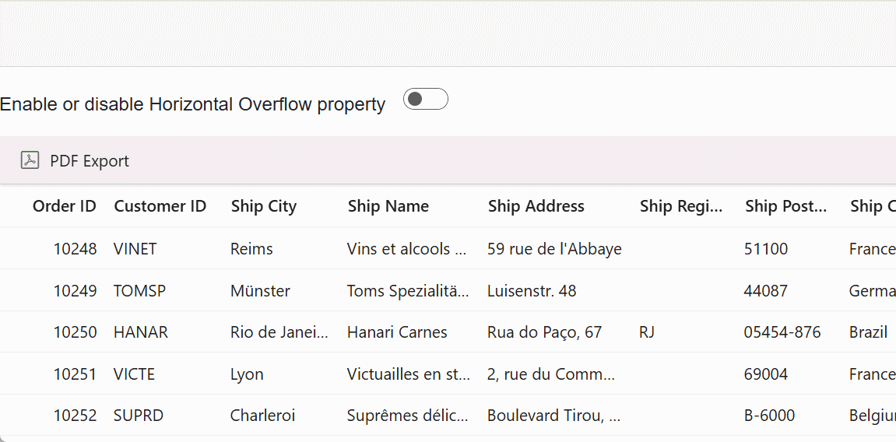
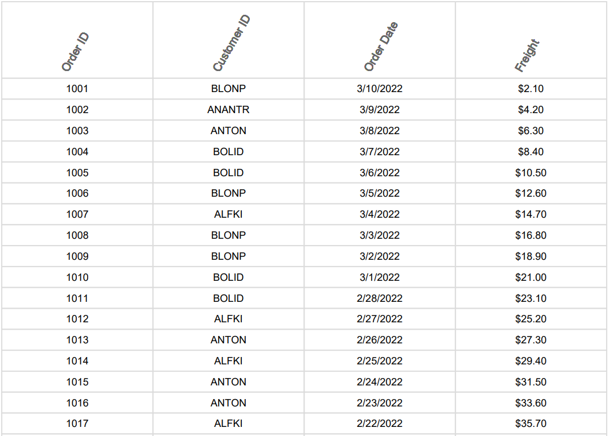

# PDF export options in Blazor DataGrid

The Syncfusion&reg; Blazor DataGrid supports extensive PDF export customization to control content and layout for reporting requirements. The export behavior is configured using the [PdfExportProperties](https://help.syncfusion.com/cr/blazor/Syncfusion.Blazor.Grids.PdfExportProperties.html) class. This configuration enables:

* Exporting current, selected, or filtered rows.
* Including or excluding hidden columns.
* Using a custom data source for export.
* Defining the output file name.
* Adjusting page settings such as orientation and size.

## Export current page records

Exporting the current page records from the Syncfusion&reg; Blazor DataGrid generates a PDF document that includes only the rows currently visible in the grid. This approach is useful for capturing a snapshot of the paginated view rather than exporting the entire dataset.

To configure this behavior:

1. Handle the [OnToolbarClick](https://help.syncfusion.com/cr/blazor/Syncfusion.Blazor.Grids.GridEvents-1.html#Syncfusion_Blazor_Grids_GridEvents_1_OnToolbarClick) event.
2. Invoke the [ExportToPdfAsync](https://help.syncfusion.com/cr/blazor/Syncfusion.Blazor.Grids.SfGrid-1.html#Syncfusion_Blazor_Grids_SfGrid_1_ExportToPdfAsync_Syncfusion_Blazor_Grids_PdfExportProperties_) method.
3. Set the [ExportType](https://help.syncfusion.com/cr/blazor/Syncfusion.Blazor.Grids.PdfExportProperties.html#Syncfusion_Blazor_Grids_PdfExportProperties_ExportType) property in the [PdfExportProperties](https://help.syncfusion.com/cr/blazor/Syncfusion.Blazor.Grids.PdfExportProperties.html) object.

The available options include:

* **CurrentPage**: Includes only the rows shown on the active grid page.
* **AllPages**: Includes all rows across all pages.



@using Syncfusion.Blazor.Grids
@using Syncfusion.Blazor.DropDowns

    <label style="padding-right: 10px;">Change export type:</label>
    <SfDropDownList TValue="string" TItem="DropDownOrder" @bind-Value="SelectedExportType" DataSource="@DropDownValue" Width="150px">
        <DropDownListFieldSettings Text="Text" Value="Value" />
    </SfDropDownList>

<SfGrid ID="Grid" @ref="Grid" DataSource="@Orders" AllowPaging="true" AllowPdfExport="true" Toolbar="@(new List<string>() { "PdfExport" })" Height="300">
    <GridEvents TValue="EmployeeData" OnToolbarClick="ToolbarClickHandler"></GridEvents>
    <GridPageSettings PageSize="8"></GridPageSettings>
    <GridColumns>
        <GridColumn Field=@nameof(EmployeeData.EmployeeID) HeaderText="Employee ID" TextAlign="TextAlign.Right" Width="120" IsPrimaryKey="true" />
        <GridColumn Field=@nameof(EmployeeData.FirstName) HeaderText="First Name" Width="150" />
        <GridColumn Field=@nameof(EmployeeData.LastName) HeaderText="Last Name" Width="150" />
        <GridColumn Field=@nameof(EmployeeData.City) HeaderText="City" Width="150" />
    </GridColumns>
</SfGrid>

@code {
    private SfGrid<EmployeeData> Grid;
    public List<EmployeeData> Orders { get; set; }
    private string SelectedExportType = "CurrentPage";
    List<DropDownOrder> DropDownValue = new List<DropDownOrder>
    {
        new DropDownOrder { Text = "CurrentPage", Value = "CurrentPage" },
        new DropDownOrder { Text = "AllPages", Value = "AllPages" },
    };

    protected override void OnInitialized()
    {
        Orders = EmployeeData.GetAllRecords();
    }

    public async Task ToolbarClickHandler(Syncfusion.Blazor.Navigations.ClickEventArgs args)
    {
        if (args.Item.Id == "Grid_pdfexport") // ID is a combination of the Grid ID and item name.
        {
            var exportProperties = new PdfExportProperties
                {
                    ExportType = SelectedExportType == "AllPages" ? ExportType.AllPages : ExportType.CurrentPage
                };
            await Grid.ExportToPdfAsync(exportProperties);
        }
    }

    public class DropDownOrder
    {
        public string Text { get; set; }
        public string Value { get; set; }
    }

}


public class EmployeeData
{
    public static List<EmployeeData> Employees = new List<EmployeeData>();

    public EmployeeData(int employeeID, string firstName, string lastName, string city)
    {
        this.EmployeeID = employeeID;
         this.FirstName = firstName;
         this.LastName = lastName;
         this.City = city;
    }

    public static List<EmployeeData> GetAllRecords()
    {
        if (Employees.Count == 0)
        {
            Employees.Add(new EmployeeData(1001, "Nancy", "Davolio", "Seattle"));
            Employees.Add(new EmployeeData(1002, "Andrew", "Fuller", "Tacoma"));
            Employees.Add(new EmployeeData(1003, "Janet", "Leverling", "Kirkland"));
            Employees.Add(new EmployeeData(1004, "Margaret", "Peacock", "Redmond"));
            Employees.Add(new EmployeeData(1005, "Steven", "Buchanan", "London"));
            Employees.Add(new EmployeeData(1006, "Michael", "Suyama", "London"));
            Employees.Add(new EmployeeData(1007, "Robert", "King", "London"));
            Employees.Add(new EmployeeData(1008, "Laura", "Callahan", "Seattle"));
            Employees.Add(new EmployeeData(1009, "Anne", "Dodsworth", "London"));
        }
        return Employees;
    }

     public int EmployeeID { get; set; }
     public string FirstName { get; set; }
     public string LastName { get; set; }
     public string City { get; set; }
}





## Export selected records

Exporting selected records from the Syncfusion&reg; Blazor DataGrid enables generating a PDF document that includes only specific rows. This approach supports focused exports based on selection.

To export selected records:

1. Handle the [OnToolbarClick](https://help.syncfusion.com/cr/blazor/Syncfusion.Blazor.Grids.GridEvents-1.html#Syncfusion_Blazor_Grids_GridEvents_1_OnToolbarClick) event.
2. Retrieve the selected records using [GetSelectedRecordsAsync](https://help.syncfusion.com/cr/blazor/Syncfusion.Blazor.Grids.SfGrid-1.html#Syncfusion_Blazor_Grids_SfGrid_1_GetSelectedRecordsAsync).
3. Assign the selected data to [PdfExportProperties.DataSource](https://help.syncfusion.com/cr/blazor/Syncfusion.Blazor.Grids.PdfExportProperties.html#Syncfusion_Blazor_Grids_PdfExportProperties_DataSource).
4. Invoke the [ExportToPdfAsync](https://help.syncfusion.com/cr/blazor/Syncfusion.Blazor.Grids.SfGrid-1.html#Syncfusion_Blazor_Grids_SfGrid_1_ExportToPdfAsync_Syncfusion_Blazor_Grids_PdfExportProperties_) method.



@using Syncfusion.Blazor.Grids

<SfGrid ID="Grid" @ref="Grid" DataSource="@Orders" AllowPaging="true" AllowPdfExport="true" Toolbar="@(new List<string>() { "PdfExport" })" Height="348">
    <GridEvents OnToolbarClick="ToolbarClickHandler" TValue="OrderData"></GridEvents>
    <GridSelectionSettings EnableSimpleMultiRowSelection="true" Type="SelectionType.Multiple"></GridSelectionSettings>
    <GridColumns>
        <GridColumn Field=@nameof(OrderData.OrderID) HeaderText="Order ID" TextAlign="TextAlign.Right" Width="120" IsPrimaryKey="true" />
        <GridColumn Field=@nameof(OrderData.CustomerID) HeaderText="Customer Name" Width="150" />
        <GridColumn Field=@nameof(OrderData.Freight) HeaderText="Freight" Format="C2" TextAlign="TextAlign.Right" Width="120" />
        <GridColumn Field=@nameof(OrderData.ShipCity) HeaderText="Ship City" Width="150" />
    </GridColumns>
</SfGrid>

@code {
    private SfGrid<OrderData> Grid;
    public List<OrderData> Orders { get; set; }

    protected override void OnInitialized()
    {
        Orders = OrderData.GetAllRecords();
    }

    public async Task ToolbarClickHandler(Syncfusion.Blazor.Navigations.ClickEventArgs args)
    {
        if (args.Item.Id == "Grid_pdfexport") // ID is a combination of the Grid ID and item name.
        {
            var selectedRecords = await Grid.GetSelectedRecordsAsync();
            PdfExportProperties exportProperties = new PdfExportProperties
                {
                    DataSource = selectedRecords
                };
            await this.Grid.ExportToPdfAsync(exportProperties);
        }
    }
}


public class OrderData
{
    public static List<OrderData> Orders = new List<OrderData>();

    public OrderData(int orderID, string customerID, double freight, string shipCity)
    {
        this.OrderID = orderID;
        this.CustomerID = customerID;
        this.Freight = freight;
        this.ShipCity = shipCity;
    }

    public static List<OrderData> GetAllRecords()
    {
        if (Orders.Count == 0)
        {
            Orders.Add(new OrderData(10248, "VINET", 32.38, "Reims"));
            Orders.Add(new OrderData(10249, "TOMSP", 11.61, "Münster"));
            Orders.Add(new OrderData(10250, "HANAR", 65.83, "Rio de Janeiro"));
            Orders.Add(new OrderData(10251, "VICTE", 41.34, "Lyon"));
            Orders.Add(new OrderData(10252, "SUPRD", 51.3, "Charleroi"));
            Orders.Add(new OrderData(10253, "HANAR", 58.17, "Rio de Janeiro"));
            Orders.Add(new OrderData(10254, "CHOPS", 22.98, "Bern"));
            Orders.Add(new OrderData(10255, "RICSU", 148.33, "Genève"));
            Orders.Add(new OrderData(10256, "WELLI", 13.97, "Resende"));
            Orders.Add(new OrderData(10257, "HILAA", 81.91, "San Cristóbal"));
            Orders.Add(new OrderData(10258, "ERNSH", 140.51, "Graz"));
            Orders.Add(new OrderData(10259, "CENTC", 3.25, "México D.F."));
            Orders.Add(new OrderData(10260, "OTTIK", 55.09, "Köln"));
            Orders.Add(new OrderData(10261, "QUEDE", 3.05, "Rio de Janeiro"));
            Orders.Add(new OrderData(10262, "RATTC", 48.29, "Albuquerque"));
        }

        return Orders;
    }

    public int OrderID { get; set; }
    public string CustomerID { get; set; }
    public double Freight { get; set; }
    public string ShipCity { get; set; }
}





## Export filtered records

Exporting filtered records from the Syncfusion&reg; Blazor DataGrid generates a PDF document that includes only rows matching the active filter criteria. This approach is useful for exporting refined data views.

To export filtered records:

1. Enable filtering by setting the [AllowFiltering](https://help.syncfusion.com/cr/blazor/Syncfusion.Blazor.Grids.SfGrid-1.html#Syncfusion_Blazor_Grids_SfGrid_1_AllowFiltering) property.
2. Retrieve the filtered records using [GetFilteredRecordsAsync](https://help.syncfusion.com/cr/blazor/Syncfusion.Blazor.Grids.SfGrid-1.html#Syncfusion_Blazor_Grids_SfGrid_1_GetFilteredRecordsAsync_System_Boolean_).
3. Assign the filtered data to [PdfExportProperties.DataSource](https://help.syncfusion.com/cr/blazor/Syncfusion.Blazor.Grids.PdfExportProperties.html#Syncfusion_Blazor_Grids_PdfExportProperties_DataSource).
4. Invoke the [ExportToPdfAsync](https://help.syncfusion.com/cr/blazor/Syncfusion.Blazor.Grids.SfGrid-1.html#Syncfusion_Blazor_Grids_SfGrid_1_ExportToPdfAsync_Syncfusion_Blazor_Grids_PdfExportProperties_) method.



@using Syncfusion.Blazor.Grids

<SfGrid ID="Grid" @ref="Grid" DataSource="@Orders" AllowFiltering="true" AllowPaging="true" AllowPdfExport="true" Toolbar="@(new List<string>() { "PdfExport" })" Height="348">
    <GridPageSettings PageSize="5" PageCount="5"></GridPageSettings>
    <GridEvents OnToolbarClick="ToolbarClickHandler" TValue="OrderData"></GridEvents>
    <GridColumns>
        <GridColumn Field=@nameof(OrderData.OrderID) HeaderText="Order ID" TextAlign="Syncfusion.Blazor.Grids.TextAlign.Right" Width="120" IsPrimaryKey="true" />
        <GridColumn Field=@nameof(OrderData.CustomerID) HeaderText="Customer Name" Width="150" />
        <GridColumn Field=@nameof(OrderData.Freight) HeaderText="Freight" Format="C2" TextAlign="Syncfusion.Blazor.Grids.TextAlign.Right" Width="120" />
        <GridColumn Field=@nameof(OrderData.ShipCity) HeaderText="Ship City" Width="150" />
    </GridColumns>
</SfGrid>

@code {
    private SfGrid<OrderData> Grid;
    public List<OrderData> Orders { get; set; }

    protected override void OnInitialized()
    {
        Orders = OrderData.GetAllRecords();
    }

    public async Task ToolbarClickHandler(Syncfusion.Blazor.Navigations.ClickEventArgs args)
    {
        if (args.Item.Id == "Grid_pdfexport") // ID is a combination of the Grid ID and item name.
        {
            var filteredRecords = (IEnumerable<OrderData>)await Grid.GetFilteredRecordsAsync();
            PdfExportProperties exportProperties = new PdfExportProperties
            {
                DataSource = filteredRecords
            };
            await this.Grid.ExportToPdfAsync(exportProperties);
        }
    }
}


public class OrderData
{
    public static List<OrderData> Orders = new List<OrderData>();

    public OrderData(int orderID, string customerID, double freight, string shipCity)
    {
        this.OrderID = orderID;
        this.CustomerID = customerID;
        this.Freight = freight;
        this.ShipCity = shipCity;
    }

    public static List<OrderData> GetAllRecords()
    {
        if (Orders.Count == 0)
        {
            Orders.Add(new OrderData(10248, "VINET", 32.38, "Reims"));
            Orders.Add(new OrderData(10249, "TOMSP", 11.61, "Münster"));
            Orders.Add(new OrderData(10250, "HANAR", 65.83, "Rio de Janeiro"));
            Orders.Add(new OrderData(10251, "VICTE", 41.34, "Lyon"));
            Orders.Add(new OrderData(10252, "SUPRD", 51.3, "Charleroi"));
            Orders.Add(new OrderData(10253, "HANAR", 58.17, "Rio de Janeiro"));
            Orders.Add(new OrderData(10254, "CHOPS", 22.98, "Bern"));
            Orders.Add(new OrderData(10255, "RICSU", 148.33, "Genève"));
            Orders.Add(new OrderData(10256, "WELLI", 13.97, "Resende"));
            Orders.Add(new OrderData(10257, "HILAA", 81.91, "San Cristóbal"));
            Orders.Add(new OrderData(10258, "ERNSH", 140.51, "Graz"));
            Orders.Add(new OrderData(10259, "CENTC", 3.25, "México D.F."));
            Orders.Add(new OrderData(10260, "OTTIK", 55.09, "Köln"));
            Orders.Add(new OrderData(10261, "QUEDE", 3.05, "Rio de Janeiro"));
            Orders.Add(new OrderData(10262, "RATTC", 48.29, "Albuquerque"));
        }
        return Orders;
    }

    public int OrderID { get; set; }
    public string CustomerID { get; set; }
    public double Freight { get; set; }
    public string ShipCity { get; set; }
}





## Export with hidden columns

Exporting hidden columns from the Syncfusion&reg; Blazor DataGrid allows including columns that are not visible in the UI but are required in the exported PDF document. This approach ensures complete data representation even when certain columns are hidden for display purposes.

To include hidden columns during export:

1. Handle the [OnToolbarClick](https://help.syncfusion.com/cr/blazor/Syncfusion.Blazor.Grids.GridEvents-1.html#Syncfusion_Blazor_Grids_GridEvents_1_OnToolbarClick) event.
2. Set the [IncludeHiddenColumn](https://help.syncfusion.com/cr/blazor/Syncfusion.Blazor.Grids.PdfExportPropertiesBase.html#Syncfusion_Blazor_Grids_PdfExportPropertiesBase_IncludeHiddenColumn) property to **true** in the [PdfExportProperties](https://help.syncfusion.com/cr/blazor/Syncfusion.Blazor.Grids.PdfExportProperties.html) object.
3. Invoke the [ExportToPdfAsync](https://help.syncfusion.com/cr/blazor/Syncfusion.Blazor.Grids.SfGrid-1.html#Syncfusion_Blazor_Grids_SfGrid_1_ExportToPdfAsync_Syncfusion_Blazor_Grids_PdfExportProperties_) method.

In this configuration, the **ShipCity** column is hidden in the Grid and included in the exported PDF file when` PdfExportProperties.IncludeHiddenColumn` is enabled.



@using Syncfusion.Blazor.Grids
@using Syncfusion.Blazor.Buttons

    <label style="font-weight: bold">Include or exclude hidden columns</label>
    <SfSwitch @bind-Checked="IncludeHiddenColumns"></SfSwitch>

<SfGrid ID="Grid" @ref="Grid" DataSource="@Orders" AllowPaging="true" AllowPdfExport="true" Toolbar="@(new List<string>() { "PdfExport" })" Height="348">
    <GridEvents OnToolbarClick="ToolbarClickHandler" TValue="OrderData"></GridEvents>
    <GridColumns>
        <GridColumn Field=@nameof(OrderData.OrderID) HeaderText="Order ID" TextAlign="TextAlign.Right" Width="120" IsPrimaryKey="true" />
        <GridColumn Field=@nameof(OrderData.CustomerID) HeaderText="Customer Name" Width="150" />
        <GridColumn Field=@nameof(OrderData.Freight) HeaderText="Freight" Format="C2" TextAlign="TextAlign.Right" Width="120" />
        <GridColumn Field=@nameof(OrderData.ShipCity) HeaderText="Ship City" Width="150" Visible="false" />
        <GridColumn Field=@nameof(OrderData.ShipCountry) HeaderText="Ship Country" Width="150" />
    </GridColumns>
</SfGrid>

@code {
    private SfGrid<OrderData> Grid;
    public List<OrderData> Orders { get; set; }

    public bool IncludeHiddenColumns { get; set; } = false;

    protected override void OnInitialized()
    {
        Orders = OrderData.GetAllRecords();
    }

    public async Task ToolbarClickHandler(Syncfusion.Blazor.Navigations.ClickEventArgs args)
    {
        if (args.Item.Id == "Grid_pdfexport") // ID is a combination of the Grid ID and item name.
        {
            PdfExportProperties exportProperties = new PdfExportProperties
                {
                    IncludeHiddenColumn = IncludeHiddenColumns
                };

            await Grid.ExportToPdfAsync(exportProperties);
        }
    }
}


public class OrderData
{
    public static List<OrderData> Orders = new List<OrderData>();

    public OrderData(int orderID, string customerID, double freight, string shipCity, string shipName, string shipCountry)
    {
        this.OrderID = orderID;
        this.CustomerID = customerID;
        this.Freight = freight;
        this.ShipCity = shipCity;
        this.ShipName = shipName;
        this.ShipCountry = shipCountry;
    }

    public static List<OrderData> GetAllRecords()
    {
        if (Orders.Count == 0)
        {
            Orders.Add(new OrderData(10248, "VINET", 32.38, "Reims", "Vins et alcools Chevalier", "France"));
            Orders.Add(new OrderData(10249, "TOMSP", 11.61, "Münster", "Toms Spezialitäten", "Germany"));
            Orders.Add(new OrderData(10250, "HANAR", 65.83, "Rio de Janeiro", "Hanari Carnes", "Brazil"));
            Orders.Add(new OrderData(10251, "VICTE", 41.34, "Lyon", "Victuailles en stock", "France"));
            Orders.Add(new OrderData(10252, "SUPRD", 51.3, "Charleroi", "Suprêmes délices", "Belgium"));
            Orders.Add(new OrderData(10253, "HANAR", 58.17, "Rio de Janeiro", "Hanari Carnes", "Brazil"));
            Orders.Add(new OrderData(10254, "CHOPS", 22.98, "Bern", "Chop-suey Chinese", "Switzerland"));
            Orders.Add(new OrderData(10255, "RICSU", 148.33, "Genève", "Richter Supermarkt", "Switzerland"));
            Orders.Add(new OrderData(10256, "WELLI", 13.97, "Resende", "Wellington Import Export", "Brazil"));
            Orders.Add(new OrderData(10257, "HILAA", 81.91, "San Cristóbal", "Hila Alimentos", "Venezuela"));
            Orders.Add(new OrderData(10258, "ERNSH", 140.51, "Graz", "Ernst Handel", "Austria"));
            Orders.Add(new OrderData(10259, "CENTC", 3.25, "México D.F.", "Centro comercial", "Mexico"));
            Orders.Add(new OrderData(10260, "OTTIK", 55.09, "Köln", "Ottilies Käseladen", "Germany"));
            Orders.Add(new OrderData(10261, "QUEDE", 3.05, "Rio de Janeiro", "Que delícia", "Brazil"));
            Orders.Add(new OrderData(10262, "RATTC", 48.29, "Albuquerque", "Rattlesnake Canyon Grocery", "USA"));
        }

        return Orders;
    }

    public int OrderID { get; set; }
    public string CustomerID { get; set; }
    public double Freight { get; set; }
    public string ShipCity { get; set; }
    public string ShipName { get; set; }
    public string ShipCountry { get; set; }
}





## Show or hide columns while exporting

The Syncfusion&reg; Blazor DataGrid allows dynamically **showing** or **hiding** columns during PDF export based on specific requirements. This approach is useful when certain columns should appear only in the exported document.

To show or hide columns during export:

1. Handle the [OnToolbarClick](https://help.syncfusion.com/cr/blazor/Syncfusion.Blazor.Grids.GridEvents-1.html#Syncfusion_Blazor_Grids_GridEvents_1_OnToolbarClick) event.
2. Update the [Visible](https://help.syncfusion.com/cr/blazor/Syncfusion.Blazor.Grids.GridColumn.html#Syncfusion_Blazor_Grids_GridColumn_Visible) property of the required columns before calling the export method.
3. Invoke the [ExportToPdfAsync](https://help.syncfusion.com/cr/blazor/Syncfusion.Blazor.Grids.SfGrid-1.html#Syncfusion_Blazor_Grids_SfGrid_1_ExportToPdfAsync_Syncfusion_Blazor_Grids_PdfExportProperties_) method.
4. Restore the original column visibility in the [ExportComplete](https://help.syncfusion.com/cr/blazor/Syncfusion.Blazor.Grids.GridEvents-1.html#Syncfusion_Blazor_Grids_GridEvents_1_ExportComplete) event.

In this configuration, the **CustomerID** column is displayed only during the PDF export, while the **ShipCity** column is hidden. After the export completes, the original visibility settings are restored using the `ExportComplete` event.



@using Syncfusion.Blazor.Grids

<SfGrid ID="Grid" @ref="Grid" DataSource="@Orders"  AllowPdfExport="true"
Toolbar="@(new List<string>() { "PdfExport" })" Height="348">
    <GridEvents OnToolbarClick="ToolbarClickHandler" ExportComplete="ExportCompleteHandler" TValue="OrderData"></GridEvents>
    <GridColumns>
        <GridColumn Field=@nameof(OrderData.OrderID) HeaderText="Order ID" TextAlign="TextAlign.Right" Width="120" IsPrimaryKey="true" />
        <GridColumn Field=@nameof(OrderData.CustomerID) HeaderText="Customer Name" Visible="@isCustomerIDVisible" Width="150" />
        <GridColumn Field=@nameof(OrderData.Freight) HeaderText="Freight" Format="C2" TextAlign="TextAlign.Right" Width="120" />
        <GridColumn Field=@nameof(OrderData.ShipCity) HeaderText="Ship City" Visible="@isShipCityVisible" Width="150" />
        <GridColumn Field=@nameof(OrderData.ShipCountry) HeaderText="Ship Country" Width="150" />
    </GridColumns>
</SfGrid>

@code {
    private SfGrid<OrderData> Grid;
    public List<OrderData> Orders { get; set; }
    public bool isCustomerIDVisible { get; set; } = false;
    public bool isShipCityVisible { get; set; } = true;

    protected override void OnInitialized()
    {
        Orders = OrderData.GetAllRecords();
    }

    public async Task ToolbarClickHandler(Syncfusion.Blazor.Navigations.ClickEventArgs args)
    {
        if (args.Item.Id == "Grid_pdfexport") //Id is combination of Grid's ID and itemname.
        {
            isCustomerIDVisible = true;
            isShipCityVisible=false;
            await Grid.ExportToPdfAsync();
        }
    }

    public void ExportCompleteHandler(object args)
    {
        isCustomerIDVisible = false;
        isShipCityVisible=true;
    }
}


public class OrderData
{
    public static List<OrderData> Orders = new List<OrderData>();

    public OrderData(int orderID, string customerID, double freight, string shipCity, string shipName, string shipCountry)
    {
        this.OrderID = orderID;
        this.CustomerID = customerID;
        this.Freight = freight;
        this.ShipCity = shipCity;
        this.ShipName = shipName;
        this.ShipCountry = shipCountry;
    }

    public static List<OrderData> GetAllRecords()
    {
        if (Orders.Count == 0)
        {
            Orders.Add(new OrderData(10248, "VINET", 32.38, "Reims", "Vins et alcools Chevalier", "France"));
            Orders.Add(new OrderData(10249, "TOMSP", 11.61, "Münster", "Toms Spezialitäten", "Germany"));
            Orders.Add(new OrderData(10250, "HANAR", 65.83, "Rio de Janeiro", "Hanari Carnes", "Brazil"));
            Orders.Add(new OrderData(10251, "VICTE", 41.34, "Lyon", "Victuailles en stock", "France"));
            Orders.Add(new OrderData(10252, "SUPRD", 51.3, "Charleroi", "Suprêmes délices", "Belgium"));
            Orders.Add(new OrderData(10253, "HANAR", 58.17, "Rio de Janeiro", "Hanari Carnes", "Brazil"));
            Orders.Add(new OrderData(10254, "CHOPS", 22.98, "Bern", "Chop-suey Chinese", "Switzerland"));
            Orders.Add(new OrderData(10255, "RICSU", 148.33, "Genève", "Richter Supermarkt", "Switzerland"));
            Orders.Add(new OrderData(10256, "WELLI", 13.97, "Resende", "Wellington Import Export", "Brazil"));
            Orders.Add(new OrderData(10257, "HILAA", 81.91, "San Cristóbal", "Hila Alimentos", "Venezuela"));
            Orders.Add(new OrderData(10258, "ERNSH", 140.51, "Graz", "Ernst Handel", "Austria"));
            Orders.Add(new OrderData(10259, "CENTC", 3.25, "México D.F.", "Centro comercial", "Mexico"));
            Orders.Add(new OrderData(10260, "OTTIK", 55.09, "Köln", "Ottilies Käseladen", "Germany"));
            Orders.Add(new OrderData(10261, "QUEDE", 3.05, "Rio de Janeiro", "Que delícia", "Brazil"));
            Orders.Add(new OrderData(10262, "RATTC", 48.29, "Albuquerque", "Rattlesnake Canyon Grocery", "USA"));
        }

        return Orders;
    }

    public int OrderID { get; set; }
    public string CustomerID { get; set; }
    public double Freight { get; set; }
    public string ShipCity { get; set; }
    public string ShipName { get; set; }
    public string ShipCountry { get; set; }
}





## Change page orientation

The Syncfusion&reg; Blazor DataGrid supports changing the PDF [page orientation](https://help.syncfusion.com/cr/blazor/Syncfusion.Blazor.Grids.PageOrientation.html) to fit different layouts. This feature is useful for exporting wide datasets that require more horizontal space.

**Supported options for PageOrientation**:

* **Portrait** – Sets the PDF page orientation to portrait. This is the default layout and is suitable for grids with fewer columns.
* **Landscape** – Sets the PDF page orientation to landscape. This option is ideal for wide grids with multiple columns.

To change the page orientation:

1. Handle the [OnToolbarClick](https://help.syncfusion.com/cr/blazor/Syncfusion.Blazor.Grids.GridEvents-1.html#Syncfusion_Blazor_Grids_GridEvents_1_OnToolbarClick) event.
2. Set the [PageOrientation](https://help.syncfusion.com/cr/blazor/Syncfusion.Blazor.Grids.PdfExportPropertiesBase.html#Syncfusion_Blazor_Grids_PdfExportPropertiesBase_PageOrientation) property in the [PdfExportProperties](https://help.syncfusion.com/cr/blazor/Syncfusion.Blazor.Grids.PdfExportProperties.html) object to `PageOrientation.Landscape` or `PageOrientation.Portrait`.
3. Invoke the [ExportToPdfAsync](https://help.syncfusion.com/cr/blazor/Syncfusion.Blazor.Grids.SfGrid-1.html#Syncfusion_Blazor_Grids_SfGrid_1_ExportToPdfAsync_Syncfusion_Blazor_Grids_PdfExportProperties_) method.



@using Syncfusion.Blazor.Grids
@using Syncfusion.Blazor.DropDowns
@using Syncfusion.Blazor.Navigations
@using System.Collections.Generic

    <label style="padding: 10px 10px 26px 0">Change the page orientation property:</label>
    <SfDropDownList TValue="string" TItem="OrientationItem" @bind-Value="SelectedOrientation" DataSource="@Orientations" Placeholder="Select Orientation" PopupHeight="150px" Width="120px">
        <DropDownListFieldSettings Text="Text" Value="Value"></DropDownListFieldSettings>
    </SfDropDownList>

<SfGrid ID="Grid" @ref="Grid" DataSource="@Data" AllowPaging="true" AllowPdfExport="true" Toolbar="@(new List<string>() { "PdfExport" })" Height="272">
    <GridEvents TValue="OrderData" OnToolbarClick="ToolbarClickHandler"></GridEvents>
    <GridColumns>
        <GridColumn Field="OrderID" HeaderText="Order ID" Width="90" TextAlign="TextAlign.Right" />
        <GridColumn Field="CustomerID" HeaderText="Customer ID" Width="100" />
        <GridColumn Field="ShipCity" HeaderText="Ship City" Width="120" />
        <GridColumn Field="ShipName" HeaderText="Ship Name" Width="100" />
    </GridColumns>
</SfGrid>

@code {
    private SfGrid<OrderData> Grid;
    public List<OrderData> Data { get; set; }

    public class OrientationItem
    {
        public string Text { get; set; }
        public string Value { get; set; }
    }

    public string SelectedOrientation { get; set; } = "Portrait";

    public List<OrientationItem> Orientations = new List<OrientationItem>
    {
        new OrientationItem { Text = "Portrait", Value = "Portrait" },
        new OrientationItem { Text = "Landscape", Value = "Landscape" }
    };

    protected override void OnInitialized()
    {
        Data = OrderData.GetAllRecords(); 
    }

    public async Task ToolbarClickHandler(Syncfusion.Blazor.Navigations.ClickEventArgs args)
    {
        if (args.Item.Id.Contains("pdfexport", StringComparison.OrdinalIgnoreCase))
        {
            var exportProps = new PdfExportProperties
            {
                PageOrientation = SelectedOrientation == "Landscape" ? PageOrientation.Landscape : PageOrientation.Portrait
            };
            await Grid.ExportToPdfAsync(exportProps);
        }
    }
}


public class OrderData
{
    public static List<OrderData> Orders = new List<OrderData>();

    public OrderData(int orderID, string customerID, double freight, string shipCity, string shipName, string shipCountry)
    {
        this.OrderID = orderID;
        this.CustomerID = customerID;
        this.Freight = freight;
        this.ShipCity = shipCity;
        this.ShipName = shipName;
        this.ShipCountry = shipCountry;
    }

    public static List<OrderData> GetAllRecords()
    {
        if (Orders.Count == 0)
        {
            Orders.Add(new OrderData(10248, "VINET", 32.38, "Reims", "Vins et alcools Chevalier", "France"));
            Orders.Add(new OrderData(10249, "TOMSP", 11.61, "Münster", "Toms Spezialitäten", "Germany"));
            Orders.Add(new OrderData(10250, "HANAR", 65.83, "Rio de Janeiro", "Hanari Carnes", "Brazil"));
            Orders.Add(new OrderData(10251, "VICTE", 41.34, "Lyon", "Victuailles en stock", "France"));
            Orders.Add(new OrderData(10252, "SUPRD", 51.3, "Charleroi", "Suprêmes délices", "Belgium"));
            Orders.Add(new OrderData(10253, "HANAR", 58.17, "Rio de Janeiro", "Hanari Carnes", "Brazil"));
            Orders.Add(new OrderData(10254, "CHOPS", 22.98, "Bern", "Chop-suey Chinese", "Switzerland"));
            Orders.Add(new OrderData(10255, "RICSU", 148.33, "Genève", "Richter Supermarkt", "Switzerland"));
            Orders.Add(new OrderData(10256, "WELLI", 13.97, "Resende", "Wellington Import Export", "Brazil"));
            Orders.Add(new OrderData(10257, "HILAA", 81.91, "San Cristóbal", "Hila Alimentos", "Venezuela"));
            Orders.Add(new OrderData(10258, "ERNSH", 140.51, "Graz", "Ernst Handel", "Austria"));
            Orders.Add(new OrderData(10259, "CENTC", 3.25, "México D.F.", "Centro comercial", "Mexico"));
            Orders.Add(new OrderData(10260, "OTTIK", 55.09, "Köln", "Ottilies Käseladen", "Germany"));
            Orders.Add(new OrderData(10261, "QUEDE", 3.05, "Rio de Janeiro", "Que delícia", "Brazil"));
            Orders.Add(new OrderData(10262, "RATTC", 48.29, "Albuquerque", "Rattlesnake Canyon Grocery", "USA"));
        }
        return Orders;
    }

    public int OrderID { get; set; }
    public string CustomerID { get; set; }
    public double Freight { get; set; }
    public string ShipCity { get; set; }
    public string ShipName { get; set; }
    public string ShipCountry { get; set; }
}





## Change page size

The Syncfusion&reg; Blazor DataGrid allows customizing the page size of the exported PDF document to fit different paper formats or printing requirements.

**Supported options for PdfPageSize**:

* A0
* A1
* A2
* A3
* A4
* A5
* A6
* A7
* A8
* A9
* Archa
* Archb
* Archc
* Archd
* Arche
* B0
* B1
* B2
* B3
* B4
* B5
* Flsa
* HalfLetter
* Ledger
* Legal
* Letter
* Letter11x17
* Note

To configure page size:

1. Handle the [OnToolbarClick](https://help.syncfusion.com/cr/blazor/Syncfusion.Blazor.Grids.GridEvents-1.html#Syncfusion_Blazor_Grids_GridEvents_1_OnToolbarClick) event.
2. Set the [PageSize](https://help.syncfusion.com/cr/blazor/Syncfusion.Blazor.Grids.PdfExportPropertiesBase.html#Syncfusion_Blazor_Grids_PdfExportPropertiesBase_PageSize) property in the [PdfExportProperties](https://help.syncfusion.com/cr/blazor/Syncfusion.Blazor.Grids.PdfExportProperties.html) object to a value from the [PdfPageSize](https://help.syncfusion.com/cr/blazor/Syncfusion.Blazor.Grids.PdfPageSize.html#fields) enumeration.
3. Invoke the [ExportToPdfAsync](https://help.syncfusion.com/cr/blazor/Syncfusion.Blazor.Grids.SfGrid-1.html#Syncfusion_Blazor_Grids_SfGrid_1_ExportToPdfAsync_Syncfusion_Blazor_Grids_PdfExportProperties_) method.



@using Syncfusion.Blazor.Grids
@using Syncfusion.Blazor.DropDowns
@using Syncfusion.Blazor.Navigations
@using Syncfusion.Blazor

    <label style="padding-right: 10px;">Change the page size:</label>
    <SfDropDownList TValue="string" TItem="PageSizeOption" @bind-Value="SelectedPageSize" DataSource="@PageSizes" Width="150px">
        <DropDownListFieldSettings Text="Text" Value="Value" />
    </SfDropDownList>

<SfGrid @ref="Grid" ID="Grid" DataSource="@Orders" AllowPaging="true" AllowPdfExport="true" Toolbar="@(new List<string>() { "PdfExport" })" Height="300">
    <GridEvents OnToolbarClick="ToolbarClickHandler" TValue="OrderData"></GridEvents>
    <GridColumns>
        <GridColumn Field="OrderID" HeaderText="Order ID" Width="90" TextAlign="TextAlign.Right" />
        <GridColumn Field="CustomerID" HeaderText="Customer ID" Width="100" />
        <GridColumn Field="ShipCity" HeaderText="Ship City" Width="100" />
        <GridColumn Field="ShipName" HeaderText="Ship Name" Width="120" />
    </GridColumns>
</SfGrid>

@code {
    private SfGrid<OrderData> Grid;
    public List<OrderData> Orders { get; set; }

    private string SelectedPageSize = "A4";

    public List<PageSizeOption> PageSizes = new()
    {
        new PageSizeOption { Text = "Letter", Value = "Letter" },
        new PageSizeOption { Text = "Note", Value = "Note" },
        new PageSizeOption { Text = "Legal", Value = "Legal" },
        new PageSizeOption { Text = "A0", Value = "A0" },
        new PageSizeOption { Text = "A1", Value = "A1" },
        new PageSizeOption { Text = "A2", Value = "A2" },
        new PageSizeOption { Text = "A3", Value = "A3" },
        new PageSizeOption { Text = "A4", Value = "A4" },
        new PageSizeOption { Text = "A5", Value = "A5" },
        new PageSizeOption { Text = "A6", Value = "A6" },
        new PageSizeOption { Text = "B4", Value = "B4" },
        new PageSizeOption { Text = "B5", Value = "B5" },
        new PageSizeOption { Text = "Flsa", Value = "Flsa" },
        new PageSizeOption { Text = "HalfLetter", Value = "HalfLetter" },
        new PageSizeOption { Text = "Ledger", Value = "Ledger" },
        new PageSizeOption { Text = "Letter11x17", Value = "Letter11x17" },
        new PageSizeOption { Text = "ArchC", Value = "ArchC" },
        new PageSizeOption { Text = "ArchD", Value = "ArchD" },
        new PageSizeOption { Text = "ArchE", Value = "ArchE" },
    };

    protected override void OnInitialized()
    {
        Orders = OrderData.GetAllRecords();
    }

    public async Task ToolbarClickHandler(Syncfusion.Blazor.Navigations.ClickEventArgs args)
    {
        if (args.Item.Id == "Grid_pdfexport") //Id is combination of Grid's ID and itemname.
        {
            var exportProps = new PdfExportProperties
            {
                PageSize = Enum.TryParse<PdfPageSize>(SelectedPageSize, out var size) ? size : PdfPageSize.A4
            };
            await Grid.ExportToPdfAsync(exportProps);
        }
    }

    public class PageSizeOption
    {
        public string Text { get; set; }
        public string Value { get; set; }
    }  
}



public class OrderData
{
    public static List<OrderData> Orders = new List<OrderData>();

    public OrderData(int orderID, string customerID, double freight, string shipCity, string shipName)
    {
        this.OrderID = orderID;
        this.CustomerID = customerID;
        this.Freight = freight;
        this.ShipCity = shipCity;
        this.ShipName = shipName;
    }

    public static List<OrderData> GetAllRecords()
    {
        if (Orders.Count == 0)
        {
            Orders.Add(new OrderData(10248, "VINET", 32.38, "Reims", "Vins et alcools Chevalier"));
            Orders.Add(new OrderData(10249, "TOMSP", 11.61, "Münster", "Toms Spezialitäten"));
            Orders.Add(new OrderData(10250, "HANAR", 65.83, "Rio de Janeiro", "Hanari Carnes"));
            Orders.Add(new OrderData(10251, "VICTE", 41.34, "Lyon", "Victuailles en stock"));
            Orders.Add(new OrderData(10252, "SUPRD", 51.3, "Charleroi", "Suprêmes délices"));
            Orders.Add(new OrderData(10253, "HANAR", 58.17, "Rio de Janeiro", "Hanari Carnes"));
            Orders.Add(new OrderData(10254, "CHOPS", 22.98, "Bern", "Chop-suey Chinese"));
            Orders.Add(new OrderData(10255, "RICSU", 148.33, "Genève", "Richter Supermarkt"));
            Orders.Add(new OrderData(10256, "WELLI", 13.97, "Resende", "Wellington Import Export"));
            Orders.Add(new OrderData(10257, "HILAA", 81.91, "San Cristóbal", "Hila Alimentos"));
            Orders.Add(new OrderData(10258, "ERNSH", 140.51, "Graz", "Ernst Handel"));
            Orders.Add(new OrderData(10259, "CENTC", 3.25, "México D.F.", "Centro comercial"));
            Orders.Add(new OrderData(10260, "OTTIK", 55.09, "Köln", "Ottilies Käseladen"));
            Orders.Add(new OrderData(10261, "QUEDE", 3.05, "Rio de Janeiro", "Que delícia"));
            Orders.Add(new OrderData(10262, "RATTC", 48.29, "Albuquerque", "Rattlesnake Canyon Grocery"));
        }
        return Orders;
    }

    public int OrderID { get; set; }
    public string CustomerID { get; set; }
    public double Freight { get; set; }
    public string ShipCity { get; set; }
    public string ShipName { get; set; }
}





## Define file name

The Syncfusion&reg; Blazor DataGrid allows specifying a custom file name for the exported PDF document. This feature is useful for generating reports with meaningful names.

To configure a custom file name:

1. Handle the OnToolbarClick event.
2. Set the [FileName](https://help.syncfusion.com/cr/blazor/Syncfusion.Blazor.Grids.PdfExportPropertiesBase.html#Syncfusion_Blazor_Grids_PdfExportPropertiesBase_FileName) property in the [PdfExportProperties](https://help.syncfusion.com/cr/blazor/Syncfusion.Blazor.Grids.PdfExportProperties.html) object to the desired name (e.g., **Report.pdf**).
3. Invoke the [ExportToPdfAsync](https://help.syncfusion.com/cr/blazor/Syncfusion.Blazor.Grids.SfGrid-1.html#Syncfusion_Blazor_Grids_SfGrid_1_ExportToPdfAsync_Syncfusion_Blazor_Grids_PdfExportProperties_) method.



@using Syncfusion.Blazor.Grids

<SfGrid ID="Grid" @ref="DefaultGrid" DataSource="@Orders" Height="315" Toolbar="@(new List<string>() { "PdfExport" })" AllowPdfExport="true">
    <GridEvents OnToolbarClick="ToolbarClickHandler" TValue="OrderDetails"></GridEvents>
    <GridColumns>
        <GridColumn Field=@nameof(OrderDetails.OrderID) HeaderText="Order ID" TextAlign="TextAlign.Right" Width="120"></GridColumn>
        <GridColumn Field=@nameof(OrderDetails.CustomerID) HeaderText="Customer ID" Width="150"></GridColumn>
        <GridColumn Field=@nameof(OrderDetails.ShipCity) HeaderText="Ship City" Width="150"></GridColumn>
        <GridColumn Field=@nameof(OrderDetails.ShipName) HeaderText="Ship Name" Width="150"></GridColumn>
    </GridColumns>
</SfGrid>

@code {
    private SfGrid<OrderDetails> DefaultGrid;
    public List<OrderDetails> Orders { get; set; }

    public async Task ToolbarClickHandler(Syncfusion.Blazor.Navigations.ClickEventArgs args)
    {
        if (args.Item.Id == "Grid_pdfexport")  // ID is a combination of the Grid ID and item name.
        {
            var exportProps = new PdfExportProperties
            {
                FileName = "New.pdf"
            };
            await DefaultGrid.ExportToPdfAsync(exportProps);
        }
    }
    protected override void OnInitialized()
    {
        Orders = OrderDetails.GetAllRecords();
    }
}



public class OrderDetails
{
    public static List<OrderDetails> order = new List<OrderDetails>();
    public OrderDetails(int OrderID, string CustomerId, string ShipCity, string ShipName)
    {
        this.OrderID = OrderID;
        this.CustomerID = CustomerId;
        this.ShipCity = ShipCity;
        this.ShipName = ShipName;
    }
    public static List<OrderDetails> GetAllRecords()
    {
        if (order.Count == 0)
        {
            order.Add(new OrderDetails(10248, "VINET", "Reims", "Vins et alcools Chevalier"));
            order.Add(new OrderDetails(10249, "TOMSP", "Münster", "Toms Spezialitäten"));
            order.Add(new OrderDetails(10250, "HANAR", "Rio de Janeiro", "Hanari Carnes"));
            order.Add(new OrderDetails(10251, "VICTE", "Lyon", "Victuailles en stock"));
            order.Add(new OrderDetails(10252, "SUPRD", "Charleroi", "Suprêmes délices"));
            order.Add(new OrderDetails(10253, "HANAR", "Rio de Janeiro", "Hanari Carnes"));
            order.Add(new OrderDetails(10254, "CHOPS", "Bern", "Chop-suey Chinese"));
            order.Add(new OrderDetails(10255, "RICSU", "Genève", "Richter Supermarkt"));
            order.Add(new OrderDetails(10256, "WELLI", "Resende", "Wellington Importadora"));
            order.Add(new OrderDetails(10257, "HILAA", "San Cristóbal", "HILARION-Abastos"));
            order.Add(new OrderDetails(10258, "ERNSH", "Graz", "Ernst Handel"));
            order.Add(new OrderDetails(10259, "CENTC", "México D.F.", "Centro comercial Moctezuma"));
            order.Add(new OrderDetails(10260, "OTTIK", "Köln", "Ottilies Käseladen"));
            order.Add(new OrderDetails(10261, "QUEDE", "Rio de Janeiro", "Que Delícia"));
            order.Add(new OrderDetails(10262, "RATTC", "Albuquerque", "Rattlesnake Canyon Grocery"));
        }
        return order;
    }
    public int OrderID { get; set; }
    public string CustomerID { get; set; }
    public string ShipCity { get; set; }
    public string ShipName { get; set; }
}





## Enabling horizontal overflow

The Syncfusion&reg; Blazor DataGrid supports enabling horizontal overflow during PDF export to display all columns on a single page, even when the number of columns exceeds the default width. This feature is useful for exporting wide grids without column wrapping.

To configure horizontal overflow:

1. Handle the [OnToolbarClick](https://help.syncfusion.com/cr/blazor/Syncfusion.Blazor.Grids.GridEvents-1.html#Syncfusion_Blazor_Grids_GridEvents_1_OnToolbarClick) event.
2. Set the [AllowHorizontalOverflow](https://help.syncfusion.com/cr/blazor/Syncfusion.Blazor.Grids.PdfExportProperties.html#Syncfusion_Blazor_Grids_PdfExportProperties_AllowHorizontalOverflow) property in the [PdfExportProperties](https://help.syncfusion.com/cr/blazor/Syncfusion.Blazor.Grids.PdfExportProperties.html) object to true.
3. Invoke the [ExportToPdfAsync](https://help.syncfusion.com/cr/blazor/Syncfusion.Blazor.Grids.SfGrid-1.html#Syncfusion_Blazor_Grids_SfGrid_1_ExportToPdfAsync_Syncfusion_Blazor_Grids_PdfExportProperties_) method.



@using Syncfusion.Blazor.Grids
@using Syncfusion.Blazor.Navigations
@using Syncfusion.Blazor.Buttons

    <label style="padding-right: 10px;">Enable or disable Horizontal Overflow property</label>
    <SfSwitch @bind-Checked="DisableHorizontalOverflow" />

<SfGrid ID="Grid" @ref="Grid" DataSource="@Orders" AllowPaging="true" AllowPdfExport="true" Toolbar="@(new List<string>() { "PdfExport" })" Height="348">
    <GridEvents OnToolbarClick="ToolbarClickHandler" TValue="OrderData"></GridEvents>
    <GridColumns>
        <GridColumn Field="OrderID" HeaderText="Order ID" Width="90" TextAlign="TextAlign.Right" />
        <GridColumn Field="CustomerID" HeaderText="Customer ID" Width="100" />
        <GridColumn Field="ShipCity" HeaderText="Ship City" Width="100" />
        <GridColumn Field="ShipName" HeaderText="Ship Name" Width="120" />
        <GridColumn Field="ShipAddress" HeaderText="Ship Address" Width="130" />
        <GridColumn Field="ShipRegion" HeaderText="Ship Region" Width="90" />
        <GridColumn Field="ShipPostalCode" HeaderText="Ship Postal Code" Width="90" />
        <GridColumn Field="ShipCountry" HeaderText="Ship Country" Width="100" />
    </GridColumns>
</SfGrid>

@code {
    private SfGrid<OrderData> Grid;
    private bool DisableHorizontalOverflow = false;

    public List<OrderData> Orders { get; set; }

    protected override void OnInitialized()
    {
        Orders = OrderData.GetAllRecords();
    }
    public async Task ToolbarClickHandler(Syncfusion.Blazor.Navigations.ClickEventArgs args)
    {
        if (args.Item.Id == "Grid_pdfexport") // ID is a combination of the Grid ID and item name.
        {
            var pdfExportProps = new PdfExportProperties
            {
                AllowHorizontalOverflow = !DisableHorizontalOverflow
            };
            await Grid.ExportToPdfAsync(pdfExportProps);
        }
    }
}



public class OrderData
{
    public static List<OrderData> Orders = new();

    public OrderData(int orderID, string customerID, string shipCity, string shipName, string shipAddress, string shipRegion, string shipPostalCode, string shipCountry)
    {
        OrderID = orderID;
        CustomerID = customerID;
        ShipCity = shipCity;
        ShipName = shipName;
        ShipAddress = shipAddress;
        ShipRegion = shipRegion;
        ShipPostalCode = shipPostalCode;
        ShipCountry = shipCountry;
    }

    public static List<OrderData> GetAllRecords()
    {
        if (Orders.Count == 0)
        {
            Orders.Add(new OrderData(10248, "VINET", "Reims", "Vins et alcools Chevalier", "59 rue de l'Abbaye", "", "51100", "France"));
            Orders.Add(new OrderData(10249, "TOMSP", "Münster", "Toms Spezialitäten", "Luisenstr. 48", "", "44087", "Germany"));
            Orders.Add(new OrderData(10250, "HANAR", "Rio de Janeiro", "Hanari Carnes", "Rua do Paço, 67", "RJ", "05454-876", "Brazil"));
            Orders.Add(new OrderData(10251, "VICTE", "Lyon", "Victuailles en stock", "2, rue du Commerce", "", "69004", "France"));
            Orders.Add(new OrderData(10252, "SUPRD", "Charleroi", "Suprêmes délices", "Boulevard Tirou, 255", "", "B-6000", "Belgium"));
            Orders.Add(new OrderData(10253, "HANAR", "Rio de Janeiro", "Hanari Carnes", "Rua do Paço, 67", "RJ", "05454-876", "Brazil"));
            Orders.Add(new OrderData(10254, "CHOPS", "Bern", "Chop-suey Chinese", "Hauptstr. 31", "", "3012", "Switzerland"));
            Orders.Add(new OrderData(10255, "RICSU", "Genève", "Richter Supermarkt", "Starenweg 5", "", "1204", "Switzerland"));
            Orders.Add(new OrderData(10256, "WELLI", "Resende", "Wellington Importadora", "Rua do Mercado, 12", "SP", "08737-363", "Brazil"));
            Orders.Add(new OrderData(10257, "HILAA", "San Cristóbal", "HILARION-Abastos", "Carrera 22 con Ave. Carlos Soublette #8-35", "Táchira", "5022", "Venezuela"));
        }

        return Orders;
    }

    public int OrderID { get; set; }
    public string CustomerID { get; set; } = string.Empty;
    public string ShipCity { get; set; } = string.Empty;
    public string ShipName { get; set; } = string.Empty;
    public string ShipAddress { get; set; } = string.Empty;
    public string ShipRegion { get; set; } = string.Empty;
    public string ShipPostalCode { get; set; } = string.Empty;
    public string ShipCountry { get; set; } = string.Empty;
}



> Find a complete sample on [GitHub](https://github.com/SyncfusionExamples/exporting-blazor-datagrid/tree/master/Exporting-PDF-Datagrid/Horizontal_overflow).

## Customizing columns on export

The Syncfusion&reg; Blazor DataGrid allows customizing which columns appear in the exported PDF file. This helps adjust column headers, alignment, and formatting based on export requirements.

To customize columns during PDF export:

1. Handle the [OnToolbarClick](https://help.syncfusion.com/cr/blazor/Syncfusion.Blazor.Grids.GridEvents-1.html#Syncfusion_Blazor_Grids_GridEvents_1_OnToolbarClick) event.
2. Create a list of [GridColumn](https://help.syncfusion.com/cr/blazor/Syncfusion.Blazor.Grids.GridColumn.html#) objects with the required [Field](https://help.syncfusion.com/cr/blazor/Syncfusion.Blazor.Grids.GridColumn.html#Syncfusion_Blazor_Grids_GridColumn_Field), [HeaderText](https://help.syncfusion.com/cr/blazor/Syncfusion.Blazor.Grids.GridColumn.html#Syncfusion_Blazor_Grids_GridColumn_HeaderText), and [TextAlign](https://help.syncfusion.com/cr/blazor/Syncfusion.Blazor.Grids.GridColumn.html#Syncfusion_Blazor_Grids_GridColumn_TextAlign) values.
3. Assign the list to the [PdfExportProperties.Columns](https://help.syncfusion.com/cr/blazor/Syncfusion.Blazor.Grids.PdfExportProperties.html#Syncfusion_Blazor_Grids_PdfExportProperties_Columns) property and pass it to the [ExportToPdfAsync](https://help.syncfusion.com/cr/blazor/Syncfusion.Blazor.Grids.SfGrid-1.html#Syncfusion_Blazor_Grids_SfGrid_1_ExportToPdfAsync_Syncfusion_Blazor_Grids_PdfExportProperties_) method to apply the column customizations during export.




@using Syncfusion.Blazor.Grids

<SfGrid ID="Grid" @ref="Grid" DataSource="@Orders" AllowPdfExport="true" Toolbar="@(new List<string>() { "PdfExport" })" Height="348">
    <GridEvents OnToolbarClick="ToolbarClickHandler" TValue="OrderData"></GridEvents>
    <GridColumns>
        <GridColumn Field=@nameof(OrderData.OrderID) HeaderText="Order ID" TextAlign="TextAlign.Right" IsPrimaryKey="true" />
        <GridColumn Field=@nameof(OrderData.CustomerID) HeaderText="Customer Name" />
        <GridColumn Field=@nameof(OrderData.Freight) HeaderText="Freight" Format="C2" TextAlign="TextAlign.Center" />
        <GridColumn Field=@nameof(OrderData.ShipCity) HeaderText="Ship City" />
    </GridColumns>
</SfGrid>

@code {
    private SfGrid<OrderData> Grid;
    public List<OrderData> Orders { get; set; }

    protected override void OnInitialized()
    {
        Orders = OrderData.GetAllRecords();
    }

    public async Task ToolbarClickHandler(Syncfusion.Blazor.Navigations.ClickEventArgs args)
    {
        if (args.Item.Id == "Grid_pdfexport") // ID is a combination of Grid ID and item name.
        {
            var exportColumns = new List<GridColumn>
            {
                new GridColumn { Field = "OrderID", HeaderText = "Order Number", TextAlign = TextAlign.Left },
                new GridColumn { Field = "CustomerID", HeaderText = "Customer Name", TextAlign = TextAlign.Left },
                new GridColumn { Field = "Freight", HeaderText = "Freight Amount", Format = "C2", TextAlign = TextAlign.Center }
            };

            var exportProperties = new PdfExportProperties
            {
                Columns = exportColumns
            };

            await Grid.ExportToPdfAsync(exportProperties);
        }
    }
}





public class OrderData
{
    public static List<OrderData> Orders = new List<OrderData>();

    public OrderData(int orderID, string customerID, double freight, string shipCity)
    {
        OrderID = orderID;
        CustomerID = customerID;
        Freight = freight;
        ShipCity = shipCity;
    }

    public static List<OrderData> GetAllRecords()
    {
        if (Orders.Count == 0)
        {
            Orders.Add(new OrderData(10248, "VINET", 32.38, "Reims"));
            Orders.Add(new OrderData(10249, "TOMSP", 11.61, "Münster"));
            Orders.Add(new OrderData(10250, "HANAR", 65.83, "Rio de Janeiro"));
            Orders.Add(new OrderData(10251, "VICTE", 41.34, "Lyon"));
            Orders.Add(new OrderData(10252, "SUPRD", 51.3, "Charleroi"));
            Orders.Add(new OrderData(10253, "HANAR", 58.17, "Rio de Janeiro"));
            Orders.Add(new OrderData(10254, "CHOPS", 22.98, "Bern"));
            Orders.Add(new OrderData(10255, "RICSU", 148.33, "Genève"));
            Orders.Add(new OrderData(10256, "WELLI", 13.97, "Resende"));
            Orders.Add(new OrderData(10257, "HILAA", 81.91, "San Cristóbal"));
        }

        return Orders;
    }

    public int OrderID { get; set; }
    public string CustomerID { get; set; }
    public double Freight { get; set; }
    public string ShipCity { get; set; }
}






### Customize column width in exported PDF document

The Syncfusion&reg; Blazor DataGrid provides an option to define custom column widths during PDF export. This is achieved by setting the [Width](https://help.syncfusion.com/cr/blazor/Syncfusion.Blazor.Grids.GridColumn.html#Syncfusion_Blazor_Grids_GridColumn_Width) property for each column in the [PdfExportProperties.Columns](https://help.syncfusion.com/cr/blazor/Syncfusion.Blazor.Grids.PdfExportProperties.html#Syncfusion_Blazor_Grids_PdfExportProperties_Columns) collection and enabling [DisableAutoFitWidth](https://help.syncfusion.com/cr/blazor/Syncfusion.Blazor.Grids.PdfExportProperties.html#Syncfusion_Blazor_Grids_PdfExportProperties_DisableAutoFitWidth).




@using Syncfusion.Blazor.Buttons
@using Syncfusion.Blazor.Grids

<SfButton OnClick="PdfExport" Content="Pdf Export"></SfButton>
<SfGrid @ref="DefaultGrid" DataSource="@Orders" AllowPdfExport="true" AllowPaging="true">
    <GridColumns>
        <GridColumn Field=@nameof(OrderData.OrderID) HeaderText="Order ID" TextAlign="TextAlign.Right" Width="120"></GridColumn>
        <GridColumn Field=@nameof(OrderData.CustomerID) HeaderText="Customer Name" Width="150"></GridColumn>
        <GridColumn Field=@nameof(OrderData.OrderDate) HeaderText=" Order Date" Format="d" Type="ColumnType.Date" TextAlign="TextAlign.Right" Width="130"></GridColumn>
    </GridColumns>
</SfGrid>

@code{
    private SfGrid<OrderData> DefaultGrid;
    public List<OrderData> Orders { get; set; }

    protected override void OnInitialized()
    {
        Orders = OrderData.GetAllRecords();
    }
    public async Task PdfExport()
    {
        PdfExportProperties ExportProperties = new PdfExportProperties();
        ExportProperties.DisableAutoFitWidth = true;
        ExportProperties.Columns = new List<GridColumn>()
        {
                new GridColumn(){ Field="OrderID", HeaderText="Order ID", TextAlign=TextAlign.Left, Width="300"},
                new GridColumn(){ Field="CustomerID", HeaderText="Customer Name", TextAlign=TextAlign.Left, Width="100"},
                new GridColumn(){ Field="OrderDate", HeaderText=" Order Date", Type=ColumnType.Date, Format="d", TextAlign=TextAlign.Left, Width="80"}
        };
        await this.DefaultGrid.ExportToPdfAsync(ExportProperties);
    }
}





public class OrderData
{
    public static List<OrderData> Orders = new List<OrderData>();

    public OrderData() { }

    public OrderData(int OrderID, string CustomerID, DateTime? OrderDate)
    {
        this.OrderID = OrderID;
        this.CustomerID = CustomerID;
        this.OrderDate = OrderDate;
    }

    public static List<OrderData> GetAllRecords()
    {
        if (Orders.Count == 0)
        {
        Orders.Add(new OrderData { OrderID = 10248, CustomerID = "VINET", OrderDate = new DateTime(1996, 7, 4) });
        Orders.Add(new OrderData { OrderID = 10249, CustomerID = "TOMSP", OrderDate = new DateTime(1996, 7, 5) });
        Orders.Add(new OrderData { OrderID = 10250, CustomerID = "HANAR", OrderDate = new DateTime(1996, 7, 6) });
        Orders.Add(new OrderData { OrderID = 10251, CustomerID = "VINET", OrderDate = new DateTime(1996, 7, 7) });
        Orders.Add(new OrderData { OrderID = 10252, CustomerID = "SUPRD", OrderDate = new DateTime(1996, 7, 8) });
        Orders.Add(new OrderData { OrderID = 10253, CustomerID = "HANAR", OrderDate = new DateTime(1996, 7, 9) });
        Orders.Add(new OrderData { OrderID = 10254, CustomerID = "CHOPS", OrderDate = new DateTime(1996, 7, 10) });
        Orders.Add(new OrderData { OrderID = 10255, CustomerID = "VINET", OrderDate = new DateTime(1996, 7, 11) });
        Orders.Add(new OrderData { OrderID = 10256, CustomerID = "HANAR", OrderDate = new DateTime(1996, 7, 12) });
        }
        return Orders;
    }

    public int OrderID { get; set; }
    public string CustomerID { get; set; }
    public DateTime? OrderDate { get; set; }
}






## Font and color customization

The Syncfusion&reg; Blazor DataGrid supports applying font and color styles to the exported PDF document. This helps maintain a consistent and readable appearance for exported data.

To apply styling:

1. Define the [Theme](https://help.syncfusion.com/cr/blazor/Syncfusion.Blazor.Grids.PdfExportProperties.html#Syncfusion_Blazor_Grids_PdfExportProperties_Theme) property in [PdfExportProperties](https://help.syncfusion.com/cr/blazor/Syncfusion.Blazor.Grids.PdfExportProperties.html).
2. Set font styles for the [Caption](https://help.syncfusion.com/cr/blazor/Syncfusion.Blazor.Grids.PdfTheme.html#Syncfusion_Blazor_Grids_PdfTheme_Caption), [Header](https://help.syncfusion.com/cr/blazor/Syncfusion.Blazor.Grids.PdfTheme.html#Syncfusion_Blazor_Grids_PdfTheme_Header), and [Record](https://help.syncfusion.com/cr/blazor/Syncfusion.Blazor.Grids.PdfTheme.html#Syncfusion_Blazor_Grids_PdfTheme_Record) sections using the [PdfThemeStyle](https://help.syncfusion.com/cr/blazor/Syncfusion.Blazor.Grids.PdfThemeStyle.html) class.
3. Pass the theme configuration to the [ExportToPdfAsync](https://help.syncfusion.com/cr/blazor/Syncfusion.Blazor.Grids.SfGrid-1.html#Syncfusion_Blazor_Grids_SfGrid_1_ExportToPdfAsync_Syncfusion_Blazor_Grids_PdfExportProperties_) method in the [OnToolbarClick](https://help.syncfusion.com/cr/blazor/Syncfusion.Blazor.Grids.GridEvents-1.html#Syncfusion_Blazor_Grids_GridEvents_1_OnToolbarClick) event.

**Theme Properties**

* **Caption**

Applies styling to the caption section in the exported PDF document. The caption is typically a title or description shown at the top of the PDF.

* **Header**

Applies styling to the column headers in the exported PDF document. These headers match the column titles shown in the Grid.

* **Record**

Applies styling to the data rows in the exported PDF document. These rows contain the actual values from the Grid.

N> By default, **Material** theme is applied to the exported PDF document.

### Default fonts

By default, the Syncfusion&reg; Blazor DataGrid uses the **Helvetica** font in the exported PDF document. The default font can be changed by configuring the [Theme](https://help.syncfusion.com/cr/blazor/Syncfusion.Blazor.Grids.PdfExportProperties.html#Syncfusion_Blazor_Grids_PdfExportProperties_Theme) property of the [PdfExportProperties](https://help.syncfusion.com/cr/blazor/Syncfusion.Blazor.Grids.PdfExportProperties.html) class.

**Available default fonts**:

* Helvetica
* TimesRoman
* Courier
* Symbol
* ZapfDingbats

To change the default font in the exported PDF document, set the desired font in the [PdfGridFont.FontFamily](https://help.syncfusion.com/cr/blazor/Syncfusion.Blazor.Grids.PdfGridFont.html) property within the `Theme` configuration before calling the export method.




@using Syncfusion.Blazor.Grids

<SfGrid ID="Grid" @ref="Grid" DataSource="@Orders" AllowPdfExport="true" AllowGrouping="true" Toolbar="@(new List<string>() { "PdfExport" })" Height="348">
    <GridEvents OnToolbarClick="ToolbarClickHandler" TValue="OrderData"></GridEvents>
    <GridGroupSettings Columns="@Initial"></GridGroupSettings>

    <GridColumns>
        <GridColumn Field=@nameof(OrderData.OrderID) HeaderText="Order ID" TextAlign="TextAlign.Right" Width="120" IsPrimaryKey="true" />
        <GridColumn Field=@nameof(OrderData.CustomerID) HeaderText="Customer Name" Width="150" />
        <GridColumn Field=@nameof(OrderData.Freight) HeaderText="Freight" Format="C2" TextAlign="TextAlign.Right" Width="120" />
        <GridColumn Field=@nameof(OrderData.ShipCity) HeaderText="Ship City" Width="150" />
        <GridColumn Field=@nameof(OrderData.ShipName) HeaderText="Ship Name" Width="150" />
    </GridColumns>
</SfGrid>

@code {
    private SfGrid<OrderData> Grid;

    public List<OrderData> Orders { get; set; }
    public string fontFamily { get; set; } = "TimesRoman";
    public string[] Initial = (new string[] { "CustomerID", "ShipCity" });
    protected override void OnInitialized()
    {
        Orders = OrderData.GetAllRecords();
    }

    public async Task ToolbarClickHandler(Syncfusion.Blazor.Navigations.ClickEventArgs args)
    {
        if (args.Item.Id == "Grid_pdfexport") //Id is combination of Grid's ID and itemname.
        {
            var exportProps = new PdfExportProperties
                {
                    Theme = new PdfTheme
                    {
                        Header = new PdfThemeStyle
                        {
                            Font = new PdfGridFont { FontFamily = "@fontFamily", FontSize = 11 },
                            FontColor = "#000080",
                            Bold = true,
                            Border = new PdfBorder { Color = "#5A5A5A", DashStyle = PdfDashStyle.Solid }
                        },
                        Caption = new PdfThemeStyle
                        {
                            Font = new PdfGridFont { FontFamily = "@fontFamily", FontSize = 9 },
                            FontColor = "#0B6623",
                            Bold = true
                        },
                        Record = new PdfThemeStyle
                        {
                            Font = new PdfGridFont { FontFamily = "@fontFamily", FontSize = 10 },
                            FontColor = "#B22222",
                            Bold = true
                        }
                    }
                };
            await Grid.ExportToPdfAsync(exportProps);
        }
    }
}





public class OrderData
{
    public static List<OrderData> Orders = new List<OrderData>();

    public OrderData(int orderID, string customerID, double freight, string shipCity, string shipName, string shipCountry)
    {
        this.OrderID = orderID;
        this.CustomerID = customerID;
        this.Freight = freight;
        this.ShipCity = shipCity;
        this.ShipName = shipName;
        this.ShipCountry = shipCountry;
    }

    public static List<OrderData> GetAllRecords()
    {
        if (Orders.Count == 0)
        {
            Orders.Add(new OrderData(10248, "VINET", 32.38, "Reims", "Vins et alcools Chevalier", "France"));
            Orders.Add(new OrderData(10249, "TOMSP", 11.61, "Münster", "Toms Spezialitäten", "Germany"));
            Orders.Add(new OrderData(10250, "HANAR", 65.83, "Rio de Janeiro", "Hanari Carnes", "Brazil"));
            Orders.Add(new OrderData(10251, "VICTE", 41.34, "Lyon", "Victuailles en stock", "France"));
            Orders.Add(new OrderData(10252, "SUPRD", 51.3, "Charleroi", "Suprêmes délices", "Belgium"));
            Orders.Add(new OrderData(10253, "HANAR", 58.17, "Rio de Janeiro", "Hanari Carnes", "Brazil"));
            Orders.Add(new OrderData(10254, "CHOPS", 22.98, "Bern", "Chop-suey Chinese", "Switzerland"));
            Orders.Add(new OrderData(10255, "RICSU", 148.33, "Genève", "Richter Supermarkt", "Switzerland"));
            Orders.Add(new OrderData(10256, "WELLI", 13.97, "Resende", "Wellington Import Export", "Brazil"));
            Orders.Add(new OrderData(10257, "HILAA", 81.91, "San Cristóbal", "Hila Alimentos", "Venezuela"));
            Orders.Add(new OrderData(10258, "ERNSH", 140.51, "Graz", "Ernst Handel", "Austria"));
            Orders.Add(new OrderData(10259, "CENTC", 3.25, "México D.F.", "Centro comercial", "Mexico"));
            Orders.Add(new OrderData(10260, "OTTIK", 55.09, "Köln", "Ottilies Käseladen", "Germany"));
            Orders.Add(new OrderData(10261, "QUEDE", 3.05, "Rio de Janeiro", "Que delícia", "Brazil"));
            Orders.Add(new OrderData(10262, "RATTC", 48.29, "Albuquerque", "Rattlesnake Canyon Grocery", "USA"));
        }

        return Orders;
    }

    public int OrderID { get; set; }
    public string CustomerID { get; set; }
    public double Freight { get; set; }
    public string ShipCity { get; set; }
    public string ShipName { get; set; }
    public string ShipCountry { get; set; }
}






### Add custom font

The Syncfusion&reg; Blazor DataGrid supports embedding a custom font in the exported PDF document for **captions**, **headers**, and **record** content. This is useful for branding or applying unique typography.

**Steps to configure**

1. Encode the font file as a **Base64 string**.
2. Assign the **Base64 string** to [PdfGridFont.FontFamily](https://help.syncfusion.com/cr/blazor/Syncfusion.Blazor.Grids.PdfGridFont.html).
3. Define **font** **size**, **color**, and **style** using [PdfThemeStyle](https://help.syncfusion.com/cr/blazor/Syncfusion.Blazor.Grids.PdfThemeStyle.html).
4. Pass the [theme](https://help.syncfusion.com/cr/blazor/Syncfusion.Blazor.Grids.PdfExportProperties.html#Syncfusion_Blazor_Grids_PdfExportProperties_Theme) configuration to [ExportToPdfAsync](https://help.syncfusion.com/cr/blazor/Syncfusion.Blazor.Grids.SfGrid-1.html#Syncfusion_Blazor_Grids_SfGrid_1_ExportToPdfAsync_Syncfusion_Blazor_Grids_PdfExportProperties_).




@using Syncfusion.Blazor.Grids

<SfGrid ID="Grid" @ref="Grid" DataSource="@Orders" AllowPdfExport="true" AllowGrouping="true" Toolbar="@(new List<string>() { "PdfExport" })" Height="348">
    <GridEvents OnToolbarClick="ToolbarClickHandler" TValue="OrderData"></GridEvents>
    <GridGroupSettings Columns="@Initial"></GridGroupSettings>

    <GridColumns>
        <GridColumn Field=@nameof(OrderData.OrderID) HeaderText="Order ID" TextAlign="TextAlign.Right" Width="120" IsPrimaryKey="true" />
        <GridColumn Field=@nameof(OrderData.CustomerID) HeaderText="Customer Name" Width="150" />
        <GridColumn Field=@nameof(OrderData.Freight) HeaderText="Freight" Format="C2" TextAlign="TextAlign.Right" Width="120" />
        <GridColumn Field=@nameof(OrderData.ShipCity) HeaderText="Ship City" Width="150" />
        <GridColumn Field=@nameof(OrderData.ShipName) HeaderText="Ship Name" Width="150" />
    </GridColumns>
</SfGrid>

@code {

    private SfGrid<OrderData> Grid;
    public string fontFamily { get; set; } = "AAEAAAANAIAAAwBQRFNJRw5vA.....";

    public List<OrderData> Orders { get; set; }

    public string[] Initial = (new string[] { "ShipCity" });
    protected override void OnInitialized()
    {
        Orders = OrderData.GetAllRecords();
    }

    public async Task ToolbarClickHandler(Syncfusion.Blazor.Navigations.ClickEventArgs args)
    {
        if (args.Item.Id == "Grid_pdfexport") //Id is combination of Grid's ID and itemname.
        {
            var exportProps = new PdfExportProperties
                {
                    Theme = new PdfTheme
                    {
                        Header = new PdfThemeStyle
                        {
                            Font = new PdfGridFont { FontFamily = "@fontFamily", FontSize = 11 },
                            FontColor = "#000080",
                            Bold = true,
                            Border = new PdfBorder { Color = "#5A5A5A", DashStyle = PdfDashStyle.Solid }
                        },
                        Caption = new PdfThemeStyle
                        {
                            Font = new PdfGridFont { FontFamily = "@fontFamily", FontSize = 9 },
                            FontColor = "#0B6623",
                            Bold = true
                        },
                        Record = new PdfThemeStyle
                        {
                            Font = new PdfGridFont { FontFamily = "@fontFamily", FontSize = 10 },
                            FontColor = "#B22222",
                            Bold = true
                        }
                    }
                };
            await Grid.ExportToPdfAsync(exportProps);
        }
    }

}





public class OrderData
{
    public static List<OrderData> Orders = new List<OrderData>();

    public OrderData(int orderID, string customerID, double freight, string shipCity, string shipName, string shipCountry)
    {
        this.OrderID = orderID;
        this.CustomerID = customerID;
        this.Freight = freight;
        this.ShipCity = shipCity;
        this.ShipName = shipName;
        this.ShipCountry = shipCountry;
    }

    public static List<OrderData> GetAllRecords()
    {
        if (Orders.Count == 0)
        {
            Orders.Add(new OrderData(10248, "VINET", 32.38, "Reims", "Vins et alcools Chevalier", "France"));
            Orders.Add(new OrderData(10249, "TOMSP", 11.61, "Münster", "Toms Spezialitäten", "Germany"));
            Orders.Add(new OrderData(10250, "HANAR", 65.83, "Rio de Janeiro", "Hanari Carnes", "Brazil"));
            Orders.Add(new OrderData(10251, "VICTE", 41.34, "Lyon", "Victuailles en stock", "France"));
            Orders.Add(new OrderData(10252, "SUPRD", 51.3, "Charleroi", "Suprêmes délices", "Belgium"));
            Orders.Add(new OrderData(10253, "HANAR", 58.17, "Rio de Janeiro", "Hanari Carnes", "Brazil"));
            Orders.Add(new OrderData(10254, "CHOPS", 22.98, "Bern", "Chop-suey Chinese", "Switzerland"));
            Orders.Add(new OrderData(10255, "RICSU", 148.33, "Genève", "Richter Supermarkt", "Switzerland"));
            Orders.Add(new OrderData(10256, "WELLI", 13.97, "Resende", "Wellington Import Export", "Brazil"));
            Orders.Add(new OrderData(10257, "HILAA", 81.91, "San Cristóbal", "Hila Alimentos", "Venezuela"));
            Orders.Add(new OrderData(10258, "ERNSH", 140.51, "Graz", "Ernst Handel", "Austria"));
            Orders.Add(new OrderData(10259, "CENTC", 3.25, "México D.F.", "Centro comercial", "Mexico"));
            Orders.Add(new OrderData(10260, "OTTIK", 55.09, "Köln", "Ottilies Käseladen", "Germany"));
            Orders.Add(new OrderData(10261, "QUEDE", 3.05, "Rio de Janeiro", "Que delícia", "Brazil"));
            Orders.Add(new OrderData(10262, "RATTC", 48.29, "Albuquerque", "Rattlesnake Canyon Grocery", "USA"));
        }

        return Orders;
    }

    public int OrderID { get; set; }
    public string CustomerID { get; set; }
    public double Freight { get; set; }
    public string ShipCity { get; set; }
    public string ShipName { get; set; }
    public string ShipCountry { get; set; }
}






## Rotate a header text in the exported PDF document

The Syncfusion&reg; Blazor DataGrid supports customizing header rendering in the exported PDF document, including rotating header text. Rotation is achieved using the [PdfExportProperties.BeginCellLayout](https://help.syncfusion.com/cr/blazor/Syncfusion.Blazor.Grids.PdfExportProperties.html#Syncfusion_Blazor_Grids_PdfExportProperties_BeginCellLayout) event to draw rotated text and the [PdfHeaderQueryCellInfo](https://help.syncfusion.com/cr/blazor/Syncfusion.Blazor.Grids.GridEvents-1.html#Syncfusion_Blazor_Grids_GridEvents_1_PdfHeaderQueryCellInfoEvent) event to capture header values.

To rotate header text, configure

1. Capture column header text in `PdfHeaderQueryCellInfo`.
2. Use `BeginCellLayout` to rotate and draw header text using `RotateTransform` from [Graphics](https://help.syncfusion.com/cr/document-processing/Syncfusion.Pdf.Graphics.PdfGraphics.html).
3. Clear the default header text and draw the rotated text at a translated origin.
4. Adjust header row height to prevent clipping of rotated text.




@using Syncfusion.Blazor.Grids
@using Syncfusion.Pdf.Graphics
@using Syncfusion.PdfExport
@using System.Drawing
@using Syncfusion.Pdf

<SfGrid ID="Grid" @ref="DefaultGrid" DataSource="@Orders" GridLines="GridLine.Both" Toolbar="@(new List<string>() {"PdfExport" })" AllowPdfExport="true" AllowPaging="true">
    <GridEvents OnToolbarClick="ToolbarClickHandler" PdfHeaderQueryCellInfoEvent="PdfHeaderQueryCellInfoHandler" TValue="OrderData"></GridEvents>
    <GridColumns>
        <GridColumn Field=@nameof(OrderData.OrderID) HeaderText="Order ID" TextAlign="TextAlign.Center" Width="120"></GridColumn>
        <GridColumn Field=@nameof(OrderData.CustomerID) HeaderText="Customer ID" TextAlign="TextAlign.Center" Width="150"></GridColumn>
        <GridColumn Field=@nameof(OrderData.Freight) HeaderText="Freight" Format="C2" TextAlign="TextAlign.Center" Width="120"></GridColumn>
        <GridColumn Field=@nameof(OrderData.ShipCity) HeaderText="ShipCity" TextAlign="TextAlign.Center" Width="130"></GridColumn>
    </GridColumns>
</SfGrid>

@code {
    public SfGrid<OrderData> DefaultGrid;
    public List<OrderData> Orders { get; set; }
    List<string> headerValues = new List<string>();

    public async Task ToolbarClickHandler(Syncfusion.Blazor.Navigations.ClickEventArgs args)
    {
        if (args.Item.Id == "Grid_pdfexport")  // Id is combination of Grid's ID and itemname.
        {
            PdfExportProperties ExportProperties = new PdfExportProperties();
            ExportProperties.BeginCellLayout = new PdfGridBeginCellLayoutEventHandler(BeginCellEvent);
            ExportProperties.FileName = "test.pdf";
            ExportProperties.IsRepeatHeader = true;
            await this.DefaultGrid.ExportToPdfAsync(ExportProperties);
        }
    }

    // Handles custom drawing for each cell (used here for header rotation).
    public void BeginCellEvent(object sender, PdfGridBeginCellLayoutEventArgs args)
    {
        PdfGrid grid = (PdfGrid)sender;

        // Apply gray brush for header text.
        var brush = new Syncfusion.PdfExport.PdfSolidBrush(new Syncfusion.PdfExport.PdfColor(Color.DimGray));
        args.Graphics.Save();

        // Translate the origin for rotated text.
        args.Graphics.TranslateTransform(args.Bounds.X + 50, args.Bounds.Height + 40);

        // Rotate text (e.g., -60 degrees).
        args.Graphics.RotateTransform(-60);

        // Draw the text at particular bounds.
        args.Graphics.DrawString(headerValues[args.CellIndex], new Syncfusion.PdfExport.PdfStandardFont(Syncfusion.PdfExport.PdfFontFamily.Helvetica, 10), brush, new PointF(0, 0));

        // Clear default header text so rotated version is used.
        if (args.IsHeaderRow)
        {
            grid.Headers[0].Cells[args.CellIndex].Value = string.Empty;
        }
        args.Graphics.Restore();
    }

    public void PdfHeaderQueryCellInfoHandler(PdfHeaderQueryCellInfoEventArgs args)
    {
        headerValues.Add(args.Column.HeaderText);
        var longestString = headerValues.Where(s => s.Length == headerValues.Max(m => m.Length)).
                            First();
        Syncfusion.PdfExport.PdfFont font = new Syncfusion.PdfExport.PdfStandardFont(Syncfusion.PdfExport.PdfFontFamily.Helvetica, 6);
        SizeF size = font.MeasureString(longestString);

        // Adjust header height to accommodate rotated text.
        args.PdfGridColumn.Grid.Headers[0].Height = size.Width * 2;
    }

    protected override void OnInitialized()
    {
        Orders = OrderData.GetAllRecords();
    }
}





public class OrderData
{
    public static List<OrderData> Orders = new List<OrderData>();

    public OrderData(int orderID, string customerID, double freight, string shipCity, string shipName, string shipCountry)
    {
        this.OrderID = orderID;
        this.CustomerID = customerID;
        this.Freight = freight;
        this.ShipCity = shipCity;
        this.ShipName = shipName;
        this.ShipCountry = shipCountry;
    }

    public static List<OrderData> GetAllRecords()
    {
        if (Orders.Count == 0)
        {
            Orders.Add(new OrderData(10248, "VINET", 32.38, "Reims", "Vins et alcools Chevalier", "France"));
            Orders.Add(new OrderData(10249, "TOMSP", 11.61, "Münster", "Toms Spezialitäten", "Germany"));
            Orders.Add(new OrderData(10250, "HANAR", 65.83, "Rio de Janeiro", "Hanari Carnes", "Brazil"));
            Orders.Add(new OrderData(10251, "VICTE", 41.34, "Lyon", "Victuailles en stock", "France"));
            Orders.Add(new OrderData(10252, "SUPRD", 51.3, "Charleroi", "Suprêmes délices", "Belgium"));
            Orders.Add(new OrderData(10253, "HANAR", 58.17, "Rio de Janeiro", "Hanari Carnes", "Brazil"));
            Orders.Add(new OrderData(10254, "CHOPS", 22.98, "Bern", "Chop-suey Chinese", "Switzerland"));
            Orders.Add(new OrderData(10255, "RICSU", 148.33, "Genève", "Richter Supermarkt", "Switzerland"));
            Orders.Add(new OrderData(10256, "WELLI", 13.97, "Resende", "Wellington Import Export", "Brazil"));
            Orders.Add(new OrderData(10257, "HILAA", 81.91, "San Cristóbal", "Hila Alimentos", "Venezuela"));
            Orders.Add(new OrderData(10258, "ERNSH", 140.51, "Graz", "Ernst Handel", "Austria"));
            Orders.Add(new OrderData(10259, "CENTC", 3.25, "México D.F.", "Centro comercial", "Mexico"));
            Orders.Add(new OrderData(10260, "OTTIK", 55.09, "Köln", "Ottilies Käseladen", "Germany"));
            Orders.Add(new OrderData(10261, "QUEDE", 3.05, "Rio de Janeiro", "Que delícia", "Brazil"));
            Orders.Add(new OrderData(10262, "RATTC", 48.29, "Albuquerque", "Rattlesnake Canyon Grocery", "USA"));
        }

        return Orders;
    }

    public int OrderID { get; set; }
    public string CustomerID { get; set; }
    public double Freight { get; set; }
    public string ShipCity { get; set; }
    public string ShipName { get; set; }
    public string ShipCountry { get; set; }
}




> A complete sample is available on [GitHub](https://github.com/SyncfusionExamples/exporting-blazor-datagrid/tree/master/Exporting-PDF-Datagrid/Rotate_header).

## Exporting Blazor DataGrid data as stream

The Syncfusion&reg; Blazor DataGrid supports exporting Grid data as a memory stream for PDF export, enabling programmatic handling before saving or processing. This includes:

* Exporting Grid data as a memory stream.
* Converting the memory stream to a file stream for saving.
* Merging multiple memory streams into a single PDF document.

### Exporting Blazor DataGrid data as memory stream

The export-to-memory-stream feature allows exporting Grid data to a memory stream instead of saving it directly to a file. This approach is useful for generating and serving the file directly to the client without storing it on the server.

**Steps to configure**:

1. Handle the [OnToolbarClick](https://help.syncfusion.com/cr/blazor/Syncfusion.Blazor.Grids.GridEvents-1.html#Syncfusion_Blazor_Grids_GridEvents_1_OnToolbarClick) event.
2. Invoke the [ExportToPdfAsync](https://help.syncfusion.com/cr/blazor/Syncfusion.Blazor.Grids.SfGrid-1.html#Syncfusion_Blazor_Grids_SfGrid_1_ExportToPdfAsync_System_Boolean_Syncfusion_Blazor_Grids_PdfExportProperties_) method with the `asMemoryStream` parameter set to **true**.
3. Use JavaScript interop to trigger the browser download from the memory stream.

The provided example showcases the process of exporting the file as a memory stream and sending the byte to initiate a browser download:

**JavaScript Setup for File Download**

**Step 1**: **Add JavaScript for file download**

Create a JavaScript file named **saveAsFile.js** under the **wwwroot** directory and define the following function:




function saveAsFile(filename, bytesBase64) {
    var link = document.createElement('a');
    link.download = filename;
    link.href = "data:application/octet-stream;base64," + bytesBase64;
    document.body.appendChild(link);
    link.click();
    document.body.removeChild(link);
}




**Step 2**:**Register the JavaScript file**

Include the script reference in the application:

* For **Blazor Server**, add the script reference in the **App.razor** file.
* For **Blazor WebAssembly**, add the script reference in the **wwwroot/index.html** file.




<!DOCTYPE html>
<html lang="en">
<head>
    <meta charset="utf-8" />
    <meta name="viewport" content="width=device-width, initial-scale=1.0" />
    <base href="/" />
    <link rel="stylesheet" href="bootstrap/bootstrap.min.css" />
    <link rel="stylesheet" href="app.css" />
    <link rel="stylesheet" href="BlazorApp1.styles.css" />
    <link rel="icon" type="image/png" href="favicon.png" />
    
    <HeadOutlet @rendermode="InteractiveServer" />
    <link href="_content/Syncfusion.Blazor.Themes/bootstrap5.css" rel="stylesheet" />
</head>
<body>
    <Routes @rendermode="InteractiveServer" />
    
    
</body>
</html>




**Step 3: Invoke the JavaScript function to perform the browser download using the memory stream**

In the **Index.razor** file, configure the Grid, trigger the export operation, and call the **saveAsFile** function:




@using Syncfusion.Blazor.Grids;
@using Syncfusion.Blazor.Navigations;
@using System.IO;
@using Syncfusion.Pdf
@using Syncfusion.PdfExport;
@inject IJSRuntime JSRuntime

<SfGrid ID="Grid" @ref="Grid" DataSource="@Orders" Toolbar="@(new List<string>() { "PdfExport" })" AllowPdfExport="true" AllowPaging="true">
    <GridEvents OnToolbarClick="ToolbarClickHandler" TValue="OrderData"></GridEvents>
    <GridColumns>
        <GridColumn Field=@nameof(OrderData.OrderID) HeaderText="Order ID" TextAlign="TextAlign.Right" Width="120" IsPrimaryKey="true" />
        <GridColumn Field=@nameof(OrderData.CustomerID) HeaderText="Customer Name" Width="150" />
        <GridColumn Field=@nameof(OrderData.Freight) HeaderText="Freight" Format="C2" TextAlign="TextAlign.Right" Width="120" />
        <GridColumn Field=@nameof(OrderData.ShipCity) HeaderText="Ship City" Width="150" />
        <GridColumn Field=@nameof(OrderData.ShipName) HeaderText="Ship Name" Width="150" />
    </GridColumns>
</SfGrid>

@code{
    private SfGrid<OrderData> Grid;
    public List<OrderData> Orders { get; set; }

    protected override void OnInitialized()
    {
        Orders = OrderData.GetAllRecords();
    }

    public async Task ToolbarClickHandler(Syncfusion.Blazor.Navigations.ClickEventArgs args)
    {       
        if (args.Item.Id == "Grid_pdfexport") //Id is combination of Grid's ID and itemname.
        {
            MemoryStream streamDoc = await Grid.ExportToPdfAsync(asMemoryStream: true);
            await JSRuntime.InvokeVoidAsync("saveAsFile", new object[] {"PdfMemoryStream.pdf", Convert.ToBase64String(streamDoc.ToArray()), true });
        }
    }
}





public class OrderData
{
    public static List<OrderData> Orders = new List<OrderData>();

    public OrderData(int orderID, string customerID, double freight, string shipCity, string shipName)
    {
        this.OrderID = orderID;
        this.CustomerID = customerID;
        this.Freight = freight;
        this.ShipCity = shipCity;
        this.ShipName = shipName;
    }

    public static List<OrderData> GetAllRecords()
    {
        if (Orders.Count == 0)
        {
            Orders.Add(new OrderData(10248, "VINET", 32.38, "Reims", "Vins et alcools Chevalier"));
            Orders.Add(new OrderData(10249, "TOMSP", 11.61, "Münster", "Toms Spezialitäten"));
            Orders.Add(new OrderData(10250, "HANAR", 65.83, "Rio de Janeiro", "Hanari Carnes"));
            Orders.Add(new OrderData(10251, "VICTE", 41.34, "Lyon", "Victuailles en stock"));
            Orders.Add(new OrderData(10252, "SUPRD", 51.3, "Charleroi", "Suprêmes délices"));
            Orders.Add(new OrderData(10253, "HANAR", 58.17, "Rio de Janeiro", "Hanari Carnes"));
            Orders.Add(new OrderData(10254, "CHOPS", 22.98, "Bern", "Chop-suey Chinese"));
            Orders.Add(new OrderData(10255, "RICSU", 148.33, "Genève", "Richter Supermarkt"));
            Orders.Add(new OrderData(10256, "WELLI", 13.97, "Resende", "Wellington Import Export"));
            Orders.Add(new OrderData(10257, "HILAA", 81.91, "San Cristóbal", "Hila Alimentos"));
            Orders.Add(new OrderData(10258, "ERNSH", 140.51, "Graz", "Ernst Handel"));
            Orders.Add(new OrderData(10259, "CENTC", 3.25, "México D.F.", "Centro comercial"));
            Orders.Add(new OrderData(10260, "OTTIK", 55.09, "Köln", "Ottilies Käseladen"));
            Orders.Add(new OrderData(10261, "QUEDE", 3.05, "Rio de Janeiro", "Que delícia"));
            Orders.Add(new OrderData(10262, "RATTC", 48.29, "Albuquerque", "Rattlesnake Canyon Grocery"));
        }
        return Orders;
    }
    public int OrderID { get; set; }
    public string CustomerID { get; set; }
    public double Freight { get; set; }
    public string ShipCity { get; set; }
    public string ShipName { get; set; }
}




> A complete sample is available on [GitHub]
(https://github.com/SyncfusionExamples/exporting-blazor-datagrid/tree/master/Exporting-PDF-Datagrid/Blazor_Memory_Stream).

### Converting memory stream to file stream for PDF export

The Syncfusion&reg; Blazor DataGrid supports converting a memory stream obtained from PDF export into a file stream for saving the document to a specified location. This approach is suitable for server-side scenarios that require persisting the exported file.

To save the exported PDF file locally:

1. Handle the [OnToolbarClick](https://help.syncfusion.com/cr/blazor/Syncfusion.Blazor.Grids.GridEvents-1.html#Syncfusion_Blazor_Grids_GridEvents_1_OnToolbarClick) event.
2. Invoke [ExportToPdfAsync](https://help.syncfusion.com/cr/blazor/Syncfusion.Blazor.Grids.SfGrid-1.html#Syncfusion_Blazor_Grids_SfGrid_1_ExportToPdfAsync_System_Boolean_Syncfusion_Blazor_Grids_PdfExportProperties_) method with the `asMemoryStream` parameter set to **true**.
2. Create a copy of the memory stream using new [MemoryStream](https://learn.microsoft.com/en-us/dotnet/api/system.io.memorystream?view=net-10.0)(**streamDoc.ToArray()**).
3. Convert the resulting `MemoryStream` into a `FileStream` and save it to a specified path.






@using Syncfusion.Blazor.Grids
@using System.IO;
@using Syncfusion.Pdf
@using Syncfusion.PdfExport;
@inject IJSRuntime JSRuntime

<SfGrid ID="Grid" @ref="DefaultGrid" DataSource="@Orders" Toolbar="@(new List<string>() { "PdfExport" })" AllowPdfExport="true" AllowPaging="true">
    <GridEvents OnToolbarClick="ToolbarClickHandler" TValue="OrderData"></GridEvents>
    <GridColumns>
        <GridColumn Field=@nameof(OrderData.OrderID) HeaderText="Order ID" TextAlign="TextAlign.Right" Width="120"></GridColumn>
        <GridColumn Field=@nameof(OrderData.CustomerID) HeaderText="Customer Name" Width="150"></GridColumn>
        <GridColumn Field=@nameof(OrderData.OrderDate) HeaderText=" Order Date" Format="d" Type="ColumnType.Date" TextAlign="TextAlign.Right" Width="130"></GridColumn>
        <GridColumn Field=@nameof(OrderData.Freight) HeaderText="Freight" Format="C2" TextAlign="TextAlign.Right" Width="120"></GridColumn>
    </GridColumns>
</SfGrid>

@code {
    private SfGrid<OrderData> DefaultGrid;
    public List<OrderData> Orders { get; set; }

    protected override void OnInitialized()
    {
        Orders = OrderData.GetAllRecords();
    }

    public async Task ToolbarClickHandler(Syncfusion.Blazor.Navigations.ClickEventArgs args)
    {       
       if (args.Item.Id == "Grid_pdfexport") //Id is combination of Grid's ID and itemname.
        {
            // Memory stream to file stream exporting. 
            MemoryStream streamDoc1 = await DefaultGrid.ExportToPdfAsync(asMemoryStream: true);

            // Create a copy of streamDoc1. 
            MemoryStream copyOfStreamDoc1 = new MemoryStream(streamDoc1.ToArray());

            // For creating the exporting location with file name, for this need to specify the physical exact path of the file. 
            string filePaths = "C:Users/abc/Downloads/SampleTestPdf.pdf";

            // Create a file stream to write the memory stream contents to a file.
            using (FileStream fileStream = File.Create(filePaths))
            {
                 // Copy the memory stream data to the file stream.
                 copyOfStreamDoc1.CopyTo(fileStream);
            }
        }
    }
}





 public class OrderData
 {
     public static List<OrderData> Orders = new List<OrderData>();
     public OrderData() { }
     public OrderData(int OrderID, string CustomerID, double Freight, DateTime? OrderDate)
     {
         this.OrderID = OrderID;
         this.CustomerID = CustomerID;
         this.Freight = Freight;
         this.OrderDate = OrderDate;
     }

     public static List<OrderData> GetAllRecords()
     {
         if (Orders.Count == 0)
         {
             Orders.Add(new OrderData { OrderID = 10248, CustomerID = "VINET", Freight = 32.38, OrderDate = new DateTime(1996, 7, 4) });
             Orders.Add(new OrderData { OrderID = 10249, CustomerID = "TOMSP", Freight = 11.61, OrderDate = new DateTime(1996, 7, 5) });
             Orders.Add(new OrderData { OrderID = 10250, CustomerID = "HANAR", Freight = 65.83, OrderDate = new DateTime(1996, 7, 6) });
             Orders.Add(new OrderData { OrderID = 10251, CustomerID = "VINET", Freight = 41.34, OrderDate = new DateTime(1996, 7, 7) });
             Orders.Add(new OrderData { OrderID = 10252, CustomerID = "SUPRD", Freight = 151.30, OrderDate = new DateTime(1996, 7, 8) });
             Orders.Add(new OrderData { OrderID = 10253, CustomerID = "HANAR", Freight = 58.17, OrderDate = new DateTime(1996, 7, 9) });
             Orders.Add(new OrderData { OrderID = 10254, CustomerID = "CHOPS", Freight = 22.98, OrderDate = new DateTime(1996, 7, 10) });
             Orders.Add(new OrderData { OrderID = 10255, CustomerID = "VINET", Freight = 148.33, OrderDate = new DateTime(1996, 7, 11) });
             Orders.Add(new OrderData { OrderID = 10256, CustomerID = "HANAR", Freight = 13.97, OrderDate = new DateTime(1996, 7, 12) });
         }
         return Orders;
     }

     public int OrderID { get; set; }
     public string CustomerID { get; set; }
     public double? Freight { get; set; }
     public DateTime? OrderDate { get; set; }
 }




> You can find a complete sample on [GitHub]
(https://github.com/SyncfusionExamples/exporting-blazor-datagrid/tree/master/Exporting-PDF-Datagrid/PDF_Converting_Memory_Stream).

### Merging two PDF memory streams

The Syncfusion&reg; Blazor DataGrid supports merging multiple PDF memory streams into a single document by using the [Merge](https://help.syncfusion.com/cr/document-processing/Syncfusion.Pdf.PdfDocumentBase.html#Syncfusion_Pdf_PdfDocumentBase_Merge_Syncfusion_Pdf_PdfDocumentBase_Syncfusion_Pdf_Parsing_PdfLoadedDocument_) from [PdfDocumentBase](https://help.syncfusion.com/cr/document-processing/Syncfusion.Pdf.PdfDocumentBase.html) class. This functionality enables combining content from different exports into one consolidated PDF file, use the [Syncfusion.Pdf](https://www.nuget.org/packages/Syncfusion.Pdf.Net.Core) library to merge streams into a single document.

In this configuration, two memory streams are used:

* **streamDoc1**: Represents the default Grid export.
* **streamDoc2**: Represents a customized Grid export using [PdfExportProperties](https://help.syncfusion.com/cr/blazor/Syncfusion.Blazor.Grids.PdfExportProperties.html).

The merging process combines the contents of both streams into a single PDF document, which is then exported as a memory stream and downloaded via JavaScript interop.

**Steps to merge two PDF memory streams**

1. Export the DataGrid to a memory stream using [ExportToPdfAsync(asMemoryStream: true)](https://help.syncfusion.com/cr/blazor/Syncfusion.Blazor.Grids.SfGrid-1.html#Syncfusion_Blazor_Grids_SfGrid_1_ExportToPdfAsync_System_Boolean_Syncfusion_Blazor_Grids_PdfExportProperties_).
2. Export a second memory stream with custom settings using `PdfExportProperties`.
3. Merge both streams into a single PDF document using `Merge`.
4. Save the merged document to a **MemoryStream**.
5. Trigger the browser download using JavaScript interop.




@using Syncfusion.Blazor.Grids
@using System.IO;
@using Syncfusion.Pdf;
@using Syncfusion.PdfExport;
@inject IJSRuntime JSRuntime

<SfGrid ID="Grid" @ref="DefaultGrid" DataSource="@Orders" Toolbar="@(new List<string>() { "PdfExport" })" AllowPdfExport="true" AllowPaging="true">
    <GridEvents OnToolbarClick="ToolbarClickHandler" TValue="OrderData"></GridEvents>
    <GridColumns>
        <GridColumn Field=@nameof(OrderData.OrderID) HeaderText="Order ID" TextAlign="TextAlign.Right" Width="120"></GridColumn>
        <GridColumn Field=@nameof(OrderData.CustomerID) HeaderText="Customer Name" Width="150"></GridColumn>
        <GridColumn Field=@nameof(OrderData.OrderDate) HeaderText=" Order Date" Format="d" Type="ColumnType.Date" TextAlign="TextAlign.Right" Width="130"></GridColumn>
        <GridColumn Field=@nameof(OrderData.Freight) HeaderText="Freight" Format="C2" TextAlign="TextAlign.Right" Width="120"></GridColumn>
    </GridColumns>
</SfGrid>

@code {
    private SfGrid<OrderData> DefaultGrid;
    public List<OrderData> Orders { get; set; }

    protected override void OnInitialized()
    {
        Orders = OrderData.GetAllRecords();
    }
    public async Task ToolbarClickHandler(Syncfusion.Blazor.Navigations.ClickEventArgs args)
    {
        if (args.Item.Id == "Grid_pdfexport") //Id is combination of Grid's ID and itemname.
        {
            //Merging two memory stream.
            MemoryStream mergedStream = new MemoryStream();

            //Creates a PDF document.
            Syncfusion.Pdf.PdfDocument finalDoc = new Syncfusion.Pdf.PdfDocument();
            MemoryStream streamDoc1 = await DefaultGrid.ExportToPdfAsync(asMemoryStream: true);

            //Create a copy of streamDoc1 to access the memory stream.
            MemoryStream copyOfStreamDoc1 = new MemoryStream(streamDoc1.ToArray());

            //Customized Grid for memory stream export.
            PdfExportProperties ExportProperties = new PdfExportProperties();
            PdfTheme Theme = new PdfTheme();
            PdfBorder HeaderBorder = new PdfBorder();
            HeaderBorder.Color = "#000000";

            PdfThemeStyle HeaderThemeStyle = new PdfThemeStyle()
            {
                FontColor = "#6A5ACD",
                FontName = "Comic Sans MS",
                FontSize = 17,
                Bold = true,
                Border = HeaderBorder
            };
            Theme.Header = HeaderThemeStyle;

            PdfThemeStyle RecordThemeStyle = new PdfThemeStyle()
            {
                FontColor = "#800080",
                FontName = "Comic Sans MS",
                FontSize = 14,
                Border = HeaderBorder
            };
            Theme.Record = RecordThemeStyle;

            ExportProperties.Theme = Theme;
            MemoryStream streamDoc2 = await DefaultGrid.ExportToPdfAsync(asMemoryStream: true, ExportProperties);

            // Create a copy of streamDoc2 to access the memory stream.
            MemoryStream copyOfStreamDoc2 = new MemoryStream(streamDoc2.ToArray());

            // Creates a PDF stream for merging.
            Stream[] streams = { copyOfStreamDoc1, copyOfStreamDoc2 };
            Syncfusion.Pdf.PdfDocument.Merge(finalDoc, streams);
            finalDoc.Save(mergedStream);
            await JSRuntime.InvokeVoidAsync("saveAsFile", new object[] { "MemoryStreamMerge.pdf", Convert.ToBase64String(mergedStream.ToArray()), true });
        }
    }
}





function saveAsFile(filename, bytesBase64) {
    var link = document.createElement('a');
    link.download = filename;
    link.href = "data:application/octet-stream;base64," + bytesBase64;
    document.body.appendChild(link);
    link.click();
    document.body.removeChild(link);
}





public class OrderData
{
    public static List<OrderData> Orders = new List<OrderData>();

    public OrderData() { }

    public OrderData(int OrderID, string CustomerID,  double Freight, DateTime? OrderDate)
    {
        this.OrderID = OrderID;
        this.CustomerID = CustomerID;
        this.Freight = Freight;
        this.OrderDate = OrderDate;
    }

    public static List<OrderData> GetAllRecords()
    {
        if (Orders.Count == 0)
        {
            Orders.Add(new OrderData { OrderID = 10248, CustomerID = "VINET", Freight = 32.38, OrderDate = new DateTime(1996, 7, 4) });
            Orders.Add(new OrderData { OrderID = 10249, CustomerID = "TOMSP", Freight = 11.61, OrderDate = new DateTime(1996, 7, 5) });
            Orders.Add(new OrderData { OrderID = 10250, CustomerID = "HANAR", Freight = 65.83, OrderDate = new DateTime(1996, 7, 6) });
            Orders.Add(new OrderData { OrderID = 10251, CustomerID = "VINET", Freight = 41.34, OrderDate = new DateTime(1996, 7, 7) });
            Orders.Add(new OrderData { OrderID = 10252, CustomerID = "SUPRD", Freight = 151.30, OrderDate = new DateTime(1996, 7, 8) });
            Orders.Add(new OrderData { OrderID = 10253, CustomerID = "HANAR", Freight = 58.17, OrderDate = new DateTime(1996, 7, 9) });
            Orders.Add(new OrderData { OrderID = 10254, CustomerID = "CHOPS", Freight = 22.98, OrderDate = new DateTime(1996, 7, 10) });
            Orders.Add(new OrderData { OrderID = 10255, CustomerID = "VINET", Freight = 148.33, OrderDate = new DateTime(1996, 7, 11) });
            Orders.Add(new OrderData { OrderID = 10256, CustomerID = "HANAR", Freight = 13.97, OrderDate = new DateTime(1996, 7, 12) });
        }
        return Orders;
    }

    public int OrderID { get; set; }
    public string CustomerID { get; set; }
    public double? Freight { get; set; }
    public DateTime? OrderDate { get; set; }
}




> A complete sample is available on [GitHub]
(https://github.com/SyncfusionExamples/exporting-blazor-datagrid/tree/master/Exporting-PDF-Datagrid/Merging_Two_PDF_Memory_Stream).