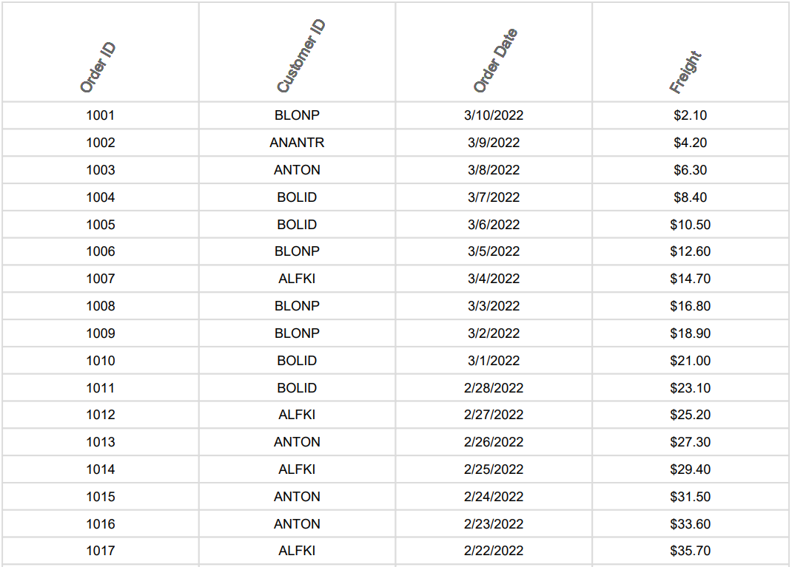

# Pdf export in Blazor Grid 

The PDF export feature in the Syncfusion Blazor Grid allows you to export grid data to a PDF document, providing the ability to generate printable reports or share data in a standardized format.

To enable PDF export in the grid, you need to set the [AllowPdfExport](https://help.syncfusion.com/cr/blazor/Syncfusion.Blazor.Grids.SfGrid-1.html#Syncfusion_Blazor_Grids_SfGrid_1_AllowPdfExport) property to **true** and use the **PdfExport** method for exporting. 

The following example demonstrates how to perform a PDF export action in the grid.



@using Syncfusion.Blazor.Grids

<SfGrid ID="Grid" @ref="DefaultGrid" DataSource="@Orders" Height="315" Toolbar="@(new List<string>() { "PdfExport" })" AllowPdfExport="true">
    <GridEvents OnToolbarClick="ToolbarClickHandler" TValue="OrderDetails"></GridEvents>
    <GridColumns>
        <GridColumn Field=@nameof(OrderDetails.OrderID) HeaderText="Order ID" TextAlign="TextAlign.Right" Width="120"></GridColumn>
        <GridColumn Field=@nameof(OrderDetails.CustomerID) HeaderText="Customer ID" Width="150"></GridColumn>
        <GridColumn Field=@nameof(OrderDetails.ShipCity) HeaderText="Ship City" Width="150"></GridColumn>
        <GridColumn Field=@nameof(OrderDetails.ShipName) HeaderText="Ship Name" Width="150"></GridColumn>
    </GridColumns>
</SfGrid>

@code {
    private SfGrid<OrderDetails> DefaultGrid;
    public List<OrderDetails> Orders { get; set; }

    public async Task ToolbarClickHandler(Syncfusion.Blazor.Navigations.ClickEventArgs args)
    {
        if (args.Item.Id == "Grid_pdfexport")  //Id is combination of Grid's ID and itemname
        {
            await this.DefaultGrid.PdfExport();
        }
    }
    protected override void OnInitialized()
    {
        Orders = OrderDetails.GetAllRecords();
    }
}




public class OrderDetails
{
    public static List<OrderDetails> order = new List<OrderDetails>();
    public OrderDetails(int OrderID, string CustomerId, string ShipCity, string ShipName)
    {
        this.OrderID = OrderID;
        this.CustomerID = CustomerId;
        this.ShipCity = ShipCity;
        this.ShipName = ShipName;
    }
    public static List<OrderDetails> GetAllRecords()
    {
        if (order.Count == 0)
        {
            order.Add(new OrderDetails(10248, "VINET", "Reims", "Vins et alcools Chevalier"));
            order.Add(new OrderDetails(10249, "TOMSP", "Münster", "Toms Spezialitäten"));
            order.Add(new OrderDetails(10250, "HANAR", "Rio de Janeiro", "Hanari Carnes"));
            order.Add(new OrderDetails(10251, "VICTE", "Lyon", "Victuailles en stock"));
            order.Add(new OrderDetails(10252, "SUPRD", "Charleroi", "Suprêmes délices"));
            order.Add(new OrderDetails(10253, "HANAR", "Rio de Janeiro", "Hanari Carnes"));
            order.Add(new OrderDetails(10254, "CHOPS", "Bern", "Chop-suey Chinese"));
            order.Add(new OrderDetails(10255, "RICSU", "Genève", "Richter Supermarkt"));
            order.Add(new OrderDetails(10256, "WELLI", "Resende", "Wellington Importadora"));
            order.Add(new OrderDetails(10257, "HILAA", "San Cristóbal", "HILARION-Abastos"));
            order.Add(new OrderDetails(10258, "ERNSH", "Graz", "Ernst Handel"));
            order.Add(new OrderDetails(10259, "CENTC", "México D.F.", "Centro comercial Moctezuma"));
            order.Add(new OrderDetails(10260, "OTTIK", "Köln", "Ottilies Käseladen"));
            order.Add(new OrderDetails(10261, "QUEDE", "Rio de Janeiro", "Que Delícia"));
            order.Add(new OrderDetails(10262, "RATTC", "Albuquerque", "Rattlesnake Canyon Grocery"));
        }
        return order;
    }
    public int OrderID { get; set; }
    public string CustomerID { get; set; }
    public string ShipCity { get; set; }
    public string ShipName { get; set; }
}






## Show spinner while exporting

Showing a spinner while exporting in the Syncfusion Blazor Grid enhances the experience by displaying a spinner during the export process. This feature provides a visual indication of the export progress, improving the understanding of the exporting process.

To show or hide a spinner while exporting the grid, you can utilize the [ShowSpinnerAsync](https://help.syncfusion.com/cr/blazor/Syncfusion.Blazor.Grids.SfGrid-1.html#Syncfusion_Blazor_Grids_SfGrid_1_ShowSpinnerAsync) and [HideSpinnerAsync](https://help.syncfusion.com/cr/blazor/Syncfusion.Blazor.Grids.SfGrid-1.html#Syncfusion_Blazor_Grids_SfGrid_1_HideSpinnerAsync) methods provided by the Grid within the [OnToolbarClick](https://blazor.syncfusion.com/documentation/datagrid/events#ontoolbarclick) event.

The `OnToolbarClick` event is triggered when a toolbar item in the Grid is clicked. Within the event handler, the code checks if the clicked **item** is related with PDF export, specifically the **Grid_pdfexport** item. If a match is found, the `ShowSpinnerAsync` method is used on the Grid instance to display the spinner. 

To hide the spinner after the exporting is completed, bind the [ExportComplete](https://blazor.syncfusion.com/documentation/datagrid/events#exportcomplete) event and use the `HideSpinnerAsync` method on the Grid instance to hide the spinner.

The following example demonstrates how to show and hide the spinner during PDF export in a grid.



@using Syncfusion.Blazor.Grids

<SfGrid ID="Grid" @ref="DefaultGrid" DataSource="@Orders" Height="315" Toolbar="@(new List<string>() { "PdfExport" })" AllowPdfExport="true">
    <GridEvents ExportComplete="ExportCompleteHandler" OnToolbarClick="ToolbarClickHandler" TValue="OrderDetails"></GridEvents>
    <GridColumns>
        <GridColumn Field=@nameof(OrderDetails.OrderID) HeaderText="Order ID" TextAlign="TextAlign.Right" Width="120"></GridColumn>
        <GridColumn Field=@nameof(OrderDetails.CustomerID) HeaderText="Customer ID" Width="150"></GridColumn>
        <GridColumn Field=@nameof(OrderDetails.ShipCity) HeaderText="Ship City" Width="150"></GridColumn>
        <GridColumn Field=@nameof(OrderDetails.ShipName) HeaderText="Ship Name" Width="150"></GridColumn>
    </GridColumns>
</SfGrid>

@code {
    private SfGrid<OrderDetails> DefaultGrid;
    public List<OrderDetails> Orders { get; set; }

    public async Task ToolbarClickHandler(Syncfusion.Blazor.Navigations.ClickEventArgs args)
    {
        if (args.Item.Id == "Grid_pdfexport")  //Id is combination of Grid's ID and itemname
        {
            await this.DefaultGrid.ShowSpinnerAsync();
            await this.DefaultGrid.PdfExport();
        }
    }
    public async void ExportCompleteHandler(object args)
    {

        await this.DefaultGrid.HideSpinnerAsync();
    }
    protected override void OnInitialized()
    {
        Orders = OrderDetails.GetAllRecords();
    }
}




public class OrderDetails
{
    public static List<OrderDetails> order = new List<OrderDetails>();
    public OrderDetails(int OrderID, string CustomerId, string ShipCity, string ShipName)
    {
        this.OrderID = OrderID;
        this.CustomerID = CustomerId;
        this.ShipCity = ShipCity;
        this.ShipName = ShipName;
    }
    public static List<OrderDetails> GetAllRecords()
    {
        if (order.Count == 0)
        {
            order.Add(new OrderDetails(10248, "VINET", "Reims", "Vins et alcools Chevalier"));
            order.Add(new OrderDetails(10249, "TOMSP", "Münster", "Toms Spezialitäten"));
            order.Add(new OrderDetails(10250, "HANAR", "Rio de Janeiro", "Hanari Carnes"));
            order.Add(new OrderDetails(10251, "VICTE", "Lyon", "Victuailles en stock"));
            order.Add(new OrderDetails(10252, "SUPRD", "Charleroi", "Suprêmes délices"));
            order.Add(new OrderDetails(10253, "HANAR", "Rio de Janeiro", "Hanari Carnes"));
            order.Add(new OrderDetails(10254, "CHOPS", "Bern", "Chop-suey Chinese"));
            order.Add(new OrderDetails(10255, "RICSU", "Genève", "Richter Supermarkt"));
            order.Add(new OrderDetails(10256, "WELLI", "Resende", "Wellington Importadora"));
            order.Add(new OrderDetails(10257, "HILAA", "San Cristóbal", "HILARION-Abastos"));
            order.Add(new OrderDetails(10258, "ERNSH", "Graz", "Ernst Handel"));
            order.Add(new OrderDetails(10259, "CENTC", "México D.F.", "Centro comercial Moctezuma"));
            order.Add(new OrderDetails(10260, "OTTIK", "Köln", "Ottilies Käseladen"));
            order.Add(new OrderDetails(10261, "QUEDE", "Rio de Janeiro", "Que Delícia"));
            order.Add(new OrderDetails(10262, "RATTC", "Albuquerque", "Rattlesnake Canyon Grocery"));
        }
        return order;
    }
    public int OrderID { get; set; }
    public string CustomerID { get; set; }
    public string ShipCity { get; set; }
    public string ShipName { get; set; }
}






## Binding custom data source while exporting

The Syncfusion Blazor Grid provides a convenient way to export data to a PDF format. With the PDF export feature, you can define a custom data source while exporting. This allows you to export data that is not necessarily bind to the grid, which can be generated or retrieved based on your application logic.

To export data, you need to define the [DataSource](https://help.syncfusion.com/cr/blazor/Syncfusion.Blazor.Grids.PdfExportProperties.html#Syncfusion_Blazor_Grids_PdfExportProperties_DataSource) property within the [PdfExportProperties](https://help.syncfusion.com/cr/blazor/Syncfusion.Blazor.Grids.PdfExportProperties.html) object. This property represents the data source that will be used for the PDF export.

The following example demonstrates how to render custom data source during PDF export. By utilizing the **PdfExport** method and passing the `PdfExportProperties` object through the grid instance, the grid data will be exported to a PDF using the dynamically defined data source.



@using Syncfusion.Blazor.Grids

<SfGrid ID="Grid" @ref="DefaultGrid" DataSource="@Orders" Height="315" Toolbar="@(new List<string>() { "PdfExport" })" AllowPdfExport="true">
    <GridEvents OnToolbarClick="ToolbarClickHandler" TValue="OrderDetails"></GridEvents>
    <GridColumns>
        <GridColumn Field=@nameof(OrderDetails.OrderID) HeaderText="Order ID" TextAlign="TextAlign.Right" Width="120"></GridColumn>
        <GridColumn Field=@nameof(OrderDetails.CustomerID) HeaderText="Customer ID" Width="150"></GridColumn>
        <GridColumn Field=@nameof(OrderDetails.ShipCity) HeaderText="Ship City" Width="150"></GridColumn>
        <GridColumn Field=@nameof(OrderDetails.ShipName) HeaderText="Ship Name" Width="150"></GridColumn>
    </GridColumns>
</SfGrid>

@code {
    private SfGrid<OrderDetails> DefaultGrid;
    public List<OrderDetails> Orders { get; set; }
    public List<ChangeData> newOrders { get; set; }

    private List<OrderDetails> ConvertToOrderDetails(List<ChangeData> changes)
    {
        return changes.Select(c => new OrderDetails(c.OrderID, c.CustomerID, c.ShipCity, c.ShipName)).ToList();
    }

    public async Task ToolbarClickHandler(Syncfusion.Blazor.Navigations.ClickEventArgs args)
    {
        if (args.Item.Id == "Grid_pdfexport")  // Id = Grid ID + _ + Toolbar Item Name
        {
            var convertedOrders = ConvertToOrderDetails(newOrders);
            PdfExportProperties PdfProperties = new PdfExportProperties
                {
                    DataSource = convertedOrders
                };
            await this.DefaultGrid.PdfExport(PdfProperties);
        }
    }
    protected override void OnInitialized()
    {
        Orders = OrderDetails.GetAllRecords();
        newOrders = ChangeData.GetAllRecords();
    }
}




public class OrderDetails
{
    public static List<OrderDetails> order = new List<OrderDetails>();
    public OrderDetails(int OrderID, string CustomerId, string ShipCity, string ShipName)
    {
        this.OrderID = OrderID;
        this.CustomerID = CustomerId;
        this.ShipCity = ShipCity;
        this.ShipName = ShipName;
    }
    public static List<OrderDetails> GetAllRecords()
    {
        if (order.Count == 0)
        {
            order.Add(new OrderDetails(10248, "VINET", "Reims", "Vins et alcools Chevalier"));
            order.Add(new OrderDetails(10249, "TOMSP", "Münster", "Toms Spezialitäten"));
            order.Add(new OrderDetails(10250, "HANAR", "Rio de Janeiro", "Hanari Carnes"));
            order.Add(new OrderDetails(10251, "VICTE", "Lyon", "Victuailles en stock"));
            order.Add(new OrderDetails(10252, "SUPRD", "Charleroi", "Suprêmes délices"));
            order.Add(new OrderDetails(10253, "HANAR", "Rio de Janeiro", "Hanari Carnes"));
            order.Add(new OrderDetails(10254, "CHOPS", "Bern", "Chop-suey Chinese"));
            order.Add(new OrderDetails(10255, "RICSU", "Genève", "Richter Supermarkt"));
            order.Add(new OrderDetails(10256, "WELLI", "Resende", "Wellington Importadora"));
            order.Add(new OrderDetails(10257, "HILAA", "San Cristóbal", "HILARION-Abastos"));
            order.Add(new OrderDetails(10258, "ERNSH", "Graz", "Ernst Handel"));
            order.Add(new OrderDetails(10259, "CENTC", "México D.F.", "Centro comercial Moctezuma"));
            order.Add(new OrderDetails(10260, "OTTIK", "Köln", "Ottilies Käseladen"));
            order.Add(new OrderDetails(10261, "QUEDE", "Rio de Janeiro", "Que Delícia"));
            order.Add(new OrderDetails(10262, "RATTC", "Albuquerque", "Rattlesnake Canyon Grocery"));
        }
        return order;
    }
    public int OrderID { get; set; }
    public string CustomerID { get; set; }
    public string ShipCity { get; set; }
    public string ShipName { get; set; }
}





public class ChangeData
{
    public static List<ChangeData> newOrders = new List<ChangeData>();

    public ChangeData(int OrderID, string CustomerId, string ShipCity, string ShipName)
    {
        this.OrderID = OrderID;
        this.CustomerID = CustomerId;
        this.ShipCity = ShipCity;
        this.ShipName = ShipName;
    }

    public static List<ChangeData> GetAllRecords()
    {
        if (newOrders.Count == 0)
        {
            newOrders.Add(new ChangeData(20201, "BLAUS", "Madrid", "Blauer See Delikatessen"));
            newOrders.Add(new ChangeData(20202, "FAMIA", "Sevilla", "Familia Arquibaldo"));
            newOrders.Add(new ChangeData(20203, "GODOS", "Lisbon", "Godos Gourmet"));
            newOrders.Add(new ChangeData(20204, "LINOD", "Porto", "Lino Delicias"));
            newOrders.Add(new ChangeData(20205, "ALFKI", "Berlin", "Alfreds Futterkiste"));
            newOrders.Add(new ChangeData(20206, "FRANK", "Paris", "Frankenversand"));
            newOrders.Add(new ChangeData(20207, "LAMAI", "Milan", "La Maison du Délice"));
            newOrders.Add(new ChangeData(20208, "TRADH", "Zürich", "Tradição Hipermercado"));
            newOrders.Add(new ChangeData(20209, "WOLZA", "Hamburg", "Wolski Zajazd"));
            newOrders.Add(new ChangeData(20210, "PICCO", "Naples", "Piccolo Ristorante"));
            newOrders.Add(new ChangeData(20211, "BERGS", "Oslo", "Berglunds snabbköp"));
            newOrders.Add(new ChangeData(20212, "BONAP", "Marseille", "Bon app'"));
            newOrders.Add(new ChangeData(20213, "FOLKO", "Stockholm", "Folk och fä HB"));
            newOrders.Add(new ChangeData(20214, "LEHMS", "Copenhagen", "Lehmanns Marktstand"));
            newOrders.Add(new ChangeData(20215, "QUEEN", "London", "Queen Cozinha"));
        }
        return newOrders;
    }

    public int OrderID { get; set; }
    public string CustomerID { get; set; }
    public string ShipCity { get; set; }
    public string ShipName { get; set; }
}






## Exporting with custom aggregate

Custom aggregates in the Syncfusion Blazor Grid involves exporting grid data that includes additional calculated values based on specific requirements. This feature enables you to show the comprehensive view of the data in the exported file by incorporating the specific aggregated information you need for analysis or reporting purposes.

In order to utilize custom aggregation, you need to specify the [Type](https://help.syncfusion.com/cr/blazor/Syncfusion.Blazor.Grids.GridAggregateColumn.html?_gl=1*n3kv9z*_gcl_aw*R0NMLjE3MzgwNjYwODYuQ2p3S0NBaUFuZUs4QmhBVkVpd0FveTJIWVFDU1Nhbm1XaWRsRGpDb2lSTEZBZEhPR21xMERSM2VxSGZRRzVGUVA3WEZsNjV1NndrRG14b0NqMHNRQXZEX0J3RQ..*_ga*NzE4Mzg0MjU3LjE3NDEwOTIxNDg.*_ga_41J4HFMX1J*MTc0NDE5NjE5My4xMjAuMS4xNzQ0MTk3ODY5LjAuMC4w#Syncfusion_Blazor_Grids_GridAggregateColumn_Type) property as **Custom**.

Within the **CustomAggregateFunction** function, it takes an input data that contains a result property. The function calculates the count of objects in this data where the **ShipCountry** field value is equal to **Brazil** and returns the count with a descriptive label.

The following example shows how to export the grid with a custom aggregate that shows the calculation of the **Brazil** count of the **ShipCountry** column.




@using Syncfusion.Blazor.Grids

<SfGrid ID="Grid" @ref="DefaultGrid" DataSource="@OrderData" Toolbar="@(new List<string>() {"PdfExport"})" AllowPdfExport="true">
    <GridEvents TValue="OrderDetails" OnToolbarClick="ToolbarClickHandler" PdfAggregateTemplateInfo="PdfAggregateTemplateInfoHandler"></GridEvents>

    <GridAggregates>
        <GridAggregate>
            <GridAggregateColumns>
                <GridAggregateColumn Field=@nameof(OrderDetails.ShipCountry) Type="AggregateType.Custom">
                    <FooterTemplate>
                        @{
                            <div>
                                <p>Brazil Count: @CustomAggregateFunction()</p>
                            </div>
                        }
                    </FooterTemplate>
                </GridAggregateColumn>
            </GridAggregateColumns>
        </GridAggregate>
    </GridAggregates>

    <GridColumns>
        <GridColumn Field="OrderID" HeaderText="Order ID" IsPrimaryKey="true" TextAlign="TextAlign.Right" Width="120"></GridColumn>
        <GridColumn Field="CustomerID" HeaderText="Customer ID" Width="150"></GridColumn>
        <GridColumn Field="Freight" HeaderText="Freight" Format="C2" TextAlign="TextAlign.Right" Width="120"></GridColumn>
        <GridColumn Field="ShipCountry" HeaderText="Ship Country" Width="150"></GridColumn>
    </GridColumns>
</SfGrid>

@code {
    private SfGrid<OrderDetails> DefaultGrid;
    public List<OrderDetails> OrderData { get; set; }

    protected override void OnInitialized()
    {
        OrderData = OrderDetails.GetAllRecords();
    }

    public async Task ToolbarClickHandler(Syncfusion.Blazor.Navigations.ClickEventArgs args)
    {
        if (args.Item.Id == "Grid_pdfexport")  // "Grid" + "_" + "Toolbar Item"
        {
            await DefaultGrid.PdfExport();
        }
    }

    private int CustomAggregateFunction()
    {
        return OrderData.Count(x => x.ShipCountry.Contains("Brazil"));
    }

    public void PdfAggregateTemplateInfoHandler(PdfAggregateEventArgs args)
    {
        if (args.Column.Field == "ShipCountry")
        {
            args.Cell.Value = $"Brazil Count: {CustomAggregateFunction()}";
        }
    }
}




public class OrderDetails
{
    public static List<OrderDetails> Order = new List<OrderDetails>();
    public OrderDetails(int OrderID, string CustomerId, double Freight, string ShipCountry)
    {
        this.OrderID = OrderID;
        this.CustomerID = CustomerId;
        this.Freight = Freight;
        this.ShipCountry = ShipCountry;
    }
    public static List<OrderDetails> GetAllRecords()
    {
        if (Order.Count == 0)
        {
            Order.Add(new OrderDetails(10248, "VINET", 32.38, "France"));
            Order.Add(new OrderDetails(10249, "TOMSP", 11.61, "Germany"));
            Order.Add(new OrderDetails(10250, "HANAR", 65.83, "Brazil"));
            Order.Add(new OrderDetails(10251, "VICTE", 41.34, "France"));
            Order.Add(new OrderDetails(10252, "SUPRD", 51.3, "Belgium"));
            Order.Add(new OrderDetails(10253, "HANAR", 58.17, "Brazil"));
            Order.Add(new OrderDetails(10254, "CHOPS", 22.98, "Switzerland"));
            Order.Add(new OrderDetails(10255, "RICSU", 148.33, "Switzerland"));
            Order.Add(new OrderDetails(10256, "WELLI", 13.97, "Brazil"));
            Order.Add(new OrderDetails(10257, "HILAA", 81.91, "Venezuela"));
            Order.Add(new OrderDetails(10258, "ERNSH", 140.51, "Austria"));
            Order.Add(new OrderDetails(10259, "CENTC", 3.25, "Mexico"));
            Order.Add(new OrderDetails(10260, "OTTIK", 55.09, "Germany"));
            Order.Add(new OrderDetails(10261, "QUEDE", 3.05, "Brazil"));
            Order.Add(new OrderDetails(10262, "RATTC", 48.29, "USA"));
        }
        return Order;
    }
    public int OrderID { get; set; }
    public string CustomerID { get; set; }
    public double Freight { get; set; }
    public string ShipCountry { get; set; }
}






## Exporting with cell and row spanning 

Exporting data from the Grid with cell and row spanning enables you to maintain cell and row layout in the exported data. This feature is useful when you have merged cells or rows in the Grid and you want to maintain the same structure in the exported file.

To achieve this, you can utilize the `rowSpan` and `colSpan` properties in the [QueryCellInfo](https://blazor.syncfusion.com/documentation/datagrid/events#querycellinfo) event of the Grid. This event allows you to define the span values for specific cells. Additionally, you can customize the appearance of the grid cells during the export using the [PdfQueryCellInfo](https://blazor.syncfusion.com/documentation/datagrid/events#pdfquerycellinfoevent) event of the Grid.

The following example demonstrates how to perform export with cell and row spanning using `queryCellInfo` and `PdfQueryCellInfo` events of the Grid.




@using Syncfusion.Blazor.Grids

<SfGrid ID="Grid" @ref="Grid" DataSource="@Orders" AllowPdfExport="true" Toolbar="@(new List<string>() { "PdfExport" })" Height="348">
    <GridEvents PdfQueryCellInfoEvent="PdfQueryCellInfoHandler" QueryCellInfo="QueryCellInfoHandler" OnToolbarClick="ToolbarClickHandler" TValue="OrderData"></GridEvents>
    <GridColumns>
        <GridColumn Field=@nameof(OrderData.OrderID) HeaderText="Order ID" TextAlign="TextAlign.Right" Width="120"></GridColumn>
        <GridColumn Field=@nameof(OrderData.CustomerID) HeaderText="Customer Name" Width="150"></GridColumn>
        <GridColumn Field=@nameof(OrderData.Freight) HeaderText="Freight" Visible="false" Format="C2" TextAlign="TextAlign.Right" Width="120"></GridColumn>
        <GridColumn Field=@nameof(OrderData.ShipCity) HeaderText="Ship City" Width="150"></GridColumn>
        <GridColumn Field=@nameof(OrderData.ShipCountry) HeaderText="Ship Country" Width="150"></GridColumn>
    </GridColumns>
</SfGrid>

@code {
    private SfGrid<OrderData> Grid;
    public List<OrderData> Orders { get; set; }

    protected override void OnInitialized()
    {
        Orders = OrderData.GetAllRecords(); // Populate the grid with initial data
    }

    public async Task ToolbarClickHandler(Syncfusion.Blazor.Navigations.ClickEventArgs args)
    {
        if (args.Item.Id == "Grid_pdfexport")
        {

            await this.Grid.ExportToPdfAsync();
        }
    }

    public void PdfQueryCellInfoHandler(PdfQueryCellInfoEventArgs<OrderData> args)
    {
        var orderId = (args.Data).OrderID;
        switch (orderId)
        {
            case 10248:
                if ((args.Column).Field == "CustomerID")
                {
                    args.Cell.RowSpan = 2;
                }
                break;
            case 10250:
                if ((args.Column).Field == "CustomerID")
                {
                    args.Cell.ColumnSpan = 2;
                }
                break;
            case 10252:
                if (args.Column.Field == "OrderID")
                {
                    args.Cell.RowSpan = 3;
                }
                break;
            case 10256:
                if (args.Column.Field == "CustomerID")
                {
                    args.Cell.ColumnSpan = 3;
                }
                break;
            case 10261:
                if (args.Column.Field == "Freight")
                {
                    args.Cell.ColumnSpan = 2;
                }
                break;
        }
    }

    public void QueryCellInfoHandler(Syncfusion.Blazor.Grids.QueryCellInfoEventArgs<OrderData> args)
    {
        var orderId = (args.Data).OrderID;
        switch (orderId)
        {
            case 10248:
                if (args.Column.Field == "CustomerID")
                {
                    args.RowSpan = 2;
                }
                break;
            case 10250:
                if (args.Column.Field == "CustomerID")
                {
                    args.ColSpan = 2;
                }
                break;
            case 10252:
                if (args.Column.Field == "OrderID")
                {
                    args.RowSpan = 3;
                }
                break;
            case 10256:
                if (args.Column.Field == "CustomerID")
                {
                    args.ColSpan = 3;
                }
                break;
            case 10261:
                if (args.Column.Field == "Freight")
                {
                    args.ColSpan = 2;
                }
                break;
        }
    }
}





public class OrderData
{
    public OrderData(int orderID, string customerID, double freight, string shipCity, string shipCountry)
    {
        this.OrderID = orderID;
        this.CustomerID = customerID;
        this.Freight = freight;
        this.ShipCity = shipCity;
        this.ShipCountry = shipCountry;
    }
    public static List<OrderData> GetAllRecords()
    {
        return new List<OrderData>
        {
            new OrderData(10248, "VINET", 32.38, "Reims", "France"),
            new OrderData(10249, "TOMSP", 11.61, "Münster", "Germany"),
            new OrderData(10250, "HANAR", 65.83, "Rio de Janeiro", "Brazil"),
            new OrderData(10251, "VICTE", 41.34, "Lyon", "France"),
            new OrderData(10252, "SUPRD", 51.30, "Charleroi", "Belgium"),
            new OrderData(10253, "HANAR", 58.17, "Rio de Janeiro", "Brazil"),
            new OrderData(10254, "CHOPS", 22.98, "Bern", "Switzerland"),
            new OrderData(10255, "RICSU", 148.33, "Genève", "France"),
            new OrderData(10256, "WELLI", 13.97, "Resende", "Brazil"),
            new OrderData(10257, "HILAA", 81.91, "San Cristóbal", "Mexico"),
            new OrderData(10258, "ERNSH", 140.51, "Graz", "Austria"),
            new OrderData(10259, "CENTC", 3.25, "México D.F.", "Mexico"),
            new OrderData(10260, "OTTIK", 55.09, "Köln", "Germany"),
            new OrderData(10261, "QUEDE", 3.05, "Rio de Janeiro", "Brazil"),
            new OrderData(10262, "RATTC", 48.29, "Albuquerque", "USA")
        };
    }
    public int OrderID { get; set; }
    public string CustomerID { get; set; }
    public double Freight { get; set; }
    public string ShipCity { get; set; }
    public string ShipCountry { get; set; }
}






## Exporting with custom date format

The exporting functionality in the Syncfusion Blazor Grid allows you to export grid data, including custom date format. This feature is useful when you need to export grid data with customized date values. 

To apply a custom date format to grid columns during the export, you can utilize the [columns.format](https://help.syncfusion.com/cr/blazor/Syncfusion.Blazor.Grids.GridColumn.html?_gl=1*menbkd*_gcl_aw*R0NMLjE3MzgwNjYwODYuQ2p3S0NBaUFuZUs4QmhBVkVpd0FveTJIWVFDU1Nhbm1XaWRsRGpDb2lSTEZBZEhPR21xMERSM2VxSGZRRzVGUVA3WEZsNjV1NndrRG14b0NqMHNRQXZEX0J3RQ..*_ga*NzE4Mzg0MjU3LjE3NDEwOTIxNDg.*_ga_41J4HFMX1J*MTc0NDI2NjE5MC4xMjIuMS4xNzQ0MjY3NTQ1LjAuMC4w#Syncfusion_Blazor_Grids_GridColumn_Format) property. This property allows you to define a custom format using format options.

The following example demonstrates how to export the grid data with custom date format. In this example, the formatOptions object is used as the `columns.format` property for the **OrderDate** column. This custom date format displays the date in the format of day-of-the-week, month abbreviation, day, and 2-digit year (e.g., Thu, Jul 4, '96).




@using Syncfusion.Blazor.Grids

<SfGrid ID="Grid" @ref="DefaultGrid" DataSource="@Orders" Toolbar="@(new List<string>() { "PdfExport" })" AllowPdfExport="true" AllowPaging="true">
    <GridEvents OnToolbarClick="ToolbarClickHandler" TValue="OrderData"></GridEvents>
    <GridColumns>
        <GridColumn Field=@nameof(OrderData.OrderID) HeaderText="Order ID" TextAlign="Syncfusion.Blazor.Grids.TextAlign.Right" Width="120"></GridColumn>
        <GridColumn Field=@nameof(OrderData.CustomerID) HeaderText="Customer ID" TextAlign="Syncfusion.Blazor.Grids.TextAlign.Right" Width="120"></GridColumn>
        <GridColumn Field=@nameof(OrderData.OrderDate) HeaderText="Order Date" Type="Syncfusion.Blazor.Grids.ColumnType.Date" Format="@FormatOptions" Width="100">
        <GridColumn Field=@nameof(OrderData.Freight) HeaderText="Freight" Width="80"></GridColumn>
        </GridColumn>
    </GridColumns>
</SfGrid>

@code {
    private SfGrid<OrderData> DefaultGrid;
    public List<OrderData> Orders { get; set; }
    public string FormatOptions = "ddd, MMM d, ''yy";

    public async Task ToolbarClickHandler(Syncfusion.Blazor.Navigations.ClickEventArgs args)
    {
        if (args.Item.Id == "Grid_pdfexport")  //Id is combination of Grid's ID and itemname
        {
            await this.DefaultGrid.PdfExport();

        }
    }

    protected override void OnInitialized()
    {
        Orders = OrderData.GetAllRecords();

    }
}




public class OrderData
{
    public static List<OrderData> Orders = new List<OrderData>();

    public OrderData() { }

    public OrderData(int OrderID, string CustomerID, string ShipName, double Freight, DateTime? OrderDate, DateTime? ShippedDate, bool? IsVerified, string ShipCity, string ShipCountry, int employeeID)
    {
        this.OrderID = OrderID;
        this.CustomerID = CustomerID;
        this.ShipName = ShipName;
        this.Freight = Freight;
        this.OrderDate = OrderDate;
        this.ShippedDate = ShippedDate;
        this.IsVerified = IsVerified;
        this.ShipCity = ShipCity;
        this.ShipCountry = ShipCountry;
        this.EmployeeID = employeeID;
    }

    public static List<OrderData> GetAllRecords()
    {
        if (Orders.Count == 0)
        {
            Orders.Add(new OrderData(10248, "VINET", "Vins et alcools Chevalier", 32.38, new DateTime(1996, 7, 4), new DateTime(1996, 08, 07), true, "Reims", "France", 1));
            Orders.Add(new OrderData(10249, "TOMSP", "Toms Spezialitäten", 11.61, new DateTime(1996, 7, 5), new DateTime(1996, 08, 07), false, "Münster", "Germany", 2));
            Orders.Add(new OrderData(10250, "HANAR", "Hanari Carnes", 65.83, new DateTime(1996, 7, 6), new DateTime(1996, 08, 07), true, "Rio de Janeiro", "Brazil", 3));
            Orders.Add(new OrderData(10251, "VINET", "Vins et alcools Chevalier", 41.34, new DateTime(1996, 7, 7), new DateTime(1996, 08, 07), false, "Lyon", "France", 1));
            Orders.Add(new OrderData(10252, "SUPRD", "Suprêmes délices", 151.30, new DateTime(1996, 7, 8), new DateTime(1996, 08, 07), true, "Charleroi", "Belgium", 2));
            Orders.Add(new OrderData(10253, "HANAR", "Hanari Carnes", 58.17, new DateTime(1996, 7, 9), new DateTime(1996, 08, 07), false, "Bern", "Switzerland", 3));
            Orders.Add(new OrderData(10254, "CHOPS", "Chop-suey Chinese", 22.98, new DateTime(1996, 7, 10), new DateTime(1996, 08, 07), true, "Genève", "Switzerland", 2));
            Orders.Add(new OrderData(10255, "VINET", "Vins et alcools Chevalier", 148.33, new DateTime(1996, 7, 11), new DateTime(1996, 08, 07), false, "Resende", "Brazil", 1));
            Orders.Add(new OrderData(10256, "HANAR", "Hanari Carnes", 13.97, new DateTime(1996, 7, 12), new DateTime(1996, 08, 07), true, "Paris", "France", 3));
        }
        return Orders;
    }

    public int OrderID { get; set; }
    public string CustomerID { get; set; }
    public string ShipName { get; set; }
    public double? Freight { get; set; }
    public DateTime? OrderDate { get; set; }
    public DateTime? ShippedDate { get; set; }
    public bool? IsVerified { get; set; }
    public string ShipCity { get; set; }
    public string ShipCountry { get; set; }
    public int EmployeeID { get; set; }
}






<!-- Multiple exporting

PDF export provides an option for exporting multiple grids to same file. In this exported document, each datagrid will be exported to new page of document in same file.

This is demonstrated in the below sample code block,

```cshtml
@using Syncfusion.Blazor.Buttons
@using Syncfusion.Blazor.Grids

<SfButton OnClick="PdfExport" Content="Pdf Export"></SfButton>
<SfGrid @ref="FirstGrid" DataSource="@Orders1" AllowPdfExport="true" AllowPaging="true">
    <GridColumns>
        <GridColumn Field=@nameof(Order.OrderID) HeaderText="Order ID" TextAlign="TextAlign.Right" Width="120"></GridColumn>
        <GridColumn Field=@nameof(Order.CustomerID) HeaderText="Customer Name" Width="150"></GridColumn>
        <GridColumn Field=@nameof(Order.OrderDate) HeaderText=" Order Date" Format="d" Type="ColumnType.Date" TextAlign="TextAlign.Right" Width="130"></GridColumn>
        <GridColumn Field=@nameof(Order.Freight) HeaderText="Freight" Format="C2" TextAlign="TextAlign.Right" Width="120"></GridColumn>
    </GridColumns>
</SfGrid>
<br />
<br />
<SfGrid @ref="SecondGrid" DataSource="@Orders2" AllowPdfExport="true" AllowPaging="true">
    <GridColumns>
        <GridColumn Field=@nameof(Order.OrderID) HeaderText="Order ID" TextAlign="TextAlign.Right" Width="120"></GridColumn>
        <GridColumn Field=@nameof(Order.CustomerID) HeaderText="Customer Name" Width="150"></GridColumn>
        <GridColumn Field=@nameof(Order.OrderDate) HeaderText=" Order Date" Format="d" Type="ColumnType.Date" TextAlign="TextAlign.Right" Width="130"></GridColumn>
        <GridColumn Field=@nameof(Order.Freight) HeaderText="Freight" Format="C2" TextAlign="TextAlign.Right" Width="120"></GridColumn>
    </GridColumns>
</SfGrid>

@code{
    private SfGrid<Order> FirstGrid;
    private SfGrid<Order> SecondGrid;

    public List<Order> Orders1 { get; set; }
    public List<Order> Orders2 { get; set; }

    protected override void OnInitialized()
    {
        Orders1 = Enumerable.Range(1, 15).Select(x => new Order()
        {
            OrderID = 1000 + x,
            CustomerID = (new string[] { "ALFKI", "ANANTR", "ANTON", "BLONP", "BOLID" })[new Random().Next(5)],
            Freight = 2.1 * x,
            OrderDate = DateTime.Now.AddDays(-x),
        }).ToList();
        Orders2 = Enumerable.Range(1, 15).Select(x => new Order()
        {
            OrderID = 2000 + x,
            CustomerID = (new string[] { "JANET", "MARGARET", "NANCY", "STEVEN", "VINET" })[new Random().Next(5)],
            Freight = 3.1 * x,
            OrderDate = DateTime.Now.AddDays(-x),
        }).ToList();
    }

    public class Order
    {
        public int? OrderID { get; set; }
        public string CustomerID { get; set; }
        public DateTime? OrderDate { get; set; }
        public double? Freight { get; set; }
    }

    public void PdfExport()
    {
        var ExportData = this.FirstGrid.PdfExport(null, true);
        ExportData.ContinueWith((PdfData) => {
            this.SecondGrid.PdfExport(null, false, PdfData);
        });
    }
}
``` -->

## To customize PDF export

PDF export provides an option to customize mapping of datagrid to exported PDF document.

### File name for exported document

You can assign the file name for the exported document by defining **fileName** property in **PdfExportProperties**.

```cshtml
@using Syncfusion.Blazor.Grids

<SfGrid ID="Grid" @ref="DefaultGrid" DataSource="@Orders" Toolbar="@(new List<string>() { "PdfExport" })" AllowPdfExport="true" AllowPaging="true">
    <GridEvents OnToolbarClick="ToolbarClickHandler" TValue="Order"></GridEvents>
    <GridColumns>
        <GridColumn Field=@nameof(Order.OrderID) HeaderText="Order ID" TextAlign="TextAlign.Right" Width="120"></GridColumn>
        <GridColumn Field=@nameof(Order.CustomerID) HeaderText="Customer Name" Width="150"></GridColumn>
        <GridColumn Field=@nameof(Order.OrderDate) HeaderText=" Order Date" Format="d" Type="ColumnType.Date" TextAlign="TextAlign.Right" Width="130"></GridColumn>
        <GridColumn Field=@nameof(Order.Freight) HeaderText="Freight" Format="C2" TextAlign="TextAlign.Right" Width="120"></GridColumn>
    </GridColumns>
</SfGrid>

@code{
    private SfGrid<Order> DefaultGrid;
    public List<Order> Orders { get; set; }

    public async Task ToolbarClickHandler(Syncfusion.Blazor.Navigations.ClickEventArgs args)
    {
       if (args.Item.Id == "Grid_pdfexport")  //Id is combination of Grid's ID and itemname
        {
            PdfExportProperties ExportProperties = new PdfExportProperties();
            ExportProperties.FileName = "test.pdf";
            await this.DefaultGrid.PdfExport(ExportProperties);
        }
    }
    protected override void OnInitialized()
    {
        Orders = Enumerable.Range(1, 75).Select(x => new Order()
        {
            OrderID = 1000 + x,
            CustomerID = (new string[] { "ALFKI", "ANANTR", "ANTON", "BLONP", "BOLID" })[new Random().Next(5)],
            Freight = 2.1 * x,
            OrderDate = DateTime.Now.AddDays(-x),
        }).ToList();
    }

    public class Order
    {
        public int? OrderID { get; set; }
        public string CustomerID { get; set; }
        public DateTime? OrderDate { get; set; }
        public double? Freight { get; set; }
    }
}
```

<!-- Default fonts for pdf exporting

By default, datagrid uses **Helvetica** font in the exported document. You can change the default font by using [`Theme`](https://help.syncfusion.com/cr/blazor/Syncfusion.Blazor.Grids.PdfExportProperties.html#Syncfusion_Blazor_Grids_PdfExportProperties_Theme) property of [`PdfExportProperties`](https://help.syncfusion.com/cr/aspnetcore-blazor/Syncfusion.Blazor.Grids.PdfExportProperties.html).

The available fonts are,

* Helvetica
* TimesRoman
* Courier
* Symbol
* ZapfDingbats

The following sample code demonstrates changing the default font value on exported document,

```cshtml
@using Syncfusion.Blazor.Buttons
@using Syncfusion.Blazor.Grids

<SfButton OnClick="PdfExport" Content="Pdf Export"></SfButton>
<SfGrid @ref="DefaultGrid" DataSource="@Orders" AllowSorting="true" AllowPdfExport="true" AllowPaging="true">
    <GridColumns>
        <GridColumn Field=@nameof(Order.OrderID) HeaderText="Order ID" TextAlign="TextAlign.Right" Width="120"></GridColumn>
        <GridColumn Field=@nameof(Order.CustomerID) HeaderText="Customer Name" Width="150"></GridColumn>
        <GridColumn Field=@nameof(Order.OrderDate) HeaderText=" Order Date" Format="d" Type="ColumnType.Date" TextAlign="TextAlign.Right" Width="130"></GridColumn>
        <GridColumn Field=@nameof(Order.Freight) HeaderText="Freight" Format="C2" TextAlign="TextAlign.Right" Width="120"></GridColumn>
    </GridColumns>
</SfGrid>

@functions{
    private SfGrid<Order> DefaultGrid;

    public List<Order> Orders { get; set; }

    protected override void OnInitialized()
    {
        Orders = Enumerable.Range(1, 75).Select(x => new Order()
        {
            OrderID = 1000 + x,
            CustomerID = (new string[] { "ALFKI", "ANANTR", "ANTON", "BLONP", "BOLID" })[new Random().Next(5)],
            Freight = 2.1 * x,
            OrderDate = DateTime.Now.AddDays(-x),
        }).ToList();
    }

    public void PdfExport()
    {
        PdfExportProperties ExportProperties = new PdfExportProperties();
        PdfTheme Theme = new PdfTheme();

        string[] HeaderFont = new string[] { "TimesRoman" };

        PdfThemeStyle HeaderThemeStyle = new PdfThemeStyle()
        {
            Font = HeaderFont,
        };
        Theme.Header = HeaderThemeStyle;

        PdfThemeStyle RecordThemeStyle = new PdfThemeStyle()
        {
            Font = HeaderFont

        };
        Theme.Record = RecordThemeStyle;

        PdfThemeStyle CaptionThemeStyle = new PdfThemeStyle()
        {
            Font = HeaderFont

        };
        Theme.Caption = CaptionThemeStyle;

        ExportProperties.Theme = Theme;
        this.DefaultGrid.PdfExport(ExportProperties);
    }
    public class Order
    {
        public int? OrderID { get; set; }
        public string CustomerID { get; set; }
        public DateTime? OrderDate { get; set; }
        public double? Freight { get; set; }
    }
}
``` -->

<!-- Add custom font for pdf exporting

You can change the default font of Grid header, content, and caption cells in the exported document by using the [Theme](https://help.syncfusion.com/cr/blazor/Syncfusion.Blazor.Grids.PdfExportProperties.html#Syncfusion_Blazor_Grids_PdfExportProperties_Theme) property of [PdfExportProperties](https://help.syncfusion.com/cr/blazor/Syncfusion.Blazor.Grids.PdfExportProperties.html).

The following sample code demonstrates changing the default font value to custom font on exported document,

```cshtml
@using Syncfusion.Blazor.Buttons
@using Syncfusion.Blazor.Grids

<SfButton OnClick="PdfExport" Content="Pdf Export"></SfButton>
<SfGrid @ref="DefaultGrid" DataSource="@Orders" AllowSorting="true" AllowPdfExport="true" AllowPaging="true">
    <GridColumns>
        <GridColumn Field=@nameof(Order.OrderID) HeaderText="Order ID" TextAlign="TextAlign.Right" Width="120"></GridColumn>
        <GridColumn Field=@nameof(Order.CustomerID) HeaderText="Customer Name" Width="150"></GridColumn>
        <GridColumn Field=@nameof(Order.OrderDate) HeaderText=" Order Date" Format="d" Type="ColumnType.Date" TextAlign="TextAlign.Right" Width="130"></GridColumn>
        <GridColumn Field=@nameof(Order.Freight) HeaderText="Freight" Format="C2" TextAlign="TextAlign.Right" Width="120"></GridColumn>
    </GridColumns>
</SfGrid>

@functions{
    private SfGrid<Order> DefaultGrid;

    public List<Order> Orders { get; set; }

    protected override void OnInitialized()
    {
        Orders = Enumerable.Range(1, 75).Select(x => new Order()
        {
            OrderID = 1000 + x,
            CustomerID = (new string[] { "ALFKI", "ANANTR", "ANTON", "BLONP", "BOLID" })[new Random().Next(5)],
            Freight = 2.1 * x,
            OrderDate = DateTime.Now.AddDays(-x),
        }).ToList();
    }

    public void PdfExport()
    {
        PdfExportProperties ExportProperties = new PdfExportProperties();
        PdfTheme Theme = new PdfTheme();

        string[] HeaderFont = new string[] { "TimesRoman" };

        PdfThemeStyle HeaderThemeStyle = new PdfThemeStyle()
        {
            Font = HeaderFont,
        };
        Theme.Header = HeaderThemeStyle;

        PdfThemeStyle RecordThemeStyle = new PdfThemeStyle()
        {
            Font = HeaderFont

        };
        Theme.Record = RecordThemeStyle;

        PdfThemeStyle CaptionThemeStyle = new PdfThemeStyle()
        {
            Font = HeaderFont

        };
        Theme.Caption = CaptionThemeStyle;

        ExportProperties.Theme = Theme;
        this.DefaultGrid.PdfExport(ExportProperties);
    }
    public class Order
    {
        public int? OrderID { get; set; }
        public string CustomerID { get; set; }
        public DateTime? OrderDate { get; set; }
        public double? Freight { get; set; }
    }
}
``` -->

### To add header and footer

You can customize text, page number, line, page size and changing orientation in header and footer of the exported document.

#### How to add a text in header/footer

You can add text and customize its styles either in Header or Footer of exported PDF document using [Header](https://help.syncfusion.com/cr/blazor/Syncfusion.Blazor.Grids.PdfExportProperties.html#Syncfusion_Blazor_Grids_PdfExportProperties_Header) and [Footer](https://help.syncfusion.com/cr/blazor/Syncfusion.Blazor.Grids.PdfExportProperties.html#Syncfusion_Blazor_Grids_PdfExportProperties_Footer) properties of the [PdfExportProperties](https://help.syncfusion.com/cr/aspnetcore-blazor/Syncfusion.Blazor.Grids.PdfExportProperties.html) class.

The following sample code demonstrates adding text and customizing its styles in the Header section of the exported document,

```cshtml
@using Syncfusion.Blazor.Grids

<SfGrid ID="Grid" @ref="DefaultGrid" DataSource="@Orders" Toolbar="@(new List<string>() { "PdfExport" })" AllowPdfExport="true" AllowPaging="true">
    <GridEvents OnToolbarClick="ToolbarClickHandler" TValue="Order"></GridEvents>
    <GridColumns>
        <GridColumn Field=@nameof(Order.OrderID) HeaderText="Order ID" TextAlign="TextAlign.Right" Width="120"></GridColumn>
        <GridColumn Field=@nameof(Order.CustomerID) HeaderText="Customer Name" Width="150"></GridColumn>
        <GridColumn Field=@nameof(Order.OrderDate) HeaderText=" Order Date" Format="d" Type="ColumnType.Date" TextAlign="TextAlign.Right" Width="130"></GridColumn>
        <GridColumn Field=@nameof(Order.Freight) HeaderText="Freight" Format="C2" TextAlign="TextAlign.Right" Width="120"></GridColumn>
    </GridColumns>
</SfGrid>

@code{
    private SfGrid<Order> DefaultGrid;
    public List<Order> Orders { get; set; }

    public List<PdfHeaderFooterContent> HeaderContent = new List<PdfHeaderFooterContent>
{
        new PdfHeaderFooterContent() { Type = ContentType.Text, Value = "Northwind Traders", Position = new PdfPosition() { X = 0, Y = 50 }, Style = new PdfContentStyle() { TextBrushColor = "#000000", FontSize = 13 } }
    };

    public async Task ToolbarClickHandler(Syncfusion.Blazor.Navigations.ClickEventArgs args)
    {
       if (args.Item.Id == "Grid_pdfexport")  //Id is combination of Grid's ID and itemname
        {
            PdfExportProperties ExportProperties = new PdfExportProperties();
            PdfHeader Header = new PdfHeader()
            {
                FromTop = 0,
                Height = 130,
                Contents = HeaderContent
            };

            ExportProperties.Header = Header;
            await this.DefaultGrid.PdfExport(ExportProperties);
        }
    }
    protected override void OnInitialized()
    {
        Orders = Enumerable.Range(1, 75).Select(x => new Order()
        {
            OrderID = 1000 + x,
            CustomerID = (new string[] { "ALFKI", "ANANTR", "ANTON", "BLONP", "BOLID" })[new Random().Next(5)],
            Freight = 2.1 * x,
            OrderDate = DateTime.Now.AddDays(-x),
        }).ToList();
    }

    public class Order
    {
        public int? OrderID { get; set; }
        public string CustomerID { get; set; }
        public DateTime? OrderDate { get; set; }
        public double? Freight { get; set; }
    }
}
```

#### How to draw a line in header/footer

You can add line either in the Header or Footer area of the exported PDF document using [Header](https://help.syncfusion.com/cr/blazor/Syncfusion.Blazor.Grids.PdfExportProperties.html#Syncfusion_Blazor_Grids_PdfExportProperties_Header) and [Footer](https://help.syncfusion.com/cr/blazor/Syncfusion.Blazor.Grids.PdfExportProperties.html#Syncfusion_Blazor_Grids_PdfExportProperties_Footer) properties of the [PdfExportProperties](https://help.syncfusion.com/cr/aspnetcore-blazor/Syncfusion.Blazor.Grids.PdfExportProperties.html) class.

Supported line styles are,

* Dash
* Dot
* DashDot
* DashDotDot
* Solid

The following sample code demonstrates adding line in the Header section of the exported document,

```cshtml
@using Syncfusion.Blazor.Grids

<SfGrid ID="Grid" @ref="DefaultGrid" DataSource="@Orders" Toolbar="@(new List<string>() { "PdfExport" })" AllowPdfExport="true" AllowPaging="true">
    <GridEvents OnToolbarClick="ToolbarClickHandler" TValue="Order"></GridEvents>
    <GridColumns>
        <GridColumn Field=@nameof(Order.OrderID) HeaderText="Order ID" TextAlign="TextAlign.Right" Width="120"></GridColumn>
        <GridColumn Field=@nameof(Order.CustomerID) HeaderText="Customer Name" Width="150"></GridColumn>
        <GridColumn Field=@nameof(Order.OrderDate) HeaderText=" Order Date" Format="d" Type="ColumnType.Date" TextAlign="TextAlign.Right" Width="130"></GridColumn>
        <GridColumn Field=@nameof(Order.Freight) HeaderText="Freight" Format="C2" TextAlign="TextAlign.Right" Width="120"></GridColumn>
    </GridColumns>
</SfGrid>

@code{
    private SfGrid<Order> DefaultGrid;
    public List<Order> Orders { get; set; }

    public List<PdfHeaderFooterContent> HeaderContent = new List<PdfHeaderFooterContent>
    {
        new PdfHeaderFooterContent() { Type = ContentType.Line, Points = new PdfPoints() { X1 = 0, Y1 = 4, X2 = 685, Y2 = 4 }, Style = new PdfContentStyle() { PenColor = "#000080", DashStyle = PdfDashStyle.Solid } }
    };

    public async Task ToolbarClickHandler(Syncfusion.Blazor.Navigations.ClickEventArgs args)
    {
       if (args.Item.Id == "Grid_pdfexport")  //Id is combination of Grid's ID and itemname
        {
            PdfExportProperties ExportProperties = new PdfExportProperties();
            PdfHeader Header = new PdfHeader()
            {
                FromTop = 0,
                Height = 130,
                Contents = HeaderContent
            };

            ExportProperties.Header = Header;
            await this.DefaultGrid.PdfExport(ExportProperties);
        }
    }
    protected override void OnInitialized()
    {
        Orders = Enumerable.Range(1, 75).Select(x => new Order()
        {
            OrderID = 1000 + x,
            CustomerID = (new string[] { "ALFKI", "ANANTR", "ANTON", "BLONP", "BOLID" })[new Random().Next(5)],
            Freight = 2.1 * x,
            OrderDate = DateTime.Now.AddDays(-x),
        }).ToList();
    }

    public class Order
    {
        public int? OrderID { get; set; }
        public string CustomerID { get; set; }
        public DateTime? OrderDate { get; set; }
        public double? Freight { get; set; }
    }
}
```

#### How to add repeat headers in PDF Export

You can add headers for every page of PDF exported document by enabling [IsRepeatHeader](https://help.syncfusion.com/cr/blazor/Syncfusion.Blazor.Grids.PdfExportProperties.html#Syncfusion_Blazor_Grids_PdfExportProperties_IsRepeatHeader) property of the [PdfExportProperties](https://help.syncfusion.com/cr/aspnetcore-blazor/Syncfusion.Blazor.Grids.PdfExportProperties.html) class.

```cshtml
@using Syncfusion.Blazor.Grids

<SfGrid ID="Grid" @ref="DefaultGrid" DataSource="@Orders" Toolbar="@(new List<string>() { "PdfExport" })" AllowPdfExport="true" AllowPaging="true">
    <GridEvents OnToolbarClick="ToolbarClickHandler" TValue="Order"></GridEvents>
    <GridColumns>
        <GridColumn Field=@nameof(Order.OrderID) HeaderText="Order ID" TextAlign="TextAlign.Right" Width="120"></GridColumn>
        <GridColumn Field=@nameof(Order.CustomerID) HeaderText="Customer Name" Width="150"></GridColumn>
        <GridColumn Field=@nameof(Order.OrderDate) HeaderText=" Order Date" Format="d" Type="ColumnType.Date" TextAlign="TextAlign.Right" Width="130"></GridColumn>
        <GridColumn Field=@nameof(Order.Freight) HeaderText="Freight" Format="C2" TextAlign="TextAlign.Right" Width="120"></GridColumn>
    </GridColumns>
</SfGrid>

@code{
    private SfGrid<Order> DefaultGrid;
    public List<Order> Orders { get; set; }

    public async Task ToolbarClickHandler(Syncfusion.Blazor.Navigations.ClickEventArgs args)
    {
       if (args.Item.Id == "Grid_pdfexport")  //Id is combination of Grid's ID and itemname
        {
            PdfExportProperties ExportProperties = new PdfExportProperties();
            ExportProperties.IsRepeatHeader = true;
            await this.DefaultGrid.PdfExport(ExportProperties);
        }
    }
    protected override void OnInitialized()
    {
        Orders = Enumerable.Range(1, 75).Select(x => new Order()
        {
            OrderID = 1000 + x,
            CustomerID = (new string[] { "ALFKI", "ANANTR", "ANTON", "BLONP", "BOLID" })[new Random().Next(5)],
            Freight = 2.1 * x,
            OrderDate = DateTime.Now.AddDays(-x),
        }).ToList();
    }

    public class Order
    {
        public int? OrderID { get; set; }
        public string CustomerID { get; set; }
        public DateTime? OrderDate { get; set; }
        public double? Freight { get; set; }
    }
}
```

#### How to export the Grid with specific columns

You can export the PDF grid with specific columns instead of all columns which are defined in the Grid definition. To achieve this scenario by using [Columns](https://help.syncfusion.com/cr/blazor/Syncfusion.Blazor.Grids.PdfExportProperties.html#Syncfusion_Blazor_Grids_PdfExportProperties_Columns) property of the [PdfExportProperties](https://help.syncfusion.com/cr/aspnetcore-blazor/Syncfusion.Blazor.Grids.PdfExportProperties.html) class.

```cshtml
@using Syncfusion.Blazor.Grids

<SfGrid ID="Grid" @ref="DefaultGrid" DataSource="@Orders" Toolbar="@(new List<string>() { "PdfExport" })" AllowPdfExport="true" AllowPaging="true">
    <GridEvents OnToolbarClick="ToolbarClickHandler" TValue="Order"></GridEvents>
    <GridColumns>
        <GridColumn Field=@nameof(Order.OrderID) HeaderText="Order ID" TextAlign="TextAlign.Right" Width="120"></GridColumn>
        <GridColumn Field=@nameof(Order.CustomerID) HeaderText="Customer Name" Width="150"></GridColumn>
        <GridColumn Field=@nameof(Order.OrderDate) HeaderText=" Order Date" Format="d" Type="ColumnType.Date" TextAlign="TextAlign.Right" Width="130"></GridColumn>
        <GridColumn Field=@nameof(Order.Freight) HeaderText="Freight" Format="C2" TextAlign="TextAlign.Right" Width="120"></GridColumn>
    </GridColumns>
</SfGrid>

@code{
    private SfGrid<Order> DefaultGrid;
    public List<Order> Orders { get; set; }

    public async Task ToolbarClickHandler(Syncfusion.Blazor.Navigations.ClickEventArgs args)
    {
       if (args.Item.Id == "Grid_pdfexport")  //Id is combination of Grid's ID and itemname
        {
            PdfExportProperties ExportProperties = new PdfExportProperties();
            List<GridColumn> ExportColumns = new List<GridColumn>();
#pragma warning disable BL0005
            ExportColumns.Add(new GridColumn() { Field = "CustomerID", HeaderText = "Customer Name", Width = "100" });
            ExportColumns.Add(new GridColumn() { Field = "OrderDate", HeaderText = "Date", Width = "120", Format = "d" });
            ExportColumns.Add(new GridColumn() { Field = "Freight", HeaderText = "Freight", Width = "120", Format = "C2", TextAlign = TextAlign.Right });
#pragma warning restore BL0005
            ExportProperties.Columns = ExportColumns;

            await this.DefaultGrid.PdfExport(ExportProperties);
        }
    }
    protected override void OnInitialized()
    {
        Orders = Enumerable.Range(1, 75).Select(x => new Order()
        {
            OrderID = 1000 + x,
            CustomerID = (new string[] { "ALFKI", "ANANTR", "ANTON", "BLONP", "BOLID" })[new Random().Next(5)],
            Freight = 2.1 * x,
            OrderDate = DateTime.Now.AddDays(-x),
        }).ToList();
    }

    public class Order
    {
        public int? OrderID { get; set; }
        public string CustomerID { get; set; }
        public DateTime? OrderDate { get; set; }
        public double? Freight { get; set; }
    }
}
```

#### Add page number in header/footer

You can add page number either in Header or Footer area of exported PDF document using [Header](https://help.syncfusion.com/cr/blazor/Syncfusion.Blazor.Grids.PdfExportProperties.html#Syncfusion_Blazor_Grids_PdfExportProperties_Header) and [Footer](https://help.syncfusion.com/cr/blazor/Syncfusion.Blazor.Grids.PdfExportProperties.html#Syncfusion_Blazor_Grids_PdfExportProperties_Footer) properties of the [PdfExportProperties](https://help.syncfusion.com/cr/aspnetcore-blazor/Syncfusion.Blazor.Grids.PdfExportProperties.html) class.

Supported page number types are,

* LowerLatin - a, b, c,
* UpperLatin - A, B, C,
* LowerRoman - i, ii, iii,
* UpperRoman - I, II, III,
* Number - 1,2,3.

The following sample code demonstrates adding page number in the Header section of the exported document,

```cshtml
@using Syncfusion.Blazor.Grids

<SfGrid ID="Grid" @ref="DefaultGrid" DataSource="@Orders" Toolbar="@(new List<string>() { "PdfExport" })" AllowPdfExport="true" AllowPaging="true">
    <GridEvents OnToolbarClick="ToolbarClickHandler" TValue="Order"></GridEvents>
    <GridColumns>
        <GridColumn Field=@nameof(Order.OrderID) HeaderText="Order ID" TextAlign="TextAlign.Right" Width="120"></GridColumn>
        <GridColumn Field=@nameof(Order.CustomerID) HeaderText="Customer Name" Width="150"></GridColumn>
        <GridColumn Field=@nameof(Order.OrderDate) HeaderText=" Order Date" Format="d" Type="ColumnType.Date" TextAlign="TextAlign.Right" Width="130"></GridColumn>
        <GridColumn Field=@nameof(Order.Freight) HeaderText="Freight" Format="C2" TextAlign="TextAlign.Right" Width="120"></GridColumn>
    </GridColumns>
</SfGrid>

@code{
    private SfGrid<Order> DefaultGrid;
    public List<Order> Orders { get; set; }

    public List<PdfHeaderFooterContent> HeaderContent = new List<PdfHeaderFooterContent>
{
        new PdfHeaderFooterContent() { Type = ContentType.PageNumber, PageNumberType = PdfPageNumberType.Arabic, Position = new PdfPosition() { X = 0, Y = 25 }, Style = new PdfContentStyle() { TextBrushColor = "#0000ff", FontSize = 12, HAlign = PdfHorizontalAlign.Center } }
    };

    public async Task ToolbarClickHandler(Syncfusion.Blazor.Navigations.ClickEventArgs args)
    {
       if (args.Item.Id == "Grid_pdfexport")  //Id is combination of Grid's ID and itemname
        {
            PdfExportProperties ExportProperties = new PdfExportProperties();
            PdfHeader Header = new PdfHeader()
            {
                FromTop = 0,
                Height = 130,
                Contents = HeaderContent
            };

            ExportProperties.Header = Header;
            await this.DefaultGrid.PdfExport(ExportProperties);
        }
    }
    protected override void OnInitialized()
    {
        Orders = Enumerable.Range(1, 75).Select(x => new Order()
        {
            OrderID = 1000 + x,
            CustomerID = (new string[] { "ALFKI", "ANANTR", "ANTON", "BLONP", "BOLID" })[new Random().Next(5)],
            Freight = 2.1 * x,
            OrderDate = DateTime.Now.AddDays(-x),
        }).ToList();
    }

    public class Order
    {
        public int? OrderID { get; set; }
        public string CustomerID { get; set; }
        public DateTime? OrderDate { get; set; }
        public double? Freight { get; set; }
    }
}
```

#### Insert an image in header/footer

Image (Base64 string) can be added in header/footer area of the exported PDF document using [Header](https://help.syncfusion.com/cr/blazor/Syncfusion.Blazor.Grids.PdfExportProperties.html#Syncfusion_Blazor_Grids_PdfExportProperties_Header) and [Footer](https://help.syncfusion.com/cr/blazor/Syncfusion.Blazor.Grids.PdfExportProperties.html#Syncfusion_Blazor_Grids_PdfExportProperties_Footer) properties of the [PdfExportProperties](https://help.syncfusion.com/cr/aspnetcore-blazor/Syncfusion.Blazor.Grids.PdfExportProperties.html) class.

The following sample code demonstrates inserting image in the Header section of the exported document,

```cshtml
@using Syncfusion.Blazor.Grids

<SfGrid ID="Grid" @ref="DefaultGrid" DataSource="@Orders" Toolbar="@(new List<string>() { "PdfExport" })" AllowPdfExport="true" AllowPaging="true">
    <GridEvents OnToolbarClick="ToolbarClickHandler" TValue="Order"></GridEvents>
    <GridColumns>
        <GridColumn Field=@nameof(Order.OrderID) HeaderText="Order ID" TextAlign="TextAlign.Right" Width="120"></GridColumn>
        <GridColumn Field=@nameof(Order.CustomerID) HeaderText="Customer Name" Width="150"></GridColumn>
        <GridColumn Field=@nameof(Order.OrderDate) HeaderText=" Order Date" Format="d" Type="ColumnType.Date" TextAlign="TextAlign.Right" Width="130"></GridColumn>
        <GridColumn Field=@nameof(Order.Freight) HeaderText="Freight" Format="C2" TextAlign="TextAlign.Right" Width="120"></GridColumn>
    </GridColumns>
</SfGrid>

@code{
    private SfGrid<Order> DefaultGrid;
    public List<Order> Orders { get; set; }

    public List<PdfHeaderFooterContent> HeaderContent = new List<PdfHeaderFooterContent>
    {
        new PdfHeaderFooterContent() { Type = ContentType.Image, Src = "/9j/4AAQSkZJRgABAQAAAQABAAD/2wBDAAUDBAQEAwUEBAQFBQUGBwwIBwcHBw8LCwkMEQ8SEhEPERETFhwXExQaFRERGCEYGh0dHx8fExciJCIeJBweHx7/2wBDAQUFBQcGBw4ICA4eFBEUHh4eHh4eHh4eHh4eHh4eHh4eHh4eHh4eHh4eHh4eHh4eHh4eHh4eHh4eHh4eHh4eHh7/wAARCADfAOIDASIAAhEBAxEB/8QAHQABAAIDAQEBAQAAAAAAAAAAAAcIBQYJBAMBAv/EAE8QAAECBAEECwoKCAYDAAAAAAABAgMEBQYHCBFWsxIYITY3QXR1lLLSFhcxNVFVYZWj0xMUFSIjMlRikbEzQlNxc5O00UNSgaHB8GNy4f/EABsBAQACAwEBAAAAAAAAAAAAAAAEBgEDBQIH/8QAOREAAQMBAwgJAwIHAQAAAAAAAAECAwQFEVESEyExMkFxkQYUFTM0UmGBsaHB0SLwFjVTVHLh8SP/2gAMAwEAAhEDEQA/ALlgAAAAAAAAAAAAAAAAAAAAAAAAAAAAAAHgr9WlKLS4s/OPzMZuNan1nu4mp6V/+8R4kkZExXvW5E1qemMdI5GtS9VPeDS7KvyXrEf4jUmQ5Occ5fgdivzIiZ9xqKvgdxeni8huhHoq6CtizsLr0+OJuqqSWlkzcqXKAASyOAAAAAAAAAAAAAAAAAAAAAAAAAAAAAAAAAAD8e5rGK97ka1qZ1VVzIiAHynpqXkZOLNzcVsKBCbsnvd4EQg687imLiqixnbKHKws7ZeCq/VT/Mv3l4/w/fkcRLrdXZz4nJvVKbAd83/zOT9ZfR5E/wBf3akfMuklu9cf1eBf/NNa+Zfwm7HXgXywrI6s3PSp+tfon5/5iCRrDv1YWwptejKrPqwpty7rfIj/AEfe/Hykcg4Vn2jPQS5yFeKbl4nXrKKKsjzcqe+9OBZJqo5qOaqKipnRU4z9IcsW9ZiiKyRn9nMU5VzJxvgf+vlb938PIsvSczLzkrDmpWMyNAiN2THsXOiofVLKtiC0o8pmhya03p+U9T57aNmS0L7n6UXUuP8Av0PqADrHOAAABrmJF5UuxLVjXHWIM5GlIMSHDcyVY10TO9yNTMjnNTwr5TYyIMsLgMqPLJTXNN1MxJJWsdqVUPLluaqmJ20uH3mm5uiwffDbS4feabm6LB98U5BY+yafBeZFz7i422lw+803N0WD74baXD7zTc3RYPvinIHZNPgvMZ9xcbbS4feabm6LB98fSWyoLAmJmFLspVyo6LEaxqrLQc2dVzJn+l9JTU9VG8cSPKYXXQwtk092peYSZx0xIcujKNsi3rkqNBnqbcL5qnzD5eK6DLwlYrmrmVWqsVFzfvRCYznnjZww3dztH6ynIs2mjqHuR+5DfK9WpoLL7aXD7zTc3RYPvhtpcPvNNzdFg++Kcg7HZNPgvM0Z9xcbbS4feabm6LB98NtLh95pubosH3xTkDsmnwXmM+4uNtpcPvNNzdFg++JDwpxGoeI9KnalQpaoS8GTmPi8RJyGxjldsWuzpsXO3MzkOexbbIW3i3FzumohkOus+GGFXs1nuOVznXKWFABwiSCLsULt+MuiUKmxPoGrsZqK1frqn6iehOPy+Dy58tibdvyfCfRqbFzTsRv00Rq7sFq8SfeVPwTd40InTcTMhROk9u3X0cC/5L9vzyxLdYFkX3VMyf4p9/xzwAAKEXAAAAGes+6J63Zn6JVjSb1zxZdy7i/eb5Hfnx8WbAg3U9RLTSJLEtzk3muaGOdixyJeilhaHVpGsyDZ2QjJEhruOTwOY7ja5OJT3EG4fOrSXJBZRH7GI79Pskzw/g0XdV6eTd3OPOu54Scj6xYVqutKnzj23KmhcF4fvQfOrXs9tDNkNdei6fVOIAB2jlAiDLC4DKjyyU1zSXyIMsLgMqPLJTXNJNF4hnFPk8P2VKRgAuRAAAAB6qN44keUwuuh5T1UbxxI8phddDC6jKHTE5542cMN3c7R+sp0MOeeNnDDd3O0frKV6xe8dwJU+pDUAAWIiAAAAttkLbxbi53TUQypJbbIW3i3FzumohnOtXwy+3ybYdssKACqk0ifEGypmTjR6vTfhZmWiOWJHhqquiQlVc6uz+Fzf909KbqaIWTI7vywmxvhKnQoTWxfrRZVNxH+VWeRfR4F4sy+Gg290YVL6ikT1Vv3T8csC42PbyLdDUrwX8/nniRgD9c1zXK1zVa5q5lRUzKipxKfhRS2gAAA+8hKTM/OwpOUhLFjxnbFjE41/wCE41XiQ+LGue9rGNc97lRGtamdVVfAiJxqTNh3ajaFJ/G5trXVKO35/H8E3w7BP+V8v7jr2NZMlpT5CaGprXBPyu7mc607RZQxZS6XLqT97jI2bbsvbtLSXYqRJmJmdMRs313eRPupxJ/yqmbAPrdPBHTxpFGlzU1HzaaZ8z1ket6qAAbjWCIMsLgMqPLJTXNJfIgywuAyo8slNc0k0XiGcU+Tw/ZUpGAC5EAAAAHqo3jiR5TC66HlPVRvHEjymF10MLqModMTnnjZww3dztH6ynQw5542cMN3c7R+spXrF7x3AlT6kNQABYiIAAAC22QtvFuLndNRDKkltshbeLcXO6aiGc61fDL7fJth2ywoAKqTQAADUL6suXrbXTsjsJepIm67wNjZuJ3p+9+OfiiGclZiTmokrNwXwI8Ncz2PTMqL/wB4+MsaYK77YkbilUbG+hm4aZoMw1N1voXyt9H4ZipW70aZV3z0+h+9Nzvwvrv34ljsi3XU10U+lmO9P9ftMCCR4EznvrtIn6LPukqhB+DiJutcm62I3/M1eNP+qbbhhafx+M2tVKFnlIa55eG5P0rk/WX7qf7r6E3aHSWbUVVT1Zrbnb792KqW+proYIM+q3t3Xb+BlsL7S+KsZXKnCzTD0zy0Jyfo2r+uv3l4vInpXckEA+uWfQRUECQxak1riuKnzetrJKyVZZP+JgAATSKAAACKMrCQn6lgvPylMkJufmXTcqrYMrAdFiKiRmqqo1qKuZE3SVwbIZM1I1+C3mFS9LjnB3GXlodcvqiY7A7jLy0OuX1RMdg6Pg6/bTvJ9TR1dMTnB3GXlodcvqiY7A7jLy0OuX1RMdg6PgdtO8n1HV0xOcHcZeWh1y+qJjsHqpFnXi2rSTnWfcjWpMw1VVpMwiImzTdX5h0VAW2neT6jq6YgoZjHal1zWLF1TMratfmIEWqRnw4sGmR3se1XLmVrkaqKnpQvmDn0dWtK5XIl95tezLS45wdxl5aHXL6omOwO4y8tDrl9UTHYOj4Oh207yfU1dXTE5wdxl5aHXL6omOwO4y8tDrl9UTHYOj4HbTvJ9R1dMTnB3GXlodcvqiY7BabIrpVVpNl1+DVqVUKbFiVRHsZOSr4LnN+BhpnRHoiqmdFTOnkJ5BHqbTdPGsatuPTIclb7wADmG4AAAAAA8NbpFPrMokrUZZseGjtk3OqorV8qKm6h7IUNkKE2FCY1kNjUa1rUzI1E8CIh/QPCRMR6vREvXWu/Qe1kcrUYq6E3AAHs8AAAAAAAijKynp6nYLT81Tp6bkZhs3KokaWjuhPRFjNRURzVRcyoSuRBlhcBlR5ZKa5pJo0vqGcU+Ty/ZUp73X3dpdcfrWP2x3X3dpdcfrWP2zCguGQ3AgXma7r7u0uuP1rH7Y7r7u0uuP1rH7ZhQMhuAvM13X3dpdcfrWP2z00i7btdVpJrrsuJzVmYaKi1WOqKmzTcX55rh6qN44keUwuuhhWNu1BFOmJQrGS6LolsWbql5a567LwIVUjthwoVSjMYxqOXMjWo7MiehC+pzzxs4Ybu52j9ZSv2MiLI6/AlT6kMV3X3dpdcfrWP2x3X3dpdcfrWP2zCgsOQ3Ai3ma7r7u0uuP1rH7Y7r7u0uuP1rH7ZhQMhuAvM13X3dpdcfrWP2y0+RVVKpVLKr8Wq1SfqERlVRrHzcy+M5rfgYa5kV6qqJnVVzekp8W2yFt4txc7pqIZz7Ua1KZbkw+TbCv6yUsX5iYlralny0xGgPWcaiuhRFYqpsH7mdP3EV/K1W861DpT/AO5J+NG9eV5czVxCJD4N0qle20FRFXUh9K6OxsdRIqpvU9nytVvOtQ6U/wDuPlaredah0p/9zxgrmfk8y8zu5qPypyPZ8rVbzrUOlP8A7j5Wq3nWodKf/c8YGfk8y8xmo/KnIzNv1SqPr9NY+pzzmunIKOa6YeqKivTOipnJ6K9W7vipnLYOsaWFL/0Me50UuUt+lCm9KGNbJHcl2hQAC6FWAAAAAABEGWFwGVHlkprmkvkQZYXAZUeWSmuaSaLxDOKfJ4fsqUjABciAAAAD1UbxxI8phddDynqo3jiR5TC66GF1GUOmJzzxs4Ybu52j9ZToYc88bOGG7udo/WUr1i947gSp9SGoAAsREAAABbbIW3i3FzumohlSS22QtvFuLndNRDOdavhl9vk2w7ZJuNG9eV5czVxCJCW8aN68ry5mriESHwLpZ/MV4IfTujngk4qAAVo7oAAB7rd3xUzlsHWNLClerd3xUzlsHWNLCn0HoT3UvFCmdKu8j4KAAXcqgAAAAAAIgywuAyo8slNc0l8iDLC4DKjyyU1zSTReIZxT5PD9lSkYALkQAAAAeqjeOJHlMLroeU9VG8cSPKYXXQwuoyh0xOeeNnDDd3O0frKdDDnnjZww3dztH6ylesXvHcCVPqQ1AAFiIgAAALbZC28W4ud01EMqSW2yFt4txc7pqIZzrV8Mvt8m2HbJNxo3ryvLmauIRIS3jRvXleXM1cQiQ+BdLP5ivBD6d0c8EnFQACtHdAAAPdbu+Kmctg6xpYUr1bu+Kmctg6xpYU+g9Ce6l4oUzpV3kfBQAC7lUAAAAAABruItnUq+rWjW7WYk1Dk40SHEc6WejH52ORyZlVFTwp5DYjVcV71l7AsuYuaakI09CgRYUNYMJ6NcqvejEXOu5uZ85siR6vTI17jC3XaSONq7h19uuLpcP3Y2ruHX264ulw/dmC22FE0OqnSoY22FE0OqnSoZ1Mi0fXmhpviM7tXcOvt1xdLh+7G1dw6+3XF0uH7swW2womh1U6VDG2womh1U6VDGRaPrzQXxGd2ruHX264ulw/dn0lsmPD2XmYUdk9cKvhPa9uebh5s6LnT/AA/Qa9tsKJodVOlQz+5fKsokWPDhJZ9URXvRuf4zD3M65jGRaPrzQXxFiyH7nydrFuG46hXZ6crrZqfmHzEZIUzDRiOcudcyLDXMn+pMBBF6ZSlJtm7apb0a1qjMRKdMul3RWTDEa9W8aIu6hCpUnVy5jWbH5N36j7bV3Dr7dcXS4fuxtXcOvt1xdLh+7MFtsKJodVOlQxtsKJodVOlQydkWj680Nd8Rndq7h19uuLpcP3Y2ruHX264ulw/dmC22FE0OqnSoY22FE0OqnSoYyLR9eaC+Izu1dw6+3XF0uH7skHCzDqhYc0qcp1BjT8WDNzHxiIs3Fa9yO2KN3FRrdzM1CIdthRNDqp0qGSjgtiZJ4mUioVGTpUzTmyUyku5kaI16uVWI7Ombi3TRUNrEjXO35J6asd/6TabmoUnX5BknOvjNhsipFRYTkRc6IqcaLufOU17vZ2/+3qP81vZP3GPEGVw3taBXpumx6hDjTjJVIUGIjHIrmPdss68XzP8AciXbYUTQ6qdKhnIf0firlzzoUcuJOitOembkMkVEJZ72dv8A7eo/zW9kd7O3/wBvUf5reyRNtsKJodVOlQxtsKJodVOlQzz/AAjT/wBun0NnblX/AFVJZ72dv/t6j/Nb2R3s7f8A29R/mt7JE22womh1U6VDG2womh1U6VDH8I0/9un0HblX/VUl6Sw6oUpOQJqHGn1fAitiNR0VqpnaqKmf5voNwK/UDKgo1Wr9NpLLTqUJ8/OQZVsR0zDVGLEejEcvoRXZywJsjsplnfpZGjL8DRNWy1Sosjsq4AA2GkAAAAAAEQ5YHAXU+VymvaS8RDlgcBdT5XKa9pJovEM4p8niTYUpEAC5EAAAAH3p3jCW/jM6yHwPvTvGEt/GZ1kMLqModNDnvjpwyXbzpF/M6EHPfHThku3nSL+ZXrF713D7kqfZNMABYiIAAAC2eQrvLuTnVupYVMLZ5Cu8u5OdW6lhzrV8Mvt8m2HbMplucEtP57g6mMU4Lj5bnBLT+e4OpjFODFk+H91MzbQAB0jSAAAZzDvhEtfnuS/qGHR85wYd8Ilr89yX9Qw6PlftraZ7kqn1KAAcQkAAAAAAAiHLA4C6nyuU17SXiIcsDgLqfK5TXtJNF4hnFPk8SbClIgAXIgAAAA+9O8YS38ZnWQ+B96d4wlv4zOshhdRlDpoc98dOGS7edIv5nQg5746cMl286RfzK9Yveu4fclT7JpgALERAAAAWzyFd5dyc6t1LCphbPIV3l3Jzq3UsOdavhl9vk2w7ZlMtzglp/PcHUxinBcfLc4Jafz3B1MYpwYsnw/upmbaAAOkaQAADOYd8Ilr89yX9Qw6PnODDvhEtfnuS/qGHR8r9tbTPclU+pQADiEgAAAAAAEQ5YHAXU+VymvaS8RnlOUGsXJhDP0qg0+NUJ6JMyz2QIWbZORsZquXdVE3ERVJFIqJOxVxT5PD9lSiAN77zmKOhFU9n2h3nMUdCKp7PtFu6xF505oQsl2BogN77zmKOhFU9n2h3nMUdCKp7PtDrEXnTmgyXYGiH3p3jCW/jM6yG6d5zFHQiqez7R9ZHB/E9k7Ae+yqojWxWqq/R7iIqfeMLURXbac0CNdgX7Oe+OnDJdvOkX8zoQUoxewsxEquKNy1Om2jUZqTmahEiQIzNhsXtVdxUzuznAsd7WSOVy3aPuSZ0VU0ENg3vvOYo6EVT2faHecxR0Iqns+0WDrEXnTmhGyXYGiA3vvOYo6EVT2faHecxR0Iqns+0OsRedOaDJdgaIWzyFd5dyc6t1LCB+85ijoRVPZ9osjkg2pcdqWrXZa5KPM0uNMVFsSEyNsc72fBNTOmZV40VDn2nNG6nVGuRdW/1NsLVR2o+WW5wS0/nuDqYxTgu5lZ23Xrow2kqdbtLj1KbZVoUZ0KDm2SMSFFRXbqpuZ3J+JV7vOYo6EVT2faMWXLG2nuc5E0rvEzVV2hDRAb33nMUdCKp7PtDvOYo6EVT2faOj1iLzpzQ1ZLsDRAb33nMUdCKp7PtDvOYo6EVT2faHWIvOnNBkuwMBh3wiWvz3Jf1DDo+UWsjCXEqSve352as2pwpeXqspGjRHLDzMY2MxznL87wIiKpek4VsSMe5uSqKSYEVEW8AA4xvAAAAAAAAAAAAAAAAAAAAAAAAAAAAAAAAAAAAAAAAAAAAAAAAAAAP/9k=", Position = new PdfPosition() { X = 40, Y = 10 }, Size = new PdfSize() { Height = 100, Width = 250 } }
    };

    public async Task ToolbarClickHandler(Syncfusion.Blazor.Navigations.ClickEventArgs args)
    {
       if (args.Item.Id == "Grid_pdfexport")  //Id is combination of Grid's ID and itemname
        {
            PdfExportProperties ExportProperties = new PdfExportProperties();
            PdfHeader Header = new PdfHeader()
            {
                FromTop = 0,
                Height = 130,
                Contents = HeaderContent
            };

            ExportProperties.Header = Header;
            await this.DefaultGrid.PdfExport(ExportProperties);
        }
    }
    protected override void OnInitialized()
    {
        Orders = Enumerable.Range(1, 75).Select(x => new Order()
        {
            OrderID = 1000 + x,
            CustomerID = (new string[] { "ALFKI", "ANANTR", "ANTON", "BLONP", "BOLID" })[new Random().Next(5)],
            Freight = 2.1 * x,
            OrderDate = DateTime.Now.AddDays(-x),
        }).ToList();
    }

    public class Order
    {
        public int? OrderID { get; set; }
        public string CustomerID { get; set; }
        public DateTime? OrderDate { get; set; }
        public double? Freight { get; set; }
    }
}
```

### How to change page orientation

Page orientation can be changed Landscape(Default Portrait) for the exported document using the export properties.

```cshtml
@using Syncfusion.Blazor.Grids

<SfGrid ID="Grid" @ref="DefaultGrid" DataSource="@Orders" Toolbar="@(new List<string>() { "PdfExport" })" AllowPdfExport="true" AllowPaging="true">
    <GridEvents OnToolbarClick="ToolbarClickHandler" TValue="Order"></GridEvents>
    <GridColumns>
        <GridColumn Field=@nameof(Order.OrderID) HeaderText="Order ID" TextAlign="TextAlign.Right" Width="120"></GridColumn>
        <GridColumn Field=@nameof(Order.CustomerID) HeaderText="Customer Name" Width="150"></GridColumn>
        <GridColumn Field=@nameof(Order.OrderDate) HeaderText=" Order Date" Format="d" Type="ColumnType.Date" TextAlign="TextAlign.Right" Width="130"></GridColumn>
        <GridColumn Field=@nameof(Order.Freight) HeaderText="Freight" Format="C2" TextAlign="TextAlign.Right" Width="120"></GridColumn>
    </GridColumns>
</SfGrid>

@code{
    private SfGrid<Order> DefaultGrid;
    public List<Order> Orders { get; set; }

    public async Task ToolbarClickHandler(Syncfusion.Blazor.Navigations.ClickEventArgs args)
    {
       if (args.Item.Id == "Grid_pdfexport")  //Id is combination of Grid's ID and itemname
        {
            PdfExportProperties ExportProperties = new PdfExportProperties();
            ExportProperties.PageOrientation = Syncfusion.Blazor.Grids.PageOrientation.Landscape;
            await this.DefaultGrid.PdfExport(ExportProperties);
        }
    }
    protected override void OnInitialized()
    {
        Orders = Enumerable.Range(1, 75).Select(x => new Order()
        {
            OrderID = 1000 + x,
            CustomerID = (new string[] { "ALFKI", "ANANTR", "ANTON", "BLONP", "BOLID" })[new Random().Next(5)],
            Freight = 2.1 * x,
            OrderDate = DateTime.Now.AddDays(-x),
        }).ToList();
    }

    public class Order
    {
        public int? OrderID { get; set; }
        public string CustomerID { get; set; }
        public DateTime? OrderDate { get; set; }
        public double? Freight { get; set; }
    }
}
```

### How to change page size

Page size can be customized for the exported document using the export properties.

Supported page sizes are:

* Letter
* Note
* Legal
* A0
* A1
* A2
* A3
* A5
* A6
* A7
* A8
* A9
* B0
* B1
* B2
* B3
* B4
* B5
* Archa
* Archb
* Archc
* Archd
* Arche
* Flsa
* HalfLetter
* Letter11x17
* Ledger

```cshtml
@using Syncfusion.Blazor.Grids

<SfGrid ID="Grid" @ref="DefaultGrid" DataSource="@Orders" Toolbar="@(new List<string>() { "PdfExport" })" AllowPdfExport="true" AllowPaging="true">
    <GridEvents OnToolbarClick="ToolbarClickHandler" TValue="Order"></GridEvents>
    <GridColumns>
        <GridColumn Field=@nameof(Order.OrderID) HeaderText="Order ID" TextAlign="TextAlign.Right" Width="120"></GridColumn>
        <GridColumn Field=@nameof(Order.CustomerID) HeaderText="Customer Name" Width="150"></GridColumn>
        <GridColumn Field=@nameof(Order.OrderDate) HeaderText=" Order Date" Format="d" Type="ColumnType.Date" TextAlign="TextAlign.Right" Width="130"></GridColumn>
        <GridColumn Field=@nameof(Order.Freight) HeaderText="Freight" Format="C2" TextAlign="TextAlign.Right" Width="120"></GridColumn>
    </GridColumns>
</SfGrid>

@code{
    private SfGrid<Order> DefaultGrid;
    public List<Order> Orders { get; set; }

    public async Task ToolbarClickHandler(Syncfusion.Blazor.Navigations.ClickEventArgs args)
    {
       if (args.Item.Id == "Grid_pdfexport")  //Id is combination of Grid's ID and itemname
        {
            PdfExportProperties ExportProperties = new PdfExportProperties();
            ExportProperties.PageSize = PdfPageSize.Letter;
            await this.DefaultGrid.PdfExport(ExportProperties);
        }
    }
    protected override void OnInitialized()
    {
        Orders = Enumerable.Range(1, 75).Select(x => new Order()
        {
            OrderID = 1000 + x,
            CustomerID = (new string[] { "ALFKI", "ANANTR", "ANTON", "BLONP", "BOLID" })[new Random().Next(5)],
            Freight = 2.1 * x,
            OrderDate = DateTime.Now.AddDays(-x),
        }).ToList();
    }

    public class Order
    {
        public int? OrderID { get; set; }
        public string CustomerID { get; set; }
        public DateTime? OrderDate { get; set; }
        public double? Freight { get; set; }
    }
}
```

### Export current page

PDF export provides an option to export the current page into PDF. To export current page, define the **exportType** to **CurrentPage**.

```cshtml
@using Syncfusion.Blazor.Grids

<SfGrid ID="Grid" @ref="DefaultGrid" DataSource="@Orders" Toolbar="@(new List<string>() { "PdfExport" })" AllowPdfExport="true" AllowPaging="true">
    <GridEvents OnToolbarClick="ToolbarClickHandler" TValue="Order"></GridEvents>
    <GridColumns>
        <GridColumn Field=@nameof(Order.OrderID) HeaderText="Order ID" TextAlign="TextAlign.Right" Width="120"></GridColumn>
        <GridColumn Field=@nameof(Order.CustomerID) HeaderText="Customer Name" Width="150"></GridColumn>
        <GridColumn Field=@nameof(Order.OrderDate) HeaderText=" Order Date" Format="d" Type="ColumnType.Date" TextAlign="TextAlign.Right" Width="130"></GridColumn>
        <GridColumn Field=@nameof(Order.Freight) HeaderText="Freight" Format="C2" TextAlign="TextAlign.Right" Width="120"></GridColumn>
    </GridColumns>
</SfGrid>

@code{
    private SfGrid<Order> DefaultGrid;
    public List<Order> Orders { get; set; }

    public async Task ToolbarClickHandler(Syncfusion.Blazor.Navigations.ClickEventArgs args)
    {
       if (args.Item.Id == "Grid_pdfexport")  //Id is combination of Grid's ID and itemname
        {
            PdfExportProperties ExportProperties = new PdfExportProperties();
            ExportProperties.ExportType = ExportType.CurrentPage;
            await this.DefaultGrid.PdfExport(ExportProperties);
        }
    }
    protected override void OnInitialized()
    {
        Orders = Enumerable.Range(1, 75).Select(x => new Order()
        {
            OrderID = 1000 + x,
            CustomerID = (new string[] { "ALFKI", "ANANTR", "ANTON", "BLONP", "BOLID" })[new Random().Next(5)],
            Freight = 2.1 * x,
            OrderDate = DateTime.Now.AddDays(-x),
        }).ToList();
    }

    public class Order
    {
        public int? OrderID { get; set; }
        public string CustomerID { get; set; }
        public DateTime? OrderDate { get; set; }
        public double? Freight { get; set; }
    }
}
```

### Export hidden columns

PDF export provides an option to export hidden columns of DataGrid by defining the [IncludeHiddenColumn](https://help.syncfusion.com/cr/blazor/Syncfusion.Blazor.Grids.PdfExportProperties.html#Syncfusion_Blazor_Grids_PdfExportProperties_IncludeHiddenColumn) as **true**.

```cshtml
@using Syncfusion.Blazor.Grids

<SfGrid ID="Grid" @ref="DefaultGrid" DataSource="@Orders" Toolbar="@(new List<string>() { "PdfExport" })" AllowPdfExport="true" AllowPaging="true">
    <GridEvents OnToolbarClick="ToolbarClickHandler" TValue="Order"></GridEvents>
    <GridColumns>
        <GridColumn Field=@nameof(Order.OrderID) HeaderText="Order ID" TextAlign="TextAlign.Right" Width="120"></GridColumn>
        <GridColumn Field=@nameof(Order.CustomerID) HeaderText="Customer Name" Width="150"></GridColumn>
        <GridColumn Field=@nameof(Order.OrderDate) HeaderText=" Order Date" Format="d" Type="ColumnType.Date" TextAlign="TextAlign.Right" Width="130"></GridColumn>
        <GridColumn Field=@nameof(Order.Freight) HeaderText="Freight" Visible="false" Format="C2" TextAlign="TextAlign.Right" Width="120"></GridColumn>
    </GridColumns>
</SfGrid>

@code{
    private SfGrid<Order> DefaultGrid;
    public List<Order> Orders { get; set; }

    public async Task ToolbarClickHandler(Syncfusion.Blazor.Navigations.ClickEventArgs args)
    {
       if (args.Item.Id == "Grid_pdfexport")  //Id is combination of Grid's ID and itemname
        {
            PdfExportProperties ExportProperties = new PdfExportProperties();
            ExportProperties.IncludeHiddenColumn = true;
            await this.DefaultGrid.PdfExport(ExportProperties);
        }
    }
    protected override void OnInitialized()
    {
        Orders = Enumerable.Range(1, 75).Select(x => new Order()
        {
            OrderID = 1000 + x,
            CustomerID = (new string[] { "ALFKI", "ANANTR", "ANTON", "BLONP", "BOLID" })[new Random().Next(5)],
            Freight = 2.1 * x,
            OrderDate = DateTime.Now.AddDays(-x),
        }).ToList();
    }

    public class Order
    {
        public int? OrderID { get; set; }
        public string CustomerID { get; set; }
        public DateTime? OrderDate { get; set; }
        public double? Freight { get; set; }
    }
}
```

### Export the selected records only

The Grid has an option to export the selected records in a pdf exported document. This can be achieved by using the [DataSource](https://help.syncfusion.com/cr/blazor/Syncfusion.Blazor.Grids.PdfExportProperties.html#Syncfusion_Blazor_Grids_PdfExportProperties_DataSource) property of the [PdfExportProperties](https://help.syncfusion.com/cr/blazor/Syncfusion.Blazor.Grids.PdfExportProperties.html) class and the [GetSelectedRecordsAsync](https://help.syncfusion.com/cr/blazor/Syncfusion.Blazor.Grids.SfGrid-1.html#Syncfusion_Blazor_Grids_SfGrid_1_GetSelectedRecordsAsync) method of the Grid.

In the following sample, selected records will be gotten from the `GetSelectedRecordsAsync` method and provided to the` DataSource` property of `PdfExportProperties`. Then pass this PdfExportProperties class to the [ExportToPdfAsync](https://help.syncfusion.com/cr/blazor/Syncfusion.Blazor.Grids.SfGrid-1.html#Syncfusion_Blazor_Grids_SfGrid_1_ExportToPdfAsync_Syncfusion_Blazor_Grids_PdfExportProperties_System_Nullable_System_Boolean__System_Object_System_Nullable_System_Boolean__) method to get the selected records in the exported document.

```cshtml
@using Syncfusion.Blazor.Grids

<SfGrid ID="Grid" @ref="DefaultGrid" DataSource="@Orders" AllowPdfExport="true" AllowPaging="true"
        Toolbar="@(new List<string>() { "PdfExport" })" AllowSelection="true">
    <GridEvents OnToolbarClick="OnToolbarClick" TValue="Order"></GridEvents>
    <GridSelectionSettings Type="SelectionType.Multiple"></GridSelectionSettings>
    <GridColumns>
        <GridColumn Field=@nameof(Order.OrderID) HeaderText="Order ID" TextAlign="TextAlign.Right" Width="120"></GridColumn>
        <GridColumn Field=@nameof(Order.CustomerID) HeaderText="Customer Name" Width="150"></GridColumn>
        <GridColumn Field=@nameof(Order.OrderDate) HeaderText=" Order Date" Format="d" Type="ColumnType.Date" TextAlign="TextAlign.Right" Width="130"></GridColumn>
        <GridColumn Field=@nameof(Order.Freight) HeaderText="Freight" Format="C2" TextAlign="TextAlign.Right" Width="120"></GridColumn>
    </GridColumns>
</SfGrid>

@code{
    private SfGrid<Order> DefaultGrid;
    public List<Order> Orders { get; set; }
    public async Task OnToolbarClick(Syncfusion.Blazor.Navigations.ClickEventArgs args)
    {
        if (args.Item.Id == "Grid_pdfexport") //Id is combination of Grid's ID and itemname
        {
            PdfExportProperties PdfProperties = new PdfExportProperties();
            var selectedRecord = await DefaultGrid.GetSelectedRecordsAsync();
            if(selectedRecord.Count() > 0)
            {
                PdfProperties.DataSource = selectedRecord;
            }
            else
            {
                PdfProperties.DataSource = Orders;
            }
            await this.DefaultGrid.ExportToPdfAsync(PdfProperties);
        }
    }
    protected override void OnInitialized()
    {
        Orders = Enumerable.Range(1, 15).Select(x => new Order()
        {
            OrderID = 1000 + x,
            CustomerID = (new string[] { "ALFKI", "ANANTR", "ANTON", "BLONP", "BOLID" })[new Random().Next(5)],
            ShipCountry = (new string[] { "Germany", "UK", "USA", "Italy", "France" })[new Random().Next(5)],
            Freight = 2.1 * x,
            OrderDate = DateTime.Now.AddDays(-x),
        }).ToList();
    }
    public class Order
    {
        public int? OrderID { get; set; }
        public string CustomerID { get; set; }
        public string ShipCountry { get; set; }
        public DateTime? OrderDate { get; set; }
        public double? Freight { get; set; }
    }
}
```

### Theme

PDF export provides an option to include theme for exported PDF document.

To apply theme in exported PDF, define the **theme** in export properties.

```cshtml
@using Syncfusion.Blazor.Grids

<SfGrid ID="Grid" @ref="DefaultGrid" DataSource="@Orders" Toolbar="@(new List<string>() { "PdfExport" })" AllowPdfExport="true" AllowPaging="true">
    <GridEvents OnToolbarClick="ToolbarClickHandler" TValue="Order"></GridEvents>
    <GridColumns>
        <GridColumn Field=@nameof(Order.OrderID) HeaderText="Order ID" TextAlign="TextAlign.Right" Width="120"></GridColumn>
        <GridColumn Field=@nameof(Order.CustomerID) HeaderText="Customer Name" Width="150"></GridColumn>
        <GridColumn Field=@nameof(Order.OrderDate) HeaderText=" Order Date" Format="d" Type="ColumnType.Date" TextAlign="TextAlign.Right" Width="130"></GridColumn>
        <GridColumn Field=@nameof(Order.Freight) HeaderText="Freight" Visible="false" Format="C2" TextAlign="TextAlign.Right" Width="120"></GridColumn>
    </GridColumns>
</SfGrid>

@code{
    private SfGrid<Order> DefaultGrid;
    public List<Order> Orders { get; set; }

    public async Task ToolbarClickHandler(Syncfusion.Blazor.Navigations.ClickEventArgs args)
    {
       if (args.Item.Id == "Grid_pdfexport")  //Id is combination of Grid's ID and itemname
        {
            PdfExportProperties ExportProperties = new PdfExportProperties();
            PdfTheme Theme = new PdfTheme();

            PdfBorder HeaderBorder = new PdfBorder();
            HeaderBorder.Color = "#64FA50";

            PdfThemeStyle HeaderThemeStyle = new PdfThemeStyle()
            {
                FontColor = "#64FA50",
                FontName = "Calibri",
                FontSize = 17,
                Bold = true,
                Border = HeaderBorder
            };
            Theme.Header = HeaderThemeStyle;

            PdfThemeStyle RecordThemeStyle = new PdfThemeStyle()
            {
                FontColor = "#64FA50",
                FontName = "Calibri",
                FontSize = 17

            };
            Theme.Record = RecordThemeStyle;

            PdfThemeStyle CaptionThemeStyle = new PdfThemeStyle()
            {
                FontColor = "#64FA50",
                FontName = "Calibri",
                FontSize = 17,
                Bold = true

            };
            Theme.Caption = CaptionThemeStyle;

            ExportProperties.Theme = Theme;
            await this.DefaultGrid.PdfExport(ExportProperties);
        }
    }
    protected override void OnInitialized()
    {
        Orders = Enumerable.Range(1, 75).Select(x => new Order()
        {
            OrderID = 1000 + x,
            CustomerID = (new string[] { "ALFKI", "ANANTR", "ANTON", "BLONP", "BOLID" })[new Random().Next(5)],
            Freight = 2.1 * x,
            OrderDate = DateTime.Now.AddDays(-x),
        }).ToList();
    }

    public class Order
    {
        public int? OrderID { get; set; }
        public string CustomerID { get; set; }
        public DateTime? OrderDate { get; set; }
        public double? Freight { get; set; }
    }
}
```

N> By default, material theme is applied to exported PDF document.

### Customize column width in exported PDF document

The PDF export provides an option to customize the column being exported to a PDF format using the [Columns](https://help.syncfusion.com/cr/blazor/Syncfusion.Blazor.Grids.PdfExportProperties.html#Syncfusion_Blazor_Grids_PdfExportProperties_Columns) property of the [PdfExportProperties](https://help.syncfusion.com/cr/blazor/Syncfusion.Blazor.Grids.PdfExportProperties.html) class. While defining the column, we can change its width as per the requirement.

In the following code sample, we have customized the column width for the PDF exported grid by enabling the [DisableAutoFitWidth](https://help.syncfusion.com/cr/blazor/Syncfusion.Blazor.Grids.PdfExportProperties.html#Syncfusion_Blazor_Grids_PdfExportProperties_DisableAutoFitWidth) property of the `PdfExportProperties` class.

```cshtml
@using Syncfusion.Blazor.Buttons
@using Syncfusion.Blazor.Grids

<SfButton OnClick="PdfExport" Content="Pdf Export"></SfButton>
<SfGrid @ref="DefaultGrid" DataSource="@Orders" AllowPdfExport="true" AllowPaging="true">
    <GridColumns>
        <GridColumn Field=@nameof(Order.OrderID) HeaderText="Order ID" TextAlign="TextAlign.Right" Width="120"></GridColumn>
        <GridColumn Field=@nameof(Order.CustomerID) HeaderText="Customer Name" Width="150"></GridColumn>
        <GridColumn Field=@nameof(Order.OrderDate) HeaderText=" Order Date" Format="d" Type="ColumnType.Date" TextAlign="TextAlign.Right" Width="130"></GridColumn>
    </GridColumns>
</SfGrid>

@code{
    private SfGrid<Order> DefaultGrid;
    public List<Order> Orders { get; set; }

    protected override void OnInitialized()
    {
        Orders = Enumerable.Range(1, 75).Select(x => new Order()
        {
            OrderID = 1000 + x,
            CustomerID = (new string[] { "ALFKI", "ANANTR", "ANTON", "BLONP", "BOLID" })[new Random().Next(5)],
            Freight = 2.1 * x,
            OrderDate = DateTime.Now.AddDays(-x),
        }).ToList();
    }

    public class Order
    {
        public int? OrderID { get; set; }
        public string CustomerID { get; set; }
        public DateTime? OrderDate { get; set; }
        public double? Freight { get; set; }
    }
    public async Task PdfExport()
    {
        PdfExportProperties ExportProperties = new PdfExportProperties();
        ExportProperties.DisableAutoFitWidth = true;
        ExportProperties.Columns = new List<GridColumn>()
        {
                new GridColumn(){ Field="OrderID", HeaderText="Order ID", TextAlign=TextAlign.Left, Width="300"},
                new GridColumn(){ Field="CustomerID", HeaderText="Customer Name", TextAlign=TextAlign.Left, Width="100"},
                new GridColumn(){ Field="OrderDate", HeaderText=" Order Date", Type=ColumnType.Date, Format="d", TextAlign=TextAlign.Left, Width="80"}
        };
        await this.DefaultGrid.PdfExport(ExportProperties);
    }
}

```

N> You can find the fully working sample [here](https://github.com/SyncfusionExamples/blazor-datagrid-customize-column-in-pdf-exported-document).

### Grid cell customization in PDF export

DataGrid has support to customize the column header and content styles, such as changing text orientation, the font color, the width of the header and content text, and so on in the exported PDF file. To achieve this requirement, define the `BeginCellLayout` event of the [PdfExportProperties](https://help.syncfusion.com/cr/blazor/Syncfusion.Blazor.Grids.PdfExportProperties.html) with an event handler to perform the required action.

The [PdfHeaderQueryCellInfoEvent](https://help.syncfusion.com/cr/blazor/Syncfusion.Blazor.Grids.GridEvents-1.html#Syncfusion_Blazor_Grids_GridEvents_1_PdfHeaderQueryCellInfoEvent) will be triggered when creating a column header for the pdf document to be exported. Collect the column header details in this event and handle the custom in the `BeginCellLayout` event handler.

In the following demo, the [DrawString](https://help.syncfusion.com/cr/file-formats/Syncfusion.Pdf.Graphics.PdfGraphics.html#Syncfusion_Pdf_Graphics_PdfGraphics_DrawString_System_String_Syncfusion_Pdf_Graphics_PdfFont_Syncfusion_Pdf_Graphics_PdfBrush_System_Drawing_PointF_) method from the [Graphics](https://help.syncfusion.com/cr/file-formats/Syncfusion.Pdf.Graphics.PdfGraphics.html) is used to rotate the header text of the column header inside the `BeginCellLayout` event handler.

```cshtml
@using Syncfusion.Blazor.Grids
@using Syncfusion.Pdf.Graphics
@using Syncfusion.PdfExport
@using System.Drawing
@using Syncfusion.Pdf

<SfGrid ID="Grid" @ref="DefaultGrid" DataSource="@Orders" GridLines="GridLine.Both" Toolbar="@(new List<string>() {"PdfExport" })" AllowPdfExport="true" AllowPaging="true">
    <GridEvents  OnToolbarClick="ToolbarClickHandler" PdfHeaderQueryCellInfoEvent="PdfHeaderQueryCellInfoHandler" TValue="Order"></GridEvents>
    <GridColumns>
        <GridColumn Field=@nameof(Order.OrderID) HeaderText="Order ID" TextAlign="Syncfusion.Blazor.Grids.TextAlign.Center" Width="120"></GridColumn>
        <GridColumn Field=@nameof(Order.CustomerID) HeaderText="Customer ID" TextAlign="Syncfusion.Blazor.Grids.TextAlign.Center" Width="150"></GridColumn>
        <GridColumn Field=@nameof(Order.OrderDate) HeaderText="Order Date" Format="d" Type="ColumnType.Date" TextAlign="Syncfusion.Blazor.Grids.TextAlign.Center" Width="130"></GridColumn>
        <GridColumn Field=@nameof(Order.Freight) HeaderText="Freight" Format="C2" TextAlign="Syncfusion.Blazor.Grids.TextAlign.Center" Width="120"></GridColumn>
    </GridColumns>
</SfGrid>


@code{
    public SfGrid<Order> DefaultGrid;
    public List<Order> Orders { get; set; }
    List<string> headerValues = new List<string>();

    public async Task ToolbarClickHandler(Syncfusion.Blazor.Navigations.ClickEventArgs args)
    {
        if (args.Item.Id == "Grid_pdfexport")  // Id is combination of Grid's ID and itemname.
        {
            PdfExportProperties ExportProperties = new PdfExportProperties();
            ExportProperties.BeginCellLayout = new PdfGridBeginCellLayoutEventHandler(BeginCellEvent);
            ExportProperties.FileName = "test.pdf";
            ExportProperties.IsRepeatHeader = true;
            await this.DefaultGrid.PdfExport(ExportProperties);
        }
    }

    public void BeginCellEvent(object sender, PdfGridBeginCellLayoutEventArgs args)
    {
        PdfGrid grid = (PdfGrid)sender;
        var brush = new Syncfusion.PdfExport.PdfSolidBrush(new Syncfusion.PdfExport.PdfColor(Color.DimGray));
        args.Graphics.Save();
        args.Graphics.TranslateTransform(args.Bounds.X + 50, args.Bounds.Height + 40);
        args.Graphics.RotateTransform(-60);
        // Draw the text at particular bounds.
        args.Graphics.DrawString(headerValues[args.CellIndex], new Syncfusion.PdfExport.PdfStandardFont(Syncfusion.PdfExport.PdfFontFamily.Helvetica, 10), brush, new PointF(0, 0));
        if (args.IsHeaderRow)
        {
            grid.Headers[0].Cells[args.CellIndex].Value = string.Empty;
        }
        args.Graphics.Restore();
    }

    public void PdfHeaderQueryCellInfoHandler(PdfHeaderQueryCellInfoEventArgs args)
    {
        headerValues.Add(args.Column.HeaderText);
        var longestString = headerValues.Where(s => s.Length == headerValues.Max(m => m.Length)).
                            First();
        Syncfusion.PdfExport.PdfFont font = new Syncfusion.PdfExport.PdfStandardFont(Syncfusion.PdfExport.PdfFontFamily.Helvetica, 6);
        SizeF size = font.MeasureString(longestString);
        args.PdfGridColumn.Grid.Headers[0].Height = size.Width * 2;
    }

    protected override void OnInitialized()
    {
        Orders = Enumerable.Range(1, 75).Select(x => new Order()
        {
            OrderID = 1000 + x,
            CustomerID = (new string[] { "ALFKI", "ANANTR", "ANTON", "BLONP", "BOLID" })[new Random().Next(5)],
            Freight = 2.1 * x,
            OrderDate = DateTime.Now.AddDays(-x),
        }).ToList();
    }

    public class Order
    {
        public int? OrderID { get; set; }
        public string CustomerID { get; set; }
        public DateTime? OrderDate { get; set; }
        public double? Freight { get; set; }
    }
}

<style>
    .e-grid .e-header {
        font-weight: bold !important;
    }

    .e-grid .e-columnheader .e-headercell {
        height: 100px;
        transform: rotate(-60deg); // This is used to rotate the header text.
    }
</style>
```



<!-- Show or hide columns on exported pdf

You can show a hidden column or hide a visible column while exporting the datagrid by customizing the visibility settings while exporting.

This is demonstrated in the below sample code where initially the **CustomerID** is hidden. While exporting, we have changed CustomerID to visible column and Freight as hidden column. Then in the `PdfExportComplete` event, we have reversed the column's visibility state back to the previous state.

```cshtml
@using Syncfusion.Blazor.Buttons
@using Syncfusion.Blazor.Grids

<SfButton OnClick="PdfExport" Content="Pdf Export"></SfButton>
<SfGrid @ref="DefaultGrid" DataSource="@Orders" AllowPdfExport="true" AllowPaging="true">
<GridEvents PdfExportComplete="OnPdfExport" TValue="Order"></GridEvents>
    <GridColumns>
        <GridColumn Field=@nameof(Order.OrderID) HeaderText="Order ID" TextAlign="TextAlign.Right" Width="120"></GridColumn>
        <GridColumn Field=@nameof(Order.CustomerID) HeaderText="Customer Name" Width="150" Visible=@CustomerIDVisibility></GridColumn>
        <GridColumn Field=@nameof(Order.OrderDate) HeaderText=" Order Date" Format="d" Type="ColumnType.Date" TextAlign="TextAlign.Right" Width="130"></GridColumn>
        <GridColumn Field=@nameof(Order.Freight) HeaderText="Freight" Format="C2" TextAlign="TextAlign.Right" Visible=@FreightVisibility Width="120"></GridColumn>
    </GridColumns>
</SfGrid>

@functions{
    private SfGrid<Order> DefaultGrid;

    public List<Order> Orders { get; set; }

    public bool CustomerIDVisibility = false;

    public bool FreightVisibility = true;

    protected override void OnInitialized()
    {
        Orders = Enumerable.Range(1, 75).Select(x => new Order()
        {
            OrderID = 1000 + x,
            CustomerID = (new string[] { "ALFKI", "ANANTR", "ANTON", "BLONP", "BOLID" })[new Random().Next(5)],
            Freight = 2.1 * x,
            OrderDate = DateTime.Now.AddDays(-x),
        }).ToList();
    }

    public class Order
    {
        public int? OrderID { get; set; }
        public string CustomerID { get; set; }
        public DateTime? OrderDate { get; set; }
        public double? Freight { get; set; }
    }
    public void PdfExport()
    {
        CustomerIDVisibility = true;
        FreightVisibility = false;
        this.DefaultGrid.PdfExport();
    }
    public void OnPdfExport()
    {
        CustomerIDVisibility = false;
        FreightVisibility = true;
    }
}
``` -->

## Custom data source

PDF export provides an option to define the datasource dynamically before exporting. To export data dynamically, define it in the [DataSource](https://help.syncfusion.com/cr/blazor/Syncfusion.Blazor.Grids.PdfExportProperties.html#Syncfusion_Blazor_Grids_PdfExportProperties_DataSource) property of the [PdfExportProperties](https://help.syncfusion.com/cr/aspnetcore-blazor/Syncfusion.Blazor.Grids.PdfExportProperties.html) class

The following sample code demonstrates dynamically modifying the data source before exporting it,

```cshtml
@using Syncfusion.Blazor.Grids

<SfGrid ID="Grid" @ref="DefaultGrid" DataSource="@Orders" Toolbar="@(new List<string>() { "PdfExport" })" AllowPdfExport="true" AllowPaging="true">
    <GridEvents OnToolbarClick="ToolbarClickHandler" TValue="Order"></GridEvents>
    <GridColumns>
        <GridColumn Field=@nameof(Order.OrderID) HeaderText="Order ID" TextAlign="TextAlign.Right" Width="120"></GridColumn>
        <GridColumn Field=@nameof(Order.CustomerID) HeaderText="Customer Name" Width="150"></GridColumn>
        <GridColumn Field=@nameof(Order.OrderDate) HeaderText=" Order Date" Format="d" Type="ColumnType.Date" TextAlign="TextAlign.Right" Width="130"></GridColumn>
        <GridColumn Field=@nameof(Order.Freight) HeaderText="Freight" Visible="false" Format="C2" TextAlign="TextAlign.Right" Width="120"></GridColumn>
    </GridColumns>
</SfGrid>

@code{
    private SfGrid<Order> DefaultGrid;
    public List<Order> Orders { get; set; }

    public async Task ToolbarClickHandler(Syncfusion.Blazor.Navigations.ClickEventArgs args)
    {
        if (args.Item.Id == "Grid_pdfexport")  //Id is combination of Grid's ID and itemname
        {
            PdfExportProperties PdfProperties = new PdfExportProperties();
            PdfProperties.DataSource = Orders;
            await this.DefaultGrid.PdfExport(PdfProperties);
        }
    }
    protected override void OnInitialized()
    {
        Orders = Enumerable.Range(1, 75).Select(x => new Order()
        {
            OrderID = 1000 + x,
            CustomerID = (new string[] { "ALFKI", "ANANTR", "ANTON", "BLONP", "BOLID" })[new Random().Next(5)],
            Freight = 2.1 * x,
            OrderDate = DateTime.Now.AddDays(-x),
        }).ToList();
    }

    public class Order
    {
        public int? OrderID { get; set; }
        public string CustomerID { get; set; }
        public DateTime? OrderDate { get; set; }
        public double? Freight { get; set; }
    }
}
```

## Exporting Grid Data as Stream

### Exporting Grid Data as Memory Stream
This section shows how to invoke a [ExportToPdfAsync](https://help.syncfusion.com/cr/blazor/Syncfusion.Blazor.Grids.SfGrid-1.html#Syncfusion_Blazor_Grids_SfGrid_1_ExportToExcelAsync_System_Int32_System_Int32_System_Int32_) method to export a pdf document as a memory stream.

To obtain the export file as a memory stream, set the `asMemoryStream` parameter to true within the `ExportToPdfAsync` method.

The provided example showcases the process of exporting the file as a memory stream and sending the byte to initiate a browser download.

**Step 1**: **Create a JavaScript file to execute browser downloads and copy the code below**

```cshtml
function saveAsFile(filename, bytesBase64) {
    var link = document.createElement('a');
    link.download = filename;
    link.href = "data:application/octet-stream;base64," + bytesBase64;
    document.body.appendChild(link);
    link.click();
    document.body.removeChild(link);
}
```
**Step 2**: **Invoke the JavaScript file to carry out browser downloads using the memory stream**

 ```cshtml
@using Syncfusion.Blazor.Grids
@using System.IO;
@using Syncfusion.Pdf
@using Syncfusion.XlsIO
@using Syncfusion.PdfExport;
@using Syncfusion.ExcelExport;
@inject IJSRuntime JSRuntime

<SfGrid ID="Grid" @ref="DefaultGrid" DataSource="@Orders" Toolbar="@(new List<string>() { "PdfExport" })" AllowPdfExport="true" AllowPaging="true">
    <GridEvents OnToolbarClick="ToolbarClickHandler" TValue="Order"></GridEvents>
    <GridColumns>
        <GridColumn Field=@nameof(Order.OrderID) HeaderText="Order ID" TextAlign="TextAlign.Right" Width="120"></GridColumn>
        <GridColumn Field=@nameof(Order.CustomerID) HeaderText="Customer Name" Width="150"></GridColumn>
        <GridColumn Field=@nameof(Order.OrderDate) HeaderText=" Order Date" Format="d" Type="ColumnType.Date" TextAlign="TextAlign.Right" Width="130"></GridColumn>
        <GridColumn Field=@nameof(Order.Freight) HeaderText="Freight" Format="C2" TextAlign="TextAlign.Right" Width="120"></GridColumn>
    </GridColumns>
</SfGrid>

@code{
    private SfGrid<Order> DefaultGrid;
    public List<Order> Orders { get; set; }

    public async Task ToolbarClickHandler(Syncfusion.Blazor.Navigations.ClickEventArgs args)
    {
        if (args.Item.Id == "Grid_pdfexport") //Id is combination of Grid's ID and itemname
        {
            MemoryStream streamDoc = await DefaultGrid.ExportToPdfAsync(asMemoryStream: true);
            await JSRuntime.InvokeVoidAsync("saveAsFile", new object[] {"PdfMemoryStream.pdf", Convert.ToBase64String(streamDoc.ToArray()), true });
        }
    }
    public List<Order> GetAllRecords()
    {
        List<Order> data = new List<Order>();
        int count = 1000;
        for (int i = 0; i < 15; i++)
        {
            data.Add(new Order() { OrderID = count + 1, CustomerID = "ALFKI", OrderDate = new DateTime(1995, 05, 15), Freight = 25.7 * 2 });
            data.Add(new Order() { OrderID = count + 2, CustomerID = "ANANTR", OrderDate = new DateTime(1994, 04, 04), Freight = 26.7 * 2 });
            data.Add(new Order() { OrderID = count + 3, CustomerID = "BLONP", OrderDate = new DateTime(1993, 03, 10), Freight = 27.7 * 2 });
            data.Add(new Order() { OrderID = count + 4, CustomerID = "ANTON", OrderDate = new DateTime(1992, 02, 14), Freight = 28.7 * 2 });
            data.Add(new Order() { OrderID = count + 5, CustomerID = "BOLID", OrderDate = new DateTime(1991, 01, 18), Freight = 29.7 * 2 });
            count += 5;
        }
        return data;
    }
    protected override void OnInitialized()
    {
        Orders = GetAllRecords();
    }

    public class Order
    {
        public int? OrderID { get; set; }
        public string CustomerID { get; set; }
        public DateTime? OrderDate { get; set; }
        public double? Freight { get; set; }
    }
}
```

### Converting Memory Stream to File Stream for PDF Export

This section explains the process of converting a memory stream obtained from the `ExportToPdfAsync` method into a file stream to export pdf document.

To know about exporting Blazor DataGrid as a Stream to a PDF document in Blazor DataGrid Component, you can check this video.



The example provided demonstrates this process of exporting the pdf document from the file stream.

```cshtml
@using Syncfusion.Blazor.Grids
@using System.IO;
@using Syncfusion.Pdf
@using Syncfusion.XlsIO
@using Syncfusion.PdfExport;
@using Syncfusion.ExcelExport;
@inject IJSRuntime JSRuntime

<SfGrid ID="Grid" @ref="DefaultGrid" DataSource="@Orders" Toolbar="@(new List<string>() { "PdfExport" })" AllowPdfExport="true" AllowPaging="true">
    <GridEvents OnToolbarClick="ToolbarClickHandler" TValue="Order"></GridEvents>
    <GridColumns>
        <GridColumn Field=@nameof(Order.OrderID) HeaderText="Order ID" TextAlign="TextAlign.Right" Width="120"></GridColumn>
        <GridColumn Field=@nameof(Order.CustomerID) HeaderText="Customer Name" Width="150"></GridColumn>
        <GridColumn Field=@nameof(Order.OrderDate) HeaderText=" Order Date" Format="d" Type="ColumnType.Date" TextAlign="TextAlign.Right" Width="130"></GridColumn>
        <GridColumn Field=@nameof(Order.Freight) HeaderText="Freight" Format="C2" TextAlign="TextAlign.Right" Width="120"></GridColumn>
    </GridColumns>
</SfGrid>

@code{
    private SfGrid<Order> DefaultGrid;
    public List<Order> Orders { get; set; }

    public async Task ToolbarClickHandler(Syncfusion.Blazor.Navigations.ClickEventArgs args)
    {
        if (args.Item.Id == "Grid_pdfexport") //Id is combination of Grid's ID and itemname
        {
            //Memory stream to file stream exporting
            MemoryStream streamDoc1 = await DefaultGrid.ExportToPdfAsync(asMemoryStream: true);

            //Create a copy of streamDoc1
            MemoryStream copyOfStreamDoc1 = new MemoryStream(streamDoc1.ToArray());
           //For creating the exporting location with file name, for this need to specify the physical exact path of the file
            string filePaths = "C:Users/abc/Downloads/SampleTestPdf.pdf";

            // Create a FileStream to write the moryStream contents to a file
            using (FileStream fileStream = File.Create(filePaths))
            {
                 // Copy the MemoryStream data to the FileStream
                 copyOfStreamDoc1.CopyTo(fileStream);
            }
        }
    }
    public List<Order> GetAllRecords()
    {
        List<Order> data = new List<Order>();
        int count = 1000;
        for (int i = 0; i < 15; i++)
        {
            data.Add(new Order() { OrderID = count + 1, CustomerID = "ALFKI", OrderDate = new DateTime(1995, 05, 15), Freight = 25.7 * 2 });
            data.Add(new Order() { OrderID = count + 2, CustomerID = "ANANTR", OrderDate = new DateTime(1994, 04, 04), Freight = 26.7 * 2 });
            data.Add(new Order() { OrderID = count + 3, CustomerID = "BLONP", OrderDate = new DateTime(1993, 03, 10), Freight = 27.7 * 2 });
            data.Add(new Order() { OrderID = count + 4, CustomerID = "ANTON", OrderDate = new DateTime(1992, 02, 14), Freight = 28.7 * 2 });
            data.Add(new Order() { OrderID = count + 5, CustomerID = "BOLID", OrderDate = new DateTime(1991, 01, 18), Freight = 29.7 * 2 });
            count += 5;
        }
        return data;
    }
    protected override void OnInitialized()
    {
        Orders = GetAllRecords();
    }

    public class Order
    {
        public int? OrderID { get; set; }
        public string CustomerID { get; set; }
        public DateTime? OrderDate { get; set; }
        public double? Freight { get; set; }
    }
}
```

### Merging Two PDF Memory Streams

This section explains the process of combining two memory stream files and exporting the resulting merged file as a PDF document. To accomplish this, you can use the PDF documents [Merge](https://help.syncfusion.com/cr/file-formats/Syncfusion.Pdf.PdfDocumentBase.html#Syncfusion_Pdf_PdfDocumentBase_Merge_Syncfusion_Pdf_PdfDocumentBase_Syncfusion_Pdf_Parsing_PdfLoadedDocument_) method available in the [PdfDocumentBase](https://help.syncfusion.com/cr/file-formats/Syncfusion.Pdf.PdfDocumentBase.html) class, class. To achieve this functionality, you can utilize the [Syncfusion.Blazor.Pdf](https://www.nuget.org/packages/Syncfusion.Pdf.Net.Core/) package.

The provided example demonstrates the merging of two memory streams and exporting the resulting merged memory stream for browser download.

In this example, there are two memory streams: *streamDoc1* and *streamDoc2*. streamDoc1 represents the normal grid memory stream, while streamDoc2 contains the memory stream of a customized grid using the [PdfExportProperties](https://help.syncfusion.com/cr/blazor/Syncfusion.Blazor.Grids.PdfExportProperties.html) class. The merging process combines these streams into a new PDF document, converting it into a memory stream. This merged memory stream is then utilized to initiate the browser download.

 ```cshtml
@using Syncfusion.Blazor.Grids
@using System.IO;
@using Syncfusion.PdfExport;
@using Syncfusion.Pdf
@inject IJSRuntime JSRuntime

<SfGrid ID="Grid" @ref="DefaultGrid" DataSource="@Orders" Toolbar="@(new List<string>() { "PdfExport" })" AllowPdfExport="true"  AllowPaging="true">
    <GridEvents OnToolbarClick="ToolbarClickHandler" TValue="Order"></GridEvents>
    <GridColumns>
        <GridColumn Field=@nameof(Order.OrderID) HeaderText="Order ID" TextAlign="TextAlign.Right" Width="120"></GridColumn>
        <GridColumn Field=@nameof(Order.CustomerID) HeaderText="Customer Name" Width="150"></GridColumn>
        <GridColumn Field=@nameof(Order.OrderDate) HeaderText=" Order Date" Format="d" Type="ColumnType.Date" TextAlign="TextAlign.Right" Width="130"></GridColumn>
        <GridColumn Field=@nameof(Order.Freight) HeaderText="Freight" Format="C2" TextAlign="TextAlign.Right" Width="120"></GridColumn>
    </GridColumns>
</SfGrid>

@code{
    private SfGrid<Order> DefaultGrid;
    public List<Order> Orders { get; set; }

    public async Task ToolbarClickHandler(Syncfusion.Blazor.Navigations.ClickEventArgs args)
    {
        if (args.Item.Id == "Grid_pdfexport") //Id is combination of Grid's ID and itemname
        {
            //Merging two memory stream
            MemoryStream mergedStream = new MemoryStream();

            //Creates a PDF document.
            Syncfusion.Pdf.PdfDocument finalDoc = new Syncfusion.Pdf.PdfDocument();
            MemoryStream streamDoc1 = await DefaultGrid.ExportToPdfAsync(asMemoryStream: true);
            //Create a copy of streamDoc1 to access the memory stream
            MemoryStream copyOfStreamDoc1 = new MemoryStream(streamDoc1.ToArray());

            //Customized grid for memory stream export
            PdfExportProperties ExportProperties = new PdfExportProperties();
            PdfTheme Theme = new PdfTheme();
            PdfBorder HeaderBorder = new PdfBorder();
            HeaderBorder.Color = "#000000";

            PdfThemeStyle HeaderThemeStyle = new PdfThemeStyle()
            {
                FontColor = "#6A5ACD",
                FontName = "Comic Sans MS",
                FontSize = 17,
                Bold = true,
                Border = HeaderBorder
            };
            Theme.Header = HeaderThemeStyle;

            PdfThemeStyle RecordThemeStyle = new PdfThemeStyle()
            {
                FontColor = "#800080",
                FontName = "Comic Sans MS",
                FontSize = 14,
                Border = HeaderBorder
            };
            Theme.Record = RecordThemeStyle;

            ExportProperties.Theme = Theme;
            MemoryStream streamDoc2 = await DefaultGrid.ExportToPdfAsync(asMemoryStream: true, ExportProperties);
            //Create a copy of streamDoc2 to access the memory stream
            MemoryStream copyOfStreamDoc2 = new MemoryStream(streamDoc2.ToArray());

            //Creates a PDF stream for merging.
            Stream[] streams = { copyOfStreamDoc1, copyOfStreamDoc2 };
            Syncfusion.Pdf.PdfDocument.Merge(finalDoc, streams);
            finalDoc.Save(mergedStream);
            await JSRuntime.InvokeVoidAsync("saveAsFile", new object[] { "MemoryStreamMerge.pdf", Convert.ToBase64String(mergedStream.ToArray()), true });
        }
    }
    public List<Order> GetAllRecords()
    {
        List<Order> data = new List<Order>();
        int count = 1000;
        for (int i = 0; i < 15; i++)
        {
            data.Add(new Order() { OrderID = count + 1, CustomerID = "ALFKI", OrderDate = new DateTime(1995, 05, 15), Freight = 25.7 * 2 });
            data.Add(new Order() { OrderID = count + 2, CustomerID = "ANANTR", OrderDate = new DateTime(1994, 04, 04), Freight = 26.7 * 2 });
            data.Add(new Order() { OrderID = count + 3, CustomerID = "BLONP", OrderDate = new DateTime(1993, 03, 10), Freight = 27.7 * 2 });
            data.Add(new Order() { OrderID = count + 4, CustomerID = "ANTON", OrderDate = new DateTime(1992, 02, 14), Freight = 28.7 * 2 });
            data.Add(new Order() { OrderID = count + 5, CustomerID = "BOLID", OrderDate = new DateTime(1991, 01, 18), Freight = 29.7 * 2 });
            count += 5;
        }
        return data;
    }
    protected override void OnInitialized()
    {
        Orders = GetAllRecords();
    }

    public class Order
    {
        public int? OrderID { get; set; }
        public string CustomerID { get; set; }
        public DateTime? OrderDate { get; set; }
        public double? Freight { get; set; }
    }
}
```

## See also

* [Export Blazor Datagrid with Barcode to PDF](https://www.syncfusion.com/forums/175315/export-datagrid-with-barcode)


N> You can refer to our [Blazor DataGrid](https://www.syncfusion.com/blazor-components/blazor-datagrid) feature tour page for its groundbreaking feature representations. You can also explore our [Blazor DataGrid example](https://blazor.syncfusion.com/demos/datagrid/overview?theme=bootstrap5) to understand how to present and manipulate data.
