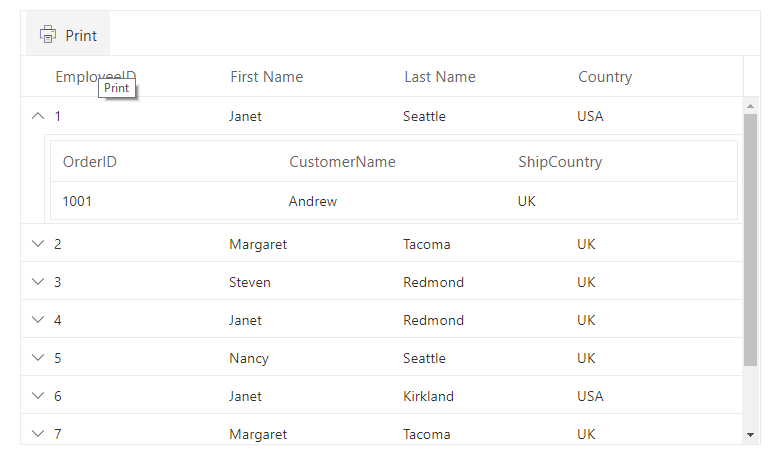
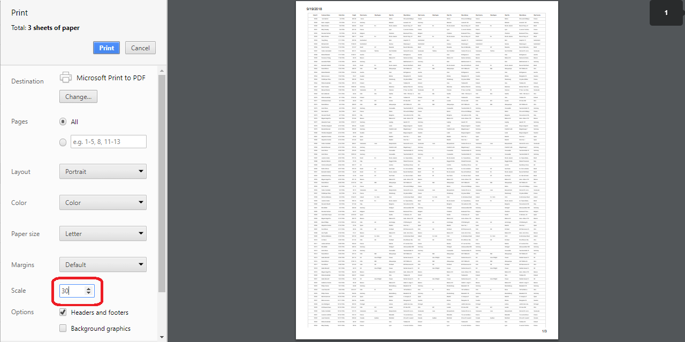

<!-- markdownlint-disable MD033 -->

# Print in Blazor DataGrid

The printing feature in the Syncfusion<sup style="font-size:70%">&reg;</sup> Blazor DataGrid generates a print-ready view of the DataGrid content for offline access and documentation. Printing can be initiated from the built-in toolbar command or programmatically using the [PrintAsync](https://help.syncfusion.com/cr/blazor/Syncfusion.Blazor.Grids.SfGrid-1.html#Syncfusion_Blazor_Grids_SfGrid_1_PrintAsync) method.

To add a print command to the toolbar, configure the [Toolbar](https://help.syncfusion.com/cr/blazor/Syncfusion.Blazor.Grids.SfGrid-1.html#Syncfusion_Blazor_Grids_SfGrid_1_Toolbar) property with the Print item. Selecting the toolbar item opens the browser’s print dialog.



@using Syncfusion.Blazor.Grids

<SfGrid DataSource="@Orders" Height="315" Toolbar="@(new List<object>() { "Print" })">
    <GridColumns>
        <GridColumn Field=@nameof(OrderData.OrderID) HeaderText="Order ID" TextAlign="TextAlign.Right" Width="140"></GridColumn>
        <GridColumn Field=@nameof(OrderData.CustomerID) HeaderText="Customer ID" Width="120"></GridColumn>
        <GridColumn Field=@nameof(OrderData.ShipCity) HeaderText="Ship City" Width="100"></GridColumn>
        <GridColumn Field=@nameof(OrderData.ShipName) HeaderText="Ship Name" Width="100"></GridColumn>
    </GridColumns>
</SfGrid>

@code {
  
    public List<OrderData> Orders { get; set; }

    protected override void OnInitialized()
    {
        Orders = OrderData.GetAllRecords();
    }   
}


    public class OrderData
    {
        public static List<OrderData> Orders = new List<OrderData>();
        public OrderData()
        {

        }
        public OrderData(int? OrderID,string CustomerID,string ShipCity,string ShipName)
        {
           this.OrderID = OrderID;
           this.CustomerID = CustomerID;
           this.ShipCity = ShipCity;
           this.ShipName = ShipName;
        }

        public static List<OrderData> GetAllRecords()
        {
            if (Orders.Count() == 0)
            {
                int code = 10;
                for (int i = 1; i < 2; i++)
                {
                    Orders.Add(new OrderData(10248, "VINET", "Reims", "Vins et alcools Cheval"));
                    Orders.Add(new OrderData(10249, "TOMSP", "Münster", "Toms Spezialitäten"));
                    Orders.Add(new OrderData(10250, "HANAR", "Rio de Janeiro", "Hanari Carnes"));
                    Orders.Add(new OrderData(10251, "VICTE", "Lyon", "Victuailles en stock"));
                    Orders.Add(new OrderData(10252, "SUPRD", "Charleroi", "Suprêmes délices"));
                    Orders.Add(new OrderData(10253, "HANAR", "Rio de Janeiro", "Hanari Carnes"));
                    Orders.Add(new OrderData(10254, "CHOPS", "Bern", "Chop-suey Chinese"));
                    Orders.Add(new OrderData(10255, "RICSU", "Genève", "Richter Supermarkt"));
                    Orders.Add(new OrderData(10256, "WELLI", "Resende", "Wellington Importado"));
                    code += 5;
                }
            }
            return Orders;
        }

        public int? OrderID { get; set; }
        public string CustomerID { get; set; }
        public string ShipCity { get; set; }
        public string ShipName { get; set; }
    }





## Page setup

Print layout, paper size, margins, headers/footers, and scaling are controlled by the browser’s print dialog and cannot be set from application code. Refer to browser-specific setup guides:

* [Chrome](https://support.google.com/chrome/answer/1069693?hl=en)
* [Firefox](https://support.mozilla.org/en-US/kb/how-print-web-pages-firefox)
* [Safari](https://www.mintprintables.com/print-tips/adjust-margins-osx/)
* [Internet Explorer](https://www.helpteaching.com/blog/)

## Print with an external button

Printing can be triggered from external UI by calling the DataGrid’s [PrintAsync](https://help.syncfusion.com/cr/blazor/Syncfusion.Blazor.Grids.SfGrid-1.html#Syncfusion_Blazor_Grids_SfGrid_1_PrintAsync) method.



@using Syncfusion.Blazor.Grids
@using Syncfusion.Blazor.Buttons

<SfButton Content="Print" OnClick="PrintContent"></SfButton>
<SfGrid @ref="DefaultGrid" DataSource="@Orders" >
    <GridColumns>
        <GridColumn Field=@nameof(OrderData.OrderID) HeaderText="Order ID" Width="120"></GridColumn>
        <GridColumn Field=@nameof(OrderData.CustomerID) HeaderText="Customer Name" Width="120"></GridColumn>
        <GridColumn Field=@nameof(OrderData.ShipCity) HeaderText="Ship City" Width="130"></GridColumn>
        <GridColumn Field=@nameof(OrderData.ShipName) HeaderText="Ship Name" Width="120"></GridColumn>
    </GridColumns>
</SfGrid>
@code 
{
    private SfGrid<OrderData> DefaultGrid;
    public List<OrderData> Orders{ get; set; }

    protected override void OnInitialized()
    {
        Orders = OrderData.GetAllRecords();
    }
    public void PrintContent()
    {
        this.DefaultGrid.PrintAsync();
    }
}


    public class OrderData
    {
        public static List<OrderData> Orders = new List<OrderData>();
        public OrderData()
        {

        }
        public OrderData(int? OrderID,string CustomerID,string ShipCity,string ShipName)
        {
           this.OrderID = OrderID;
           this.CustomerID = CustomerID;
           this.ShipCity = ShipCity;
           this.ShipName = ShipName;
        }
        public static List<OrderData> GetAllRecords()
        {
            if (Orders.Count() == 0)
            {
                int code = 10;
                for (int i = 1; i < 2; i++)
                {
                    Orders.Add(new OrderData(10248, "VINET", "Reims", "Vins et alcools Cheval"));
                    Orders.Add(new OrderData(10249, "TOMSP", "Münster", "Toms Spezialitäten"));
                    Orders.Add(new OrderData(10250, "HANAR", "Rio de Janeiro", "Hanari Carnes"));
                    Orders.Add(new OrderData(10251, "VICTE", "Lyon", "Victuailles en stock"));
                    Orders.Add(new OrderData(10252, "SUPRD", "Charleroi", "Suprêmes délices"));
                    Orders.Add(new OrderData(10253, "HANAR", "Rio de Janeiro", "Hanari Carnes"));
                    Orders.Add(new OrderData(10254, "CHOPS", "Bern", "Chop-suey Chinese"));
                    Orders.Add(new OrderData(10255, "RICSU", "Genève", "Richter Supermarkt"));
                    Orders.Add(new OrderData(10256, "WELLI", "Resende", "Wellington Importado"));
                    code += 5;
                }
            }
            return Orders;
        }
        public int? OrderID { get; set; }
        public string CustomerID { get; set; }
        public string ShipCity { get; set; }
        public string ShipName { get; set; }
    }





## Print visible page

By default, the Syncfusion Blazor DataGrid prints all pages. To print only the current page, set the [PrintMode](https://help.syncfusion.com/cr/blazor/Syncfusion.Blazor.Grids.PrintMode.html) property to `CurrentPage`. The toolbar Print command and PrintAsync respect the configured print mode.



@using Syncfusion.Blazor.Grids
@using Syncfusion.Blazor.DropDowns

<label>Select Print Mode: </label>
<SfDropDownList TValue="PrintMode" TItem="DropDownOrder" @bind-Value="@PrintMode" DataSource="@DropDownValue" Width="130px">
    <DropDownListFieldSettings Text="Text" Value="Value"></DropDownListFieldSettings>
    <DropDownListEvents ValueChange="OnValueChange" TValue="PrintMode" TItem="DropDownOrder"></DropDownListEvents>
</SfDropDownList>

<SfGrid @ref="Grid" DataSource="@Orders" Toolbar="@(new List<object>() { "Print" })" PrintMode="@PrintMode" AllowPaging="true">
    <GridPageSettings PageSize="6"></GridPageSettings>
    <GridColumns>
        <GridColumn Field=@nameof(OrderData.OrderID) HeaderText="Order ID" TextAlign="TextAlign.Right" Width="120"></GridColumn>
        <GridColumn Field=@nameof(OrderData.CustomerID) HeaderText="Customer Name" Width="120"></GridColumn>
        <GridColumn Field=@nameof(OrderData.ShipCity) HeaderText="Ship City" TextAlign="TextAlign.Right" Width="130" Type="ColumnType.Date"></GridColumn>
        <GridColumn Field=@nameof(OrderData.ShipName) HeaderText="Ship Name" TextAlign="TextAlign.Right" Width="120"></GridColumn>
    </GridColumns>
</SfGrid>
@code {
    private SfGrid<OrderData> Grid;
    public List<OrderData> Orders { get; set; }
    public PrintMode PrintMode { get; set; } = PrintMode.AllPages;
   
    protected override void OnInitialized()
    {
        Orders = OrderData.GetAllRecords();
    }
    public class DropDownOrder
    {
        public string Text { get; set; }
        public PrintMode Value { get; set; }
    }
    List<DropDownOrder> DropDownValue = new List<DropDownOrder>
    {
        new DropDownOrder() { Text = "All Pages", Value = PrintMode.AllPages },
        new DropDownOrder() { Text = "Current Page", Value = PrintMode.CurrentPage },

    };
    public void OnValueChange(ChangeEventArgs<PrintMode, DropDownOrder> Args)
    {
        PrintMode = Args.Value;
        Grid.Refresh();
    }
}


public class OrderData
    {
        public static List<OrderData> Orders = new List<OrderData>();   
        public OrderData()
        {

        }
        public OrderData(int? OrderID, string CustomerID, string ShipCity,string ShipName)
        {
            this.OrderID = OrderID;
            this.CustomerID = CustomerID;
            this.ShipCity = ShipCity;
            this.ShipName= ShipName;         
        }
        public static List<OrderData> GetAllRecords()
        {
            if (Orders.Count() == 0)
            {
                int code = 10;
                for (int i = 1; i < 3; i++)
                {
                    Orders.Add(new OrderData(10248, "ALFKI", "Reims", "Vins et alcools Chev"));
                    Orders.Add(new OrderData(10249, "ANANTR", "Münster", "Toms Spezialitäten"));
                    Orders.Add(new OrderData(10250, "ANTON", "Rio de Janeiro", "Hanari Carnes"));
                    Orders.Add(new OrderData(10251, "BLONP", "Lyon", "Victuailles en stock"));
                    Orders.Add(new OrderData(10252, "BOLID", "Charleroi", "Suprêmes délices"));
                    Orders.Add(new OrderData(10253, "ANTON", "Lyon", "Victuailles en stock"));
                    Orders.Add(new OrderData(10254, "BLONP", "Rio de Janeiro", "Hanari Carnes"));
                    Orders.Add(new OrderData(10255, "BOLID", "Münster", "Toms Spezialitäten"));
                    Orders.Add(new OrderData(10256, "ALFKI", "Reims", "Vins et alcools Chev"));                   
                    code += 5;
                }
            }
            return Orders;
        }
        public int? OrderID { get; set; }
        public string CustomerID { get; set; }
        public string ShipCity { get; set; }
        public string ShipName { get; set; }
    }





<!-- Print the hierarchy datagrid

By default, the datagrid will print the master and expanded child grids alone. You can change the print option by using the [`HierarchyPrintMode`](https://help.syncfusion.com/cr/blazor/Syncfusion.Blazor.Charts.ChartSeries.html#Syncfusion_Blazor_Charts_ChartSeries_Type) property of the Grid component. The available options are,

Mode |Behavior
-----|-----
Expanded |Prints the master datagrid with expanded child grids.
All |Prints the master datagrid with all the child grids.
None |Prints the master datagrid alone.

This is demonstrated in the below sample code,

```cshtml
@using Syncfusion.Blazor.Grids

@{
    GridModel<object> ChildGridData = new GridModel<object>()
    {
        DataSource = Orders,
        QueryString = "EmployeeID",
        Columns = new List<GridColumn> {
            new GridColumn() { Field="OrderID", HeaderText="OrderID", Width="110" },
            new GridColumn() { Field="CustomerName", HeaderText="CustomerName", Width="110"},
            new GridColumn() { Field="ShipCountry", HeaderText="ShipCountry", Width="110" }
        }
    };
}
<SfGrid DataSource="@Employees" Toolbar="@(new List<object>() { "Print" })" HierarchyPrintMode=HierarchyGridPrintMode.Expanded ChildGrid="ChildGridData" Height="315px">
    <GridColumns>
        <GridColumn Field=@nameof(EmployeeData.EmployeeID) HeaderText="EmployeeID" Width="110"> </GridColumn>
        <GridColumn Field=@nameof(EmployeeData.FirstName) HeaderText="First Name" Width="110"> </GridColumn>
        <GridColumn Field=@nameof(EmployeeData.City) HeaderText="Last Name" Width="110"></GridColumn>
        <GridColumn Field=@nameof(EmployeeData.Country) HeaderText="Country" Width="110"></GridColumn>
    </GridColumns>
</SfGrid>

@code{
    public List<EmployeeData> Employees { get; set; }

    public List<Order> Orders { get; set; }

    protected override void OnInitialized()
    {
        Employees = Enumerable.Range(1, 9).Select(x => new EmployeeData()
        {
            EmployeeID = x,
            FirstName = (new string[] { "Nancy", "Andrew", "Janet", "Margaret", "Steven" })[new Random().Next(5)],
            City = (new string[] { "Seattle", "Tacoma", "Redmond", "Kirkland", "London" })[new Random().Next(5)],
            Country = (new string[] { "USA", "UK" })[new Random().Next(2)],
        }).ToList();

        Orders = Enumerable.Range(1, 9).Select(x => new Order()
        {
            EmployeeID = x,
            OrderID = 1000 + x,
            CustomerName = (new string[] { "Nancy", "Andrew" })[new Random().Next(2)],
            ShipCountry = (new string[] { "USA", "UK" })[new Random().Next(2)],
        }).ToList();
    }

    public class EmployeeData
    {
        public int? EmployeeID { get; set; }
        public string FirstName { get; set; }
        public string LastName { get; set; }
        public string Title { get; set; }
        public DateTime? HireDate { get; set; }
        public string City { get; set; }
        public string Country { get; set; }
    }

    public class Order
    {
        public int? EmployeeID { get; set; }
        public int? OrderID { get; set; }
        public string CustomerName { get; set; }
        public string ShipCountry { get; set; }
    }
}
```

The following image represents Hierarchial Grid with print toolbar item,
 -->

## Print large number of columns

When printing a DataGrid with many columns, the browser’s default page size (for example, A4) may not fit all columns. The print preview may hide overflowed content. Adjust the scale in the browser print dialog or choose landscape orientation to fit more columns within the printable area.



<!-- Show or hide columns while Printing

You can show a hidden column or hide a visible column while printing the datagrid using ToolbarClick and PrintComplete events.

In the ToolbarClick event, we can show or hide columns by modifying the Visible property value of the GridColumn component.

Then in the PrintComplete event, we can reverse the state back to the previous state.

In the below example, we have **CustomerID** as a hidden column in the datagrid. While printing, we have changed **CustomerID** to visible column and **Freight** as hidden column.

```cshtml
@using Syncfusion.Blazor.Grids
@using Syncfusion.Blazor.Navigations

<SfGrid DataSource="@Orders" Toolbar="@(new List<object>() { "Print" })" PrintMode=PrintMode.CurrentPage AllowPaging="true">
    <GridEvents PrintComplete="OnPrintComplete" OnToolbarClick="ToolbarClicked" TValue="Order"></GridEvents>
    <GridPageSettings PageSize="8"></GridPageSettings>
    <GridColumns>
        <GridColumn Field=@nameof(Order.OrderID) HeaderText="Order ID" TextAlign="TextAlign.Right" Width="120"></GridColumn>
        <GridColumn Field=@nameof(Order.CustomerID) HeaderText="Customer Name" Visible="@CustomerIDVisibility" Width="120"></GridColumn>
        <GridColumn Field=@nameof(Order.OrderDate) HeaderText=" Order Date" Format="d" TextAlign="TextAlign.Right" Width="130" Type="ColumnType.Date"></GridColumn>
        <GridColumn Field=@nameof(Order.Freight) HeaderText="Freight" Format="C2" TextAlign="TextAlign.Right" Visible="@FreightVisibility" Width="120"></GridColumn>
    </GridColumns>
</SfGrid>

@code{

    public List<Order> Orders { get; set; }

    public bool CustomerIDVisibility = false;

    public bool FreightVisibility = true;

    protected override void OnInitialized()
    {
        Orders = Enumerable.Range(1, 75).Select(x => new Order()
        {
            OrderID = 1000 + x,
            CustomerID = (new string[] { "ALFKI", "ANANTR", "ANTON", "BLONP", "BOLID" })[new Random().Next(5)],
            Freight = 2.1 * x,
            OrderDate = DateTime.Now.AddDays(-x),
        }).ToList();
    }

    public class Order
    {
        public int? OrderID { get; set; }
        public string CustomerID { get; set; }
        public DateTime? OrderDate { get; set; }
        public double? Freight { get; set; }
    }

    public void ToolbarClicked(ClickEventArgs args)
    {
        this.CustomerIDVisibility = true;
        this.FreightVisibility = false;
    }

    public void OnPrintComplete(args)
    {
        this.CustomerIDVisibility = false;
        this.FreightVisibility = true;
    }
}
``` -->

## Limitations of printing large data

Printing a large volume of data in a single page can cause browser performance issues because rendering many DOM elements may slow or hang the page. The DataGrid supports virtualization for on-screen rendering; however, row and column virtualization are not applied to printed output.

For large datasets that must be shared or printed, exporting to [Excel](https://blazor.syncfusion.com/documentation/datagrid/excel-exporting), [CSV](https://blazor.syncfusion.com/documentation/datagrid/excel-exporting), or [PDF](https://blazor.syncfusion.com/documentation/datagrid/pdf-export) is recommended, and the exported document can be printed using native applications.

> The printed output reflects the current DataGrid state (such as visible columns, sorting, and filtering) at the time printing is initiated.

N> Refer to the [Blazor DataGrid](https://www.syncfusion.com/blazor-components/blazor-datagrid) feature tour for a broad overview. Explore the [Blazor DataGrid example](https://blazor.syncfusion.com/demos/datagrid/overview?theme=bootstrap5) to understand data presentation and manipulation.