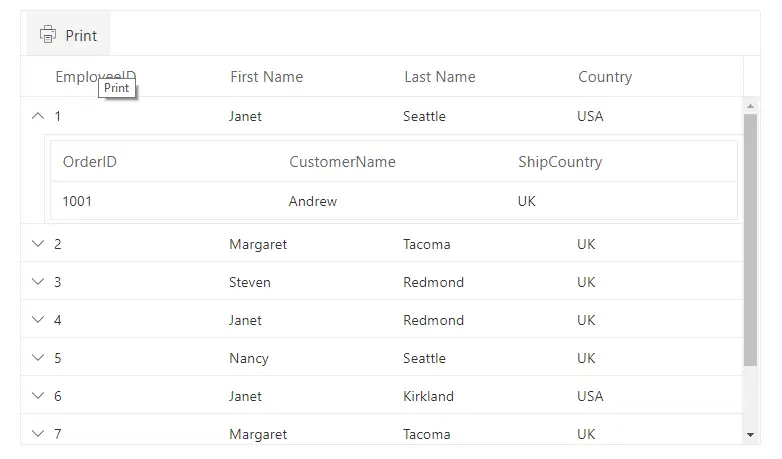

<!-- markdownlint-disable MD033 -->

# Print in Blazor Data Grid

The **Print** feature in the [Blazor DataGrid](https://www.syncfusion.com/blazor-components/blazor-datagrid) generates a print-ready view of DataGrid content for offline access or documentation purposes. Printing can be initiated through the built-in toolbar option or programmatically using the [PrintAsync](https://help.syncfusion.com/cr/blazor/Syncfusion.Blazor.Grids.SfGrid-1.html#Syncfusion_Blazor_Grids_SfGrid_1_PrintAsync) method. The print output reflects the DataGrid's current state, including visible columns, sorting, and filtering, and opens the browser's print dialog.

To enable printing from the toolbar, add the **"Print"** item to the [Toolbar](https://help.syncfusion.com/cr/blazor/Syncfusion.Blazor.Grids.SfGrid-1.html#Syncfusion_Blazor_Grids_SfGrid_1_Toolbar) property.



@using Syncfusion.Blazor.Grids

<SfGrid DataSource="@Orders" Height="315" Toolbar="@(new List<string>() { "Print" })">
    <GridColumns>
        <GridColumn Field=@nameof(OrderData.OrderID) HeaderText="Order ID" TextAlign="TextAlign.Right" Width="140"></GridColumn>
        <GridColumn Field=@nameof(OrderData.CustomerID) HeaderText="Customer ID" Width="120"></GridColumn>
        <GridColumn Field=@nameof(OrderData.ShipCity) HeaderText="Ship City" Width="100"></GridColumn>
        <GridColumn Field=@nameof(OrderData.ShipName) HeaderText="Ship Name" Width="100"></GridColumn>
    </GridColumns>
</SfGrid>

@code {
    private List<OrderData> Orders { get; set; }

    protected override void OnInitialized()
    {
        Orders = OrderData.GetAllRecords();
    }   
}




public class OrderData
{
    private static readonly List<OrderData> Data = new();

    public OrderData(int orderID, string customerID, string shipCity, string shipName)
    {
        OrderID = orderID;
        CustomerID = customerID;
        ShipCity = shipCity;
        ShipName = shipName;
    }

    public static List<OrderData> GetAllRecords()
    {
        if (Data.Count == 0)
        {
            Data.Add(new OrderData(10248, "VINET", "Reims", "Vins et alcools Cheval"));
            Data.Add(new OrderData(10249, "TOMSP", "Münster", "Toms Spezialitäten"));
            Data.Add(new OrderData(10250, "HANAR", "Rio de Janeiro", "Hanari Carnes"));
            Data.Add(new OrderData(10251, "VICTE", "Lyon", "Victuailles en stock"));
            Data.Add(new OrderData(10252, "SUPRD", "Charleroi", "Suprêmes délices"));
            Data.Add(new OrderData(10253, "HANAR", "Rio de Janeiro", "Hanari Carnes"));
            Data.Add(new OrderData(10254, "CHOPS", "Bern", "Chop-suey Chinese"));
            Data.Add(new OrderData(10255, "RICSU", "Genève", "Richter Supermarkt"));
            Data.Add(new OrderData(10256, "WELLI", "Resende", "Wellington Importado"));
        }
        return Data;
    }

    public int OrderID { get; set; }
    public string CustomerID { get; set; }
    public string ShipCity { get; set; }
    public string ShipName { get; set; }
}






## Page setup for printing

Print layout options such as **paper size**, **margins**, **headers** and **footers**, and **scaling** are controlled by the browser’s print dialog. These settings cannot be configured through **application code**. Refer to browser-specific setup guides:

* [Chrome](https://support.google.com/chrome/answer/1069693?hl=en)
* [Firefox](https://support.mozilla.org/en-US/kb/how-print-web-pages-firefox)
* [Safari](https://www.mintprintables.com/print-tips/adjust-margins-osx/)
* [Edge](https://support.microsoft.com/en-us/edge/print-in-microsoft-edge)

## Print programmatically

The [PrintAsync](https://help.syncfusion.com/cr/blazor/Syncfusion.Blazor.Grids.SfGrid-1.html#Syncfusion_Blazor_Grids_SfGrid_1_PrintAsync) method enables printing through external UI elements or custom triggers. The DataGrid component must have a reference created using the `@ref` directive to call `PrintAsync`. Calling `PrintAsync` opens the browser's print dialog and prints the current state of the DataGrid, including visible columns, sorting, and filtering.

This approach provides flexibility to integrate printing into custom workflows or toolbar actions beyond built-in options.



@using Syncfusion.Blazor.Grids
@using Syncfusion.Blazor.Buttons

<SfButton Content="Print" OnClick="PrintContent"></SfButton>
<SfGrid @ref="DefaultGrid" DataSource="@Orders">
    <GridColumns>
        <GridColumn Field=@nameof(OrderData.OrderID) HeaderText="Order ID" Width="120"></GridColumn>
        <GridColumn Field=@nameof(OrderData.CustomerID) HeaderText="Customer Name" Width="120"></GridColumn>
        <GridColumn Field=@nameof(OrderData.ShipCity) HeaderText="Ship City" Width="130"></GridColumn>
        <GridColumn Field=@nameof(OrderData.ShipName) HeaderText="Ship Name" Width="120"></GridColumn>
    </GridColumns>
</SfGrid>

@code {
    private SfGrid<OrderData> DefaultGrid;
    private List<OrderData> Orders { get; set; }

    protected override void OnInitialized()
    {
        Orders = OrderData.GetAllRecords();
    }

    private async Task PrintContent()
    {
        await DefaultGrid.PrintAsync();
    }
}




public class OrderData
{
    private static readonly List<OrderData> Data = new();

    public OrderData(int orderID, string customerID, string shipCity, string shipName)
    {
        OrderID = orderID;
        CustomerID = customerID;
        ShipCity = shipCity;
        ShipName = shipName;
    }

    public static List<OrderData> GetAllRecords()
    {
        if (Data.Count == 0)
        {
            Data.Add(new OrderData(10248, "VINET", "Reims", "Vins et alcools Cheval"));
            Data.Add(new OrderData(10249, "TOMSP", "Münster", "Toms Spezialitäten"));
            Data.Add(new OrderData(10250, "HANAR", "Rio de Janeiro", "Hanari Carnes"));
            Data.Add(new OrderData(10251, "VICTE", "Lyon", "Victuailles en stock"));
            Data.Add(new OrderData(10252, "SUPRD", "Charleroi", "Suprêmes délices"));
            Data.Add(new OrderData(10253, "HANAR", "Rio de Janeiro", "Hanari Carnes"));
            Data.Add(new OrderData(10254, "CHOPS", "Bern", "Chop-suey Chinese"));
            Data.Add(new OrderData(10255, "RICSU", "Genève", "Richter Supermarkt"));
            Data.Add(new OrderData(10256, "WELLI", "Resende", "Wellington Importado"));
        }
        return Data;
    }

    public int OrderID { get; set; }
    public string CustomerID { get; set; }
    public string ShipCity { get; set; }
    public string ShipName { get; set; }
}






## Print only the visible page

By default, the Blazor DataGrid prints all pages of the dataset. To print only the currently visible page, set the [PrintMode](https://help.syncfusion.com/cr/blazor/Syncfusion.Blazor.Grids.PrintMode.html) property to **CurrentPage**. The `PrintMode` property applies when [AllowPaging](https://help.syncfusion.com/cr/blazor/Syncfusion.Blazor.Grids.SfGrid-1.html#Syncfusion_Blazor_Grids_SfGrid_1_AllowPaging) is enabled. Configuration works with the built-in toolbar print option and the programmatic [PrintAsync](https://help.syncfusion.com/cr/blazor/Syncfusion.Blazor.Grids.SfGrid-1.html#Syncfusion_Blazor_Grids_SfGrid_1_PrintAsync) method.

**Available print modes**

- **PrintMode.AllPages**: Prints the entire dataset across all pages. This is the default behavior.
- **PrintMode.CurrentPage**: Prints only the data displayed on the current page.



@using Syncfusion.Blazor.Grids
@using Syncfusion.Blazor.DropDowns

<label>Select Print Mode: </label>
<SfDropDownList TValue="PrintMode" TItem="DropDownOrder" @bind-Value="@PrintMode" DataSource="@DropDownValue" Width="130px">
    <DropDownListFieldSettings Text="Text" Value="Value"></DropDownListFieldSettings>
    <DropDownListEvents ValueChange="OnValueChange" TValue="PrintMode" TItem="DropDownOrder"></DropDownListEvents>
</SfDropDownList>

<SfGrid @ref="Grid" DataSource="@Orders" Toolbar="@(new List<string>() { "Print" })" PrintMode="@PrintMode" AllowPaging="true">
    <GridPageSettings PageSize="6"></GridPageSettings>
    <GridColumns>
        <GridColumn Field=@nameof(OrderData.OrderID) HeaderText="Order ID" TextAlign="TextAlign.Right" Width="120"></GridColumn>
        <GridColumn Field=@nameof(OrderData.CustomerID) HeaderText="Customer Name" Width="120"></GridColumn>
        <GridColumn Field=@nameof(OrderData.ShipCity) HeaderText="Ship City" TextAlign="TextAlign.Right" Width="130"></GridColumn>
        <GridColumn Field=@nameof(OrderData.ShipName) HeaderText="Ship Name" TextAlign="TextAlign.Right" Width="120"></GridColumn>
    </GridColumns>
</SfGrid>

@code {
    private SfGrid<OrderData> Grid;
    private List<OrderData> Orders { get; set; }
    private PrintMode PrintMode { get; set; } = PrintMode.AllPages;
   
    protected override void OnInitialized()
    {
        Orders = OrderData.GetAllRecords();
    }

    private sealed class DropDownOrder
    {
        public string Text { get; set; }
        public PrintMode Value { get; set; }
    }

    private List<DropDownOrder> DropDownValue = new()
    {
        new DropDownOrder { Text = "All Pages", Value = PrintMode.AllPages },
        new DropDownOrder { Text = "Current Page", Value = PrintMode.CurrentPage },
    };

    private void OnValueChange(ChangeEventArgs<PrintMode, DropDownOrder> Args)
    {
        PrintMode = Args.Value;
        Grid.Refresh();
    }
}




public class OrderData
{
    private static readonly List<OrderData> Data = new();

    public OrderData(int orderID, string customerID, string shipCity, string shipName)
    {
        OrderID = orderID;
        CustomerID = customerID;
        ShipCity = shipCity;
        ShipName = shipName;
    }

    public static List<OrderData> GetAllRecords()
    {
        if (Data.Count == 0)
        {
            Data.Add(new OrderData(10248, "ALFKI", "Reims", "Vins et alcools Chev"));
            Data.Add(new OrderData(10249, "ANANTR", "Münster", "Toms Spezialitäten"));
            Data.Add(new OrderData(10250, "ANTON", "Rio de Janeiro", "Hanari Carnes"));
            Data.Add(new OrderData(10251, "BLONP", "Lyon", "Victuailles en stock"));
            Data.Add(new OrderData(10252, "BOLID", "Charleroi", "Suprêmes délices"));
            Data.Add(new OrderData(10253, "ANTON", "Lyon", "Victuailles en stock"));
            Data.Add(new OrderData(10254, "BLONP", "Rio de Janeiro", "Hanari Carnes"));
            Data.Add(new OrderData(10255, "BOLID", "Münster", "Toms Spezialitäten"));
            Data.Add(new OrderData(10256, "ALFKI", "Reims", "Vins et alcools Chev"));
        }
        return Data;
    }

    public int OrderID { get; set; }
    public string CustomerID { get; set; }
    public string ShipCity { get; set; }
    public string ShipName { get; set; }
}






<!-- Print the hierarchy datagrid

By default, the datagrid will print the master and expanded child grids alone. You can change the print option by using the [`HierarchyPrintMode`](https://help.syncfusion.com/cr/blazor/Syncfusion.Blazor.Charts.ChartSeries.html#Syncfusion_Blazor_Charts_ChartSeries_Type) property of the Grid component. The available options are,

Mode |Behavior
-----|-----
Expanded |Prints the master datagrid with expanded child grids.
All |Prints the master datagrid with all the child grids.
None |Prints the master datagrid alone.

This is demonstrated in the below sample code,

```cshtml
@using Syncfusion.Blazor.Grids

@{
    GridModel<object> ChildGridData = new GridModel<object>()
    {
        DataSource = Orders,
        QueryString = "EmployeeID",
        Columns = new List<GridColumn> {
            new GridColumn() { Field="OrderID", HeaderText="OrderID", Width="110" },
            new GridColumn() { Field="CustomerName", HeaderText="CustomerName", Width="110"},
            new GridColumn() { Field="ShipCountry", HeaderText="ShipCountry", Width="110" }
        }
    };
}
<SfGrid DataSource="@Employees" Toolbar="@(new List<object>() { "Print" })" HierarchyPrintMode=HierarchyGridPrintMode.Expanded ChildGrid="ChildGridData" Height="315px">
    <GridColumns>
        <GridColumn Field=@nameof(EmployeeData.EmployeeID) HeaderText="EmployeeID" Width="110"> </GridColumn>
        <GridColumn Field=@nameof(EmployeeData.FirstName) HeaderText="First Name" Width="110"> </GridColumn>
        <GridColumn Field=@nameof(EmployeeData.City) HeaderText="Last Name" Width="110"></GridColumn>
        <GridColumn Field=@nameof(EmployeeData.Country) HeaderText="Country" Width="110"></GridColumn>
    </GridColumns>
</SfGrid>

@code{
    public List<EmployeeData> Employees { get; set; }

    public List<Order> Orders { get; set; }

    protected override void OnInitialized()
    {
        Employees = Enumerable.Range(1, 9).Select(x => new EmployeeData()
        {
            EmployeeID = x,
            FirstName = (new string[] { "Nancy", "Andrew", "Janet", "Margaret", "Steven" })[new Random().Next(5)],
            City = (new string[] { "Seattle", "Tacoma", "Redmond", "Kirkland", "London" })[new Random().Next(5)],
            Country = (new string[] { "USA", "UK" })[new Random().Next(2)],
        }).ToList();

        Orders = Enumerable.Range(1, 9).Select(x => new Order()
        {
            EmployeeID = x,
            OrderID = 1000 + x,
            CustomerName = (new string[] { "Nancy", "Andrew" })[new Random().Next(2)],
            ShipCountry = (new string[] { "USA", "UK" })[new Random().Next(2)],
        }).ToList();
    }

    public class EmployeeData
    {
        public int? EmployeeID { get; set; }
        public string FirstName { get; set; }
        public string LastName { get; set; }
        public string Title { get; set; }
        public DateTime? HireDate { get; set; }
        public string City { get; set; }
        public string Country { get; set; }
    }

    public class Order
    {
        public int? EmployeeID { get; set; }
        public int? OrderID { get; set; }
        public string CustomerName { get; set; }
        public string ShipCountry { get; set; }
    }
}
```

The following image represents Hierarchial Grid with print toolbar item,
 -->

## Printing a large number of columns

When printing a Blazor DataGrid that contains a large number of columns, the default browser page size (such as A4) may not have enough space to display all columns. Some columns may be hidden in the print preview or printed output.

To fit more columns on a single printed page:

- Switch to **landscape orientation** in the browser's print dialog.
- Adjust the **scale setting** to reduce content size and fit more columns on the page.

These settings ensure visibility of all columns for wide grids.


<!-- Show or hide columns while Printing

You can show a hidden column or hide a visible column while printing the datagrid using ToolbarClick and PrintComplete events.

In the ToolbarClick event, we can show or hide columns by modifying the Visible property value of the GridColumn component.

Then in the PrintComplete event, we can reverse the state back to the previous state.

In the below example, we have **CustomerID** as a hidden column in the datagrid. While printing, we have changed **CustomerID** to visible column and **Freight** as hidden column.

```cshtml
@using Syncfusion.Blazor.Grids
@using Syncfusion.Blazor.Navigations

<SfGrid DataSource="@Orders" Toolbar="@(new List<object>() { "Print" })" PrintMode=PrintMode.CurrentPage AllowPaging="true">
    <GridEvents PrintComplete="OnPrintComplete" OnToolbarClick="ToolbarClicked" TValue="Order"></GridEvents>
    <GridPageSettings PageSize="8"></GridPageSettings>
    <GridColumns>
        <GridColumn Field=@nameof(Order.OrderID) HeaderText="Order ID" TextAlign="TextAlign.Right" Width="120"></GridColumn>
        <GridColumn Field=@nameof(Order.CustomerID) HeaderText="Customer Name" Visible="@CustomerIDVisibility" Width="120"></GridColumn>
        <GridColumn Field=@nameof(Order.OrderDate) HeaderText=" Order Date" Format="d" TextAlign="TextAlign.Right" Width="130" Type="ColumnType.Date"></GridColumn>
        <GridColumn Field=@nameof(Order.Freight) HeaderText="Freight" Format="C2" TextAlign="TextAlign.Right" Visible="@FreightVisibility" Width="120"></GridColumn>
    </GridColumns>
</SfGrid>

@code{

    public List<Order> Orders { get; set; }

    public bool CustomerIDVisibility = false;

    public bool FreightVisibility = true;

    protected override void OnInitialized()
    {
        Orders = Enumerable.Range(1, 75).Select(x => new Order()
        {
            OrderID = 1000 + x,
            CustomerID = (new string[] { "ALFKI", "ANANTR", "ANTON", "BLONP", "BOLID" })[new Random().Next(5)],
            Freight = 2.1 * x,
            OrderDate = DateTime.Now.AddDays(-x),
        }).ToList();
    }

    public class Order
    {
        public int? OrderID { get; set; }
        public string CustomerID { get; set; }
        public DateTime? OrderDate { get; set; }
        public double? Freight { get; set; }
    }

    public void ToolbarClicked(ClickEventArgs args)
    {
        this.CustomerIDVisibility = true;
        this.FreightVisibility = false;
    }

    public void OnPrintComplete(args)
    {
        this.CustomerIDVisibility = false;
        this.FreightVisibility = true;
    }
}
``` -->

## Limitations of printing large data

Printing a large volume of data in a single page may cause performance issues. Rendering many rows and columns simultaneously can slow down the browser or cause it to become unresponsive.

The DataGrid uses `virtualization` to improve performance during on-screen rendering. However, virtualization for rows and columns is not feasible during printing because all data must be rendered at once, which increases browser load.

To avoid performance issues when printing large datasets, consider exporting the data to a supported format:

- [Excel Export](https://blazor.syncfusion.com/documentation/datagrid/excel-exporting) — Includes CSV export as part of Excel export functionality
- [PDF Export](https://blazor.syncfusion.com/documentation/datagrid/pdf-export)
 
These formats can be printed using desktop applications, which offer better control over layout and performance.

N> Refer to the [Blazor DataGrid](https://www.syncfusion.com/blazor-components/blazor-datagrid) feature tour for a broad overview. Explore the [Blazor DataGrid example](https://blazor.syncfusion.com/demos/datagrid/overview?theme=fluent2) to understand data presentation and manipulation.