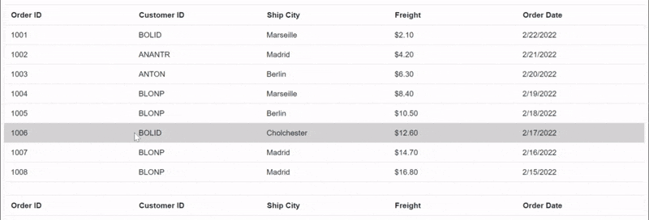
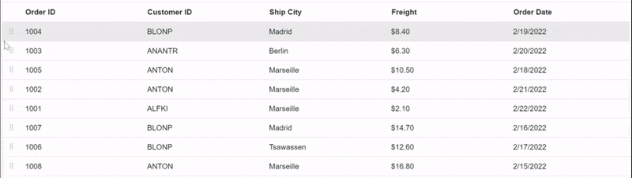

# Row Drag and Drop in Blazor DataGrid Component

The grid row drag and drop allows you to drag and drop grid rows to another grid or custom component. To enable row drag and drop, set the [AllowRowDragAndDrop](https://help.syncfusion.com/cr/blazor/Syncfusion.Blazor.Grids.SfGrid-1.html#Syncfusion_Blazor_Grids_SfGrid_1_AllowRowDragAndDrop) to true. The target component where the grid rows are to be dropped can be set by using the [TargetID](https://help.syncfusion.com/cr/blazor/Syncfusion.Blazor.Grids.GridRowDropSettings.html#Syncfusion_Blazor_Grids_GridRowDropSettings_TargetID).

```cshtml
@using Syncfusion.Blazor.Grids

<SfGrid DataSource="@Orders" id="Grid"  AllowSelection="true"  AllowRowDragAndDrop="true">
    <GridRowDropSettings TargetID="DestGrid"></GridRowDropSettings>
    <GridSelectionSettings Type="Syncfusion.Blazor.Grids.SelectionType.Multiple"></GridSelectionSettings>
    <GridColumns>
        <GridColumn Field=@nameof(Order.OrderID) HeaderText="Order ID" Width="110" IsPrimaryKey="true"> </GridColumn>
        <GridColumn Field=@nameof(Order.CustomerID) HeaderText="Customer ID" Width="110"></GridColumn>
        <GridColumn Field=@nameof(Order.ShipCity) HeaderText="Ship City" Width="110"></GridColumn>
        <GridColumn Field=@nameof(Order.Freight) HeaderText="Freight" Format="C2" Width="110"></GridColumn>
        <GridColumn Field=@nameof(Order.OrderDate) HeaderText="Order Date" Format="d" Width="110" Type="ColumnType.Date"></GridColumn>
    </GridColumns>
</SfGrid>
<br>
<SfGrid DataSource="@SecondGrid"  id="DestGrid" AllowRowDragAndDrop="true" AllowSelection="true">
    <GridRowDropSettings TargetID="Grid"></GridRowDropSettings>
    <GridSelectionSettings Type="Syncfusion.Blazor.Grids.SelectionType.Multiple"></GridSelectionSettings>
    <GridColumns>
        <GridColumn Field=@nameof(Order.OrderID) HeaderText="Order ID" Width="110" IsPrimaryKey="true"> </GridColumn>
        <GridColumn Field=@nameof(Order.CustomerID) HeaderText="Customer ID" Width="110"></GridColumn>
        <GridColumn Field=@nameof(Order.ShipCity) HeaderText="Ship City" Width="110"></GridColumn>
        <GridColumn Field=@nameof(Order.Freight) HeaderText="Freight" Format="C2" Width="110"></GridColumn>
        <GridColumn Field=@nameof(Order.OrderDate) HeaderText="Order Date" Format="d" Width="110" Type="ColumnType.Date"></GridColumn>
    </GridColumns>
</SfGrid>


@code {

    public List<Order> Orders { get; set; }
    public List<Order> SecondGrid { get; set; } = new List<Order>();

    protected override void OnInitialized()
    {
        Orders = Enumerable.Range(1, 8).Select(x => new Order()
        {
            OrderID = 1000 + x,
            CustomerID = (new string[] { "ALFKI", "ANANTR", "ANTON", "BLONP", "BOLID" })[new Random().Next(5)],
            ShipCity = (new string[] { "Berlin", "Madrid", "Cholchester", "Marseille", "Tsawassen" })[new Random().Next(5)],
            Freight = 2.1 * x,
            OrderDate = DateTime.Now.AddDays(-x),
        }).ToList();
    }

    public class Order
    {
        public int? OrderID { get; set; }
        public string CustomerID { get; set; }
        public string ShipCity { get; set; }
        public DateTime? OrderDate { get; set; }
        public double? Freight { get; set; }
    }
}
```



N> * Selection feature must be enabled for row drag and drop.
<br/> * Multiple rows can be selected by clicking and dragging inside the grid. For multiple row selection, the [Type](https://help.syncfusion.com/cr/blazor/Syncfusion.Blazor.Grids.GridSelectionSettings.html#Syncfusion_Blazor_Grids_GridSelectionSettings_Type) property must be set to multiple.

## Drag and drop within Grid

The grid row drag and drop allows you to drag and drop grid rows on the same grid using drag icon. To enable row drag and drop, set the [AllowRowDragAndDrop](https://help.syncfusion.com/cr/blazor/Syncfusion.Blazor.Grids.SfGrid-1.html#Syncfusion_Blazor_Grids_SfGrid_1_AllowRowDragAndDrop) to true.

```cshtml
@using Syncfusion.Blazor.Grids

<SfGrid DataSource="@Orders" id="Grid"  AllowSelection="true"  AllowRowDragAndDrop="true">
 <GridSelectionSettings Type="Syncfusion.Blazor.Grids.SelectionType.Multiple"></GridSelectionSettings>
    <GridColumns>
        <GridColumn Field=@nameof(Order.OrderID) HeaderText="Order ID" Width="110" IsPrimaryKey="true"> </GridColumn>
        <GridColumn Field=@nameof(Order.CustomerID) HeaderText="Customer ID" Width="110"></GridColumn>
        <GridColumn Field=@nameof(Order.ShipCity) HeaderText="Ship City" Width="110"></GridColumn>
        <GridColumn Field=@nameof(Order.Freight) HeaderText="Freight" Format="C2" Width="110"></GridColumn>
        <GridColumn Field=@nameof(Order.OrderDate) HeaderText="Order Date" Format="d" Width="110" Type="ColumnType.Date"></GridColumn>
    </GridColumns>
</SfGrid>

@code {

    public List<Order> Orders { get; set; }
    public List<Order> SecondGrid { get; set; } = new List<Order>();

    protected override void OnInitialized()
    {
        Orders = Enumerable.Range(1, 8).Select(x => new Order()
        {
            OrderID = 1000 + x,
            CustomerID = (new string[] { "ALFKI", "ANANTR", "ANTON", "BLONP", "BOLID" })[new Random().Next(5)],
            ShipCity = (new string[] { "Berlin", "Madrid", "Cholchester", "Marseille", "Tsawassen" })[new Random().Next(5)],
            Freight = 2.1 * x,
            OrderDate = DateTime.Now.AddDays(-x),
        }).ToList();
    }

    public class Order
    {
        public int? OrderID { get; set; }
        public string CustomerID { get; set; }
        public string ShipCity { get; set; }
        public DateTime? OrderDate { get; set; }
        public double? Freight { get; set; }
    }
}
```



## Drag and Drop Between Two Grids with Different TValues

The DataGrid row drag and drop feature allow to drag and drop grid rows between two grids that have different TValues. When TargetID property of GridRowDropSettings is defined, drag and drop within Grid cannot be performed. Handle the `RowDropped` event to perform operations when rows are dropped. In the RowDropped event handler, dropped records details can be accessed and manipulate the records as per the dropped Grid datatype.

Following a code example to how to implement drag and drop between two grids with different TValues using the between two DataGrid component.



@using Syncfusion.Blazor.Grids

<SfGrid @ref="OriginGrid" DataSource="@OriginDataSource" ID="OriginGrid" AllowSelection="true" Width="700" AllowRowDragAndDrop="true">
    <GridRowDropSettings TargetID="DestGrid"></GridRowDropSettings>
    <GridEvents RowDropped="OrderDropped" TValue="OrderData"></GridEvents>
    <GridSelectionSettings Type="Syncfusion.Blazor.Grids.SelectionType.Multiple"></GridSelectionSettings>
    <GridColumns>
        <GridColumn Field=@nameof(OrderData.OrderID) HeaderText="Order ID" TextAlign="TextAlign.Right" IsPrimaryKey="true" Width="120"></GridColumn>
        <GridColumn Field=@nameof(OrderData.CustomerID) HeaderText="Customer Name" Width="150"></GridColumn>
        <GridColumn Field=@nameof(OrderData.OrderDate) HeaderText="Order Date" Format="d" Type="ColumnType.Date" TextAlign="TextAlign.Right" Width="130"></GridColumn>
        <GridColumn Field=@nameof(OrderData.Freight) HeaderText="Freight" Format="C2" TextAlign="TextAlign.Right" Width="120"></GridColumn>
        <GridColumn Field=@nameof(OrderData.ShippedDate) HeaderText="Shipped Date" Format="d" Type="ColumnType.Date" TextAlign="TextAlign.Right" Width="150"></GridColumn>
        <GridColumn Field=@nameof(OrderData.ShipCountry) HeaderText="Ship Country" Visible="false" Width="150"></GridColumn>
        <GridColumn Field=@nameof(OrderData.ShipCity) HeaderText="Ship City" Visible="false" Width="150"></GridColumn>
    </GridColumns>
</SfGrid>
<br>
<SfGrid @ref="DestGrid" DataSource="@DestDataSource" ID="DestGrid" AllowRowDragAndDrop="true" Width="700" AllowSelection="true">
    <GridRowDropSettings TargetID="OriginGrid"></GridRowDropSettings>
    <GridEvents RowDropped="EmployeeDropped" TValue="OrdersDetails"></GridEvents>
    <GridSelectionSettings Type="Syncfusion.Blazor.Grids.SelectionType.Multiple"></GridSelectionSettings>
    <GridColumns>
        <GridColumn Field=@nameof(OrdersDetails.ID) HeaderText="ID" TextAlign="TextAlign.Right" Width="110" IsPrimaryKey="true"> </GridColumn>
        <GridColumn Field=@nameof(OrdersDetails.Name) HeaderText="Name" Width="110"></GridColumn>
        <GridColumn Field=@nameof(OrdersDetails.OrderDate) HeaderText="Date" Format="d" Type="ColumnType.Date" TextAlign="TextAlign.Right" Width="110"></GridColumn>
        <GridColumn Field=@nameof(OrdersDetails.Freight) HeaderText="Shipment" TextAlign="TextAlign.Right" Format="C2" Width="110"></GridColumn>
        <GridColumn Field=@nameof(OrdersDetails.ShippedDate) HeaderText="ShipedDate" Format="d" Width="110" TextAlign="TextAlign.Right" Type="ColumnType.Date"></GridColumn>
        <GridColumn Field=@nameof(OrdersDetails.City) HeaderText="City" Visible="false" Width="150"></GridColumn>
        <GridColumn Field=@nameof(OrdersDetails.Country) HeaderText="Country" Visible="false" Width="150"></GridColumn>
    </GridColumns>
</SfGrid>
@code {
    SfGrid<OrderData> OriginGrid { get; set; }
    SfGrid<OrdersDetails> DestGrid { get; set; }
    public List<OrderData> OriginDataSource { get; set; }
    public List<OrdersDetails> DestDataSource { get; set; } = new List<OrdersDetails>();

    protected override void OnInitialized()
    {
        OriginDataSource = OrderData.GetAllRecords();
    }

    public async Task OrderDropped(RowDroppedEventArgs<OrderData> Args)
    {
        foreach (var val in Args.Data)
        {
            DestDataSource.Add(new OrdersDetails() { ID = val.OrderID, Name = val.CustomerID, Freight = val.Freight, OrderDate = val.OrderDate, City = val.ShipCity, ShippedDate = val.ShippedDate, Country = val.ShipCountry });
        }
        await DestGrid.Refresh();
    }
    public async Task EmployeeDropped(RowDroppedEventArgs<OrdersDetails> Args)
    {
        foreach (var val in Args.Data)
        {
            OriginDataSource.Add(new OrderData() { OrderID = val.ID, CustomerID = val.Name, Freight = val.Freight, OrderDate = val.OrderDate, ShipCity = val.City, ShipCountry = val.Country, ShippedDate = val.ShippedDate });
        }
        await OriginGrid.Refresh();
    }
}


 public class OrderData
 {
     public static List<OrderData> Orders = new List<OrderData>();
     public OrderData()
     {

     }
     public OrderData(int? OrderID, string CustomerID, string ShipCountry, double Freight, DateTime OrderDate, DateTime ShippedDate, string ShipCity)
     {
         this.OrderID = OrderID;
         this.CustomerID = CustomerID;
         this.ShipCountry = ShipCountry;
         this.Freight = Freight;
         this.OrderDate = OrderDate;
         this.ShippedDate = ShippedDate;
         this.ShipCity = ShipCity;
     }
     public static List<OrderData> GetAllRecords()
     {
         if (Orders.Count() == 0)
         {
             int code = 10;
             for (int i = 1; i < 2; i++)
             {
                 Orders.Add(new OrderData(10248, "ALFKI", "France", 33.33, new DateTime(1996, 07, 07), new DateTime(1996, 08, 07), "Reims"));
                 Orders.Add(new OrderData(10249, "ANANTR", "Germany", 89.76, new DateTime(1996, 07, 12), new DateTime(1996, 08, 08), "Münster"));
                 Orders.Add(new OrderData(10250, "ANTON", "Brazil", 78.67, new DateTime(1996, 07, 13), new DateTime(1996, 08, 09), "Rio de Janeiro"));
                 Orders.Add(new OrderData(10251, "BLONP", "Belgium", 55.65, new DateTime(1996, 07, 14), new DateTime(1996, 08, 10), "Lyon"));
                 Orders.Add(new OrderData(10252, "BOLID", "Venezuela", 11.09, new DateTime(1996, 07, 15), new DateTime(1996, 08, 11), "Charleroi"));
                 Orders.Add(new OrderData(10253, "BLONP", "Venezuela", 98.98, new DateTime(1996, 07, 16), new DateTime(1996, 08, 12), "Lyon"));
                 Orders.Add(new OrderData(10254, "ANTON", "Belgium", 78.75, new DateTime(1996, 07, 17), new DateTime(1996, 08, 13), "Rio de Janeiro"));
                 Orders.Add(new OrderData(10255, "ANANTR", "Germany", 44.07, new DateTime(1996, 07, 18), new DateTime(1996, 08, 14), "Münster"));
                 Orders.Add(new OrderData(10256, "ALFKI", "France", 67.74, new DateTime(1996, 07, 19), new DateTime(1996, 08, 15), "Reims"));
                 code += 5;
             }
         }
         return Orders;
    }
     public int? OrderID { get; set; }
     public string CustomerID { get; set; }
     public DateTime? OrderDate { get; set; }
     public DateTime? ShippedDate { get; set; }
     public string ShipCountry { get; set; }
     public double Freight { get; set; }
     public string ShipCity { get; set; }
}


public class OrdersDetails
{
    public OrdersDetails()
    {

    }
    public OrdersDetails(int? ID, string Name, double Freight, DateTime OrderDate, DateTime ShippedDate, string City, string Country)
    {
        this.ID = ID;
        this.Name = Name;
        this.Freight = Freight;
        this.OrderDate = OrderDate;
        this.ShippedDate = ShippedDate;
        this.City = City;
        this.Country = Country;
    }
    public int? ID { get; set; }
    public string Name { get; set; }
    public double Freight { get; set; }
    public DateTime? OrderDate { get; set; }
    public DateTime? ShippedDate { get; set; }
    public string City { get; set; }
    public string Country { get; set; }
}





## Drag and drop events

The following events are triggered while drag and drop the grid rows.

`RowDragStarting`  - Triggers when starts to drag the grid row.<br/>
`RowDropped`  -  Triggers when a drag element is dropped on the target element.<br/>
`RowDropping` - Triggers when the dragged elements are being dropped on the target element.

N> For performing row drag and drop action on the datagrid, any one of the columns should be defined as a primary key using the [IsPrimaryKey](https://help.syncfusion.com/cr/blazor/Syncfusion.Blazor.Grids.GridColumn.html#Syncfusion_Blazor_Grids_GridColumn_IsPrimaryKey) property.

## Limitations

* Multiple rows can be drag and drop in the row selections basis.
* Single row is able to drag and drop in same grid without enable the row selection.
* Row drag and drop feature is not having built in support with sorting, filtering, hierarchy grid, row template and grouping features of grid.