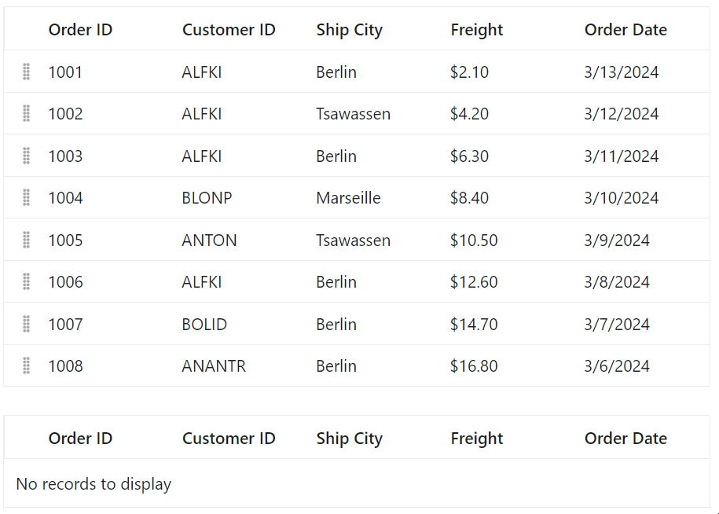

# Row Drag and Drop in Blazor DataGrid Component

The grid row drag and drop allows you to drag and drop grid rows to another grid or custom component. To enable row drag and drop, set the [AllowRowDragAndDrop](https://help.syncfusion.com/cr/blazor/Syncfusion.Blazor.Grids.SfGrid-1.html#Syncfusion_Blazor_Grids_SfGrid_1_AllowRowDragAndDrop) to true. The target component where the grid rows are to be dropped can be set by using the [TargetID](https://help.syncfusion.com/cr/blazor/Syncfusion.Blazor.Grids.GridRowDropSettings.html#Syncfusion_Blazor_Grids_GridRowDropSettings_TargetID).

```cshtml
@using Syncfusion.Blazor.Grids

<SfGrid DataSource="@Orders" id="Grid"  AllowSelection="true"  AllowRowDragAndDrop="true">
    <GridRowDropSettings TargetID="DestGrid"></GridRowDropSettings>
    <GridSelectionSettings Type="Syncfusion.Blazor.Grids.SelectionType.Multiple"></GridSelectionSettings>
    <GridColumns>
        <GridColumn Field=@nameof(Order.OrderID) HeaderText="Order ID" Width="110" IsPrimaryKey="true"> </GridColumn>
        <GridColumn Field=@nameof(Order.CustomerID) HeaderText="Customer ID" Width="110"></GridColumn>
        <GridColumn Field=@nameof(Order.ShipCity) HeaderText="Ship City" Width="110"></GridColumn>
        <GridColumn Field=@nameof(Order.Freight) HeaderText="Freight" Format="C2" Width="110"></GridColumn>
        <GridColumn Field=@nameof(Order.OrderDate) HeaderText="Order Date" Format="d" Width="110" Type="ColumnType.Date"></GridColumn>
    </GridColumns>
</SfGrid>
<br>
<SfGrid DataSource="@SecondGrid"  id="DestGrid" AllowRowDragAndDrop="true" AllowSelection="true">
    <GridRowDropSettings TargetID="Grid"></GridRowDropSettings>
    <GridSelectionSettings Type="Syncfusion.Blazor.Grids.SelectionType.Multiple"></GridSelectionSettings>
    <GridColumns>
        <GridColumn Field=@nameof(Order.OrderID) HeaderText="Order ID" Width="110" IsPrimaryKey="true"> </GridColumn>
        <GridColumn Field=@nameof(Order.CustomerID) HeaderText="Customer ID" Width="110"></GridColumn>
        <GridColumn Field=@nameof(Order.ShipCity) HeaderText="Ship City" Width="110"></GridColumn>
        <GridColumn Field=@nameof(Order.Freight) HeaderText="Freight" Format="C2" Width="110"></GridColumn>
        <GridColumn Field=@nameof(Order.OrderDate) HeaderText="Order Date" Format="d" Width="110" Type="ColumnType.Date"></GridColumn>
    </GridColumns>
</SfGrid>


@code {

    public List<Order> Orders { get; set; }
    public List<Order> SecondGrid { get; set; } = new List<Order>();

    protected override void OnInitialized()
    {
        Orders = Enumerable.Range(1, 8).Select(x => new Order()
        {
            OrderID = 1000 + x,
            CustomerID = (new string[] { "ALFKI", "ANANTR", "ANTON", "BLONP", "BOLID" })[new Random().Next(5)],
            ShipCity = (new string[] { "Berlin", "Madrid", "Cholchester", "Marseille", "Tsawassen" })[new Random().Next(5)],
            Freight = 2.1 * x,
            OrderDate = DateTime.Now.AddDays(-x),
        }).ToList();
    }

    public class Order
    {
        public int? OrderID { get; set; }
        public string CustomerID { get; set; }
        public string ShipCity { get; set; }
        public DateTime? OrderDate { get; set; }
        public double? Freight { get; set; }
    }
}
```



N> * Selection feature must be enabled for row drag and drop.
<br/> * Multiple rows can be selected by clicking and dragging inside the grid. For multiple row selection, the [Type](https://help.syncfusion.com/cr/blazor/Syncfusion.Blazor.Grids.GridSelectionSettings.html#Syncfusion_Blazor_Grids_GridSelectionSettings_Type) property must be set to multiple.

## Drag and drop within Grid

The grid row drag and drop allows you to drag and drop grid rows on the same grid using drag icon. To enable row drag and drop, set the [AllowRowDragAndDrop](https://help.syncfusion.com/cr/blazor/Syncfusion.Blazor.Grids.SfGrid-1.html#Syncfusion_Blazor_Grids_SfGrid_1_AllowRowDragAndDrop) to true.

```cshtml
@using Syncfusion.Blazor.Grids

<SfGrid DataSource="@Orders" id="Grid"  AllowSelection="true"  AllowRowDragAndDrop="true">
 <GridSelectionSettings Type="Syncfusion.Blazor.Grids.SelectionType.Multiple"></GridSelectionSettings>
    <GridColumns>
        <GridColumn Field=@nameof(Order.OrderID) HeaderText="Order ID" Width="110" IsPrimaryKey="true"> </GridColumn>
        <GridColumn Field=@nameof(Order.CustomerID) HeaderText="Customer ID" Width="110"></GridColumn>
        <GridColumn Field=@nameof(Order.ShipCity) HeaderText="Ship City" Width="110"></GridColumn>
        <GridColumn Field=@nameof(Order.Freight) HeaderText="Freight" Format="C2" Width="110"></GridColumn>
        <GridColumn Field=@nameof(Order.OrderDate) HeaderText="Order Date" Format="d" Width="110" Type="ColumnType.Date"></GridColumn>
    </GridColumns>
</SfGrid>

@code {

    public List<Order> Orders { get; set; }
    public List<Order> SecondGrid { get; set; } = new List<Order>();

    protected override void OnInitialized()
    {
        Orders = Enumerable.Range(1, 8).Select(x => new Order()
        {
            OrderID = 1000 + x,
            CustomerID = (new string[] { "ALFKI", "ANANTR", "ANTON", "BLONP", "BOLID" })[new Random().Next(5)],
            ShipCity = (new string[] { "Berlin", "Madrid", "Cholchester", "Marseille", "Tsawassen" })[new Random().Next(5)],
            Freight = 2.1 * x,
            OrderDate = DateTime.Now.AddDays(-x),
        }).ToList();
    }

    public class Order
    {
        public int? OrderID { get; set; }
        public string CustomerID { get; set; }
        public string ShipCity { get; set; }
        public DateTime? OrderDate { get; set; }
        public double? Freight { get; set; }
    }
}
```


## Grouping via Drag and drop within Grid.

The grid row drag and drop allows you to rearrange the rows from one group to another group on the same grid using drag icon. To enable Grouping feature within row drag and drop set the [AllowGrouping](https://help.syncfusion.com/cr/blazor/Syncfusion.Blazor.Grids.SfGrid-1.html#Syncfusion_Blazor_Grids_SfGrid_1_AllowGrouping) to true.

When dragging rows from one group and dropping them into another group, the rows are inserted into the dropped group based on the column sorting order.

```cshtml
@using Syncfusion.Blazor.Grids

<SfGrid @ref="Grid" DataSource="@GridData" Height="600" AllowRowDragAndDrop="true" id="Grid" AllowSelection="true" AllowGrouping="true" AllowSorting="true" Width="70%">
    <GridSelectionSettings Type="Syncfusion.Blazor.Grids.SelectionType.Multiple"></GridSelectionSettings>   
    <GridColumns>
        <GridColumn Field=@nameof(Order.OrderID) HeaderText="Order ID" IsPrimaryKey="true" Width="150"></GridColumn>
        <GridColumn Field=@nameof(Order.CustomerID) HeaderText="Customer Name" Width="150"></GridColumn>
        <GridColumn Field=@nameof(Order.OrderDate) HeaderText=" Order Date" Format="d" Type="ColumnType.Date" TextAlign="TextAlign.Right" Width="130"></GridColumn>
        <GridColumn Field=@nameof(Order.Freight) HeaderText="Freight" Format="C2" TextAlign="TextAlign.Right" Width="120"></GridColumn>
    </GridColumns>
</SfGrid>

@code {
    public List<Order> GridData { get; set; }
    public List<Order> SecondGrid { get; set; } = new List<Order>();
    SfGrid<Order> Grid { get; set; }
    protected override void OnInitialized()
    {
        List<Order> Order = new List<Order>();
        int Code = 10000;
        for (int i = 1; i < 15; i++)
        {
            Order.Add(new Order(Code + 1, "ALFKI", 2.3 * i, new DateTime(1991, 05, 15)));
            Order.Add(new Order(Code + 2, "ANATR", 3.3 * i, new DateTime(1990, 04, 04)));
            Order.Add(new Order(Code + 3, "ANTON", 4.3 * i, new DateTime(1957, 11, 30)));
            Order.Add(new Order(Code + 4, "BLONP", 5.3 * i, new DateTime(1930, 10, 22)));
            Order.Add(new Order(Code + 5, "BOLID", 6.3 * i, new DateTime(1953, 02, 18)));
            Code += 5;
        }
        GridData = Order;
    }

    public class Order
    {
        public Order(int OrderID, string CustomerID, double Freight, DateTime OrderDate)
        {
            this.OrderID = OrderID;
            this.CustomerID = CustomerID;
            this.Freight = Freight;
            this.OrderDate = OrderDate;

        }
        public int? OrderID { get; set; }
        public string CustomerID { get; set; }
        public double? Freight { get; set; }
        public DateTime? OrderDate { get; set; }

    }
}
```


## Drag and drop events

The following events are triggered while drag and drop the grid rows.

`RowDragStarting`  - Triggers when starts to drag the grid row.<br/>
`RowDropped`  -  Triggers when a drag element is dropped on the target element.<br/>
`RowDropping` - Triggers when the dragged elements are being dropped on the target element.

N> For performing row drag and drop action on the datagrid, any one of the columns should be defined as a primary key using the [IsPrimaryKey](https://help.syncfusion.com/cr/blazor/Syncfusion.Blazor.Grids.GridColumn.html#Syncfusion_Blazor_Grids_GridColumn_IsPrimaryKey) property.

## Limitations

* Multiple rows can be drag and drop in the row selections basis.
* Single row is able to drag and drop in same grid without enable the row selection.
* Row drag and drop feature is not having built in support with sorting, filtering, hierarchy grid, row template and grouping features of grid.
* Grouping via row drag-and-drop feature lacks support for lazyload grouping.