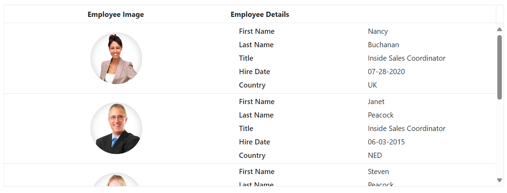

# Row Template in Blazor DataGrid

The [RowTemplate](https://help.syncfusion.com/cr/blazor/Syncfusion.Blazor.Grids.GridTemplates.html#Syncfusion_Blazor_Grids_GridTemplates_RowTemplate) feature in the Syncfusion&reg; Blazor DataGrid allows you to fully customize the appearance and layout of each row. This feature is particularly helpful when you need to display complex content within rows, such as images, buttons, or additional interactive controls, rather than just plain text or simple values.

To enable and configure the `RowTemplate` feature in Grid, follow these steps:

1. **Set up the RowTemplate:** Use the `RowTemplate` to define custom row layouts.

2. **Define Row Layout using GridTemplates Component:** The `RowTemplate` content must be wrapped within the [GridTemplates](https://blazor.syncfusion.com/documentation/datagrid/templates#gridtemplates-component), with each row template containing the same number of **<td>** elements as the columns defined in the Grid. This ensures alignment across rows.

3. **Template Configuration:** For detailed guidance on configuring templates, review the [templates](https://blazor.syncfusion.com/documentation/datagrid/templates#templates) documentation, which covers essential steps for adding custom templates.

To know about **Row Template** in Grid, you can check this video.



The example below shows how to set up a Row Template in Grid to display an employee information with employee photo in the first column and employee details like Name, Address, etc., are presented in the second column for each row.




@using Syncfusion.Blazor.Grids

<SfGrid @ref="Grid" DataSource="@Employees" AllowSelection="true" Height="315px">
    <GridTemplates>
        <RowTemplate Context="emp">
            @{
                var employee = (emp as EmployeeData);

                <td class="photo">
                    
                </td>
                <td class="details">
                    <table class="CardTable" cellpadding="3" cellspacing="2">
                        <colgroup>
                            <col width="50%">
                            <col width="50%">
                        </colgroup>
                        <tbody>
                            <tr>
                                <td class="CardHeader">First Name </td>
                                <td>@employee.FirstName </td>
                            </tr>
                            <tr>
                                <td class="CardHeader">Last Name</td>
                                <td>@employee.LastName </td>
                            </tr>
                            <tr>
                                <td class="CardHeader">
                                    Title
                                </td>
                                <td>
                                    @employee.Title
                                </td>
                            </tr>
                            <tr>
                                <td class="CardHeader">
                                    Country
                                </td>
                                <td>
                                    @employee.Country
                                </td>
                            </tr>
                        </tbody>
                    </table>
                </td>
            }
        </RowTemplate>
    </GridTemplates>
    <GridColumns>
        <GridColumn HeaderText="Employee Image" Width="250" TextAlign="TextAlign.Center"> </GridColumn>
        <GridColumn HeaderText="Employee Details" Width="300" TextAlign="TextAlign.Left"></GridColumn>
    </GridColumns>
</SfGrid>

@code {
    private SfGrid<EmployeeData> Grid;
    public List<EmployeeData> Employees { get; set; }

    protected override void OnInitialized()
    {
        Employees = EmployeeData.GetAllRecords();
    }

}





public class EmployeeData
{
    public static List<EmployeeData> Employees = new List<EmployeeData>();

    public EmployeeData() { }

    public EmployeeData(int EmployeeID, string FirstName, string LastName, string Title, string Country)
    {
        this.EmployeeID = EmployeeID;
        this.FirstName = FirstName;
        this.LastName = LastName;
        this.Title = Title;
        this.Country = Country;
    }

    public static List<EmployeeData> GetAllRecords()
    {
        if (Employees.Count == 0)
        {
            var firstNames = new string[] { "Nancy", "Andrew", "Janet", "Margaret", "Steven" };
            var lastNames = new string[] { "Davolio", "Fuller", "Leverling", "Peacock", "Buchanan" };
            var titles = new string[] { "Sales Representative", "Vice President, Sales", "Sales Manager", "Inside Sales Coordinator" };
            var countries = new string[] { "USA", "UK", "UAE", "NED", "BER" };

            Random random = new Random();
            for (int i = 1; i <= 5; i++)
            {
                Employees.Add(new EmployeeData(
                    i,
                    firstNames[random.Next(firstNames.Length)],
                    lastNames[random.Next(lastNames.Length)],
                    titles[random.Next(titles.Length)],
                    countries[random.Next(countries.Length)]
                ));
            }
        }
        return Employees;
    }

    public int EmployeeID { get; set; }
    public string? FirstName { get; set; }
    public string? LastName { get; set; }
    public string? Title { get; set; }
    public string? Country { get; set; }
}




## Row template with formatting

Typically, the Syncfusion&reg; Blazor DataGrid columns can be formatted using the [Columns.Format](https://help.syncfusion.com/cr/blazor/Syncfusion.Blazor.Grids.ColumnModel.html#Syncfusion_Blazor_Grids_ColumnModel_Format) property, which formats values displayed in each column. However, when you use row templates, the `Columns.Format` property does not apply to values displayed within the template.

To format values inside a row template, define a global function that applies the desired formatting. This global function can then be called within the row template to format values, such as dates, currency, or custom text layouts, according to your specific requirements.

For example, to format date values within a row template, create a global function that applies a [Custom DateTime](https://docs.microsoft.com/en-us/dotnet/standard/base-types/custom-date-and-time-format-strings) format to ensure the desired format is displayed consistently in the Grid.

Here is an example of how to define a global formatting function for a date column and use it inside a rowTemplate:




@using Syncfusion.Blazor.Grids

<SfGrid @ref="Grid" DataSource="@Employees" AllowSelection="true" Height="315px">
    <GridTemplates>
        <RowTemplate Context="emp">
            @{
                var employee = (emp as EmployeeData);

                <td class="photo">
                    
                </td>
                <td class="details">
                    <table class="CardTable" cellpadding="3" cellspacing="2">
                        <colgroup>
                            <col width="50%">
                            <col width="50%">
                        </colgroup>
                        <tbody>
                            <tr>
                                <td class="CardHeader">First Name </td>
                                <td>@employee.FirstName </td>
                            </tr>
                            <tr>
                                <td class="CardHeader">Last Name</td>
                                <td>@employee.LastName </td>
                            </tr>
                            <tr>
                                <td class="CardHeader">
                                    Title
                                </td>
                                <td>
                                    @employee.Title
                                </td>
                            </tr>
                            <tr>
                                <td class="CardHeader">
                                    Hire Date
                                </td>
                                <td>
                                    @employee.HireDate.ToString("MM/dd/yyyy")
                                </td>
                            </tr>
                            <tr>
                                <td class="CardHeader">
                                    Country
                                </td>
                                <td>
                                    @employee.Country
                                </td>
                            </tr>
                        </tbody>
                    </table>
                </td>
            }
        </RowTemplate>
    </GridTemplates>
    <GridColumns>
        <GridColumn HeaderText="Employee Image" Width="250" TextAlign="TextAlign.Center"> </GridColumn>
        <GridColumn HeaderText="Employee Details" Width="300" TextAlign="TextAlign.Left"></GridColumn>
    </GridColumns>
</SfGrid>

@code {
    private SfGrid<EmployeeData> Grid;
    public List<EmployeeData> Employees { get; set; }

    protected override void OnInitialized()
    {
        Employees = EmployeeData.GetAllRecords();
    }

}





public class EmployeeData
{
    public static List<EmployeeData> Employees = new List<EmployeeData>();

    public EmployeeData() { }

    public EmployeeData(int EmployeeID, string FirstName, string LastName, string Title, string Country, DateTime HireDate)
    {
        this.EmployeeID = EmployeeID;
        this.FirstName = FirstName;
        this.LastName = LastName;
        this.Title = Title;
        this.Country = Country;
        this.HireDate = HireDate;
    }

    public static List<EmployeeData> GetAllRecords()
    {
        if (Employees.Count == 0)
        {
            var firstNames = new string[] { "Nancy", "Andrew", "Janet", "Margaret", "Steven" };
            var lastNames = new string[] { "Davolio", "Fuller", "Leverling", "Peacock", "Buchanan" };
            var titles = new string[] { "Sales Representative", "Vice President, Sales", "Sales Manager", "Inside Sales Coordinator" };
            var countries = new string[] { "USA", "UK", "UAE", "NED", "BER" };

            Random random = new Random();
            for (int i = 1; i <= 5; i++)
            {
                Employees.Add(new EmployeeData(
                    i,
                    firstNames[random.Next(firstNames.Length)],
                    lastNames[random.Next(lastNames.Length)],
                    titles[random.Next(titles.Length)],
                    countries[random.Next(countries.Length)],
                    DateTime.Now.AddDays(-random.Next(1000, 5000)) // Random hire date between 3-14 years ago.
                ));
            }
        }
        return Employees;
    }

    public int EmployeeID { get; set; }
    public string? FirstName { get; set; }
    public string? LastName { get; set; }
    public string? Title { get; set; }
    public string? Country { get; set; }
    public DateTime HireDate { get; set; }
}




## Render Syncfusion&reg; control in row template

The Syncfusion&reg; Blazor DataGrid allows you to render custom Syncfusion&reg; controls within the rows of the Grid. This feature is helpful as it enables you to display interactive Syncfusion&reg; controls instead of field values in the Grid.

To enable a Syncfusion&reg; control in a row template, you need to set the `RowTemplate` property of the Grid. This property accepts a custom HTML template that defines the layout for each row.

Here is an example that demonstrates rendering a [Chip](https://blazor.syncfusion.com/documentation/chip/getting-started-with-web-app) for **OrderID**, a [NumericTextBox](https://blazor.syncfusion.com/documentation/numeric-textbox/getting-started) for **Quantity**, a [DatePicker](https://blazor.syncfusion.com/documentation/datepicker/getting-started) for **OrderDate**, and a [DropDownList](https://blazor.syncfusion.com/documentation/dropdown-list/getting-started) for **OrderStatus** within a row template:




@using Syncfusion.Blazor.Grids
@using Syncfusion.Blazor.Buttons
@using Syncfusion.Blazor.Inputs
@using Syncfusion.Blazor.Calendars
@using Syncfusion.Blazor.DropDowns

<SfGrid @ref="Grid" DataSource="@Orders">
    <GridTemplates>
        <RowTemplate Context="order">
            @{
                var data = (OrderData)order;
            }

            <td class="rows">
                <SfChip Width="50">
                    <ChipItems>
                        <ChipItem Text="@data.OrderID.ToString()"></ChipItem>
                    </ChipItems>
                </SfChip>
            </td>
            <td class="rows">
                <SfNumericTextBox TValue="int" @bind-Value="data.Quantity" Min="0" Max="10" Width="150"></SfNumericTextBox>
            </td>
            <td class="rows">
                @data.ShipAddress
            </td>
            <td class="rows">
                <SfDatePicker TValue="DateTime" @bind-Value="data.OrderDate" Width="150"></SfDatePicker>
            </td>
            <td class="rows">
                <SfDropDownList TValue="string" TItem="string" DataSource="@DropData" @bind-Value="data.OrderStatus" Placeholder="Select Status" Width="150">
                    <DropDownListFieldSettings Value="Text" Text="Text"></DropDownListFieldSettings>
                </SfDropDownList>
            </td>
        </RowTemplate>
    </GridTemplates>
    <GridColumns>
        <GridColumn Field=@nameof(OrderData.OrderID) HeaderText="Order ID" Width="120"></GridColumn>
        <GridColumn Field=@nameof(OrderData.Quantity) HeaderText="Quantity" Width="170"></GridColumn>
        <GridColumn Field=@nameof(OrderData.ShipAddress) HeaderText="Ship Address" Width="170"></GridColumn>
        <GridColumn Field=@nameof(OrderData.OrderDate) HeaderText="Order Date" Format="dd/MM/yyyy hh:mm tt" Width="120" Type="Syncfusion.Blazor.Grids.ColumnType.DateTime"></GridColumn>
        <GridColumn Field=@nameof(OrderData.OrderStatus) HeaderText="Order Status" Width="120"></GridColumn>
    </GridColumns>
</SfGrid>

@code {
    private SfGrid<OrderData> Grid;
    public List<OrderData> Orders { get; set; }
    public List<string> DropData { get; set; } = new List<string> { "Order Placed", "Processing", "Delivered" };

    protected override void OnInitialized()
    {
        Orders = OrderData.GetAllRecords();
    }
}





public class OrderData
{
    public static List<OrderData> Orders = new List<OrderData>();

    public OrderData() { }

    public OrderData(int? orderId, string customerId, double freight, string title, string orderStatus,
                      int quantity, DateTime orderDate, string shipAddress)
    {
        OrderID = orderId;
        CustomerID = customerId;
        Freight = freight;
        Title = title;
        OrderStatus = orderStatus;
        Quantity = quantity;
        OrderDate = orderDate;
        ShipAddress = shipAddress;
    }

    public static List<OrderData> GetAllRecords()
    {
        if (Orders.Count == 0)
        {
            int code = 10;
            for (int i = 1; i < 2; i++)
            {
                Orders.Add(new OrderData(10248, "Nancy", 32.14, "Sales Representative", "Order Placed", 5, DateTime.Now.AddDays(-10), "123 Main St, City A"));
                Orders.Add(new OrderData(10249, "Andrew", 33.33, "Vice President, Sales", "Processing", 10, DateTime.Now.AddDays(-8), "456 Oak St, City B"));
                Orders.Add(new OrderData(10250, "Janet", 56.78, "Sales Manager", "Delivered", 15, DateTime.Now.AddDays(-6), "789 Pine St, City C"));
                Orders.Add(new OrderData(10251, "Margaret", 43.34, "Inside Sales Coordinator", "Delivered", 20, DateTime.Now.AddDays(-4), "101 Maple Ave, City D"));
                Orders.Add(new OrderData(10252, "Steven", 17.98, "Sales Manager", "Delivered", 12, DateTime.Now.AddDays(-2), "202 Birch Rd, City E"));
                Orders.Add(new OrderData(10253, "Michael", 53.33, "Sales Representative", "Processing", 8, DateTime.Now, "303 Elm Dr, City F"));
                Orders.Add(new OrderData(10254, "Robert", 78.99, "Vice President, Sales", "Delivered", 25, DateTime.Now.AddDays(1), "404 Cedar St, City G"));
                Orders.Add(new OrderData(10255, "Anne", 46.66, "Inside Sales Coordinator", "Order Placed", 30, DateTime.Now.AddDays(2), "505 Walnut St, City H"));
                Orders.Add(new OrderData(10256, "Laura", 98.76, "Sales Manager", "Delivered", 18, DateTime.Now.AddDays(3), "606 Ash Blvd, City I"));
                code += 5;
            }
        }
        return Orders;
    }

    public int? OrderID { get; set; }
    public string CustomerID { get; set; }
    public double Freight { get; set; }
    public string Title { get; set; }
    public string OrderStatus { get; set; }
    public int Quantity { get; set; }
    public DateTime OrderDate { get; set; }
    public string ShipAddress { get; set; }
}






## Render Syncfusion&reg; Chart in row template

The Syncfusion&reg; Blazor DataGrid provides the flexibility to include custom controls, such as a Chart, within the rows of the Grid. This feature enhances Grid interactivity by allowing graphical representations of data instead of plain text.

To render a Syncfusion&reg; Blazor Chart within a row template of the Grid, use the [RowTemplate](https://help.syncfusion.com/cr/blazor/Syncfusion.Blazor.Grids.GridTemplates.html#Syncfusion_Blazor_Grids_GridTemplates_RowTemplate) property. This property accepts a HTML template that defines the layout for each row, enabling rich data visualization directly inside the Grid.

Here is an example that demonstrates rendering Syncfusion&reg; Chart within a row template:



@page "/"
@using Syncfusion.Blazor.Grids
@using Syncfusion.Blazor.Charts
<SfGrid @ref="Grid" DataSource="@Orders" AllowSelection="true" Height="400px">
    <GridTemplates>
        <RowTemplate Context="emp">
            @{
                var order = emp as Order;
            }
            <td class="details">
                <table class="CardTable" cellpadding="3" cellspacing="2">
                    <tbody>
                        <tr>
                            <td class="CardHeader">Customer ID</td>
                            <td>@order.CustomerID</td>
                        </tr>
                        <tr>
                            <td class="CardHeader">Freight</td>
                            <td>@order.Freight</td>
                        </tr>
                        <tr>
                            <td class="CardHeader">Order Date</td>
                            <td>@order.OrderDate?.ToShortDateString()</td>
                        </tr>
                    </tbody>
                </table>
            </td>
            <td class="chart">
                <SfChart Width="100%" Height="200px">
                    <ChartPrimaryXAxis ValueType="Syncfusion.Blazor.Charts.ValueType.Category"></ChartPrimaryXAxis>
                    <ChartSeriesCollection>
                        <ChartSeries DataSource="@GetChartData(order.OrderID)" XName="Category" 
                            YName="Value" Type="Syncfusion.Blazor.Charts.ChartSeriesType.Column">
                        </ChartSeries>
                    </ChartSeriesCollection>
                </SfChart>
            </td>
        </RowTemplate>
    </GridTemplates>
    <GridColumns>
        <GridColumn HeaderText="Order Details" Width="50%"></GridColumn>
        <GridColumn HeaderText="Chart" Width="50%"></GridColumn>
    </GridColumns>
</SfGrid>

@code {
    public List<Order> Orders { get; set; }
    SfGrid<Order> Grid;

    protected override void OnInitialized()
    {
        Orders = Enumerable.Range(1, 5).Select(x => new Order()
        {
            OrderID = 1000 + x,
            CustomerID = (new string[] { "ALFKI", "ANANTR", "ANTON", "BLONP", "BOLID" })[new Random().Next(5)],
            Freight = 2.1 * x,
            OrderDate = DateTime.Now.AddDays(-x),
        }).ToList();
    }
    public class Order
    {
        public int OrderID { get; set; }
        public string CustomerID { get; set; }
        public DateTime? OrderDate { get; set; }
        public double? Freight { get; set; }
    }
    public class ChartData
    {
        public string Category { get; set; }
        public double Value { get; set; }
    }

    private List<ChartData> GetChartData(int orderId)
    {
        // Simulated data per row (can vary by orderId if needed).
        return new List<ChartData>
        {
            new ChartData { Category = "Q1", Value = orderId % 10 + 10 },
            new ChartData { Category = "Q2", Value = orderId % 5 + 15 },
            new ChartData { Category = "Q3", Value = orderId % 7 + 5 },
            new ChartData { Category = "Q4", Value = orderId % 9 + 20 },
        };
    }
}






## Limitations

Row template feature is not compatible with all the features which are available in the Grid, and it has limited features support. The features that are incompatible with the row template feature are listed below.

- Filtering
- Paging
- Sorting
- Searching
- Rtl
- Export
- Context Menu
- State Persistence
- Selection
- Grouping
- Editing
- Frozen rows & columns
- Virtual & Infinite scrolling
- Column chooser
- Column menu
- Detail Row
- Foreignkey column
- Resizing
- Reordering
- Aggregates
- Clipboard
- Adaptive view