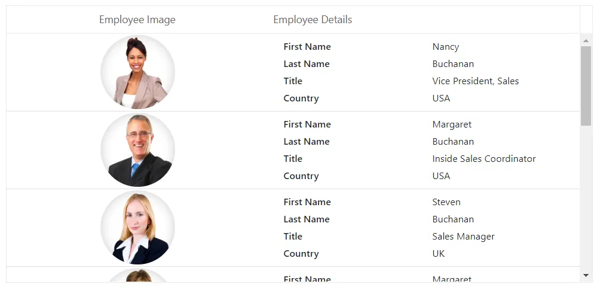

# Row Template in Blazor Data Grid

The [RowTemplate](https://help.syncfusion.com/cr/blazor/Syncfusion.Blazor.Grids.GridTemplates.html#Syncfusion_Blazor_Grids_GridTemplates_RowTemplate) feature in the [Blazor Data Grid](https://www.syncfusion.com/blazor-components/blazor-datagrid) provides complete control over the appearance and layout of each row. Row templates support rich, composite content such as images, buttons, and interactive controls instead of plain text.

Configure the `RowTemplate` feature in the Data Grid with these steps:

1. **Set up the row template:** Add the [GridTemplates](https://help.syncfusion.com/cr/blazor/Syncfusion.Blazor.Grids.GridTemplates.html) component inside `SfGrid` and define a custom row layout using the `RowTemplate` property.
2. **Define row layout structure:** Wrap the `RowTemplate` content inside [GridTemplates](https://help.syncfusion.com/cr/blazor/Syncfusion.Blazor.Grids.GridTemplates.html#Syncfusion_Blazor_Grids_GridTemplates). Each row template must contain the same number of `<td>` elements as the Grid's column count to ensure alignment.

3. **Template configuration:** For more guidance on configuring templates, see the [templates](https://help.syncfusion.com/cr/blazor/Syncfusion.Blazor.Grids.GridTemplates.html#Syncfusion_Blazor_Grids_GridTemplates) documentation.

Watch the row-template overview video:



## Basic Row Template

A basic row template can display rich content, including images and custom HTML:




@using Syncfusion.Blazor.Grids

<SfGrid @ref="Grid" DataSource="@Employees" Height="315px">
    <GridTemplates>
        <RowTemplate Context="emp">
            @{
                var employee = (emp as EmployeeData);

                <td class="photo">
                    
                </td>
                <td class="details">
                    <table class="CardTable" cellpadding="3" cellspacing="2">
                        <colgroup>
                            <col width="50%">
                            <col width="50%">
                        </colgroup>
                        <tbody>
                            <tr>
                                <td class="CardHeader">First Name </td>
                                <td>@employee.FirstName </td>
                            </tr>
                            <tr>
                                <td class="CardHeader">Last Name</td>
                                <td>@employee.LastName </td>
                            </tr>
                            <tr>
                                <td class="CardHeader">
                                    Title
                                </td>
                                <td>
                                    @employee.Title
                                </td>
                            </tr>
                            <tr>
                                <td class="CardHeader">
                                    Country
                                </td>
                                <td>
                                    @employee.Country
                                </td>
                            </tr>
                        </tbody>
                    </table>
                </td>
            }
        </RowTemplate>
    </GridTemplates>
    <GridColumns>
        <GridColumn HeaderText="Employee Image" Width="250" TextAlign="TextAlign.Center"> </GridColumn>
        <GridColumn HeaderText="Employee Details" Width="300" TextAlign="TextAlign.Left"></GridColumn>
    </GridColumns>
</SfGrid>

@code {
    private SfGrid<EmployeeData>? Grid;
    public List<EmployeeData> Employees { get; set; } = new();

    protected override void OnInitialized()
    {
        Employees = EmployeeData.GetAllRecords();
    }
}





public class EmployeeData
{
    public static List<EmployeeData> Employees = new List<EmployeeData>();

    public EmployeeData() { }

    public EmployeeData(int EmployeeID, string FirstName, string LastName, string Title, string Country)
    {
        this.EmployeeID = EmployeeID;
        this.FirstName = FirstName;
        this.LastName = LastName;
        this.Title = Title;
        this.Country = Country;
    }

    public static List<EmployeeData> GetAllRecords()
    {
        if (Employees.Count == 0)
        {
            var firstNames = new string[] { "Nancy", "Andrew", "Janet", "Margaret", "Steven" };
            var lastNames = new string[] { "Davolio", "Fuller", "Leverling", "Peacock", "Buchanan" };
            var titles = new string[] { "Sales Representative", "Vice President, Sales", "Sales Manager", "Inside Sales Coordinator" };
            var countries = new string[] { "USA", "UK", "UAE", "NED", "BER" };

            Random random = new Random();
            for (int i = 1; i <= 5; i++)
            {
                Employees.Add(new EmployeeData(
                    i,
                    firstNames[random.Next(firstNames.Length)],
                    lastNames[random.Next(lastNames.Length)],
                    titles[random.Next(titles.Length)],
                    countries[random.Next(countries.Length)]
                ));
            }
        }
        return Employees;
    }

    public int EmployeeID { get; set; }
    public string? FirstName { get; set; }
    public string? LastName { get; set; }
    public string? Title { get; set; }
    public string? Country { get; set; }
}




## Row Template with Formatting

Typically, the Blazor DataGrid columns are formatted using [Columns.Format](https://help.syncfusion.com/cr/blazor/Syncfusion.Blazor.Grids.GridColumn.html#Syncfusion_Blazor_Grids_GridColumn_Format). `Columns.Format` applies only to standard column rendering. Row templates override the default rendering, so `Columns.Format` does not apply inside a row template.

To format values inside a row template, apply .NET formatting in the template or invoke a helper method to produce the desired output such as dates, currency, or custom text.

The `ToString("MM/dd/yyyy")` output uses the current culture. Use `CultureInfo.InvariantCulture` when a consistent format is required across cultures.




@using Syncfusion.Blazor.Grids

<SfGrid @ref="Grid" DataSource="@Employees" Height="315px">
    <GridTemplates>
        <RowTemplate Context="emp">
            @{
                var employee = (emp as EmployeeData);

                <td class="photo">
                    
                </td>
                <td class="details">
                    <table class="CardTable" cellpadding="3" cellspacing="2">
                        <colgroup>
                            <col width="50%">
                            <col width="50%">
                        </colgroup>
                        <tbody>
                            <tr>
                                <td class="CardHeader">First Name </td>
                                <td>@employee.FirstName </td>
                            </tr>
                            <tr>
                                <td class="CardHeader">Last Name</td>
                                <td>@employee.LastName </td>
                            </tr>
                            <tr>
                                <td class="CardHeader">
                                    Title
                                </td>
                                <td>
                                    @employee.Title
                                </td>
                            </tr>
                            <tr>
                                <td class="CardHeader">
                                    Hire Date
                                </td>
                                <td>
                                    @employee.HireDate.ToString("MM/dd/yyyy")
                                </td>
                            </tr>
                            <tr>
                                <td class="CardHeader">
                                    Country
                                </td>
                                <td>
                                    @employee.Country
                                </td>
                            </tr>
                        </tbody>
                    </table>
                </td>
            }
        </RowTemplate>
    </GridTemplates>
    <GridColumns>
        <GridColumn HeaderText="Employee Image" Width="250" TextAlign="TextAlign.Center"> </GridColumn>
        <GridColumn HeaderText="Employee Details" Width="300" TextAlign="TextAlign.Left"></GridColumn>
    </GridColumns>
</SfGrid>

@code {
    private SfGrid<EmployeeData> Grid;
    public List<EmployeeData> Employees { get; set; }

    protected override void OnInitialized()
    {
        Employees = EmployeeData.GetAllRecords();
    }

}





public class EmployeeData
{
    public static List<EmployeeData> Employees = new List<EmployeeData>();

    public EmployeeData() { }

    public EmployeeData(int EmployeeID, string FirstName, string LastName, string Title, string Country, DateTime HireDate)
    {
        this.EmployeeID = EmployeeID;
        this.FirstName = FirstName;
        this.LastName = LastName;
        this.Title = Title;
        this.Country = Country;
        this.HireDate = HireDate;
    }

    public static List<EmployeeData> GetAllRecords()
    {
        if (Employees.Count == 0)
        {
            var firstNames = new string[] { "Nancy", "Andrew", "Janet", "Margaret", "Steven" };
            var lastNames = new string[] { "Davolio", "Fuller", "Leverling", "Peacock", "Buchanan" };
            var titles = new string[] { "Sales Representative", "Vice President, Sales", "Sales Manager", "Inside Sales Coordinator" };
            var countries = new string[] { "USA", "UK", "UAE", "NED", "BER" };

            Random random = new Random();
            for (int i = 1; i <= 5; i++)
            {
                Employees.Add(new EmployeeData(
                    i,
                    firstNames[random.Next(firstNames.Length)],
                    lastNames[random.Next(lastNames.Length)],
                    titles[random.Next(titles.Length)],
                    countries[random.Next(countries.Length)],
                    DateTime.Now.AddDays(-random.Next(1000, 5000)) // Random hire date between 3-14 years ago.
                ));
            }
        }
        return Employees;
    }

    public int EmployeeID { get; set; }
    public string? FirstName { get; set; }
    public string? LastName { get; set; }
    public string? Title { get; set; }
    public string? Country { get; set; }
    public DateTime HireDate { get; set; }
}




## Render Blazor Components in Row Templates

The Blazor Data Grid can render Blazor components inside row templates, enabling interactive UI elements such as inputs, date pickers, and dropdowns within rows.

To render a Blazor component in a row template, define the `<RowTemplate>` child tag inside `<GridTemplates>` and provide the custom HTML that defines the row layout.

The row template renders a [Chip](https://blazor.syncfusion.com/documentation/chip/getting-started-with-web-app) for `OrderID`, a [NumericTextBox](https://blazor.syncfusion.com/documentation/numeric-textbox/getting-started) for `Quantity`, a [DatePicker](https://blazor.syncfusion.com/documentation/datepicker/getting-started) for `OrderDate`, and a [DropDownList](https://blazor.syncfusion.com/documentation/dropdown-list/getting-started) for `OrderStatus`.




@using Syncfusion.Blazor.Grids
@using Syncfusion.Blazor.Buttons
@using Syncfusion.Blazor.Inputs
@using Syncfusion.Blazor.Calendars
@using Syncfusion.Blazor.DropDowns

<SfGrid @ref="Grid" DataSource="@Orders">
    <GridTemplates>
        <RowTemplate Context="order">
            @{
                var data = (OrderData)order;
            }

            <td class="rows">
                <SfChip Width="50px">
                    <ChipItems>
                        <ChipItem Text="@data.OrderID.ToString()"></ChipItem>
                    </ChipItems>
                </SfChip>
            </td>
            <td class="rows">
                <SfNumericTextBox TValue="int" @bind-Value="data.Quantity" Min="0" Max="10" Width="150"></SfNumericTextBox>
            </td>
            <td class="rows">
                @data.ShipAddress
            </td>
            <td class="rows">
                <SfDatePicker TValue="DateTime" @bind-Value="data.OrderDate" Width="150"></SfDatePicker>
            </td>
            <td class="rows">
                <SfDropDownList TValue="string" TItem="string" DataSource="@DropData" @bind-Value="data.OrderStatus" Placeholder="Select Status" Width="150">
                </SfDropDownList>
            </td>
        </RowTemplate>
    </GridTemplates>
    <GridColumns>
        <GridColumn Field=@nameof(OrderData.OrderID) HeaderText="Order ID" Width="120"></GridColumn>
        <GridColumn Field=@nameof(OrderData.Quantity) HeaderText="Quantity" Width="170"></GridColumn>
        <GridColumn Field=@nameof(OrderData.ShipAddress) HeaderText="Ship Address" Width="170"></GridColumn>
        <GridColumn Field=@nameof(OrderData.OrderDate) HeaderText="Order Date" Format="dd/MM/yyyy hh:mm tt" Width="120" Type="Syncfusion.Blazor.Grids.ColumnType.DateTime"></GridColumn>
        <GridColumn Field=@nameof(OrderData.OrderStatus) HeaderText="Order Status" Width="120"></GridColumn>
    </GridColumns>
</SfGrid>

@code {
    private SfGrid<OrderData>? Grid;
    public List<OrderData> Orders { get; set; } = new();
    public List<string> DropData { get; set; } = new List<string> { "Order Placed", "Processing", "Delivered" };

    protected override void OnInitialized()
    {
        Orders = OrderData.GetAllRecords();
    }
}





public class OrderData
{
    public static List<OrderData> Orders = new List<OrderData>();

    public OrderData() { }

    public OrderData(int? orderId, string customerId, double freight, string title, string orderStatus,
                      int quantity, DateTime orderDate, string shipAddress)
    {
        OrderID = orderId;
        CustomerID = customerId;
        Freight = freight;
        Title = title;
        OrderStatus = orderStatus;
        Quantity = quantity;
        OrderDate = orderDate;
        ShipAddress = shipAddress;
    }

    public static List<OrderData> GetAllRecords()
    {
        if (Orders.Count == 0)
        {
            for (int i = 1; i < 2; i++)
            {
                Orders.Add(new OrderData(10248, "Nancy", 32.14, "Sales Representative", "Order Placed", 5, DateTime.Now.AddDays(-10), "123 Main St, City A"));
                Orders.Add(new OrderData(10249, "Andrew", 33.33, "Vice President, Sales", "Processing", 10, DateTime.Now.AddDays(-8), "456 Oak St, City B"));
                Orders.Add(new OrderData(10250, "Janet", 56.78, "Sales Manager", "Delivered", 15, DateTime.Now.AddDays(-6), "789 Pine St, City C"));
                Orders.Add(new OrderData(10251, "Margaret", 43.34, "Inside Sales Coordinator", "Delivered", 20, DateTime.Now.AddDays(-4), "101 Maple Ave, City D"));
                Orders.Add(new OrderData(10252, "Steven", 17.98, "Sales Manager", "Delivered", 12, DateTime.Now.AddDays(-2), "202 Birch Rd, City E"));
                Orders.Add(new OrderData(10253, "Michael", 53.33, "Sales Representative", "Processing", 8, DateTime.Now, "303 Elm Dr, City F"));
                Orders.Add(new OrderData(10254, "Robert", 78.99, "Vice President, Sales", "Delivered", 25, DateTime.Now.AddDays(1), "404 Cedar St, City G"));
                Orders.Add(new OrderData(10255, "Anne", 46.66, "Inside Sales Coordinator", "Order Placed", 30, DateTime.Now.AddDays(2), "505 Walnut St, City H"));
                Orders.Add(new OrderData(10256, "Laura", 98.76, "Sales Manager", "Delivered", 18, DateTime.Now.AddDays(3), "606 Ash Blvd, City I"));
            }
        }
        return Orders;
    }

    public int? OrderID { get; set; }
    public string? CustomerID { get; set; }
    public double? Freight { get; set; }
    public string? Title { get; set; }
    public string? OrderStatus { get; set; }
    public int Quantity { get; set; }
    public DateTime OrderDate { get; set; }
    public string? ShipAddress { get; set; }
}






## Embed Data Visualization Components in Row Templates

Charts are data visualization components rather than input or editor components. The Blazor Data Grid supports chart components in row templates for visualizing row-specific data directly within rows.

To render a Blazor Chart in a row template, use the [RowTemplate](https://help.syncfusion.com/cr/blazor/Syncfusion.Blazor.Grids.GridTemplates.html#Syncfusion_Blazor_Grids_GridTemplates_RowTemplate) property to define the row layout and include the chart markup within the template.



@using Syncfusion.Blazor.Grids
@using Syncfusion.Blazor.Charts
<SfGrid @ref="Grid" DataSource="@Orders" Height="400px">
    <GridTemplates>
        <RowTemplate Context="emp">
            @{
                var order = emp as Order;
            }
            <td class="details">
                <table class="CardTable" cellpadding="3" cellspacing="2">
                    <tbody>
                        <tr>
                            <td class="CardHeader">Customer ID</td>
                            <td>@order.CustomerID</td>
                        </tr>
                        <tr>
                            <td class="CardHeader">Freight</td>
                            <td>@order.Freight</td>
                        </tr>
                        <tr>
                            <td class="CardHeader">Order Date</td>
                            <td>@order.OrderDate?.ToShortDateString()</td>
                        </tr>
                    </tbody>
                </table>
            </td>
            <td class="chart">
                <SfChart Width="100%" Height="200px">
                    <ChartPrimaryXAxis ValueType="Syncfusion.Blazor.Charts.ValueType.Category"></ChartPrimaryXAxis>
                    <ChartSeriesCollection>
                        <ChartSeries DataSource="@GetChartData(order.OrderID)" XName="Category" 
                            YName="Value" Type="Syncfusion.Blazor.Charts.ChartSeriesType.Column">
                        </ChartSeries>
                    </ChartSeriesCollection>
                </SfChart>
            </td>
        </RowTemplate>
    </GridTemplates>
    <GridColumns>
        <GridColumn HeaderText="Order Details" Width="50%"></GridColumn>
        <GridColumn HeaderText="Chart" Width="50%"></GridColumn>
    </GridColumns>
</SfGrid>

@code {
    public List<Order> Orders { get; set; } = new();
    private SfGrid<Order>? Grid;
    private static Random random = new Random();

    protected override void OnInitialized()
    {
        Orders = Enumerable.Range(1, 5).Select(x => new Order()
        {
            OrderID = 1000 + x,
            CustomerID = (new string[] { "ALFKI", "ANANTR", "ANTON", "BLONP", "BOLID" })[random.Next(5)],
            Freight = 2.1 * x,
            OrderDate = DateTime.Now.AddDays(-x),
        }).ToList();
    }
    public class Order
    {
        public int OrderID { get; set; }
        public string? CustomerID { get; set; }
        public DateTime? OrderDate { get; set; }
        public double? Freight { get; set; }
    }
    public class ChartData
    {
        public string? Category { get; set; }
        public double Value { get; set; }
    }

    private List<ChartData> GetChartData(int orderId)
    {
        // Generate order-specific chart data by using the orderId to produce unique values.
        // Production applications can query a database or API by orderId.
        return new List<ChartData>
        {
            new ChartData { Category = "Q1", Value = (orderId % 10) + 10 },
            new ChartData { Category = "Q2", Value = (orderId % 5) + 15 },
            new ChartData { Category = "Q3", Value = (orderId % 7) + 5 },
            new ChartData { Category = "Q4", Value = (orderId % 9) + 20 },
        };
    }
}






## Limitations

The row template feature is not compatible with all Data Grid features and has limited interoperability. The features that are incompatible with row templates are listed below.

- Adaptive view
- Aggregates
- Clipboard
- Column chooser
- Column menu
- Context Menu
- Detail Row
- Editing
- Export
- Filtering
- Foreign key column
- Frozen rows & columns
- Grouping
- Infinite scrolling
- Paging
- Reordering
- Resizing
- Rtl
- Searching
- Selection
- Sorting
- State Persistence
- Virtual & Infinite scrolling