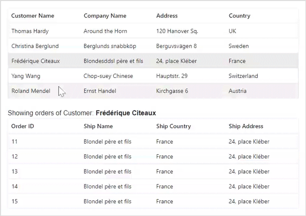

# Row in Blazor DataGrid Component

Each row typically represents a single record or item from a data source. Rows in a grid are used to present data in a tabular format. Each row displays a set of values the fields of an individual data record. Rows allow users to interact with the data in the grid. Users can select rows, edit cell values, perform sorting or filtering operations, and trigger events based on actions.

## Customize row styles

Customizing the styles of rows in a Syncfusion Grid allows you to modify the appearance of rows to meet your design requirements. This feature is useful when you want to highlight certain rows or change the font style, background color, and other properties of the row to enhance the visual appeal of the grid. To customize the row styles in the grid, you can use CSS, properties, methods, or event support provided by the Syncfusion Blazor DataGrid component.

### Using event

You can customize the appearance of the rows by using the [RowDataBound](https://help.syncfusion.com/cr/blazor/Syncfusion.Blazor.Grids.GridEvents-1.html#Syncfusion_Blazor_Grids_GridEvents_1_RowDataBound) event. This event triggers for every row when it is bound to the data source. In the event handler, you can get the [RowDataBoundEventArgs](https://help.syncfusion.com/cr/blazor/Syncfusion.Blazor.Grids.RowDataBoundEventArgs-1.html) object, which contains details of the row. You can use this object to modify the row’s appearance, add custom elements, or perform any other customization.

Here’s an example of how you can use the `RowDataBound` event to customize the styles of rows based on the value of the Freight column. This example involves checking the value of the Freight column for each row and adding a CSS class to the row based on the value. The CSS classes below-30, below-80, and above-80 can then be defined in your stylesheet to apply the desired styles to the rows.



@page "/"

@using Syncfusion.Blazor.Grids
@using BlazorApp1.Data

<SfGrid DataSource="@Orders">
    <GridEvents TValue="OrderData" RowDataBound="RowBound"></GridEvents>
    <GridColumns>
        <GridColumn Field=@nameof(OrderData.OrderID) HeaderText="Order ID" TextAlign="TextAlign.Right" Width="100"></GridColumn>
        <GridColumn Field=@nameof(OrderData.CustomerID) HeaderText="Customer ID" Width="120"></GridColumn>
        <GridColumn Field=@nameof(OrderData.Freight) HeaderText="Freight" Format="C2" TextAlign="TextAlign.Right" Width="80"></GridColumn>
        <GridColumn Field=@nameof(OrderData.ShipCity) HeaderText="ShipCity" Width="130"></GridColumn>
    </GridColumns>
</SfGrid>
<style>
    .below-30 {
        background-color: rgb(211, 225, 248);
    }
    .below-80 {
        background-color: rgb(163, 236, 217);
    }
    .above-80 {
        background-color: rgb(220, 248, 177);
    }
</style>

@code {
    private SfGrid<OrderData> Grid;
    public List<OrderData> Orders { get; set; }

    protected override void OnInitialized()
    {
        Orders = OrderData.GetAllRecords();
    }
    public void RowBound(RowDataBoundEventArgs<OrderData> args)
    {
        if (args.Data.Freight < 30)
        {
            args.Row.AddClass(new string[] { "below-30" });
        }
        else if (args.Data.Freight < 80)
        {
            args.Row.AddClass(new string[] { "below-80" });
        }
        else
        {
            args.Row.AddClass(new string[] { "above-80" });
        }
    }
}



 namespace BlazorApp1.Data
{
    public class OrderData
    {
        public static List<OrderData> Orders = new List<OrderData>();

        public OrderData() { }

        public OrderData(int? OrderID, string CustomerID, double Freight, DateTime? OrderDate, DateTime? ShippedDate, bool? IsVerified, string ShipCity)
        {
            this.OrderID = OrderID;
            this.CustomerID = CustomerID;
            this.Freight = Freight;
            this.OrderDate = OrderDate;
            this.ShippedDate = ShippedDate;
            this.IsVerified = IsVerified;
            this.ShipCity = ShipCity;
        }

        public static List<OrderData> GetAllRecords()
        {
            if (Orders.Count == 0)
            {
                Orders.Add(new OrderData(10248, "VINET", 32.38, new DateTime(1996, 7, 4), new DateTime(1996, 08, 07), true, "Reims"));
                Orders.Add(new OrderData(10249, "TOMSP", 11.61, new DateTime(1996, 7, 5), new DateTime(1996, 08, 07), false, "Münster"));
                Orders.Add(new OrderData(10250, "HANAR", 65.83, new DateTime(1996, 7, 6), new DateTime(1996, 08, 07), true, "Rio de Janeiro"));
                Orders.Add(new OrderData(10251, "VINET", 41.34, new DateTime(1996, 7, 7), new DateTime(1996, 08, 07), false, "Lyon"));
                Orders.Add(new OrderData(10252, "SUPRD", 151.30, new DateTime(1996, 7, 8), new DateTime(1996, 08, 07), true, "Charleroi"));
                Orders.Add(new OrderData(10253, "HANAR", 58.17, new DateTime(1996, 7, 9), new DateTime(1996, 08, 07), false, "Bern"));
                Orders.Add(new OrderData(10254, "CHOPS", 22.98, new DateTime(1996, 7, 10), new DateTime(1996, 08, 07), true, "Genève"));
                Orders.Add(new OrderData(10255, "VINET", 148.33, new DateTime(1996, 7, 11), new DateTime(1996, 08, 07), false, "Resende"));
                Orders.Add(new OrderData(10256, "HANAR", 13.97, new DateTime(1996, 7, 12), new DateTime(1996, 08, 07), true, "Paris"));
            }
            return Orders;
        }

        public int? OrderID { get; set; }
        public string CustomerID { get; set; }
        public double? Freight { get; set; }
        public DateTime? OrderDate { get; set; }
        public DateTime? ShippedDate { get; set; }
        public bool? IsVerified { get; set; }
        public string ShipCity { get; set; } 
    }
}





> The [QueryCellInfo](https://help.syncfusion.com/cr/blazor/Syncfusion.Blazor.Grids.GridEvents-1.html#Syncfusion_Blazor_Grids_GridEvents_1_QueryCellInfo) event can also be used to customize cells and is triggered for every cell in the grid. It can be useful when you need to customize cells based on certain conditions or criteria.

### Using CSS

You can apply styles to the rows using CSS selectors. The Grid provides a class name for each row element, which you can use to apply styles to that specific row.

**Customize alternate rows**

You can customize the appearance of the alternate rows using CSS. This can be useful for improving the readability of the data and making it easier to distinguish between rows. By default, Syncfusion Grid provides the CSS class .e-altrow to style the alternate rows. You can customize this default style by overriding the .e-altrow class with your custom CSS styles.

To change the background color of the alternate rows, you can add the following CSS code to your application’s stylesheet:



@page "/"

@using Syncfusion.Blazor.Grids
@using BlazorApp1.Data

<SfGrid DataSource="@Orders">
    <GridColumns>
        <GridColumn Field=@nameof(OrderData.OrderID) HeaderText="Order ID" TextAlign="TextAlign.Right" Width="100"></GridColumn>
        <GridColumn Field=@nameof(OrderData.CustomerID) HeaderText="Customer ID" Width="120"></GridColumn>
        <GridColumn Field=@nameof(OrderData.Freight) HeaderText="Freight" Format="C2" TextAlign="TextAlign.Right" Width="80"></GridColumn>
        <GridColumn Field=@nameof(OrderData.ShipCity) HeaderText="ShipCity" Width="130"></GridColumn>
    </GridColumns>
</SfGrid>
<style>
    .e-grid .e-altrow {
        background-color: #aaf1eb;
    }
</style>

@code {
    private SfGrid<OrderData> Grid;
    public List<OrderData> Orders { get; set; }

    protected override void OnInitialized()
    {
        Orders = OrderData.GetAllRecords();
    }
}



 namespace BlazorApp1.Data
{
    public class OrderData
    {
        public static List<OrderData> Orders = new List<OrderData>();

        public OrderData() { }

        public OrderData(int? OrderID, string CustomerID, double Freight, DateTime? OrderDate, DateTime? ShippedDate, bool? IsVerified, string ShipCity)
        {
            this.OrderID = OrderID;
            this.CustomerID = CustomerID;
            this.Freight = Freight;
            this.OrderDate = OrderDate;
            this.ShippedDate = ShippedDate;
            this.IsVerified = IsVerified;
            this.ShipCity = ShipCity;
        }

        public static List<OrderData> GetAllRecords()
        {
            if (Orders.Count == 0)
            {
                Orders.Add(new OrderData(10248, "VINET", 32.38, new DateTime(1996, 7, 4), new DateTime(1996, 08, 07), true, "Reims"));
                Orders.Add(new OrderData(10249, "TOMSP", 11.61, new DateTime(1996, 7, 5), new DateTime(1996, 08, 07), false, "Münster"));
                Orders.Add(new OrderData(10250, "HANAR", 65.83, new DateTime(1996, 7, 6), new DateTime(1996, 08, 07), true, "Rio de Janeiro"));
                Orders.Add(new OrderData(10251, "VINET", 41.34, new DateTime(1996, 7, 7), new DateTime(1996, 08, 07), false, "Lyon"));
                Orders.Add(new OrderData(10252, "SUPRD", 151.30, new DateTime(1996, 7, 8), new DateTime(1996, 08, 07), true, "Charleroi"));
                Orders.Add(new OrderData(10253, "HANAR", 58.17, new DateTime(1996, 7, 9), new DateTime(1996, 08, 07), false, "Bern"));
                Orders.Add(new OrderData(10254, "CHOPS", 22.98, new DateTime(1996, 7, 10), new DateTime(1996, 08, 07), true, "Genève"));
                Orders.Add(new OrderData(10255, "VINET", 148.33, new DateTime(1996, 7, 11), new DateTime(1996, 08, 07), false, "Resende"));
                Orders.Add(new OrderData(10256, "HANAR", 13.97, new DateTime(1996, 7, 12), new DateTime(1996, 08, 07), true, "Paris"));
            }
            return Orders;
        }

        public int? OrderID { get; set; }
        public string CustomerID { get; set; }
        public double? Freight { get; set; }
        public DateTime? OrderDate { get; set; }
        public DateTime? ShippedDate { get; set; }
        public bool? IsVerified { get; set; }
        public string ShipCity { get; set; } 
    }
}





**Customize selected row**

You can customize the appearance of the selected row using CSS. This is useful when you want to highlight the currently selected row for improve the visual appeal of the Grid. By default, the Grid provides the CSS class .e-selectionbackground to style the selected row. You can customize this default style by overriding the .e-selectionbackground class with your own custom CSS styles.

To change the background color of the selected row, you can add the following CSS code to your application:

```css
#CustomGrid .e-selectionbackground {
    background-color: #f9920b;
}
```

Here’s an example of how to use the .e-selectionbackground class to style the selected row:



@page "/"

@using Syncfusion.Blazor.Grids
@using BlazorApp1.Data

<SfGrid ID="CustomGrid" DataSource="@Orders">
    <GridColumns>
        <GridColumn Field=@nameof(OrderData.OrderID) HeaderText="Order ID" TextAlign="TextAlign.Right" Width="100"></GridColumn>
        <GridColumn Field=@nameof(OrderData.CustomerID) HeaderText="Customer ID" Width="120"></GridColumn>
        <GridColumn Field=@nameof(OrderData.Freight) HeaderText="Freight" Format="C2" TextAlign="TextAlign.Right" Width="80"></GridColumn>
        <GridColumn Field=@nameof(OrderData.ShipCity) HeaderText="ShipCity" Width="130"></GridColumn>
    </GridColumns>
</SfGrid>

<style>
    #CustomGrid .e-selectionbackground {
        background-color: #f9920b;
    }
</style>


@code {
    private SfGrid<OrderData> Grid;
    public List<OrderData> Orders { get; set; }

    protected override void OnInitialized()
    {
        Orders = OrderData.GetAllRecords();
    }
}
 



 namespace BlazorApp1.Data
{
    public class OrderData
    {
        public static List<OrderData> Orders = new List<OrderData>();

        public OrderData() { }

        public OrderData(int? OrderID, string CustomerID, double Freight, DateTime? OrderDate, DateTime? ShippedDate, bool? IsVerified, string ShipCity)
        {
            this.OrderID = OrderID;
            this.CustomerID = CustomerID;
            this.Freight = Freight;
            this.OrderDate = OrderDate;
            this.ShippedDate = ShippedDate;
            this.IsVerified = IsVerified;
            this.ShipCity = ShipCity;
        }

        public static List<OrderData> GetAllRecords()
        {
            if (Orders.Count == 0)
            {
                Orders.Add(new OrderData(10248, "VINET", 32.38, new DateTime(1996, 7, 4), new DateTime(1996, 08, 07), true, "Reims"));
                Orders.Add(new OrderData(10249, "TOMSP", 11.61, new DateTime(1996, 7, 5), new DateTime(1996, 08, 07), false, "Münster"));
                Orders.Add(new OrderData(10250, "HANAR", 65.83, new DateTime(1996, 7, 6), new DateTime(1996, 08, 07), true, "Rio de Janeiro"));
                Orders.Add(new OrderData(10251, "VINET", 41.34, new DateTime(1996, 7, 7), new DateTime(1996, 08, 07), false, "Lyon"));
                Orders.Add(new OrderData(10252, "SUPRD", 151.30, new DateTime(1996, 7, 8), new DateTime(1996, 08, 07), true, "Charleroi"));
                Orders.Add(new OrderData(10253, "HANAR", 58.17, new DateTime(1996, 7, 9), new DateTime(1996, 08, 07), false, "Bern"));
                Orders.Add(new OrderData(10254, "CHOPS", 22.98, new DateTime(1996, 7, 10), new DateTime(1996, 08, 07), true, "Genève"));
                Orders.Add(new OrderData(10255, "VINET", 148.33, new DateTime(1996, 7, 11), new DateTime(1996, 08, 07), false, "Resende"));
                Orders.Add(new OrderData(10256, "HANAR", 13.97, new DateTime(1996, 7, 12), new DateTime(1996, 08, 07), true, "Paris"));
            }
            return Orders;
        }

        public int? OrderID { get; set; }
        public string CustomerID { get; set; }
        public double? Freight { get; set; }
        public DateTime? OrderDate { get; set; }
        public DateTime? ShippedDate { get; set; }
        public bool? IsVerified { get; set; }
        public string ShipCity { get; set; } 
    }
}





### Using method

The Grid provides below methods to customize the appearance of the grid rows :

1. [getRowByIndex](): This method returns the HTML element of a row at the specified index. You can use this method to apply custom styles to a specific row.
2. [GetRowIndexByPrimaryKeyAsync](https://help.syncfusion.com/cr/blazor/Syncfusion.Blazor.Grids.SfGrid-1.html#Syncfusion_Blazor_Grids_SfGrid_1_GetRowIndexByPrimaryKeyAsync_System_Object_): This method returns the index of the row with the specified primary key. You can use this method to get the index of a specific row and then apply custom styles to it.
3. [getRows]: This method returns an array of all the row elements in the Grid. You can use this method to apply custom styles to all rows or to a specific set of rows based on some condition.
4. [getRowInfo]: This method returns the data object and index of the row corresponding to the specified row element. You can use this method to apply custom styles based on the data in a row.
5. [getSelectedRowIndexesAsync](https://help.syncfusion.com/cr/blazor/Syncfusion.Blazor.Grids.SfGrid-1.html#Syncfusion_Blazor_Grids_SfGrid_1_GetSelectedRowIndexesAsync): This method returns an array of the indexes of the selected rows in the Grid. You can use this method to apply custom styles to the selected rows.
6. [getSelectedRows]:This method returns an array of the HTML elements representing the selected rows in the grid. You can use this method to directly loop through the selected rows and customize their styles.

The following example demonstrates how to use getRowByIndex methods to customize the appearance of the row inside the dataBound event of the grid.


## Row height

The Syncfusion Grid allows you to customize the height of rows based on your needs. This feature can be useful when you need to display more content in a row or when you want to reduce the height of rows to fit its content. You can achieve this by using the [RowHeight](https://help.syncfusion.com/cr/blazor/Syncfusion.Blazor.Grids.SfGrid-1.html#Syncfusion_Blazor_Grids_SfGrid_1_RowHeight) property of the Grid component. This property allows you to change the height of the entire grid row to your desired value.

In the below example, we will demonstrate how to dynamically change the height of the rows using the `RowHeight` property.



@page "/"

@using Syncfusion.Blazor.Grids
@using BlazorApp1.Data

<div>
    <button class="e-btn e-small" @onclick="() => ChangeRowHeight(20)">Change height 20px</button>
    <button class="e-btn e-small" @onclick="() => ChangeRowHeight(42)">Default height 42px</button>
    <button class="e-btn e-small" @onclick="() => ChangeRowHeight(60)">Change height 60px</button>
</div>

<div style="padding-top:20px">
    <SfGrid @ref="Grid" DataSource="@Orders" RowHeight="RowHeight" Height="400">
        <GridColumns>
            <GridColumn Field="OrderID" HeaderText="Order ID" TextAlign="TextAlign.Right" Width="120"></GridColumn>
            <GridColumn Field="CustomerID" HeaderText="Customer Name" Width="150"></GridColumn>
            <GridColumn Field="OrderDate" HeaderText="Order Date" Width="130" Type="ColumnType.Date" Format="dd/MM/yyyy" TextAlign="TextAlign.Right"></GridColumn>
            <GridColumn Field="Freight" HeaderText="Freight" Width="120" Format="C2" TextAlign="TextAlign.Right"></GridColumn>
            <GridColumn Field="ShippedDate" HeaderText="Shipped Date" Width="140" Type="ColumnType.Date" Format="dd/MM/yyyy" TextAlign="TextAlign.Right"></GridColumn>
            <GridColumn Field="ShipCountry" HeaderText="Ship Country" Width="150"></GridColumn>
        </GridColumns>
    </SfGrid>
</div>

@code {
    private SfGrid<OrderData> Grid;
    public List<OrderData> Orders { get; set; }
    public int RowHeight { get; set; } = 42; // Default height

    protected override void OnInitialized()
    {
        Orders = OrderData.GetAllRecords();
    }

    private void ChangeRowHeight(int height)
    {
        RowHeight = height;
        Grid.Refresh(); // Refresh the grid to apply the new row height
    }
}




 namespace BlazorApp1.Data
{
    public class OrderData
    {
        public static List<OrderData> Orders = new List<OrderData>();

        public OrderData() { }

        public OrderData(int? OrderID, string CustomerID, string ShipName, double Freight, DateTime? OrderDate, DateTime? ShippedDate, bool? IsVerified, string ShipCity, string ShipCountry)
        {
            this.OrderID = OrderID;
            this.CustomerID = CustomerID;
            this.ShipName = ShipName;
            this.Freight = Freight;
            this.OrderDate = OrderDate;
            this.ShippedDate = ShippedDate;
            this.IsVerified = IsVerified;
            this.ShipCity = ShipCity;
            this.ShipCountry = ShipCountry;
        }

        public static List<OrderData> GetAllRecords()
        {
            if (Orders.Count == 0)
            {
                Orders.Add(new OrderData(10248, "VINET", "Vins et alcools Chevalier", 32.38, new DateTime(1996, 7, 4), new DateTime(1996, 08, 07), true, "Reims", "France"));
                Orders.Add(new OrderData(10249, "TOMSP", "Toms Spezialitäten", 11.61, new DateTime(1996, 7, 5), new DateTime(1996, 08, 07), false, "Münster", "Germany"));
                Orders.Add(new OrderData(10250, "HANAR", "Hanari Carnes", 65.83, new DateTime(1996, 7, 6), new DateTime(1996, 08, 07), true, "Rio de Janeiro", "Brazil"));
                Orders.Add(new OrderData(10251, "VINET", "Vins et alcools Chevalier", 41.34, new DateTime(1996, 7, 7), new DateTime(1996, 08, 07), false, "Lyon", "France"));
                Orders.Add(new OrderData(10252, "SUPRD", "Suprêmes délices", 151.30, new DateTime(1996, 7, 8), new DateTime(1996, 08, 07), true, "Charleroi", "Belgium"));
                Orders.Add(new OrderData(10253, "HANAR", "Hanari Carnes", 58.17, new DateTime(1996, 7, 9), new DateTime(1996, 08, 07), false, "Bern", "Switzerland"));
                Orders.Add(new OrderData(10254, "CHOPS", "Chop-suey Chinese", 22.98, new DateTime(1996, 7, 10), new DateTime(1996, 08, 07), true, "Genève", "Switzerland"));
                Orders.Add(new OrderData(10255, "VINET", "Vins et alcools Chevalier", 148.33, new DateTime(1996, 7, 11), new DateTime(1996, 08, 07), false, "Resende", "Brazil"));
                Orders.Add(new OrderData(10256, "HANAR", "Hanari Carnes", 13.97, new DateTime(1996, 7, 12), new DateTime(1996, 08, 07), true, "Paris", "France"));
            }
            return Orders;
        }

        public int? OrderID { get; set; }
        public string CustomerID { get; set; }
        public string ShipName { get; set; } 
        public double? Freight { get; set; }
        public DateTime? OrderDate { get; set; }
        public DateTime? ShippedDate { get; set; }
        public bool? IsVerified { get; set; }
        public string ShipCity { get; set; }
        public string ShipCountry { get; set; }
    }
}





> The `RowHeight` property can only be used to set the height of the entire grid row. It cannot be used to set the height of individual cells within a row.
> The `RowHeight` property applies the height to all rows in the grid, including the header and footer rows.
> You can also set the height for a specific row using the `RowHeight` property of the corresponding row object in the [RowDataBound](https://blazor.syncfusion.com/documentation/datagrid/events#rowdatabound) event.

### Customize row height for particular row

Customizing the row height for a particular row can be useful when you want to display more content in a particular row, reduce the height of a row to fit its content, or make a specific row stand out from the other rows in the grid. This can be achieved by using the [RowHeight](https://help.syncfusion.com/cr/blazor/Syncfusion.Blazor.Grids.SfGrid-1.html#Syncfusion_Blazor_Grids_SfGrid_1_RowHeight) property of the Grid component along with the [RowDataBound](https://blazor.syncfusion.com/documentation/datagrid/events#rowdatabound) event.

The `RowHeight` property of the Grid component allows you to set the height of all rows in the grid to a specific value. However, if you want to customize the row height for a specific row based on the row data, you can use the `RowDataBound` event. This event is triggered every time a request is made to access row information, element, or data, and before the row element is appended to the Grid element.

In the below example, the row height for the row with OrderID as ‘10249’ is set as ‘90px’ using the `RowDataBound` event.

## Row hover

The Row Hover feature in Grid provides a visual effect when the mouse pointer hovers over the rows, making it easy to highlight and identify the selected row. This feature can also improve the readability of data in the grid. The row hover effect can be enabled or disabled using the enableHover property of the Grid component.

By default, the enableHover property is set to true, which means that the row hovering effect is enabled. To disable the row hover effect, set the enableHover property to false.

Here is an example that demonstrates how to enable/disable row hover based on the Switch Component:



@page "/"

@using Syncfusion.Blazor.Grids
@using BlazorApp1.Data

<div>
    <button class="e-btn e-small" @onclick="() => ChangeRowHeight(20)">Change height 20px</button>
    <button class="e-btn e-small" @onclick="() => ChangeRowHeight(42)">Default height 42px</button>
    <button class="e-btn e-small" @onclick="() => ChangeRowHeight(60)">Change height 60px</button>
</div>

<div style="padding-top:20px">
    <SfGrid @ref="Grid" DataSource="@Orders" RowHeight="RowHeight" Height="400">
        <GridColumns>
            <GridColumn Field="OrderID" HeaderText="Order ID" TextAlign="TextAlign.Right" Width="120"></GridColumn>
            <GridColumn Field="CustomerID" HeaderText="Customer Name" Width="150"></GridColumn>
            <GridColumn Field="OrderDate" HeaderText="Order Date" Width="130" Type="ColumnType.Date" Format="dd/MM/yyyy" TextAlign="TextAlign.Right"></GridColumn>
            <GridColumn Field="Freight" HeaderText="Freight" Width="120" Format="C2" TextAlign="TextAlign.Right"></GridColumn>
            <GridColumn Field="ShippedDate" HeaderText="Shipped Date" Width="140" Type="ColumnType.Date" Format="dd/MM/yyyy" TextAlign="TextAlign.Right"></GridColumn>
            <GridColumn Field="ShipCountry" HeaderText="Ship Country" Width="150"></GridColumn>
        </GridColumns>
    </SfGrid>
</div>

@code {
    private SfGrid<OrderData> Grid;
    public List<OrderData> Orders { get; set; }
    public int RowHeight { get; set; } = 42; // Default height

    protected override void OnInitialized()
    {
        Orders = OrderData.GetAllRecords();
    }

    private void ChangeRowHeight(int height)
    {
        RowHeight = height;
        Grid.Refresh(); // Refresh the grid to apply the new row height
    }
}




 namespace BlazorApp1.Data
{
    public class OrderData
    {
        public static List<OrderData> Orders = new List<OrderData>();

        public OrderData() { }

        public OrderData(int? OrderID, string CustomerID, string ShipName, double Freight, DateTime? OrderDate, DateTime? ShippedDate, bool? IsVerified, string ShipCity, string ShipCountry)
        {
            this.OrderID = OrderID;
            this.CustomerID = CustomerID;
            this.ShipName = ShipName;
            this.Freight = Freight;
            this.OrderDate = OrderDate;
            this.ShippedDate = ShippedDate;
            this.IsVerified = IsVerified;
            this.ShipCity = ShipCity;
            this.ShipCountry = ShipCountry;
        }

        public static List<OrderData> GetAllRecords()
        {
            if (Orders.Count == 0)
            {
                Orders.Add(new OrderData(10248, "VINET", "Vins et alcools Chevalier", 32.38, new DateTime(1996, 7, 4), new DateTime(1996, 08, 07), true, "Reims", "France"));
                Orders.Add(new OrderData(10249, "TOMSP", "Toms Spezialitäten", 11.61, new DateTime(1996, 7, 5), new DateTime(1996, 08, 07), false, "Münster", "Germany"));
                Orders.Add(new OrderData(10250, "HANAR", "Hanari Carnes", 65.83, new DateTime(1996, 7, 6), new DateTime(1996, 08, 07), true, "Rio de Janeiro", "Brazil"));
                Orders.Add(new OrderData(10251, "VINET", "Vins et alcools Chevalier", 41.34, new DateTime(1996, 7, 7), new DateTime(1996, 08, 07), false, "Lyon", "France"));
                Orders.Add(new OrderData(10252, "SUPRD", "Suprêmes délices", 151.30, new DateTime(1996, 7, 8), new DateTime(1996, 08, 07), true, "Charleroi", "Belgium"));
                Orders.Add(new OrderData(10253, "HANAR", "Hanari Carnes", 58.17, new DateTime(1996, 7, 9), new DateTime(1996, 08, 07), false, "Bern", "Switzerland"));
                Orders.Add(new OrderData(10254, "CHOPS", "Chop-suey Chinese", 22.98, new DateTime(1996, 7, 10), new DateTime(1996, 08, 07), true, "Genève", "Switzerland"));
                Orders.Add(new OrderData(10255, "VINET", "Vins et alcools Chevalier", 148.33, new DateTime(1996, 7, 11), new DateTime(1996, 08, 07), false, "Resende", "Brazil"));
                Orders.Add(new OrderData(10256, "HANAR", "Hanari Carnes", 13.97, new DateTime(1996, 7, 12), new DateTime(1996, 08, 07), true, "Paris", "France"));
            }
            return Orders;
        }

        public int? OrderID { get; set; }
        public string CustomerID { get; set; }
        public string ShipName { get; set; } 
        public double? Freight { get; set; }
        public DateTime? OrderDate { get; set; }
        public DateTime? ShippedDate { get; set; }
        public bool? IsVerified { get; set; }
        public string ShipCity { get; set; }
        public string ShipCountry { get; set; }
    }
}





> The enableHover property applies to the entire grid, not individual rows or columns.

### How to get the row information when hovering over the cell

You can retrieve row information when hovering over a specific cell. This can be useful if you want to display additional details or perform some action based on the data in the row. This can be achieved by using the rowDataBound event and the getRowInfo method of the Grid.

* The rowDataBound event is triggered every time a request is made to access row information, element, or data, before the row element is appended to the Grid element.
* The getRowInfo method is used to retrieve the row information when hovering over a specific cell. This method takes a single parameter, which is the target element that is being hovered over.

Here’s an example that demonstrates how to use the rowDataBound event and getRowInfo method to retrieve the row information when hovering over a cell in the Syncfusion Grid.

## Row pinning (Frozen)

The Syncfusion Blazor DataGrid allows you to freeze rows to keep them visible while scrolling vertically through large datasets. This feature enhances the experience by maintaining important information within view at all times.

In the following example, the frozenRows property is set to 2. This configuration freezes the top three rows of the grid, and they will remain fixed in their positions while the rest of the grid can be scrolled vertically.



@page "/"

@using Syncfusion.Blazor.Inputs
@using Syncfusion.Blazor.Grids
@using Syncfusion.Blazor.Buttons
@using BlazorApp1.Data

<div style="display: flex; align-items: center; padding-bottom: 20px;">
    <label style="padding-right: 10px; font-weight: bold;">Change the frozen rows:</label>
    <SfNumericTextBox @ref="NumericTextBox" TValue="int" Value="@NumericValue" Min="1" Max="5" Decimals="0"
                      ValidateDecimalOnType="true" Width="150px">
    </SfNumericTextBox>
    <SfButton style="margin-left: 10px;" CssClass="e-primary" @onclick="FrozenRowsFn">
        Update Value
    </SfButton>
</div>

<SfGrid @ref="Grid" DataSource="@Orders" AllowSelection="false" EnableHover="false"
        FrozenRows="@NumericValue" Height="315px">
    <GridColumns>
        <GridColumn Field=@nameof(OrderData.OrderID) HeaderText="Order ID" TextAlign="TextAlign.Right" Width="90"></GridColumn>
        <GridColumn Field=@nameof(OrderData.CustomerID) HeaderText="Customer ID" Width="100"></GridColumn>
        <GridColumn Field=@nameof(OrderData.OrderDate) HeaderText="Order Date" TextAlign="TextAlign.Right" Width="100" Type="ColumnType.Date" Format="dd/MM/yyyy"></GridColumn>
        <GridColumn Field=@nameof(OrderData.ShipName) HeaderText="Ship Name" Width="130"></GridColumn>
       <GridColumn Field=@nameof(OrderData.ShipCity) HeaderText="Ship City" Width="100"></GridColumn>
        <GridColumn Field=@nameof(OrderData.ShipCountry) HeaderText="Ship Country" Width="100"></GridColumn>
       <GridColumn Field=@nameof(OrderData.Freight) HeaderText="Freight" Width="80"></GridColumn>
    </GridColumns>
</SfGrid>

@code {
    private SfGrid<OrderData> Grid;
    private SfNumericTextBox<int> NumericTextBox;
    public List<OrderData> Orders { get; set; }
    public int NumericValue { get; set; } = 2;

    protected override void OnInitialized()
    {
        Orders = OrderData.GetAllRecords();
    }

    public void FrozenRowsFn()
    {
        // Get the value from NumericTextBox and update FrozenRows
        NumericValue = NumericTextBox.Value;
    }
}




 namespace BlazorApp1.Data
{
    public class OrderData
    {
        public static List<OrderData> Orders = new List<OrderData>();

        public OrderData() { }

        public OrderData(int? OrderID, string CustomerID, string ShipName, double Freight, DateTime? OrderDate, DateTime? ShippedDate, bool? IsVerified, string ShipCity, string ShipCountry)
        {
            this.OrderID = OrderID;
            this.CustomerID = CustomerID;
            this.ShipName = ShipName;
            this.Freight = Freight;
            this.OrderDate = OrderDate;
            this.ShippedDate = ShippedDate;
            this.IsVerified = IsVerified;
            this.ShipCity = ShipCity;
            this.ShipCountry = ShipCountry;
        }

        public static List<OrderData> GetAllRecords()
        {
            if (Orders.Count == 0)
            {
                Orders.Add(new OrderData(10248, "VINET", "Vins et alcools Chevalier", 32.38, new DateTime(1996, 7, 4), new DateTime(1996, 08, 07), true, "Reims", "France"));
                Orders.Add(new OrderData(10249, "TOMSP", "Toms Spezialitäten", 11.61, new DateTime(1996, 7, 5), new DateTime(1996, 08, 07), false, "Münster", "Germany"));
                Orders.Add(new OrderData(10250, "HANAR", "Hanari Carnes", 65.83, new DateTime(1996, 7, 6), new DateTime(1996, 08, 07), true, "Rio de Janeiro", "Brazil"));
                Orders.Add(new OrderData(10251, "VINET", "Vins et alcools Chevalier", 41.34, new DateTime(1996, 7, 7), new DateTime(1996, 08, 07), false, "Lyon", "France"));
                Orders.Add(new OrderData(10252, "SUPRD", "Suprêmes délices", 151.30, new DateTime(1996, 7, 8), new DateTime(1996, 08, 07), true, "Charleroi", "Belgium"));
                Orders.Add(new OrderData(10253, "HANAR", "Hanari Carnes", 58.17, new DateTime(1996, 7, 9), new DateTime(1996, 08, 07), false, "Bern", "Switzerland"));
                Orders.Add(new OrderData(10254, "CHOPS", "Chop-suey Chinese", 22.98, new DateTime(1996, 7, 10), new DateTime(1996, 08, 07), true, "Genève", "Switzerland"));
                Orders.Add(new OrderData(10255, "VINET", "Vins et alcools Chevalier", 148.33, new DateTime(1996, 7, 11), new DateTime(1996, 08, 07), false, "Resende", "Brazil"));
                Orders.Add(new OrderData(10256, "HANAR", "Hanari Carnes", 13.97, new DateTime(1996, 7, 12), new DateTime(1996, 08, 07), true, "Paris", "France"));
            }
            return Orders;
        }

        public int? OrderID { get; set; }
        public string CustomerID { get; set; }
        public string ShipName { get; set; } 
        public double? Freight { get; set; }
        public DateTime? OrderDate { get; set; }
        public DateTime? ShippedDate { get; set; }
        public bool? IsVerified { get; set; }
        public string ShipCity { get; set; }
        public string ShipCountry { get; set; }
    }
}



## Row customization

### Using event

You can customize the appearance of a row by using the [RowDataBound](https://help.syncfusion.com/cr/blazor/Syncfusion.Blazor.Grids.SfGrid-1.html) event. The [RowDataBound](https://help.syncfusion.com/cr/blazor/Syncfusion.Blazor.Grids.SfGrid-1.html) event triggers for every row. In the event handler, you can get the **RowDataBoundEventArgs** that contains details of the row.

```cshtml
@using Syncfusion.Blazor.Grids

<SfGrid DataSource="@Orders" EnableHover=false AllowSelection=false Height="280">
    <GridEvents TValue="Order" RowDataBound="RowBound"></GridEvents>
    <GridColumns>
        <GridColumn Field=@nameof(Order.OrderID) HeaderText="Order ID" Width="110"> </GridColumn>
        <GridColumn Field=@nameof(Order.CustomerID) HeaderText="Customer ID" Width="110"></GridColumn>
        <GridColumn Field=@nameof(Order.ShipCity) HeaderText="Ship City" Width="110"></GridColumn>
        <GridColumn Field=@nameof(Order.Freight) HeaderText="Freight" Format="C2" Width="110"></GridColumn>
        <GridColumn Field=@nameof(Order.OrderDate) HeaderText="Order Date" Format="d" Width="110" Type="ColumnType.Date"></GridColumn>
    </GridColumns>
</SfGrid>

<style>
    .below-25 {
        background-color: orangered;
    }

    .below-35 {
        background-color: yellow;
    }

    .above-35 {
        background-color: greenyellow
    }
</style>

@code {

    public List<Order> Orders { get; set; }

    protected override void OnInitialized()
    {
        Orders = Enumerable.Range(1, 75).Select(x => new Order()
        {
            OrderID = 1000 + x,
            CustomerID = (new string[] { "ALFKI", "ANANTR", "ANTON", "BLONP", "BOLID" })[new Random().Next(5)],
            ShipCity = (new string[] { "Berlin", "Madrid", "Cholchester", "Marseille", "Tsawassen" })[new Random().Next(5)],
            Freight = 2.1 * x,
            OrderDate = DateTime.Now.AddDays(-x),
        }).ToList();
    }

    public class Order
    {
        public int? OrderID { get; set; }
        public string CustomerID { get; set; }
        public string ShipCity { get; set; }
        public DateTime? OrderDate { get; set; }
        public double? Freight { get; set; }
    }

    public void RowBound(RowDataBoundEventArgs<Order> args)
    {
        if (args.Data.Freight < 25)
        {
            args.Row.AddClass(new string[] { "below-25" });
        }
        else if (args.Data.Freight < 35)
        {
            args.Row.AddClass(new string[] { "below-35" });
        }
        else
        {
            args.Row.AddClass(new string[] { "above-35" });
        }
    }
}
```


### Using CSS customize alternate rows

You can change the datagrid's alternative rows background color by overriding the **.e-altrow** class.

```css
.e-grid .e-altrow {
    background-color: #fafafa;
}
```

Refer to the following example.

```cshtml
@using Syncfusion.Blazor.Grids

<SfGrid DataSource="@Orders" Height="280">
    <GridColumns>
        <GridColumn Field=@nameof(Order.OrderID) HeaderText="Order ID" Width="110"> </GridColumn>
        <GridColumn Field=@nameof(Order.CustomerID) HeaderText="Customer ID" Width="110"></GridColumn>
        <GridColumn Field=@nameof(Order.ShipCity) HeaderText="Ship City" Width="110"></GridColumn>
        <GridColumn Field=@nameof(Order.Freight) HeaderText="Freight" Format="C2" Width="110"></GridColumn>
        <GridColumn Field=@nameof(Order.OrderDate) HeaderText="Order Date" Format="d" Width="110" Type="ColumnType.Date"></GridColumn>
    </GridColumns>
</SfGrid>

<style type="text/css" class="cssStyles">
    .e-grid .e-altrow {
        background-color: #fafafa;
    }
</style>

@code {

    public List<Order> Orders { get; set; }

    protected override void OnInitialized()
    {
        Orders = Enumerable.Range(1, 75).Select(x => new Order()
        {
            OrderID = 1000 + x,
            CustomerID = (new string[] { "ALFKI", "ANANTR", "ANTON", "BLONP", "BOLID" })[new Random().Next(5)],
            ShipCity = (new string[] { "Berlin", "Madrid", "Cholchester", "Marseille", "Tsawassen" })[new Random().Next(5)],
            Freight = 2.1 * x,
            OrderDate = DateTime.Now.AddDays(-x),
        }).ToList();
    }

    public class Order
    {
        public int? OrderID { get; set; }
        public string CustomerID { get; set; }
        public string ShipCity { get; set; }
        public DateTime? OrderDate { get; set; }
        public double? Freight { get; set; }
    }
}
```


## Master Detail DataGrid

The DataGrid has an option to visualize details of a record in another DataGrid in a master and detail manner. By clicking the master DataGrid row, the detail DataGrid will be populated with the corresponding data. This can be achieved as follows:

Using the [RowSelected](https://help.syncfusion.com/cr/blazor/Syncfusion.Blazor.Grids.GridEvents-1.html#Syncfusion_Blazor_Grids_GridEvents_1_RowSelected) event of the Master DataGrid, get the selected record details. Based on these selected record details, filter the data using the [Query](https://help.syncfusion.com/cr/blazor/Syncfusion.Blazor.Grids.SfGrid-1.html#Syncfusion_Blazor_Grids_SfGrid_1_Query) property of the Detail DataGrid and bind the resultant data to the [DataSource](https://help.syncfusion.com/cr/blazor/Syncfusion.Blazor.Grids.SfGrid-1.html#Syncfusion_Blazor_Grids_SfGrid_1_DataSource) property of the Detail DataGrid.

In the following sample, click the row in the master DataGrid, which shows the details in another(detail) DataGrid.

```cshtml
@using Syncfusion.Blazor.Grids
@using Syncfusion.Blazor.Data

<SfGrid SelectedRowIndex=2 DataSource="@Employees">                
    <GridEvents RowSelected="RowSelecthandler" TValue="EmployeeData"></GridEvents>
    <GridColumns>
        <GridColumn Field=@nameof(EmployeeData.CustomerName) HeaderText="Customer Name" Width="110"> </GridColumn>
        <GridColumn Field=@nameof(EmployeeData.CompanyName) HeaderText="Company Name" Width="110"></GridColumn>
        <GridColumn Field=@nameof(EmployeeData.Address) Width="110"></GridColumn>
        <GridColumn Field=@nameof(EmployeeData.Country) Width="110"></GridColumn>
    </GridColumns>
</SfGrid>
<br>
<div class='e-statustext'>Showing orders of Customer: <b>@SelectedCustomer</b></div>

<SfGrid DataSource="@GridData" Query="@(new Query().Where("EmployeeID", "equal", RowIndex))">
    <GridColumns>
        <GridColumn Field=@nameof(Order.OrderID) HeaderText="Order ID" Width="110"> </GridColumn>
        <GridColumn Field=@nameof(Order.ShipName) HeaderText="Ship Name" Width="110"></GridColumn>
        <GridColumn Field=@nameof(Order.ShipCountry) HeaderText="Ship Country" Width="110"></GridColumn>
        <GridColumn Field=@nameof(Order.ShipAddress) HeaderText="Ship Address" Width="110"></GridColumn>
    </GridColumns>
</SfGrid>

@code{
    public IEnumerable<Order> GridData { get; set; }
    public string SelectedCustomer { get; set; }
    public int? RowIndex { get; set; } = 1003;

    public void RowSelecthandler(RowSelectEventArgs<EmployeeData> Args)
    {
        SelectedCustomer = Args.Data.CustomerName;
        RowIndex = Args.Data.EmployeeID;
    }

    List<EmployeeData> Employees = new List<EmployeeData>
    {
        new EmployeeData() {EmployeeID = 1001, CustomerName="Thomas Hardy", CompanyName="Around the Horn", Address="120 Hanover Sq.", Country="UK"},
        new EmployeeData() {EmployeeID = 1002, CustomerName="Christina Berglund", CompanyName="Berglunds snabbköp", Address="Berguvsvägen 8", Country="Sweden"},
        new EmployeeData() {EmployeeID = 1003, CustomerName="Frédérique Citeaux", CompanyName="Blondesddsl père et fils", Address="24, place Kléber", Country="France"},
        new EmployeeData() {EmployeeID = 1004, CustomerName="Yang Wang", CompanyName="Chop-suey Chinese", Address="Hauptstr. 29", Country="Switzerland"},
        new EmployeeData() {EmployeeID = 1005, CustomerName="Roland Mendel", CompanyName="Ernst Handel", Address="Kirchgasse 6", Country="Austria"},
    };
    List<Order> Orders = new List<Order> {
        new Order() {EmployeeID = 1001, OrderID=001, ShipName="Around the Horn", ShipCountry="UK", ShipAddress="Brook Farm Stratford St. Mary"},
        new Order() {EmployeeID = 1001, OrderID=002, ShipName="Around the Horn", ShipCountry="UK", ShipAddress="Brook Farm Stratford St. Mary"},
        new Order() {EmployeeID = 1001, OrderID=003, ShipName="Around the Horn", ShipCountry="UK", ShipAddress="Brook Farm Stratford St. Mary"},
        new Order() {EmployeeID = 1001, OrderID=004, ShipName="Around the Horn", ShipCountry="UK", ShipAddress="Brook Farm Stratford St. Mary"},
        new Order() {EmployeeID = 1001, OrderID=005, ShipName="Around the Horn", ShipCountry="UK", ShipAddress="Brook Farm Stratford St. Mary"},
        new Order() {EmployeeID = 1002, OrderID=006, ShipName="Berglunds snabbköp", ShipCountry="Sweden", ShipAddress="Berguvsvägen 8"},
        new Order() {EmployeeID = 1002, OrderID=007, ShipName="Berglunds snabbköp", ShipCountry="Sweden", ShipAddress="Berguvsvägen 8"},
        new Order() {EmployeeID = 1002, OrderID=008, ShipName="Berglunds snabbköp", ShipCountry="Sweden", ShipAddress="Berguvsvägen 8"},
        new Order() {EmployeeID = 1002, OrderID=009, ShipName="Berglunds snabbköp", ShipCountry="Sweden", ShipAddress="Berguvsvägen 8"},
        new Order() {EmployeeID = 1002, OrderID=010, ShipName="Berglunds snabbköp", ShipCountry="Sweden", ShipAddress="Berguvsvägen 8"},
        new Order() {EmployeeID = 1003, OrderID=011, ShipName="Blondel père et fils", ShipCountry="France", ShipAddress="24, place Kléber"},
        new Order() {EmployeeID = 1003, OrderID=012, ShipName="Blondel père et fils", ShipCountry="France", ShipAddress="24, place Kléber"},
        new Order() {EmployeeID = 1003, OrderID=013, ShipName="Blondel père et fils", ShipCountry="France", ShipAddress="24, place Kléber"},
        new Order() {EmployeeID = 1003, OrderID=014, ShipName="Blondel père et fils", ShipCountry="France", ShipAddress="24, place Kléber"},
        new Order() {EmployeeID = 1003, OrderID=015, ShipName="Blondel père et fils", ShipCountry="France", ShipAddress="24, place Kléber"},
        new Order() {EmployeeID = 1004, OrderID=016, ShipName="Chop-suey Chinese", ShipCountry="Switzerland", ShipAddress="Hauptstr. 31"},
        new Order() {EmployeeID = 1004, OrderID=017, ShipName="Chop-suey Chinese", ShipCountry="Switzerland", ShipAddress="Hauptstr. 31"},
        new Order() {EmployeeID = 1004, OrderID=018, ShipName="Chop-suey Chinese", ShipCountry="Switzerland", ShipAddress="Hauptstr. 31"},
        new Order() {EmployeeID = 1004, OrderID=019, ShipName="Chop-suey Chinese", ShipCountry="Switzerland", ShipAddress="Hauptstr. 31"},
        new Order() {EmployeeID = 1004, OrderID=020, ShipName="Chop-suey Chinese", ShipCountry="Switzerland", ShipAddress="Hauptstr. 31"},
        new Order() {EmployeeID = 1005, OrderID=021, ShipName="Ernst Handel", ShipCountry="Austria", ShipAddress="Kirchgasse 6"},
        new Order() {EmployeeID = 1005, OrderID=022, ShipName="Ernst Handel", ShipCountry="Austria", ShipAddress="Kirchgasse 6"},
        new Order() {EmployeeID = 1005, OrderID=023, ShipName="Ernst Handel", ShipCountry="Austria", ShipAddress="Kirchgasse 6"},
        new Order() {EmployeeID = 1005, OrderID=024, ShipName="Ernst Handel", ShipCountry="Austria", ShipAddress="Kirchgasse 6"},
        new Order() {EmployeeID = 1005, OrderID=025, ShipName="Ernst Handel", ShipCountry="Austria", ShipAddress="Kirchgasse 6"},
    };

    protected override void OnInitialized()
    {
        GridData = this.Orders;
    }
    public class EmployeeData
    {
        public int? EmployeeID { get; set; }
        public string CustomerName { get; set; }
        public string CompanyName { get; set; }
        public string Address { get; set; }
        public string Country { get; set; }
    }
    public class Order
    {
        public int? EmployeeID { get; set; }
        public int? OrderID { get; set; }
        public string ShipName { get; set; }
        public string ShipCountry { get; set; }
        public string ShipAddress { get; set; }
    }
} 
```



> [View Sample.](https://blazor.syncfusion.com/demos/datagrid/master-details?theme=fluent)