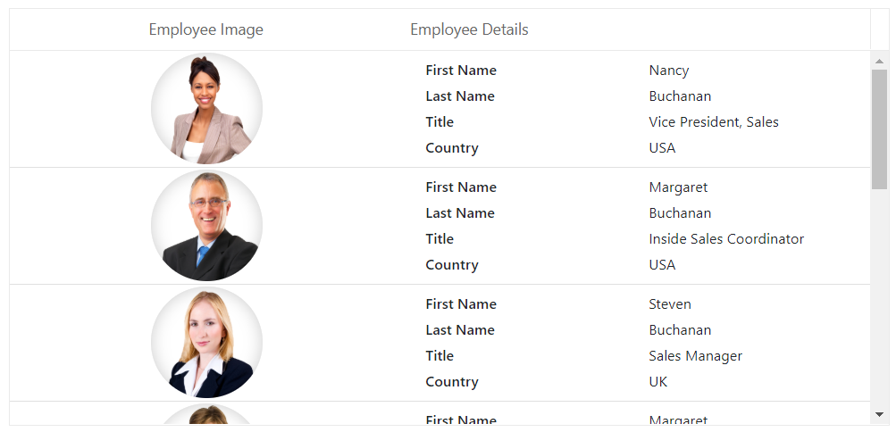
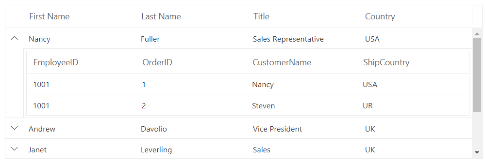
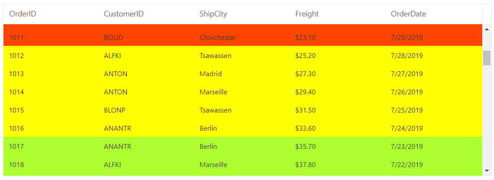
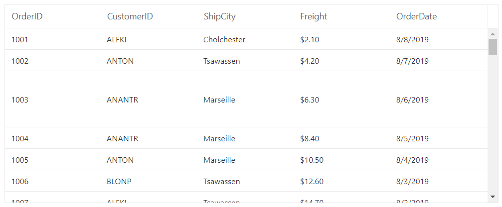

# Row

The row represents record details fetched from data source.

## Row template

> Before adding row template to the datagrid, we strongly recommend you to go through the [`template`](./templates/#templates) section topic to configure the template.

To know about **Row Template** in Blazor DataGrid Component, you can check this video.



The **RowTemplate** has an option to customize the look and behavior of the datagrid rows. The **RowTemplate** should be wrapped around a component named [`GridTemplates`](./templates/#gridtemplates-component) as follows. The **RowTemplate** content must be **TD** elements and the number of **TD** elements must match the number of datagrid columns.

```cshtml
@using Syncfusion.Blazor.Grids

<SfGrid DataSource="@Employees" Height="335px">
    <GridTemplates>
        <RowTemplate Context="emp">
            @{
                var employee = (emp as EmployeeData);
                <td class="photo">
                    
                </td>
                <td class="details">
                    <table class="CardTable" cellpadding="3" cellspacing="2">
                        <colgroup>
                            <col width="50%">
                            <col width="50%">
                        </colgroup>
                        <tbody>
                            <tr>
                                <td class="CardHeader">First Name </td>
                                <td>@employee.FirstName </td>
                            </tr>
                            <tr>
                                <td class="CardHeader">Last Name</td>
                                <td>@employee.LastName </td>
                            </tr>
                            <tr>
                                <td class="CardHeader">
                                    Title
                                </td>
                                <td>
                                    @employee.Title
                                </td>
                            </tr>
                            <tr>
                                <td class="CardHeader">
                                    Country
                                </td>
                                <td>
                                    @employee.Country
                                </td>
                            </tr>
                        </tbody>
                    </table>
                </td>
            }
        </RowTemplate>
    </GridTemplates>
    <GridColumns>
        <GridColumn HeaderText="Employee Image" Width="250" TextAlign="TextAlign.Center"> </GridColumn>
        <GridColumn HeaderText="Employee Details" Width="300" TextAlign="TextAlign.Left"></GridColumn>
    </GridColumns>
</SfGrid>

<style type="text/css" class="cssStyles">
    .photo img {
        width: 100px;
        height: 100px;
        border-radius: 50px;
        box-shadow: inset 0 0 1px #e0e0e0, inset 0 0 14px rgba(0, 0, 0, 0.2);
    }

    .photo,
    .details {
        border-color: #e0e0e0;
        border-style: solid;
    }

    .photo {
        border-width: 1px 0px 0px 0px;
        text-align: center;
    }

    .details {
        border-width: 1px 0px 0px 0px;
        padding-left: 18px;
    }

    .e-bigger .details {
        padding-left: 25px;
    }

    .e-device .details {
        padding-left: 8px;
    }

    .details > table {
        width: 100%;
    }

    .CardHeader {
        font-weight: 600;
    }

    td {
        padding: 2px 2px 3px 4px;
    }
</style>


@code {
    public List<EmployeeData> Employees { get; set; }

    protected override void OnInitialized()
    {
        Employees = Enumerable.Range(1, 9).Select(x => new EmployeeData()
        {
            EmployeeID = x,
            FirstName = (new string[] { "Nancy", "Andrew", "Janet", "Margaret", "Steven" })[new Random().Next(5)],
            LastName = (new string[] { "Davolio", "Fuller", "Leverling", "Peacock", "Buchanan" })[new Random().Next(5)],
            Title = (new string[] { "Sales Representative", "Vice President, Sales", "Sales Manager",
                                    "Inside Sales Coordinator" })[new Random().Next(4)],
            Country = (new string[] { "USA", "UK", "UAE", "NED",
                                    "BER" })[new Random().Next(4)],
        }).ToList();
    }

    public class EmployeeData
    {
        public int? EmployeeID { get; set; }
        public string FirstName { get; set; }
        public string LastName { get; set; }
        public string Title { get; set; }
        public string Country { get; set; }
    }
}

```

The output will be as follows.



### Row template with formatting

If the [`RowTemplate`](./templates/#gridtemplates-component) is used, the value cannot be formatted inside the template using the [`Columns.Format`](https://help.syncfusion.com/cr/blazor/Syncfusion.Blazor.Grids.ColumnModel.html#Syncfusion_Blazor_Grids_ColumnModel_Format) property. In that case, C# custom formats can be used.
Here [`Custom DateTime`](https://docs.microsoft.com/en-us/dotnet/standard/base-types/custom-date-and-time-format-strings) format is used for below sample.

```cshtml
@using Syncfusion.Blazor.Grids

<SfGrid DataSource="@Employees" Height="335px">
    <GridTemplates>
        <RowTemplate>
            @{
                var employee = (context as EmployeeData);
                <td class="photo">
                    
                </td>
                <td class="details">
                    <table class="CardTable" cellpadding="3" cellspacing="2">
                        <colgroup>
                            <col width="50%">
                            <col width="50%">
                        </colgroup>
                        <tbody>
                            <tr>
                                <td class="CardHeader">First Name </td>
                                <td>@employee.FirstName </td>
                            </tr>
                            <tr>
                                <td class="CardHeader">Last Name</td>
                                <td>@employee.LastName </td>
                            </tr>
                            <tr>
                                <td class="CardHeader">
                                    Title
                                </td>
                                <td>
                                    @employee.Title
                                </td>
                            </tr>
                            <tr>
                                <td class="CardHeader">
                                    Birth Date
                                </td>
                                <td>
                                    @employee.HireDate.Value.ToString("MM/dd/yyyy")
                                </td>
                            </tr>
                            <tr>
                                <td class="CardHeader">
                                    Country
                                </td>
                                <td>
                                    @employee.Country
                                </td>
                            </tr>
                        </tbody>
                    </table>
                </td>
            }
        </RowTemplate>
    </GridTemplates>
    <GridColumns>
        <GridColumn HeaderText="Employee Image" Width="250" TextAlign="TextAlign.Center"> </GridColumn>
        <GridColumn HeaderText="Employee Details" Width="300" TextAlign="TextAlign.Left"></GridColumn>
    </GridColumns>
</SfGrid>

<style type="text/css" class="cssStyles">
    .photo img {
        width: 100px;
        height: 100px;
        border-radius: 50px;
        box-shadow: inset 0 0 1px #e0e0e0, inset 0 0 14px rgba(0, 0, 0, 0.2);
    }

    .photo,
    .details {
        border-color: #e0e0e0;
        border-style: solid;
    }

    .photo {
        border-width: 1px 0px 0px 0px;
        text-align: center;
    }

    .details {
        border-width: 1px 0px 0px 0px;
        padding-left: 18px;
    }

    .e-bigger .details {
        padding-left: 25px;
    }

    .e-device .details {
        padding-left: 8px;
    }

    .details > table {
        width: 100%;
    }

    .CardHeader {
        font-weight: 600;
    }

    td {
        padding: 2px 2px 3px 4px;
    }
</style>


@code {
    public List<EmployeeData> Employees { get; set; }

    protected override void OnInitialized()
    {
        Employees = Enumerable.Range(1, 9).Select(x => new EmployeeData()
        {
            EmployeeID = x,
            FirstName = (new string[] { "Nancy", "Andrew", "Janet", "Margaret", "Steven" })[new Random().Next(5)],
            LastName = (new string[] { "Davolio", "Fuller", "Leverling", "Peacock", "Buchanan" })[new Random().Next(5)],
            Title = (new string[] { "Sales Representative", "Vice President, Sales", "Sales Manager",
                                    "Inside Sales Coordinator" })[new Random().Next(4)],
            HireDate = DateTime.Now.AddDays(-x),
            Country = (new string[] { "USA", "UK", "USA", "UK", "USA" })[new Random().Next(5)],
        }).ToList();
    }

    public class EmployeeData
    {
        public int? EmployeeID { get; set; }
        public string FirstName { get; set; }
        public string LastName { get; set; }
        public string Title { get; set; }
        public DateTime? HireDate { get; set; }
        public string Country { get; set; }
    }
}
```

The output will be as follows.


### Limitations

Row template feature is not compatible with all the features which are available in datagrid and it has limited features support. Here we have listed out the features which are compatible with row template feature.

* Filtering
* Paging
* Sorting
* Scrolling
* Searching
* Rtl
* Export
* Context Menu
* State Persistence

## Detail Template

> Before adding detail template to the datagrid, we strongly recommend you to go through the [`template`](./templates/#templates) section topic to configure the template.

To know about **Detail Template** in Blazor DataGrid Component, you can check this video.



The detail template provides additional information about a particular row by expanding or collapsing detail content. The **DetailTemplate** should be wrapped around a component named [`GridTemplates`](./templates/#gridtemplates-component) as follows.

```cshtml
@using Syncfusion.Blazor.Grids

<SfGrid DataSource="@Employees">
    <GridTemplates>
        <DetailTemplate>
            @{
                var employee = (context as EmployeeData);
                <table class="detailtable" width="100%">
                    <colgroup>
                        <col width="35%">
                        <col width="35%">
                        <col width="30%">
                    </colgroup>
                    <tbody>
                        <tr>
                            <td rowspan="4" style="text-align: center;">
                                
                            </td>
                            <td>
                                <span style="font-weight: 500;">Employee ID: </span> @employee.FirstName
                            </td>
                            <td>
                                <span style="font-weight: 500;">Hire Date: </span> @employee.HireDate.Value.ToShortDateString()
                            </td>
                        </tr>
                        <tr>
                            <td>
                                <span style="font-weight: 500;">Last Name: </span> @employee.LastName
                            </td>
                            <td>
                                <span style="font-weight: 500;">City: </span> @employee.City
                            </td>
                        </tr>
                        <tr>
                            <td>
                                <span style="font-weight: 500;">Title: </span> @employee.Title
                            </td>
                            <td>
                                <span style="font-weight: 500;">Country: </span> @employee.Country
                            </td>
                        </tr>
                    </tbody>
                </table>
            }
        </DetailTemplate>
    </GridTemplates>
    <GridColumns>
        <GridColumn Field=@nameof(EmployeeData.FirstName) HeaderText="First Name" Width="110"> </GridColumn>
        <GridColumn Field=@nameof(EmployeeData.LastName) HeaderText="Last Name" Width="110"></GridColumn>
        <GridColumn Field=@nameof(EmployeeData.Title) HeaderText="Title" Width="110"></GridColumn>
        <GridColumn Field=@nameof(EmployeeData.Country) HeaderText="Country" Width="110"></GridColumn>
    </GridColumns>
</SfGrid>

<style type="text/css" class="cssStyles">
    .detailtable td {
        font-size: 13px;
        padding: 4px;
        max-width: 0;
        overflow: hidden;
        text-overflow: ellipsis;
        white-space: nowrap;
    }

    .photo {
        width: 100px;
        height: 100px;
        border-radius: 50px;
        box-shadow: inset 0 0 1px #e0e0e0, inset 0 0 14px rgba(0,0,0,0.2);
    }
</style>

@code{
    public List<EmployeeData> Employees { get; set; }

    protected override void OnInitialized()
    {
        Employees = Enumerable.Range(1, 9).Select(x => new EmployeeData()
        {
            EmployeeID = x,
            FirstName = (new string[] { "Nancy", "Andrew", "Janet", "Margaret", "Steven" })[new Random().Next(5)],
            LastName = (new string[] { "Davolio", "Fuller", "Leverling", "Peacock", "Buchanan" })[new Random().Next(5)],
            Title = (new string[] { "Sales Representative", "Vice President, Sales", "Sales Manager",
                                    "Inside Sales Coordinator" })[new Random().Next(4)],
            HireDate = DateTime.Now.AddDays(-x),
            City = (new string[] { "Seattle", "Tacoma", "Redmond", "Kirkland", "London" })[new Random().Next(5)],
            Country = (new string[] { "USA", "UK" })[new Random().Next(2)],
        }).ToList();
    }

    public class EmployeeData
    {
        public int? EmployeeID { get; set; }
        public string FirstName { get; set; }
        public string LastName { get; set; }
        public string Title { get; set; }
        public DateTime? HireDate { get; set; }
        public string City { get; set; }
        public string Country { get; set; }
    }
}
```

The output will be as follows.


### Rendering custom component

To render the custom component inside the detail row, define the template in the [`DetailTemplate`](./templates/#detailtemplates-component) and render the
custom component in any of the detail row element.

In the below sample, a datagrid component is rendered as custom component using detailed row details.

```cshtml
@using Syncfusion.Blazor.Grids
@using Syncfusion.Blazor.Data

<SfGrid DataSource="@Employees" Height="315px">
    <GridTemplates>
        <DetailTemplate>
            @{
                var employee = (context as EmployeeData);
                <SfGrid DataSource="@Orders" Query="@(new Query().Where("EmployeeID", "equal", employee.EmployeeID))">
                    <GridColumns>
                        <GridColumn Field=@nameof(Order.OrderID) HeaderText="First Name" Width="110"> </GridColumn>
                        <GridColumn Field=@nameof(Order.CustomerName) HeaderText="Last Name" Width="110"></GridColumn>
                        <GridColumn Field=@nameof(Order.ShipCountry) HeaderText="Title" Width="110"></GridColumn>
                    </GridColumns>
                </SfGrid>
            }
        </DetailTemplate>
    </GridTemplates>
    <GridColumns>
        <GridColumn Field=@nameof(EmployeeData.FirstName) HeaderText="First Name" Width="110"> </GridColumn>
        <GridColumn Field=@nameof(EmployeeData.LastName) HeaderText="Last Name" Width="110"></GridColumn>
        <GridColumn Field=@nameof(EmployeeData.Title) HeaderText="Title" Width="110"></GridColumn>
        <GridColumn Field=@nameof(EmployeeData.Country) HeaderText="Country" Width="110"></GridColumn>
    </GridColumns>
</SfGrid>

@code{

    List<EmployeeData> Employees = new List<EmployeeData>
{
        new EmployeeData() {EmployeeID = 1001, FirstName="Nancy", LastName="Fuller", Title="Sales Representative", Country="USA"},
        new EmployeeData() {EmployeeID = 1002, FirstName="Andrew", LastName="Davolio", Title="Vice President", Country="UK"},
        new EmployeeData() {EmployeeID = 1003, FirstName="Janet", LastName="Leverling", Title="Sales", Country="UK"},
        new EmployeeData() {EmployeeID = 1004, FirstName="Margaret", LastName="Peacock", Title="Sales Manager", Country="UAE"},
        new EmployeeData() {EmployeeID = 1005, FirstName="Steven", LastName="Buchanan", Title="Inside Sales Coordinator", Country="USA"},
        new EmployeeData() {EmployeeID = 1006, FirstName="Smith", LastName="Steven", Title="HR Manager", Country="UAE"},
    };

    List<Order> Orders = new List<Order> {
        new Order() {EmployeeID = 1001, OrderID=001, CustomerName="Nancy", ShipCountry="USA"},
        new Order() {EmployeeID = 1001, OrderID=002, CustomerName="Steven", ShipCountry="UR"},
        new Order() {EmployeeID = 1002, OrderID=003, CustomerName="Smith", ShipCountry="UK"},
        new Order() {EmployeeID = 1002, OrderID=004, CustomerName="Smith", ShipCountry="USA"},
        new Order() {EmployeeID = 1003, OrderID=005, CustomerName="Nancy", ShipCountry="ITA"},
        new Order() {EmployeeID = 1003, OrderID=006, CustomerName="Nancy", ShipCountry="UK"},
        new Order() {EmployeeID = 1003, OrderID=007, CustomerName="Steven", ShipCountry="GER"},
        new Order() {EmployeeID = 1004, OrderID=008, CustomerName="Andrew", ShipCountry="GER"},
        new Order() {EmployeeID = 1005, OrderID=009, CustomerName="Fuller", ShipCountry="USA"},
        new Order() {EmployeeID = 1006, OrderID=010, CustomerName="Leverling", ShipCountry="UAE"},
        new Order() {EmployeeID = 1006, OrderID=011, CustomerName="Margaret", ShipCountry="KEN"},
        new Order() {EmployeeID = 1007, OrderID=012, CustomerName="Buchanan", ShipCountry="GER"},
        new Order() {EmployeeID = 1008, OrderID=013, CustomerName="Nancy", ShipCountry="USA"},
        new Order() {EmployeeID = 1006, OrderID=014, CustomerName="Andrew", ShipCountry="UAE"},
    };

    public class EmployeeData
    {
        public int? EmployeeID { get; set; }
        public string FirstName { get; set; }
        public string LastName { get; set; }
        public string Title { get; set; }
        public string Country { get; set; }
    }

    public class Order
    {
        public int? EmployeeID { get; set; }
        public int? OrderID { get; set; }
        public string CustomerName { get; set; }
        public string ShipCountry { get; set; }
    }
}
```

The output will be as follows.



### Expand by external button

By default, detail rows render in collapsed state. You can expand a detail row by invoking the `Expand` method using the external button.

```cshtml
@using Syncfusion.Blazor.Buttons
@using Syncfusion.Blazor.Grids

<SfButton Content="Expand" OnClick="BtnClick"></SfButton>

<SfGrid @ref="GridObj" DataSource="@Employees">
    <GridTemplates>
        <DetailTemplate>
            @{
                var employee = (context as EmployeeData);
                <table class="detailtable" width="100%">
                    <colgroup>
                        <col width="35%">
                        <col width="35%">
                        <col width="30%">
                    </colgroup>
                    <tbody>
                        <tr>
                            <td rowspan="4" style="text-align: center;">
                                
                            </td>
                            <td>
                                <span style="font-weight: 500;">Employee ID: </span> @employee.FirstName
                            </td>
                            <td>
                                <span style="font-weight: 500;">Hire Date: </span> @employee.HireDate.Value.ToShortDateString()
                            </td>
                        </tr>
                        <tr>
                            <td>
                                <span style="font-weight: 500;">Last Name: </span> @employee.LastName
                            </td>
                            <td>
                                <span style="font-weight: 500;">City: </span> @employee.City
                            </td>
                        </tr>
                        <tr>
                            <td>
                                <span style="font-weight: 500;">Title: </span> @employee.Title
                            </td>
                            <td>
                                <span style="font-weight: 500;">Country: </span> @employee.Country
                            </td>
                        </tr>
                    </tbody>
                </table>
            }
        </DetailTemplate>
    </GridTemplates>
    <GridColumns>
        <GridColumn Field=@nameof(EmployeeData.FirstName) HeaderText="First Name" Width="110"> </GridColumn>
        <GridColumn Field=@nameof(EmployeeData.LastName) HeaderText="Last Name" Width="110"></GridColumn>
        <GridColumn Field=@nameof(EmployeeData.Title) HeaderText="Title" Width="110"></GridColumn>
        <GridColumn Field=@nameof(EmployeeData.Country) HeaderText="Country" Width="110"></GridColumn>
    </GridColumns>
</SfGrid>

<style type="text/css" class="cssStyles">
    .detailtable td {
        font-size: 13px;
        padding: 4px;
        max-width: 0;
        overflow: hidden;
        text-overflow: ellipsis;
        white-space: nowrap;
    }

    .photo {
        width: 100px;
        height: 100px;
        border-radius: 50px;
        box-shadow: inset 0 0 1px #e0e0e0, inset 0 0 14px rgba(0,0,0,0.2);
    }
</style>

@code{
    public SfGrid<EmployeeData> GridObj;

    public List<EmployeeData> Employees { get; set; }

    protected override void OnInitialized()
    {
        Employees = Enumerable.Range(1, 9).Select(x => new EmployeeData()
        {
            EmployeeID = x,
            FirstName = (new string[] { "Nancy", "Andrew", "Janet", "Margaret", "Steven" })[new Random().Next(5)],
            LastName = (new string[] { "Davolio", "Fuller", "Leverling", "Peacock", "Buchanan" })[new Random().Next(5)],
            Title = (new string[] { "Sales Representative", "Vice President, Sales", "Sales Manager",
                                    "Inside Sales Coordinator" })[new Random().Next(4)],
            HireDate = DateTime.Now.AddDays(-x),
            City = (new string[] { "Seattle", "Tacoma", "Redmond", "Kirkland", "London" })[new Random().Next(5)],
            Country = (new string[] { "USA", "UK" })[new Random().Next(2)],
        }).ToList();
    }

    public class EmployeeData
    {
        public int? EmployeeID { get; set; }
        public string FirstName { get; set; }
        public string LastName { get; set; }
        public string Title { get; set; }
        public DateTime? HireDate { get; set; }
        public string City { get; set; }
        public string Country { get; set; }
    }

    public void BtnClick()
    {
        this.GridObj.DetailExpandAll();
    }
}
```

> * You can expand all the rows by using `ExpandAll` method.
> * If you want to expand all the rows at initial DataGrid rendering, then use `ExpandAll` method in [`dataBound`](https://help.syncfusion.com/cr/blazor/Syncfusion.Blazor.Grids.SfGrid-1.html) event of the DataGrid.

<!-- Row spanning

The datagrid has option to span row cells. To achieve this, You need to define the `RowSpan` attribute to span cells in the [`QueryCellInfo`](https://help.syncfusion.com/cr/blazor/Syncfusion.Blazor.Grids.SfGrid-1.html) event.

In the following demo, **Davolio** cell is spanned to two rows in the **EmployeeName** column.

Also DataGrid supports the spanning of rows and columns for same cells. **Lunch Break** cell is spanned to two rows and three columns in the **1:00** column.

```cshtml
@using Syncfusion.Blazor.Grids

<SfGrid DataSource="@columnSpanData" GridLines="Syncfusion.Blazor.Grids.GridLine.Both">
    <GridEvents TValue="SpanData" QueryCellInfo="QueryCellEvent"></GridEvents>
    <GridColumns>
        <GridColumn Field=@nameof(SpanData.EmployeeID) HeaderText="First Name" Width="110"> </GridColumn>
        <GridColumn Field=@nameof(SpanData.EmployeeName) HeaderText="Last Name" Width="110"></GridColumn>
        <GridColumn Field=@nameof(SpanData.Time900) HeaderText="9:00" Width="110"></GridColumn>
        <GridColumn Field=@nameof(SpanData.Time930) HeaderText="9:30" Width="110"></GridColumn>
        <GridColumn Field=@nameof(SpanData.Time1000) HeaderText="10:00" Width="110"></GridColumn>
        <GridColumn Field=@nameof(SpanData.Time1030) HeaderText="10:30" Width="110"></GridColumn>
        <GridColumn Field=@nameof(SpanData.Time1100) HeaderText="11:00" Width="110"></GridColumn>
        <GridColumn Field=@nameof(SpanData.Time1130) HeaderText="11:30" Width="110"></GridColumn>
        <GridColumn Field=@nameof(SpanData.Time1200) HeaderText="12:00" Width="110"></GridColumn>
        <GridColumn Field=@nameof(SpanData.Time1230) HeaderText="12:30" Width="110"></GridColumn>
        <GridColumn Field=@nameof(SpanData.Time100) HeaderText="1:00" Width="110"></GridColumn>
        <GridColumn Field=@nameof(SpanData.Time130) HeaderText="1:30" Width="110"></GridColumn>
        <GridColumn Field=@nameof(SpanData.Time200) HeaderText="2:00" Width="110"></GridColumn>
        <GridColumn Field=@nameof(SpanData.Time230) HeaderText="2:30" Width="110"></GridColumn>
        <GridColumn Field=@nameof(SpanData.Time300) HeaderText="3:00" Width="110"></GridColumn>
        <GridColumn Field=@nameof(SpanData.Time330) HeaderText="3:30" Width="110"></GridColumn>
        <GridColumn Field=@nameof(SpanData.Time400) HeaderText="4:00" Width="110"></GridColumn>
        <GridColumn Field=@nameof(SpanData.Time430) HeaderText="4:30" Width="110"></GridColumn>
        <GridColumn Field=@nameof(SpanData.Time500) HeaderText="5:00" Width="110"></GridColumn>
    </GridColumns>
</SfGrid>

@code {

    List<SpanData> columnSpanData = new List<SpanData>
    {
        new SpanData() { EmployeeID = 10001 , EmployeeName = "Davolio", Time900 = "Analysis Tasks" , Time930 = "Analysis Tasks", Time1000 = "Team Meeting", Time1030 = "Testing", Time1100 = "Development", Time1130 = "Development", Time1200 = "Development", Time1230 = "Support", Time100 = "Lunch Break",  Time130 = "Lunch Break", Time200 = "Lunch Break" , Time230 = "Testing",
        Time300 = "Testing", Time330 = "Development", Time400 = "Conference",  Time430 = "Team Meeting", Time500 = "Team Meeting"  },

        new SpanData() { EmployeeID = 10002 , EmployeeName = "Buchanan", Time900 = "Task Assign" , Time930 = "Support", Time1000 = "Support", Time1030 = "Support", Time1100 = "Testing", Time1130 = "Testing", Time1200 = "Testing", Time1230 = "Testing", Time100 = "Lunch Break",  Time130 = "Lunch Break", Time200 = "Lunch Break" , Time230 = "Development",
        Time300 = "Development", Time330 = "Check Mail", Time400 = "'Check Mail",  Time430 = "Team Meeting", Time500 = "Team Meeting"  },

        new SpanData() { EmployeeID = 10003 , EmployeeName = "Fuller", Time900 = "Check Mail" , Time930 = "Check Mail", Time1000 = "Check Mail", Time1030 = "Analysis Tasks", Time1100 = "Analysis Tasks", Time1130 = "Support", Time1200 = "Support", Time1230 = "Support", Time100 = "Lunch Break",  Time130 = "Lunch Break", Time200 = "Lunch Break" , Time230 = "Development",
        Time300 = "Development", Time330 = "Team Meeting", Time400 = "Team Meeting",  Time430 = "Development", Time500 = "Development"  },

        new SpanData() { EmployeeID = 10004 , EmployeeName = "Leverling", Time900 = "Testing" , Time930 = "Check Mail", Time1000 = "Check Mail", Time1030 = "Support", Time1100 = "Testing", Time1130 = "Testing", Time1200 = "Testing", Time1230 = "Testing", Time100 = "Lunch Break",  Time130 = "Lunch Break", Time200 = "Lunch Break" , Time230 = "Development",
        Time300 = "Development", Time330 = "Check Mail", Time400 = "Conference",  Time430 = "Conference", Time500 = "Team Meeting"  },

        new SpanData() { EmployeeID = 10005 , EmployeeName = "Peacock", Time900 = "Task Assign" , Time930 = "Task Assign", Time1000 = "Task Assign", Time1030 = "Task Assign", Time1100 = "Check Mail", Time1130 = "Support", Time1200 = "Support", Time1230 = "Support", Time100 = "Lunch Break",  Time130 = "Lunch Break", Time200 = "Lunch Break" , Time230 = "Development",
        Time300 = "Development", Time330 = "Team Meeting", Time400 = "Team Meeting",  Time430 = "Testing", Time500 = "Testing"  },

        new SpanData() { EmployeeID = 10006 , EmployeeName = "Janet", Time900 = "Testing" , Time930 = "Testing", Time1000 = "Support", Time1030 = "Support", Time1100 = "Support", Time1130 = "Team Meeting", Time1200 = "Team Meeting", Time1230 = "Team Meeting", Time100 = "Lunch Break",  Time130 = "Lunch Break", Time200 = "Lunch Break" , Time230 = "Development",
        Time300 = "Development", Time330 = "Team Meeting", Time400 = "Team Meeting",  Time430 = "Development", Time500 = "Development"  },

        new SpanData() { EmployeeID = 10007 , EmployeeName = "Suyama", Time900 = "Analysis Tasks" , Time930 = "Analysis Tasks", Time1000 = "Testing", Time1030 = "Development", Time1100 = "Development", Time1130 = "Testing", Time1200 = "Testing", Time1230 = "Testing", Time100 = "Lunch Break",  Time130 = "Lunch Break", Time200 = "Lunch Break" , Time230 = "Support",
        Time300 = "Build", Time330 = "Build", Time400 = "Check Mail",  Time430 = "Check Mail", Time500 = "Check Mail"  },
    };

    public class SpanData
    {
        public int EmployeeID { get; set; }
        public string EmployeeName { get; set; }
        public string Time900 { get; set; }
        public string Time930 { get; set; }
        public string Time1000 { get; set; }
        public string Time1030 { get; set; }
        public string Time1100 { get; set; }
        public string Time1130 { get; set; }
        public string Time1200 { get; set; }
        public string Time1230 { get; set; }
        public string Time100 { get; set; }
        public string Time130 { get; set; }
        public string Time200 { get; set; }
        public string Time230 { get; set; }
        public string Time300 { get; set; }
        public string Time330 { get; set; }
        public string Time400 { get; set; }
        public string Time430 { get; set; }
        public string Time500 { get; set; }

    }
    public void QueryCellEvent(Syncfusion.Blazor.Grids.QueryCellInfoEventArgs<SpanData> args)
    {
        var DataSpan = args.Data as SpanData;
        switch (DataSpan.EmployeeID)
        {
            case 10001:
            if (args.Column.Field == "Time900" || args.Column.Field == "Time230" || args.Column.Field == "Time430")
            {
                args.Cell.SetAttribute("ColSpan", 2);
            }
                else if (args.Column.Field == "Time1100")
                {
                    args.Cell.SetAttribute("ColSpan", 2);
                }
                else if (args.Column.Field == "EmployeeName")
                {
                    args.Cell.SetAttribute("RowSpan", 2);
                }
                else if (args.Column.Field == "Time100")
                {
                    args.Cell.SetAttribute("ColSpan", 3);
                    args.Cell.SetAttribute("RowSpan", 2);
                }
                break;
            case 10002:
                if (args.Column.Field == "Time930" || args.Column.Field == "Time230" ||
                    args.Column.Field == "Time430")
                {
                    args.Cell.SetAttribute("ColSpan", 3);
                }
                else if (args.Column.Field == "Time1100")
                {
                    args.Cell.SetAttribute("ColSpan", 4);
                }
                break;
            case 10003:
                if (args.Column.Field == "Time900" || args.Column.Field == "Time1130")
                {
                    args.Cell.SetAttribute("ColSpan", 3);
                }
                else if (args.Column.Field == "Time1030" || args.Column.Field == "Time330" ||
                  args.Column.Field == "Time430" || args.Column.Field == "Time230")
                {
                    args.Cell.SetAttribute("ColSpan", 2);
                }
                break;
            case 10004:
                if (args.Column.Field == "Time900")
                {
                    args.Cell.SetAttribute("ColSpan", 3);
                }
                else if (args.Column.Field == "Time1100")
                {
                    args.Cell.SetAttribute("ColSpan", 4);
                }
                else if (args.Column.Field == "Time400" || args.Column.Field == "Time230")
                {
                    args.Cell.SetAttribute("ColSpan", 2);
                }
                break;
            case 10005:
                if (args.Column.Field == "Time900")
                {
                    args.Cell.SetAttribute("ColSpan", 4);
                }
                else if (args.Column.Field == "Time1130")
                {
                    args.Cell.SetAttribute("ColSpan", 3);
                }
                else if (args.Column.Field == "Time330" || args.Column.Field == "Time430" || args.Column.Field == "Time230")
                {
                    args.Cell.SetAttribute("ColSpan", 2);
                }
                break;
            case 10006:
                if (args.Column.Field == "Time900" || args.Column.Field == "Time430" ||
                    args.Column.Field == "Time230" || args.Column.Field == "Time330")
                {
                    args.Cell.SetAttribute("ColSpan", 2);
                }
                else if (args.Column.Field == "Time1000" || args.Column.Field == "Time1130")
                {
                    args.Cell.SetAttribute("ColSpan", 2);
                }
                break;
            case 10007:
                if (args.Column.Field == "Time900" || args.Column.Field == "Time300" || args.Column.Field == "Time1030")
                {
                    args.Cell.SetAttribute("ColSpan", 2);
                }
                else if (args.Column.Field == "Time1130" || args.Column.Field == "Time400")
                {
                    args.Cell.SetAttribute("ColSpan", 3);
                }
                break;
        }
    }
}
```

> When paging is enabled in datagrid, you can disable the rows and columns spanning for any particular page. To achieve this, we need to check **RequestType** as paging `<code class='language-text'> string</code>` in [`QueryCellInfo`](https://help.syncfusion.com/cr/blazor/Syncfusion.Blazor.Grids.SfGrid-1.html) event of datagrid. -->

## Customize rows

You can customize the appearance of a row by using the [`RowDataBound`](https://help.syncfusion.com/cr/blazor/Syncfusion.Blazor.Grids.SfGrid-1.html) event.
The [`RowDataBound`](https://help.syncfusion.com/cr/blazor/Syncfusion.Blazor.Grids.SfGrid-1.html) event triggers for every row. In the event handler, you can get the
**RowDataBoundEventArgs** that contains details of the row.

```cshtml
@using Syncfusion.Blazor.Grids

<SfGrid DataSource="@Orders" EnableHover=false AllowSelection=false Height="280">
    <GridEvents TValue="Order" RowDataBound="RowBound"></GridEvents>
    <GridColumns>
        <GridColumn Field=@nameof(Order.OrderID) HeaderText="Order ID" Width="110"> </GridColumn>
        <GridColumn Field=@nameof(Order.CustomerID) HeaderText="Customer ID" Width="110"></GridColumn>
        <GridColumn Field=@nameof(Order.ShipCity) HeaderText="Ship City" Width="110"></GridColumn>
        <GridColumn Field=@nameof(Order.Freight) HeaderText="Freight" Format="C2" Width="110"></GridColumn>
        <GridColumn Field=@nameof(Order.OrderDate) HeaderText="Order Date" Format="d" Width="110" Type="ColumnType.Date"></GridColumn>
    </GridColumns>
</SfGrid>

<style>
    .below-25 {
        background-color: orangered;
    }

    .below-35 {
        background-color: yellow;
    }

    .above-35 {
        background-color: greenyellow
    }
</style>

@code {

    public List<Order> Orders { get; set; }

    protected override void OnInitialized()
    {
        Orders = Enumerable.Range(1, 75).Select(x => new Order()
        {
            OrderID = 1000 + x,
            CustomerID = (new string[] { "ALFKI", "ANANTR", "ANTON", "BLONP", "BOLID" })[new Random().Next(5)],
            ShipCity = (new string[] { "Berlin", "Madrid", "Cholchester", "Marseille", "Tsawassen" })[new Random().Next(5)],
            Freight = 2.1 * x,
            OrderDate = DateTime.Now.AddDays(-x),
        }).ToList();
    }

    public class Order
    {
        public int? OrderID { get; set; }
        public string CustomerID { get; set; }
        public string ShipCity { get; set; }
        public DateTime? OrderDate { get; set; }
        public double? Freight { get; set; }
    }

    public void RowBound(RowDataBoundEventArgs<Order> args)
    {
        if (args.Data.Freight < 25)
        {
            args.Row.AddClass(new string[] { "below-25" });
        }
        else if (args.Data.Freight < 35)
        {
            args.Row.AddClass(new string[] { "below-35" });
        }
        else
        {
            args.Row.AddClass(new string[] { "above-35" });
        }
    }
}
```

The output will be as follows.



## Styling alternate rows

You can change the datagrid's alternative rows background color by overriding the **.e-altrow** class.

```css
.e-grid .e-altrow {
    background-color: #fafafa;
}
```

Please refer to the following example.

```cshtml
@using Syncfusion.Blazor.Grids

<SfGrid DataSource="@Orders" Height="280">
    <GridColumns>
        <GridColumn Field=@nameof(Order.OrderID) HeaderText="Order ID" Width="110"> </GridColumn>
        <GridColumn Field=@nameof(Order.CustomerID) HeaderText="Customer ID" Width="110"></GridColumn>
        <GridColumn Field=@nameof(Order.ShipCity) HeaderText="Ship City" Width="110"></GridColumn>
        <GridColumn Field=@nameof(Order.Freight) HeaderText="Freight" Format="C2" Width="110"></GridColumn>
        <GridColumn Field=@nameof(Order.OrderDate) HeaderText="Order Date" Format="d" Width="110" Type="ColumnType.Date"></GridColumn>
    </GridColumns>
</SfGrid>

<style type="text/css" class="cssStyles">
    .e-grid .e-altrow {
        background-color: #fafafa;
    }
</style>

@code {

    public List<Order> Orders { get; set; }

    protected override void OnInitialized()
    {
        Orders = Enumerable.Range(1, 75).Select(x => new Order()
        {
            OrderID = 1000 + x,
            CustomerID = (new string[] { "ALFKI", "ANANTR", "ANTON", "BLONP", "BOLID" })[new Random().Next(5)],
            ShipCity = (new string[] { "Berlin", "Madrid", "Cholchester", "Marseille", "Tsawassen" })[new Random().Next(5)],
            Freight = 2.1 * x,
            OrderDate = DateTime.Now.AddDays(-x),
        }).ToList();
    }

    public class Order
    {
        public int? OrderID { get; set; }
        public string CustomerID { get; set; }
        public string ShipCity { get; set; }
        public DateTime? OrderDate { get; set; }
        public double? Freight { get; set; }
    }
}
```

The output will be as follows.


## Row height

You can customize the row height of datagrid rows through the [`RowHeight`](https://help.syncfusion.com/cr/blazor/Syncfusion.Blazor.Grids.SfGrid-1.html#Syncfusion_Blazor_Grids_SfGrid_1_RowHeight) property. The [`RowHeight`](hhttps://help.syncfusion.com/cr/blazor/Syncfusion.Blazor.Grids.SfGrid-1.html#Syncfusion_Blazor_Grids_SfGrid_1_RowHeight) property
is used to change the row height of entire datagrid rows.

In the below example, the `RowHeight` is set as '60'.

```cshtml
@using Syncfusion.Blazor.Grids

<SfGrid DataSource="@Orders" Height="280" RowHeight="60">
    <GridColumns>
        <GridColumn Field=@nameof(Order.OrderID) HeaderText="Order ID" Width="110"> </GridColumn>
        <GridColumn Field=@nameof(Order.CustomerID) HeaderText="Customer ID" Width="110"></GridColumn>
        <GridColumn Field=@nameof(Order.ShipCity) HeaderText="Ship City" Width="110"></GridColumn>
        <GridColumn Field=@nameof(Order.Freight) HeaderText="Freight" Format="C2" Width="110"></GridColumn>
        <GridColumn Field=@nameof(Order.OrderDate) HeaderText="Order Date" Format="d" Width="110" Type="ColumnType.Date"></GridColumn>
    </GridColumns>
</SfGrid>

@code {

    public List<Order> Orders { get; set; }

    protected override void OnInitialized()
    {
        Orders = Enumerable.Range(1, 75).Select(x => new Order()
        {
            OrderID = 1000 + x,
            CustomerID = (new string[] { "ALFKI", "ANANTR", "ANTON", "BLONP", "BOLID" })[new Random().Next(5)],
            ShipCity = (new string[] { "Berlin", "Madrid", "Cholchester", "Marseille", "Tsawassen" })[new Random().Next(5)],
            Freight = 2.1 * x,
            OrderDate = DateTime.Now.AddDays(-x),
        }).ToList();
    }

    public class Order
    {
        public int? OrderID { get; set; }
        public string CustomerID { get; set; }
        public string ShipCity { get; set; }
        public DateTime? OrderDate { get; set; }
        public double? Freight { get; set; }
    }
}
```

The output will be as follows.


### Customize row height for particular row

DataGrid row height for particular row can be customized using the [`RowDataBound`](https://help.syncfusion.com/cr/blazor/Syncfusion.Blazor.Grids.SfGrid-1.html)
event by setting the height by adding `row-height` class in required row element.

In the below example, the row height for the row with OrderID as '1003' is set as '90px' using the [`RowDataBound`](https://help.syncfusion.com/cr/blazor/Syncfusion.Blazor.Grids.SfGrid-1.html) event.

```cshtml
@using Syncfusion.Blazor.Grids

<SfGrid DataSource="@Orders" Height="280">
    <GridEvents TValue="Order" RowDataBound="RowBound"></GridEvents>
    <GridColumns>
        <GridColumn Field=@nameof(Order.OrderID) HeaderText="Order ID" Width="110"> </GridColumn>
        <GridColumn Field=@nameof(Order.CustomerID) HeaderText="Customer ID" Width="110"></GridColumn>
        <GridColumn Field=@nameof(Order.ShipCity) HeaderText="Ship City" Width="110"></GridColumn>
        <GridColumn Field=@nameof(Order.Freight) HeaderText="Freight" Format="C2" Width="110"></GridColumn>
        <GridColumn Field=@nameof(Order.OrderDate) HeaderText="Order Date" Format="d" Width="110" Type="ColumnType.Date"></GridColumn>
    </GridColumns>
</SfGrid>

<style>
    .row-height {
        height: 90px;
    }
</style>

@code {

    public List<Order> Orders { get; set; }

    protected override void OnInitialized()
    {
        Orders = Enumerable.Range(1, 75).Select(x => new Order()
        {
            OrderID = 1000 + x,
            CustomerID = (new string[] { "ALFKI", "ANANTR", "ANTON", "BLONP", "BOLID" })[new Random().Next(5)],
            ShipCity = (new string[] { "Berlin", "Madrid", "Cholchester", "Marseille", "Tsawassen" })[new Random().Next(5)],
            Freight = 2.1 * x,
            OrderDate = DateTime.Now.AddDays(-x),
        }).ToList();
    }

    public class Order
    {
        public int? OrderID { get; set; }
        public string CustomerID { get; set; }
        public string ShipCity { get; set; }
        public DateTime? OrderDate { get; set; }
        public double? Freight { get; set; }
    }

    public void RowBound(RowDataBoundEventArgs<Order> args)
    {
        if (args.Data.OrderID == 1003)
        {
            args.Row.AddClass(new string[] { "row-height" });
        }
    }
}
```

The output will be as follows.



> You can refer to our [Blazor DataGrid](https://www.syncfusion.com/blazor-components/blazor-datagrid) feature tour page for its groundbreaking feature representations. You can also explore our [Blazor DataGrid example](https://blazor.syncfusion.com/demos/datagrid/overview?theme=bootstrap4) to understand how to present and manipulate data.