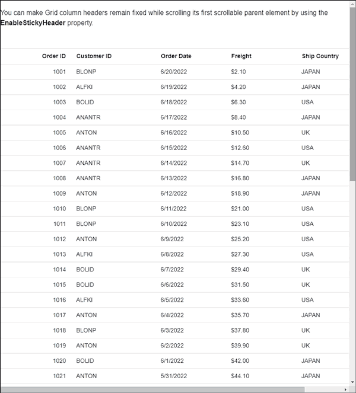
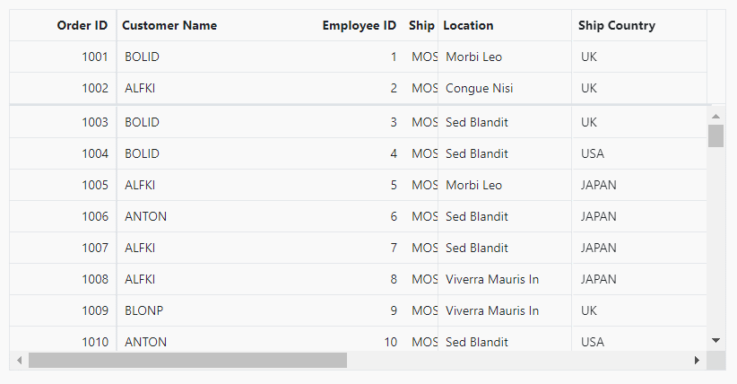
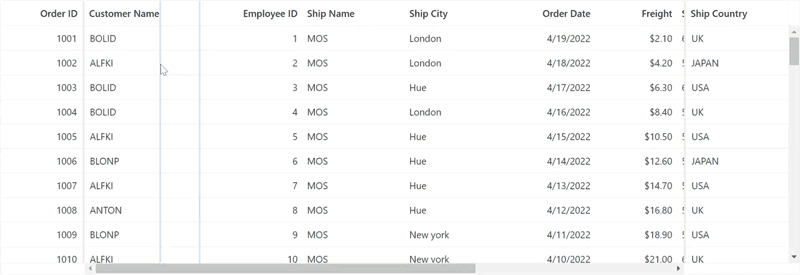
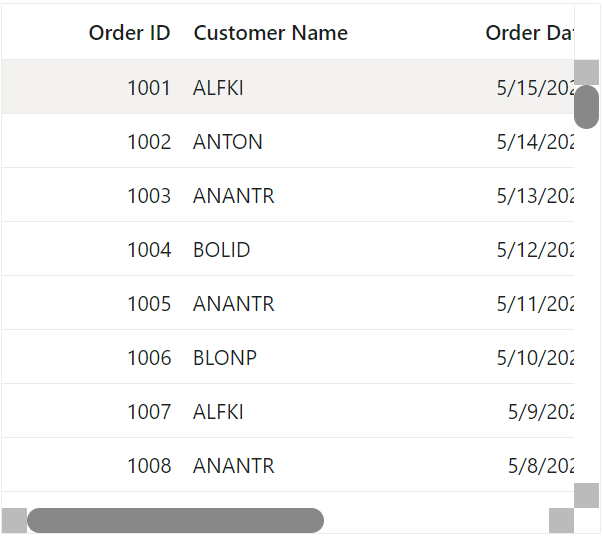

# Scrolling in Blazor DataGrid Component

 The scrollbar will be displayed in the datagrid when content exceeds the element [Width](https://help.syncfusion.com/cr/blazor/Syncfusion.Blazor.Grids.SfGrid-1.html#Syncfusion_Blazor_Grids_SfGrid_1_Width) or [Height](https://help.syncfusion.com/cr/blazor/Syncfusion.Blazor.Grids.SfGrid-1.html#Syncfusion_Blazor_Grids_SfGrid_1_Height). The vertical and horizontal scrollbars will be displayed based on the following criteria:

* The vertical scrollbar appears when the total height of rows present in the datagrid exceeds its element height.
* The horizontal scrollbar appears when the sum of columns width exceeds the datagrid element width.
* The [Height](https://help.syncfusion.com/cr/blazor/Syncfusion.Blazor.Grids.SfGrid-1.html#Syncfusion_Blazor_Grids_SfGrid_1_Height) and [Width](https://help.syncfusion.com/cr/blazor/Syncfusion.Blazor.Grids.SfGrid-1.html#Syncfusion_Blazor_Grids_SfGrid_1_Width) are used to set the datagrid height and width, respectively.

N> The default value for [Height](https://help.syncfusion.com/cr/blazor/Syncfusion.Blazor.Grids.SfGrid-1.html#Syncfusion_Blazor_Grids_SfGrid_1_Height) and [Width](https://help.syncfusion.com/cr/blazor/Syncfusion.Blazor.Grids.SfGrid-1.html#Syncfusion_Blazor_Grids_SfGrid_1_Width) is **auto**.

## Set width and height

To specify the [Width](https://help.syncfusion.com/cr/blazor/Syncfusion.Blazor.Grids.SfGrid-1.html#Syncfusion_Blazor_Grids_SfGrid_1_Width) and [Height](https://help.syncfusion.com/cr/blazor/Syncfusion.Blazor.Grids.SfGrid-1.html#Syncfusion_Blazor_Grids_SfGrid_1_Height) of the scroller in the pixel, set the pixel value to a number.

```cshtml
@using Syncfusion.Blazor.Grids

<SfGrid DataSource="@Orders" Height="315" Width="400">
    <GridColumns>
        <GridColumn Field=@nameof(Order.OrderID) HeaderText="Order ID" TextAlign="TextAlign.Right" Width="120"></GridColumn>
        <GridColumn Field=@nameof(Order.CustomerID) HeaderText="Customer Name" Width="150"></GridColumn>
        <GridColumn Field=@nameof(Order.OrderDate) HeaderText=" Order Date" Format="d" Type="ColumnType.Date" TextAlign="TextAlign.Right" Width="130"></GridColumn>
        <GridColumn Field=@nameof(Order.Freight) HeaderText="Freight" Format="C2" TextAlign="TextAlign.Right" Width="120"></GridColumn>
        <GridColumn Field=@nameof(Order.ShipCountry) HeaderText="Ship Country" Width="150"></GridColumn>
    </GridColumns>
</SfGrid>

@code{
    public List<Order> Orders { get; set; }

    protected override void OnInitialized()
    {
        Orders = Enumerable.Range(1, 75).Select(x => new Order()
        {
            OrderID = 1000 + x,
            CustomerID = (new string[] { "ALFKI", "ANANTR", "ANTON", "BLONP", "BOLID" })[new Random().Next(5)],
            Freight = 2.1 * x,
            OrderDate = DateTime.Now.AddDays(-x),
            ShipCountry = (new string[] { "USA", "UK", "JAPAN" })[new Random().Next(3)]
        }).ToList();
    }

    public class Order {
        public int? OrderID { get; set; }
        public string CustomerID { get; set; }
        public DateTime? OrderDate { get; set; }
        public double? Freight { get; set; }
        public string ShipCountry { get; set; }
    }

}
```

## Responsive with parent container

Specify the [Width](https://help.syncfusion.com/cr/blazor/Syncfusion.Blazor.Grids.SfGrid-1.html#Syncfusion_Blazor_Grids_SfGrid_1_Width) and [Height](https://help.syncfusion.com/cr/blazor/Syncfusion.Blazor.Grids.SfGrid-1.html#Syncfusion_Blazor_Grids_SfGrid_1_Height) as **100%** to make the datagrid element fill its parent container. Setting the [Height](https://help.syncfusion.com/cr/blazor/Syncfusion.Blazor.Grids.SfGrid-1.html#Syncfusion_Blazor_Grids_SfGrid_1_Height) to **100%** requires the datagrid parent element to have explicit height or you can use calc function to set explicit height based on the browser layout.

```cshtml
@using Syncfusion.Blazor.Grids

<div style="width:calc(100vw - 20rem); height:calc(100vh - 7rem);">
@*Change the rem values based on your browser page layout*@
<SfGrid DataSource="@Orders" Height="100%" Width="100%">
    <GridColumns>
        <GridColumn Field=@nameof(Order.OrderID) HeaderText="Order ID" TextAlign="TextAlign.Right" Width="120"></GridColumn>
        <GridColumn Field=@nameof(Order.CustomerID) HeaderText="Customer Name" Width="150"></GridColumn>
        <GridColumn Field=@nameof(Order.OrderDate) HeaderText=" Order Date" Format="d" Type="ColumnType.Date" TextAlign="TextAlign.Right" Width="130"></GridColumn>
        <GridColumn Field=@nameof(Order.Freight) HeaderText="Freight" Format="C2" TextAlign="TextAlign.Right" Width="120"></GridColumn>
        <GridColumn Field=@nameof(Order.ShipCountry) HeaderText="Ship Country" Width="150"></GridColumn>
    </GridColumns>
</SfGrid>
</div>

@code{
    public List<Order> Orders { get; set; }

    protected override void OnInitialized()
    {
        Orders = Enumerable.Range(1, 75).Select(x => new Order()
        {
            OrderID = 1000 + x,
            CustomerID = (new string[] { "ALFKI", "ANANTR", "ANTON", "BLONP", "BOLID" })[new Random().Next(5)],
            Freight = 2.1 * x,
            OrderDate = DateTime.Now.AddDays(-x),
            ShipCountry = (new string[] { "USA", "UK", "JAPAN" })[new Random().Next(3)]
        }).ToList();
    }

    public class Order {
        public int? OrderID { get; set; }
        public string CustomerID { get; set; }
        public DateTime? OrderDate { get; set; }
        public double? Freight { get; set; }
        public string ShipCountry { get; set; }
    }
}
```

## Sticky header

You can make the Grid column headers remain fixed while scrolling by using the `EnableStickyHeader` property.

In the following sample, the Grid headers will be sticky while scrolling the Grid’s parent div element.

```csharp
@using Syncfusion.Blazor.Grids

<div> You can make Grid column headers remain fixed while scrolling its first scrollable parent element by using the <b>EnableStickyHeader</b> property.</div>
<br>
<br>

<SfGrid DataSource="@Orders" EnableStickyHeader ="true">
    <GridColumns>
        <GridColumn Field=@nameof(Order.OrderID) HeaderText="Order ID" IsPrimaryKey=true TextAlign="TextAlign.Right" Width="120"></GridColumn>
        <GridColumn Field=@nameof(Order.CustomerID) HeaderText="Customer ID" Width="150"></GridColumn>
        <GridColumn Field=@nameof(Order.OrderDate) HeaderText=" Order Date" Format="d" Type="ColumnType.Date" TextAlign="TextAlign.Left" Width="130"></GridColumn>
        <GridColumn Field=@nameof(Order.Freight) HeaderText="Freight" Format="C2" TextAlign="TextAlign.Left" Width="120"></GridColumn>
        <GridColumn Field=@nameof(Order.ShipCountry) HeaderText="Ship Country" Width="150"></GridColumn>
    </GridColumns>
</SfGrid>

@code{
    public List<Order> Orders { get; set; }

    protected override void OnInitialized()
    {
        Orders = Enumerable.Range(1, 100).Select(x => new Order()
        {
            OrderID = 1000 + x,
            CustomerID = (new string[] { "ALFKI", "ANANTR", "ANTON", "BLONP", "BOLID" })[new Random().Next(5)],
            Freight = 2.1 * x,
            OrderDate = DateTime.Now.AddDays(-x),
            ShipCountry = (new string[] { "USA", "UK", "JAPAN" })[new Random().Next(3)]
        }).ToList();
    }

    public class Order {
        public int? OrderID { get; set; }
        public string CustomerID { get; set; }
        public DateTime? OrderDate { get; set; }
        public double? Freight { get; set; }
        public string ShipCountry { get; set; }
    }
}

```



## Frozen rows and columns

Frozen rows and columns provides an option to make rows and columns always visible in the top and left side of the datagrid while scrolling.

In this demo, the [FrozenColumns](https://help.syncfusion.com/cr/blazor/Syncfusion.Blazor.Grids.SfGrid-1.html#Syncfusion_Blazor_Grids_SfGrid_1_FrozenColumns) is set as '2' and the [FrozenRows](https://help.syncfusion.com/cr/blazor/Syncfusion.Blazor.Grids.SfGrid-1.html#Syncfusion_Blazor_Grids_SfGrid_1_FrozenRows)
is set as '3'. Hence, the left two columns and top three rows are frozen.

```cshtml
@using Syncfusion.Blazor.Grids

<SfGrid DataSource="@Orders" AllowSelection="false" EnableHover="false" FrozenColumns="2" FrozenRows="3" Width="100%" Height="400" >
    <GridColumns>
        <GridColumn Field=@nameof(Order.OrderID) HeaderText="Order ID" TextAlign="TextAlign.Right" Width="120"></GridColumn>
        <GridColumn Field=@nameof(Order.CustomerID) HeaderText="Customer Name" Width="150"></GridColumn>
        <GridColumn Field=@nameof(Order.EmployeeID) HeaderText="Employee ID" Width="150"></GridColumn>
        <GridColumn Field=@nameof(Order.ShipName) HeaderText="Ship Name" Width="150"></GridColumn>
        <GridColumn Field=@nameof(Order.ShipAddress) HeaderText="Ship Address" Width="150"></GridColumn>
        <GridColumn Field=@nameof(Order.ShipCity) HeaderText="Ship City" Width="150"></GridColumn>
        <GridColumn Field=@nameof(Order.OrderDate) HeaderText=" Order Date" Format="d" Type="ColumnType.Date" TextAlign="TextAlign.Right" Width="130"></GridColumn>
        <GridColumn Field=@nameof(Order.Freight) HeaderText="Freight" Format="C2" TextAlign="TextAlign.Right" Width="120"></GridColumn>
        <GridColumn Field=@nameof(Order.ShipCountry) HeaderText="Ship Country" Width="150"></GridColumn>
    </GridColumns>
</SfGrid>

@code{
    public List<Order> Orders { get; set; }

    protected override void OnInitialized()
    {
        Orders = Enumerable.Range(1, 75).Select(x => new Order()
        {
            OrderID = 1000 + x,
            CustomerID = (new string[] { "ALFKI", "ANANTR", "ANTON", "BLONP", "BOLID" })[new Random().Next(5)],
            Freight = 2.1 * x,
            EmployeeID = x,
            OrderDate = DateTime.Now.AddDays(-x),
            ShipCountry = (new string[] { "USA", "UK", "JAPAN" })[new Random().Next(3)],
            ShipName = "MOS",
            ShipCity = (new string[] { "New york", "London", "Hue" })[new Random().Next(3)],
            ShipAddress = (new string[] { "55, Baker street", "65/5 Kings landing", "56, Winterfell" })[new Random().Next(3)],
        }).ToList();
    }

    public class Order {
        public int? OrderID { get; set; }
        public string CustomerID { get; set; }
        public int? EmployeeID { get; set; }
        public DateTime? OrderDate { get; set; }
        public double? Freight { get; set; }
        public string ShipCountry { get; set; }
        public string ShipCity { get; set; }
        public string ShipName { get; set; }
        public string ShipAddress { get; set; }
    }
}
```

### Freeze particular columns

To freeze particular column in the datagrid, the [IsFrozen](https://help.syncfusion.com/cr/blazor/Syncfusion.Blazor.Grids.GridColumn.html#Syncfusion_Blazor_Grids_GridColumn_IsFrozen) property of **GridColumn** component can be used.

In this demo, the columns with the field names **OrderID** and **EmployeeID** are frozen using
the [IsFrozen](https://help.syncfusion.com/cr/blazor/Syncfusion.Blazor.Grids.GridColumn.html#Syncfusion_Blazor_Grids_GridColumn_IsFrozen) property of **GridColumn**.

```cshtml
@using Syncfusion.Blazor.Grids

<SfGrid DataSource="@Orders" AllowSelection="false" EnableHover="false" FrozenRows="3" Width="100%" Height="400" >
    <GridColumns>
        <GridColumn Field=@nameof(Order.OrderID) HeaderText="Order ID" IsFrozen="true" TextAlign="TextAlign.Right" Width="120"></GridColumn>
        <GridColumn Field=@nameof(Order.CustomerID) HeaderText="Customer Name" Width="150"></GridColumn>
        <GridColumn Field=@nameof(Order.EmployeeID) HeaderText="Employee ID" IsFrozen="true" Width="150"></GridColumn>
        <GridColumn Field=@nameof(Order.ShipName) HeaderText="Ship Name" Width="150"></GridColumn>
        <GridColumn Field=@nameof(Order.ShipAddress) HeaderText="Ship Address" Width="150"></GridColumn>
        <GridColumn Field=@nameof(Order.ShipCity) HeaderText="Ship City" Width="150"></GridColumn>
        <GridColumn Field=@nameof(Order.OrderDate) HeaderText=" Order Date" Format="d" Type="ColumnType.Date" TextAlign="TextAlign.Right" Width="130"></GridColumn>
        <GridColumn Field=@nameof(Order.Freight) HeaderText="Freight" Format="C2" TextAlign="TextAlign.Right" Width="120"></GridColumn>
        <GridColumn Field=@nameof(Order.ShipCountry) HeaderText="Ship Country" Width="150"></GridColumn>
    </GridColumns>
</SfGrid>

@code{
    public List<Order> Orders { get; set; }

    protected override void OnInitialized()
    {
        Orders = Enumerable.Range(1, 75).Select(x => new Order()
        {
            OrderID = 1000 + x,
            CustomerID = (new string[] { "ALFKI", "ANANTR", "ANTON", "BLONP", "BOLID" })[new Random().Next(5)],
            Freight = 2.1 * x,
            EmployeeID = x,
            OrderDate = DateTime.Now.AddDays(-x),
            ShipCountry = (new string[] { "USA", "UK", "JAPAN" })[new Random().Next(3)],
            ShipName = "MOS",
            ShipCity = (new string[] { "New york", "London", "Hue" })[new Random().Next(3)],
            ShipAddress = (new string[] { "55, Baker street", "65/5 Kings landing", "56, Winterfell" })[new Random().Next(3)],
        }).ToList();
    }

    public class Order {
        public int? OrderID { get; set; }
        public string CustomerID { get; set; }
        public int? EmployeeID { get; set; }
        public DateTime? OrderDate { get; set; }
        public double? Freight { get; set; }
        public string ShipCountry { get; set; }
        public string ShipCity { get; set; }
        public string ShipName { get; set; }
        public string ShipAddress { get; set; }
    }

}
```

N> Frozen rows and columns should not be set outside the datagrid view port.

### Change default frozen line color

The following demo shows how to change the default frozen line color.

```cshtml
@using Syncfusion.Blazor.Grids

<SfGrid DataSource="@Orders" AllowSelection="false" EnableHover="false" FrozenColumns="2" FrozenRows="3" Width="600" Height="400">
    <GridColumns>
        <GridColumn Field=@nameof(Order.OrderID) HeaderText="Order ID" TextAlign="TextAlign.Right" Width="120"></GridColumn>
        <GridColumn Field=@nameof(Order.CustomerID) HeaderText="Customer Name" Width="150"></GridColumn>
        <GridColumn Field=@nameof(Order.EmployeeID) HeaderText="Employee ID" Width="150"></GridColumn>
        <GridColumn Field=@nameof(Order.ShipName) HeaderText="Ship Name" Width="150"></GridColumn>
        <GridColumn Field=@nameof(Order.ShipAddress) HeaderText="Ship Address" Width="150"></GridColumn>
        <GridColumn Field=@nameof(Order.ShipCity) HeaderText="Ship City" Width="150"></GridColumn>
        <GridColumn Field=@nameof(Order.OrderDate) HeaderText=" Order Date" Format="d" Type="ColumnType.Date" TextAlign="TextAlign.Right" Width="130"></GridColumn>
        <GridColumn Field=@nameof(Order.Freight) HeaderText="Freight" Format="C2" TextAlign="TextAlign.Right" Width="120"></GridColumn>
        <GridColumn Field=@nameof(Order.ShipCountry) HeaderText="Ship Country" Width="150"></GridColumn>
    </GridColumns>
</SfGrid>

<style>

    .e-grid .e-frozenrow-border {
        background-color: aqua;
    }

    .e-grid.e-lib .e-leftfreeze.e-freezeleftborder{
        border-right-color: aqua;
    }

</style>

@code{
    public List<Order> Orders { get; set; }

    protected override void OnInitialized()
    {
        Orders = Enumerable.Range(1, 75).Select(x => new Order()
        {
            OrderID = 1000 + x,
            CustomerID = (new string[] { "ALFKI", "ANANTR", "ANTON", "BLONP", "BOLID" })[new Random().Next(5)],
            Freight = 2.1 * x,
            EmployeeID = x,
            OrderDate = DateTime.Now.AddDays(-x),
            ShipCountry = (new string[] { "USA", "UK", "JAPAN" })[new Random().Next(3)],
            ShipName = "MOS",
            ShipCity = (new string[] { "New york", "London", "Hue" })[new Random().Next(3)],
            ShipAddress = (new string[] { "55, Baker street", "65/5 Kings landing", "56, Winterfell" })[new Random().Next(3)],
        }).ToList();
    }

    public class Order
    {
        public int? OrderID { get; set; }
        public string CustomerID { get; set; }
        public int? EmployeeID { get; set; }
        public DateTime? OrderDate { get; set; }
        public double? Freight { get; set; }
        public string ShipCountry { get; set; }
        public string ShipCity { get; set; }
        public string ShipName { get; set; }
        public string ShipAddress { get; set; }
    }
}
```


### Limitations

The following features are not supported in frozen rows and columns:

* Row Template
* Detail Template
* Hierarchy DataGrid

### Freeze direction

You can freeze the Grid columns on the left, right or in a fixed position by using the [Freeze](https://help.syncfusion.com/cr/blazor/Syncfusion.Blazor.Grids.GridColumn.html#Syncfusion_Blazor_Grids_GridColumn_Freeze) property and the remaining columns to be horizontally movable. This feature is designed to optimize user experience by ensuring that critical information remains visible even during horizontal scrolling. By default, when you set the [FrozenColumns](https://help.syncfusion.com/cr/blazor/Syncfusion.Blazor.Grids.SfGrid-1.html#Syncfusion_Blazor_Grids_SfGrid_1_FrozenColumns) property of the grid or the [IsFrozen](https://help.syncfusion.com/cr/blazor/Syncfusion.Blazor.Grids.GridColumn.html#Syncfusion_Blazor_Grids_GridColumn_IsFrozen) property of individual columns, it results in freezing those columns on the left side of the grid. This helps in keeping important data readily accessible as you navigate through your dataset.

To achieve this, you can utilize the [Freeze](https://help.syncfusion.com/cr/blazor/Syncfusion.Blazor.Grids.GridColumn.html#Syncfusion_Blazor_Grids_GridColumn_Freeze)  property. This property is used to specify the freeze direction for individual columns. The grid will adjust the column positions based on the [Freeze](https://help.syncfusion.com/cr/blazor/Syncfusion.Blazor.Grids.GridColumn.html#Syncfusion_Blazor_Grids_GridColumn_Freeze) value.

Types of the [Freeze](https://help.syncfusion.com/cr/blazor/Syncfusion.Blazor.Grids.GridColumn.html#Syncfusion_Blazor_Grids_GridColumn_Freeze) directions:

* **`FreezeDirection.Left`**: Allows you to freeze the columns at the left side of the grid. The remaining columns will be movable.
* **`FreezeDirection.Right`**: Allows you to freeze the columns at the right side of the grid. The remaining columns will be movable.
* **`FreezeDirection.Fixed`**: The Fixed direction locks a column at a fixed position within the grid. This ensures that the column is always visible during horizontal scroll.

In this demo, the **OrderID** column is frozen at the left side, the **ShipCountry** column is frozen at the right side and the **Location** column is frozen on the fixed of the content table.

```csharp

@using Syncfusion.Blazor.Grids

<SfGrid DataSource="@Orders" Height="364" FrozenRows="2"  EnableHover="false" AllowSelection="false" AllowSorting="true">
    <GridColumns>
        <GridColumn Field=@nameof(Order.OrderID) HeaderText="Order ID" Freeze="FreezeDirection.Left" IsFrozen="true" TextAlign="TextAlign.Right" Width="120"></GridColumn>
        <GridColumn Field=@nameof(Order.CustomerID) HeaderText="Customer Name" Width="170"></GridColumn>
        <GridColumn Field=@nameof(Order.EmployeeID) HeaderText="Employee ID" TextAlign="TextAlign.Right" Width="150"></GridColumn>
        <GridColumn Field=@nameof(Order.ShipName) HeaderText="Ship Name" Width="150"></GridColumn>
        <GridColumn Field=@nameof(Order.Location) HeaderText="Location" Freeze="FreezeDirection.Fixed" IsFrozen="true" Width="150"></GridColumn>
        <GridColumn Field=@nameof(Order.ShipCity) HeaderText="Ship City" Width="150"></GridColumn>
        <GridColumn Field=@nameof(Order.OrderDate) HeaderText=" Order Date" Format="d" Type="ColumnType.Date" TextAlign="TextAlign.Right" Width="130"></GridColumn>
        <GridColumn Field=@nameof(Order.Freight) HeaderText="Freight" Format="C2" TextAlign="TextAlign.Right" Width="120"></GridColumn>
        <GridColumn Field=@nameof(Order.ShipAddress) HeaderText="Ship Address" Width="170"></GridColumn>
        <GridColumn Field=@nameof(Order.Mail) HeaderText="Email" Width="150"></GridColumn>
        <GridColumn Field=@nameof(Order.ShipCountry) HeaderText="Ship Country" Freeze="FreezeDirection.Right" IsFrozen="true" Width="150"></GridColumn>
    </GridColumns>
</SfGrid>

@code {

    public List<Order> Orders { get; set; }
    public SfGrid<Order> Grid { get; set; }

    protected override void OnInitialized()
    {
        Orders = Enumerable.Range(1, 75).Select(x => new Order()
        {
            OrderID = 1000 + x,
            CustomerID = (new string[] { "ALFKI", "ANANTR", "ANTON", "BLONP", "BOLID" })[new Random().Next(5)],
            Freight = 2.1 * x,
            EmployeeID = x,
            OrderDate = DateTime.Now.AddDays(-x),
            ShipCountry = (new string[] { "USA", "UK", "JAPAN" })[new Random().Next(3)],
            ShipName = "MOS",
            ShipCity = (new string[] { "New york", "London", "Hue" })[new Random().Next(3)],
            ShipAddress = (new string[] { "55, Baker street", "65/5 Kings landing", "56, Winterfell" })[new Random().Next(3)],
            Mail = (new string[] { "alf32@arpy.com", "anat81@jourrapide.com", "anton99@rpy.com", "blonp97@gmail.com", "bolid@mail.com" })[new Random().Next(5)],
            Location = (new string[] { "Morbi Leo", "Sed Blandit", "Congue Nisi", "Aliquet Lectus", "Viverra Mauris In" })[new Random().Next(5)]
            }).ToList();
        }

        public class Order
        {
            public int? OrderID { get; set; }
            public string CustomerID { get; set; }
            public int? EmployeeID { get; set; }
            public DateTime? OrderDate { get; set; }
            public double? Freight { get; set; }
            public string ShipCountry { get; set; }
            public string ShipCity { get; set; }
            public string ShipName { get; set; }
            public string ShipAddress { get; set; }
            public string Mail { get; set; }
            public string Location { get; set; }
        }
}

```

The following GIF represent a frozen direction.



### Limitations of freeze direction

This feature has the below limitations, along with the above mentioned Frozen Grid limitations.

* Infinite scroll cache mode
* Freeze direction in the stacked header is not compatible with column reordering.
* When using cell template/text wrap in any one of the panels will result in variable row height between the panels and this height will be re-calculated based on the DOM offset height and then applied to all the rows in all the panels to make it look even. This may result in a visual glitch. You can resolve this problem by setting static values to the RowHeight property in SfGrid.
* The [Freeze](https://help.syncfusion.com/cr/blazor/Syncfusion.Blazor.Grids.GridColumn.html#Syncfusion_Blazor_Grids_GridColumn_Freeze) and [FrozenColumns](https://help.syncfusion.com/cr/blazor/Syncfusion.Blazor.Grids.SfGrid-1.html#Syncfusion_Blazor_Grids_SfGrid_1_FrozenColumns)  properties are incompatible and cannot be used at the same time.

N> You can refer to our [Blazor DataGrid](https://www.syncfusion.com/blazor-components/blazor-datagrid) feature tour page for its groundbreaking feature representations. You can also explore our [Blazor DataGrid example](https://blazor.syncfusion.com/demos/datagrid/overview?theme=bootstrap5) to understand how to present and manipulate data.

## Add or remove frozen columns by dragging the column separator

The [GridColumns](https://help.syncfusion.com/cr/blazor/Syncfusion.Blazor.Grids.GridColumns.html) can be added or removed from frozen content by dragging and dropping the column separator. To enable this feature, set the `AllowFreezeLineMoving` property to true.

```csharp
@using Syncfusion.Blazor.Grids

<SfGrid DataSource="@Orders" Height="364" AllowFreezeLineMoving="true" AllowSorting="true">
    <GridColumns>
        <GridColumn Field=@nameof(Order.OrderID) HeaderText="Order ID" Freeze="FreezeDirection.Left" IsFrozen="true" TextAlign="TextAlign.Right" Width="120"></GridColumn>
        <GridColumn Field=@nameof(Order.CustomerID) HeaderText="Customer Name" Width="170"></GridColumn>
        <GridColumn Field=@nameof(Order.EmployeeID) HeaderText="Employee ID" TextAlign="TextAlign.Right" Width="150"></GridColumn>
        <GridColumn Field=@nameof(Order.ShipName) HeaderText="Ship Name" Width="150"></GridColumn>
        <GridColumn Field=@nameof(Order.ShipCity) HeaderText="Ship City" Width="150"></GridColumn>
        <GridColumn Field=@nameof(Order.OrderDate) HeaderText=" Order Date" Format="d" Type="ColumnType.Date" TextAlign="TextAlign.Right" Width="130"></GridColumn>
        <GridColumn Field=@nameof(Order.Freight) HeaderText="Freight" Format="C2" TextAlign="TextAlign.Right" Width="120"></GridColumn>
        <GridColumn Field=@nameof(Order.ShipCountry) HeaderText="Ship Country" Freeze="FreezeDirection.Right" IsFrozen="true" Width="150"></GridColumn>
        <GridColumn Field=@nameof(Order.ShipAddress) HeaderText="Ship Address" Width="150"></GridColumn>
        <GridColumn Field=@nameof(Order.Mail) HeaderText="Mail" Width="150"></GridColumn>
        <GridColumn Field=@nameof(Order.Location) HeaderText="Location" Width="150"></GridColumn>
    </GridColumns>
</SfGrid>

@code {

    public List<Order> Orders { get; set; }
    public SfGrid<Order> Grid { get; set; }

    protected override void OnInitialized()
    {
        Orders = Enumerable.Range(1, 75).Select(x => new Order()
        {
            OrderID = 1000 + x,
            CustomerID = (new string[] { "ALFKI", "ANANTR", "ANTON", "BLONP", "BOLID" })[new Random().Next(5)],
            Freight = 2.1 * x,
            EmployeeID = x,
            OrderDate = DateTime.Now.AddDays(-x),
            ShipCountry = (new string[] { "USA", "UK", "JAPAN" })[new Random().Next(3)],
            ShipName = "MOS",
            ShipCity = (new string[] { "New york", "London", "Hue" })[new Random().Next(3)],
            ShipAddress = (new string[] { "55, Baker street", "65/5 Kings landing", "56, Winterfell" })[new Random().Next(3)],
            Mail = (new string[] { "alf32@arpy.com", "anat81@jourrapide.com", "anton99@rpy.com", "blonp97@gmail.com", "bolid@mail.com" })[new Random().Next(5)],
            Location = (new string[] { "Morbi Leo", "Sed Blandit", "Congue Nisi", "Aliquet Lectus", "Viverra Mauris In" })[new Random().Next(5)]
            }).ToList();
        }

        public class Order
        {
            public int? OrderID { get; set; }
            public string CustomerID { get; set; }
            public int? EmployeeID { get; set; }
            public DateTime? OrderDate { get; set; }
            public double? Freight { get; set; }
            public string ShipCountry { get; set; }
            public string ShipCity { get; set; }
            public string ShipName { get; set; }
            public string ShipAddress { get; set; }
            public string Mail { get; set; }
            public string Location { get; set; }
        }
}

```

N> If frozen columns are not specified, the frozen column separator will be displayed at the left and right ends. You can dynamically change the frozen columns by dragging the column separator.



## Customize grid scroll bar

The Grid component uses the native browser scroll bar to scroll through the content when the content is larger than the Grid. Refer to [this](https://css-tricks.com/almanac/properties/s/scrollbar/) to customize the appearance of the scroll bar.

By referring to the above link, we have customized the appearance of the scroll bar in the following sample.

N> You can find the fully working sample [here](https://github.com/SyncfusionExamples/blazor-datagrid-customize-default-scrollbar).

```csharp
@using Syncfusion.Blazor.Grids

<SfGrid DataSource="@Orders" Height="315" Width="400">
    <GridColumns>
        <GridColumn Field=@nameof(Order.OrderID) HeaderText="Order ID" TextAlign="TextAlign.Right" Width="120"></GridColumn>
        <GridColumn Field=@nameof(Order.CustomerID) HeaderText="Customer Name" Width="150"></GridColumn>
        <GridColumn Field=@nameof(Order.OrderDate) HeaderText=" Order Date" Format="d" Type="ColumnType.Date" TextAlign="TextAlign.Right" Width="130"></GridColumn>
        <GridColumn Field=@nameof(Order.Freight) HeaderText="Freight" Format="C2" TextAlign="TextAlign.Right" Width="120"></GridColumn>
        <GridColumn Field=@nameof(Order.ShipCountry) HeaderText="Ship Country" Width="150"></GridColumn>
    </GridColumns>
</SfGrid>

@code{
    public List<Order> Orders { get; set; }

    protected override void OnInitialized()
    {
        Orders = Enumerable.Range(1, 75).Select(x => new Order()
        {
            OrderID = 1000 + x,
            CustomerID = (new string[] { "ALFKI", "ANANTR", "ANTON", "BLONP", "BOLID" })[new Random().Next(5)],
            Freight = 2.1 * x,
            OrderDate = DateTime.Now.AddDays(-x),
            ShipCountry = (new string[] { "USA", "UK", "JAPAN" })[new Random().Next(3)]
        }).ToList();
    }

    public class Order {
        public int? OrderID { get; set; }
        public string CustomerID { get; set; }
        public DateTime? OrderDate { get; set; }
        public double? Freight { get; set; }
        public string ShipCountry { get; set; }
    }
}

<style>
    ::-webkit-scrollbar-thumb {
        background-color: #888;
        border-radius: 10px
    }
    ::-webkit-scrollbar {
        background-color: white;
    }
    ::-webkit-scrollbar-button {
        background-color: #bbbbbb;
    }
</style>

```


