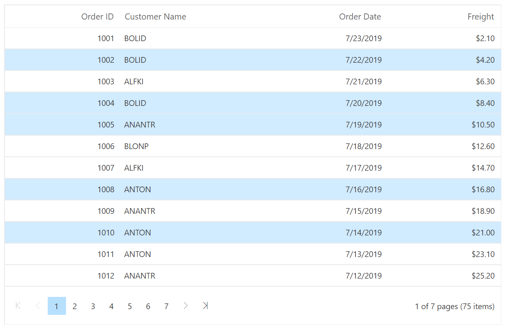
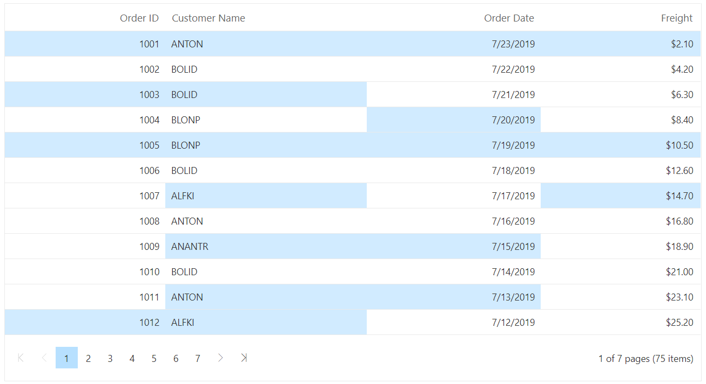
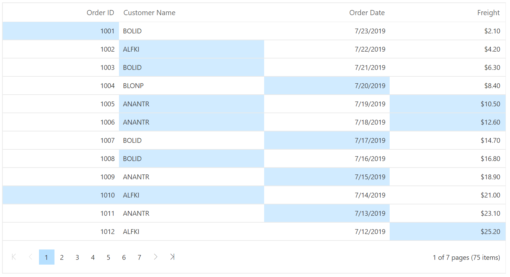
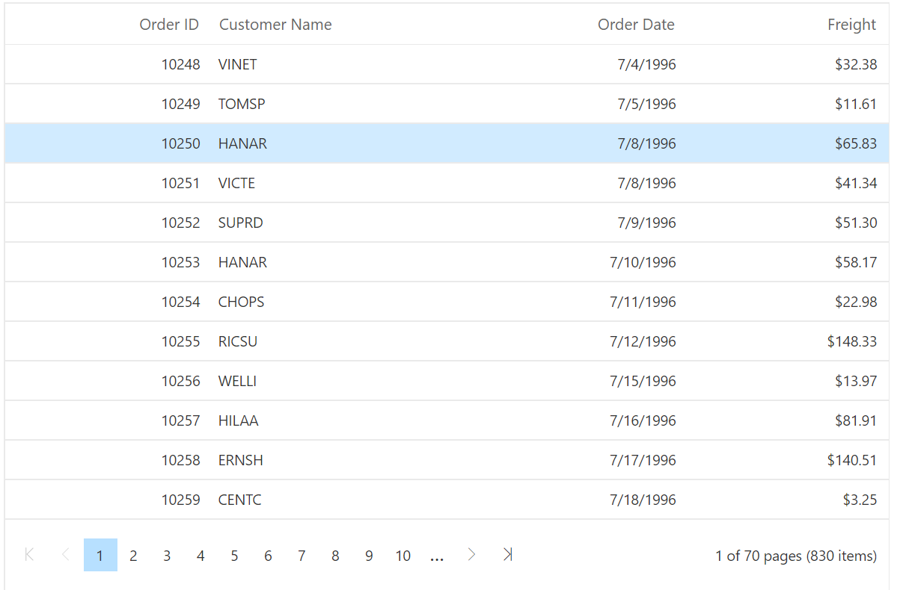
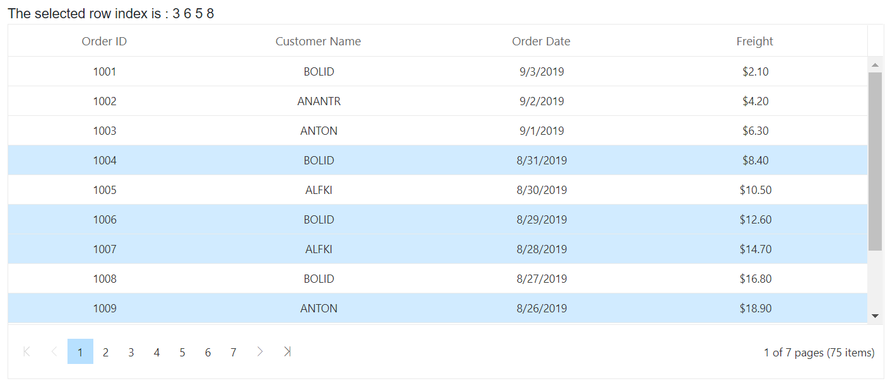
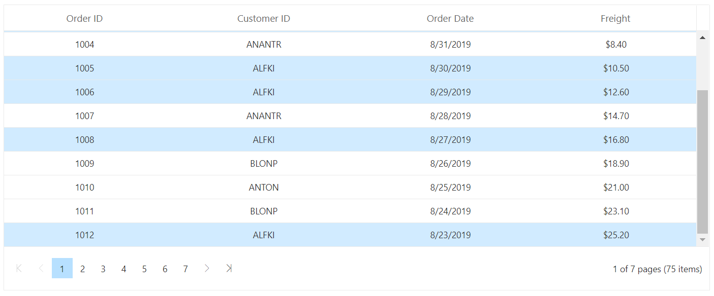

# Selection in Blazor DataGrid Component

Selection provides an option to highlight a row or a cell. It can be done through simple mouse down or arrow keys. To disable selection in the DataGrid, set the [AllowSelection](https://help.syncfusion.com/cr/blazor/Syncfusion.Blazor.Grids.SfGrid-1.html#Syncfusion_Blazor_Grids_SfGrid_1_AllowSelection) property to `false`.

The datagrid supports two types of selection that can be set by using the [Type](https://help.syncfusion.com/cr/blazor/Syncfusion.Blazor.Grids.GridSelectionSettings.html#Syncfusion_Blazor_Grids_GridSelectionSettings_Type) property of **GridSelectionSettings** component. They are:

* **Single**: The **Single** value is set by default, and it only allows selection of a single row or a cell.
* **Multiple**: Allows you to select multiple rows or cells.
To perform the multi-selection, press and hold CTRL key and click the desired rows or cells. To select range of rows or cells, press and hold the SHIFT key and click the rows or cells.

```cshtml
@using Syncfusion.Blazor.Grids

<SfGrid DataSource="@Orders" AllowSelection="true" AllowPaging="true">
   <GridSelectionSettings Type="SelectionType.Multiple"></GridSelectionSettings>
      <GridColumns>
         <GridColumn Field=@nameof(Order.OrderID) HeaderText="Order ID" TextAlign="TextAlign.Right" Width="120"></GridColumn>
         <GridColumn Field=@nameof(Order.CustomerID) HeaderText="Customer Name" Width="150"></GridColumn>
         <GridColumn Field=@nameof(Order.OrderDate) HeaderText=" Order Date" Format="d" Type="ColumnType.Date" TextAlign="TextAlign.Right" Width="130"></GridColumn>
         <GridColumn Field=@nameof(Order.Freight) HeaderText="Freight" Format="C2" TextAlign="TextAlign.Right" Width="120"></GridColumn>
      </GridColumns>
</SfGrid>

@code{
    public List<Order> Orders { get; set; }

    protected override void OnInitialized()
    {
        Orders = Enumerable.Range(1, 75).Select(x => new Order()
        {
            OrderID = 1000 + x,
            CustomerID = (new string[] { "ALFKI", "ANANTR", "ANTON", "BLONP", "BOLID" })[new Random().Next(5)],
            Freight = 2.1 * x,
            OrderDate = DateTime.Now.AddDays(-x),
        }).ToList();
    }

    public class Order {
        public int? OrderID { get; set; }
        public string CustomerID { get; set; }
        public DateTime? OrderDate { get; set; }
        public double? Freight { get; set; }
    }
}
```

The following represents the multiple selected rows



## Selection mode

The datagrid supports three types of selection mode that can be set by using
the [Mode](https://help.syncfusion.com/cr/blazor/Syncfusion.Blazor.Grids.GridSelectionSettings.html#Syncfusion_Blazor_Grids_GridSelectionSettings_Mode) property of **GridSelectionSettings** component. They are:

* **Row**: The **Row** value is set by default, and allows you to select only rows.
* **Cell**: Allows you to select only cells.
* **Both**: Allows you to select rows and cells at the same time.

```cshtml
@using Syncfusion.Blazor.Grids

<SfGrid DataSource="@Orders" AllowSelection="true" AllowPaging="true">
   <GridSelectionSettings Mode="SelectionMode.Both" Type="SelectionType.Multiple"></GridSelectionSettings>
      <GridColumns>
         <GridColumn Field=@nameof(Order.OrderID) HeaderText="Order ID" TextAlign="TextAlign.Right" Width="120"></GridColumn>
         <GridColumn Field=@nameof(Order.CustomerID) HeaderText="Customer Name" Width="150"></GridColumn>
         <GridColumn Field=@nameof(Order.OrderDate) HeaderText=" Order Date" Format="d" Type="ColumnType.Date" TextAlign="TextAlign.Right" Width="130"></GridColumn>
         <GridColumn Field=@nameof(Order.Freight) HeaderText="Freight" Format="C2" TextAlign="TextAlign.Right" Width="120"></GridColumn>
      </GridColumns>
</SfGrid>

@code{
    public List<Order> Orders { get; set; }

    protected override void OnInitialized()
    {
        Orders = Enumerable.Range(1, 75).Select(x => new Order()
        {
            OrderID = 1000 + x,
            CustomerID = (new string[] { "ALFKI", "ANANTR", "ANTON", "BLONP", "BOLID" })[new Random().Next(5)],
            Freight = 2.1 * x,
            OrderDate = DateTime.Now.AddDays(-x),
        }).ToList();
    }

    public class Order {
        public int? OrderID { get; set; }
        public string CustomerID { get; set; }
        public DateTime? OrderDate { get; set; }
        public double? Freight { get; set; }
    }
}
```

The following screenshot shows selection mode using both(row and cells selection)



## Cell selection

Cell selection can be done through simple mouse down or arrow keys (up, down, left, and right).

The datagrid supports two types of cell selection mode that can be set by using the [CellSelectionMode](https://help.syncfusion.com/cr/blazor/Syncfusion.Blazor.Grids.GridSelectionSettings.html#Syncfusion_Blazor_Grids_GridSelectionSettings_Mode) property of **GridSelectionSettings** component. They are:

* **Flow**: The **Flow** value is set by default. The range of cells are selected between the start index and end index that includes in between cells of rows.
* **Box**: Range of cells are selected from the start and end column indexes that includes in between cells of rows within the range.

```cshtml
@using Syncfusion.Blazor.Grids

<SfGrid DataSource="@Orders" AllowSelection="true" AllowPaging="true">
    <GridSelectionSettings CellSelectionMode="CellSelectionMode.Box" Mode="SelectionMode.Cell" Type="SelectionType.Multiple"></GridSelectionSettings>
    <GridColumns>
        <GridColumn Field=@nameof(Order.OrderID) HeaderText="Order ID" TextAlign="TextAlign.Right" Width="120"></GridColumn>
        <GridColumn Field=@nameof(Order.CustomerID) HeaderText="Customer Name" Width="150"></GridColumn>
        <GridColumn Field=@nameof(Order.OrderDate) HeaderText=" Order Date" Format="d" Type="ColumnType.Date" TextAlign="TextAlign.Right" Width="130"></GridColumn>
        <GridColumn Field=@nameof(Order.Freight) HeaderText="Freight" Format="C2" TextAlign="TextAlign.Right" Width="120"></GridColumn>
    </GridColumns>
</SfGrid>

@code{
    public List<Order> Orders { get; set; }

    protected override void OnInitialized()
    {
        Orders = Enumerable.Range(1, 75).Select(x => new Order()
        {
            OrderID = 1000 + x,
            CustomerID = (new string[] { "ALFKI", "ANANTR", "ANTON", "BLONP", "BOLID" })[new Random().Next(5)],
            Freight = 2.1 * x,
            OrderDate = DateTime.Now.AddDays(-x),
        }).ToList();
    }

    public class Order {
        public int? OrderID { get; set; }
        public string CustomerID { get; set; }
        public DateTime? OrderDate { get; set; }
        public double? Freight { get; set; }
    }
}
```

The following screenshot shows selection mode using cell



N> Cell selection requires the [Mode](https://help.syncfusion.com/cr/blazor/Syncfusion.Blazor.Grids.GridSelectionSettings.html#Syncfusion_Blazor_Grids_GridSelectionSettings_Mode) to be **Cell** or **Both**, and [Type](https://help.syncfusion.com/cr/blazor/Syncfusion.Blazor.Grids.GridSelectionSettings.html#Syncfusion_Blazor_Grids_GridSelectionSettings_Type) should be **Multiple**.

## Checkbox selection

Checkbox selection provides an option to select multiple datagrid records with help of checkbox in each row.

To render the checkbox in each datagrid row, you need to assign the type as **CheckBox** using the column [Type](https://help.syncfusion.com/cr/blazor/Syncfusion.Blazor.Grids.GridColumn.html#Syncfusion_Blazor_Grids_GridColumn_Type) property of **GridColumn** component.

```cshtml
@using Syncfusion.Blazor.Grids

<SfGrid DataSource="@Orders" AllowSelection="true" AllowPaging="true">
    <GridSelectionSettings Type="SelectionType.Multiple"></GridSelectionSettings>
    <GridColumns>
        <GridColumn Type="ColumnType.CheckBox" Width="50"></GridColumn>
        <GridColumn Field=@nameof(Order.OrderID) HeaderText="Order ID" TextAlign="TextAlign.Right" Width="120"></GridColumn>
        <GridColumn Field=@nameof(Order.CustomerID) HeaderText="Customer Name" Width="150"></GridColumn>
        <GridColumn Field=@nameof(Order.OrderDate) HeaderText=" Order Date" Format="d" Type="ColumnType.Date" TextAlign="TextAlign.Right" Width="130"></GridColumn>
        <GridColumn Field=@nameof(Order.Freight) HeaderText="Freight" Format="C2" TextAlign="TextAlign.Right" Width="120"></GridColumn>
    </GridColumns>
</SfGrid>

@code{
    public List<Order> Orders { get; set; }

    protected override void OnInitialized()
    {
        Orders = Enumerable.Range(1, 75).Select(x => new Order()
        {
            OrderID = 1000 + x,
            CustomerID = (new string[] { "ALFKI", "ANANTR", "ANTON", "BLONP", "BOLID" })[new Random().Next(5)],
            Freight = 2.1 * x,
            OrderDate = DateTime.Now.AddDays(-x),
        }).ToList();
    }

    public class Order {
        public int? OrderID { get; set; }
        public string CustomerID { get; set; }
        public DateTime? OrderDate { get; set; }
        public double? Freight { get; set; }
    }
}
```

The following screenshot shows CheckBox Selection


N> By default, selection is allowed by clicking a datagrid row or checkbox in that row. To allow selection only through checkbox, you can set the [CheckboxOnly](https://help.syncfusion.com/cr/blazor/Syncfusion.Blazor.Grids.GridSelectionSettings.html#Syncfusion_Blazor_Grids_GridSelectionSettings_CheckboxOnly) property of **GridSelectionSettings** as true.

N> Selection can be persisted in all the operations using the [PersistSelection](https://help.syncfusion.com/cr/blazor/Syncfusion.Blazor.Grids.GridSelectionSettings.html#Syncfusion_Blazor_Grids_GridSelectionSettings_PersistSelection) property of **GridSelectionSettings**. For persisting selection on the datagrid, any one of the columns should be defined as a primary key using the [IsPrimaryKey](https://help.syncfusion.com/cr/blazor/Syncfusion.Blazor.Grids.GridColumn.html#Syncfusion_Blazor_Grids_GridColumn_IsPrimaryKey) property.

### Checkbox selection mode

In checkbox selection, selection can also be done by clicking on rows. This selection provides two types of Checkbox Selection mode which can be set by using the following API,
[CheckboxMode](https://help.syncfusion.com/cr/blazor/Syncfusion.Blazor.Grids.GridSelectionSettings.html#Syncfusion_Blazor_Grids_GridSelectionSettings_CheckboxMode). The modes are;

* **Default**: This is the default value of the checkboxMode. In this mode, user can select multiple rows by clicking rows one by one.
* **ResetOnRowClick**: In ResetOnRowClick mode, when user clicks on a row it will reset previously selected row. Also you can perform multiple-selection in this mode by press
and hold CTRL key and click the desired rows. To select range of rows, press and hold the SHIFT key and click the rows.

```cshtml
@using Syncfusion.Blazor.Grids

<SfGrid DataSource="@Orders" AllowSelection="true" AllowPaging="true">
    <GridSelectionSettings CheckboxMode="CheckboxSelectionType.ResetOnRowClick" Type="SelectionType.Multiple"></GridSelectionSettings>
    <GridColumns>
        <GridColumn Type="ColumnType.CheckBox" Width="50"></GridColumn>
        <GridColumn Field=@nameof(Order.OrderID) HeaderText="Order ID" TextAlign="TextAlign.Right" Width="120"></GridColumn>
        <GridColumn Field=@nameof(Order.CustomerID) HeaderText="Customer Name" Width="150"></GridColumn>
        <GridColumn Field=@nameof(Order.OrderDate) HeaderText=" Order Date" Format="d" Type="ColumnType.Date" TextAlign="TextAlign.Right" Width="130"></GridColumn>
        <GridColumn Field=@nameof(Order.Freight) HeaderText="Freight" Format="C2" TextAlign="TextAlign.Right" Width="120"></GridColumn>
    </GridColumns>
</SfGrid>

@code{
    public List<Order> Orders { get; set; }

    protected override void OnInitialized()
    {
        Orders = Enumerable.Range(1, 75).Select(x => new Order()
        {
            OrderID = 1000 + x,
            CustomerID = (new string[] { "ALFKI", "ANANTR", "ANTON", "BLONP", "BOLID" })[new Random().Next(5)],
            Freight = 2.1 * x,
            OrderDate = DateTime.Now.AddDays(-x),
        }).ToList();
    }

    public class Order {
        public int? OrderID { get; set; }
        public string CustomerID { get; set; }
        public DateTime? OrderDate { get; set; }
        public double? Freight { get; set; }
    }
}
```

### Hide select all checkbox in column header

By default, setting the type as "ColumnType.CheckBox" will render a column with checkboxes only for selection purpose. You can hide the "select all" checkbox in the column header.

In the following sample, you can hide the header checkbox by defining the empty [HeaderTemplate](https://help.syncfusion.com/cr/blazor/Syncfusion.Blazor.Grids.GridColumn.html#Syncfusion_Blazor_Grids_GridColumn_HeaderTemplate) directive in [GridColumn](https://help.syncfusion.com/cr/blazor/Syncfusion.Blazor.Grids.GridColumn.html).

```csharp
@using Syncfusion.Blazor.Grids

<SfGrid ID="Grid" DataSource="@Orders" AllowSelection="true" AllowPaging="true">
    <GridSelectionSettings Type="SelectionType.Multiple"></GridSelectionSettings>
        <GridColumns>
            <GridColumn Type="ColumnType.CheckBox" Width="150">
                <HeaderTemplate>
                </HeaderTemplate>
            </GridColumn>
            <GridColumn Field=@nameof(Order.OrderID) HeaderText="Order ID" TextAlign="TextAlign.Right" Width="120"></GridColumn>
            <GridColumn Field=@nameof(Order.CustomerID) HeaderText="Customer Name" Width="150"></GridColumn>
            <GridColumn Field=@nameof(Order.OrderDate) HeaderText=" Order Date" Format="d" Type="ColumnType.Date" TextAlign="TextAlign.Right" Width="130"></GridColumn>
            <GridColumn Field=@nameof(Order.Freight) HeaderText="Freight" Format="C2" TextAlign="TextAlign.Right" Width="120"></GridColumn>
        </GridColumns>
</SfGrid>

@code{
    public List<Order> Orders { get; set; }

    protected override void OnInitialized()
    {
        Orders = Enumerable.Range(1, 75).Select(x => new Order()
        {
            OrderID = 1000 + x,
            CustomerID = (new string[] { "ALFKI", "ANANTR", "ANTON", "BLONP", "BOLID" })[new Random().Next(5)],
            Freight = 2.1 * x,
            OrderDate = DateTime.Now.AddDays(-x),
        }).ToList();
    }

    public class Order
    {
        public int? OrderID { get; set; }
        public string CustomerID { get; set; }
        public DateTime? OrderDate { get; set; }
        public double? Freight { get; set; }
    }
}

```

## Toggle selection

The Toggle selection allows to perform selection and unselection of the particular row or cell. To enable toggle selection, set [EnableToggle](https://help.syncfusion.com/cr/blazor/Syncfusion.Blazor.Grids.GridSelectionSettings.html#Syncfusion_Blazor_Grids_GridSelectionSettings_EnableToggle) property of **GridSelectionSettings** as true. If you click on the selected row or cell then it will be unselected and vice versa.

```cshtml
@using Syncfusion.Blazor.Grids

<SfGrid DataSource="@Orders" AllowSelection="true" AllowPaging="true">
    <GridSelectionSettings EnableToggle="true" Type="SelectionType.Multiple"></GridSelectionSettings>
    <GridColumns>
        <GridColumn Field=@nameof(Order.OrderID) HeaderText="Order ID" TextAlign="TextAlign.Right" Width="120"></GridColumn>
        <GridColumn Field=@nameof(Order.CustomerID) HeaderText="Customer Name" Width="150"></GridColumn>
        <GridColumn Field=@nameof(Order.OrderDate) HeaderText=" Order Date" Format="d" Type="ColumnType.Date" TextAlign="TextAlign.Right" Width="130"></GridColumn>
        <GridColumn Field=@nameof(Order.Freight) HeaderText="Freight" Format="C2" TextAlign="TextAlign.Right" Width="120"></GridColumn>
    </GridColumns>
</SfGrid>

@code{
    public List<Order> Orders { get; set; }

    protected override void OnInitialized()
    {
        Orders = Enumerable.Range(1, 75).Select(x => new Order()
        {
            OrderID = 1000 + x,
            CustomerID = (new string[] { "ALFKI", "ANANTR", "ANTON", "BLONP", "BOLID" })[new Random().Next(5)],
            Freight = 2.1 * x,
            OrderDate = DateTime.Now.AddDays(-x),
        }).ToList();
    }

    public class Order {
        public int? OrderID { get; set; }
        public string CustomerID { get; set; }
        public DateTime? OrderDate { get; set; }
        public double? Freight { get; set; }
    }
}
```

The following shows selection and deselection of row


N> If multi selection is enabled, then first click on any selected row (without pressing Ctrl key), it will clear the multi selection and in second click on the same row, it will be unselected.

## Drag selection

The DataGrid allows to select range of cells or rows by mouse or touch dragging. To enable drag selection, set the [AllowDragSelection](https://help.syncfusion.com/cr/blazor/Syncfusion.Blazor.Grids.GridSelectionSettings.html#properties) property of the [GridSelectionSettings](https://help.syncfusion.com/cr/blazor/Syncfusion.Blazor.Grids.GridSelectionSettings.html) as `true`.

* DataGrid supports drag selection in all selection modes. Selection mode can be set using [Mode](https://help.syncfusion.com/cr/blazor/Syncfusion.Blazor.Grids.GridSelectionSettings.html#Syncfusion_Blazor_Grids_GridSelectionSettings_Mode) property. 
* DataGrid supports drag selection in both `Flow` and `Box`, [CellSelectionMode](https://help.syncfusion.com/cr/blazor/Syncfusion.Blazor.Grids.GridSelectionSettings.html#Syncfusion_Blazor_Grids_GridSelectionSettings_Mode) options when cell selection enabled.
* Set [`Type`](https://help.syncfusion.com/cr/blazor/Syncfusion.Blazor.Grids.GridSelectionSettings.html#Syncfusion_Blazor_Grids_GridSelectionSettings_Type) property as `Multiple`, to select multiple rows or cells in grid by mouse/touch dragging.
* Drag selection supports [checkbox selection](#checkbox-selection).

```cshtml
@using Syncfusion.Blazor.Grids

<SfGrid DataSource="@Orders" EnableHover="false" AllowSelection="true" AllowPaging="true">
    <GridSelectionSettings AllowDragSelection="true" Type="SelectionType.Multiple"></GridSelectionSettings>
    <GridColumns>
        <GridColumn Field=@nameof(Order.OrderID) HeaderText="Order ID" TextAlign="TextAlign.Right" Width="120"></GridColumn>
        <GridColumn Field=@nameof(Order.CustomerID) HeaderText="Customer Name" Width="150"></GridColumn>
        <GridColumn Field=@nameof(Order.OrderDate) HeaderText=" Order Date" Format="d" Type="ColumnType.Date" TextAlign="TextAlign.Right" Width="130"></GridColumn>
        <GridColumn Field=@nameof(Order.Freight) HeaderText="Freight" Format="C2" TextAlign="TextAlign.Right" Width="120"></GridColumn>
    </GridColumns>
</SfGrid>

@code{
    public List<Order> Orders { get; set; }
    protected override void OnInitialized()
    {
        Orders = Enumerable.Range(1, 75).Select(x => new Order()
        {
            OrderID = 1000 + x,
            CustomerID = (new string[] { "ALFKI", "ANANTR", "ANTON", "BLONP", "BOLID" })[new Random().Next(5)],
            Freight = 2.1 * x,
            OrderDate = DateTime.Now.AddDays(-x),
        }).ToList();
    }
    public class Order {
        public int? OrderID { get; set; }
        public string CustomerID { get; set; }
        public DateTime? OrderDate { get; set; }
        public double? Freight { get; set; }
    }
}
```


N> * Drag selection is not compatible with [AutoFill](https://help.syncfusion.com/cr/blazor/Syncfusion.Blazor.Grids.SfGrid-1.html#Syncfusion_Blazor_Grids_SfGrid_1_EnableAutoFill) feature.

## Perform toggle selection programmatically

You can perform toggle selection programmatically by using the **SelectRowAsync** method by passing **true** value as the second argument. In the below code example, we have programmatically toggled the row index 2.

```cshtml
@using Syncfusion.Blazor.Grids
@using Syncfusion.Blazor.Buttons

<SfButton Content="Perform Toggle Selection programmatically for RowIndex 3" @onclick="Click"></SfButton>

<SfGrid @ref="Grid" DataSource="@Orders" AllowSelection="true" AllowPaging="true">
    <GridSelectionSettings EnableToggle="true"></GridSelectionSettings>
    <GridColumns>
        <GridColumn Field=@nameof(Order.OrderID) HeaderText="Order ID" TextAlign="TextAlign.Right" Width="120"></GridColumn>
        <GridColumn Field=@nameof(Order.CustomerID) HeaderText="Customer Name" Width="150"></GridColumn>
        <GridColumn Field=@nameof(Order.OrderDate) HeaderText=" Order Date" Format="d" Type="ColumnType.Date" TextAlign="TextAlign.Right" Width="130"></GridColumn>
        <GridColumn Field=@nameof(Order.Freight) HeaderText="Freight" Format="C2" TextAlign="TextAlign.Right" Width="120"></GridColumn>
    </GridColumns>
</SfGrid>

@code{
    SfGrid<Order> Grid;
    public List<Order> Orders { get; set; }

    protected override void OnInitialized()
    {
        Orders = Enumerable.Range(1, 75).Select(x => new Order()
        {
            OrderID = 1000 + x,
            CustomerID = (new string[] { "ALFKI", "ANANTR", "ANTON", "BLONP", "BOLID" })[new Random().Next(5)],
            Freight = 2.1 * x,
            OrderDate = DateTime.Now.AddDays(-x),
        }).ToList();
    }

    public class Order {
        public int? OrderID { get; set; }
        public string CustomerID { get; set; }
        public DateTime? OrderDate { get; set; }
        public double? Freight { get; set; }
    }
    private async Task Click(Microsoft.AspNetCore.Components.Web.MouseEventArgs args)
    {
        await Grid.SelectRowAsync(2, true);
    }
}
```

## Select row at initial rendering

To select a row at initial rendering, set the [SelectedRowIndex](https://help.syncfusion.com/cr/blazor/Syncfusion.Blazor.Grids.SfGrid-1.html#Syncfusion_Blazor_Grids_SfGrid_1_SelectedRowIndex) value.

```cshtml
@using Syncfusion.Blazor.Grids

<SfGrid DataSource="@Orders" AllowSelection="true" SelectedRowIndex="2" AllowPaging="true">
    <GridSelectionSettings Mode="SelectionMode.Both" Type="SelectionType.Multiple">
    </GridSelectionSettings>
    <GridColumns>
        <GridColumn Field=@nameof(Order.OrderID) HeaderText="Order ID" TextAlign="TextAlign.Right" Width="120"></GridColumn>
        <GridColumn Field=@nameof(Order.CustomerID) HeaderText="Customer Name" Width="150"></GridColumn>
        <GridColumn Field=@nameof(Order.OrderDate) HeaderText=" Order Date" Format="d" Type="ColumnType.Date" TextAlign="TextAlign.Right" Width="130"></GridColumn>
        <GridColumn Field=@nameof(Order.Freight) HeaderText="Freight" Format="C2" TextAlign="TextAlign.Right" Width="120"></GridColumn>
    </GridColumns>
</SfGrid>

@code{
    public List<Order> Orders { get; set; }

    protected override void OnInitialized()
    {
        Orders = Enumerable.Range(1, 75).Select(x => new Order()
        {
            OrderID = 1000 + x,
            CustomerID = (new string[] { "ALFKI", "ANANTR", "ANTON", "BLONP", "BOLID" })[new Random().Next(5)],
            Freight = 2.1 * x,
            OrderDate = DateTime.Now.AddDays(-x),
        }).ToList();
    }

    public class Order {
        public int? OrderID { get; set; }
        public string CustomerID { get; set; }
        public DateTime? OrderDate { get; set; }
        public double? Freight { get; set; }
    }
}
```

The following image will be displayed with row selected in initial Rendering  



## Get selected row indexes

You can get the selected row indexes by using [GetSelectedRowIndexes](https://help.syncfusion.com/cr/blazor/Syncfusion.Blazor.Grids.SfGrid-1.html#Syncfusion_Blazor_Grids_SfGrid_1_GetSelectedRowIndexes) method.

```cshtml
@using Syncfusion.Blazor
@using Syncfusion.Blazor.Grids

<span> The selected row index is : @SelectedValue </span>

<SfGrid @ref="@Grid" DataSource="@Orders" AllowFiltering="true" AllowPaging="true" Height="315">
    <GridSelectionSettings Type="SelectionType.Multiple"></GridSelectionSettings>
    <GridEvents RowSelected="GetSelectedRecords" TValue="Order"></GridEvents>
    <GridColumns>
        <GridColumn Field=@nameof(Order.OrderID) HeaderText="Order ID" TextAlign="TextAlign.Center" Width="120"></GridColumn>
        <GridColumn Field=@nameof(Order.CustomerID) HeaderText="Customer Name" TextAlign="TextAlign.Center" Width="150"></GridColumn>
        <GridColumn Field=@nameof(Order.OrderDate) HeaderText=" Order Date" Format="d" Type="ColumnType.Date" TextAlign="TextAlign.Center" Width="130"></GridColumn>
        <GridColumn Field=@nameof(Order.Freight) HeaderText="Freight" Format="C2" TextAlign="TextAlign.Center" Width="140"></GridColumn>
    </GridColumns>
</SfGrid>

@code{

    SfGrid<Order> Grid;
    public List<Order> Orders { get; set; }
    public List<double> SelectedRowIndexes { get; set; }
    public double[] TotalValue { get; set; }
    public string SelectedValue;

    protected override void OnInitialized()
    {
        Orders = Enumerable.Range(1, 75).Select(x => new Order()
        {
            OrderID = 1000 + x,
            CustomerID = (new string[] { "ALFKI", "ANANTR", "ANTON", "BLONP", "BOLID" })[new Random().Next(5)],
            Freight = 2.1 * x,
            OrderDate = DateTime.Now.AddDays(-x),
        }).ToList();
    }

    public async Task GetSelectedRecords(RowSelectEventArgs<Order> args)
    {
        SelectedRowIndexes = await this.Grid.GetSelectedRowIndexes();
        TotalValue = SelectedRowIndexes.ToArray();
        SelectedValue = "";
        foreach (var data in TotalValue)
        {
            SelectedValue = SelectedValue + " " + data;
        }
        StateHasChanged();
    }

    public class Order
    {
        public int? OrderID { get; set; }
        public string CustomerID { get; set; }
        public DateTime? OrderDate { get; set; }
        public double? Freight { get; set; }
    }
}
```

The following image will be displayed with selected row and its indexes  


## Touch interaction

When you tap a datagrid row on touchscreen device, the tapped row is selected.
It also shows a popup   for multi-row selection.
To select multiple rows or cells, tap the popup  and then tap the desired rows or cells.

N> Multi-selection requires the selection [type](https://help.syncfusion.com/cr/blazor/Syncfusion.Blazor.Grids.GridSelectionSettings.html) to be `multiple`.

The following screenshot represents a datagrid touch selection in the device.


## Multiple selection based on condition

You can select multiple rows at the initial rendering of the datagrid by using [SelectRows](https://help.syncfusion.com/cr/blazor/Syncfusion.Blazor.Grids.SfGrid-1.html#Syncfusion_Blazor_Grids_SfGrid_1_SelectRows_System_Double___) method. The initial selection is based on the given condition. Here the initial selection is based on the row with the **CustomerID** as **ALFKI**. We have used [GetCurrentViewRecords](https://help.syncfusion.com/cr/blazor/Syncfusion.Blazor.Grids.SfGrid-1.html#Syncfusion_Blazor_Grids_SfGrid_1_GetCurrentViewRecords) method to get current page records and applied the condition.

```cshtml
@using Syncfusion.Blazor.Grids

<SfGrid @ref="@Grid" DataSource="@Orders" AllowFiltering="true" AllowPaging="true" Height="315">
    <GridSelectionSettings Type="SelectionType.Multiple"></GridSelectionSettings>
    <GridEvents DataBound="Data" TValue="Order"></GridEvents>
    <GridColumns>
        <GridColumn Field=@nameof(Order.OrderID) HeaderText="Order ID" TextAlign="TextAlign.Center" Width="120"></GridColumn>
        <GridColumn Field=@nameof(Order.CustomerID) HeaderText="Customer ID" TextAlign="TextAlign.Center" Width="150"></GridColumn>
        <GridColumn Field=@nameof(Order.OrderDate) HeaderText=" Order Date" Format="d" Type="ColumnType.Date" TextAlign="TextAlign.Center" Width="130"></GridColumn>
        <GridColumn Field=@nameof(Order.Freight) HeaderText="Freight" Format="C2" TextAlign="TextAlign.Center" Width="120"></GridColumn>
    </GridColumns>
</SfGrid>

@code{

    SfGrid<Order> Grid;
    public List<Order> Orders { get; set; }
    List<double> SelectIndex { get; set; }

    protected override void OnInitialized()
    {
        Orders = Enumerable.Range(1, 75).Select(x => new Order()
        {
            OrderID = 1000 + x,
            CustomerID = (new string[] { "ALFKI", "ANANTR", "ANTON", "BLONP", "BOLID" })[new Random().Next(5)],
            Freight = 2.1 * x,
            OrderDate = DateTime.Now.AddDays(-x),
        }).ToList();
    }

    public async Task Data(object args)
    {
        var Source = await Grid.GetCurrentViewRecords();
        var IndexNum = 0;
        SelectIndex = new List<double>();
        foreach (var record in Source)
        {
            if (record.CustomerID == "ALFKI")
            {
                SelectIndex.Add(IndexNum);
            }
            IndexNum++;
        }
        await Grid.SelectRows(SelectIndex.ToArray());
    }

    public class Order
    {
        public int? OrderID { get; set; }
        public string CustomerID { get; set; }
        public DateTime? OrderDate { get; set; }
        public double? Freight { get; set; }
    }
}
```

The following image will be displayed with Multiple selection  


## Simple multiple row selection

You can select multiple rows by clicking on rows one by one. This will not deselect the previously selected rows. To deselect the previously selected row, you can click on the  selected row. You can enable this behavior by using [EnableSimpleMultiRowSelection](https://help.syncfusion.com/cr/blazor/Syncfusion.Blazor.Grids.GridSelectionSettings.html#Syncfusion_Blazor_Grids_GridSelectionSettings_EnableSimpleMultiRowSelection) property of **GridSelectionSettings** component.

```cshtml
@using Syncfusion.Blazor.Grids

<SfGrid DataSource="@Orders" AllowSelection="true" AllowPaging="true">
    <GridSelectionSettings EnableSimpleMultiRowSelection="true" Type="SelectionType.Multiple"></GridSelectionSettings>
    <GridColumns>
        <GridColumn Field=@nameof(Order.OrderID) HeaderText="Order ID" TextAlign="TextAlign.Right" Width="120"></GridColumn>
        <GridColumn Field=@nameof(Order.CustomerID) HeaderText="Customer Name" Width="150"></GridColumn>
        <GridColumn Field=@nameof(Order.OrderDate) HeaderText=" Order Date" Format="d" Type="ColumnType.Date" TextAlign="TextAlign.Right" Width="130"></GridColumn>
        <GridColumn Field=@nameof(Order.Freight) HeaderText="Freight" Format="C2" TextAlign="TextAlign.Right" Width="120"></GridColumn>
    </GridColumns>
</SfGrid>

@code{
    public List<Order> Orders { get; set; }

    protected override void OnInitialized()
    {
        Orders = Enumerable.Range(1, 75).Select(x => new Order()
        {
            OrderID = 1000 + x,
            CustomerID = (new string[] { "ALFKI", "ANANTR", "ANTON", "BLONP", "BOLID" })[new Random().Next(5)],
            Freight = 2.1 * x,
            OrderDate = DateTime.Now.AddDays(-x),
        }).ToList();
    }

    public class Order {
        public int? OrderID { get; set; }
        public string CustomerID { get; set; }
        public DateTime? OrderDate { get; set; }
        public double? Freight { get; set; }
    }
}
```

## Clear selection programmatically

It is possible to clear the grid selection programmatically by using the [ClearSelectionAsync](https://help.syncfusion.com/cr/blazor/Syncfusion.Blazor.Grids.SfGrid-1.html#Syncfusion_Blazor_Grids_SfGrid_1_ClearSelectionAsync) method of the Grid.

In the following sample, the third row is initially selected using the [SelectedRowIndex](https://help.syncfusion.com/cr/blazor/Syncfusion.Blazor.Grids.SfGrid-1.html#Syncfusion_Blazor_Grids_SfGrid_1_SelectedRowIndex) property of the Grid. By clicking the Clear Selection button, the current selection is removed using the `ClearSelectionAsync` method of the Grid. 

```cshtml
@using Syncfusion.Blazor.Grids
@using Syncfusion.Blazor.Buttons

<SfButton OnClick="ClearSelection" Content="Clear Selection"></SfButton>

<SfGrid DataSource="@Orders" @ref="Grid" AllowSelection="true" SelectedRowIndex="2" Height="400" TValue="Order">
    <GridSelectionSettings Type="Syncfusion.Blazor.Grids.SelectionType.Multiple"></GridSelectionSettings>
    <GridColumns>
        <GridColumn Field=@nameof(Order.OrderID) HeaderText="Order ID" TextAlign="TextAlign.Right" Width="120" IsPrimaryKey="true"></GridColumn>
        <GridColumn Field=@nameof(Order.CustomerID) HeaderText="Customer Name" Width="150"></GridColumn>
        <GridColumn Field=@nameof(Order.OrderDate) HeaderText=" Order Date" Format="d" Type="ColumnType.Date" TextAlign="TextAlign.Right" Width="130"></GridColumn>
        <GridColumn Field=@nameof(Order.Freight) HeaderText="Freight" Format="C2" TextAlign="TextAlign.Right" Width="120"></GridColumn>
    </GridColumns>
</SfGrid>

@code{
    public List<Order> Orders { get; set; }
    SfGrid<Order> Grid { get; set; }

    protected override void OnInitialized()
    {
        Orders = Enumerable.Range(1, 75).Select(x => new Order()
        {
            OrderID = 1000 + x,
            CustomerID = (new string[] { "ALFKI", "ANANTR", "ANTON", "BLONP", "BOLID" })[new Random().Next(5)],
            Freight = 2.1 * x,
            OrderDate = DateTime.Now.AddDays(-x),
        }).ToList();
    }

    public async Task ClearSelection()
    {
        await this.Grid.ClearSelectionAsync();
    }

    public class Order {
        public int? OrderID { get; set; }
        public string CustomerID { get; set; }
        public DateTime? OrderDate { get; set; }
        public double? Freight { get; set; }
    }
}
```

N> You can refer to our [Blazor DataGrid](https://www.syncfusion.com/blazor-components/blazor-datagrid) feature tour page for its groundbreaking feature representations. You can also explore our [Blazor DataGrid example](https://blazor.syncfusion.com/demos/datagrid/overview?theme=bootstrap4) to understand how to present and manipulate data.

## Prevent the selection of records in the DataGrid after selecting a n number of records

The Syncfusion Grid component provide support for single and multiple selection in Grid. By default, users can choose between single and multiple selection modes by utilizing the [Type](https://help.syncfusion.com/cr/blazor/Syncfusion.Blazor.Grids.GridSelectionSettings.html#Syncfusion_Blazor_Grids_GridSelectionSettings_Type) property of **GridSelectionSettings**. However, in multiple selection modes, you can restrict the selection after selecting a n number of records in the DataGrid component. This can be achieved by utilizing the [RowSelecting](https://blazor.syncfusion.com/documentation/datagrid/events#rowselecting) event of the Grid.

In the following example, this is demonstrated how to select two records in the grid. The [RowSelecting](https://blazor.syncfusion.com/documentation/datagrid/events#rowselecting)  event will be triggered whenever a row is selected. This event is useful to access the selected records and their count using the [GetSelectedRecordsAsync](https://help.syncfusion.com/cr/blazor/Syncfusion.Blazor.Grids.SfGrid-1.html#Syncfusion_Blazor_Grids_SfGrid_1_GetSelectedRecordsAsync) method. In the [RowSelecting](https://blazor.syncfusion.com/documentation/datagrid/events#rowselecting)  event, we have cancelled the selection action if the selected records count exceeds the specified n number.



@using Syncfusion.Blazor.Grids

<SfGrid @ref="Grid" DataSource="@GridData"  Height="267px">
    <GridSelectionSettings Type="SelectionType.Multiple"></GridSelectionSettings>
    <GridEvents RowSelecting="RowSelectingHandler" TValue="OrderData"></GridEvents>
    <GridColumns>
        <GridColumn Field=@nameof(OrderData.OrderID) HeaderText="Order ID" TextAlign="Syncfusion.Blazor.Grids.TextAlign.Right" Width="90"></GridColumn>
        <GridColumn Field=@nameof(OrderData.CustomerID) HeaderText="Customer ID" Width="100"></GridColumn>
        <GridColumn Field=@nameof(OrderData.ShipCity) HeaderText="Ship City" Width="100"></GridColumn>
        <GridColumn Field=@nameof(OrderData.ShipName) HeaderText="Ship Name" Width="120"></GridColumn>
    </GridColumns>
</SfGrid>


@code {
    public List<OrderData> GridData { get; set; }

    SfGrid<OrderData> Grid { get; set; }

    protected override void OnInitialized()
    {
        GridData = OrderData.GetAllRecords();
    }

    public async Task RowSelectingHandler(RowSelectingEventArgs<OrderData> Args)
    {
        var SelectedRecord = await Grid.GetSelectedRecordsAsync();
        if (SelectedRecord != null && SelectedRecord.Count > 1)
        {
            Args.Cancel = true;
        }
    }

}


 public class OrderData
    {
        public static List<OrderData> Orders = new List<OrderData>();

        public OrderData()
        {

        }
        public OrderData(int? OrderID, string CustomerID, string ShipCity, string ShipName)
        {
            this.OrderID = OrderID;
            this.CustomerID = CustomerID;
            this.ShipCity = ShipCity;
            this.ShipName = ShipName;
        }

        public static List<OrderData> GetAllRecords()
        {
            if (Orders.Count() == 0)
            {
                int code = 10;
                for (int i = 1; i < 2; i++)
                {
                    Orders.Add(new OrderData(10248, "VINET", "Reims", "Vins et alcools Chevali"));
                    Orders.Add(new OrderData(10249, "TOMSP", "Münster", "Toms Spezialitäten"));
                    Orders.Add(new OrderData(10250, "HANAR", "Rio de Janeiro", "Hanari Carnes"));
                    Orders.Add(new OrderData(10251, "VICTE", "Lyon", "Victuailles en stock"));
                    Orders.Add(new OrderData(10252, "SUPRD", "Charleroi", "Suprêmes délices"));
                    Orders.Add(new OrderData(10253, "HANAR", "Lyon", "Hanari Carnes"));
                    Orders.Add(new OrderData(10254, "CHOPS", "Rio de Janeiro", "Chop-suey Chinese"));
                    Orders.Add(new OrderData(10255, "RICSU", "Münster", "Richter Supermarkt"));
                    Orders.Add(new OrderData(10256, "WELLI", "Reims", "Wellington Import"));
                    code += 5;
                }
            }
            return Orders;
        }

        public int? OrderID { get; set; }
        public string CustomerID { get; set; }
        public string ShipCity { get; set; }
        public string ShipName { get; set; }
    }





## See also

* [How to use radio button instead of checkbox for row selection of grid](https://blazor.syncfusion.com/documentation/datagrid/how-to/use-radio-button-instead-of-checkbox)