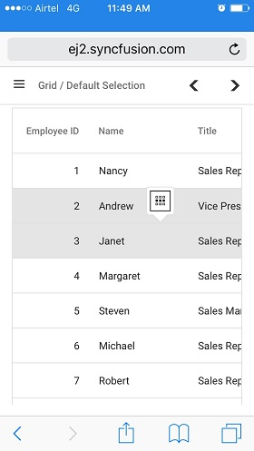

# Selection in Blazor DataGrid

Selection in the Syncfusion&reg; Blazor DataGrid enables interactive selection of specific cells, rows, or columns. Selection can be performed using mouse clicks, arrow keys (up, down, left, right), or touch gestures. This feature is useful for highlighting, manipulating, or executing actions on targeted Grid elements.
To disable selection, set the  [AllowSelection](https://help.syncfusion.com/cr/blazor/Syncfusion.Blazor.Grids.SfGrid-1.html#Syncfusion_Blazor_Grids_SfGrid_1_AllowSelection) property to **false**.
The Grid supports two types of selection, configurable via the [GridSelectionSettings.Type](https://help.syncfusion.com/cr/blazor/Syncfusion.Blazor.Grids.GridSelectionSettings.html#Syncfusion_Blazor_Grids_GridSelectionSettings_Type) property:

* **Single** - Allows selection of a single row, cell, or column (default).
* **Multiple** - Allows selection of multiple rows, cells, or columns.

To perform multi-selection, hold the **CTRL** key and click the desired rows, cells, or columns.
To select a range, hold the **SHIFT** key and click the start and end points of the desired selection.




@using Syncfusion.Blazor.Grids
@using Syncfusion.Blazor.DropDowns

    <label style="padding: 30px 2px 0 0"> Choose selection type: </label>
    <SfDropDownList TValue="SelectionType" TItem="DropDownOrder" DataSource="@DropDownData" Width="100px">
        <DropDownListFieldSettings Text="Text" Value="Value"></DropDownListFieldSettings>
        <DropDownListEvents ValueChange="@OnChange" TValue="SelectionType" TItem="DropDownOrder"></DropDownListEvents>
    </SfDropDownList>

<SfGrid DataSource="@OrderData" AllowSelection="true" Height="315">
    <GridSelectionSettings Type="@SelectionTypeValue"></GridSelectionSettings>
    <GridColumns>
        <GridColumn Field=@nameof(OrderDetails.OrderID) HeaderText="Order ID" TextAlign="TextAlign.Right" Width="120"></GridColumn>
        <GridColumn Field=@nameof(OrderDetails.CustomerID) HeaderText="Customer ID" Width="150"></GridColumn>
        <GridColumn Field=@nameof(OrderDetails.ShipCity) HeaderText="Ship City" Width="120"></GridColumn>
        <GridColumn Field=@nameof(OrderDetails.ShipName) HeaderText="Ship Name" Width="150"></GridColumn>
    </GridColumns>
</SfGrid>
@code {
    public List<OrderDetails> OrderData { get; set; }
    protected override void OnInitialized()
    {
        OrderData = OrderDetails.GetAllRecords();
    }    
    public SelectionType SelectionTypeValue { get; set; } = SelectionType.Single;
    public class DropDownOrder
    {
        public string Text { get; set; }
        public SelectionType Value { get; set; }
    }
    List<DropDownOrder> DropDownData = new List<DropDownOrder>
    {
        new DropDownOrder() { Text = "Single", Value = SelectionType.Single },
        new DropDownOrder() { Text = "Multiple", Value = SelectionType.Multiple },
    };
    public void OnChange(ChangeEventArgs<SelectionType, DropDownOrder> Args)
    {
        SelectionTypeValue = Args.Value;
    }       
}





public class OrderDetails
{
    public static List<OrderDetails> order = new List<OrderDetails>();
    public OrderDetails() {}
    public OrderDetails(int orderID, string customerId, string shipCity, string shipName)
    {
        this.OrderID = orderID;
        this.CustomerID = customerId;
        this.ShipCity = shipCity;
        this.ShipName = shipName;
    }
    public static List<OrderDetails> GetAllRecords()
    {
        if (order.Count == 0)
        {
            order.Add(new OrderDetails(10248, "VINET", "Reims", "Vins et alcools Chevalier"));
            order.Add(new OrderDetails(10249, "TOMSP", "Münster", "Toms Spezialitäten"));
            order.Add(new OrderDetails(10250, "HANAR", "Rio de Janeiro", "Hanari Carnes"));
            order.Add(new OrderDetails(10251, "VICTE", "Lyon", "Victuailles en stock"));
            order.Add(new OrderDetails(10252, "SUPRD", "Charleroi", "Suprêmes délices"));
            order.Add(new OrderDetails(10253, "HANAR", "Rio de Janeiro", "Hanari Carnes"));
            order.Add(new OrderDetails(10254, "CHOPS", "Bern", "Chop-suey Chinese"));
            order.Add(new OrderDetails(10255, "RICSU", "Genève", "Richter Supermarkt"));
            order.Add(new OrderDetails(10256, "WELLI", "Resende", "Wellington Importadora"));
            order.Add(new OrderDetails(10257, "HILAA", "San Cristóbal", "HILARION-Abastos"));
            order.Add(new OrderDetails(10258, "ERNSH", "Graz", "Ernst Handel"));
            order.Add(new OrderDetails(10259, "CENTC", "México D.F.", "Centro comercial Moctezuma"));
            order.Add(new OrderDetails(10260, "OTTIK", "Köln", "Ottilies Käseladen"));
            order.Add(new OrderDetails(10261, "QUEDE", "Rio de Janeiro", "Que Delícia"));
            order.Add(new OrderDetails(10262, "RATTC", "Albuquerque", "Rattlesnake Canyon Grocery"));
        }
        return order;
    }
    public int OrderID { get; set; }
    public string CustomerID { get; set; }
    public string ShipCity { get; set; }
    public string ShipName { get; set; }
}






## Selection mode

The selection mode feature in the Syncfusion&reg; Blazor DataGrid enables configuration of how rows, cells, or both are selected within the Grid. This functionality is useful for highlighting and manipulating specific Grid elements based on application requirements.
To configure selection mode, set the [GridSelectionSettings.Mode](https://help.syncfusion.com/cr/blazor/Syncfusion.Blazor.Grids.GridSelectionSettings.html#Syncfusion_Blazor_Grids_GridSelectionSettings_Mode) property. The Grid supports the following selection modes:

* **Row** - Enables selection of rows only. (Default)
* **Row** - Enables selection of cells only.
* **Row** - Enables simultaneous selection of rows and cells.

The following example demonstrates how to dynamically configure the `GridSelectionSettings.Mode` using the [DropDownList](https://blazor.syncfusion.com/documentation/dropdown-list/getting-started-with-web-app):




@using Syncfusion.Blazor.Grids
@using Syncfusion.Blazor.DropDowns

    <label style="padding: 30px 2px 0 0"> Choose selection mode: </label>
    <SfDropDownList TValue="Syncfusion.Blazor.Grids.SelectionMode" TItem="DropDownOrder" @bind-Value="@SelectionModeValue" DataSource="@DropDownData" Width="100px">
        <DropDownListFieldSettings Text="Text" Value="Value"></DropDownListFieldSettings>
        <DropDownListEvents ValueChange="@OnChange" TValue="Syncfusion.Blazor.Grids.SelectionMode" TItem="DropDownOrder"></DropDownListEvents>
    </SfDropDownList>

<SfGrid DataSource="@OrderData" AllowSelection="true" Height="315">
    <GridSelectionSettings Mode="@SelectionModeValue"></GridSelectionSettings>
    <GridColumns>
        <GridColumn Field=@nameof(OrderDetails.OrderID) HeaderText="Order ID" TextAlign="TextAlign.Right" Width="120"></GridColumn>
        <GridColumn Field=@nameof(OrderDetails.CustomerID) HeaderText="Customer ID" Width="150"></GridColumn>
        <GridColumn Field=@nameof(OrderDetails.ShipCity) HeaderText="Ship City" Width="120"></GridColumn>
        <GridColumn Field=@nameof(OrderDetails.ShipName) HeaderText="Ship Name" Width="150"></GridColumn>
    </GridColumns>
</SfGrid>

@code {
    public List<OrderDetails> OrderData { get; set; }
    protected override void OnInitialized()
    {
        OrderData = OrderDetails.GetAllRecords();
    }
    public Syncfusion.Blazor.Grids.SelectionMode SelectionModeValue { get; set; } = Syncfusion.Blazor.Grids.SelectionMode.Row;
    public class DropDownOrder
    {
        public string Text { get; set; }
        public Syncfusion.Blazor.Grids.SelectionMode Value { get; set; }
    }
    List<DropDownOrder> DropDownData = new List<DropDownOrder>
    {
        new DropDownOrder() { Text = "Row", Value = Syncfusion.Blazor.Grids.SelectionMode.Row },
        new DropDownOrder() { Text = "Cell", Value = Syncfusion.Blazor.Grids.SelectionMode.Cell },
        new DropDownOrder() { Text = "Both", Value = Syncfusion.Blazor.Grids.SelectionMode.Both },
    };
    public void OnChange(ChangeEventArgs<Syncfusion.Blazor.Grids.SelectionMode, DropDownOrder> Args)
    {
        SelectionModeValue = Args.Value;
    }
}





public class OrderDetails
{
    public static List<OrderDetails> order = new List<OrderDetails>();
    public OrderDetails() {}
    public OrderDetails(int orderID, string customerId, string shipCity, string shipName)
    {
        this.OrderID = orderID;
        this.CustomerID = customerId;
        this.ShipCity = shipCity;
        this.ShipName = shipName;
    }
    public static List<OrderDetails> GetAllRecords()
    {
        if (order.Count == 0)
        {
            order.Add(new OrderDetails(10248, "VINET", "Reims", "Vins et alcools Chevalier"));
            order.Add(new OrderDetails(10249, "TOMSP", "Münster", "Toms Spezialitäten"));
            order.Add(new OrderDetails(10250, "HANAR", "Rio de Janeiro", "Hanari Carnes"));
            order.Add(new OrderDetails(10251, "VICTE", "Lyon", "Victuailles en stock"));
            order.Add(new OrderDetails(10252, "SUPRD", "Charleroi", "Suprêmes délices"));
            order.Add(new OrderDetails(10253, "HANAR", "Rio de Janeiro", "Hanari Carnes"));
            order.Add(new OrderDetails(10254, "CHOPS", "Bern", "Chop-suey Chinese"));
            order.Add(new OrderDetails(10255, "RICSU", "Genève", "Richter Supermarkt"));
            order.Add(new OrderDetails(10256, "WELLI", "Resende", "Wellington Importadora"));
            order.Add(new OrderDetails(10257, "HILAA", "San Cristóbal", "HILARION-Abastos"));
            order.Add(new OrderDetails(10258, "ERNSH", "Graz", "Ernst Handel"));
            order.Add(new OrderDetails(10259, "CENTC", "México D.F.", "Centro comercial Moctezuma"));
            order.Add(new OrderDetails(10260, "OTTIK", "Köln", "Ottilies Käseladen"));
            order.Add(new OrderDetails(10261, "QUEDE", "Rio de Janeiro", "Que Delícia"));
            order.Add(new OrderDetails(10262, "RATTC", "Albuquerque", "Rattlesnake Canyon Grocery"));
        }
        return order;
    }
    public int OrderID { get; set; }
    public string CustomerID { get; set; }
    public string ShipCity { get; set; }
    public string ShipName { get; set; }
}






<!-- ## Touch interaction

The touch interaction feature in Syncfusion Blazor DataGrid allows you to easily interact with the Grid on touch screen devices. This feature is particularly useful for improving the user experience on mobile devices and tablets, making it easier to navigate and interact with the Grid's content using touch gestures.

**Single Row Selection**

When you tap on a Grid row using a touch screen, the tapped row is automatically selected. This provides a straightforward way to select single rows with a touch interface.

**Multi-Row Selection**

To select multiple rows in the Grid, you can utilize the multi-row selection feature. When you tap on a row, a popup is displayed, indicating the option for multi-row selection. You can tap on the popup, and then proceed to tap on the desired rows that you want to select. This allows you to select and interact with multiple rows simultaneously, as shown in the following image:

**Multi-Row or Cell Selection**

In addition to selecting multiple rows, you can also perform multi-row or cell selection in the Grid. By tapping on the popup, you can choose the option for multi-row or cell selection. Once selected, you can then tap on the desired rows or cells to make the selection, as shown in the following image:

> For multi-selection, it requires the selection [Type](https://help.syncfusion.com/cr/blazor/Syncfusion.Blazor.Grids.GridSelectionSettings.html#Syncfusion_Blazor_Grids_GridSelectionSettings_Type) to be **Multiple**.

The following screenshot represents a Grid touch selection in the device.

 -->

## Toggle selection

The toggle selection feature in the Syncfusion&reg; Blazor DataGrid enables to switch the selection state of rows, cells, or columns by simply clicking on them. When this feature is enabled, clicking a selected item will unselect it, and clicking an unselected item will select it.

To activate toggle selection, set the [GridSelectionSettings.EnableToggle](https://help.syncfusion.com/cr/blazor/Syncfusion.Blazor.Grids.GridSelectionSettings.html#Syncfusion_Blazor_Grids_GridSelectionSettings_EnableToggle) property to **true**.

The following example demonstrates how to enable toggle selection for both cells and rows using the `GridSelectionSettings.EnableToggle` property.




@using Syncfusion.Blazor.Grids
@using Syncfusion.Blazor.DropDowns
@using Syncfusion.Blazor.Buttons

    <label style="padding: 30px 2px 0 0"> Choose selection Mode: </label>
    <SfDropDownList TValue="Syncfusion.Blazor.Grids.SelectionMode" TItem="DropDownOrder" @bind-Value="SelectionModeValue" DataSource="@DropDownData" Width="100px">
        <DropDownListFieldSettings Text="Text" Value="Value"></DropDownListFieldSettings>
        <DropDownListEvents ValueChange="@OnChange" TValue="Syncfusion.Blazor.Grids.SelectionMode" TItem="DropDownOrder"></DropDownListEvents>
    </SfDropDownList>

    <label>Enable or Disable Toggle selection:</label>
    <SfSwitch ValueChange="Change" TChecked="bool" Checked="ToggleValue" style="margin-top:5px"></SfSwitch>

<SfGrid DataSource="@OrderData" AllowSelection="true" Height="315">
    <GridSelectionSettings Mode="@SelectionModeValue" EnableToggle="ToggleValue" Type="Syncfusion.Blazor.Grids.SelectionType.Multiple"></GridSelectionSettings>
    <GridColumns>
        <GridColumn Field=@nameof(OrderDetails.OrderID) HeaderText="Order ID" TextAlign="TextAlign.Right" Width="120"></GridColumn>
        <GridColumn Field=@nameof(OrderDetails.CustomerID) HeaderText="Customer ID" Width="150"></GridColumn>
        <GridColumn Field=@nameof(OrderDetails.ShipCity) HeaderText="Ship City" Width="120"></GridColumn>
        <GridColumn Field=@nameof(OrderDetails.ShipName) HeaderText="Ship Name" Width="150"></GridColumn>
    </GridColumns>
</SfGrid>

@code {
    public List<OrderDetails> OrderData { get; set; }
    protected override void OnInitialized()
    {
        OrderData = OrderDetails.GetAllRecords();
    }
    public Syncfusion.Blazor.Grids.SelectionMode SelectionModeValue { get; set; } = Syncfusion.Blazor.Grids.SelectionMode.Row;
    public bool ToggleValue { get; set; } = true;
    public class DropDownOrder
    {
        public string Text { get; set; }
        public Syncfusion.Blazor.Grids.SelectionMode Value { get; set; }
    }
    List<DropDownOrder> DropDownData = new List<DropDownOrder>
    {
        new DropDownOrder() { Text = "Row", Value = Syncfusion.Blazor.Grids.SelectionMode.Row },
        new DropDownOrder() { Text = "Cell", Value = Syncfusion.Blazor.Grids.SelectionMode.Cell },
        new DropDownOrder() { Text = "Both", Value = Syncfusion.Blazor.Grids.SelectionMode.Both },
    };
    public void OnChange(ChangeEventArgs<Syncfusion.Blazor.Grids.SelectionMode, DropDownOrder> Args)
    {
        SelectionModeValue = Args.Value;
    }
    private void Change(Syncfusion.Blazor.Buttons.ChangeEventArgs<bool> args)
    {
        ToggleValue = args.Checked;
    }
}





public class OrderDetails
{
    public static List<OrderDetails> order = new List<OrderDetails>();
    public OrderDetails() {}
    public OrderDetails(int orderID, string customerId, string shipCity, string shipName)
    {
        this.OrderID = orderID;
        this.CustomerID = customerId;
        this.ShipCity = shipCity;
        this.ShipName = shipName;
    }
    public static List<OrderDetails> GetAllRecords()
    {
        if (order.Count == 0)
        {
            order.Add(new OrderDetails(10248, "VINET", "Reims", "Vins et alcools Chevalier"));
            order.Add(new OrderDetails(10249, "TOMSP", "Münster", "Toms Spezialitäten"));
            order.Add(new OrderDetails(10250, "HANAR", "Rio de Janeiro", "Hanari Carnes"));
            order.Add(new OrderDetails(10251, "VICTE", "Lyon", "Victuailles en stock"));
            order.Add(new OrderDetails(10252, "SUPRD", "Charleroi", "Suprêmes délices"));
            order.Add(new OrderDetails(10253, "HANAR", "Rio de Janeiro", "Hanari Carnes"));
            order.Add(new OrderDetails(10254, "CHOPS", "Bern", "Chop-suey Chinese"));
            order.Add(new OrderDetails(10255, "RICSU", "Genève", "Richter Supermarkt"));
            order.Add(new OrderDetails(10256, "WELLI", "Resende", "Wellington Importadora"));
            order.Add(new OrderDetails(10257, "HILAA", "San Cristóbal", "HILARION-Abastos"));
            order.Add(new OrderDetails(10258, "ERNSH", "Graz", "Ernst Handel"));
            order.Add(new OrderDetails(10259, "CENTC", "México D.F.", "Centro comercial Moctezuma"));
            order.Add(new OrderDetails(10260, "OTTIK", "Köln", "Ottilies Käseladen"));
            order.Add(new OrderDetails(10261, "QUEDE", "Rio de Janeiro", "Que Delícia"));
            order.Add(new OrderDetails(10262, "RATTC", "Albuquerque", "Rattlesnake Canyon Grocery"));
        }
        return order;
    }
    public int OrderID { get; set; }
    public string CustomerID { get; set; }
    public string ShipCity { get; set; }
    public string ShipName { get; set; }
}






> * If multi-selection is enabled, clicking a selected row without pressing the **Ctrl** key will first clear the multi-selection. A second click on the same row will unselect it.
> * Toggle selection applies to all selection types. When the `CheckboxOnly` property is set to **true**, selection and deselection by clicking are disabled, restricting interaction to checkbox clicks only.

### Toggle row selection programmatically

In Syncfusion&reg; Blazor DataGrid, row selection can be toggled programmatically using the [SelectRowAsync](https://help.syncfusion.com/cr/blazor/Syncfusion.Blazor.Grids.SfGrid-1.html#Syncfusion_Blazor_Grids_SfGrid_1_SelectRowAsync_System_Int32_System_Nullable_System_Boolean__) method. By passing **true** as the second argument (**isToggle**), the method toggles the selection state of the specified row.

If the row is already selected, it will be deselected; otherwise, it will be selected.

This capability is useful when managing row selection through custom logic or external UI elements.

The following example demonstrates how to programmatically toggle the selection for the row at index **2**.




@using Syncfusion.Blazor.Grids
@using Syncfusion.Blazor.Buttons

    <SfButton OnClick="SelectRow">Toggle Selection for Row Index 2</SfButton>

<SfGrid @ref="Grid" DataSource="@OrderData" AllowSelection="true" Height="315">
    <GridSelectionSettings Mode="Syncfusion.Blazor.Grids.SelectionMode.Row" EnableToggle="true" Type="Syncfusion.Blazor.Grids.SelectionType.Multiple"></GridSelectionSettings>
    <GridColumns>
        <GridColumn Field=@nameof(OrderDetails.OrderID) HeaderText="Order ID" TextAlign="TextAlign.Right" Width="100"></GridColumn>
        <GridColumn Field=@nameof(OrderDetails.CustomerID) HeaderText="Customer Name" Width="100"></GridColumn>
        <GridColumn Field=@nameof(OrderDetails.OrderDate) HeaderText="Order Date" Type="ColumnType.Date" Format="yMd" Width="110" TextAlign="TextAlign.Right"></GridColumn>
        <GridColumn Field=@nameof(OrderDetails.Freight) HeaderText="Freight" Format="C2" Width="100" TextAlign="TextAlign.Right"></GridColumn>
    </GridColumns>
</SfGrid>

@code {
    private SfGrid<OrderDetails> Grid;
    public List<OrderDetails> OrderData { get; set; }
    protected override void OnInitialized()
    {
        OrderData = OrderDetails.GetAllRecords();
    }
    public void SelectRow()
    {
        Grid.SelectRowAsync(2, true);
    }
}





public class OrderDetails
{
    public static List<OrderDetails> order = new List<OrderDetails>();

    public OrderDetails() { }

    public OrderDetails(int orderID, string customerId, DateTime orderDate, double freight)
    {
        this.OrderID = orderID;
        this.CustomerID = customerId;
        this.OrderDate = orderDate;
        this.Freight = freight;
    }

    public static List<OrderDetails> GetAllRecords()
    {
        if (order.Count == 0)
        {
            order.Add(new OrderDetails(10248, "VINET", new DateTime(1996, 7, 4), 32.38));
            order.Add(new OrderDetails(10249, "TOMSP", new DateTime(1996, 7, 5), 11.61));
            order.Add(new OrderDetails(10250, "HANAR", new DateTime(1996, 7, 8), 65.83));
            order.Add(new OrderDetails(10251, "VICTE", new DateTime(1996, 7, 8), 41.34));
            order.Add(new OrderDetails(10252, "SUPRD", new DateTime(1996, 7, 9), 51.3));
            order.Add(new OrderDetails(10253, "HANAR", new DateTime(1996, 7, 10), 58.17));
            order.Add(new OrderDetails(10254, "CHOPS", new DateTime(1996, 7, 11), 22.98));
            order.Add(new OrderDetails(10255, "RICSU", new DateTime(1996, 7, 12), 148.33));
            order.Add(new OrderDetails(10256, "WELLI", new DateTime(1996, 7, 15), 13.97));
            order.Add(new OrderDetails(10257, "HILAA", new DateTime(1996, 7, 16), 81.91));
            order.Add(new OrderDetails(10258, "ERNSH", new DateTime(1996, 7, 17), 140.51));
            order.Add(new OrderDetails(10259, "CENTC", new DateTime(1996, 7, 18), 3.25));
            order.Add(new OrderDetails(10260, "OTTIK", new DateTime(1996, 7, 19), 55.09));
            order.Add(new OrderDetails(10261, "QUEDE", new DateTime(1996, 7, 19), 3.05));
            order.Add(new OrderDetails(10262, "RATTC", new DateTime(1996, 7, 22), 48.29));
        }
        return order;
    }

    public int OrderID { get; set; }
    public string CustomerID { get; set; }
    public DateTime OrderDate { get; set; }
    public double Freight { get; set; }
}






## Drag selection

The Syncfusion&reg; Blazor DataGrid supports drag selection, allowing to select a range of cells or rows by dragging with a mouse or touch input. This feature improves usability in scenarios requiring bulk selection without relying on keyboard shortcuts.

To enable drag selection, set the [AllowDragSelection](https://help.syncfusion.com/cr/blazor/Syncfusion.Blazor.Grids.GridSelectionSettings.html#properties) property of [GridSelectionSettings](https://help.syncfusion.com/cr/blazor/Syncfusion.Blazor.Grids.GridSelectionSettings.html) to **true**.

* Drag selection is supported across all selection modes. Configure the selection mode using the [GridSelectionSettings.Mode](https://help.syncfusion.com/cr/blazor/Syncfusion.Blazor.Grids.GridSelectionSettings.html#Syncfusion_Blazor_Grids_GridSelectionSettings_Mode) property.
* When cell selection is enabled, drag selection works with both **Flow** and **Box** options of [CellSelectionMode](https://help.syncfusion.com/cr/blazor/Syncfusion.Blazor.Grids.GridSelectionSettings.html#Syncfusion_Blazor_Grids_GridSelectionSettings_Mode).
* To allow multiple row or cell selection via dragging, set the [GridSelectionSettings.Type](https://help.syncfusion.com/cr/blazor/Syncfusion.Blazor.Grids.GridSelectionSettings.html#Syncfusion_Blazor_Grids_GridSelectionSettings_Type) property to **Multiple**.
* Drag selection also supports checkbox selection.

The following example demonstrates how to enable drag selection in the Grid using the `GridSelectionSettings.AllowDragSelection` property.




@using Syncfusion.Blazor.Grids

<SfGrid @ref="Grid" DataSource="@OrderData" AllowSelection="true" Height="315">
    <GridSelectionSettings AllowDragSelection="true" Type="SelectionType.Multiple"></GridSelectionSettings>
    <GridColumns>
        <GridColumn Field=@nameof(OrderDetails.OrderID) HeaderText="Order ID" TextAlign="TextAlign.Right" Width="100"></GridColumn>
        <GridColumn Field=@nameof(OrderDetails.CustomerID) HeaderText="Customer Name" Width="100"></GridColumn>
        <GridColumn Field=@nameof(OrderDetails.OrderDate) HeaderText="Order Date" Type="ColumnType.Date" Format="yMd" Width="110" TextAlign="TextAlign.Right"></GridColumn>
        <GridColumn Field=@nameof(OrderDetails.Freight) HeaderText="Freight" Format="C2" Width="100" TextAlign="TextAlign.Right"></GridColumn>
    </GridColumns>
</SfGrid>

@code {
    private SfGrid<OrderDetails> Grid;
    public List<OrderDetails> OrderData { get; set; }
    protected override void OnInitialized()
    {
        OrderData = OrderDetails.GetAllRecords();
    }
}





public class OrderDetails
{
    public static List<OrderDetails> order = new List<OrderDetails>();

    public OrderDetails() { }

    public OrderDetails(int orderID, string customerId, DateTime orderDate, double freight)
    {
        this.OrderID = orderID;
        this.CustomerID = customerId;
        this.OrderDate = orderDate;
        this.Freight = freight;
    }

    public static List<OrderDetails> GetAllRecords()
    {
        if (order.Count == 0)
        {
            order.Add(new OrderDetails(10248, "VINET", new DateTime(1996, 7, 4), 32.38));
            order.Add(new OrderDetails(10249, "TOMSP", new DateTime(1996, 7, 5), 11.61));
            order.Add(new OrderDetails(10250, "HANAR", new DateTime(1996, 7, 8), 65.83));
            order.Add(new OrderDetails(10251, "VICTE", new DateTime(1996, 7, 8), 41.34));
            order.Add(new OrderDetails(10252, "SUPRD", new DateTime(1996, 7, 9), 51.3));
            order.Add(new OrderDetails(10253, "HANAR", new DateTime(1996, 7, 10), 58.17));
            order.Add(new OrderDetails(10254, "CHOPS", new DateTime(1996, 7, 11), 22.98));
            order.Add(new OrderDetails(10255, "RICSU", new DateTime(1996, 7, 12), 148.33));
            order.Add(new OrderDetails(10256, "WELLI", new DateTime(1996, 7, 15), 13.97));
            order.Add(new OrderDetails(10257, "HILAA", new DateTime(1996, 7, 16), 81.91));
            order.Add(new OrderDetails(10258, "ERNSH", new DateTime(1996, 7, 17), 140.51));
            order.Add(new OrderDetails(10259, "CENTC", new DateTime(1996, 7, 18), 3.25));
            order.Add(new OrderDetails(10260, "OTTIK", new DateTime(1996, 7, 19), 55.09));
            order.Add(new OrderDetails(10261, "QUEDE", new DateTime(1996, 7, 19), 3.05));
            order.Add(new OrderDetails(10262, "RATTC", new DateTime(1996, 7, 22), 48.29));
        }
        return order;
    }

    public int OrderID { get; set; }
    public string CustomerID { get; set; }
    public DateTime OrderDate { get; set; }
    public double Freight { get; set; }
}






> Drag selection is not compatible with [AutoFill](https://help.syncfusion.com/cr/blazor/Syncfusion.Blazor.Grids.SfGrid-1.html#Syncfusion_Blazor_Grids_SfGrid_1_EnableAutoFill) feature.

## Clear all selection programmatically

The Syncfusion&reg; Blazor DataGrid provides a method to programmatically clear selected rows, cells, or columns. This feature is useful when resetting selection states based on user actions or custom logic.
To clear selection in the Grid, use the [ClearSelectionAsync](https://help.syncfusion.com/cr/blazor/Syncfusion.Blazor.Grids.SfGrid-1.html#Syncfusion_Blazor_Grids_SfGrid_1_ClearSelectionAsync) method.
The following example demonstrates how to clear all selections by calling the `ClearSelectionAsync` method within a button click event.




@using Syncfusion.Blazor.Grids
@using Syncfusion.Blazor.Buttons

    <SfButton OnClick="ClearSelection">Clear Selection</SfButton>

<SfGrid @ref="Grid" DataSource="@OrderData" AllowSelection="true" AllowPaging="true">
    <GridSelectionSettings Mode="Syncfusion.Blazor.Grids.SelectionMode.Both" Type="Syncfusion.Blazor.Grids.SelectionType.Multiple"></GridSelectionSettings>
    <GridPageSettings PageSize="5"></GridPageSettings>
    <GridColumns>
        <GridColumn Field=@nameof(OrderDetails.OrderID) HeaderText="Order ID" TextAlign="TextAlign.Right" Width="120"></GridColumn>
        <GridColumn Field=@nameof(OrderDetails.CustomerID) HeaderText="Customer ID" Width="150"></GridColumn>
        <GridColumn Field=@nameof(OrderDetails.ShipCity) HeaderText="Ship City" Width="120"></GridColumn>
        <GridColumn Field=@nameof(OrderDetails.ShipName) HeaderText="Ship Name" Width="120"></GridColumn>
    </GridColumns>
</SfGrid>

@code {
    public SfGrid<OrderDetails> Grid { get; set; }
    public List<OrderDetails> OrderData { get; set; }
    protected override void OnInitialized()
    {
        OrderData = OrderDetails.GetAllRecords();
    }
    private void ClearSelection()
    {
        Grid.ClearSelectionAsync();
    }
}





public class OrderDetails
{
    public static List<OrderDetails> order = new List<OrderDetails>();
    public OrderDetails() {}
    public OrderDetails(int orderID, string customerId, string shipCity, string shipName)
    {
        this.OrderID = orderID;
        this.CustomerID = customerId;
        this.ShipCity = shipCity;
        this.ShipName = shipName;
    }
    public static List<OrderDetails> GetAllRecords()
    {
        if (order.Count == 0)
        {
            order.Add(new OrderDetails(10248, "VINET", "Reims", "Vins et alcools Chevalier"));
            order.Add(new OrderDetails(10249, "TOMSP", "Münster", "Toms Spezialitäten"));
            order.Add(new OrderDetails(10250, "HANAR", "Rio de Janeiro", "Hanari Carnes"));
            order.Add(new OrderDetails(10251, "VICTE", "Lyon", "Victuailles en stock"));
            order.Add(new OrderDetails(10252, "SUPRD", "Charleroi", "Suprêmes délices"));
            order.Add(new OrderDetails(10253, "HANAR", "Rio de Janeiro", "Hanari Carnes"));
            order.Add(new OrderDetails(10254, "CHOPS", "Bern", "Chop-suey Chinese"));
            order.Add(new OrderDetails(10255, "RICSU", "Genève", "Richter Supermarkt"));
            order.Add(new OrderDetails(10256, "WELLI", "Resende", "Wellington Importadora"));
            order.Add(new OrderDetails(10257, "HILAA", "San Cristóbal", "HILARION-Abastos"));
            order.Add(new OrderDetails(10258, "ERNSH", "Graz", "Ernst Handel"));
            order.Add(new OrderDetails(10259, "CENTC", "México D.F.", "Centro comercial Moctezuma"));
            order.Add(new OrderDetails(10260, "OTTIK", "Köln", "Ottilies Käseladen"));
            order.Add(new OrderDetails(10261, "QUEDE", "Rio de Janeiro", "Que Delícia"));
            order.Add(new OrderDetails(10262, "RATTC", "Albuquerque", "Rattlesnake Canyon Grocery"));
        }
        return order;
    }
    public int OrderID { get; set; }
    public string CustomerID { get; set; }
    public string ShipCity { get; set; }
    public string ShipName { get; set; }
}






> * In **Both** mode, calling `ClearCellSelectionAsync` first will clear cell selections, followed by `ClearRowSelectionAsync` to clear row selections. The order of method calls determines which selection type is cleared first.
> * To remove a specific selection type, use the following methods:

   - [ClearRowSelectionAsync](https://help.syncfusion.com/cr/blazor/Syncfusion.Blazor.Grids.SfGrid-1.html#Syncfusion_Blazor_Grids_SfGrid_1_ClearRowSelectionAsync) to clear row selections.
   - [ClearCellSelectionAsync](https://help.syncfusion.com/cr/blazor/Syncfusion.Blazor.Grids.SfGrid-1.html#Syncfusion_Blazor_Grids_SfGrid_1_ClearCellSelectionAsync) to clear cell selections.

## Persist selection

The Syncfusion&reg; Blazor DataGrid supports persist selection, allowing selected rows or columns to remain selected even after data operations or Grid refreshes. This feature is useful for maintaining selection state across various interactions.

To enable persist selection, set the [GridSelectionSettings.PersistSelection](https://help.syncfusion.com/cr/blazor/Syncfusion.Blazor.Grids.GridSelectionSettings.html#Syncfusion_Blazor_Grids_GridSelectionSettings_PersistSelection) property to **true**.

> * When using persist selection, ensure that at least one column in the Grid is configured as a primary key. This allows the Grid to correctly identify and retain selected items.
> * The `PersistSelection` feature is not supported for cell selections.
> * `PersistSelection` is only applicable when the selection Type is set to `Multiple`.

The following example demonstrates how to enable the persist selection feature for both rows and columns using the `GridSelectionSettings.PersistSelection` property.




@using Syncfusion.Blazor.Grids

<SfGrid DataSource="@OrderData" AllowSelection="true" AllowPaging="true" Height="315">
    <GridSelectionSettings PersistSelection="true" Mode="Syncfusion.Blazor.Grids.SelectionMode.Both" Type="SelectionType.Multiple"></GridSelectionSettings>
    <GridPageSettings PageSize="5"></GridPageSettings>
    <GridColumns>
        <GridColumn Field=@nameof(OrderDetails.OrderID) HeaderText="Order ID" IsPrimaryKey="true" TextAlign="TextAlign.Right" Width="120"></GridColumn>
        <GridColumn Field=@nameof(OrderDetails.CustomerID) HeaderText="Customer ID" Width="150"></GridColumn>
        <GridColumn Field=@nameof(OrderDetails.ShipCity) HeaderText="Ship City" Width="120"></GridColumn>
        <GridColumn Field=@nameof(OrderDetails.ShipName) HeaderText="Ship Name" Width="150"></GridColumn>
    </GridColumns>
</SfGrid>

@code {
    public SfGrid<OrderDetails> Grid { get; set; }
    public List<OrderDetails> OrderData { get; set; }
    protected override void OnInitialized()
    {
        OrderData = OrderDetails.GetAllRecords();
    }
}





public class OrderDetails
{
    public static List<OrderDetails> order = new List<OrderDetails>();
    public OrderDetails() {}
    public OrderDetails(int orderID, string customerId, string shipCity, string shipName)
    {
        this.OrderID = orderID;
        this.CustomerID = customerId;
        this.ShipCity = shipCity;
        this.ShipName = shipName;
    }
    public static List<OrderDetails> GetAllRecords()
    {
        if (order.Count == 0)
        {
            order.Add(new OrderDetails(10248, "VINET", "Reims", "Vins et alcools Chevalier"));
            order.Add(new OrderDetails(10249, "TOMSP", "Münster", "Toms Spezialitäten"));
            order.Add(new OrderDetails(10250, "HANAR", "Rio de Janeiro", "Hanari Carnes"));
            order.Add(new OrderDetails(10251, "VICTE", "Lyon", "Victuailles en stock"));
            order.Add(new OrderDetails(10252, "SUPRD", "Charleroi", "Suprêmes délices"));
            order.Add(new OrderDetails(10253, "HANAR", "Rio de Janeiro", "Hanari Carnes"));
            order.Add(new OrderDetails(10254, "CHOPS", "Bern", "Chop-suey Chinese"));
            order.Add(new OrderDetails(10255, "RICSU", "Genève", "Richter Supermarkt"));
            order.Add(new OrderDetails(10256, "WELLI", "Resende", "Wellington Importadora"));
            order.Add(new OrderDetails(10257, "HILAA", "San Cristóbal", "HILARION-Abastos"));
            order.Add(new OrderDetails(10258, "ERNSH", "Graz", "Ernst Handel"));
            order.Add(new OrderDetails(10259, "CENTC", "México D.F.", "Centro comercial Moctezuma"));
            order.Add(new OrderDetails(10260, "OTTIK", "Köln", "Ottilies Käseladen"));
            order.Add(new OrderDetails(10261, "QUEDE", "Rio de Janeiro", "Que Delícia"));
            order.Add(new OrderDetails(10262, "RATTC", "Albuquerque", "Rattlesnake Canyon Grocery"));
        }
        return order;
    }
    public int OrderID { get; set; }
    public string CustomerID { get; set; }
    public string ShipCity { get; set; }
    public string ShipName { get; set; }
}




