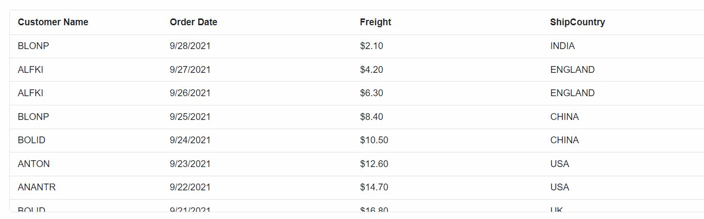

# Sorting in Blazor DataGrid Component

Sorting enables you to sort data in the **Ascending** or **Descending** order. To sort a column, click the column header.

To enable sorting in the DataGrid, set the [AllowSorting](https://help.syncfusion.com/cr/blazor/Syncfusion.Blazor.Grids.SfGrid-1.html#Syncfusion_Blazor_Grids_SfGrid_1_AllowSorting) to true. Sorting options can be configured through the [GridSortSettings](https://help.syncfusion.com/cr/blazor/Syncfusion.Blazor.Grids.SfGrid-1.html#Syncfusion_Blazor_Grids_SfGrid_1_SortSettings) component.

```csharp

@using Syncfusion.Blazor.Grids

<SfGrid  DataSource="@Orders" AllowSorting="true" Height="270">
   <GridColumns>
     <GridColumn Field=@nameof(Order.OrderID) HeaderText="Order ID" TextAlign="TextAlign.Right" Width="120"></GridColumn>
     <GridColumn Field=@nameof(Order.CustomerID) HeaderText="Customer Name" Width="150"></GridColumn>
     <GridColumn Field=@nameof(Order.OrderDate) HeaderText=" Order Date" Format="d" Type="ColumnType.Date" TextAlign="TextAlign.Right" Width="130"></GridColumn>
     <GridColumn Field=@nameof(Order.Freight) HeaderText="Freight" Format="C2" TextAlign="TextAlign.Right" Width="120"></GridColumn>
   </GridColumns>
</SfGrid>

@code{
    public List<Order> Orders { get; set; }

    protected override void OnInitialized()
    {
        Orders = Enumerable.Range(1, 75).Select(x => new Order()
        {
            OrderID = 1000 + x,
            CustomerID = (new string[] { "ALFKI", "ANANTR", "ANTON", "BLONP", "BOLID" })[new Random().Next(5)],
            Freight = 2.1 * x,
            OrderDate = DateTime.Now.AddDays(-x),
        }).ToList();
    }

    public class Order {
        public int? OrderID { get; set; }
        public string CustomerID { get; set; }
        public DateTime? OrderDate { get; set; }
        public double? Freight { get; set; }
    }
}
```

N> * DataGrid columns are sorted in the **Ascending** order. If you click the already sorted column, the sort direction toggles.
<br/> * You can apply and clear sorting by invoking **SortColumn** and **ClearSorting** methods.
<br/> * To disable sorting for a particular column, set the [AllowSorting](https://help.syncfusion.com/cr/blazor/Syncfusion.Blazor.Grids.GridColumn.html#Syncfusion_Blazor_Grids_GridColumn_AllowSorting) property of **GridColumn** to false.

## Initial sort

To sort at initial rendering, set the **Field** and **Direction** in [Columns](https://help.syncfusion.com/cr/blazor/Syncfusion.Blazor.Grids.GridSortSettings.html#Syncfusion_Blazor_Grids_GridSortSettings_Columns) property of **GridSortSettings** component.

```csharp

@using Syncfusion.Blazor.Grids

<SfGrid DataSource="@Orders" AllowSorting="true" Height="270">
     <GridSortSettings>
        <GridSortColumns>
            <GridSortColumn Field="OrderDate" Direction="SortDirection.Ascending"></GridSortColumn>
            <GridSortColumn Field="Freight" Direction="SortDirection.Descending"></GridSortColumn>
        </GridSortColumns>
    </GridSortSettings>
   <GridColumns>
     <GridColumn Field=@nameof(Order.OrderID) HeaderText="Order ID" TextAlign="TextAlign.Right" Width="120"></GridColumn>
     <GridColumn Field=@nameof(Order.CustomerID) HeaderText="Customer Name" Width="150"></GridColumn>
     <GridColumn Field=@nameof(Order.OrderDate) HeaderText=" Order Date" Format="d" Type="ColumnType.Date" TextAlign="TextAlign.Right" Width="130"></GridColumn>
     <GridColumn Field=@nameof(Order.Freight) HeaderText="Freight" Format="C2" TextAlign="TextAlign.Right" Width="120"></GridColumn>
   </GridColumns>
</SfGrid>

@code{
    public List<Order> Orders { get; set; }

    protected override void OnInitialized()
    {
        Orders = Enumerable.Range(1, 75).Select(x => new Order()
        {
            OrderID = 1000 + x,
            CustomerID = (new string[] { "ALFKI", "ANANTR", "ANTON", "BLONP", "BOLID" })[new Random().Next(5)],
            Freight = 2.1 * x,
            OrderDate = DateTime.Now.AddDays(-x),
        }).ToList();
    }

    public class Order {
        public int? OrderID { get; set; }
        public string CustomerID { get; set; }
        public DateTime? OrderDate { get; set; }
        public double? Freight { get; set; }
    }
}
```

## Multi-column sorting

You can sort more than one column in a DataGrid. To sort multiple columns, press and hold the **CTRL** key and click the column header. The sorting order will be displayed in the header while performing multi-column sorting.

To clear sorting for a particular column, press the "Shift + mouse left click".

N> The [AllowSorting](https://help.syncfusion.com/cr/blazor/Syncfusion.Blazor.Grids.SfGrid-1.html#Syncfusion_Blazor_Grids_SfGrid_1_AllowSorting) must be **true** while enabling multi-column sort.
<br/> Set [AllowMultiSorting](https://help.syncfusion.com/cr/blazor/Syncfusion.Blazor.Grids.SfGrid-1.html#Syncfusion_Blazor_Grids_SfGrid_1_AllowMultiSorting) property as **false** to disable multi-column sorting.

```csharp

@using Syncfusion.Blazor.Grids

<SfGrid DataSource="@Orders" AllowSorting="true" AllowMultiSorting="true" Height="270">
   <GridColumns>
     <GridColumn Field=@nameof(Order.OrderID) HeaderText="Order ID" TextAlign="TextAlign.Right" Width="120"></GridColumn>
     <GridColumn Field=@nameof(Order.CustomerID) HeaderText="Customer Name" Width="150"></GridColumn>
     <GridColumn Field=@nameof(Order.OrderDate) HeaderText=" Order Date" Format="d" Type="ColumnType.Date" TextAlign="TextAlign.Right" Width="130"></GridColumn>
     <GridColumn Field=@nameof(Order.Freight) HeaderText="Freight" Format="C2" TextAlign="TextAlign.Right" Width="120"></GridColumn>
   </GridColumns>
</SfGrid>

@code{
    public List<Order> Orders { get; set; }

    protected override void OnInitialized()
    {
        Orders = Enumerable.Range(1, 75).Select(x => new Order()
        {
            OrderID = 1000 + x,
            CustomerID = (new string[] { "ALFKI", "ANANTR", "ANTON", "BLONP", "BOLID" })[new Random().Next(5)],
            Freight = 2.1 * x,
            OrderDate = DateTime.Now.AddDays(-x),
        }).ToList();
    }

    public class Order {
        public int? OrderID { get; set; }
        public string CustomerID { get; set; }
        public DateTime? OrderDate { get; set; }
        public double? Freight { get; set; }
    }
}
```

## Sort order

By default, the sorting order will be as **Ascending -> Descending -> None**.

When first click a column header it sorts the column in ascending. Again click the same column header, it will sort the column in descending. A repetitive third click on the same column header will clear the sorting.

## Sorting events

During the sort action, the datagrid component triggers two events. The [OnActionBegin](https://help.syncfusion.com/cr/blazor/Syncfusion.Blazor.Grids.SfGrid-1.html) event triggers before the sort action starts, and the [OnActionComplete](https://help.syncfusion.com/cr/blazor/Syncfusion.Blazor.Grids.SfGrid-1.html) event triggers after the sort action is completed. Using these events you can perform the needed actions.

```csharp

@using Syncfusion.Blazor.Grids

<SfGrid DataSource="@Orders" AllowSorting="true">
    <GridEvents OnActionBegin="SortEvent"  OnActionComplete="SortEvent" TValue="Order"></GridEvents>
    <GridColumns>
        <GridColumn Field=@nameof(Order.OrderID) HeaderText="Order ID" IsPrimaryKey="true" TextAlign="TextAlign.Right" Width="120"></GridColumn>
        <GridColumn Field=@nameof(Order.CustomerID) HeaderText="Customer Name" Width="120"></GridColumn>
        <GridColumn Field=@nameof(Order.OrderDate) HeaderText=" Order Date" Format="d" TextAlign="TextAlign.Right" Width="130" Type="ColumnType.Date"></GridColumn>
        <GridColumn Field=@nameof(Order.Freight) HeaderText="Freight" Format="C2" TextAlign="TextAlign.Right" MinWidth="10" Width="120" MaxWidth="200"></GridColumn>
    </GridColumns>
</SfGrid>

@code{
    public List<Order> Orders { get; set; }

    protected override void OnInitialized()
    {
        Orders = Enumerable.Range(1, 75).Select(x => new Order()
        {
            OrderID = 1000 + x,
            CustomerID = (new string[] { "ALFKI", "ANANTR", "ANTON", "BLONP", "BOLID" })[new Random().Next(5)],
            Freight = 2.1 * x,
            OrderDate = DateTime.Now.AddDays(-x),
        }).ToList();
    }

    public class Order {
        public int? OrderID { get; set; }
        public string CustomerID { get; set; }
        public DateTime? OrderDate { get; set; }
        public double? Freight { get; set; }
    }

    public void SortEvent(ActionEventArgs<Order> args) {
        if (args.RequestType.Equals(Syncfusion.Blazor.Grids.Action.Sorting)){
            // You can get action information from the argument.
        }    
    }
}
```

## Custom sort comparer

You can customize the default sort action for a specific Grid column by defining the [SortComparer](https://help.syncfusion.com/cr/blazor/Syncfusion.Blazor.Grids.ColumnModel.html#Syncfusion_Blazor_Grids_ColumnModel_SortComparer) property of GridColumn Directive. The SortComparer data type was the IComparer interface, so the custom sort comparer class should be implemented in the interface [IComparer](https://docs.microsoft.com/en-us/dotnet/api/system.collections.generic.icomparer-1?view=net-5).

In the following code example, custom SortComparer class was defined in the CustomerID Column.

```csharp

@using Syncfusion.Blazor.Grids

<SfGrid DataSource="@Orders" AllowSorting="true" Width="600" Height="270">
    <GridColumns>
        <GridColumn Field=@nameof(Order.OrderID) Visible="false" HeaderText="Order ID" Width="80"></GridColumn>
        <GridColumn Field=@nameof(Order.CustomerID) SortComparer="new CustomComparer()" HeaderText="Customer Name" Width="120"></GridColumn>
        <GridColumn Field=@nameof(Order.OrderDate) HeaderText=" Order Date" Format="d" Type="ColumnType.Date"  Width="100"></GridColumn>
        <GridColumn Field=@nameof(Order.Freight) HeaderText="Freight" Format="C2"  Width="80"></GridColumn>
        <GridColumn Field=@nameof(Order.ShipCountry) HeaderText="ShipCountry" Format="C2"  Width="100"></GridColumn>
    </GridColumns>
</SfGrid>

@code{
    public List<Order> Orders { get; set; }

    protected override void OnInitialized()
    {
        Orders = Enumerable.Range(1, 10).Select(x => new Order()
        {
            OrderID = 1000 + x,
            CustomerID = (new string[] { "ALFKI", "ANANTR", "ANTON", "BLONP", "BOLID" })[new Random().Next(5)],
            Freight = 2.1 * x,
            OrderDate = DateTime.Now.AddDays(-x),
            ShipCountry = (new string[] {"USA","UK","INDIA","CHINA","ENGLAND"})[new Random().Next(5)],
        }).ToList();
    }

    public class Order
    {
        public int? OrderID { get; set; }
        public string CustomerID { get; set; }
        public DateTime? OrderDate { get; set; }
        public double? Freight { get; set; }
        public string ShipCountry { get; set; }
    }

    public class CustomComparer : IComparer<Object>
    {
        public int Compare(object XRowDataToCompare, object YRowDataToCompare)
        {
            Order XRowData = XRowDataToCompare as Order;
            Order YRowData = YRowDataToCompare as Order;
            int XRowDataOrderID = (int)XRowData.OrderID;
            int YRowDataOrderID = (int)YRowData.OrderID;
            if (XRowDataOrderID < YRowDataOrderID)
            {
                return -1;
            }
            else if (XRowDataOrderID > YRowDataOrderID)
            {
                return 1;
            }
            else
            {
                return 0;
            }
        }
    }
}
```

The following GIF represents custom SortComparer for CustomerID column. When the user clicks the CustomerID column's header, the custom SortComparer will sort the data according to the OrderID field value. So that custom SortComparer class sort the column data by using another column's value.



N> The SortComparer property will work only for local data.
<br/> When using the column template to display data in a column, you will need to use the [Field](https://help.syncfusion.com/cr/blazor/Syncfusion.Blazor.Grids.GridColumn.html#Syncfusion_Blazor_Grids_GridColumn_Field) property of [GridColumn](https://help.syncfusion.com/cr/blazor/Syncfusion.Blazor.Grids.GridColumn.html) to work with the [SortComparer](https://help.syncfusion.com/cr/blazor/Syncfusion.Blazor.Grids.GridColumn.html#Syncfusion_Blazor_Grids_GridColumn_SortComparer) property.

## AllowUnSort property

To set the [AllowUnsort](https://help.syncfusion.com/cr/blazor/Syncfusion.Blazor.Grids.GridSortSettings.html#Syncfusion_Blazor_Grids_GridSortSettings_AllowUnsort) to false in [GridSortSettings](https://help.syncfusion.com/cr/blazor/Syncfusion.Blazor.Grids.SfGrid-1.html#Syncfusion_Blazor_Grids_SfGrid_1_SortSettings), the action of clicking on a column header to revert the grid to its original unsorted layout will be restricted.

```csharp
@using Syncfusion.Blazor.Grids

<SfGrid  DataSource="@Orders"  AllowSorting="true" Height="270">
    <GridSortSettings AllowUnsort= "false"></GridSortSettings>
   <GridColumns>
     <GridColumn Field=@nameof(Order.OrderID) HeaderText="Order ID" TextAlign="TextAlign.Right" Width="120"></GridColumn>
     <GridColumn Field=@nameof(Order.CustomerID) HeaderText="Customer Name" Width="150"></GridColumn>
     <GridColumn Field=@nameof(Order.OrderDate) HeaderText=" Order Date" Format="d" Type="ColumnType.Date" TextAlign="TextAlign.Right" Width="130"></GridColumn>
     <GridColumn Field=@nameof(Order.Freight) HeaderText="Freight" Format="C2" TextAlign="TextAlign.Right" Width="120"></GridColumn>
   </GridColumns>
</SfGrid>

@code{
    public List<Order> Orders { get; set; }

    protected override void OnInitialized()
    {
        Orders = Enumerable.Range(1, 75).Select(x => new Order()
        {
            OrderID = 1000 + x,
            CustomerID = (new string[] { "ALFKI", "CNANTR", "DENTON", "BLONP", "BOLID" })[new Random().Next(5)],
            Freight = 2.1 * x,
            OrderDate = DateTime.Now.AddDays(-x),
        }).ToList();
    }

    public class Order {
        public int? OrderID { get; set; }
        public string CustomerID { get; set; }
        public DateTime? OrderDate { get; set; }
        public double? Freight { get; set; }
    }
}
```



## Touch interaction

When you tap the datagrid header on touchscreen devices, the selected column header is sorted. A popup  is displayed for multi-column sorting. To sort multiple columns, tap the popup, and then tap the desired datagrid headers.

N> The [AllowMultiSorting](https://help.syncfusion.com/cr/blazor/Syncfusion.Blazor.Grids.SfGrid-1.html#Syncfusion_Blazor_Grids_SfGrid_1_AllowMultiSorting) and [AllowSorting](https://help.syncfusion.com/cr/blazor/Syncfusion.Blazor.Grids.SfGrid-1.html#Syncfusion_Blazor_Grids_SfGrid_1_AllowSorting) should be **true** then only the popup will be shown.

The following screenshot shows datagrid touch sorting.


N> You can refer to our [Blazor DataGrid](https://www.syncfusion.com/blazor-components/blazor-datagrid) feature tour page for its groundbreaking feature representations. You can also explore our [Blazor DataGrid example](https://blazor.syncfusion.com/demos/datagrid/overview?theme=bootstrap4) to understand how to present and manipulate data.