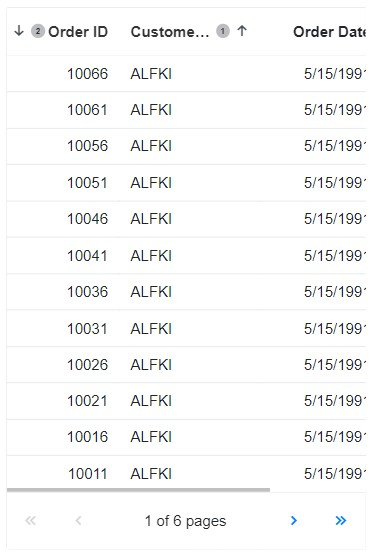

# Sorting in Blazor DataGrid

The Syncfusion<sup style="font-size:70%">&reg;</sup> Blazor DataGrid provides built-in support for sorting data-bound columns in ascending or descending order. To enable sorting in the DataGrid, set the [AllowSorting](https://help.syncfusion.com/cr/blazor/Syncfusion.Blazor.Grids.SfGrid-1.html#Syncfusion_Blazor_Grids_SfGrid_1_AllowSorting) property to `true`.

Sorting can be applied in two ways:
- **Ascending Order**: Arranges values from smallest to largest (e.g., A to Z or 1 to 100). An upward arrow (↑) appears next to the header.
- **Descending Order**: Arranges values from largest to smallest (e.g., Z to A or 100 to 1). A downward arrow (↓) appears next to the header.



## Sort via UI

Sorting a particular column is accomplished by clicking on its column header. Each click on the header toggles the sort order between `Ascending` and `Descending`.


|Action                        | Result                                           |
|------------------------------|--------------------------------------------------|
| Click header once            | Sorts in ascending order (↑ icon appears)        |
| Click header again           | Sorts in descending order (↓ icon appears)       |
| Click header a third time    | Clears sorting for that column(no icon)          |

To use the sorting feature, inject the `Sort` module in the DataGrid.




@using Syncfusion.Blazor.Grids

<SfGrid DataSource="@GridData" AllowSorting="true" Height="315">
    <GridColumns>
        <GridColumn Field="@nameof(OrderData.OrderID)" HeaderText="Order ID" TextAlign="TextAlign.Right" Width="90"></GridColumn>
        <GridColumn Field="@nameof(OrderData.CustomerID)" HeaderText="Customer ID" Width="100"></GridColumn>
        <GridColumn Field="@nameof(OrderData.ShipCity)" HeaderText="Ship City" Width="100"></GridColumn>
        <GridColumn Field="@nameof(OrderData.ShipName)" HeaderText="Ship Name" Width="120"></GridColumn>
    </GridColumns>
</SfGrid>

@code {
    public List<OrderData> GridData { get; set; } = new List<OrderData>();

    protected override void OnInitialized()
    {
        GridData = OrderData.GetAllRecords();
    }
}




public class OrderData
{
    private static readonly List<OrderData> Orders = new List<OrderData>();

    public OrderData(int? orderId, string customerId, string shipCity, string shipName)
    {
        OrderID = orderId;
        CustomerID = customerId;
        ShipCity = shipCity;
        ShipName = shipName;
    }

    public static List<OrderData> GetAllRecords()
    {
        if (Orders.Count == 0)
        {
            Orders.Add(new OrderData(10248, "VINET", "Reims", "Vins et alcools Chevali"));
            Orders.Add(new OrderData(10249, "TOMSP", "Münster", "Toms Spezialitäten"));
            Orders.Add(new OrderData(10250, "HANAR", "Rio de Janeiro", "Hanari Carnes"));
            Orders.Add(new OrderData(10251, "VICTE", "Lyon", "Victuailles en stock"));
            Orders.Add(new OrderData(10252, "SUPRD", "Charleroi", "Suprêmes délices"));
            Orders.Add(new OrderData(10253, "HANAR", "Lyon", "Hanari Carnes"));
            Orders.Add(new OrderData(10254, "CHOPS", "Rio de Janeiro", "Chop-suey Chinese"));
            Orders.Add(new OrderData(10255, "RICSU", "Münster", "Richter Supermarkt"));
            Orders.Add(new OrderData(10256, "WELLI", "Reims", "Wellington Import"));
        }

        return Orders;
    }

    public int? OrderID { get; set; }
    public string CustomerID { get; set; }
    public string ShipCity { get; set; }
    public string ShipName { get; set; }
}






<!-- > * Columns are sorted in **ascending** order by default.
> * Use [SortColumnAsync](https://help.syncfusion.com/cr/blazor/Syncfusion.Blazor.Grids.SfGrid-1.html#Syncfusion_Blazor_Grids_SfGrid_1_SortColumnAsync_System_String_Syncfusion_Blazor_Grids_SortDirection_System_Nullable_System_Boolean__) to sort programmatically.
> * Use [ClearSortingAsync](https://help.syncfusion.com/cr/blazor/Syncfusion.Blazor.Grids.SfGrid-1.html#Syncfusion_Blazor_Grids_SfGrid_1_ClearSortingAsync) to remove sorting.
> * To disable sorting for a specific column, set the [AllowSorting](https://help.syncfusion.com/cr/blazor/Syncfusion.Blazor.Grids.GridColumn.html) property of GridColumn to `false`. -->

## Initial sorting

By default, the Syncfusion<sup style="font-size:70%">&reg;</sup> Blazor DataGrid renders without any sorting applied. To arrange records in a desired order right from the initial load, configure initial sorting by setting the [Field](https://help.syncfusion.com/cr/blazor/Syncfusion.Blazor.Grids.GridSortColumn.html#Syncfusion_Blazor_Grids_GridSortColumn_Field) (the column's data field name) and [Direction](https://help.syncfusion.com/cr/blazor/Syncfusion.Blazor.Grids.GridSortColumn.html#Syncfusion_Blazor_Grids_GridSortColumn_Direction) properties (either **SortDirection.Ascending** for smallest to largest or **SortDirection.Descending** for largest to smallest) in the [Columns](https://help.syncfusion.com/cr/blazor/Syncfusion.Blazor.Grids.GridSortSettings.html#Syncfusion_Blazor_Grids_GridSortSettings_Columns) collection of [GridSortSettings](https://help.syncfusion.com/cr/blazor/Syncfusion.Blazor.Grids.GridSortSettings.html).

In this configuration, initial sorting is applied to the **OrderID** and **ShipCity** columns using the [GridSortSettings](https://help.syncfusion.com/cr/blazor/Syncfusion.Blazor.Grids.GridSortSettings.html) with a specified [Direction](https://help.syncfusion.com/cr/blazor/Syncfusion.Blazor.Grids.GridSortColumn.html#Syncfusion_Blazor_Grids_GridSortColumn_Direction).




@using Syncfusion.Blazor.Grids

<SfGrid DataSource="@GridData" AllowSorting="true" Height="315">
    <GridSortSettings>
        <GridSortColumns>
            <GridSortColumn Field="OrderID" Direction="SortDirection.Ascending"></GridSortColumn>
            <GridSortColumn Field="ShipCity" Direction="SortDirection.Descending"></GridSortColumn>
        </GridSortColumns>
    </GridSortSettings>
    <GridColumns>
        <GridColumn Field="@nameof(OrderData.OrderID)" HeaderText="Order ID" TextAlign="TextAlign.Right" Width="90"></GridColumn>
        <GridColumn Field="@nameof(OrderData.CustomerID)" HeaderText="Customer ID" Width="100"></GridColumn>
        <GridColumn Field="@nameof(OrderData.ShipCity)" HeaderText="Ship City" Width="100"></GridColumn>
        <GridColumn Field="@nameof(OrderData.ShipName)" HeaderText="Ship Name" Width="120"></GridColumn>
    </GridColumns>
</SfGrid>

@code {
    public List<OrderData> GridData { get; set; } = new List<OrderData>();

    protected override void OnInitialized()
    {
        GridData = OrderData.GetAllRecords();
    }
}




public class OrderData
{
    private static readonly List<OrderData> Orders = new List<OrderData>();

    public OrderData(int? orderId, string customerId, string shipCity, string shipName)
    {
        OrderID = orderId;
        CustomerID = customerId;
        ShipCity = shipCity;
        ShipName = shipName;
    }

    public static List<OrderData> GetAllRecords()
    {
        if (Orders.Count == 0)
        {
            Orders.Add(new OrderData(10248, "VINET", "Reims", "Vins et alcools Chevali"));
            Orders.Add(new OrderData(10249, "TOMSP", "Münster", "Toms Spezialitäten"));
            Orders.Add(new OrderData(10250, "HANAR", "Rio de Janeiro", "Hanari Carnes"));
            Orders.Add(new OrderData(10251, "VICTE", "Lyon", "Victuailles en stock"));
            Orders.Add(new OrderData(10252, "SUPRD", "Charleroi", "Suprêmes délices"));
            Orders.Add(new OrderData(10253, "HANAR", "Lyon", "Hanari Carnes"));
            Orders.Add(new OrderData(10254, "CHOPS", "Rio de Janeiro", "Chop-suey Chinese"));
            Orders.Add(new OrderData(10255, "RICSU", "Münster", "Richter Supermarkt"));
            Orders.Add(new OrderData(10256, "WELLI", "Reims", "Wellington Import"));
        }

        return Orders;
    }

    public int? OrderID { get; set; }
    public string CustomerID { get; set; }
    public string ShipCity { get; set; }
    public string ShipName { get; set; }
}






> The initial sorting defined in [GridSortSettings](https://help.syncfusion.com/cr/blazor/Syncfusion.Blazor.Grids.GridSortSettings.html#Syncfusion_Blazor_Grids_GridSortSettings_Columns) of the Columns will override any sorting applied through user interaction.

## Multi-column sorting

The Syncfusion<sup style="font-size:70%">&reg;</sup> Blazor DataGrid supports multi-column sorting, allowing multiple columns to be sorted simultaneously. To enable multi-column sorting, set the [AllowSorting](https://help.syncfusion.com/cr/blazor/Syncfusion.Blazor.Grids.SfGrid-1.html#Syncfusion_Blazor_Grids_SfGrid_1_AllowSorting) and the [AllowMultiSorting](https://help.syncfusion.com/cr/blazor/Syncfusion.Blazor.Grids.SfGrid-1.html#Syncfusion_Blazor_Grids_SfGrid_1_AllowMultiSorting) properties to `true`. This enables sorting of multiple columns by holding the <kbd>CTRL</kbd> (or <kbd>Command</kbd> on macOS) key and clicking the column headers. This feature is useful for sorting data based on multiple criteria to analyze it in various ways.

To clear multi-column sorting for a particular column, press <kbd>Shift</kbd> while clicking the column header.

> * The [AllowSorting](https://help.syncfusion.com/cr/blazor/Syncfusion.Blazor.Grids.SfGrid-1.html#Syncfusion_Blazor_Grids_SfGrid_1_AllowSorting) must be `true` while enabling multi-column sort.
> * Set [AllowMultiSorting](https://help.syncfusion.com/cr/blazor/Syncfusion.Blazor.Grids.SfGrid-1.html#Syncfusion_Blazor_Grids_SfGrid_1_AllowMultiSorting)  property as `false` to disable multi-column sorting.



@using Syncfusion.Blazor.Grids

<SfGrid DataSource="@GridData" AllowSorting="true" AllowMultiSorting="true" Height="315">
    <GridColumns>
        <GridColumn Field="@nameof(OrderData.OrderID)" HeaderText="Order ID" TextAlign="TextAlign.Right" Width="90"></GridColumn>
        <GridColumn Field="@nameof(OrderData.CustomerID)" HeaderText="Customer ID" Width="100"></GridColumn>
        <GridColumn Field="@nameof(OrderData.ShipCity)" HeaderText="Ship City" Width="100"></GridColumn>
        <GridColumn Field="@nameof(OrderData.ShipName)" HeaderText="Ship Name" Width="120"></GridColumn>
    </GridColumns>
</SfGrid>

@code {
    public List<OrderData> GridData { get; set; } = new List<OrderData>();

    protected override void OnInitialized()
    {
        GridData = OrderData.GetAllRecords();
    }
}



public class OrderData
{
    private static readonly List<OrderData> Orders = new List<OrderData>();

    public OrderData(int? orderId, string customerId, string shipCity, string shipName)
    {
        OrderID = orderId;
        CustomerID = customerId;
        ShipCity = shipCity;
        ShipName = shipName;
    }

    public static List<OrderData> GetAllRecords()
    {
        if (Orders.Count == 0)
        {
            Orders.Add(new OrderData(10248, "VINET", "Reims", "Vins et alcools Chevali"));
            Orders.Add(new OrderData(10249, "TOMSP", "Münster", "Toms Spezialitäten"));
            Orders.Add(new OrderData(10250, "HANAR", "Rio de Janeiro", "Hanari Carnes"));
            Orders.Add(new OrderData(10251, "VICTE", "Lyon", "Victuailles en stock"));
            Orders.Add(new OrderData(10252, "SUPRD", "Charleroi", "Suprêmes délices"));
            Orders.Add(new OrderData(10253, "HANAR", "Lyon", "Hanari Carnes"));
            Orders.Add(new OrderData(10254, "CHOPS", "Rio de Janeiro", "Chop-suey Chinese"));
            Orders.Add(new OrderData(10255, "RICSU", "Münster", "Richter Supermarkt"));
            Orders.Add(new OrderData(10256, "WELLI", "Reims", "Wellington Import"));
        }
        return Orders;
    }

    public int? OrderID { get; set; }
    public string CustomerID { get; set; }
    public string ShipCity { get; set; }
    public string ShipName { get; set; }
}






## Prevent sorting for particular column

The Syncfusion<sup style="font-size:70%">&reg;</sup> Blazor DataGrid provides the ability to prevent sorting for a particular column. This is useful when certain columns should not be included in the sorting process. 

This is achieved by setting the [AllowSorting](https://help.syncfusion.com/cr/blazor/Syncfusion.Blazor.Grids.SfGrid-1.html#Syncfusion_Blazor_Grids_SfGrid_1_AllowSorting) property of the particular column to `false`

The following example demonstrates disabling sorting for **"Customer ID"** column.



@using Syncfusion.Blazor.Grids

<SfGrid DataSource="@GridData" AllowSorting="true" Height="315">
    <GridColumns>
        <GridColumn Field="@nameof(OrderData.OrderID)" HeaderText="Order ID" TextAlign="TextAlign.Right" Width="90"></GridColumn>
        <GridColumn Field="@nameof(OrderData.CustomerID)" HeaderText="Customer ID" AllowSorting="false" Width="100"></GridColumn>
        <GridColumn Field="@nameof(OrderData.ShipCity)" HeaderText="Ship City" Width="100"></GridColumn>
        <GridColumn Field="@nameof(OrderData.ShipName)" HeaderText="Ship Name" Width="120"></GridColumn>
    </GridColumns>
</SfGrid>

@code {
    public List<OrderData> GridData { get; set; } = new List<OrderData>();

    protected override void OnInitialized()
    {
        GridData = OrderData.GetAllRecords();
    }
}



public class OrderData
{
    private static readonly List<OrderData> Orders = new List<OrderData>();

    public OrderData(int? orderId, string customerId, string shipCity, string shipName)
    {
        OrderID = orderId;
        CustomerID = customerId;
        ShipCity = shipCity;
        ShipName = shipName;
    }

    public static List<OrderData> GetAllRecords()
    {
        if (Orders.Count == 0)
        {
            Orders.Add(new OrderData(10248, "VINET", "Reims", "Vins et alcools Chevali"));
            Orders.Add(new OrderData(10249, "TOMSP", "Münster", "Toms Spezialitäten"));
            Orders.Add(new OrderData(10250, "HANAR", "Rio de Janeiro", "Hanari Carnes"));
            Orders.Add(new OrderData(10251, "VICTE", "Lyon", "Victuailles en stock"));
            Orders.Add(new OrderData(10252, "SUPRD", "Charleroi", "Suprêmes délices"));
            Orders.Add(new OrderData(10253, "HANAR", "Lyon", "Hanari Carnes"));
            Orders.Add(new OrderData(10254, "CHOPS", "Rio de Janeiro", "Chop-suey Chinese"));
            Orders.Add(new OrderData(10255, "RICSU", "Münster", "Richter Supermarkt"));
            Orders.Add(new OrderData(10256, "WELLI", "Reims", "Wellington Import"));
        }

        return Orders;
    }

    public int? OrderID { get; set; }
    public string CustomerID { get; set; }
    public string ShipCity { get; set; }
    public string ShipName { get; set; }
}





## Controlling Unsort behavior in Blazor DataGrid

The Syncfusion<sup style="font-size:70%">&reg;</sup> Blazor DataGrid provides control over whether a column can return to an unsorted state after sorting. This behavior is managed using the [AllowUnsort](https://help.syncfusion.com/cr/blazor/Syncfusion.Blazor.Grids.GridSortSettings.html#Syncfusion_Blazor_Grids_GridSortSettings_AllowUnsort) property in [GridSortSettings](https://help.syncfusion.com/cr/blazor/Syncfusion.Blazor.Grids.GridSortSettings.html).
When [AllowUnsort](https://help.syncfusion.com/cr/blazor/Syncfusion.Blazor.Grids.GridSortSettings.html#Syncfusion_Blazor_Grids_GridSortSettings_AllowUnsort) is set to **false**, clicking a sorted column header does not revert the DataGrid to its original unsorted layout. Instead, the column remains sorted until a different sort action is applied. This ensures a consistent sorting state and prevents accidental removal of sorting.



@using Syncfusion.Blazor.Grids

<SfGrid DataSource="@GridData" AllowSorting="true" Height="267px">
    <GridSortSettings AllowUnsort="false"></GridSortSettings>
    <GridColumns>
        <GridColumn Field="@nameof(OrderData.OrderID)" HeaderText="Order ID" TextAlign="TextAlign.Right" Width="90"></GridColumn>
        <GridColumn Field="@nameof(OrderData.CustomerID)" HeaderText="Customer ID" Width="100"></GridColumn>
        <GridColumn Field="@nameof(OrderData.ShipCity)" HeaderText="Ship City" Width="100"></GridColumn>
        <GridColumn Field="@nameof(OrderData.ShipName)" HeaderText="Ship Name" Width="120"></GridColumn>
    </GridColumns>
</SfGrid>

@code {
    public List<OrderData> GridData { get; set; } = new List<OrderData>();

    protected override void OnInitialized()
    {
        GridData = OrderData.GetAllRecords();
    }
}


public class OrderData
{
    private static readonly List<OrderData> Orders = new List<OrderData>();

    public OrderData(int? orderId, string customerId, string shipCity, string shipName)
    {
        OrderID = orderId;
        CustomerID = customerId;
        ShipCity = shipCity;
        ShipName = shipName;
    }

    public static List<OrderData> GetAllRecords()
    {
        if (Orders.Count == 0)
        {
            Orders.Add(new OrderData(10248, "VINET", "Reims", "Vins et alcools Chevali"));
            Orders.Add(new OrderData(10249, "TOMSP", "Münster", "Toms Spezialitäten"));
            Orders.Add(new OrderData(10250, "HANAR", "Rio de Janeiro", "Hanari Carnes"));
            Orders.Add(new OrderData(10251, "VICTE", "Lyon", "Victuailles en stock"));
            Orders.Add(new OrderData(10252, "SUPRD", "Charleroi", "Suprêmes délices"));
            Orders.Add(new OrderData(10253, "HANAR", "Lyon", "Hanari Carnes"));
            Orders.Add(new OrderData(10254, "CHOPS", "Rio de Janeiro", "Chop-suey Chinese"));
            Orders.Add(new OrderData(10255, "RICSU", "Münster", "Richter Supermarkt"));
            Orders.Add(new OrderData(10256, "WELLI", "Reims", "Wellington Import"));
        }

        return Orders;
    }

    public int? OrderID { get; set; }
    public string CustomerID { get; set; }
    public string ShipCity { get; set; }
    public string ShipName { get; set; }
}





## Custom sorting 

The Syncfusion<sup style="font-size:70%">&reg;</sup> Blazor DataGrid supports customizing the default sort action for a column by defining the [SortComparer](https://help.syncfusion.com/cr/blazor/Syncfusion.Blazor.Grids.ColumnModel.html#Syncfusion_Blazor_Grids_ColumnModel_SortComparer) property. This property accepts an IComparer &lt;object&gt; implementation, which can be created by defining a comparer class that implements the .NET [IComparer&lt;T&gt;](https://learn.microsoft.com/en-us/dotnet/api/system.collections.generic.icomparer-1?view=net-8.0) interface.

The following example demonstrates defining a custom `SortComparer` function for the **"Customer ID"** column.




@using Syncfusion.Blazor.Grids

<SfGrid DataSource="@GridData" AllowSorting="true" Height="315">
    <GridColumns>
        <GridColumn Field="@nameof(OrderData.OrderID)" HeaderText="Order ID" TextAlign="TextAlign.Right" Width="90"></GridColumn>
        <GridColumn Field="@nameof(OrderData.CustomerID)" HeaderText="Customer ID" SortComparer="new CustomComparer()" Width="100"></GridColumn>
        <GridColumn Field="@nameof(OrderData.Freight)" HeaderText="Freight" Format="C2" Width="80"></GridColumn>
        <GridColumn Field="@nameof(OrderData.ShipName)" HeaderText="Ship Name" Width="120"></GridColumn>
    </GridColumns>
</SfGrid>

@code {
    public List<OrderData> GridData { get; set; } = new List<OrderData>();

    protected override void OnInitialized()
    {
        GridData = OrderData.GetAllRecords();
    }

    public class CustomComparer : IComparer<object>
    {
        public int Compare(object? XRowDataToCompare, object? YRowDataToCompare)
        {
            if (XRowDataToCompare is not OrderData XOrder || YRowDataToCompare is not OrderData YOrder)
            {
                return 0;
            }

            return Nullable.Compare(XOrder.OrderID, YOrder.OrderID);
        }
    }
}


public class OrderData
{
    private static readonly List<OrderData> Orders = new List<OrderData>();

    public OrderData(int? orderId, string customerId, double? freight, string shipName)
    {
        OrderID = orderId;
        CustomerID = customerId;
        Freight = freight;
        ShipName = shipName;
    }

    public static List<OrderData> GetAllRecords()
    {
        if (Orders.Count == 0)
        {
            Orders.Add(new OrderData(10248, "VINET", 3.25, "Vins et alcools Chevali"));
            Orders.Add(new OrderData(10249, "TOMSP", 22.98, "Toms Spezialitäten"));
            Orders.Add(new OrderData(10250, "HANAR", 140.51, "Hanari Carnes"));
            Orders.Add(new OrderData(10251, "VICTE", 65.83, "Victuailles en stock"));
            Orders.Add(new OrderData(10252, "SUPRD", 58.17, "Suprêmes délices"));
            Orders.Add(new OrderData(10253, "HANAR", 81.91, "Hanari Carnes"));
            Orders.Add(new OrderData(10254, "CHOPS", 3.05, "Chop-suey Chinese"));
            Orders.Add(new OrderData(10255, "RICSU", 55.09, "Richter Supermarkt"));
            Orders.Add(new OrderData(10256, "WELLI", 48.29, "Wellington Import"));
        }

        return Orders;
    }

    public int? OrderID { get; set; }
    public string CustomerID { get; set; }
    public string ShipName { get; set; }
    public double? Freight { get; set; }
}





> * The **SortComparer** function receives two parameters: `a` and `b`, which represent the values to be compared. The function must return:
    - **-1** if `a` should appear before `b`
    - **0** if `a` and `b` are equal
    - **1** if `a` should appear after `b`
> * The **SortComparer** property is supported only when using `local data`.
> * When using a `column template`, ensure the [GridColumn.Field](https://help.syncfusion.com/cr/blazor/Syncfusion.Blazor.Grids.GridColumn.html#Syncfusion_Blazor_Grids_GridColumn_Field) property is defined so that SortComparer can access the corresponding field value.

## Touch interaction

On touch screen devices, tapping a DataGrid header sorts the selected column and displays a popup  for multi-column sorting. Tapping the popup enables sorting of multiple columns . Additional columns can then be sorted by tapping their headers.

> The [AllowMultiSorting](https://help.syncfusion.com/cr/blazor/Syncfusion.Blazor.Grids.SfGrid-1.html#Syncfusion_Blazor_Grids_SfGrid_1_AllowMultiSorting) and [AllowSorting](https://help.syncfusion.com/cr/blazor/Syncfusion.Blazor.Grids.SfGrid-1.html#Syncfusion_Blazor_Grids_SfGrid_1_AllowSorting) properties must be `true` for the popup to display.

The following screenshot represents a DataGrid touch sorting in the device.



## Sort foreign key column

Sorting based on a foreign key column is enabled by configuring the [ForeignDataSource](https://help.syncfusion.com/cr/blazor/Syncfusion.Blazor.Grids.GridForeignColumn-1.html#Syncfusion_Blazor_Grids_GridForeignColumn_1_ForeignDataSource), [ForeignKeyField](https://help.syncfusion.com/cr/blazor/Syncfusion.Blazor.Grids.GridColumn.html#Syncfusion_Blazor_Grids_GridColumn_ForeignKeyField), and [ForeignKeyValue](https://help.syncfusion.com/cr/blazor/Syncfusion.Blazor.Grids.GridColumn.html#Syncfusion_Blazor_Grids_GridColumn_ForeignKeyValue) properties.

N> 
* **For local data** → Sorting is performed based on the value of the `ForeignKeyValue` property (**display text**).
* **For remote data** → Sorting is performed based on the `ForeignKeyField` unless the remote service supports sorting on the display text field.

In this configuration, the **ContactName** field is used as the display text for the **CustomerID** foreign key column:



@using Syncfusion.Blazor.Grids

<SfGrid DataSource="@GridData" Height="315" AllowSorting="true">
    <GridColumns>
        <GridColumn Field="@nameof(OrderData.OrderID)" HeaderText="Order ID" TextAlign="TextAlign.Right" Width="90"></GridColumn>
        <GridForeignColumn Field="@nameof(OrderData.CustomerID)" HeaderText="Customer ID" ForeignKeyValue="ContactName" ForeignKeyField="CustomerID" ForeignDataSource="@CustomerData" Width="100"></GridForeignColumn>
        <GridColumn Field="@nameof(OrderData.ShipCity)" HeaderText="Ship City" Width="100"></GridColumn>
        <GridColumn Field="@nameof(OrderData.ShipName)" HeaderText="Ship Name" Width="120"></GridColumn>
    </GridColumns>
</SfGrid>

@code {
    public List<OrderData> GridData { get; set; } = new List<OrderData>();
    public List<EmployeeData> CustomerData { get; set; } = new List<EmployeeData>();

    protected override void OnInitialized()
    {
        GridData = OrderData.GetAllRecords();
        CustomerData = EmployeeData.GetAllRecords();
    }
}


public class EmployeeData
{
    private static readonly List<EmployeeData> EmployeeRecords = new List<EmployeeData>();

    public EmployeeData(int? customerId, string contactName)
    {
        CustomerID = customerId;
        ContactName = contactName;
    }

    public static List<EmployeeData> GetAllRecords()
    {
        if (EmployeeRecords.Count == 0)
        {
            EmployeeRecords.Add(new EmployeeData(1, "Paul Henriot"));
            EmployeeRecords.Add(new EmployeeData(2, "Karin Josephs"));
            EmployeeRecords.Add(new EmployeeData(3, "Mario Pontes"));
            EmployeeRecords.Add(new EmployeeData(4, "Mary Saveley"));
            EmployeeRecords.Add(new EmployeeData(5, "Pascale Cartrain"));
            EmployeeRecords.Add(new EmployeeData(6, "Mario Pontes"));
            EmployeeRecords.Add(new EmployeeData(7, "Yang Wang"));
            EmployeeRecords.Add(new EmployeeData(8, "Michael Holz"));
            EmployeeRecords.Add(new EmployeeData(9, "Paula Parente"));
        }

        return EmployeeRecords;
    }

    public int? CustomerID { get; set; }
    public string ContactName { get; set; }
}

public class OrderData
{
    private static readonly List<OrderData> Orders = new List<OrderData>();

    public OrderData(int? orderId, int? customerId, string shipCity, string shipName)
    {
        OrderID = orderId;
        CustomerID = customerId;
        ShipCity = shipCity;
        ShipName = shipName;
    }

    public static List<OrderData> GetAllRecords()
    {
        if (Orders.Count == 0)
        {
            Orders.Add(new OrderData(10248, 1, "Reims", "Vins et alcools Chevali"));
            Orders.Add(new OrderData(10249, 2, "Münster", "Toms Spezialitäten"));
            Orders.Add(new OrderData(10250, 3, "Rio de Janeiro", "Hanari Carnes"));
            Orders.Add(new OrderData(10251, 4, "Lyon", "Victuailles en stock"));
            Orders.Add(new OrderData(10252, 5, "Charleroi", "Suprêmes délices"));
            Orders.Add(new OrderData(10253, 6, "Lyon", "Hanari Carnes"));
            Orders.Add(new OrderData(10254, 7, "Rio de Janeiro", "Chop-suey Chinese"));
            Orders.Add(new OrderData(10255, 8, "Münster", "Richter Supermarkt"));
            Orders.Add(new OrderData(10256, 9, "Reims", "Wellington Import"));
        }

        return Orders;
    }

    public int? OrderID { get; set; }
    public int? CustomerID { get; set; }
    public string ShipCity { get; set; }
    public string ShipName { get; set; }
}





## Customizing sort icon

Sort icon customization in the Syncfusion<sup style="font-size:70%">&reg;</sup> Blazor DataGrid is accomplished by overriding the default DataGrid classes `.e-icon-ascending` and `.e-icon-descending` with custom content using CSS. The desired icons or symbols are specified using the `content` property as shown below:

```css
.e-grid .e-icon-ascending::before {
  content: '\e87a';
}

.e-grid .e-icon-descending::before {
  content: '\e70d';
}
```



@using Syncfusion.Blazor.Grids

<SfGrid DataSource="@GridData" AllowSorting="true" Height="315">
    <GridSortSettings>
        <GridSortColumns>
            <GridSortColumn Field="ShipCity" Direction="SortDirection.Ascending"></GridSortColumn>
            <GridSortColumn Field="CustomerID" Direction="SortDirection.Descending"></GridSortColumn>
        </GridSortColumns>
    </GridSortSettings>
    <GridColumns>
        <GridColumn Field="@nameof(OrderData.OrderID)" HeaderText="Order ID" TextAlign="TextAlign.Right" Width="90"></GridColumn>
        <GridColumn Field="@nameof(OrderData.CustomerID)" HeaderText="Customer ID" Width="100"></GridColumn>
        <GridColumn Field="@nameof(OrderData.ShipCity)" HeaderText="Ship City" Width="100"></GridColumn>
        <GridColumn Field="@nameof(OrderData.ShipName)" HeaderText="Ship Name" Width="120"></GridColumn>
    </GridColumns>
</SfGrid>

<style>
    .e-grid .e-icon-ascending::before {
        content: '\e87a';
    }

    .e-grid .e-icon-descending::before {
        content: '\e70d';
    }
</style>

@code {
    public List<OrderData> GridData { get; set; } = new List<OrderData>();

    protected override void OnInitialized()
    {
        GridData = OrderData.GetAllRecords();
    }
}


public class OrderData
{
    private static readonly List<OrderData> Orders = new List<OrderData>();

    public OrderData(int? orderId, string customerId, string shipCity, string shipName)
    {
        OrderID = orderId;
        CustomerID = customerId;
        ShipCity = shipCity;
        ShipName = shipName;
    }

    public static List<OrderData> GetAllRecords()
    {
        if (Orders.Count == 0)
        {
            Orders.Add(new OrderData(10248, "VINET", "Reims", "Vins et alcools Chevali"));
            Orders.Add(new OrderData(10249, "TOMSP", "Münster", "Toms Spezialitäten"));
            Orders.Add(new OrderData(10250, "HANAR", "Rio de Janeiro", "Hanari Carnes"));
            Orders.Add(new OrderData(10251, "VICTE", "Lyon", "Victuailles en stock"));
            Orders.Add(new OrderData(10252, "SUPRD", "Charleroi", "Suprêmes délices"));
            Orders.Add(new OrderData(10253, "HANAR", "Lyon", "Hanari Carnes"));
            Orders.Add(new OrderData(10254, "CHOPS", "Rio de Janeiro", "Chop-suey Chinese"));
            Orders.Add(new OrderData(10255, "RICSU", "Münster", "Richter Supermarkt"));
            Orders.Add(new OrderData(10256, "WELLI", "Reims", "Wellington Import"));
        }

        return Orders;
    }

    public int? OrderID { get; set; }
    public string CustomerID { get; set; }
    public string ShipCity { get; set; }
    public string ShipName { get; set; }
}





## Sort columns externally

The Syncfusion<sup style="font-size:70%">&reg;</sup> Blazor DataGrid provides flexibility in sorting based on external interactions. Columns can be sorted, sort columns removed, and sorting cleared using external button clicks.

### Add sort columns

The Syncfusion<sup style="font-size:70%">&reg;</sup> Blazor DataGrid provides method overloads for programmatic sorting, offering flexibility based on different use cases. These overloads support sorting a single column, multiple columns, or multiple columns while resetting any previous sort settings.

**Sorting a Single Column**

Use [SortColumnAsync](https://help.syncfusion.com/cr/blazor/Syncfusion.Blazor.Grids.SfGrid-1.html#Syncfusion_Blazor_Grids_SfGrid_1_SortColumnAsync_System_String_Syncfusion_Blazor_Grids_SortDirection_System_Nullable_System_Boolean__) method to sort a single column by specifying its name and sort direction. This method also supports multi-column sorting when enabled in the DataGrid, allowing it to add the new sort condition alongside existing ones.

| Parameter      | Type              | Description                                                                 |
|----------------|-------------------|-----------------------------------------------------------------------------|
| fieldName      | string            | Specifies the column name to be sorted. If the column name is invalid or misspelled, the sort will fail silently without throwing error.                                    |
| direction      | SortDirection     | Defines the sort direction. Possible values: **Ascending, Descending**.        |
| isMultiSort    | bool? (optional)  | Enables multi-column sorting when true; replaces existing sort when false. |



@using Syncfusion.Blazor.Grids
@using Syncfusion.Blazor.Buttons
@using Syncfusion.Blazor.DropDowns

<div style="display:flex;">
    <label style="padding: 10px 20px 0 0">Column name :</label>
    <SfDropDownList TValue="string" TItem="ColumnItem" Width="300px" Placeholder="Select a Column" DataSource="@ColumnList" @bind-Value="@dropDownValue">
        <DropDownListFieldSettings Value="ID" Text="Value"></DropDownListFieldSettings>
    </SfDropDownList>
</div>
<br />

<div style="display:flex;">
    <label style="padding: 10px 17px 0 0">Sorting direction :</label>
    <SfDropDownList TValue="SortDirection" TItem="string" DataSource="@enumValues" @bind-Value="@dropDownDirection" Width="300px">
    </SfDropDownList>
</div>
<br />

<div style="display:flex;">
    <SfButton OnClick="AddSortColumn">ADD SORT COLUMN</SfButton>
</div>

<SfGrid DataSource="@gridData" @ref="grid" AllowSorting="true" Height="315">
    <GridColumns>
        <GridColumn Field=@nameof(OrderData.OrderID) HeaderText="Order ID" TextAlign="TextAlign.Right" Width="90"></GridColumn>
        <GridColumn Field=@nameof(OrderData.CustomerID) HeaderText="Customer ID" Width="100"></GridColumn>
        <GridColumn Field=@nameof(OrderData.ShipName) HeaderText="Ship Name" Width="120"></GridColumn>
        <GridColumn Field=@nameof(OrderData.Freight) HeaderText="Freight" Format="C2" TextAlign="TextAlign.Right" Width="80"></GridColumn>
    </GridColumns>
</SfGrid>

@code {
    private List<OrderData> gridData { get; set; }
    private SfGrid<OrderData>? grid { get; set; }
    private string dropDownValue { get; set; } = "OrderID";
    private string[] enumValues = Enum.GetNames(typeof(Syncfusion.Blazor.Grids.SortDirection));
    private SortDirection dropDownDirection { get; set; } = SortDirection.Ascending;

    protected override void OnInitialized()
    {
        gridData = OrderData.GetAllRecords();
    }

    private List<ColumnItem> ColumnList = new List<ColumnItem>
    {
        new ColumnItem { ID = "OrderID", Value = "OrderID" },
        new ColumnItem { ID = "CustomerID", Value = "CustomerID" },
        new ColumnItem { ID = "Freight", Value = "Freight" }
    };

    private async Task AddSortColumn()
    {
        await grid.SortColumnAsync(dropDownValue, dropDownDirection);
    }

    private class ColumnItem
    {
        public string ID { get; set; }
        public string Value { get; set; }
    }
}



public class OrderData
{
    private static readonly List<OrderData> Orders = new List<OrderData>();

    public OrderData(int? orderID, string customerID, double? freight, string shipName)
    {
        OrderID = orderID;
        CustomerID = customerID;
        Freight = freight;
        ShipName = shipName;
    }

    public static List<OrderData> GetAllRecords()
    {
        if (Orders.Count == 0)
        {
            Orders.Add(new OrderData(10248, "VINET", 3.25, "Vins et alcools Chevali"));
            Orders.Add(new OrderData(10249, "TOMSP", 22.98, "Toms Spezialitäten"));
            Orders.Add(new OrderData(10250, "HANAR", 140.51, "Hanari Carnes"));
            Orders.Add(new OrderData(10251, "VICTE", 65.83, "Victuailles en stock"));
            Orders.Add(new OrderData(10252, "SUPRD", 58.17, "Suprêmes délices"));
            Orders.Add(new OrderData(10253, "HANAR", 81.91, "Hanari Carnes"));
            Orders.Add(new OrderData(10254, "CHOPS", 3.05, "Chop-suey Chinese"));
            Orders.Add(new OrderData(10255, "RICSU", 55.09, "Richter Supermarkt"));
            Orders.Add(new OrderData(10256, "WELLI", 48.29, "Wellington Import"));
        }
        return Orders;
    }

    public int? OrderID { get; set; }
    public string CustomerID { get; set; }
    public string ShipName { get; set; }
    public double? Freight { get; set; }
}





**Sort Multiple Columns**

The [SortColumnsAsync](https://help.syncfusion.com/cr/blazor/Syncfusion.Blazor.Grids.SfGrid-1.html#Syncfusion_Blazor_Grids_SfGrid_1_SortColumnsAsync_System_Collections_Generic_List_Syncfusion_Blazor_Grids_SortColumn__) method is used to sort multiple columns simultaneously. It accepts a list of [SortColumn](https://help.syncfusion.com/cr/blazor/Syncfusion.Blazor.Grids.SortColumn.html#Syncfusion_Blazor_Grids_SortColumn_Field) objects, each specifying the column name and sort direction.

| Parameter        | Type                    | Description                                                  |
|------------------|-------------------------|--------------------------------------------------------------|
| columns          | List<SortColumn>        | A collection of sorting instructions. Each `SortColumn` in the list defines a specific column to sort and the direction of sorting (**Ascending** or **Descending**). This allows multiple columns to be sorted at the same time, based on the order they appear in the list.       |



@using Syncfusion.Blazor.Grids
@using Syncfusion.Blazor.Buttons

<SfButton OnClick="ApplyMultiColumnSort">Add Sort Column</SfButton>

<SfGrid @ref="grid" DataSource="@GridData" AllowSorting="true" Height="267px">
    <GridColumns>
        <GridColumn Field="@nameof(OrderData.OrderID)" HeaderText="Order ID" TextAlign="TextAlign.Right" Width="90"></GridColumn>
        <GridColumn Field="@nameof(OrderData.CustomerID)" HeaderText="Customer ID" Width="100"></GridColumn>
        <GridColumn Field="@nameof(OrderData.ShipCity)" HeaderText="Ship City" Width="100"></GridColumn>
        <GridColumn Field="@nameof(OrderData.ShipName)" HeaderText="Ship Name" Width="120"></GridColumn>
    </GridColumns>
</SfGrid>

@code {
    public List<OrderData> GridData { get; set; } = new List<OrderData>();
    private SfGrid<OrderData>? grid { get; set; }
    private List<SortColumn> sortColumns { get; set; } = new List<SortColumn>();

    protected override void OnInitialized()
    {
        GridData = OrderData.GetAllRecords();
    }

    private async Task ApplyMultiColumnSort()
    {
        sortColumns.Add(new() { Field = nameof(OrderData.ShipCity), Direction = SortDirection.Descending });
        sortColumns.Add(new() { Field = nameof(OrderData.ShipName), Direction = SortDirection.Ascending });
        await grid!.SortColumnsAsync(sortColumns);
    }
}



public class OrderData
{
    private static readonly List<OrderData> Orders = new List<OrderData>();

    public OrderData(int? orderId, string customerId, string shipCity, string shipName)
    {
        OrderID = orderId;
        CustomerID = customerId;
        ShipCity = shipCity;
        ShipName = shipName;
    }

    public static List<OrderData> GetAllRecords()
    {
         if (Orders.Count == 0)
         {
             Orders.Add(new OrderData(10248, "VINET", "Reims", "Vins et alcools Chevali"));
             Orders.Add(new OrderData(10249, "TOMSP", "Münster", "Toms Spezialitäten"));
             Orders.Add(new OrderData(10250, "HANAR", "Rio de Janeiro", "Hanari Carnes"));
             Orders.Add(new OrderData(10251, "VICTE", "Lyon", "Victuailles en stock"));
             Orders.Add(new OrderData(10252, "SUPRD", "Charleroi", "Suprêmes délices"));
             Orders.Add(new OrderData(10253, "HANAR", "Lyon", "Hanari Carnes"));
             Orders.Add(new OrderData(10254, "CHOPS", "Rio de Janeiro", "Chop-suey Chinese"));
             Orders.Add(new OrderData(10255, "RICSU", "Münster", "Richter Supermarkt"));
             Orders.Add(new OrderData(10256, "WELLI", "Reims", "Wellington Import"));
         }

         return Orders;
    }

    public int? OrderID { get; set; }
    public string CustomerID { get; set; }
    public string ShipCity { get; set; }
    public string ShipName { get; set; }
}






> When sorting is applied again using `SortColumnsAsync`, the new sort settings are added to the existing ones. This means previously sorted columns will remain sorted unless explicitly removed or overridden.

**Sort Multiple Columns and Clear Previous Sort**

The [SortColumnsAsync](https://help.syncfusion.com/cr/blazor/Syncfusion.Blazor.Grids.SfGrid-1.html#Syncfusion_Blazor_Grids_SfGrid_1_SortColumnsAsync_System_Collections_Generic_List_Syncfusion_Blazor_Grids_SortColumn__) method also provides an overload that allows clearing existing sort settings before applying new ones. This is useful when replacing current sort configurations with a new set of sorted columns.

| Parameter           | Type                    | Description                                                                 |
|---------------------|-------------------------|-----------------------------------------------------------------------------|
| columns             | List<SortColumn>        | A collection of sorting instructions. Each `SortColumn` in the list defines a specific column to sort and the direction of sorting (**Ascending** or **Descending**). This allows multiple columns to be sorted at the same time, based on the order they appear in the list.         |
| clearPreviousSort   | bool                    | To apply a new sort and remove any existing sort settings, enable the option to clear previous sorting. When this option is set to true, all current sort conditions will be removed before applying the new ones. This ensures that only the specified columns are sorted, rather than combining with any existing sort configuration.               |

In this example, the DataGrid is initially configured to sort the **OrderID** column. By setting the `clearPreviousSort` parameter to true in the `SortColumnsAsync` method, the existing sort on the **OrderID** column is removed before applying the new sort. This ensures that only the newly specified columns are sorted, replacing any previous sort settings.




@using Syncfusion.Blazor.Grids
@using Syncfusion.Blazor.Buttons

<SfButton OnClick="ApplyNewSort">Apply New Sort</SfButton>

<SfGrid @ref="Grid" DataSource="@GridData" AllowSorting="true" Height="267px">
    <GridSortSettings>
        <GridSortColumns>
            <GridSortColumn Field="OrderID" Direction="SortDirection.Ascending"></GridSortColumn>            
        </GridSortColumns>
    </GridSortSettings>
    <GridColumns>
        <GridColumn Field="@nameof(OrderData.OrderID)" HeaderText="Order ID" TextAlign="Syncfusion.Blazor.Grids.TextAlign.Right" Width="90"></GridColumn>
        <GridColumn Field="@nameof(OrderData.CustomerID)" HeaderText="Customer ID" Width="100"></GridColumn>
        <GridColumn Field="@nameof(OrderData.ShipCity)" HeaderText="Ship City" Width="100"></GridColumn>
        <GridColumn Field="@nameof(OrderData.ShipName)" HeaderText="Ship Name" Width="120"></GridColumn>
    </GridColumns>
</SfGrid>

@code {
    public List<OrderData> GridData { get; set; } = new List<OrderData>();
    private SfGrid<OrderData>? Grid { get; set; }
    public List<Syncfusion.Blazor.Grids.SortColumn> sortColumns { get; set; } = new List<Syncfusion.Blazor.Grids.SortColumn>();

    protected override void OnInitialized()
    {
        GridData = OrderData.GetAllRecords();
    }

    private async Task ApplyNewSort()
    {
        sortColumns.Add(new() { Field = nameof(OrderData.ShipCity), Direction = Syncfusion.Blazor.Grids.SortDirection.Descending });
        sortColumns.Add(new() { Field = nameof(OrderData.ShipName), Direction = Syncfusion.Blazor.Grids.SortDirection.Ascending });
        await Grid!.SortColumnsAsync(sortColumns, true);
    }
}



public class OrderData
{
    private static readonly List<OrderData> Orders = new List<OrderData>();

    public OrderData(int? orderId, string customerId, string shipCity, string shipName)
    {
        OrderID = orderId;
        CustomerID = customerId;
        ShipCity = shipCity;
        ShipName = shipName;
    }

    public static List<OrderData> GetAllRecords()
    {
         if (Orders.Count == 0)
         {
             Orders.Add(new OrderData(10248, "VINET", "Reims", "Vins et alcools Chevali"));
             Orders.Add(new OrderData(10249, "TOMSP", "Münster", "Toms Spezialitäten"));
             Orders.Add(new OrderData(10250, "HANAR", "Rio de Janeiro", "Hanari Carnes"));
             Orders.Add(new OrderData(10251, "VICTE", "Lyon", "Victuailles en stock"));
             Orders.Add(new OrderData(10252, "SUPRD", "Charleroi", "Suprêmes délices"));
             Orders.Add(new OrderData(10253, "HANAR", "Lyon", "Hanari Carnes"));
             Orders.Add(new OrderData(10254, "CHOPS", "Rio de Janeiro", "Chop-suey Chinese"));
             Orders.Add(new OrderData(10255, "RICSU", "Münster", "Richter Supermarkt"));
             Orders.Add(new OrderData(10256, "WELLI", "Reims", "Wellington Import"));
         }

         return Orders;
    }

    public int? OrderID { get; set; }
    public string CustomerID { get; set; }
    public string ShipCity { get; set; }
    public string ShipName { get; set; }
}






### Clear sorting

The Syncfusion<sup style="font-size:70%">&reg;</sup> Blazor DataGrid provides flexible options to remove sorting from columns. Sorting can be cleared either for specific column or for all columns at once, depending on the requirement.

**Clear sorting for specific Column**

Sorting is cleared on an external button click using the [ClearSortingAsync](https://help.syncfusion.com/cr/blazor/Syncfusion.Blazor.Grids.SfGrid-1.html#Syncfusion_Blazor_Grids_SfGrid_1_ClearSortingAsync_System_Collections_Generic_List_System_String__) method provided by the DataGrid. This method clears the sorting applied to all columns in the DataGrid. 

| Parameter     | Type              | Description                                                  |
|---------------|-------------------|--------------------------------------------------------------|
| columnNames   | List<string>      | A list of column field names whose sorting should be removed. |

In the following example, the DataGrid is initially sorted by **CustomerID** and **ShipName**. A dropdown allows selecting a column name, and clicking the **Remove Sort Column** button removes sorting from the selected column.




@using Syncfusion.Blazor.Grids
@using Syncfusion.Blazor.Buttons
@using Syncfusion.Blazor.DropDowns

<div style="display:flex;">
    <label style="padding: 10px 20px 0 0">Column name:</label>
    <SfDropDownList TValue="string" TItem="ColumnMetaData" Width="125px" Placeholder="Select a Column" DataSource="@columns" @bind-Value="@dropDownValue">
        <DropDownListFieldSettings Value="Id" Text="Value"></DropDownListFieldSettings>
    </SfDropDownList>
</div>
<br />

<div style="display:flex;">
    <SfButton OnClick="RemoveSortColumn">Remove Sort Column</SfButton>
</div>

<SfGrid @ref="grid" DataSource="@GridData" AllowSorting="true" Height="315">
    <GridSortSettings>
        <GridSortColumns>
            <GridSortColumn Field="CustomerID" Direction="SortDirection.Ascending"></GridSortColumn>
            <GridSortColumn Field="ShipName" Direction="SortDirection.Descending"></GridSortColumn>
        </GridSortColumns>
    </GridSortSettings>
    <GridColumns>
        <GridColumn Field="@nameof(OrderData.OrderID)" HeaderText="Order ID" TextAlign="TextAlign.Right" Width="90"></GridColumn>
        <GridColumn Field="@nameof(OrderData.CustomerID)" HeaderText="Customer ID" Width="100"></GridColumn>
        <GridColumn Field="@nameof(OrderData.ShipCity)" HeaderText="Ship City" Width="100"></GridColumn>
        <GridColumn Field="@nameof(OrderData.ShipName)" HeaderText="Ship Name" Width="120"></GridColumn>
    </GridColumns>
</SfGrid>

@code {
    private List<OrderData> GridData { get; set; } = new();
    private SfGrid<OrderData>? grid { get; set; }
    private string dropDownValue { get; set; } = "OrderID";

    private List<ColumnMetaData> columns { get; set; } = new()
    {
        new ColumnMetaData { Id = "OrderID", Value = "Order ID" },
        new ColumnMetaData { Id = "CustomerID", Value = "Customer ID" },
        new ColumnMetaData { Id = "ShipCity", Value = "Ship City" },
        new ColumnMetaData { Id = "ShipName", Value = "Ship Name" },
    };

    protected override void OnInitialized()
    {
        GridData = OrderData.GetAllRecords();
    }

    private async Task RemoveSortColumn()
    {
        if (grid != null)
        {
            var ColumnNames = new List<string> { dropDownValue };
            await grid.ClearSortingAsync(ColumnNames);
        }
    }

    private class ColumnMetaData
    {
        public string Id { get; set; } = string.Empty;
        public string Value { get; set; } = string.Empty;
    }
}




public class OrderData
{
    private static readonly List<OrderData> Orders = new List<OrderData>();

    public OrderData(int? orderId, string customerId, string shipCity, string shipName)
    {
        OrderID = orderId;
        CustomerID = customerId;
        ShipCity = shipCity;
        ShipName = shipName;
    }

    public static List<OrderData> GetAllRecords()
    {
        if (Orders.Count == 0)
        {
            Orders.Add(new OrderData(10248, "VINET", "Reims", "Vins et alcools Chevali"));
            Orders.Add(new OrderData(10249, "TOMSP", "Münster", "Toms Spezialitäten"));
            Orders.Add(new OrderData(10250, "HANAR", "Rio de Janeiro", "Hanari Carnes"));
            Orders.Add(new OrderData(10251, "VICTE", "Lyon", "Victuailles en stock"));
            Orders.Add(new OrderData(10252, "SUPRD", "Charleroi", "Suprêmes délices"));
            Orders.Add(new OrderData(10253, "HANAR", "Lyon", "Hanari Carnes"));
            Orders.Add(new OrderData(10254, "CHOPS", "Rio de Janeiro", "Chop-suey Chinese"));
            Orders.Add(new OrderData(10255, "RICSU", "Münster", "Richter Supermarkt"));
            Orders.Add(new OrderData(10256, "WELLI", "Reims", "Wellington Import"));
        }

        return Orders;
    }

    public int? OrderID { get; set; }
    public string CustomerID { get; set; }
    public string ShipCity { get; set; }
    public string ShipName { get; set; }
}





**Clear sorting for all columns**

The [ClearSortingAsync](https://help.syncfusion.com/cr/blazor/Syncfusion.Blazor.Grids.SfGrid-1.html#Syncfusion_Blazor_Grids_SfGrid_1_ClearSortingAsync) method removes sorting from all columns in the grid. This is useful when resetting the DataGrid to its default unsorted state.

In this example, the DataGrid is initially sorted by **CustomerID** and **ShipName**. Clicking the **Clear Sorting** button removes sorting from all columns.



@using Syncfusion.Blazor.Grids
@using Syncfusion.Blazor.Buttons

<div>
    <SfButton OnClick="ClearAllSorting">Clear Sorting</SfButton>
</div>

<SfGrid @ref="grid" DataSource="@gridData" AllowSorting="true" Height="315">
    <GridSortSettings>
        <GridSortColumns>
            <GridSortColumn Field="CustomerID" Direction="SortDirection.Ascending"></GridSortColumn>
            <GridSortColumn Field="ShipName" Direction="SortDirection.Descending"></GridSortColumn>
        </GridSortColumns>
    </GridSortSettings>
    <GridColumns>
        <GridColumn Field="@nameof(OrderData.OrderID)" HeaderText="Order ID" TextAlign="TextAlign.Right" Width="90"></GridColumn>
        <GridColumn Field="@nameof(OrderData.CustomerID)" HeaderText="Customer ID" Width="100"></GridColumn>
        <GridColumn Field="@nameof(OrderData.ShipCity)" HeaderText="Ship City" Width="100"></GridColumn>
        <GridColumn Field="@nameof(OrderData.ShipName)" HeaderText="Ship Name" Width="120"></GridColumn>
    </GridColumns>
</SfGrid>

@code {
    private List<OrderData> gridData { get; set; } = new();
    private SfGrid<OrderData>? grid { get; set; }

    protected override void OnInitialized()
    {
        gridData = OrderData.GetAllRecords();
    }

    private async Task ClearAllSorting()
    {
        if (grid != null)
        {
            await grid.ClearSortingAsync();
        }
    }
}




public class OrderData
{
    private static readonly List<OrderData> Orders = new List<OrderData>();

    public OrderData(int? orderId, string customerId, string shipCity, string shipName)
    {
        OrderID = orderId;
        CustomerID = customerId;
        ShipCity = shipCity;
        ShipName = shipName;
    }

    public static List<OrderData> GetAllRecords()
    {
        if (Orders.Count == 0)
        {
            Orders.Add(new OrderData(10248, "VINET", "Reims", "Vins et alcools Chevali"));
            Orders.Add(new OrderData(10249, "TOMSP", "Münster", "Toms Spezialitäten"));
            Orders.Add(new OrderData(10250, "HANAR", "Rio de Janeiro", "Hanari Carnes"));
            Orders.Add(new OrderData(10251, "VICTE", "Lyon", "Victuailles en stock"));
            Orders.Add(new OrderData(10252, "SUPRD", "Charleroi", "Suprêmes délices"));
            Orders.Add(new OrderData(10253, "HANAR", "Lyon", "Hanari Carnes"));
            Orders.Add(new OrderData(10254, "CHOPS", "Rio de Janeiro", "Chop-suey Chinese"));
            Orders.Add(new OrderData(10255, "RICSU", "Münster", "Richter Supermarkt"));
            Orders.Add(new OrderData(10256, "WELLI", "Reims", "Wellington Import"));
        }

        return Orders;
    }

    public int? OrderID { get; set; }
    public string CustomerID { get; set; }
    public string ShipCity { get; set; }
    public string ShipName { get; set; }
}





## Sorting events

The Syncfusion<sup style="font-size:70%">&reg;</sup> Blazor DataGrid provides events that are triggered during sorting operations, such as [Sorting](https://help.syncfusion.com/cr/blazor/Syncfusion.Blazor.Grids.GridEvents-1.html#Syncfusion_Blazor_Grids_GridEvents_1_Sorting) and [Sorted](https://help.syncfusion.com/cr/blazor/Syncfusion.Blazor.Grids.GridEvents-1.html#Syncfusion_Blazor_Grids_GridEvents_1_Sorted). These events enable the execution of custom actions before and after a column is sorted, allowing for validation, customization, and response handling.

1. `Sorting`: Triggered before a column is sorted.

2. `Sorted`: Triggered after a column has been sorted.

### Sorting

The `Sorting` event is triggered before a column is sorted. This event provides an opportunity to inspect, modify, or cancel the sorting process based on custom logic or validation requirements.

**Event Arguments**

The event uses the [SortingEventArgs](https://help.syncfusion.com/cr/blazor/Syncfusion.Blazor.Grids.SortingEventArgs.html) class, which includes the following properties:

| Event Argument | Description |
|---------------|-------------|
| ColumnName    | Represents the name of the column being sorted. |
| Direction     | Indicates the sorting direction (**Ascending** or **Descending**). |
| Cancel        | Determines whether the sorting operation should be aborted. Setting this property to true prevents the sorting from being applied. |



@using Syncfusion.Blazor.Grids

<SfGrid DataSource="@GridData" AllowSorting="true" Height="315">
    <GridEvents Sorting="Sorting" TValue="OrderData"></GridEvents>
    <GridColumns>
        <GridColumn Field="@nameof(OrderData.OrderID)" HeaderText="Order ID" Width="90" TextAlign="TextAlign.Right"></GridColumn>
        <GridColumn Field="@nameof(OrderData.CustomerID)" HeaderText="Customer ID" Width="100"></GridColumn>
        <GridColumn Field="@nameof(OrderData.ShipCity)" HeaderText="Ship City" Width="100"></GridColumn>
        <GridColumn Field="@nameof(OrderData.ShipName)" HeaderText="Ship Name" Width="120"></GridColumn>
    </GridColumns>
</SfGrid>

@code {
    public List<OrderData> GridData { get; set; } = new List<OrderData>();

    protected override void OnInitialized()
    {
        GridData = OrderData.GetAllRecords();
    }

    private Task Sorting(SortingEventArgs args)
    {
        // Prevent sorting on OrderID column
        if (args.ColumnName == "OrderID")
        {
            args.Cancel = true;
        }

        // Change sort direction dynamically
        if (args.ColumnName == "CustomerID" && args.Direction == SortDirection.Ascending)
        {
            args.Direction = SortDirection.Descending;
        }

        return Task.CompletedTask;
    }
}




public class OrderData
{
    private static readonly List<OrderData> Orders = new List<OrderData>();

    public OrderData(int? orderId, string customerId, string shipCity, string shipName)
    {
        OrderID = orderId;
        CustomerID = customerId;
        ShipCity = shipCity;
        ShipName = shipName;
    }

    public static List<OrderData> GetAllRecords()
    {
        if (Orders.Count == 0)
        {
            Orders.Add(new OrderData(10248, "VINET", "Reims", "Vins et alcools Chevali"));
            Orders.Add(new OrderData(10249, "TOMSP", "Münster", "Toms Spezialitäten"));
            Orders.Add(new OrderData(10250, "HANAR", "Rio de Janeiro", "Hanari Carnes"));
            Orders.Add(new OrderData(10251, "VICTE", "Lyon", "Victuailles en stock"));
            Orders.Add(new OrderData(10252, "SUPRD", "Charleroi", "Suprêmes délices"));
            Orders.Add(new OrderData(10253, "HANAR", "Lyon", "Hanari Carnes"));
            Orders.Add(new OrderData(10254, "CHOPS", "Rio de Janeiro", "Chop-suey Chinese"));
            Orders.Add(new OrderData(10255, "RICSU", "Münster", "Richter Supermarkt"));
            Orders.Add(new OrderData(10256, "WELLI", "Reims", "Wellington Import"));
        }

        return Orders;
    }

    public int? OrderID { get; set; }
    public string CustomerID { get; set; }
    public string ShipCity { get; set; }
    public string ShipName { get; set; }
}





### Sorted

The `Sorted` event is triggered after a column has been successfully sorted. It provides details about the sorted column and direction, enabling actions such as updating UI, logging, or showing notifications.

**Event Arguments**

The event uses the [SortedEventArgs](https://help.syncfusion.com/cr/blazor/Syncfusion.Blazor.Grids.SortedEventArgs.html) class, which includes the following properties:

| Event Argument | Description |
|---------------|-------------|
| ColumnName    | Represents the name of the column that was sorted. |
| Direction     | Indicates the sorting direction (**Ascending** or **Descending**). |



@using Syncfusion.Blazor.Grids

@if (showNotification)
{
    <div style="text-align:center; color:red">
        <span>Sorting completed for @lastSortedColumn column</span>
    </div>
    <br />
}

<SfGrid DataSource="@gridData" AllowSorting="true" Height="315">
    <GridEvents Sorted="Sorted" TValue="OrderData"></GridEvents>
    <GridColumns>
        <GridColumn Field="@nameof(OrderData.OrderID)" HeaderText="Order ID" Width="90" TextAlign="TextAlign.Right"></GridColumn>
        <GridColumn Field="@nameof(OrderData.CustomerID)" HeaderText="Customer ID" Width="100"></GridColumn>
        <GridColumn Field="@nameof(OrderData.ShipCity)" HeaderText="Ship City" Width="100"></GridColumn>
        <GridColumn Field="@nameof(OrderData.ShipName)" HeaderText="Ship Name" Width="120"></GridColumn>
    </GridColumns>
</SfGrid>

@code {
    private List<OrderData> gridData { get; set; } = new List<OrderData>();
    private string lastSortedColumn { get; set; } = string.Empty;
    private bool showNotification { get; set; }

    protected override void OnInitialized()
    {
        gridData = OrderData.GetAllRecords();
    }

    private Task Sorted(SortedEventArgs args)
    {
        lastSortedColumn = args.ColumnName;
        showNotification = true;
        return Task.CompletedTask;
    }
}




public class OrderData
{
    private static readonly List<OrderData> Orders = new List<OrderData>();

    public OrderData(int? orderId, string customerId, string shipCity, string shipName)
    {
        OrderID = orderId;
        CustomerID = customerId;
        ShipCity = shipCity;
        ShipName = shipName;
    }

    public static List<OrderData> GetAllRecords()
    {
        if (Orders.Count == 0)
        {
            Orders.Add(new OrderData(10248, "VINET", "Reims", "Vins et alcools Chevali"));
            Orders.Add(new OrderData(10249, "TOMSP", "Münster", "Toms Spezialitäten"));
            Orders.Add(new OrderData(10250, "HANAR", "Rio de Janeiro", "Hanari Carnes"));
            Orders.Add(new OrderData(10251, "VICTE", "Lyon", "Victuailles en stock"));
            Orders.Add(new OrderData(10252, "SUPRD", "Charleroi", "Suprêmes délices"));
            Orders.Add(new OrderData(10253, "HANAR", "Lyon", "Hanari Carnes"));
            Orders.Add(new OrderData(10254, "CHOPS", "Rio de Janeiro", "Chop-suey Chinese"));
            Orders.Add(new OrderData(10255, "RICSU", "Münster", "Richter Supermarkt"));
            Orders.Add(new OrderData(10256, "WELLI", "Reims", "Wellington Import"));
        }

        return Orders;
    }

    public int? OrderID { get; set; }
    public string CustomerID { get; set; }
    public string ShipCity { get; set; }
    public string ShipName { get; set; }
}





N> Refer to the [Blazor DataGrid](https://www.syncfusion.com/blazor-components/blazor-datagrid) feature tour for a broad overview. Explore the [Blazor DataGrid example](https://blazor.syncfusion.com/demos/datagrid/overview?theme=bootstrap5) to understand data presentation and manipulation.