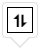

# Sorting in Blazor DataGrid

The Syncfusion<sup style="font-size:70%">&reg;</sup> Blazor DataGrid includes a built-in sorting feature that helps organize information within columns. This makes it easier to locate and analyze data efficiently. To turn on sorting, set the [AllowSorting](https://help.syncfusion.com/cr/blazor/Syncfusion.Blazor.Grids.SfGrid-1.html#Syncfusion_Blazor_Grids_SfGrid_1_AllowSorting) property to **true** in the Grid component.

Sorting can be applied in two ways:
- **Ascending Order**: Arranges values from smallest to largest (e.g., A to Z or 1 to 100). An upward arrow (↑) appears next to the header.
- **Descending Order**: Arranges values from largest to smallest (e.g., Z to A or 100 to 1). A downward arrow (↓) appears next to the header.



## Sort via UI

Interact with column headers to sort data directly. Clicking a column header toggles the sort order between **Ascending** and **Descending**. By default, the first click sorts ascending.


|Action                        | Result                                           |
|------------------------------|--------------------------------------------------|
| Click header once            | Sorts in ascending order (↑ icon appears)        |
| Click header again           | Sorts in descending order (↓ icon appears)       |
| Click header a third time    | Clears sorting for that column(no icon)          |





@using Syncfusion.Blazor.Grids

<SfGrid DataSource="@GridData" AllowSorting="true" Height="315">
    <GridColumns>
        <GridColumn Field="@nameof(OrderData.OrderID)" HeaderText="Order ID" TextAlign="TextAlign.Right" Width="90"></GridColumn>
        <GridColumn Field="@nameof(OrderData.CustomerID)" HeaderText="Customer ID" Width="100"></GridColumn>
        <GridColumn Field="@nameof(OrderData.ShipCity)" HeaderText="Ship City" Width="100"></GridColumn>
        <GridColumn Field="@nameof(OrderData.ShipName)" HeaderText="Ship Name" Width="120"></GridColumn>
    </GridColumns>
</SfGrid>

@code {
    public List<OrderData> GridData { get; set; } = new List<OrderData>();

    protected override void OnInitialized()
    {
        GridData = OrderData.GetAllRecords();
    }
}




public class OrderData
{
    private static readonly List<OrderData> Orders = new List<OrderData>();

    public OrderData(int? orderId, string customerId, string shipCity, string shipName)
    {
        OrderID = orderId;
        CustomerID = customerId;
        ShipCity = shipCity;
        ShipName = shipName;
    }

    public static List<OrderData> GetAllRecords()
    {
        if (Orders.Count == 0)
        {
            Orders.Add(new OrderData(10248, "VINET", "Reims", "Vins et alcools Chevali"));
            Orders.Add(new OrderData(10249, "TOMSP", "Münster", "Toms Spezialitäten"));
            Orders.Add(new OrderData(10250, "HANAR", "Rio de Janeiro", "Hanari Carnes"));
            Orders.Add(new OrderData(10251, "VICTE", "Lyon", "Victuailles en stock"));
            Orders.Add(new OrderData(10252, "SUPRD", "Charleroi", "Suprêmes délices"));
            Orders.Add(new OrderData(10253, "HANAR", "Lyon", "Hanari Carnes"));
            Orders.Add(new OrderData(10254, "CHOPS", "Rio de Janeiro", "Chop-suey Chinese"));
            Orders.Add(new OrderData(10255, "RICSU", "Münster", "Richter Supermarkt"));
            Orders.Add(new OrderData(10256, "WELLI", "Reims", "Wellington Import"));
        }

        return Orders;
    }

    public int? OrderID { get; set; }
    public string CustomerID { get; set; }
    public string ShipCity { get; set; }
    public string ShipName { get; set; }
}






<!-- > * Columns are sorted in **ascending** order by default.
> * Use [SortColumnAsync](https://help.syncfusion.com/cr/blazor/Syncfusion.Blazor.Grids.SfGrid-1.html#Syncfusion_Blazor_Grids_SfGrid_1_SortColumnAsync_System_String_Syncfusion_Blazor_Grids_SortDirection_System_Nullable_System_Boolean__) to sort programmatically.
> * Use [ClearSortingAsync](https://help.syncfusion.com/cr/blazor/Syncfusion.Blazor.Grids.SfGrid-1.html#Syncfusion_Blazor_Grids_SfGrid_1_ClearSortingAsync) to remove sorting.
> * To disable sorting for a specific column, set the [AllowSorting](https://help.syncfusion.com/cr/blazor/Syncfusion.Blazor.Grids.GridColumn.html) property of GridColumn to `false`. -->

## Initial sorting

By default, the Syncfusion<sup style="font-size:70%">&reg;</sup> Blazor DataGrid renders without any sorting applied. To arrange records in a desired order right from the initial load, configure initial sorting by setting the [Field](https://help.syncfusion.com/cr/blazor/Syncfusion.Blazor.Grids.GridSortColumn.html#Syncfusion_Blazor_Grids_GridSortColumn_Field) (the column's data field name) and [Direction](https://help.syncfusion.com/cr/blazor/Syncfusion.Blazor.Grids.GridSortColumn.html#Syncfusion_Blazor_Grids_GridSortColumn_Direction) properties (either **SortDirection.Ascending** for smallest to largest or **SortDirection.Descending** for largest to smallest) in the [Columns](https://help.syncfusion.com/cr/blazor/Syncfusion.Blazor.Grids.GridSortSettings.html#Syncfusion_Blazor_Grids_GridSortSettings_Columns) collection of [GridSortSettings](https://help.syncfusion.com/cr/blazor/Syncfusion.Blazor.Grids.GridSortSettings.html).

In this configuration, initial sorting is applied to the **OrderID** and **ShipCity** columns using the [GridSortSettings](https://help.syncfusion.com/cr/blazor/Syncfusion.Blazor.Grids.GridSortSettings.html).




@using Syncfusion.Blazor.Grids

<SfGrid DataSource="@GridData" AllowSorting="true" Height="315">
    <GridSortSettings>
        <GridSortColumns>
            <GridSortColumn Field="OrderID" Direction="SortDirection.Ascending"></GridSortColumn>
            <GridSortColumn Field="ShipCity" Direction="SortDirection.Descending"></GridSortColumn>
        </GridSortColumns>
    </GridSortSettings>
    <GridColumns>
        <GridColumn Field="@nameof(OrderData.OrderID)" HeaderText="Order ID" TextAlign="TextAlign.Right" Width="90"></GridColumn>
        <GridColumn Field="@nameof(OrderData.CustomerID)" HeaderText="Customer ID" Width="100"></GridColumn>
        <GridColumn Field="@nameof(OrderData.ShipCity)" HeaderText="Ship City" Width="100"></GridColumn>
        <GridColumn Field="@nameof(OrderData.ShipName)" HeaderText="Ship Name" Width="120"></GridColumn>
    </GridColumns>
</SfGrid>

@code {
    public List<OrderData> GridData { get; set; } = new List<OrderData>();

    protected override void OnInitialized()
    {
        GridData = OrderData.GetAllRecords();
    }
}




public class OrderData
{
    private static readonly List<OrderData> Orders = new List<OrderData>();

    public OrderData(int? orderId, string customerId, string shipCity, string shipName)
    {
        OrderID = orderId;
        CustomerID = customerId;
        ShipCity = shipCity;
        ShipName = shipName;
    }

    public static List<OrderData> GetAllRecords()
    {
        if (Orders.Count == 0)
        {
            Orders.Add(new OrderData(10248, "VINET", "Reims", "Vins et alcools Chevali"));
            Orders.Add(new OrderData(10249, "TOMSP", "Münster", "Toms Spezialitäten"));
            Orders.Add(new OrderData(10250, "HANAR", "Rio de Janeiro", "Hanari Carnes"));
            Orders.Add(new OrderData(10251, "VICTE", "Lyon", "Victuailles en stock"));
            Orders.Add(new OrderData(10252, "SUPRD", "Charleroi", "Suprêmes délices"));
            Orders.Add(new OrderData(10253, "HANAR", "Lyon", "Hanari Carnes"));
            Orders.Add(new OrderData(10254, "CHOPS", "Rio de Janeiro", "Chop-suey Chinese"));
            Orders.Add(new OrderData(10255, "RICSU", "Münster", "Richter Supermarkt"));
            Orders.Add(new OrderData(10256, "WELLI", "Reims", "Wellington Import"));
        }

        return Orders;
    }

    public int? OrderID { get; set; }
    public string CustomerID { get; set; }
    public string ShipCity { get; set; }
    public string ShipName { get; set; }
}






> Initial sorting defined in the `GridSortSettings` of the Columns is applied on first render and overrides any sorting applied through interaction.

## Multi-column sorting

The Syncfusion<sup style="font-size:70%">&reg;</sup> Blazor DataGrid supports sorting multiple columns simultaneously. To enable this feature, set both [AllowSorting](https://help.syncfusion.com/cr/blazor/Syncfusion.Blazor.Grids.SfGrid-1.html#Syncfusion_Blazor_Grids_SfGrid_1_AllowSorting) and [AllowMultiSorting](https://help.syncfusion.com/cr/blazor/Syncfusion.Blazor.Grids.SfGrid-1.html#Syncfusion_Blazor_Grids_SfGrid_1_AllowMultiSorting) to **true**.

**How Multi-Column Sorting Works**

When multi-sorting is enabled:
- Click a column header to apply sorting to that column.
- Hold <kbd>Ctrl</kbd> (or <kbd>Command</kbd> on macOS) and click additional column headers to include them in the sort sequence.
- Press <kbd>Shift</kbd> and click a column header to remove it from the multi-column sort configuration.



@using Syncfusion.Blazor.Grids

<SfGrid DataSource="@GridData" AllowSorting="true" AllowMultiSorting="true" Height="315">
    <GridColumns>
        <GridColumn Field="@nameof(OrderData.OrderID)" HeaderText="Order ID" TextAlign="TextAlign.Right" Width="90"></GridColumn>
        <GridColumn Field="@nameof(OrderData.CustomerID)" HeaderText="Customer ID" Width="100"></GridColumn>
        <GridColumn Field="@nameof(OrderData.ShipCity)" HeaderText="Ship City" Width="100"></GridColumn>
        <GridColumn Field="@nameof(OrderData.ShipName)" HeaderText="Ship Name" Width="120"></GridColumn>
    </GridColumns>
</SfGrid>

@code {
    public List<OrderData> GridData { get; set; } = new List<OrderData>();

    protected override void OnInitialized()
    {
        GridData = OrderData.GetAllRecords();
    }
}



public class OrderData
{
    private static readonly List<OrderData> Orders = new List<OrderData>();

    public OrderData(int? orderId, string customerId, string shipCity, string shipName)
    {
        OrderID = orderId;
        CustomerID = customerId;
        ShipCity = shipCity;
        ShipName = shipName;
    }

    public static List<OrderData> GetAllRecords()
    {
        if (Orders.Count == 0)
        {
            Orders.Add(new OrderData(10248, "VINET", "Reims", "Vins et alcools Chevali"));
            Orders.Add(new OrderData(10249, "TOMSP", "Münster", "Toms Spezialitäten"));
            Orders.Add(new OrderData(10250, "HANAR", "Rio de Janeiro", "Hanari Carnes"));
            Orders.Add(new OrderData(10251, "VICTE", "Lyon", "Victuailles en stock"));
            Orders.Add(new OrderData(10252, "SUPRD", "Charleroi", "Suprêmes délices"));
            Orders.Add(new OrderData(10253, "HANAR", "Lyon", "Hanari Carnes"));
            Orders.Add(new OrderData(10254, "CHOPS", "Rio de Janeiro", "Chop-suey Chinese"));
            Orders.Add(new OrderData(10255, "RICSU", "Münster", "Richter Supermarkt"));
            Orders.Add(new OrderData(10256, "WELLI", "Reims", "Wellington Import"));
        }
        return Orders;
    }

    public int? OrderID { get; set; }
    public string CustomerID { get; set; }
    public string ShipCity { get; set; }
    public string ShipName { get; set; }
}






## Disabling sorting for specific column

The Syncfusion<sup style="font-size:70%">&reg;</sup> Blazor DataGrid provides the option to disable sorting for individual columns. This is useful for fields where sorting is not meaningful or should be restricted.

To disable sorting for a specific column, set the [AllowSorting](https://help.syncfusion.com/cr/blazor/Syncfusion.Blazor.Grids.SfGrid-1.html#Syncfusion_Blazor_Grids_SfGrid_1_AllowSorting) property of that [GridColumn](https://help.syncfusion.com/cr/blazor/Syncfusion.Blazor.Grids.GridColumn.html) to **false**.

In this configuration, sorting is disabled for the **CustomerID** column.



@using Syncfusion.Blazor.Grids

<SfGrid DataSource="@GridData" AllowSorting="true" Height="315">
    <GridColumns>
        <GridColumn Field="@nameof(OrderData.OrderID)" HeaderText="Order ID" TextAlign="TextAlign.Right" Width="90"></GridColumn>
        <GridColumn Field="@nameof(OrderData.CustomerID)" HeaderText="Customer ID" AllowSorting="false" Width="100"></GridColumn>
        <GridColumn Field="@nameof(OrderData.ShipCity)" HeaderText="Ship City" Width="100"></GridColumn>
        <GridColumn Field="@nameof(OrderData.ShipName)" HeaderText="Ship Name" Width="120"></GridColumn>
    </GridColumns>
</SfGrid>

@code {
    public List<OrderData> GridData { get; set; } = new List<OrderData>();

    protected override void OnInitialized()
    {
        GridData = OrderData.GetAllRecords();
    }
}



public class OrderData
{
    private static readonly List<OrderData> Orders = new List<OrderData>();

    public OrderData(int? orderId, string customerId, string shipCity, string shipName)
    {
        OrderID = orderId;
        CustomerID = customerId;
        ShipCity = shipCity;
        ShipName = shipName;
    }

    public static List<OrderData> GetAllRecords()
    {
        if (Orders.Count == 0)
        {
            Orders.Add(new OrderData(10248, "VINET", "Reims", "Vins et alcools Chevali"));
            Orders.Add(new OrderData(10249, "TOMSP", "Münster", "Toms Spezialitäten"));
            Orders.Add(new OrderData(10250, "HANAR", "Rio de Janeiro", "Hanari Carnes"));
            Orders.Add(new OrderData(10251, "VICTE", "Lyon", "Victuailles en stock"));
            Orders.Add(new OrderData(10252, "SUPRD", "Charleroi", "Suprêmes délices"));
            Orders.Add(new OrderData(10253, "HANAR", "Lyon", "Hanari Carnes"));
            Orders.Add(new OrderData(10254, "CHOPS", "Rio de Janeiro", "Chop-suey Chinese"));
            Orders.Add(new OrderData(10255, "RICSU", "Münster", "Richter Supermarkt"));
            Orders.Add(new OrderData(10256, "WELLI", "Reims", "Wellington Import"));
        }

        return Orders;
    }

    public int? OrderID { get; set; }
    public string CustomerID { get; set; }
    public string ShipCity { get; set; }
    public string ShipName { get; set; }
}





## Controlling Unsort behavior in Blazor DataGrid

The Syncfusion<sup style="font-size:70%">&reg;</sup> Blazor DataGrid provides control over whether a column can return to an unsorted state after sorting. This behavior is managed using the [AllowUnsort](https://help.syncfusion.com/cr/blazor/Syncfusion.Blazor.Grids.GridSortSettings.html#Syncfusion_Blazor_Grids_GridSortSettings_AllowUnsort) property in [GridSortSettings](https://help.syncfusion.com/cr/blazor/Syncfusion.Blazor.Grids.GridSortSettings.html).
When [AllowUnsort](https://help.syncfusion.com/cr/blazor/Syncfusion.Blazor.Grids.GridSortSettings.html#Syncfusion_Blazor_Grids_GridSortSettings_AllowUnsort) is set to **false**, clicking a sorted column header does not revert the Grid to its original unsorted layout. Instead, the column remains sorted until a different sort action is applied. This ensures a consistent sorting state and prevents accidental removal of sorting.



@using Syncfusion.Blazor.Grids

<SfGrid DataSource="@GridData" AllowSorting="true" Height="267px">
    <GridSortSettings AllowUnsort="false"></GridSortSettings>
    <GridColumns>
        <GridColumn Field="@nameof(OrderData.OrderID)" HeaderText="Order ID" TextAlign="TextAlign.Right" Width="90"></GridColumn>
        <GridColumn Field="@nameof(OrderData.CustomerID)" HeaderText="Customer ID" Width="100"></GridColumn>
        <GridColumn Field="@nameof(OrderData.ShipCity)" HeaderText="Ship City" Width="100"></GridColumn>
        <GridColumn Field="@nameof(OrderData.ShipName)" HeaderText="Ship Name" Width="120"></GridColumn>
    </GridColumns>
</SfGrid>

@code {
    public List<OrderData> GridData { get; set; } = new List<OrderData>();

    protected override void OnInitialized()
    {
        GridData = OrderData.GetAllRecords();
    }
}


public class OrderData
{
    private static readonly List<OrderData> Orders = new List<OrderData>();

    public OrderData(int? orderId, string customerId, string shipCity, string shipName)
    {
        OrderID = orderId;
        CustomerID = customerId;
        ShipCity = shipCity;
        ShipName = shipName;
    }

    public static List<OrderData> GetAllRecords()
    {
        if (Orders.Count == 0)
        {
            Orders.Add(new OrderData(10248, "VINET", "Reims", "Vins et alcools Chevali"));
            Orders.Add(new OrderData(10249, "TOMSP", "Münster", "Toms Spezialitäten"));
            Orders.Add(new OrderData(10250, "HANAR", "Rio de Janeiro", "Hanari Carnes"));
            Orders.Add(new OrderData(10251, "VICTE", "Lyon", "Victuailles en stock"));
            Orders.Add(new OrderData(10252, "SUPRD", "Charleroi", "Suprêmes délices"));
            Orders.Add(new OrderData(10253, "HANAR", "Lyon", "Hanari Carnes"));
            Orders.Add(new OrderData(10254, "CHOPS", "Rio de Janeiro", "Chop-suey Chinese"));
            Orders.Add(new OrderData(10255, "RICSU", "Münster", "Richter Supermarkt"));
            Orders.Add(new OrderData(10256, "WELLI", "Reims", "Wellington Import"));
        }

        return Orders;
    }

    public int? OrderID { get; set; }
    public string CustomerID { get; set; }
    public string ShipCity { get; set; }
    public string ShipName { get; set; }
}





## Custom sorting 

The Syncfusion<sup style="font-size:70%">&reg;</sup> Blazor DataGrid allows customizing the default sort logic for a column by setting the [SortComparer](https://help.syncfusion.com/cr/blazor/Syncfusion.Blazor.Grids.ColumnModel.html#Syncfusion_Blazor_Grids_ColumnModel_SortComparer) property of a column. This property accepts an IComparer<object> implementation, which can be created by defining a comparer class that implements the .NET [IComparer<T>](https://learn.microsoft.com/en-us/dotnet/api/system.collections.generic.icomparer-1?view=net-8.0) interface.

In this configuration, a custom comparer is assigned to the **CustomerID** column:




@using Syncfusion.Blazor.Grids

<SfGrid DataSource="@GridData" AllowSorting="true" Height="315">
    <GridColumns>
        <GridColumn Field="@nameof(OrderData.OrderID)" HeaderText="Order ID" TextAlign="TextAlign.Right" Width="90"></GridColumn>
        <GridColumn Field="@nameof(OrderData.CustomerID)" HeaderText="Customer ID" SortComparer="new CustomComparer()" Width="100"></GridColumn>
        <GridColumn Field="@nameof(OrderData.Freight)" HeaderText="Freight" Format="C2" Width="80"></GridColumn>
        <GridColumn Field="@nameof(OrderData.ShipName)" HeaderText="Ship Name" Width="120"></GridColumn>
    </GridColumns>
</SfGrid>

@code {
    public List<OrderData> GridData { get; set; } = new List<OrderData>();

    protected override void OnInitialized()
    {
        GridData = OrderData.GetAllRecords();
    }

    public class CustomComparer : IComparer<object>
    {
        public int Compare(object? XRowDataToCompare, object? YRowDataToCompare)
        {
            if (XRowDataToCompare is not OrderData XOrder || YRowDataToCompare is not OrderData YOrder)
            {
                return 0;
            }

            return Nullable.Compare(XOrder.OrderID, YOrder.OrderID);
        }
    }
}


public class OrderData
{
    private static readonly List<OrderData> Orders = new List<OrderData>();

    public OrderData(int? orderId, string customerId, double? freight, string shipName)
    {
        OrderID = orderId;
        CustomerID = customerId;
        Freight = freight;
        ShipName = shipName;
    }

    public static List<OrderData> GetAllRecords()
    {
        if (Orders.Count == 0)
        {
            Orders.Add(new OrderData(10248, "VINET", 3.25, "Vins et alcools Chevali"));
            Orders.Add(new OrderData(10249, "TOMSP", 22.98, "Toms Spezialitäten"));
            Orders.Add(new OrderData(10250, "HANAR", 140.51, "Hanari Carnes"));
            Orders.Add(new OrderData(10251, "VICTE", 65.83, "Victuailles en stock"));
            Orders.Add(new OrderData(10252, "SUPRD", 58.17, "Suprêmes délices"));
            Orders.Add(new OrderData(10253, "HANAR", 81.91, "Hanari Carnes"));
            Orders.Add(new OrderData(10254, "CHOPS", 3.05, "Chop-suey Chinese"));
            Orders.Add(new OrderData(10255, "RICSU", 55.09, "Richter Supermarkt"));
            Orders.Add(new OrderData(10256, "WELLI", 48.29, "Wellington Import"));
        }

        return Orders;
    }

    public int? OrderID { get; set; }
    public string CustomerID { get; set; }
    public string ShipName { get; set; }
    public double? Freight { get; set; }
}





> * The **SortComparer** function receives two parameters: `a` and `b`, which represent the values to be compared. The function must return:
    - **-1** if `a` should appear before `b`
    - **0** if `a` and `b` are equal
    - **1** if `a` should appear after `b`
> * The **SortComparer** property is supported only when using `local data`.
> * When using a `column template`, ensure the [GridColumn.Field](https://help.syncfusion.com/cr/blazor/Syncfusion.Blazor.Grids.GridColumn.html#Syncfusion_Blazor_Grids_GridColumn_Field) property is defined so that SortComparer can access the corresponding field value.

## Touch interaction

The Syncfusion<sup style="font-size:70%">&reg;</sup> Blazor DataGrid supports sorting through touch gestures. On touch-enabled devices, tapping a column header sorts that column. A popup icon
 appears to enable multi-column sorting.
To sort multiple columns, tap the popup
, and then tap the desired column headers.

> Both [AllowMultiSorting](https://help.syncfusion.com/cr/blazor/Syncfusion.Blazor.Grids.SfGrid-1.html#Syncfusion_Blazor_Grids_SfGrid_1_AllowMultiSorting) and [AllowSorting](https://help.syncfusion.com/cr/blazor/Syncfusion.Blazor.Grids.SfGrid-1.html#Syncfusion_Blazor_Grids_SfGrid_1_AllowSorting) must be true for the popup to appear.

This screenshot illustrates touch-based sorting in the Grid:


## Sort foreign key column based on text

The Syncfusion<sup style="font-size:70%">&reg;</sup> Blazor DataGrid supports sorting foreign key columns based on display text. To enable this, configure a [GridForeignColumn](https://help.syncfusion.com/cr/blazor/Syncfusion.Blazor.Grids.GridForeignColumn-1.html#Syncfusion_Blazor_Grids_GridForeignColumn_1_ForeignDataSource) with the following properties:

- [ForeignDataSource](https://help.syncfusion.com/cr/blazor/Syncfusion.Blazor.Grids.GridForeignColumn-1.html#Syncfusion_Blazor_Grids_GridForeignColumn_1_ForeignDataSource) - Specifies the data source that contains foreign key values and display text.
- [ForeignKeyField](https://help.syncfusion.com/cr/blazor/Syncfusion.Blazor.Grids.GridColumn.html#Syncfusion_Blazor_Grids_GridColumn_ForeignKeyField) - Defines the key field used for mapping.
- [ForeignKeyValue](https://help.syncfusion.com/cr/blazor/Syncfusion.Blazor.Grids.GridColumn.html#Syncfusion_Blazor_Grids_GridColumn_ForeignKeyValue) - Specifies the display text field used for sorting and rendering.

**Sort foreign key column based on text for local data**

For local data, sorting is performed based on the value of the [ForeignKeyValue](https://help.syncfusion.com/cr/blazor/Syncfusion.Blazor.Grids.GridColumn.html#Syncfusion_Blazor_Grids_GridColumn_ForeignKeyValue) property. Assign this property to the display text field from the foreign data source to sort the column by that text.

In this configuration, the **ContactName** field is used as the display text for the **CustomerID** foreign key column:



@using Syncfusion.Blazor.Grids

<SfGrid DataSource="@GridData" Height="315" AllowSorting="true">
    <GridColumns>
        <GridColumn Field="@nameof(OrderData.OrderID)" HeaderText="Order ID" TextAlign="TextAlign.Right" Width="90"></GridColumn>
        <GridForeignColumn Field="@nameof(OrderData.CustomerID)" HeaderText="Customer ID" ForeignKeyValue="ContactName" ForeignKeyField="CustomerID" ForeignDataSource="@CustomerData" Width="100"></GridForeignColumn>
        <GridColumn Field="@nameof(OrderData.ShipCity)" HeaderText="Ship City" Width="100"></GridColumn>
        <GridColumn Field="@nameof(OrderData.ShipName)" HeaderText="Ship Name" Width="120"></GridColumn>
    </GridColumns>
</SfGrid>

@code {
    public List<OrderData> GridData { get; set; } = new List<OrderData>();
    public List<EmployeeData> CustomerData { get; set; } = new List<EmployeeData>();

    protected override void OnInitialized()
    {
        GridData = OrderData.GetAllRecords();
        CustomerData = EmployeeData.GetAllRecords();
    }
}


public class EmployeeData
{
    private static readonly List<EmployeeData> EmployeeRecords = new List<EmployeeData>();

    public EmployeeData(int? customerId, string contactName)
    {
        CustomerID = customerId;
        ContactName = contactName;
    }

    public static List<EmployeeData> GetAllRecords()
    {
        if (EmployeeRecords.Count == 0)
        {
            EmployeeRecords.Add(new EmployeeData(1, "Paul Henriot"));
            EmployeeRecords.Add(new EmployeeData(2, "Karin Josephs"));
            EmployeeRecords.Add(new EmployeeData(3, "Mario Pontes"));
            EmployeeRecords.Add(new EmployeeData(4, "Mary Saveley"));
            EmployeeRecords.Add(new EmployeeData(5, "Pascale Cartrain"));
            EmployeeRecords.Add(new EmployeeData(6, "Mario Pontes"));
            EmployeeRecords.Add(new EmployeeData(7, "Yang Wang"));
            EmployeeRecords.Add(new EmployeeData(8, "Michael Holz"));
            EmployeeRecords.Add(new EmployeeData(9, "Paula Parente"));
        }

        return EmployeeRecords;
    }

    public int? CustomerID { get; set; }
    public string ContactName { get; set; }
}

public class OrderData
{
    private static readonly List<OrderData> Orders = new List<OrderData>();

    public OrderData(int? orderId, int? customerId, string shipCity, string shipName)
    {
        OrderID = orderId;
        CustomerID = customerId;
        ShipCity = shipCity;
        ShipName = shipName;
    }

    public static List<OrderData> GetAllRecords()
    {
        if (Orders.Count == 0)
        {
            Orders.Add(new OrderData(10248, 1, "Reims", "Vins et alcools Chevali"));
            Orders.Add(new OrderData(10249, 2, "Münster", "Toms Spezialitäten"));
            Orders.Add(new OrderData(10250, 3, "Rio de Janeiro", "Hanari Carnes"));
            Orders.Add(new OrderData(10251, 4, "Lyon", "Victuailles en stock"));
            Orders.Add(new OrderData(10252, 5, "Charleroi", "Suprêmes délices"));
            Orders.Add(new OrderData(10253, 6, "Lyon", "Hanari Carnes"));
            Orders.Add(new OrderData(10254, 7, "Rio de Janeiro", "Chop-suey Chinese"));
            Orders.Add(new OrderData(10255, 8, "Münster", "Richter Supermarkt"));
            Orders.Add(new OrderData(10256, 9, "Reims", "Wellington Import"));
        }

        return Orders;
    }

    public int? OrderID { get; set; }
    public int? CustomerID { get; set; }
    public string ShipCity { get; set; }
    public string ShipName { get; set; }
}





**Sort foreign key column based on text for remote data**

For remote data, sorting is supported when the foreign key column is bound to a remote service using [SfDataManager](https://help.syncfusion.com/cr/blazor/Syncfusion.Blazor.Data.SfDataManager.html). The sorting behavior depends on the capabilities of the remote service:

- If the remote service (e.g., OData) supports sorting on the display field (e.g., FirstName), the grid will sort based on that field when the column header is clicked.
- Ensure that the [ForeignKeyValue](https://help.syncfusion.com/cr/blazor/Syncfusion.Blazor.Grids.GridColumn.html#Syncfusion_Blazor_Grids_GridColumn_ForeignKeyValue) is correctly mapped to the display field.
- Sorting works best with single-column sorting and may require server-side support for complex sorting scenarios.

In this configuration, the **FirstName** field is used as the display text for the **EmployeeID** foreign key column:



@using Syncfusion.Blazor.Grids
@using Syncfusion.Blazor.Data
@using Syncfusion.Blazor

<SfGrid DataSource="@Orders" Height="315" AllowSorting="true">
    <GridColumns>
        <GridColumn Field=@nameof(OrderDetails.OrderID) HeaderText="Order ID" TextAlign="Syncfusion.Blazor.Grids.TextAlign.Right" Width="120"></GridColumn>

        <GridForeignColumn Field=@nameof(OrderDetails.EmployeeID)
                           HeaderText="Employee Name"
                           ForeignKeyField="EmployeeID"
                           ForeignKeyValue="FirstName"
                           Width="150"
                           TValue="EmployeeData">
            <SfDataManager Url="https://services.odata.org/V4/Northwind/Northwind.svc/Employees"
                           CrossDomain="true"
                           Adaptor="Adaptors.ODataV4Adaptor">
            </SfDataManager>
        </GridForeignColumn>

        <GridColumn Field=@nameof(OrderDetails.Freight) HeaderText="Freight" Format="C2" TextAlign="Syncfusion.Blazor.Grids.TextAlign.Right" Width="120"></GridColumn>
        <GridColumn Field=@nameof(OrderDetails.ShipCity) HeaderText="Ship City" TextAlign="Syncfusion.Blazor.Grids.TextAlign.Right" Width="120"></GridColumn>
    </GridColumns>
</SfGrid>

@code {
    public List<OrderDetails>? Orders { get; set; }

    protected override void OnInitialized()
    {
        Orders = OrderDetails.GetAllRecords();
    }
}




public class EmployeeData
{
    public static List<EmployeeData> Employees = new List<EmployeeData>();

    public int EmployeeID { get; set; }
    public string FirstName { get; set; }
}

public class OrderDetails
{
   
    public static List<OrderDetails> order = new List<OrderDetails>();

    public OrderDetails(int orderID, string shipCity, int employeeId, double freight)
    {
        OrderID = orderID;
        ShipCity = shipCity;
        EmployeeID = employeeId;
        Freight = freight;
    }
        
    public static List<OrderDetails> GetAllRecords()
    {
        if (order.Count == 0)
        {
            order.Add(new OrderDetails(10248, "Reims", 5, 32.38));
            order.Add(new OrderDetails(10249, "Münster", 6, 11.61));
            order.Add(new OrderDetails(10250, "Rio de Janeiro", 4, 65.83));
            order.Add(new OrderDetails(10251, "Lyon", 3, 41.34));
            order.Add(new OrderDetails(10252, "Charleroi", 4, 51.3));
            order.Add(new OrderDetails(10253, "Rio de Janeiro", 3, 58.17));
            order.Add(new OrderDetails(10254, "Bern", 5, 22.98));
            order.Add(new OrderDetails(10255, "Genève", 9, 48.33));
            order.Add(new OrderDetails(10256, "Resende", 3, 13.97));
            order.Add(new OrderDetails(10257, "San Cristóbal", 4, 81.91));
            order.Add(new OrderDetails(10258, "Graz", 1, 40.51));
            order.Add(new OrderDetails(10259, "México D.F.", 4, 3.25));
            order.Add(new OrderDetails(10260, "Köln", 4, 55.09));
            order.Add(new OrderDetails(10261, "Rio de Janeiro", 4, 3.05));
            order.Add(new OrderDetails(10262, "Albuquerque", 8, 48.29));
        }
        return order;
    }

    public int OrderID { get; set; }
    public string ShipCity { get; set; }
    public int EmployeeID { get; set; }
    public double Freight { get; set; }
}






## How to customize sort icon

The Syncfusion<sup style="font-size:70%">&reg;</sup> Blazor DataGrid allows customizing the default sort icons by overriding the **.e-icon-ascending** and **.e-icon-descending** CSS classes. Use the `content` property to define custom icons:

```css
.e-grid .e-icon-ascending::before {
  content: '\e87a';
}

.e-grid .e-icon-descending::before {
  content: '\e70d';
}
```



@using Syncfusion.Blazor.Grids

<SfGrid DataSource="@GridData" AllowSorting="true" Height="315">
    <GridSortSettings>
        <GridSortColumns>
            <GridSortColumn Field="ShipCity" Direction="SortDirection.Ascending"></GridSortColumn>
            <GridSortColumn Field="CustomerID" Direction="SortDirection.Descending"></GridSortColumn>
        </GridSortColumns>
    </GridSortSettings>
    <GridColumns>
        <GridColumn Field="@nameof(OrderData.OrderID)" HeaderText="Order ID" TextAlign="TextAlign.Right" Width="90"></GridColumn>
        <GridColumn Field="@nameof(OrderData.CustomerID)" HeaderText="Customer ID" Width="100"></GridColumn>
        <GridColumn Field="@nameof(OrderData.ShipCity)" HeaderText="Ship City" Width="100"></GridColumn>
        <GridColumn Field="@nameof(OrderData.ShipName)" HeaderText="Ship Name" Width="120"></GridColumn>
    </GridColumns>
</SfGrid>

<style>
    .e-grid .e-icon-ascending::before {
        content: '\e87a';
    }

    .e-grid .e-icon-descending::before {
        content: '\e70d';
    }
</style>

@code {
    public List<OrderData> GridData { get; set; } = new List<OrderData>();

    protected override void OnInitialized()
    {
        GridData = OrderData.GetAllRecords();
    }
}


public class OrderData
{
    private static readonly List<OrderData> Orders = new List<OrderData>();

    public OrderData(int? orderId, string customerId, string shipCity, string shipName)
    {
        OrderID = orderId;
        CustomerID = customerId;
        ShipCity = shipCity;
        ShipName = shipName;
    }

    public static List<OrderData> GetAllRecords()
    {
        if (Orders.Count == 0)
        {
            Orders.Add(new OrderData(10248, "VINET", "Reims", "Vins et alcools Chevali"));
            Orders.Add(new OrderData(10249, "TOMSP", "Münster", "Toms Spezialitäten"));
            Orders.Add(new OrderData(10250, "HANAR", "Rio de Janeiro", "Hanari Carnes"));
            Orders.Add(new OrderData(10251, "VICTE", "Lyon", "Victuailles en stock"));
            Orders.Add(new OrderData(10252, "SUPRD", "Charleroi", "Suprêmes délices"));
            Orders.Add(new OrderData(10253, "HANAR", "Lyon", "Hanari Carnes"));
            Orders.Add(new OrderData(10254, "CHOPS", "Rio de Janeiro", "Chop-suey Chinese"));
            Orders.Add(new OrderData(10255, "RICSU", "Münster", "Richter Supermarkt"));
            Orders.Add(new OrderData(10256, "WELLI", "Reims", "Wellington Import"));
        }

        return Orders;
    }

    public int? OrderID { get; set; }
    public string CustomerID { get; set; }
    public string ShipCity { get; set; }
    public string ShipName { get; set; }
}





## Sort via programmatically

The Syncfusion<sup style="font-size:70%">&reg;</sup> Blazor DataGrid supports sorting operations through built-in methods. These methods allow sorting to be added, removed, or cleared programmatically without relying on the grid’s UI. Sorting actions can be triggered externally, such as through dropdown selections or button clicks.

### Add sort columns

The DataGrid provides multiple overloads to apply sorting programmatically. These methods allow sorting of a single column, multiple columns, or multiple columns with an option to clear existing sort settings.

**Sort a Single Column**

The [SortColumnAsync](https://help.syncfusion.com/cr/blazor/Syncfusion.Blazor.Grids.SfGrid-1.html#Syncfusion_Blazor_Grids_SfGrid_1_SortColumnAsync_System_String_Syncfusion_Blazor_Grids_SortDirection_System_Nullable_System_Boolean__) method is used to sort a specific column based on the provided direction. It also supports multi-column sorting when enabled.

| Parameter      | Type              | Description                                                                 |
|----------------|-------------------|-----------------------------------------------------------------------------|
| fieldName      | string            | Specifies the column name to be sorted.                                    |
| direction      | SortDirection     | Defines the sort direction. Possible values: Ascending, Descending.        |
| isMultiSort    | bool? (optional)             | Enables multi-column sorting when true; replaces existing sort when false. |



@using Syncfusion.Blazor.Grids
@using Syncfusion.Blazor.Buttons
@using Syncfusion.Blazor.DropDowns

<div style="display:flex;">
    <label style="padding: 10px 20px 0 0">Column name :</label>
    <SfDropDownList TValue="string" TItem="ColumnItem" Width="300px" Placeholder="Select a Column" DataSource="@ColumnList" @bind-Value="@DropDownValue">
        <DropDownListFieldSettings Value="ID" Text="Value"></DropDownListFieldSettings>
    </SfDropDownList>
</div>
<br />

<div style="display:flex;">
    <label style="padding: 10px 17px 0 0">Sorting direction :</label>
    <SfDropDownList TValue="SortDirection" TItem="string" DataSource="@EnumValues" @bind-Value="@DropDownDirection" Width="300px">
    </SfDropDownList>
</div>
<br />

<div style="display:flex;">
    <SfButton OnClick="AddSortColumn">ADD SORT COLUMN</SfButton>
</div>

<SfGrid DataSource="@GridData" @ref="Grid" AllowSorting="true" Height="315">
    <GridSortSettings>
        <GridSortColumns>
            <GridSortColumn Field="ShipName" Direction="SortDirection.Ascending"></GridSortColumn>
        </GridSortColumns>
    </GridSortSettings>
    <GridColumns>
        <GridColumn Field=@nameof(OrderData.OrderID) HeaderText="Order ID" TextAlign="TextAlign.Right" Width="90"></GridColumn>
        <GridColumn Field=@nameof(OrderData.CustomerID) HeaderText="Customer ID" Width="100"></GridColumn>
        <GridColumn Field=@nameof(OrderData.ShipName) HeaderText="Ship Name" Width="120"></GridColumn>
        <GridColumn Field=@nameof(OrderData.Freight) HeaderText="Freight" Format="C2" TextAlign="TextAlign.Right" Width="80"></GridColumn>
    </GridColumns>
</SfGrid>

@code {
    private List<OrderData> GridData { get; set; }
    private SfGrid<OrderData>? Grid { get; set; }
    private string DropDownValue { get; set; } = "OrderID";
    private string[] EnumValues = Enum.GetNames(typeof(Syncfusion.Blazor.Grids.SortDirection));
    private SortDirection DropDownDirection { get; set; } = SortDirection.Ascending;

    protected override void OnInitialized()
    {
        GridData = OrderData.GetAllRecords();
    }

    private List<ColumnItem> ColumnList = new List<ColumnItem>
    {
        new ColumnItem { ID = "OrderID", Value = "OrderID" },
        new ColumnItem { ID = "CustomerID", Value = "CustomerID" },
        new ColumnItem { ID = "Freight", Value = "Freight" }
    };

    private async Task AddSortColumn()
    {
        await Grid.SortColumnAsync(DropDownValue, DropDownDirection, true);
    }

    private class ColumnItem
    {
        public string ID { get; set; }
        public string Value { get; set; }
    }
}



public class OrderData
{
    private static readonly List<OrderData> Orders = new List<OrderData>();.
    v

    public OrderData(int? orderID, string customerID, double? freight, string shipName)
    {
        OrderID = orderID;
        CustomerID = customerID;
        Freight = freight;
        ShipName = shipName;
    }

    public static List<OrderData> GetAllRecords()
    {
        if (Orders.Count == 0)
        {
            Orders.Add(new OrderData(10248, "VINET", 3.25, "Vins et alcools Chevali"));
            Orders.Add(new OrderData(10249, "TOMSP", 22.98, "Toms Spezialitäten"));
            Orders.Add(new OrderData(10250, "HANAR", 140.51, "Hanari Carnes"));
            Orders.Add(new OrderData(10251, "VICTE", 65.83, "Victuailles en stock"));
            Orders.Add(new OrderData(10252, "SUPRD", 58.17, "Suprêmes délices"));
            Orders.Add(new OrderData(10253, "HANAR", 81.91, "Hanari Carnes"));
            Orders.Add(new OrderData(10254, "CHOPS", 3.05, "Chop-suey Chinese"));
            Orders.Add(new OrderData(10255, "RICSU", 55.09, "Richter Supermarkt"));
            Orders.Add(new OrderData(10256, "WELLI", 48.29, "Wellington Import"));
        }
        return Orders;
    }

    public int? OrderID { get; set; }
    public string CustomerID { get; set; }
    public string ShipName { get; set; }
    public double? Freight { get; set; }
}






**Sort Multiple Columns**

The [SortColumnsAsync](https://help.syncfusion.com/cr/blazor/Syncfusion.Blazor.Grids.SfGrid-1.html#Syncfusion_Blazor_Grids_SfGrid_1_SortColumnsAsync_System_Collections_Generic_List_Syncfusion_Blazor_Grids_SortColumn__) method is used to sort multiple columns simultaneously. It accepts a list of SortColumn objects, each specifying the column name and sort direction.

| Parameter        | Type                    | Description                                                  |
|------------------|-------------------------|--------------------------------------------------------------|
| sortedColumns    | List<SortColumn>        | List of columns with their respective sort directions.       |



@using Syncfusion.Blazor.Grids
@using Syncfusion.Blazor.Buttons

<SfButton OnClick="ApplyMultiColumnSort">Add Sort Column</SfButton>

<SfGrid @ref="Grid" DataSource="@GridData" AllowSorting="true" Height="267px">
    <GridColumns>
        <GridColumn Field="@nameof(OrderData.OrderID)" HeaderText="Order ID" TextAlign="TextAlign.Right" Width="90"></GridColumn>
        <GridColumn Field="@nameof(OrderData.CustomerID)" HeaderText="Customer ID" Width="100"></GridColumn>
        <GridColumn Field="@nameof(OrderData.ShipCity)" HeaderText="Ship City" Width="100"></GridColumn>
        <GridColumn Field="@nameof(OrderData.ShipName)" HeaderText="Ship Name" Width="120"></GridColumn>
    </GridColumns>
</SfGrid>

@code {
    public List<OrderData> GridData { get; set; } = new List<OrderData>();
    private SfGrid<OrderData>? Grid { get; set; }
    public List<SortColumn> sortColumns { get; set; } = new List<SortColumn>();

    protected override void OnInitialized()
    {
        GridData = OrderData.GetAllRecords();
    }

    private async Task ApplyMultiColumnSort()
    {
        sortColumns.Add(new() { Field = nameof(OrderData.ShipCity), Direction = SortDirection.Descending });
        sortColumns.Add(new() { Field = nameof(OrderData.ShipName), Direction = SortDirection.Ascending });
        await Grid!.SortColumnsAsync(sortColumns);
    }
}



public class OrderData
{
    private static readonly List<OrderData> Orders = new List<OrderData>();

    public OrderData(int? orderId, string customerId, string shipCity, string shipName)
    {
        OrderID = orderId;
        CustomerID = customerId;
        ShipCity = shipCity;
        ShipName = shipName;
    }

    public static List<OrderData> GetAllRecords()
    {
         if (Orders.Count == 0)
         {
             Orders.Add(new OrderData(10248, "VINET", "Reims", "Vins et alcools Chevali"));
             Orders.Add(new OrderData(10249, "TOMSP", "Münster", "Toms Spezialitäten"));
             Orders.Add(new OrderData(10250, "HANAR", "Rio de Janeiro", "Hanari Carnes"));
             Orders.Add(new OrderData(10251, "VICTE", "Lyon", "Victuailles en stock"));
             Orders.Add(new OrderData(10252, "SUPRD", "Charleroi", "Suprêmes délices"));
             Orders.Add(new OrderData(10253, "HANAR", "Lyon", "Hanari Carnes"));
             Orders.Add(new OrderData(10254, "CHOPS", "Rio de Janeiro", "Chop-suey Chinese"));
             Orders.Add(new OrderData(10255, "RICSU", "Münster", "Richter Supermarkt"));
             Orders.Add(new OrderData(10256, "WELLI", "Reims", "Wellington Import"));
         }

         return Orders;
    }

    public int? OrderID { get; set; }
    public string CustomerID { get; set; }
    public string ShipCity { get; set; }
    public string ShipName { get; set; }
}






**Sort Multiple Columns and Clear Previous Sort**

The [SortColumnsAsync] method also provides an overload that allows clearing existing sort settings before applying new ones. This is useful when replacing current sort configurations with a new set of sorted columns.

| Parameter           | Type                    | Description                                                                 |
|---------------------|-------------------------|-----------------------------------------------------------------------------|
| columns             | List<SortColumn>        | Defines the columns to be sorted with their respective directions.         |
| clearPreviousSort   | bool                    | Clears existing sort when true before applying the new sort.               |




@using Syncfusion.Blazor.Grids
@using Syncfusion.Blazor.Buttons

<SfButton OnClick="ApplyNewSort">Apply New Sort</SfButton>

<SfGrid @ref="Grid" DataSource="@GridData" AllowSorting="true" Height="267px">
    <GridColumns>
        <GridColumn Field="@nameof(OrderData.OrderID)" HeaderText="Order ID" TextAlign="Syncfusion.Blazor.Grids.TextAlign.Right" Width="90"></GridColumn>
        <GridColumn Field="@nameof(OrderData.CustomerID)" HeaderText="Customer ID" Width="100"></GridColumn>
        <GridColumn Field="@nameof(OrderData.ShipCity)" HeaderText="Ship City" Width="100"></GridColumn>
        <GridColumn Field="@nameof(OrderData.ShipName)" HeaderText="Ship Name" Width="120"></GridColumn>
    </GridColumns>
</SfGrid>

@code {
    public List<OrderData> GridData { get; set; } = new List<OrderData>();
    private SfGrid<OrderData>? Grid { get; set; }
    public List<Syncfusion.Blazor.Grids.SortColumn> sortColumns { get; set; } = new List<Syncfusion.Blazor.Grids.SortColumn>();

    protected override void OnInitialized()
    {
        GridData = OrderData.GetAllRecords();
    }

    private async Task ApplyNewSort()
    {
        sortColumns.Add(new() { Field = nameof(OrderData.ShipCity), Direction = Syncfusion.Blazor.Grids.SortDirection.Descending });
        sortColumns.Add(new() { Field = nameof(OrderData.ShipName), Direction = Syncfusion.Blazor.Grids.SortDirection.Ascending });
        await Grid!.SortColumnsAsync(sortColumns, true);
    }
}



public class OrderData
{
    private static readonly List<OrderData> Orders = new List<OrderData>();

    public OrderData(int? orderId, string customerId, string shipCity, string shipName)
    {
        OrderID = orderId;
        CustomerID = customerId;
        ShipCity = shipCity;
        ShipName = shipName;
    }

    public static List<OrderData> GetAllRecords()
    {
         if (Orders.Count == 0)
         {
             Orders.Add(new OrderData(10248, "VINET", "Reims", "Vins et alcools Chevali"));
             Orders.Add(new OrderData(10249, "TOMSP", "Münster", "Toms Spezialitäten"));
             Orders.Add(new OrderData(10250, "HANAR", "Rio de Janeiro", "Hanari Carnes"));
             Orders.Add(new OrderData(10251, "VICTE", "Lyon", "Victuailles en stock"));
             Orders.Add(new OrderData(10252, "SUPRD", "Charleroi", "Suprêmes délices"));
             Orders.Add(new OrderData(10253, "HANAR", "Lyon", "Hanari Carnes"));
             Orders.Add(new OrderData(10254, "CHOPS", "Rio de Janeiro", "Chop-suey Chinese"));
             Orders.Add(new OrderData(10255, "RICSU", "Münster", "Richter Supermarkt"));
             Orders.Add(new OrderData(10256, "WELLI", "Reims", "Wellington Import"));
         }

         return Orders;
    }

    public int? OrderID { get; set; }
    public string CustomerID { get; set; }
    public string ShipCity { get; set; }
    public string ShipName { get; set; }
}






### Remove sort columns

The [ClearSortingAsync](https://help.syncfusion.com/cr/blazor/Syncfusion.Blazor.Grids.SfGrid-1.html#Syncfusion_Blazor_Grids_SfGrid_1_ClearSortingAsync_System_Collections_Generic_List_System_String__) method removes sorting from specific columns. It accepts a list of column names to clear their sort settings.

| Parameter     | Type              | Description                                                  |
|---------------|-------------------|--------------------------------------------------------------|
| columnNames   | List<string>      | List of column field names to remove sorting. |




@using Syncfusion.Blazor.Grids
@using Syncfusion.Blazor.Buttons
@using Syncfusion.Blazor.DropDowns

<div style="display:flex;">
    <label style="padding: 10px 20px 0 0">Column name:</label>
    <SfDropDownList TValue="string" TItem="ColumnMetaData" Width="125px" Placeholder="Select a Column" DataSource="@Columns" @bind-Value="@DropDownValue">
        <DropDownListFieldSettings Value="Id" Text="Value"></DropDownListFieldSettings>
    </SfDropDownList>
</div>
<br />

<div style="display:flex;">
    <SfButton OnClick="RemoveSortColumn">Remove Sort Column</SfButton>
</div>

<SfGrid @ref="Grid" DataSource="@GridData" AllowSorting="true" Height="315">
    <GridSortSettings>
        <GridSortColumns>
            <GridSortColumn Field="CustomerID" Direction="SortDirection.Ascending"></GridSortColumn>
            <GridSortColumn Field="ShipName" Direction="SortDirection.Descending"></GridSortColumn>
        </GridSortColumns>
    </GridSortSettings>
    <GridColumns>
        <GridColumn Field="@nameof(OrderData.OrderID)" HeaderText="Order ID" TextAlign="TextAlign.Right" Width="90"></GridColumn>
        <GridColumn Field="@nameof(OrderData.CustomerID)" HeaderText="Customer ID" Width="100"></GridColumn>
        <GridColumn Field="@nameof(OrderData.ShipCity)" HeaderText="Ship City" Width="100"></GridColumn>
        <GridColumn Field="@nameof(OrderData.ShipName)" HeaderText="Ship Name" Width="120"></GridColumn>
    </GridColumns>
</SfGrid>

@code {
    private List<OrderData> GridData { get; set; } = new();
    private SfGrid<OrderData>? Grid { get; set; }
    private string DropDownValue { get; set; } = "OrderID";

    private List<ColumnMetaData> Columns { get; set; } = new()
    {
        new ColumnMetaData { Id = "OrderID", Value = "Order ID" },
        new ColumnMetaData { Id = "CustomerID", Value = "Customer ID" },
        new ColumnMetaData { Id = "ShipCity", Value = "Ship City" },
        new ColumnMetaData { Id = "ShipName", Value = "Ship Name" },
    };

    protected override void OnInitialized()
    {
        GridData = OrderData.GetAllRecords();
    }

    private async Task RemoveSortColumn()
    {
        if (Grid != null)
        {
            var ColumnNames = new List<string> { DropDownValue };
            await Grid.ClearSortingAsync(ColumnNames);
        }
    }

    private class ColumnMetaData
    {
        public string Id { get; set; } = string.Empty;
        public string Value { get; set; } = string.Empty;
    }
}




public class OrderData
{
    private static readonly List<OrderData> Orders = new List<OrderData>();

    public OrderData(int? orderId, string customerId, string shipCity, string shipName)
    {
        OrderID = orderId;
        CustomerID = customerId;
        ShipCity = shipCity;
        ShipName = shipName;
    }

    public static List<OrderData> GetAllRecords()
    {
        if (Orders.Count == 0)
        {
            Orders.Add(new OrderData(10248, "VINET", "Reims", "Vins et alcools Chevali"));
            Orders.Add(new OrderData(10249, "TOMSP", "Münster", "Toms Spezialitäten"));
            Orders.Add(new OrderData(10250, "HANAR", "Rio de Janeiro", "Hanari Carnes"));
            Orders.Add(new OrderData(10251, "VICTE", "Lyon", "Victuailles en stock"));
            Orders.Add(new OrderData(10252, "SUPRD", "Charleroi", "Suprêmes délices"));
            Orders.Add(new OrderData(10253, "HANAR", "Lyon", "Hanari Carnes"));
            Orders.Add(new OrderData(10254, "CHOPS", "Rio de Janeiro", "Chop-suey Chinese"));
            Orders.Add(new OrderData(10255, "RICSU", "Münster", "Richter Supermarkt"));
            Orders.Add(new OrderData(10256, "WELLI", "Reims", "Wellington Import"));
        }

        return Orders;
    }

    public int? OrderID { get; set; }
    public string CustomerID { get; set; }
    public string ShipCity { get; set; }
    public string ShipName { get; set; }
}





### Clear sorting 

The [ClearSortingAsync](https://help.syncfusion.com/cr/blazor/Syncfusion.Blazor.Grids.SfGrid-1.html#Syncfusion_Blazor_Grids_SfGrid_1_ClearSortingAsync) method removes sorting from all columns in the grid. This is useful when resetting the grid to its default unsorted state.



@using Syncfusion.Blazor.Grids
@using Syncfusion.Blazor.Buttons

<div>
    <SfButton OnClick="ClearAllSorting">Clear Sorting</SfButton>
</div>

<SfGrid @ref="Grid" DataSource="@GridData" AllowSorting="true" Height="315">
    <GridSortSettings>
        <GridSortColumns>
            <GridSortColumn Field="CustomerID" Direction="SortDirection.Ascending"></GridSortColumn>
            <GridSortColumn Field="ShipName" Direction="SortDirection.Descending"></GridSortColumn>
        </GridSortColumns>
    </GridSortSettings>
    <GridColumns>
        <GridColumn Field="@nameof(OrderData.OrderID)" HeaderText="Order ID" TextAlign="TextAlign.Right" Width="90"></GridColumn>
        <GridColumn Field="@nameof(OrderData.CustomerID)" HeaderText="Customer ID" Width="100"></GridColumn>
        <GridColumn Field="@nameof(OrderData.ShipCity)" HeaderText="Ship City" Width="100"></GridColumn>
        <GridColumn Field="@nameof(OrderData.ShipName)" HeaderText="Ship Name" Width="120"></GridColumn>
    </GridColumns>
</SfGrid>

@code {
    private List<OrderData> GridData { get; set; } = new();
    private SfGrid<OrderData>? Grid { get; set; }

    protected override void OnInitialized()
    {
        GridData = OrderData.GetAllRecords();
    }

    private async Task ClearAllSorting()
    {
        if (Grid != null)
        {
            await Grid.ClearSortingAsync();
        }
    }
}




public class OrderData
{
    private static readonly List<OrderData> Orders = new List<OrderData>();

    public OrderData(int? orderId, string customerId, string shipCity, string shipName)
    {
        OrderID = orderId;
        CustomerID = customerId;
        ShipCity = shipCity;
        ShipName = shipName;
    }

    public static List<OrderData> GetAllRecords()
    {
        if (Orders.Count == 0)
        {
            Orders.Add(new OrderData(10248, "VINET", "Reims", "Vins et alcools Chevali"));
            Orders.Add(new OrderData(10249, "TOMSP", "Münster", "Toms Spezialitäten"));
            Orders.Add(new OrderData(10250, "HANAR", "Rio de Janeiro", "Hanari Carnes"));
            Orders.Add(new OrderData(10251, "VICTE", "Lyon", "Victuailles en stock"));
            Orders.Add(new OrderData(10252, "SUPRD", "Charleroi", "Suprêmes délices"));
            Orders.Add(new OrderData(10253, "HANAR", "Lyon", "Hanari Carnes"));
            Orders.Add(new OrderData(10254, "CHOPS", "Rio de Janeiro", "Chop-suey Chinese"));
            Orders.Add(new OrderData(10255, "RICSU", "Münster", "Richter Supermarkt"));
            Orders.Add(new OrderData(10256, "WELLI", "Reims", "Wellington Import"));
        }

        return Orders;
    }

    public int? OrderID { get; set; }
    public string CustomerID { get; set; }
    public string ShipCity { get; set; }
    public string ShipName { get; set; }
}





## Sorting events

The Syncfusion<sup style="font-size:70%">&reg;</sup> Blazor DataGrid provides events that are triggered during sorting operations, such as [Sorting](https://help.syncfusion.com/cr/blazor/Syncfusion.Blazor.Grids.GridEvents-1.html#Syncfusion_Blazor_Grids_GridEvents_1_Sorting) and [Sorted](https://help.syncfusion.com/cr/blazor/Syncfusion.Blazor.Grids.GridEvents-1.html#Syncfusion_Blazor_Grids_GridEvents_1_Sorted). These events enable the execution of custom actions before and after a column is sorted, allowing for validation, customization, and response handling.

1. [Sorting](https://help.syncfusion.com/cr/blazor/Syncfusion.Blazor.Grids.GridEvents-1.html#Syncfusion_Blazor_Grids_GridEvents_1_Sorting): Triggered before a column is sorted.

2. [Sorted](https://help.syncfusion.com/cr/blazor/Syncfusion.Blazor.Grids.GridEvents-1.html#Syncfusion_Blazor_Grids_GridEvents_1_Sorted): Triggered after a column has been sorted.

### Sorting

The [Sorting](https://help.syncfusion.com/cr/blazor/Syncfusion.Blazor.Grids.GridEvents-1.html#Syncfusion_Blazor_Grids_GridEvents_1_Sorting) event is triggered before a column is sorted. This event provides an opportunity to inspect, modify, or cancel the sorting process based on custom logic or validation requirements.

**Purpose**

This event is useful for scenarios where sorting behavior needs to be controlled dynamically — such as preventing sorting on specific columns, validating conditions before sorting, or customizing the sort direction.

**Event Arguments**

The event uses the [SortingEventArgs](https://help.syncfusion.com/cr/blazor/Syncfusion.Blazor.Grids.SortingEventArgs.html) class, which includes the following properties:

| Event Argument | Description |
|---------------|-------------|
| ColumnName    | Represents the name of the column being sorted. |
| Direction     | Indicates the sorting direction (Ascending or Descending). |
| Cancel        | Determines whether the sorting operation should be aborted. Setting this property to true prevents the sorting from being applied. |



@using Syncfusion.Blazor.Grids

<SfGrid DataSource="@GridData" AllowSorting="true" Height="315">
    <GridEvents Sorting="OnSorting" TValue="OrderData"></GridEvents>
    <GridColumns>
        <GridColumn Field="@nameof(OrderData.OrderID)" HeaderText="Order ID" Width="90" TextAlign="TextAlign.Right"></GridColumn>
        <GridColumn Field="@nameof(OrderData.CustomerID)" HeaderText="Customer ID" Width="100"></GridColumn>
        <GridColumn Field="@nameof(OrderData.ShipCity)" HeaderText="Ship City" Width="100"></GridColumn>
        <GridColumn Field="@nameof(OrderData.ShipName)" HeaderText="Ship Name" Width="120"></GridColumn>
    </GridColumns>
</SfGrid>

@code {
    private List<OrderData> GridData { get; set; } = new List<OrderData>();

    protected override void OnInitialized()
    {
        GridData = OrderData.GetAllRecords();
    }

    private Task OnSorting(SortingEventArgs args)
    {
        // Prevent sorting on OrderID column
        if (args.ColumnName == "OrderID")
        {
            args.Cancel = true;
        }

        // Change sort direction dynamically
        if (args.ColumnName == "CustomerID" && args.Direction == SortDirection.Ascending)
        {
            args.Direction = SortDirection.Descending;
        }

        return Task.CompletedTask;
    }
}




public class OrderData
{
    private static readonly List<OrderData> Orders = new List<OrderData>();

    public OrderData(int? orderId, string customerId, string shipCity, string shipName)
    {
        OrderID = orderId;
        CustomerID = customerId;
        ShipCity = shipCity;
        ShipName = shipName;
    }

    public static List<OrderData> GetAllRecords()
    {
        if (Orders.Count == 0)
        {
            Orders.Add(new OrderData(10248, "VINET", "Reims", "Vins et alcools Chevali"));
            Orders.Add(new OrderData(10249, "TOMSP", "Münster", "Toms Spezialitäten"));
            Orders.Add(new OrderData(10250, "HANAR", "Rio de Janeiro", "Hanari Carnes"));
            Orders.Add(new OrderData(10251, "VICTE", "Lyon", "Victuailles en stock"));
            Orders.Add(new OrderData(10252, "SUPRD", "Charleroi", "Suprêmes délices"));
            Orders.Add(new OrderData(10253, "HANAR", "Lyon", "Hanari Carnes"));
            Orders.Add(new OrderData(10254, "CHOPS", "Rio de Janeiro", "Chop-suey Chinese"));
            Orders.Add(new OrderData(10255, "RICSU", "Münster", "Richter Supermarkt"));
            Orders.Add(new OrderData(10256, "WELLI", "Reims", "Wellington Import"));
        }

        return Orders;
    }

    public int? OrderID { get; set; }
    public string CustomerID { get; set; }
    public string ShipCity { get; set; }
    public string ShipName { get; set; }
}





### Sorted

The [Sorted](https://help.syncfusion.com/cr/blazor/Syncfusion.Blazor.Grids.GridEvents-1.html#Syncfusion_Blazor_Grids_GridEvents_1_Sorted) event is triggered after a column has been successfully sorted. It provides details about the sorted column and direction, enabling actions such as updating UI, logging, or showing notifications.

**Purpose**

This event is useful for scenarios where post-sorting actions are required — such as displaying a message, refreshing related data, or tracking user interactions.

**Event Arguments**

The event uses the [SortedEventArgs](https://help.syncfusion.com/cr/blazor/Syncfusion.Blazor.Grids.SortedEventArgs.html) class, which includes the following properties:

| Event Argument | Description |
|---------------|-------------|
| ColumnName    | Represents the name of the column that was sorted. |
| Direction     | Indicates the sorting direction (Ascending or Descending). |



@using Syncfusion.Blazor.Grids

@if (ShowNotification)
{
    <div style="text-align:center; color:red">
        <span>Sorting completed for @LastSortedColumn column</span>
    </div>
    <br />
}

<SfGrid DataSource="@GridData" AllowSorting="true" Height="315">
    <GridEvents Sorted="OnSorted" TValue="OrderData"></GridEvents>
    <GridColumns>
        <GridColumn Field="@nameof(OrderData.OrderID)" HeaderText="Order ID" Width="90" TextAlign="TextAlign.Right"></GridColumn>
        <GridColumn Field="@nameof(OrderData.CustomerID)" HeaderText="Customer ID" Width="100"></GridColumn>
        <GridColumn Field="@nameof(OrderData.ShipCity)" HeaderText="Ship City" Width="100"></GridColumn>
        <GridColumn Field="@nameof(OrderData.ShipName)" HeaderText="Ship Name" Width="120"></GridColumn>
    </GridColumns>
</SfGrid>

@code {
    private List<OrderData> GridData { get; set; } = new List<OrderData>();
    private string LastSortedColumn { get; set; } = string.Empty;
    private bool ShowNotification { get; set; }

    protected override void OnInitialized()
    {
        GridData = OrderData.GetAllRecords();
    }

    private Task OnSorted(SortedEventArgs args)
    {
        LastSortedColumn = args.ColumnName;
        ShowNotification = true;
        return Task.CompletedTask;
    }
}




public class OrderData
{
    private static readonly List<OrderData> Orders = new List<OrderData>();

    public OrderData(int? orderId, string customerId, string shipCity, string shipName)
    {
        OrderID = orderId;
        CustomerID = customerId;
        ShipCity = shipCity;
        ShipName = shipName;
    }

    public static List<OrderData> GetAllRecords()
    {
        if (Orders.Count == 0)
        {
            Orders.Add(new OrderData(10248, "VINET", "Reims", "Vins et alcools Chevali"));
            Orders.Add(new OrderData(10249, "TOMSP", "Münster", "Toms Spezialitäten"));
            Orders.Add(new OrderData(10250, "HANAR", "Rio de Janeiro", "Hanari Carnes"));
            Orders.Add(new OrderData(10251, "VICTE", "Lyon", "Victuailles en stock"));
            Orders.Add(new OrderData(10252, "SUPRD", "Charleroi", "Suprêmes délices"));
            Orders.Add(new OrderData(10253, "HANAR", "Lyon", "Hanari Carnes"));
            Orders.Add(new OrderData(10254, "CHOPS", "Rio de Janeiro", "Chop-suey Chinese"));
            Orders.Add(new OrderData(10255, "RICSU", "Münster", "Richter Supermarkt"));
            Orders.Add(new OrderData(10256, "WELLI", "Reims", "Wellington Import"));
        }

        return Orders;
    }

    public int? OrderID { get; set; }
    public string CustomerID { get; set; }
    public string ShipCity { get; set; }
    public string ShipName { get; set; }
}





N> Refer to the [Blazor DataGrid](https://www.syncfusion.com/blazor-components/blazor-datagrid) feature tour for a broad overview. Explore the [Blazor DataGrid example](https://blazor.syncfusion.com/demos/datagrid/overview?theme=bootstrap5) to understand data presentation and manipulation.