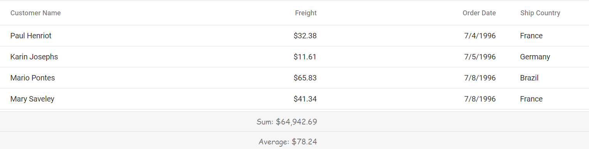
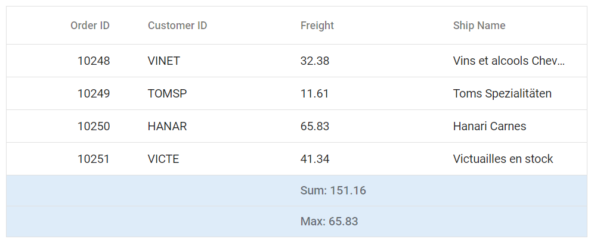

# Aggregate customization in Syncfusion Blazor DataGrid

Aggregates are displayed as summary rows in the DataGrid footer, providing a consolidated view of totals, averages, or counts. These rows enhance data interpretation and can be styled using CSS to align with specific design requirements. Customization is supported for both the footer container and individual summary cells, allowing control over layout and visual presentation. Refer to the API documentation for configuration details:

- [GridAggregates](https://help.syncfusion.com/cr/blazor/Syncfusion.Blazor.Grids.GridAggregates.html)
- [GridAggregateColumn](https://help.syncfusion.com/cr/blazor/Syncfusion.Blazor.Grids.GridAggregateColumn.html)
- [AggregateType](https://help.syncfusion.com/cr/blazor/Syncfusion.Blazor.Grids.AggregateType.html)
- [FooterTemplate](https://help.syncfusion.com/cr/blazor/Syncfusion.Blazor.Grids.GridAggregateColumn.html#Syncfusion_Blazor_Grids_GridAggregateColumn_FooterTemplate)
- [AggregateTemplateContext](https://help.syncfusion.com/cr/blazor/Syncfusion.Blazor.Grids.AggregateTemplateContext.html)

N> - To show summary rows in the DataGrid footer, [GridAggregates](https://help.syncfusion.com/cr/blazor/Syncfusion.Blazor.Grids.GridAggregates.html) must be set up. The correct theme stylesheet should be included to apply styles properly. 
- When using CSS isolation (.razor.css), use the **::deep** selector to reach internal parts of the DataGrid, or place the grid inside a custom wrapper class and apply styles to that wrapper for better control. 
- Class names may change slightly depending on the theme or version, so check the DOM to confirm. 
- Maintain strong color contrast for accessibility compliance.

## Customizing the aggregate root element

The **e-gridfooter** class is used to style the main container of the aggregate footer row in the DataGrid. To change its appearance, apply CSS like below:

```css
.e-grid .e-gridfooter {
    font-family: cursive;
}
```

Properties such as font-family, font-size, padding, and border can be modified to match the desired design.



## Customizing the aggregate cell elements

The **e-summaryrow** class targets the summary row, and **e-summarycell** targets individual cells within that row. To customize the appearance of the summary row cells, apply CSS such as:

```css
.e-grid .e-summaryrow .e-summarycell {
    background-color: #deecf9;
}
```

properties such as background-color, color, text-align, or borders can be modified to match the desired design.






@using Syncfusion.Blazor.Grids

<SfGrid @ref="Grid" DataSource="@Orders" Height="315" AllowPaging="true">
    <GridPageSettings PageSize="8"></GridPageSettings>
    <GridAggregates>
        <GridAggregate>
            <GridAggregateColumns>
                <GridAggregateColumn Field=@nameof(OrderData.Freight) Type="AggregateType.Sum" >
                    <FooterTemplate>
                        @{
                            var aggregate = (context as AggregateTemplateContext);
                            <div>
                                <p>Sum: @aggregate.Sum</p>
                            </div>
                        }
                    </FooterTemplate>
                </GridAggregateColumn>
            </GridAggregateColumns>
        </GridAggregate>
        <GridAggregate>
            <GridAggregateColumns>
                <GridAggregateColumn Field=@nameof(OrderData.Freight) Type="AggregateType.Max">
                    <FooterTemplate>
                        @{
                            var aggregate = (context as AggregateTemplateContext);
                            <div>
                                <p>Max: @aggregate.Max</p>
                            </div>
                        }
                    </FooterTemplate>
                </GridAggregateColumn>
            </GridAggregateColumns>
        </GridAggregate>
    </GridAggregates>
    <GridColumns>
        <GridColumn Field=@nameof(OrderData.OrderID) HeaderText="Order ID" TextAlign="Syncfusion.Blazor.Grids.TextAlign.Right" Width="140"></GridColumn>
        <GridColumn Field=@nameof(OrderData.CustomerID) HeaderText="Customer ID" Width="120"></GridColumn>
        <GridColumn Field=@nameof(OrderData.Freight) HeaderText="Freight" TextAlign="Syncfusion.Blazor.Grids.TextAlign.Right" Width="120"></GridColumn>
        <GridColumn Field=@nameof(OrderData.OrderDate) HeaderText="Order Date" Format="d" Width="100" TextAlign="Syncfusion.Blazor.Grids.TextAlign.Right"></GridColumn>
    </GridColumns>
</SfGrid>

<style>
    .e-grid .e-gridfooter {
        font-family: cursive;
    }
    .e-grid .e-summaryrow .e-summarycell {
        background-color: #deecf9;
    }
</style>

@code {
    private SfGrid<OrderData> Grid;
    public List<OrderData> Orders { get; set; }

    protected override void OnInitialized()
    {
        Orders = OrderData.GetAllRecords();
    }
}





public class OrderData
{
    public static List<OrderData> Orders = new List<OrderData>();

    public OrderData(int orderID, string customerID, double freight, DateTime orderDate)
    {
        this.OrderID = orderID;
        this.CustomerID = customerID;
        this.Freight = freight;
        this.OrderDate = orderDate;
    }

    public static List<OrderData> GetAllRecords()
    {
        if (Orders.Count == 0)
        {
            Orders.Add(new OrderData(10248, "VINET", 32.38, new DateTime(2024, 1, 10)));
            Orders.Add(new OrderData(10249, "TOMSP", 11.61, new DateTime(2024, 1, 11)));
            Orders.Add(new OrderData(10250, "HANAR", 65.83, new DateTime(2024, 1, 12)));
            Orders.Add(new OrderData(10251, "VICTE", 41.34, new DateTime(2024, 1, 13)));
            Orders.Add(new OrderData(10252, "SUPRD", 51.3, new DateTime(2024, 1, 14)));
            Orders.Add(new OrderData(10253, "HANAR", 58.17, new DateTime(2024, 1, 15)));
            Orders.Add(new OrderData(10254, "CHOPS", 22.98, new DateTime(2024, 1, 16)));
            Orders.Add(new OrderData(10255, "RICSU", 148.33, new DateTime(2024, 1, 17)));
            Orders.Add(new OrderData(10256, "WELLI", 13.97, new DateTime(2024, 1, 18)));
            Orders.Add(new OrderData(10257, "HILAA", 81.91, new DateTime(2024, 1, 19)));
        }

        return Orders;
    }

    public int OrderID { get; set; }
    public string CustomerID { get; set; }
    public double Freight { get; set; }
    public DateTime OrderDate { get; set; }
}




