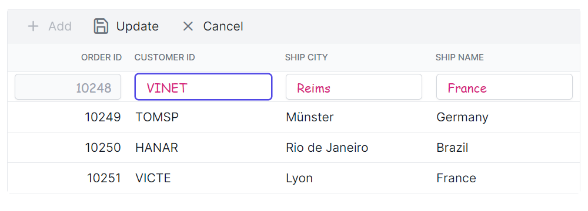
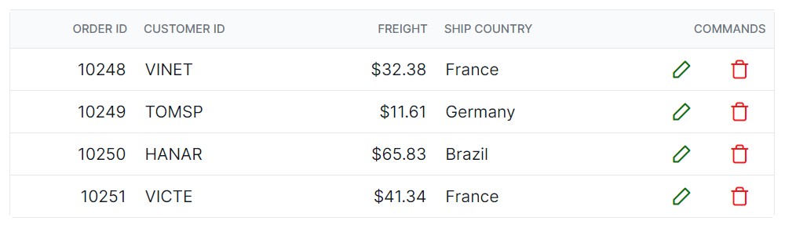
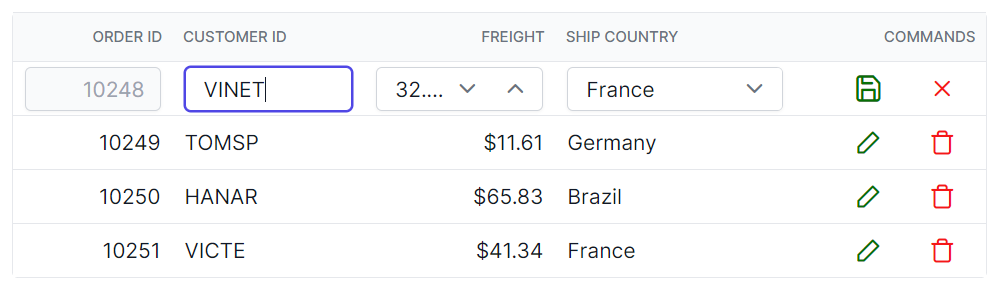

# Editing customization in Syncfusion Blazor DataGrid

The appearance of editing-related elements in the Syncfusion Blazor DataGrid can be customized with CSS. The following examples demonstrate how to style edited and added rows, input fields within the edit form, the edit dialog header, and command column buttons.

> Notes:
- Enable editing using GridEditSettings and, if needed, Toolbar items for CRUD actions.
- Dialog header customization applies when EditMode is set to Dialog.
- Icon colors for command buttons depend on the theme’s icon font; verify classes and glyphs in the DOM for the current version/theme.
- Global selectors target all grids. To limit scope, wrap the grid in a custom container and prefix selectors, or use CSS isolation with the ::deep combinator.
- Maintain sufficient color contrast and visible focus indicators for accessibility.

## Customizing the edited and added row element

To style the edited and added row table elements in the grid, use the following CSS:

```css
.e-grid .e-editedrow table, .e-grid .e-addedrow table {
	    background-color: #62b2eb;
}
```
In this example, the `.e-editedrow` class targets the edited row and the `.e-addedrow` class targets the added row. Modify `background-color` to change the fill color for these row table elements.


## Customizing the edited row input element

To style input elements within the edited row form, use the following CSS:

```css

.e-grid .e-gridform .e-rowcell .e-input-group .e-input {
    font-family: cursive;
    color:rgb(214, 33, 123)
}

```
Here, `.e-gridform` represents the editing form and `.e-input` targets input elements within the form. Modify `font-family` to change the font and color to adjust the input text color.






@using Syncfusion.Blazor.Grids

<SfGrid @ref="Grid" DataSource="@Orders" Height="315" Toolbar="@(new List<string>() { "Add", "Edit", "Delete", "Cancel", "Update" })" AllowPaging="true">
    <GridPageSettings PageSize="8"></GridPageSettings>
    <GridEditSettings AllowAdding="true" AllowEditing="true" AllowDeleting="true"></GridEditSettings>
    <GridColumns>
        <GridColumn Field=@nameof(OrderData.OrderID) IsPrimaryKey="true" HeaderText="Order ID" TextAlign="Syncfusion.Blazor.Grids.TextAlign.Right" Width="140"></GridColumn>
        <GridColumn Field=@nameof(OrderData.CustomerID) HeaderText="Customer ID" Width="120"></GridColumn>
        <GridColumn Field=@nameof(OrderData.ShipCity) HeaderText="Ship City" Width="100"></GridColumn>
        <GridColumn Field=@nameof(OrderData.ShipName) HeaderText="Ship Name" Width="100"></GridColumn>
    </GridColumns>
</SfGrid>

<style>
.e-grid .e-editedrow table, .e-grid .e-addedrow table {
	background-color: #62b2eb;
}
.e-grid .e-gridform .e-rowcell .e-input-group .e-input {
    font-family: cursive;
    color:rgb(214, 33, 123)
}
</style>

@code {
    private SfGrid<OrderData> Grid;
    public List<OrderData> Orders { get; set; }

    protected override void OnInitialized()
    {
        Orders = OrderData.GetAllRecords();
    }
}





public class OrderData
{
    public static List<OrderData> Orders = new List<OrderData>();

    public OrderData(int orderID, string customerID, string shipCity, string shipName)
    {
        this.OrderID = orderID;
        this.CustomerID = customerID;
        this.ShipCity = shipCity;
        this.ShipName = shipName;
    }

    public static List<OrderData> GetAllRecords()
    {
        if (Orders.Count == 0)
        {
            Orders.Add(new OrderData(10248, "VINET", "Reims", "Vins et alcools Chevalier"));
            Orders.Add(new OrderData(10249, "TOMSP", "Münster", "Toms Spezialitäten"));
            Orders.Add(new OrderData(10250, "HANAR", "Rio de Janeiro", "Hanari Carnes"));
            Orders.Add(new OrderData(10251, "VICTE", "Lyon", "Victuailles en stock"));
            Orders.Add(new OrderData(10252, "SUPRD", "Charleroi", "Suprêmes délices"));
            Orders.Add(new OrderData(10253, "HANAR", "Rio de Janeiro", "Hanari Carnes"));
            Orders.Add(new OrderData(10254, "CHOPS", "Bern", "Chop-suey Chinese"));
            Orders.Add(new OrderData(10255, "RICSU", "Genève", "Richter Supermarkt"));
            Orders.Add(new OrderData(10256, "WELLI", "Resende", "Wellington Import Export"));
            Orders.Add(new OrderData(10257, "HILAA", "San Cristóbal", "Hila Alimentos"));
            Orders.Add(new OrderData(10258, "ERNSH", "Graz", "Ernst Handel"));
            Orders.Add(new OrderData(10259, "CENTC", "México D.F.", "Centro comercial"));
            Orders.Add(new OrderData(10260, "OTTIK", "Köln", "Ottilies Käseladen"));
            Orders.Add(new OrderData(10261, "QUEDE", "Rio de Janeiro", "Que delícia"));
            Orders.Add(new OrderData(10262, "RATTC", "Albuquerque", "Rattlesnake Canyon Grocery"));
        }

        return Orders;
    }

    public int OrderID { get; set; }
    public string CustomerID { get; set; }
    public string ShipCity { get; set; }
    public string ShipName { get; set; }
}






## Customizing the edit dialog header element

To style the edit dialog header when using dialog editing, use the following CSS:

```css

.e-edit-dialog .e-dlg-header-content {
    background-color: #deecf9;
}

```
In this example, `.e-edit-dialog` represents the edit dialog and `.e-dlg-header-content` targets the header content within the dialog. Modify `background-color` to change the header’s fill color.





@using Syncfusion.Blazor.Grids

<SfGrid @ref="Grid" DataSource="@Orders" Height="315" Toolbar="@(new List<string>() { "Add", "Edit", "Delete", "Cancel", "Update" })" AllowPaging="true">
    <GridPageSettings PageSize="8"></GridPageSettings>
    <GridEditSettings AllowAdding="true" AllowEditing="true" AllowDeleting="true" Mode="Syncfusion.Blazor.Grids.EditMode.Dialog"></GridEditSettings>
    <GridColumns>
        <GridColumn Field=@nameof(OrderData.OrderID) IsPrimaryKey="true" HeaderText="Order ID" TextAlign="Syncfusion.Blazor.Grids.TextAlign.Right" Width="140"></GridColumn>
        <GridColumn Field=@nameof(OrderData.CustomerID) HeaderText="Customer ID" Width="120"></GridColumn>
        <GridColumn Field=@nameof(OrderData.ShipCity) HeaderText="Ship City" Width="100"></GridColumn>
        <GridColumn Field=@nameof(OrderData.ShipName) HeaderText="Ship Name" Width="100"></GridColumn>
    </GridColumns>
</SfGrid>

<style>
    .e-edit-dialog .e-dlg-header-content {
        background-color: #deecf9;
    }
</style>

@code {
    private SfGrid<OrderData> Grid;
    public List<OrderData> Orders { get; set; }

    protected override void OnInitialized()
    {
        Orders = OrderData.GetAllRecords();
    }
}





public class OrderData
{
    public static List<OrderData> Orders = new List<OrderData>();

    public OrderData(int orderID, string customerID, string shipCity, string shipName)
    {
        this.OrderID = orderID;
        this.CustomerID = customerID;
        this.ShipCity = shipCity;
        this.ShipName = shipName;
    }

    public static List<OrderData> GetAllRecords()
    {
        if (Orders.Count == 0)
        {
            Orders.Add(new OrderData(10248, "VINET", "Reims", "Vins et alcools Chevalier"));
            Orders.Add(new OrderData(10249, "TOMSP", "Münster", "Toms Spezialitäten"));
            Orders.Add(new OrderData(10250, "HANAR", "Rio de Janeiro", "Hanari Carnes"));
            Orders.Add(new OrderData(10251, "VICTE", "Lyon", "Victuailles en stock"));
            Orders.Add(new OrderData(10252, "SUPRD", "Charleroi", "Suprêmes délices"));
            Orders.Add(new OrderData(10253, "HANAR", "Rio de Janeiro", "Hanari Carnes"));
            Orders.Add(new OrderData(10254, "CHOPS", "Bern", "Chop-suey Chinese"));
            Orders.Add(new OrderData(10255, "RICSU", "Genève", "Richter Supermarkt"));
            Orders.Add(new OrderData(10256, "WELLI", "Resende", "Wellington Import Export"));
            Orders.Add(new OrderData(10257, "HILAA", "San Cristóbal", "Hila Alimentos"));
            Orders.Add(new OrderData(10258, "ERNSH", "Graz", "Ernst Handel"));
            Orders.Add(new OrderData(10259, "CENTC", "México D.F.", "Centro comercial"));
            Orders.Add(new OrderData(10260, "OTTIK", "Köln", "Ottilies Käseladen"));
            Orders.Add(new OrderData(10261, "QUEDE", "Rio de Janeiro", "Que delícia"));
            Orders.Add(new OrderData(10262, "RATTC", "Albuquerque", "Rattlesnake Canyon Grocery"));
        }

        return Orders;
    }

    public int OrderID { get; set; }
    public string CustomerID { get; set; }
    public string ShipCity { get; set; }
    public string ShipName { get; set; }
}






## Customizing the command column buttons

To style command column buttons (edit, delete, update, cancel), use the following CSS:

```css

.e-grid .e-delete::before ,.e-grid .e-cancel-icon::before{
    color: #f51717;
}
.e-grid .e-edit::before, .e-grid .e-update::before {
    color: #077005;
}

```
In this example, the .e-edit, .e-delete, .e-update, and .e-cancel-icon classes represent the respective command column buttons. Modify the color property to change the color of these buttons.







@using Syncfusion.Blazor.Grids

<SfGrid @ref="Grid" DataSource="@Orders" Height="315" AllowPaging="true">
    <GridPageSettings PageSize="8"></GridPageSettings>
    <GridEditSettings AllowAdding="true" AllowEditing="true" AllowDeleting="true"></GridEditSettings>
    <GridColumns>
        <GridColumn Field=@nameof(OrderData.OrderID) HeaderText="Order ID" IsPrimaryKey="true" TextAlign="Syncfusion.Blazor.Grids.TextAlign.Right" Width="140"></GridColumn>
        <GridColumn Field=@nameof(OrderData.CustomerID) HeaderText="Customer ID" Width="120"></GridColumn>
        <GridColumn Field=@nameof(OrderData.Freight) HeaderText="Freight" TextAlign="Syncfusion.Blazor.Grids.TextAlign.Right" Width="120"></GridColumn>
        <GridColumn Field=@nameof(OrderData.ShipCountry) HeaderText="Ship Country" Width="100"></GridColumn>
        <GridColumn HeaderText="Manage Records" Width="150">
            <GridCommandColumns>
                <GridCommandColumn Type="CommandButtonType.Edit" ButtonOption="@(new CommandButtonOptions() { IconCss = "e-icons e-edit", CssClass = "e-flat" })"></GridCommandColumn>
                <GridCommandColumn Type="CommandButtonType.Delete" ButtonOption="@(new CommandButtonOptions() { IconCss = "e-icons e-delete", CssClass = "e-flat" })"></GridCommandColumn>
                <GridCommandColumn Type="CommandButtonType.Save" ButtonOption="@(new CommandButtonOptions() { IconCss = "e-icons e-update", CssClass = "e-flat" })"></GridCommandColumn>
                <GridCommandColumn Type="CommandButtonType.Cancel" ButtonOption="@(new CommandButtonOptions() { IconCss = "e-icons e-cancel-icon", CssClass = "e-flat" })"></GridCommandColumn>
            </GridCommandColumns>
         </GridColumn>
    </GridColumns>
</SfGrid>

<style>
    .e-grid .e-delete::before ,.e-grid .e-cancel-icon::before{
        color: #f51717;
    }
    .e-grid .e-edit::before, .e-grid .e-update::before {
        color: #077005;
    }
</style>

@code {
    private SfGrid<OrderData> Grid;
    public List<OrderData> Orders { get; set; }

    protected override void OnInitialized()
    {
        Orders = OrderData.GetAllRecords();
    }
}





public class OrderData
{
    public static List<OrderData> Orders = new List<OrderData>();

    public OrderData(int orderID, string customerID, double freight, string shipCountry)
    {
        OrderID = orderID;
        CustomerID = customerID;
        Freight = freight;
        ShipCountry = shipCountry;
    }

    public static List<OrderData> GetAllRecords()
    {
        if (Orders.Count == 0)
        {
            Orders.Add(new OrderData(10248, "VINET", 32.38, "France"));
            Orders.Add(new OrderData(10249, "TOMSP", 11.61, "Germany"));
            Orders.Add(new OrderData(10250, "HANAR", 65.83, "Brazil"));
            Orders.Add(new OrderData(10251, "VICTE", 41.34, "France"));
            Orders.Add(new OrderData(10252, "SUPRD", 51.30, "Belgium"));
            Orders.Add(new OrderData(10253, "HANAR", 58.17, "Brazil"));
            Orders.Add(new OrderData(10254, "CHOPS", 22.98, "Switzerland"));
            Orders.Add(new OrderData(10255, "RICSU", 148.33, "Switzerland"));
            Orders.Add(new OrderData(10256, "WELLI", 13.97, "Brazil"));
            Orders.Add(new OrderData(10257, "HILAA", 81.91, "Venezuela"));
            Orders.Add(new OrderData(10258, "ERNSH", 140.51, "Austria"));
            Orders.Add(new OrderData(10259, "CENTC", 3.25, "Mexico"));
            Orders.Add(new OrderData(10260, "OTTIK", 55.09, "Germany"));
            Orders.Add(new OrderData(10261, "QUEDE", 3.05, "Brazil"));
            Orders.Add(new OrderData(10262, "RATTC", 48.29, "USA"));
        }

        return Orders;
    }

    public int OrderID { get; set; }
    public string CustomerID { get; set; }
    public double Freight { get; set; }
    public string ShipCountry { get; set; }
}




