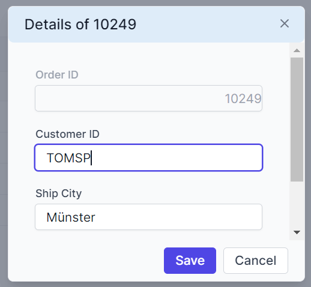

# Editing customization in Syncfusion Blazor DataGrid

The appearance of editing elements in the Syncfusion<sup style="font-size:70%">&reg;</sup> Blazor DataGrid can be customized using CSS. Styling options are available for different parts of the editing interface:

- **Edited and newly added rows:** Highlights rows that are being modified or newly inserted.
- **Edit form input fields:** Displays text boxes used to enter or update values during editing.
- **Edit dialog header:** Shows the title or context of the current editing operation.
- **Command column buttons:** Displays action buttons such as Edit, Delete, Update, and Cancel.

## Customize edited and added row elements

The **.e-editedrow** and **.e-addedrow** classes style edited and newly added rows. Apply CSS to make these rows stand out:

```css
.e-grid .e-editedrow table, .e-grid .e-addedrow table {
	    background-color: #62b2eb;
}
```

Adjust properties such as **background-color** or **border** styles to highlight rows that are in edit mode.

 


## Customize edited row input elements

The **.e-gridform** and **.e-input** classes style inputs inside the inline edit form in the Blazor DataGrid. Use CSS to adjust their appearance:

```css

.e-grid .e-gridform .e-rowcell .e-input-group .e-input {
    font-family: cursive;
    color:rgb(214, 33, 123)
}

```

Modify properties such as **font-family**, **color**, or **padding** to improve readability.





@using Syncfusion.Blazor.Grids

<SfGrid DataSource="@Orders" Height="315" AllowPaging="true" Toolbar="ToolbarItems">
    <GridPageSettings PageSize="8"></GridPageSettings>
    <GridEditSettings AllowAdding="true" AllowEditing="true" AllowDeleting="true"></GridEditSettings>
    <GridColumns>
        <GridColumn Field=@nameof(OrderData.OrderID) HeaderText="Order ID" IsPrimaryKey="true" TextAlign="TextAlign.Right" Width="140"></GridColumn>
        <GridColumn Field=@nameof(OrderData.CustomerID) HeaderText="Customer ID" Width="120"></GridColumn>
        <GridColumn Field=@nameof(OrderData.ShipCity) HeaderText="Ship City" Width="110"></GridColumn>
        <GridColumn Field=@nameof(OrderData.ShipName) HeaderText="Ship Name" Width="150"></GridColumn>
    </GridColumns>
</SfGrid>

<style>
    .e-grid .e-editedrow table,
    .e-grid .e-addedrow table { background-color: #62b2eb; }
    .e-grid .e-gridform .e-rowcell .e-input-group .e-input { font-family: cursive; color: rgb(214,33,123); }
    .e-grid .e-gridform .e-rowcell:focus-visible { outline: 2px solid #005a9e; outline-offset: -2px; }
</style>

@code {
    private List<OrderData> Orders { get; set; }
    private readonly List<string> ToolbarItems = new() { "Add", "Edit", "Delete", "Update", "Cancel" };
    protected override void OnInitialized()
    {
        Orders = OrderData.GetAllRecords();
    }
}





internal sealed class OrderData
{
    private static readonly List<OrderData> Data = new();

    public OrderData(int orderID, string customerID, string shipCity, string shipName, double freight, string shipCountry)
    {
        OrderID = orderID;
        CustomerID = customerID;
        ShipCity = shipCity;
        ShipName = shipName;
        Freight = freight;
        ShipCountry = shipCountry;
    }

    internal static List<OrderData> GetAllRecords()
    {
        if (Data.Count == 0)
        {
            Data.Add(new OrderData(10248, "VINET", "Reims", "Vins et alcools Chevalier", 32.38, "France"));
            Data.Add(new OrderData(10249, "TOMSP", "Münster", "Toms Spezialitäten", 11.61, "Germany"));
            Data.Add(new OrderData(10250, "HANAR", "Rio de Janeiro", "Hanari Carnes", 65.83, "Brazil"));
            Data.Add(new OrderData(10251, "VICTE", "Lyon", "Victuailles en stock", 41.34, "France"));
            Data.Add(new OrderData(10252, "SUPRD", "Charleroi", "Suprêmes délices", 51.30, "Belgium"));
            Data.Add(new OrderData(10253, "HANAR", "Rio de Janeiro", "Hanari Carnes", 58.17, "Brazil"));
            Data.Add(new OrderData(10254, "CHOPS", "Bern", "Chop-suey Chinese", 22.98, "Switzerland"));
            Data.Add(new OrderData(10255, "RICSU", "Genève", "Richter Supermarkt", 148.33, "Switzerland"));
            Data.Add(new OrderData(10256, "WELLI", "Resende", "Wellington Import Export", 13.97, "Brazil"));
            Data.Add(new OrderData(10257, "HILAA", "San Cristóbal", "Hila Alimentos", 81.91, "Venezuela"));
            Data.Add(new OrderData(10258, "ERNSH", "Graz", "Ernst Handel", 140.51, "Austria"));
            Data.Add(new OrderData(10259, "CENTC", "México D.F.", "Centro comercial", 3.25, "Mexico"));
            Data.Add(new OrderData(10260, "OTTIK", "Köln", "Ottilies Käseladen", 55.09, "Germany"));
            Data.Add(new OrderData(10261, "QUEDE", "Rio de Janeiro", "Que delícia", 3.05, "Brazil"));
            Data.Add(new OrderData(10262, "RATTC", "Albuquerque", "Rattlesnake Canyon Grocery", 48.29, "USA"));
        }
        return Data;
    }

    public int OrderID { get; }
    public string CustomerID { get; }
    public string ShipCity { get; }
    public string ShipName { get; }
    public double Freight { get; }
    public string ShipCountry { get; }
}






## Customize the edit dialog header

The **.e-edit-dialog** and **.e-dlg-header-content** classes style the dialog header when dialog editing is enabled. Apply CSS to differentiate the header:

```css

.e-edit-dialog .e-dlg-header-content {
    background-color: #deecf9;
}

```

Change properties such as **background-color** to visually separate the header from the rest of the dialog content.






@using Syncfusion.Blazor.Grids
<SfGrid DataSource="@Orders" Height="315" AllowPaging="true" Toolbar="ToolbarItems">
    <GridPageSettings PageSize="8"></GridPageSettings>
    <GridEditSettings AllowAdding="true" AllowEditing="true" AllowDeleting="true" Mode="EditMode.Dialog"></GridEditSettings>
    <GridColumns>
        <GridColumn Field=@nameof(OrderData.OrderID) HeaderText="Order ID" IsPrimaryKey="true" TextAlign="TextAlign.Right" Width="140"></GridColumn>
        <GridColumn Field=@nameof(OrderData.CustomerID) HeaderText="Customer ID" Width="120"></GridColumn>
        <GridColumn Field=@nameof(OrderData.ShipCity) HeaderText="Ship City" Width="110"></GridColumn>
        <GridColumn Field=@nameof(OrderData.ShipName) HeaderText="Ship Name" Width="150"></GridColumn>
    </GridColumns>
</SfGrid>

<style>
    .e-edit-dialog .e-dlg-header-content { background-color: #deecf9; color: #0b345d; }
    .e-edit-dialog .e-dlg-header-content .e-btn.e-dlg-closeicon-btn:focus-visible { outline: 2px solid #005a9e; outline-offset: 2px; }
</style>

@code {
    private List<OrderData> Orders { get; set; }
    private readonly List<string> ToolbarItems = new() { "Add", "Edit", "Delete", "Update", "Cancel" };

    protected override void OnInitialized()
    {
        Orders = OrderData.GetAllRecords();
    }
}





internal sealed class OrderData
{
    private static readonly List<OrderData> Data = new();

    public OrderData(int orderID, string customerID, string shipCity, string shipName, double freight, string shipCountry)
    {
        OrderID = orderID;
        CustomerID = customerID;
        ShipCity = shipCity;
        ShipName = shipName;
        Freight = freight;
        ShipCountry = shipCountry;
    }

    internal static List<OrderData> GetAllRecords()
    {
        if (Data.Count == 0)
        {
            Data.Add(new OrderData(10248, "VINET", "Reims", "Vins et alcools Chevalier", 32.38, "France"));
            Data.Add(new OrderData(10249, "TOMSP", "Münster", "Toms Spezialitäten", 11.61, "Germany"));
            Data.Add(new OrderData(10250, "HANAR", "Rio de Janeiro", "Hanari Carnes", 65.83, "Brazil"));
            Data.Add(new OrderData(10251, "VICTE", "Lyon", "Victuailles en stock", 41.34, "France"));
            Data.Add(new OrderData(10252, "SUPRD", "Charleroi", "Suprêmes délices", 51.30, "Belgium"));
            Data.Add(new OrderData(10253, "HANAR", "Rio de Janeiro", "Hanari Carnes", 58.17, "Brazil"));
            Data.Add(new OrderData(10254, "CHOPS", "Bern", "Chop-suey Chinese", 22.98, "Switzerland"));
            Data.Add(new OrderData(10255, "RICSU", "Genève", "Richter Supermarkt", 148.33, "Switzerland"));
            Data.Add(new OrderData(10256, "WELLI", "Resende", "Wellington Import Export", 13.97, "Brazil"));
            Data.Add(new OrderData(10257, "HILAA", "San Cristóbal", "Hila Alimentos", 81.91, "Venezuela"));
            Data.Add(new OrderData(10258, "ERNSH", "Graz", "Ernst Handel", 140.51, "Austria"));
            Data.Add(new OrderData(10259, "CENTC", "México D.F.", "Centro comercial", 3.25, "Mexico"));
            Data.Add(new OrderData(10260, "OTTIK", "Köln", "Ottilies Käseladen", 55.09, "Germany"));
            Data.Add(new OrderData(10261, "QUEDE", "Rio de Janeiro", "Que delícia", 3.05, "Brazil"));
            Data.Add(new OrderData(10262, "RATTC", "Albuquerque", "Rattlesnake Canyon Grocery", 48.29, "USA"));
        }
        return Data;
    }

    public int OrderID { get; }
    public string CustomerID { get; }
    public string ShipCity { get; }
    public string ShipName { get; }
    public double Freight { get; }
    public string ShipCountry { get; }
}






## Customize command column buttons

The **.e-edit**, **.e-delete**, **.e-update**, and **.e-cancel-icon** classes style the command column buttons in the Blazor DataGrid. Use CSS to adjust their appearance:

```css

.e-grid .e-delete::before ,.e-grid .e-cancel-icon::before{
    color: #f51717;
}
.e-grid .e-edit::before, .e-grid .e-update::before {
    color: #077005;
}

```

Style properties like **color**, **font-size**, and **font-weight** can be adjusted to differentiate action icons and enhance visibility during interaction.





@using Syncfusion.Blazor.Grids

<SfGrid DataSource="@Orders" Height="315" AllowPaging="true">
    <GridPageSettings PageSize="8"></GridPageSettings>
    <GridEditSettings AllowAdding="true" AllowEditing="true" AllowDeleting="true"></GridEditSettings>
    <GridColumns>
        <GridColumn Field=@nameof(OrderData.OrderID) HeaderText="Order ID" IsPrimaryKey="true" TextAlign="TextAlign.Right" Width="140"></GridColumn>
        <GridColumn Field=@nameof(OrderData.CustomerID) HeaderText="Customer ID" Width="120"></GridColumn>
        <GridColumn Field=@nameof(OrderData.Freight) HeaderText="Freight" TextAlign="TextAlign.Right" Width="120"></GridColumn>
        <GridColumn Field=@nameof(OrderData.ShipCountry) HeaderText="Ship Country" Width="130"></GridColumn>
        <GridColumn HeaderText="Manage Records" Width="160">
            <GridCommandColumns>
                <GridCommandColumn Type="CommandButtonType.Edit" ButtonOption="@(new CommandButtonOptions { IconCss = "e-icons e-edit", CssClass = "e-flat" })"></GridCommandColumn>
                <GridCommandColumn Type="CommandButtonType.Delete" ButtonOption="@(new CommandButtonOptions { IconCss = "e-icons e-delete", CssClass = "e-flat" })"></GridCommandColumn>
                <GridCommandColumn Type="CommandButtonType.Save" ButtonOption="@(new CommandButtonOptions { IconCss = "e-icons e-update", CssClass = "e-flat" })"></GridCommandColumn>
                <GridCommandColumn Type="CommandButtonType.Cancel" ButtonOption="@(new CommandButtonOptions { IconCss = "e-icons e-cancel-icon", CssClass = "e-flat" })"></GridCommandColumn>
            </GridCommandColumns>
        </GridColumn>
    </GridColumns>
</SfGrid>
<style>
    .e-grid .e-delete::before ,.e-grid .e-cancel-icon::before{
        color: #f51717;
    }
    .e-grid .e-edit::before, .e-grid .e-update::before {
        color: #077005;
    }
</style>
@code {
    private List<OrderData> Orders { get; set; }
    protected override void OnInitialized()
    {
        Orders = OrderData.GetAllRecords();
    }
}





internal sealed class OrderData
{
    private static readonly List<OrderData> Data = new();

    public OrderData(int orderID, string customerID, string shipCity, string shipName, double freight, string shipCountry)
    {
        OrderID = orderID;
        CustomerID = customerID;
        ShipCity = shipCity;
        ShipName = shipName;
        Freight = freight;
        ShipCountry = shipCountry;
    }

    internal static List<OrderData> GetAllRecords()
    {
        if (Data.Count == 0)
        {
            Data.Add(new OrderData(10248, "VINET", "Reims", "Vins et alcools Chevalier", 32.38, "France"));
            Data.Add(new OrderData(10249, "TOMSP", "Münster", "Toms Spezialitäten", 11.61, "Germany"));
            Data.Add(new OrderData(10250, "HANAR", "Rio de Janeiro", "Hanari Carnes", 65.83, "Brazil"));
            Data.Add(new OrderData(10251, "VICTE", "Lyon", "Victuailles en stock", 41.34, "France"));
            Data.Add(new OrderData(10252, "SUPRD", "Charleroi", "Suprêmes délices", 51.30, "Belgium"));
            Data.Add(new OrderData(10253, "HANAR", "Rio de Janeiro", "Hanari Carnes", 58.17, "Brazil"));
            Data.Add(new OrderData(10254, "CHOPS", "Bern", "Chop-suey Chinese", 22.98, "Switzerland"));
            Data.Add(new OrderData(10255, "RICSU", "Genève", "Richter Supermarkt", 148.33, "Switzerland"));
            Data.Add(new OrderData(10256, "WELLI", "Resende", "Wellington Import Export", 13.97, "Brazil"));
            Data.Add(new OrderData(10257, "HILAA", "San Cristóbal", "Hila Alimentos", 81.91, "Venezuela"));
            Data.Add(new OrderData(10258, "ERNSH", "Graz", "Ernst Handel", 140.51, "Austria"));
            Data.Add(new OrderData(10259, "CENTC", "México D.F.", "Centro comercial", 3.25, "Mexico"));
            Data.Add(new OrderData(10260, "OTTIK", "Köln", "Ottilies Käseladen", 55.09, "Germany"));
            Data.Add(new OrderData(10261, "QUEDE", "Rio de Janeiro", "Que delícia", 3.05, "Brazil"));
            Data.Add(new OrderData(10262, "RATTC", "Albuquerque", "Rattlesnake Canyon Grocery", 48.29, "USA"));
        }
        return Data;
    }

    public int OrderID { get; }
    public string CustomerID { get; }
    public string ShipCity { get; }
    public string ShipName { get; }
    public double Freight { get; }
    public string ShipCountry { get; }
}




