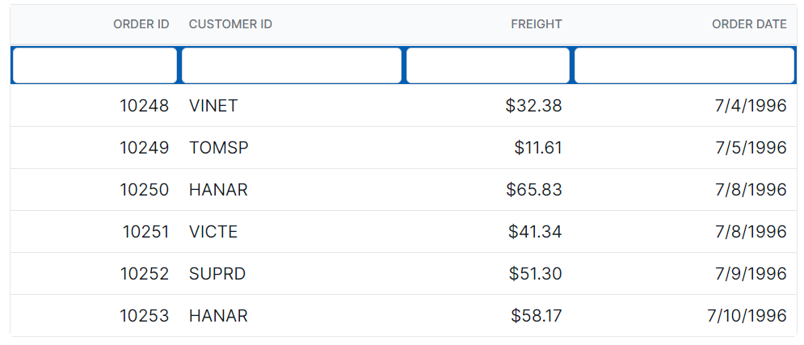
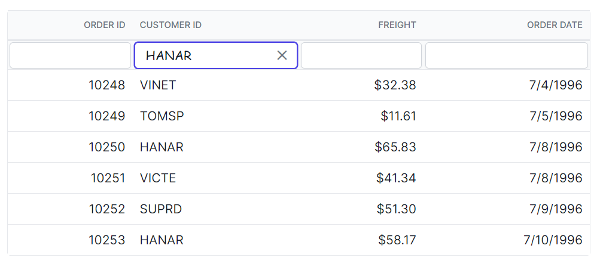
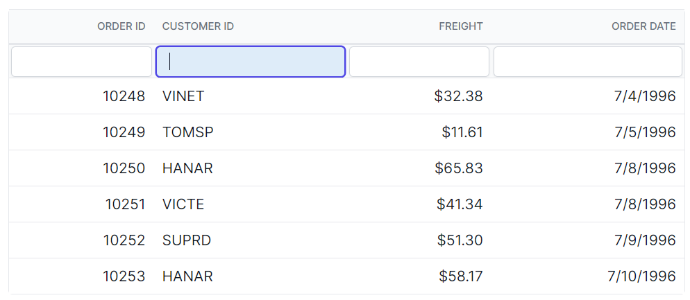
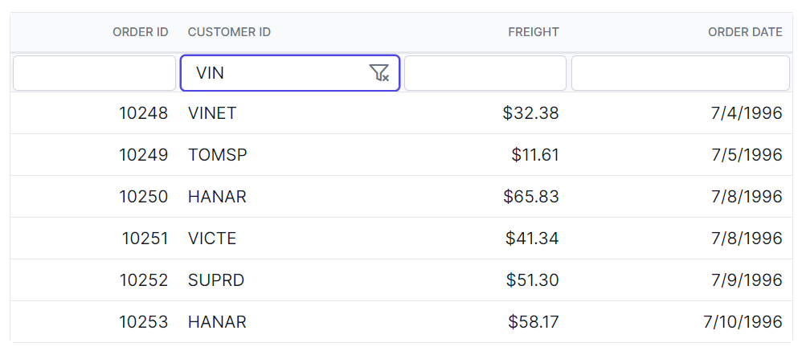
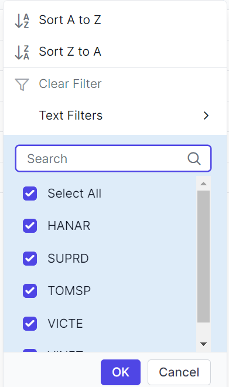
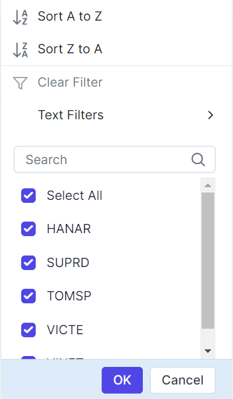
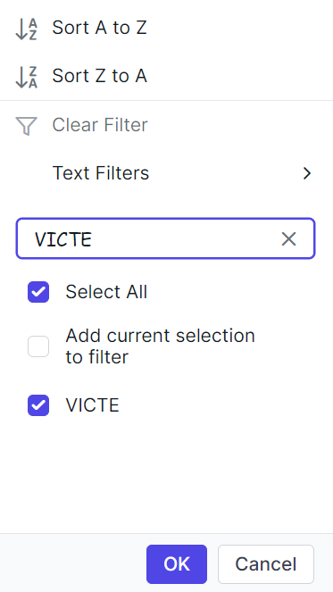
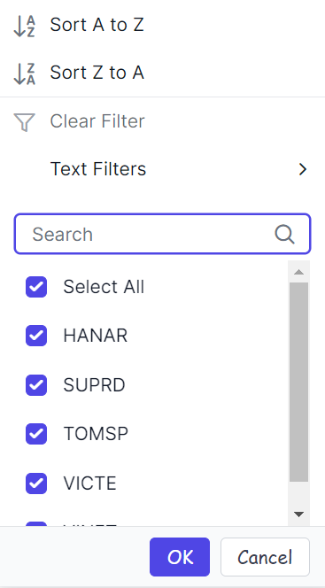
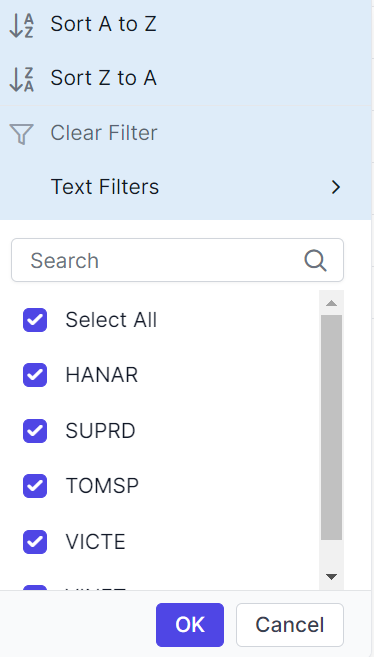

# Filtering in Syncfusion<sup style="font-size:70%">&reg;</sup> Blazor DataGrid

You can customize the appearance of filtering elements in the Syncfusion<sup style="font-size:70%">&reg;</sup> Blazor DataGrid using CSS. Below are examples of how to customize various filtering elements, including filter bar cell elements, filter bar input elements, focus styles, clear icons, filter icons, filter dialog content, filter dialog footer, filter dialog input elements, filter dialog button elements, and Excel filter dialog number filters.

## Customizing the filter bar cell element

To customize the appearance of the filter bar cell element in the Grid header, you can use the following CSS code:

```css

.e-grid .e-filterbarcell {
    background-color: #045fb4;
}

```
In this example, the **.e-filterbarcell** class targets the filter bar cell element in the Grid header. You can modify the `background-color` property to change the color of the filter bar cell element.



## Customizing the filter bar input element

To customize the appearance of the filter bar input element in the Grid header, you can use the following CSS code:

```css

.e-grid .e-filterbarcell .e-input-group input.e-input{
    font-family: cursive;
}

```
In this example, the **.e-filterbarcell** class targets the filter bar cell element, and the **.e-input** class targets the input element within the cell. You can modify the `font-family` property to change the font of the filter bar input element.



## Customizing the filter bar input focus

To customize the appearance of the filter bar input element's focus highlight, you can use the following CSS code:

```css

.e-grid .e-filterbarcell .e-input-group.e-input-focus{
    background-color: #deecf9;
}

```
In this example, the **.e-filterbarcell** class targets the filter bar cell element, and the **.e-input-group.e-input-focus** class targets the focused input element. You can modify the `background-color` property to change the color of the focus highlight.



## Customizing the filter bar input clear icon

To customize the appearance of the filter bar input element's clear icon, you can use the following CSS code:

```css

.e-grid .e-filterbarcell .e-input-group .e-clear-icon::before {
    content: '\e72c';
}

```
In this example, the **.e-clear-icon** class targets the clear icon element within the input group. You can modify the `content` property to change the icon displayed.






@using Syncfusion.Blazor.Grids

<SfGrid @ref="Grid" DataSource="@Orders" Height="315" AllowFiltering="true" AllowPaging="true">
    <GridPageSettings PageSize="8"></GridPageSettings>
    <GridColumns>
        <GridColumn Field=@nameof(OrderData.OrderID) HeaderText="Order ID" TextAlign="Syncfusion.Blazor.Grids.TextAlign.Right" Width="140"></GridColumn>
        <GridColumn Field=@nameof(OrderData.CustomerID) HeaderText="Customer ID" Width="120"></GridColumn>
        <GridColumn Field=@nameof(OrderData.Freight) HeaderText="Freight" TextAlign="Syncfusion.Blazor.Grids.TextAlign.Right" Width="120"></GridColumn>
        <GridColumn Field=@nameof(OrderData.OrderDate) HeaderText="Order Date" Format="d" Width="100" TextAlign="Syncfusion.Blazor.Grids.TextAlign.Right"></GridColumn>
    </GridColumns>
</SfGrid>

<style>
    .e-grid .e-filterbarcell .e-input-group.e-input-focus{
        background-color: #deecf9;
    }
    .e-grid .e-filterbarcell .e-input-group .e-clear-icon::before {
        content: '\e72c';
    }
    .e-grid .e-filterbarcell .e-input-group input.e-input{
        font-family: cursive;
    }
    .e-grid .e-filterbarcell {
        background-color: #045fb4;
    }
</style>

@code {
    private SfGrid<OrderData> Grid;
    public List<OrderData> Orders { get; set; }

    protected override void OnInitialized()
    {
        Orders = OrderData.GetAllRecords();
    }
}





public class OrderData
{
    public static List<OrderData> Orders = new List<OrderData>();

    public OrderData(int orderID, string customerID, double freight, DateTime orderDate)
    {
        this.OrderID = orderID;
        this.CustomerID = customerID;
        this.Freight = freight;
        this.OrderDate = orderDate;
    }

    public static List<OrderData> GetAllRecords()
    {
        if (Orders.Count == 0)
        {
            Orders.Add(new OrderData(10248, "VINET", 32.38, new DateTime(2024, 1, 10)));
            Orders.Add(new OrderData(10249, "TOMSP", 11.61, new DateTime(2024, 1, 11)));
            Orders.Add(new OrderData(10250, "HANAR", 65.83, new DateTime(2024, 1, 12)));
            Orders.Add(new OrderData(10251, "VICTE", 41.34, new DateTime(2024, 1, 13)));
            Orders.Add(new OrderData(10252, "SUPRD", 51.3, new DateTime(2024, 1, 14)));
            Orders.Add(new OrderData(10253, "HANAR", 58.17, new DateTime(2024, 1, 15)));
            Orders.Add(new OrderData(10254, "CHOPS", 22.98, new DateTime(2024, 1, 16)));
            Orders.Add(new OrderData(10255, "RICSU", 148.33, new DateTime(2024, 1, 17)));
            Orders.Add(new OrderData(10256, "WELLI", 13.97, new DateTime(2024, 1, 18)));
            Orders.Add(new OrderData(10257, "HILAA", 81.91, new DateTime(2024, 1, 19)));
        }

        return Orders;
    }

    public int OrderID { get; set; }
    public string CustomerID { get; set; }
    public double Freight { get; set; }
    public DateTime OrderDate { get; set; }
}






## Customizing the Blazor DataGrid filtering icon

To customize the appearance of the Grid's filtering icon in the Grid header, you can use the following CSS code:

```css

.e-grid .e-icon-filter::before{
    content: '\e81e';
}

```
In this example, the **.e-icon-filter** class targets the filtering icon element. You can modify the `content` property to change the icon displayed.


## Customizing the filter dialog content

To customize the appearance of the filter dialog's content element, you can use the following CSS code:

```css

.e-grid .e-filter-popup .e-dlg-content {
    background-color: #deecf9;
}

```
In this example, the **.e-filter-popup .e-dlg-content** classes target the content element within the filter dialog. You can modify the `background-color` property to change the color of the dialog's content.



## Customizing the filter dialog footer

To customize the appearance of the filter dialog's footer element, you can use the following CSS code:

```css

.e-grid .e-filter-popup .e-footer-content {
    background-color: #deecf9;
}

```
In this example, the **.e-filter-popup .e-footer-content** classes target the footer element within the filter dialog. You can modify the `background-color` property to change the color of the dialog's footer.



## Customizing the filter dialog input element

To customize the appearance of the filter dialog's input elements, you can use the following CSS code:

```css

.e-grid .e-filter-popup .e-input-group input.e-input{
    font-family: cursive;
}

```
In this example, the **.e-filter-popup** class targets the filter dialog, and the **.e-input** class targets the input elements within the dialog. You can modify the `font-family` property to change the font of the input elements.



## Customizing the filter dialog button element

To customize the appearance of the filter dialog's button elements, you can use the following CSS code:

```css

.e-grid .e-filter-popup .e-btn{
    font-family: cursive;
}

```
In this example, the **.e-filter-popup** class targets the filter dialog, and the **.e-btn** class targets the button elements within the dialog. You can modify the `font-family` property to change the font of the button elements.



## Customizing the excel filter dialog number filters element

To customize the appearance of the excel filter dialog's number filters, you can use the following CSS code:

```css

.e-grid .e-filter-popup .e-contextmenu-container ul{
    background-color: #deecf9;
}

```
In this example, the **.e-filter-popup .e-contextmenu-container** ul classes target the number filter elements within the excel filter dialog. You can modify the `background-color` property to change the color of these elements.






@using Syncfusion.Blazor.Grids

<SfGrid @ref="Grid" DataSource="@Orders" Height="315" AllowFiltering="true" AllowPaging="true">
    <GridPageSettings PageSize="8"></GridPageSettings>
    <GridFilterSettings Type="Syncfusion.Blazor.Grids.FilterType.Menu"></GridFilterSettings>
    <GridColumns>
        <GridColumn Field=@nameof(OrderData.OrderID) HeaderText="Order ID" TextAlign="Syncfusion.Blazor.Grids.TextAlign.Right" Width="140"></GridColumn>
        <GridColumn Field=@nameof(OrderData.CustomerID) HeaderText="Customer ID" Width="120"></GridColumn>
        <GridColumn Field=@nameof(OrderData.Freight) HeaderText="Freight" TextAlign="Syncfusion.Blazor.Grids.TextAlign.Right" Width="120"></GridColumn>
        <GridColumn Field=@nameof(OrderData.OrderDate) HeaderText="Order Date" Format="d" Width="100" TextAlign="Syncfusion.Blazor.Grids.TextAlign.Right"></GridColumn>
    </GridColumns>
</SfGrid>

<style>
    .e-grid .e-icon-filter::before{
        content: '\e81e';
    }
    .e-grid .e-filter-popup .e-contextmenu-container ul{
        background-color: #deecf9;
    }
    .e-grid .e-filter-popup .e-btn{
        font-family: cursive;
    }
    .e-grid .e-filter-popup .e-input-group input.e-input{
        font-family: cursive;
    }
    .e-grid .e-filter-popup .e-footer-content {
        background-color: #deecf9;
    }
    .e-grid .e-filter-popup .e-dlg-content {
        background-color: #deecf9;
    }
</style>

@code {
    private SfGrid<OrderData> Grid;
    public List<OrderData> Orders { get; set; }

    protected override void OnInitialized()
    {
        Orders = OrderData.GetAllRecords();
    }
}





public class OrderData
{
    public static List<OrderData> Orders = new List<OrderData>();

    public OrderData(int orderID, string customerID, double freight, DateTime orderDate)
    {
        this.OrderID = orderID;
        this.CustomerID = customerID;
        this.Freight = freight;
        this.OrderDate = orderDate;
    }

    public static List<OrderData> GetAllRecords()
    {
        if (Orders.Count == 0)
        {
            Orders.Add(new OrderData(10248, "VINET", 32.38, new DateTime(2024, 1, 10)));
            Orders.Add(new OrderData(10249, "TOMSP", 11.61, new DateTime(2024, 1, 11)));
            Orders.Add(new OrderData(10250, "HANAR", 65.83, new DateTime(2024, 1, 12)));
            Orders.Add(new OrderData(10251, "VICTE", 41.34, new DateTime(2024, 1, 13)));
            Orders.Add(new OrderData(10252, "SUPRD", 51.3, new DateTime(2024, 1, 14)));
            Orders.Add(new OrderData(10253, "HANAR", 58.17, new DateTime(2024, 1, 15)));
            Orders.Add(new OrderData(10254, "CHOPS", 22.98, new DateTime(2024, 1, 16)));
            Orders.Add(new OrderData(10255, "RICSU", 148.33, new DateTime(2024, 1, 17)));
            Orders.Add(new OrderData(10256, "WELLI", 13.97, new DateTime(2024, 1, 18)));
            Orders.Add(new OrderData(10257, "HILAA", 81.91, new DateTime(2024, 1, 19)));
        }

        return Orders;
    }

    public int OrderID { get; set; }
    public string CustomerID { get; set; }
    public double Freight { get; set; }
    public DateTime OrderDate { get; set; }
}




