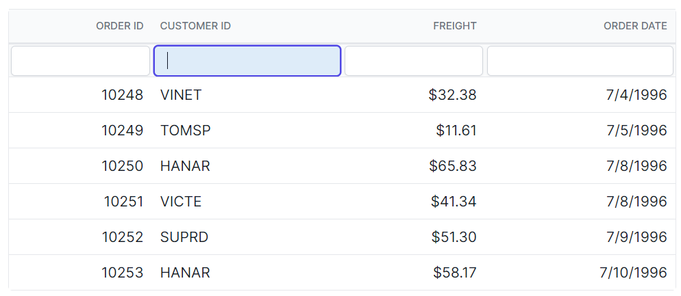
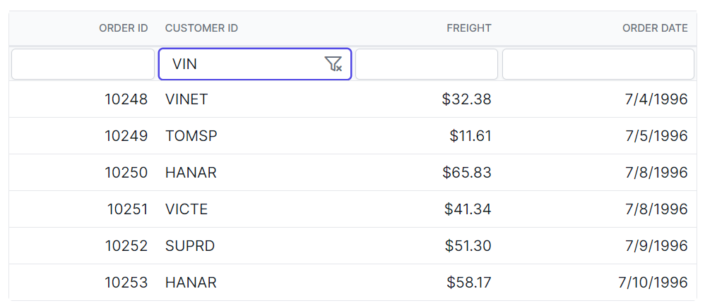
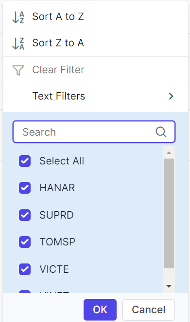
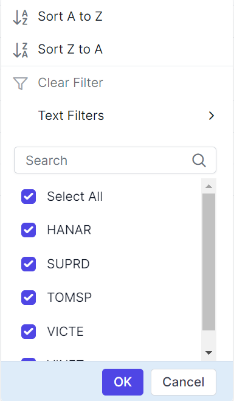
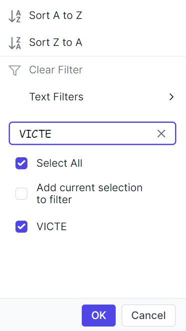

# Filtering customization in Syncfusion Blazor DataGrid

The appearance of filtering elements in the Syncfusion<sup style="font-size:70%">&reg;</sup> Blazor DataGrid can be customized using CSS. Styling options are available for different parts of the filtering interface:

- **Filter bar cell and input elements:** Used to enter filter values directly in the header row.
- **Input focus styles:** Visual highlight applied when the filter input field is focused.
- **Clear and filter icons:** Icons for clearing filter values and indicating active filters in column headers.
- **Filter dialog content and footer:** Sections of the filter popup used for entering filter criteria and confirming actions.
- **Input fields and buttons within the filter dialog:** Controls used to specify filter values and apply or cancel filtering.
- **Excel-style number filter visuals:** Menu-style interface for selecting numeric filter conditions in Excel-like filtering mode.

## Customizing the filter bar cell element

The `.e-filterbarcell` class is used to style the filter bar cell element in the DataGrid header.

```css
.e-grid .e-filterbarcell {
    background-color: #045fb4;
}
```


## Customizing the filter bar input element

The `.e-filterbarcell` and `.e-input` classes are used to style the filter bar input element.

```css
.e-grid .e-filterbarcell .e-input-group input.e-input {
    font-family: cursive;
}
```


## Customizing the filter bar input focus

The `.e-filterbarcell` and `.e-input-group.e-input-focus` classes are used to style the focused filter bar input element.

```css
.e-grid .e-filterbarcell .e-input-group.e-input-focus {
    background-color: #deecf9;
}
```



## Customizing the filter bar input clear icon

The `.e-clear-icon` class is used to style the clear icon element within the input group.

```css
.e-grid .e-filterbarcell .e-input-group .e-clear-icon::before {
    content: '\e72c';
}
```






@using Syncfusion.Blazor.Grids

<SfGrid DataSource="@Orders"
        Height="315"
        AllowFiltering="true"
        AllowPaging="true">
    <GridPageSettings PageSize="8"></GridPageSettings>
    <GridColumns>
        <GridColumn Field=@nameof(OrderData.OrderID) HeaderText="Order ID" TextAlign="TextAlign.Right" Width="140"></GridColumn>
        <GridColumn Field=@nameof(OrderData.CustomerID) HeaderText="Customer ID" Width="120"></GridColumn>
        <GridColumn Field=@nameof(OrderData.Freight) HeaderText="Freight" TextAlign="TextAlign.Right" Width="120"></GridColumn>
        <GridColumn Field=@nameof(OrderData.OrderDate) HeaderText="Order Date" Format="d" Width="100" TextAlign="TextAlign.Right"></GridColumn>
    </GridColumns>
</SfGrid>

<style>
    .e-grid .e-filterbarcell {
        background-color: #045fb4;
        color: #ffffff;
    }

    .e-grid .e-filterbarcell .e-input-group input.e-input {
        font-family: cursive;
    }

    .e-grid .e-filterbarcell .e-input-group.e-input-focus {
        background-color: #deecf9;
    }

    .e-grid .e-filterbarcell .e-input-group .e-clear-icon::before {
        font-family: 'e-icons' !important;
        font-weight: normal;
        content: '\e72c';
    }

    /* Optional: highlight the focused filter cell for keyboard users */
    .e-grid .e-filterbarcell:focus-visible {
        outline: 2px solid #005a9e;
        outline-offset: -2px;
    }
</style>

@code {
    
    private List<OrderData> Orders { get; set; }
    protected override void OnInitialized()
    {
        Orders = OrderData.GetAllRecords();
    }
}





internal sealed class OrderData
{
    private static readonly List<OrderData> Data = new();

    public OrderData(int orderID, string customerID, double freight, DateTime orderDate)
    {
        OrderID = orderID;
        CustomerID = customerID;
        Freight = freight;
        OrderDate = orderDate;
    }

    internal static List<OrderData> GetAllRecords()
    {
        if (Data.Count == 0)
        {
            Data.Add(new OrderData(10248, "VINET", 32.38, new DateTime(2024, 1, 10)));
            Data.Add(new OrderData(10249, "TOMSP", 11.61, new DateTime(2024, 1, 11)));
            Data.Add(new OrderData(10250, "HANAR", 65.83, new DateTime(2024, 1, 12)));
            Data.Add(new OrderData(10251, "VICTE", 41.34, new DateTime(2024, 1, 13)));
            Data.Add(new OrderData(10252, "SUPRD", 51.3, new DateTime(2024, 1, 14)));
            Data.Add(new OrderData(10253, "HANAR", 58.17, new DateTime(2024, 1, 15)));
            Data.Add(new OrderData(10254, "CHOPS", 22.98, new DateTime(2024, 1, 16)));
            Data.Add(new OrderData(10255, "RICSU", 148.33, new DateTime(2024, 1, 17)));
            Data.Add(new OrderData(10256, "WELLI", 13.97, new DateTime(2024, 1, 18)));
            Data.Add(new OrderData(10257, "HILAA", 81.91, new DateTime(2024, 1, 19)));
        }

        return Data;
    }

    public int OrderID { get; set; }
    public string CustomerID { get; set; }
    public double Freight { get; set; }
    public DateTime OrderDate { get; set; }
}






## Customizing the DataGrid filtering icon

The `.e-icon-filter::before` class is used to style the filtering icon element in the DataGrid header.

```css
.e-grid .e-icon-filter::before {
    content: '\e81e';
}
```


## Customizing the filter dialog content

The `.e-filter-popup .e-dlg-content` classes are used to style the content element within the filter dialog.

```css
.e-grid .e-filter-popup .e-dlg-content {
    background-color: #deecf9;
}
```



## Customizing the filter dialog footer

The `.e-filter-popup .e-footer-content` classes are used to style the footer element within the filter dialog.

```css
.e-grid .e-filter-popup .e-footer-content {
    background-color: #deecf9;
}
```

Properties like **background-color**, **text-align**, and **border** can be changed to align with the layout design.



## Customize the filter dialog input field

The `.e-filter-popup` and `.e-input` classes are used to style the input elements within the filter dialog.

```css
.e-grid .e-filter-popup .e-input-group input.e-input {
    font-family: cursive;
}
```

Adjust properties such as **font-family**, **color**, and **border** to match the design.



## Customizing the filter dialog button element

The `.e-filter-popup` and `.e-btn` classes are used to style the button elements within the filter dialog.

```css
.e-grid .e-filter-popup .e-btn {
    font-family: cursive;
}
```

Change properties like **font-family**, **background-color**, and **border** to match the design.


## Customizing the excel filter dialog number filters element

The `.e-filter-popup .e-contextmenu-wrapper ul` classes are used to style the number filter elements within the `Excel` filter dialog.

```css
.e-grid .e-filter-popup .e-contextmenu-container ul {
    background-color: #deecf9;
}
```

Properties such as **background-color**, **color**, and **text-align** can be adjusted to match the required design.





@using Syncfusion.Blazor.Grids

<SfGrid DataSource="@Orders"
        Height="315"
        AllowFiltering="true"
        AllowPaging="true">
    <GridPageSettings PageSize="8"></GridPageSettings>
    <GridFilterSettings Type="FilterType.Menu"></GridFilterSettings>
    <GridColumns>
        <GridColumn Field=@nameof(OrderData.OrderID) HeaderText="Order ID" TextAlign="TextAlign.Right" Width="140"></GridColumn>
        <GridColumn Field=@nameof(OrderData.CustomerID) HeaderText="Customer ID" Width="120"></GridColumn>
        <GridColumn Field=@nameof(OrderData.Freight) HeaderText="Freight" TextAlign="TextAlign.Right" Width="120"></GridColumn>
        <GridColumn Field=@nameof(OrderData.OrderDate) HeaderText="Order Date" Format="d" Width="100" TextAlign="TextAlign.Right"></GridColumn>
    </GridColumns>
</SfGrid>

<style>
    .e-grid .e-icon-filter::before {
        font-family: 'e-icons' !important;
        font-weight: normal;
        content: '\e81e';
    }

    .e-grid .e-filter-popup .e-dlg-content,
    .e-grid .e-filter-popup .e-footer-content,
    .e-grid .e-filter-popup .e-contextmenu-container ul {
        background-color: #deecf9;
    }

    .e-grid .e-filter-popup .e-input-group input.e-input,
    .e-grid .e-filter-popup .e-btn {
        font-family: cursive;
    }

    /* Optional: focus outline inside the filter dialog for keyboard users */
    .e-grid .e-filter-popup .e-input-group input.e-input:focus-visible,
    .e-grid .e-filter-popup .e-btn:focus-visible {
        outline: 2px solid #005a9e;
        outline-offset: 2px;
    }
</style>

@code {
    private List<OrderData> Orders { get; set; }

    protected override void OnInitialized()
    {
        Orders = OrderData.GetAllRecords();
    }
}





internal sealed class OrderData
{
    private static readonly List<OrderData> Data = new();

    public OrderData(int orderID, string customerID, double freight, DateTime orderDate)
    {
        OrderID = orderID;
        CustomerID = customerID;
        Freight = freight;
        OrderDate = orderDate;
    }

    internal static List<OrderData> GetAllRecords()
    {
        if (Data.Count == 0)
        {
            Data.Add(new OrderData(10248, "VINET", 32.38, new DateTime(2024, 1, 10)));
            Data.Add(new OrderData(10249, "TOMSP", 11.61, new DateTime(2024, 1, 11)));
            Data.Add(new OrderData(10250, "HANAR", 65.83, new DateTime(2024, 1, 12)));
            Data.Add(new OrderData(10251, "VICTE", 41.34, new DateTime(2024, 1, 13)));
            Data.Add(new OrderData(10252, "SUPRD", 51.3, new DateTime(2024, 1, 14)));
            Data.Add(new OrderData(10253, "HANAR", 58.17, new DateTime(2024, 1, 15)));
            Data.Add(new OrderData(10254, "CHOPS", 22.98, new DateTime(2024, 1, 16)));
            Data.Add(new OrderData(10255, "RICSU", 148.33, new DateTime(2024, 1, 17)));
            Data.Add(new OrderData(10256, "WELLI", 13.97, new DateTime(2024, 1, 18)));
            Data.Add(new OrderData(10257, "HILAA", 81.91, new DateTime(2024, 1, 19)));
        }

        return Data;
    }

    public int OrderID { get; set; }
    public string CustomerID { get; set; }
    public double Freight { get; set; }
    public DateTime OrderDate { get; set; }
}





