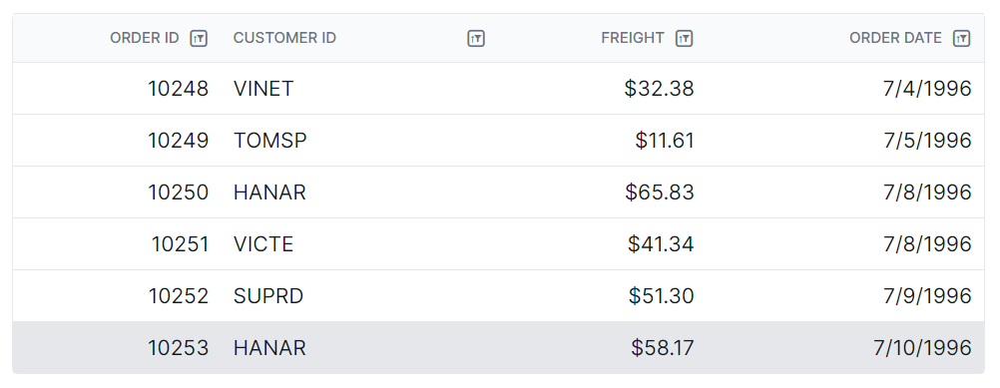

# Filtering customization in Syncfusion Blazor DataGrid

The appearance of filtering elements in the Syncfusion<sup style="font-size:70%">&reg;</sup> Blazor DataGrid can be customized using CSS. Styling options are available for various parts of the filtering interface, including:

- Filter bar cell and input elements
- Input focus styles
- Clear and filter icons
- Filter dialog content and footer
- Input fields and buttons within the filter dialog
- Excel-style number filter visuals

N> - Enable filtering by setting the [AllowFiltering](https://help.syncfusion.com/cr/blazor/Syncfusion.Blazor.Grids.SfGrid-1.html#Syncfusion_Blazor_Grids_SfGrid_1_AllowFiltering) property. Ensure that the appropriate theme stylesheet is referenced so that filtering UI elements are displayed correctly.
For details on filtering options and behavior, refer to the [Blazor DataGrid filtering]( https://blazor.syncfusion.com/documentation/datagrid/filtering) documentation.
- When using CSS isolation (.razor.css), use the **::deep** selector to reach internal parts of the DataGrid, or place the grid inside a custom wrapper class and apply styles to that wrapper for better control.
- Class names may change slightly depending on the theme or version, so check the DOM to confirm. 
- Maintain strong color contrast and clear focus indicators to support accessibility and improve readability.

## Customizing the Filter Bar Cell Element

The **.e-filterbarcell** class is used to style the filter bar cells located in the header row of the DataGrid. To modify their appearance, apply CSS:

```css

.e-grid .e-filterbarcell {
    background-color: #045fb4;
}

```

Style properties such as `background-color`, `spacing`, `borders`, and `padding` can be adjusted to match the desired design or to visually distinguish the filter row from header cells.


## Customizing the Filter Bar Input Element

The **.e-filterbarcell** and **.e-input** classes are used to style the input field inside the filter bar cell in the header row of the Blazor DataGrid. To modify its appearance, apply CSS:

```css

.e-grid .e-filterbarcell .e-input-group input.e-input{
    font-family: cursive;
}

```

Style properties such as `font-family`, `font-size`, `padding`, and `border` can be adjusted to improve the readability of the filter bar input field.


## Customizing the filter bar input focus

The **.e-filterbarcell** and **.e-input-focus** classes are used to style the filter bar input group when the input field is focused. To change its appearance, apply CSS:

```css

.e-grid .e-filterbarcell .e-input-group.e-input-focus{
    background-color: #deecf9;
}

```
Properties such as background color, border, and padding can be modified to improve focus visibility. This helps enhance keyboard navigation and ensures sufficient contrast for accessibility.


## Customizing the Filter Bar Clear Icon

The **.e-clear-icon::before** selector is used to customize the glyph for the clear icon in the filter bar input of the Blazor Grid. 

```css

.e-grid .e-filterbarcell .e-input-group .e-clear-icon::before {
    content: '\e72c';
}

```

The `content` property can be modified to apply a custom icon from an icon set. Properties such as `color` and `font-size` to enhance icon visibility and ensure consistency with the overall design.





@using Syncfusion.Blazor.Grids

<SfGrid @ref="Grid" DataSource="@Orders" Height="315" AllowFiltering="true" AllowPaging="true">
    <GridPageSettings PageSize="8"></GridPageSettings>
    <GridColumns>
        <GridColumn Field=@nameof(OrderData.OrderID) HeaderText="Order ID" TextAlign="Syncfusion.Blazor.Grids.TextAlign.Right" Width="140"></GridColumn>
        <GridColumn Field=@nameof(OrderData.CustomerID) HeaderText="Customer ID" Width="120"></GridColumn>
        <GridColumn Field=@nameof(OrderData.Freight) HeaderText="Freight" TextAlign="Syncfusion.Blazor.Grids.TextAlign.Right" Width="120"></GridColumn>
        <GridColumn Field=@nameof(OrderData.OrderDate) HeaderText="Order Date" Format="d" Width="100" TextAlign="Syncfusion.Blazor.Grids.TextAlign.Right"></GridColumn>
    </GridColumns>
</SfGrid>

<style>
    .e-grid .e-filterbarcell .e-input-group.e-input-focus{
        background-color: #deecf9;
    }
    .e-grid .e-filterbarcell .e-input-group .e-clear-icon::before {
        content: '\e72c';
    }
    .e-grid .e-filterbarcell .e-input-group input.e-input{
        font-family: cursive;
    }
    .e-grid .e-filterbarcell {
        background-color: #045fb4;
    }
</style>

@code {
    private SfGrid<OrderData> Grid;
    public List<OrderData> Orders { get; set; }

    protected override void OnInitialized()
    {
        Orders = OrderData.GetAllRecords();
    }
}





public class OrderData
{
    public static List<OrderData> Orders = new List<OrderData>();

    public OrderData(int orderID, string customerID, double freight, DateTime orderDate)
    {
        this.OrderID = orderID;
        this.CustomerID = customerID;
        this.Freight = freight;
        this.OrderDate = orderDate;
    }

    public static List<OrderData> GetAllRecords()
    {
        if (Orders.Count == 0)
        {
            Orders.Add(new OrderData(10248, "VINET", 32.38, new DateTime(2024, 1, 10)));
            Orders.Add(new OrderData(10249, "TOMSP", 11.61, new DateTime(2024, 1, 11)));
            Orders.Add(new OrderData(10250, "HANAR", 65.83, new DateTime(2024, 1, 12)));
            Orders.Add(new OrderData(10251, "VICTE", 41.34, new DateTime(2024, 1, 13)));
            Orders.Add(new OrderData(10252, "SUPRD", 51.3, new DateTime(2024, 1, 14)));
            Orders.Add(new OrderData(10253, "HANAR", 58.17, new DateTime(2024, 1, 15)));
            Orders.Add(new OrderData(10254, "CHOPS", 22.98, new DateTime(2024, 1, 16)));
            Orders.Add(new OrderData(10255, "RICSU", 148.33, new DateTime(2024, 1, 17)));
            Orders.Add(new OrderData(10256, "WELLI", 13.97, new DateTime(2024, 1, 18)));
            Orders.Add(new OrderData(10257, "HILAA", 81.91, new DateTime(2024, 1, 19)));
        }

        return Orders;
    }

    public int OrderID { get; set; }
    public string CustomerID { get; set; }
    public double Freight { get; set; }
    public DateTime OrderDate { get; set; }
}






## Customizing the Filtering Icon in the Header

The **.e-icon-filter::before** class is used to style the filter icon displayed in the column headers of the Blazor DataGrid. To change its appearance, apply CSS:

```css

.e-grid .e-icon-filter::before{
    content: '\e81e';
}

```

The `content` property can be modified to apply a custom icon from an icon set. Properties such as `color` and `font-size` to enhance icon visibility and ensure consistency with the overall design.



## Customizing the Filter Dialog Content

The **.e-filter-popup .e-dlg-content** class is used to style the content area of the filter dialog in the Blazor DataGrid. To modify its appearance, apply CSS:

```css

.e-grid .e-filter-popup .e-dlg-content {
    background-color: #deecf9;
}

```

Style properties such as `background-color`, `padding`, and `borders` can be adjusted to match the application's design or improve visibility in high-contrast themes.


## Customizing the Filter Dialog Footer

The **.e-filter-popup .e-footer-content** class is used to style the footer area of the filter dialog in the Blazor DataGrid. To modify its appearance, apply CSS:

```css

.e-grid .e-filter-popup .e-footer-content {
    background-color: #deecf9;
}

```

Style properties such as `background-color`, `color`, `text-align`, and `border` can be adjusted to match the required design.


## Customizing the Filter Dialog Input Element

The **.e-filter-popup .e-input class** is used to style input elements inside the filter dialog in the Blazor DataGrid. To modify their appearance, apply CSS:

```css

.e-grid .e-filter-popup .e-input-group input.e-input{
    font-family: cursive;
}

```

Style properties such as `font-family`, `background-color`, `color`, `text-align`, and `border` can be adjusted to match the required design.


## Customizing the Filter Dialog Button Element

The **.e-filter-popup .e-btn** class is used to style buttons inside the filter dialog in the Blazor DataGrid. To modify their appearance, apply CSS:

```css

.e-grid .e-filter-popup .e-btn{
    font-family: cursive;
}

```

Style properties such as `font-family`, `background-color`, and `border` can be adjusted to match the required design.


## Customizing the Excel Filter Dialog Number Filters Element

The **.e-filter-popup .e-contextmenu-container ul** selector is used to style the number filter list in the Excel filter dialog of the Blazor DataGrid. To modify its appearance, apply CSS:

```css

.e-grid .e-filter-popup .e-contextmenu-container ul{
    background-color: #deecf9;
}

```

Style properties such as `background-color`, `color`, and `text-align` can be adjusted to match the required design.





@using Syncfusion.Blazor.Grids

<SfGrid @ref="Grid" DataSource="@Orders" Height="315" AllowFiltering="true" AllowPaging="true">
    <GridPageSettings PageSize="8"></GridPageSettings>
    <GridFilterSettings Type="Syncfusion.Blazor.Grids.FilterType.Menu"></GridFilterSettings>
    <GridColumns>
        <GridColumn Field=@nameof(OrderData.OrderID) HeaderText="Order ID" TextAlign="Syncfusion.Blazor.Grids.TextAlign.Right" Width="140"></GridColumn>
        <GridColumn Field=@nameof(OrderData.CustomerID) HeaderText="Customer ID" Width="120"></GridColumn>
        <GridColumn Field=@nameof(OrderData.Freight) HeaderText="Freight" TextAlign="Syncfusion.Blazor.Grids.TextAlign.Right" Width="120"></GridColumn>
        <GridColumn Field=@nameof(OrderData.OrderDate) HeaderText="Order Date" Format="d" Width="100" TextAlign="Syncfusion.Blazor.Grids.TextAlign.Right"></GridColumn>
    </GridColumns>
</SfGrid>

<style>
    .e-grid .e-icon-filter::before{
        content: '\e81e';
    }
    .e-grid .e-filter-popup .e-contextmenu-container ul{
        background-color: #deecf9;
    }
    .e-grid .e-filter-popup .e-btn{
        font-family: cursive;
    }
    .e-grid .e-filter-popup .e-input-group input.e-input{
        font-family: cursive;
    }
    .e-grid .e-filter-popup .e-footer-content {
        background-color: #deecf9;
    }
    .e-grid .e-filter-popup .e-dlg-content {
        background-color: #deecf9;
    }
</style>

@code {
    private SfGrid<OrderData> Grid;
    public List<OrderData> Orders { get; set; }

    protected override void OnInitialized()
    {
        Orders = OrderData.GetAllRecords();
    }
}





public class OrderData
{
    public static List<OrderData> Orders = new List<OrderData>();

    public OrderData(int orderID, string customerID, double freight, DateTime orderDate)
    {
        this.OrderID = orderID;
        this.CustomerID = customerID;
        this.Freight = freight;
        this.OrderDate = orderDate;
    }

    public static List<OrderData> GetAllRecords()
    {
        if (Orders.Count == 0)
        {
            Orders.Add(new OrderData(10248, "VINET", 32.38, new DateTime(2024, 1, 10)));
            Orders.Add(new OrderData(10249, "TOMSP", 11.61, new DateTime(2024, 1, 11)));
            Orders.Add(new OrderData(10250, "HANAR", 65.83, new DateTime(2024, 1, 12)));
            Orders.Add(new OrderData(10251, "VICTE", 41.34, new DateTime(2024, 1, 13)));
            Orders.Add(new OrderData(10252, "SUPRD", 51.3, new DateTime(2024, 1, 14)));
            Orders.Add(new OrderData(10253, "HANAR", 58.17, new DateTime(2024, 1, 15)));
            Orders.Add(new OrderData(10254, "CHOPS", 22.98, new DateTime(2024, 1, 16)));
            Orders.Add(new OrderData(10255, "RICSU", 148.33, new DateTime(2024, 1, 17)));
            Orders.Add(new OrderData(10256, "WELLI", 13.97, new DateTime(2024, 1, 18)));
            Orders.Add(new OrderData(10257, "HILAA", 81.91, new DateTime(2024, 1, 19)));
        }

        return Orders;
    }

    public int OrderID { get; set; }
    public string CustomerID { get; set; }
    public double Freight { get; set; }
    public DateTime OrderDate { get; set; }
}




