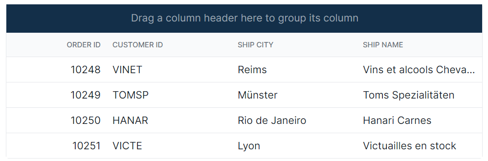
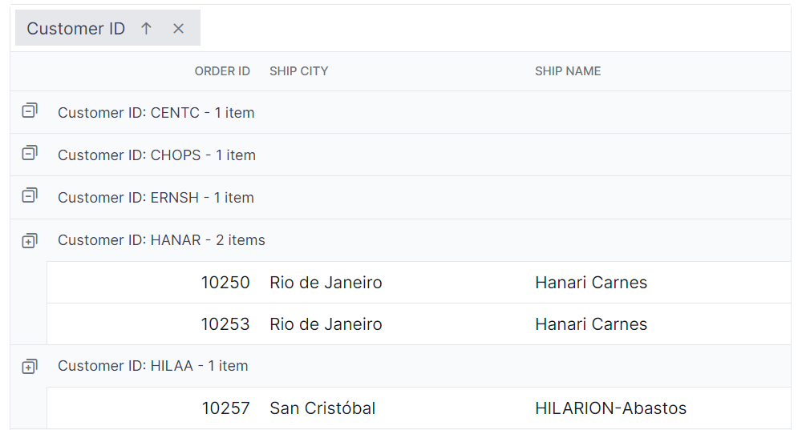
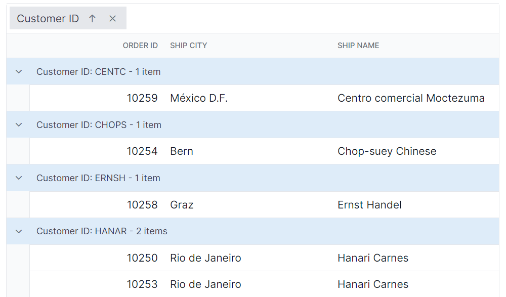
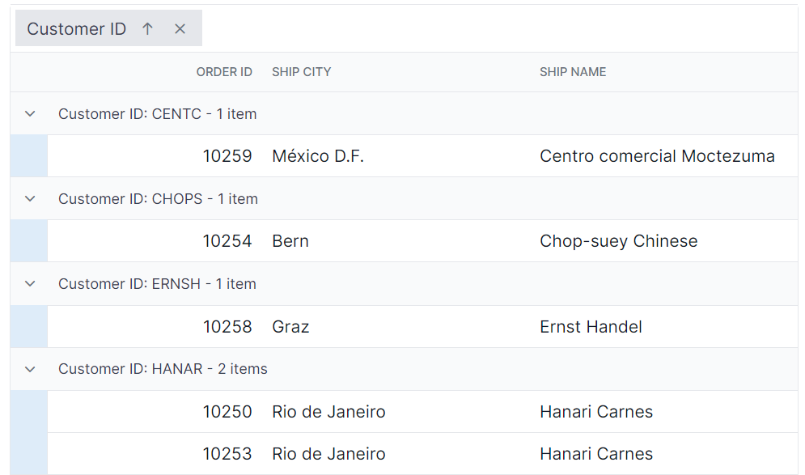

# Grouping customization in Syncfusion Blazor DataGrid

Customize the appearance of grouping elements in the Syncfusion Blazor DataGrid using CSS. The examples below show how to style the group header, expand/collapse icons, group caption row, and grouping indent cell.

Notes:
- Ensure grouping is enabled (AllowGrouping or GridGroupSettings) and the required theme stylesheet is referenced so grouping UI renders.
- Global selectors (.e-grid …) affect all grids on the page. To limit scope, wrap the DataGrid in a custom container class and prefix selectors, or use CSS isolation with the ::deep combinator.
- Icon glyph codes used with ::before are theme- and version-dependent. Verify the desired glyphs in the current icon font and documentation.
- Selector names may vary slightly between themes; inspect the DOM to confirm class names.
- Maintain accessible color contrast for custom backgrounds and verify focus visibility for keyboard users.

## Customizing the group header

To style the group header element:

```css
.e-grid .e-groupdroparea {
    background-color: #132f49;
}
```

In this example, the .e-groupdroparea class targets the group header area. Modify background-color, padding, border, or font-related properties to match the application’s theme.



## Customizing the group expand or collapse icons

To style the expand/collapse icons:

```css
.e-grid .e-icon-gdownarrow::before{
    content:'\e7c9'
    }
.e-grid .e-icon-grightarrow::before{
    content:'\e80f'
}
```

Here, `.e-icon-gdownarrow` and `.e-icon-grightarrow` target the expand and collapse icons. Adjust the content value to switch icons. Choose from available [Syncfusion<sup style="font-size:70%">&reg;</sup> icons](https://blazor.syncfusion.com/documentation/appearance/icons) based on the selected theme.



## Customizing the group caption row

To style the caption row and record expand/collapse indicators:

```css
.e-grid .e-groupcaption {
    background-color: #deecf9;
}

.e-grid .e-recordplusexpand,
.e-grid .e-recordpluscollapse {
    background-color: #deecf9;
}
```

The `.e-groupcaption` class targets the caption row, and `.e-recordplusexpand`/`.e-recordpluscollapse` target the record-level indicators. Modify background-color or add borders and typography to align with the application theme.



## Customizing the grouping indent cell

To style the indent cell:

```css
.e-grid .e-indentcell {
    background-color: #deecf9;
}
```

The `.e-indentcell` class targets the grouping indent cell. Adjust background-color or add borders to maintain visual alignment with caption rows and grouped content.






@using Syncfusion.Blazor.Grids

<SfGrid @ref="Grid" DataSource="@Orders" Height="315" AllowGrouping="true" AllowPaging="true">
    <GridPageSettings PageSize="8"></GridPageSettings>
    <GridGroupSettings Columns="@Initial"></GridGroupSettings>
    <GridColumns>
        <GridColumn Field=@nameof(OrderData.OrderID) HeaderText="Order ID" TextAlign="Syncfusion.Blazor.Grids.TextAlign.Right" Width="140"></GridColumn>
        <GridColumn Field=@nameof(OrderData.CustomerID) HeaderText="Customer ID" Width="120"></GridColumn>
        <GridColumn Field=@nameof(OrderData.ShipCity) HeaderText="Ship City" Width="100"></GridColumn>
        <GridColumn Field=@nameof(OrderData.ShipName) HeaderText="Ship Name" Width="100"></GridColumn>
    </GridColumns>
</SfGrid>

<style>
   .e-grid .e-groupdroparea {
        background-color: #132f49;
    }
    .e-grid .e-icon-gdownarrow::before{
        content:'\e7c9'
    }
    .e-grid .e-icon-grightarrow::before{
        content:'\e80f'
    }
    .e-grid .e-groupcaption {
        background-color: #deecf9;
    }
    .e-grid .e-recordplusexpand,
    .e-grid .e-recordpluscollapse {
        background-color: #deecf9;
    }
    .e-grid .e-indentcell {
        background-color: #deecf9;
    }
</style>

@code {
    private SfGrid<OrderData> Grid;
    public List<OrderData> Orders { get; set; }
    public string[] Initial = (new string[] { "CustomerID" });

    protected override void OnInitialized()
    {
        Orders = OrderData.GetAllRecords();
    }
}





public class OrderData
{
    public static List<OrderData> Orders = new List<OrderData>();

    public OrderData(int orderID, string customerID, string shipCity, string shipName)
    {
        this.OrderID = orderID;
        this.CustomerID = customerID;
        this.ShipCity = shipCity;
        this.ShipName = shipName;
    }

    public static List<OrderData> GetAllRecords()
    {
        if (Orders.Count == 0)
        {
            Orders.Add(new OrderData(10248, "VINET", "Reims", "Vins et alcools Chevalier"));
            Orders.Add(new OrderData(10249, "TOMSP", "Münster", "Toms Spezialitäten"));
            Orders.Add(new OrderData(10250, "HANAR", "Rio de Janeiro", "Hanari Carnes"));
            Orders.Add(new OrderData(10251, "VICTE", "Lyon", "Victuailles en stock"));
            Orders.Add(new OrderData(10252, "SUPRD", "Charleroi", "Suprêmes délices"));
            Orders.Add(new OrderData(10253, "HANAR", "Rio de Janeiro", "Hanari Carnes"));
            Orders.Add(new OrderData(10254, "CHOPS", "Bern", "Chop-suey Chinese"));
            Orders.Add(new OrderData(10255, "RICSU", "Genève", "Richter Supermarkt"));
            Orders.Add(new OrderData(10256, "WELLI", "Resende", "Wellington Import Export"));
            Orders.Add(new OrderData(10257, "HILAA", "San Cristóbal", "Hila Alimentos"));
            Orders.Add(new OrderData(10258, "ERNSH", "Graz", "Ernst Handel"));
            Orders.Add(new OrderData(10259, "CENTC", "México D.F.", "Centro comercial"));
            Orders.Add(new OrderData(10260, "OTTIK", "Köln", "Ottilies Käseladen"));
            Orders.Add(new OrderData(10261, "QUEDE", "Rio de Janeiro", "Que delícia"));
            Orders.Add(new OrderData(10262, "RATTC", "Albuquerque", "Rattlesnake Canyon Grocery"));
        }

        return Orders;
    }

    public int OrderID { get; set; }
    public string CustomerID { get; set; }
    public string ShipCity { get; set; }
    public string ShipName { get; set; }
}




