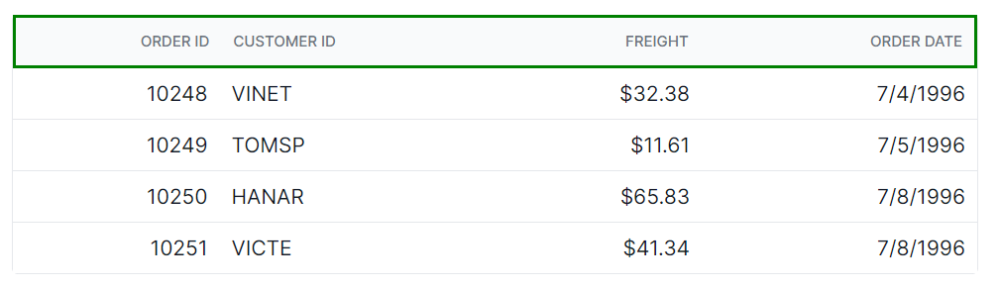
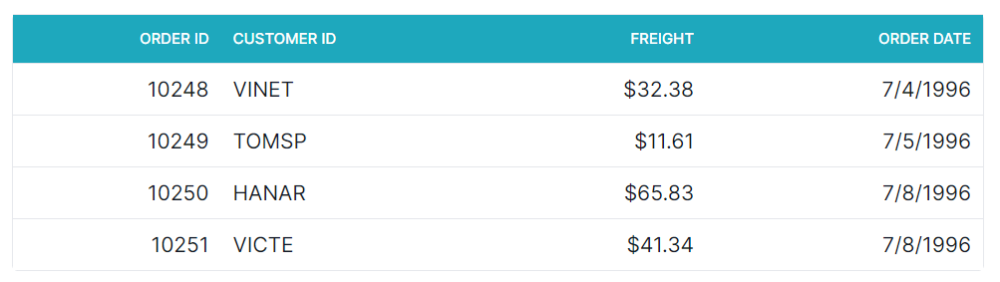
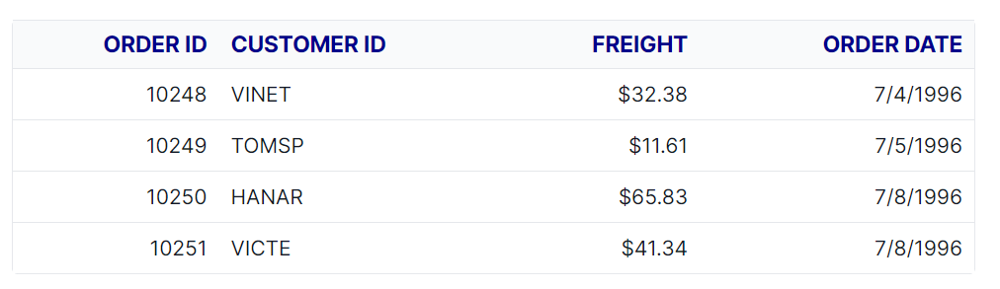

# Header customization in Syncfusion Blazor DataGrid

The appearance of header elements in the Syncfusion<sup style="font-size:70%">&reg;</sup> Blazor DataGrid can be customized using CSS. Styling options are available for various parts of the header interface, including:

- DataGrid header container
- Header cells
- Header text container

N> When using CSS isolation (.razor.css), target internal elements with **:deep(...)** or **::deep(...)** depending on the tooling. If theme styles override custom CSS, apply a wrapper class or **Grid ID** to increase specificity.

## Customizing the Blazor DataGrid header

The **.e-gridheader** class is used to style the header container element in the Blazor DataGrid. To change its appearance, apply CSS like below:

```css

.e-grid .e-gridheader {
    border: 2px solid green;
}
```
Style properties such as `border`, `padding`, and `background` can be adjusted to match the desired design.



## Customizing the Blazor DataGrid Header Cell

The **.e-headercell** class is used to style individual header cells in the Blazor DataGrid. To change their appearance, apply CSS as shown below:

```css

.e-grid .e-headercell {
    color: #ffffff;
    background-color: #1ea8bd;
}

```
Style properties such as `color`, `background-color`, `font`, `border`, and `alignment` can be adjusted to match the desired design.



## Customizing the Blazor DataGrid Header Cell Div Element

The **.e-headercelldiv** class is used to style the text container inside each header cell. To change its appearance, apply CSS as shown below:

```css

.e-grid .e-headercelldiv {
    font-size: 15px;
    font-weight: bold;
    color: darkblue;
}
```
Style properties such as `font-size`, `font-weight`, and `color` can be adjusted to match the desired design.






@using Syncfusion.Blazor.Grids

<SfGrid @ref="Grid" DataSource="@Orders" Height="315" AllowPaging="true">
    <GridPageSettings PageSize="8"></GridPageSettings>
    <GridColumns>
        <GridColumn Field=@nameof(OrderData.OrderID) HeaderText="Order ID" TextAlign="Syncfusion.Blazor.Grids.TextAlign.Right" Width="140"></GridColumn>
        <GridColumn Field=@nameof(OrderData.CustomerID) HeaderText="Customer ID" Width="120"></GridColumn>
        <GridColumn Field=@nameof(OrderData.Freight) HeaderText="Freight" TextAlign="Syncfusion.Blazor.Grids.TextAlign.Right" Width="120"></GridColumn>
        <GridColumn Field=@nameof(OrderData.OrderDate) HeaderText="Order Date" Format="d" Width="100" TextAlign="Syncfusion.Blazor.Grids.TextAlign.Right"></GridColumn>
    </GridColumns>
</SfGrid>

<style>
    .e-grid .e-headercelldiv {
        font-size: 15px;
        font-weight: bold;
        color: darkblue;
    }
    .e-grid .e-headercell {
        color: #ffffff;
        background-color: #1ea8bd;
    }
    .e-grid .e-gridheader {
        border: 2px solid green;
    }
</style>

@code {
    private SfGrid<OrderData> Grid;
    public List<OrderData> Orders { get; set; }

    protected override void OnInitialized()
    {
        Orders = OrderData.GetAllRecords();
    }
}





public class OrderData
{
    public static List<OrderData> Orders = new List<OrderData>();

    public OrderData(int orderID, string customerID, double freight, DateTime orderDate)
    {
        this.OrderID = orderID;
        this.CustomerID = customerID;
        this.Freight = freight;
        this.OrderDate = orderDate;
    }

    public static List<OrderData> GetAllRecords()
    {
        if (Orders.Count == 0)
        {
            Orders.Add(new OrderData(10248, "VINET", 32.38, new DateTime(2024, 1, 10)));
            Orders.Add(new OrderData(10249, "TOMSP", 11.61, new DateTime(2024, 1, 11)));
            Orders.Add(new OrderData(10250, "HANAR", 65.83, new DateTime(2024, 1, 12)));
            Orders.Add(new OrderData(10251, "VICTE", 41.34, new DateTime(2024, 1, 13)));
            Orders.Add(new OrderData(10252, "SUPRD", 51.3, new DateTime(2024, 1, 14)));
            Orders.Add(new OrderData(10253, "HANAR", 58.17, new DateTime(2024, 1, 15)));
            Orders.Add(new OrderData(10254, "CHOPS", 22.98, new DateTime(2024, 1, 16)));
            Orders.Add(new OrderData(10255, "RICSU", 148.33, new DateTime(2024, 1, 17)));
            Orders.Add(new OrderData(10256, "WELLI", 13.97, new DateTime(2024, 1, 18)));
            Orders.Add(new OrderData(10257, "HILAA", 81.91, new DateTime(2024, 1, 19)));
        }

        return Orders;
    }

    public int OrderID { get; set; }
    public string CustomerID { get; set; }
    public double Freight { get; set; }
    public DateTime OrderDate { get; set; }
}






## Hiding the Blazor DataGrid Header

The **.e-gridheader .e-columnheader** class combination is used to target the column header row content in the Syncfusion<sup style="font-size:70%">&reg;</sup> Blazor DataGrid. 
To hide the column headers across all DataGrids on the page, apply the following CSS:

```css
<style>
    .e-grid .e-gridheader .e-columnheader {
        display: none;
    }
</style>
```

To hide the header for a specific Grid only, apply the style using the Grid's ID:

```css
<style>
    #Grid.e-grid .e-gridheader .e-columnheader {
        display: none;
    }
</style>
```

N> Hiding headers also removes visual elements such as sorting arrows, filter icons, and column menu buttons. This may affect accessibility. If headers are hidden, ensure alternative labels are provided using attributes like `aria-label` or `aria-labelledby`.




@using Syncfusion.Blazor.Grids

<SfGrid @ref="Grid" DataSource="@Orders" AllowPaging="true">
    <GridColumns>
        <GridColumn Field=@nameof(OrderDetails.OrderID) HeaderText="Order ID" TextAlign="Syncfusion.Blazor.Grids.TextAlign.Right" Width="140"></GridColumn>
        <GridColumn Field=@nameof(OrderDetails.CustomerID) HeaderText="Customer ID" Width="120"></GridColumn>
        <GridColumn Field=@nameof(OrderDetails.Freight) HeaderText="Freight" TextAlign="Syncfusion.Blazor.Grids.TextAlign.Right" Width="120"></GridColumn>
        <GridColumn Field=@nameof(OrderDetails.OrderDate) HeaderText="Order Date" Format="d" Width="100" TextAlign="Syncfusion.Blazor.Grids.TextAlign.Right"></GridColumn>
    </GridColumns>
</SfGrid>

<style>
    .e-grid .e-gridheader .e-columnheader{
        display: none;
    }
</style>

@code {
    private SfGrid<OrderDetails> Grid;
    public List<OrderDetails> Orders { get; set; }

    protected override void OnInitialized()
    {
        Orders = OrderDetails.GetAllRecords();
    }
}




public class OrderDetails
{
    public static List<OrderDetails> Orders = new List<OrderDetails>();

    public OrderDetails(int orderID, string customerID, double freight, DateTime orderDate)
    {
        this.OrderID = orderID;
        this.CustomerID = customerID;
        this.Freight = freight;
        this.OrderDate = orderDate;
    }

    public static List<OrderDetails> GetAllRecords()
    {
        if (Orders.Count == 0)
        {
            Orders.Add(new OrderDetails(10248, "VINET", 32.38, new DateTime(2024, 1, 10)));
            Orders.Add(new OrderDetails(10249, "TOMSP", 11.61, new DateTime(2024, 1, 11)));
            Orders.Add(new OrderDetails(10250, "HANAR", 65.83, new DateTime(2024, 1, 12)));
            Orders.Add(new OrderDetails(10251, "VICTE", 41.34, new DateTime(2024, 1, 13)));
            Orders.Add(new OrderDetails(10252, "SUPRD", 51.3, new DateTime(2024, 1, 14)));
            Orders.Add(new OrderDetails(10253, "HANAR", 58.17, new DateTime(2024, 1, 15)));
            Orders.Add(new OrderDetails(10254, "CHOPS", 22.98, new DateTime(2024, 1, 16)));
            Orders.Add(new OrderDetails(10255, "RICSU", 148.33, new DateTime(2024, 1, 17)));
            Orders.Add(new OrderDetails(10256, "WELLI", 13.97, new DateTime(2024, 1, 18)));
            Orders.Add(new OrderDetails(10257, "HILAA", 81.91, new DateTime(2024, 1, 19)));
        }

        return Orders;
    }

    public int OrderID { get; set; }
    public string CustomerID { get; set; }
    public double Freight { get; set; }
    public DateTime OrderDate { get; set; }
}




