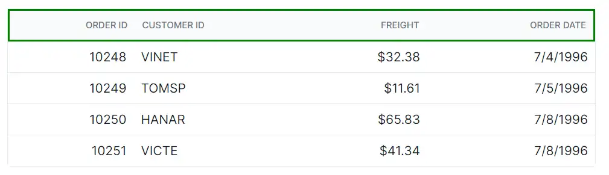
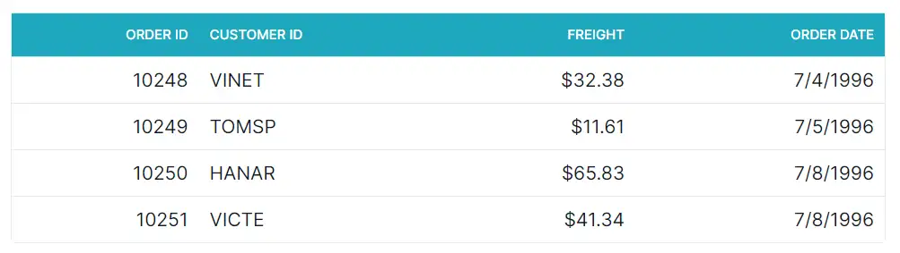
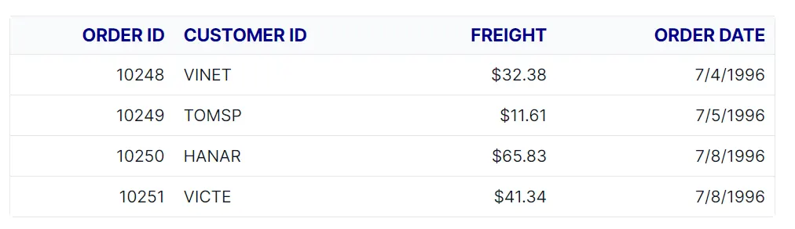
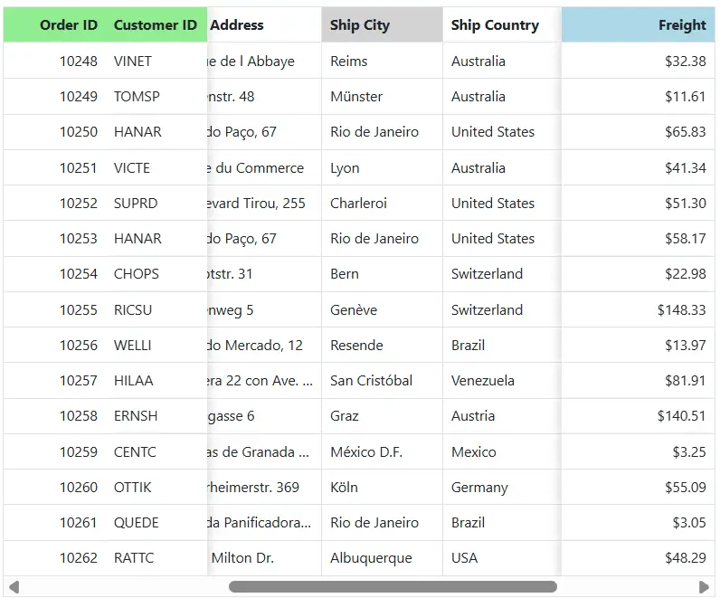

# Header customization in Blazor DataGrid

The appearance of header elements in the [Blazor DataGrid](https://www.syncfusion.com/blazor-components/blazor-datagrid) can be customized using CSS. Styling options are available for different parts of the header interface:

- **Header container**: The outer wrapper that holds all column headers.
- **Header cells**: Individual containers for each column title and associated icons.
- **Header text container**: The inner element that holds the header text content.

## Customize the Blazor DataGrid header

The **.e-gridheader** class styles the header container in the Blazor DataGrid. Use CSS to adjust its appearance:

```css
.e-grid .e-gridheader {
    border: 2px solid green;
}
```

Style Properties like  **border**, **padding**, and **background-color** can be changed to fit the grid layout design.



## Customize the Blazor DataGrid header cell

The **.e-headercell** class styles individual header cells in the Blazor DataGrid. Apply CSS to modify its look:

```css
.e-grid .e-headercell {
    color: #ffffff;
    background-color: #1ea8bd;
}
```

Properties such as **color**, **background-color**, **font**, and alignment can be adjusted to align with the grid design.



## Customize the Blazor DataGrid header cell div element

The **.e-headercelldiv** class styles the text container inside each header cell. Apply CSS to change its appearance:

```css
.e-grid .e-headercelldiv {
    font-size: 15px;
    font-weight: bold;
    color: darkblue;
}
```

Change properties like **font-size**, **font-weight**, and **color** to highlight the header text and improve clarity.






@using Syncfusion.Blazor.Grids

<SfGrid DataSource="@Orders" Height="315" AllowPaging="true">
    <GridPageSettings PageSize="8"></GridPageSettings>
    <GridColumns>
        <GridColumn Field=@nameof(OrderData.OrderID) HeaderText="Order ID" TextAlign="TextAlign.Right" Width="140"></GridColumn>
        <GridColumn Field=@nameof(OrderData.CustomerID) HeaderText="Customer ID" Width="120"></GridColumn>
        <GridColumn Field=@nameof(OrderData.Freight) HeaderText="Freight" TextAlign="TextAlign.Right" Width="120"></GridColumn>
        <GridColumn Field=@nameof(OrderData.OrderDate) HeaderText="Order Date" Format="d" Width="100" TextAlign="TextAlign.Right"></GridColumn>
    </GridColumns>
</SfGrid>

<style>
    .e-grid .e-gridheader {
        border: 2px solid green;
    }
    .e-grid .e-headercell {
        color: #ffffff;
        background-color: #1ea8bd;
    }
    .e-grid .e-headercelldiv {
        font-size: 15px;
        font-weight: bold;
        color: darkblue;
    }
</style>

@code {
    private List<OrderData> Orders { get; set; }

    protected override void OnInitialized()
    {
        Orders = OrderData.GetAllRecords();
    }
}





internal sealed class OrderData
{
    private static readonly List<OrderData> Data = new();

    public OrderData(int orderID, string customerID, double freight, DateTime orderDate)
    {
        OrderID = orderID;
        CustomerID = customerID;
        Freight = freight;
        OrderDate = orderDate;
    }

    internal static List<OrderData> GetAllRecords()
    {
        if (Data.Count == 0)
        {
            Data.Add(new OrderData(10248, "VINET", 32.38, new DateTime(2024, 1, 10)));
            Data.Add(new OrderData(10249, "TOMSP", 11.61, new DateTime(2024, 1, 11)));
            Data.Add(new OrderData(10250, "HANAR", 65.83, new DateTime(2024, 1, 12)));
            Data.Add(new OrderData(10251, "VICTE", 41.34, new DateTime(2024, 1, 13)));
            Data.Add(new OrderData(10252, "SUPRD", 51.3, new DateTime(2024, 1, 14)));
            Data.Add(new OrderData(10253, "HANAR", 58.17, new DateTime(2024, 1, 15)));
            Data.Add(new OrderData(10254, "CHOPS", 22.98, new DateTime(2024, 1, 16)));
            Data.Add(new OrderData(10255, "RICSU", 148.33, new DateTime(2024, 1, 17)));
            Data.Add(new OrderData(10256, "WELLI", 13.97, new DateTime(2024, 1, 18)));
            Data.Add(new OrderData(10257, "HILAA", 81.91, new DateTime(2024, 1, 19)));
        }

        return Data;
    }

    public int OrderID { get; set; }
    public string CustomerID { get; set; }
    public double Freight { get; set; }
    public DateTime OrderDate { get; set; }
}






## Customize the Blazor DataGrid frozen header cells

The **.e-leftfreeze** class styles all the left frozen header cells in the Blazor DataGrid. 

```css

.e-headercell.e-leftalign.e-leftfreeze {
    background-color: lightgreen;
}

.e-headercell.e-rightalign.e-leftfreeze {
    background-color: lightgreen;
}

```

The **.e-rightfreeze** class styles all the right frozen header cells in the Blazor DataGrid. 

```css

.e-headercell.e-rightalign.e-rightfreeze {
    background-color: lightblue;
}

```

The **.e-fixedfreeze** class styles all the fixed frozen header cells in the Blazor DataGrid. 

```css

.e-headercell.e-leftalign.e-fixedfreeze {
    background-color: lightgrey;
}

```

Properties such as **color**, **background-color**, **font**, and alignment can be adjusted to align with the grid design.






@using Syncfusion.Blazor.Grids
@using Syncfusion.Blazor.Inputs
@using Syncfusion.Blazor.Buttons

<SfGrid ID="Grid" AllowSelection="false" EnableHover="false" DataSource="@OrderData" Height="100%" Width="700">
    <GridColumns>
        <GridColumn Field=@nameof(OrderDetails.OrderID) HeaderText="Order ID" IsFrozen="true" Freeze="FreezeDirection.Left" TextAlign="TextAlign.Right" Width="100"></GridColumn>
        <GridColumn Field=@nameof(OrderDetails.CustomerID) HeaderText="Customer ID" IsFrozen="true" Freeze="FreezeDirection.Left" Width="100"></GridColumn>
        <GridColumn Field=@nameof(OrderDetails.OrderDate) HeaderText=" Order Date" Format="d" Type="ColumnType.Date" TextAlign="TextAlign.Right" Width="160"></GridColumn>
        <GridColumn Field=@nameof(OrderDetails.EmployeeID) HeaderText="Employee ID" TextAlign="TextAlign.Right" Width="100"></GridColumn>
        <GridColumn Field=@nameof(OrderDetails.ShipName) HeaderText="Ship Name" Width="130"></GridColumn>
        <GridColumn Field=@nameof(OrderDetails.ShipAddress) HeaderText="Ship Address" Width="150"></GridColumn>
        <GridColumn Field=@nameof(OrderDetails.ShipCity) HeaderText="Ship City" IsFrozen="true" Freeze="FreezeDirection.Fixed" Width="120"></GridColumn>
        <GridColumn Field=@nameof(OrderDetails.ShipCountry) HeaderText="Ship Country" Width="120"></GridColumn>
        <GridColumn Field=@nameof(OrderDetails.ShipRegion) HeaderText="Ship Region" Width="130"></GridColumn>
        <GridColumn Field=@nameof(OrderDetails.ShipPostalCode) HeaderText="Ship Postal Code" Width="150"></GridColumn>
        <GridColumn Field=@nameof(OrderDetails.Freight) HeaderText="Freight" Format="C2" IsFrozen="true" Freeze="FreezeDirection.Right" TextAlign="TextAlign.Right" Width="150"></GridColumn>
    </GridColumns>
</SfGrid>

<style>
    .e-headercell.e-leftalign.e-leftfreeze {
        background-color: lightgreen;
    }

    .e-headercell.e-rightalign.e-leftfreeze {
        background-color: lightgreen;
    }

    .e-headercell.e-rightalign.e-rightfreeze {
        background-color: lightblue;
    }

    .e-headercell.e-leftalign.e-fixedfreeze {
        background-color: lightgrey;
    }

</style>

@code
{
    public List<OrderDetails> OrderData { get; set; }

    protected override void OnInitialized()
    {
        OrderData = OrderDetails.GetAllRecords();
    }
}





public class OrderDetails
{
    public static List<OrderDetails> order = new List<OrderDetails>();
    public OrderDetails(int OrderID, string CustomerId, int EmployeeId, double Freight, DateTime OrderDate, string ShipCity, string ShipName, string ShipCountry, string ShipAddress, string shipRegion, string shipPostalCode)
    {
        this.OrderID = OrderID;
        this.CustomerID = CustomerId;
        this.EmployeeID = EmployeeId;
        this.Freight = Freight;
        this.ShipCity = ShipCity;
        this.OrderDate = OrderDate;
        this.ShipName = ShipName;
        this.ShipCountry = ShipCountry;
        this.ShipAddress = ShipAddress;
        this.ShipRegion = shipRegion;
        this.ShipPostalCode = shipPostalCode;

    }
    public static List<OrderDetails> GetAllRecords()
    {
        if (order.Count == 0)
        {
            order.Add(new OrderDetails(10248, "VINET", 5, 32.38, new DateTime(1996, 7, 4), "Reims", "Vins et alcools Chevalier", "Australia", "59 rue de l Abbaye", "51100", "CJ"));
            order.Add(new OrderDetails(10249, "TOMSP", 6, 11.61, new DateTime(1996, 7, 5), "Münster", "Toms Spezialitäten", "Australia", "Luisenstr. 48", "44087", "CJ"));
            order.Add(new OrderDetails(10250, "HANAR", 4, 65.83, new DateTime(1996, 7, 8), "Rio de Janeiro", "Hanari Carnes", "United States", "Rua do Paço, 67", "05454-876", "RJ"));
            order.Add(new OrderDetails(10251, "VICTE", 3, 41.34, new DateTime(1996, 7, 8), "Lyon", "Victuailles en stock", "Australia", "2, rue du Commerce", "69004", "CJ"));
            order.Add(new OrderDetails(10252, "SUPRD", 4, 51.3, new DateTime(1996, 7, 9), "Charleroi", "Suprêmes délices", "United States", "Boulevard Tirou, 255", "B-6000", "CJ"));
            order.Add(new OrderDetails(10253, "HANAR", 3, 58.17, new DateTime(1996, 7, 10), "Rio de Janeiro", "Hanari Carnes", "United States", "Rua do Paço, 67", "05454-876", "RJ"));
            order.Add(new OrderDetails(10254, "CHOPS", 5, 22.98, new DateTime(1996, 7, 11), "Bern", "Chop-suey Chinese", "Switzerland", "Hauptstr. 31", "3012", "CJ"));
            order.Add(new OrderDetails(10255, "RICSU", 9, 148.33, new DateTime(1996, 7, 12), "Genève", "Richter Supermarkt", "Switzerland", "Starenweg 5", "1204", "CJ"));
            order.Add(new OrderDetails(10256, "WELLI", 3, 13.97, new DateTime(1996, 7, 15), "Resende", "Wellington Importadora", "Brazil", "Rua do Mercado, 12", "08737-363", "SP"));
            order.Add(new OrderDetails(10257, "HILAA", 4, 81.91, new DateTime(1996, 7, 16), "San Cristóbal", "HILARION-Abastos", "Venezuela", "Carrera 22 con Ave. Carlos Soublette #8-35", "5022", "Táchira"));
            order.Add(new OrderDetails(10258, "ERNSH", 1, 140.51, new DateTime(1996, 7, 17), "Graz", "Ernst Handel", "Austria", "Kirchgasse 6", "8010", "CJ"));
            order.Add(new OrderDetails(10259, "CENTC", 4, 3.25, new DateTime(1996, 7, 18), "México D.F.", "Centro comercial Moctezuma", "Mexico", "Sierras de Granada 9993", "05022", "CJ"));
            order.Add(new OrderDetails(10260, "OTTIK", 4, 55.09, new DateTime(1996, 7, 19), "Köln", "Ottilies Käseladen", "Germany", "Mehrheimerstr. 369", "50739", "CJ"));
            order.Add(new OrderDetails(10261, "QUEDE", 4, 3.05, new DateTime(1996, 7, 19), "Rio de Janeiro", "Que Delícia", "Brazil", "Rua da Panificadora, 12", "02389-673", "RJ"));
            order.Add(new OrderDetails(10262, "RATTC", 8, 48.29, new DateTime(1996, 7, 22), "Albuquerque", "Rattlesnake Canyon Grocery", "USA", "2817 Milton Dr.", "87110", "NM"));
        }
        return order;
    }
    public int OrderID { get; set; }
    public string CustomerID { get; set; }
    public int EmployeeID { get; set; }
    public double Freight { get; set; }
    public string ShipCity { get; set; }
    public DateTime OrderDate { get; set; }
    public string ShipName { get; set; }
    public string ShipCountry { get; set; }
    public string ShipAddress { get; set; }
    public string ShipRegion { get; set; }
    public string ShipPostalCode { get; set; }
}
 





## Hide the Blazor DataGrid header

The **.e-gridheader .e-columnheader** class combination targets the column header row in the Blazor DataGrid. Use CSS to hide the header:

```css
.e-grid .e-gridheader .e-columnheader {
    display: none;
}
```

To hide the header for a specific grid only, apply the style using the grid’s ID:

```css
#Grid.e-grid .e-gridheader .e-columnheader {
    display: none;
}
```

> Hiding headers also removes visual elements such as sorting arrows, filter icons, and column menu buttons. This may affect accessibility. If headers are hidden, ensure alternative labels are provided using attributes like `aria-label` or `aria-labelledby`.




@using Syncfusion.Blazor.Grids

<SfGrid DataSource="@Orders" AllowPaging="true">
    <GridColumns>
        <GridColumn Field=@nameof(OrderDetails.OrderID) HeaderText="Order ID" TextAlign="TextAlign.Right" Width="140"></GridColumn>
        <GridColumn Field=@nameof(OrderDetails.CustomerID) HeaderText="Customer ID" Width="120"></GridColumn>
        <GridColumn Field=@nameof(OrderDetails.Freight) HeaderText="Freight" TextAlign="TextAlign.Right" Width="120"></GridColumn>
        <GridColumn Field=@nameof(OrderDetails.OrderDate) HeaderText="Order Date" Format="d" Width="100" TextAlign="TextAlign.Right"></GridColumn>
    </GridColumns>
</SfGrid>

<style>
    .e-grid .e-gridheader .e-columnheader {
        display: none;
    }
</style>

@code {
    private List<OrderDetails> Orders { get; set; }

    protected override void OnInitialized()
    {
        Orders = OrderDetails.GetAllRecords();
    }
}




internal sealed class OrderDetails
{
    private static readonly List<OrderDetails> Data = new();

    public OrderDetails(int orderID, string customerID, double freight, DateTime orderDate)
    {
        OrderID = orderID;
        CustomerID = customerID;
        Freight = freight;
        OrderDate = orderDate;
    }

    internal static List<OrderDetails> GetAllRecords()
    {
        if (Data.Count == 0)
        {
            Data.Add(new OrderDetails(10248, "VINET", 32.38, new DateTime(2024, 1, 10)));
            Data.Add(new OrderDetails(10249, "TOMSP", 11.61, new DateTime(2024, 1, 11)));
            Data.Add(new OrderDetails(10250, "HANAR", 65.83, new DateTime(2024, 1, 12)));
            Data.Add(new OrderDetails(10251, "VICTE", 41.34, new DateTime(2024, 1, 13)));
            Data.Add(new OrderDetails(10252, "SUPRD", 51.3, new DateTime(2024, 1, 14)));
            Data.Add(new OrderDetails(10253, "HANAR", 58.17, new DateTime(2024, 1, 15)));
            Data.Add(new OrderDetails(10254, "CHOPS", 22.98, new DateTime(2024, 1, 16)));
            Data.Add(new OrderDetails(10255, "RICSU", 148.33, new DateTime(2024, 1, 17)));
            Data.Add(new OrderDetails(10256, "WELLI", 13.97, new DateTime(2024, 1, 18)));
            Data.Add(new OrderDetails(10257, "HILAA", 81.91, new DateTime(2024, 1, 19)));
        }

        return Data;
    }

    public int OrderID { get; set; }
    public string CustomerID { get; set; }
    public double Freight { get; set; }
    public DateTime OrderDate { get; set; }
}





