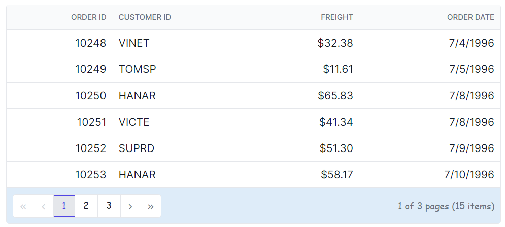
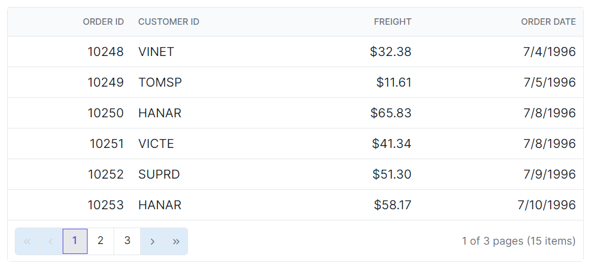
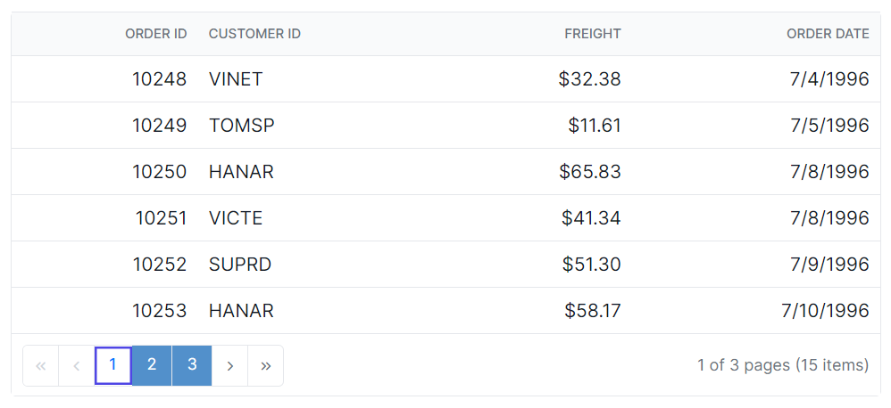
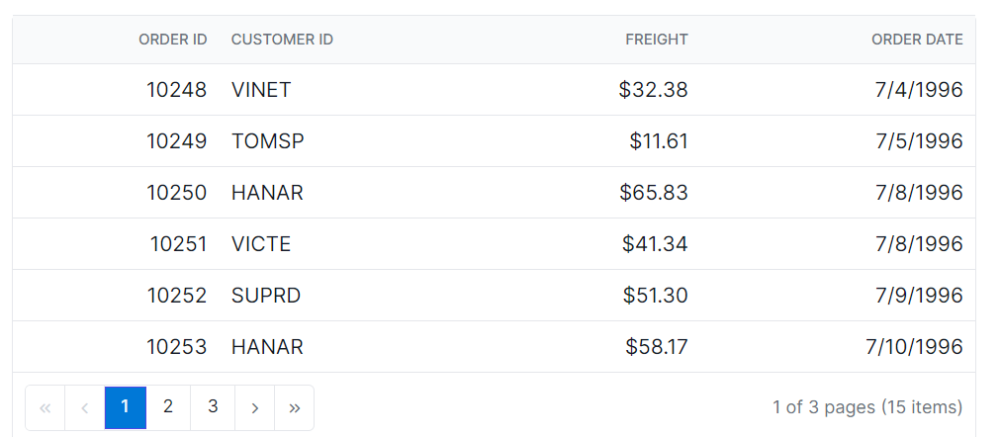

# Paging in Syncfusion<sup style="font-size:70%">&reg;</sup> Blazor DataGrid

You can customize the appearance of the paging elements in the Syncfusion<sup style="font-size:70%">&reg;</sup> Blazor DataGrid using CSS. Here are examples of how to customize the pager root element, pager container element, pager navigation elements, pager page numeric link elements, and pager current page numeric element.

## Customizing the Blazor DataGrid pager root element

To customize the appearance of the Grid pager root element, you can use the following CSS code:

```css
.e-grid .e-gridpager {
    font-family: cursive;
    background-color: #deecf9;
}
```
In this example, the **.e-gridpager** class targets the pager root element. You can modify the `font-family` to change the font family and `background-color` property to change the background color of the pager.



## Customizing the Blazor DataGrid pager container element

To customize the appearance of the Grid pager container element, you can use the following CSS code:

```css
.e-grid .e-pagercontainer {
    border: 2px solid #00b5ff;
    font-family: cursive;
}
```

In this example, the **.e-pagercontainer** class targets the pager container element. You can modify the `border` property and `font-family` property to change the border color and font family of the pager container.


## Customizing the Blazor DataGrid pager navigation elements

To customize the appearance of the Grid pager navigation elements, you can use the following CSS code:

```css
.e-grid .e-gridpager .e-prevpagedisabled,
.e-grid .e-gridpager .e-prevpage,
.e-grid .e-gridpager .e-nextpage,
.e-grid .e-gridpager .e-nextpagedisabled,
.e-grid .e-gridpager .e-lastpagedisabled,
.e-grid .e-gridpager .e-lastpage,
.e-grid .e-gridpager .e-firstpage,
.e-grid .e-gridpager .e-firstpagedisabled {
    background-color: #deecf9;
}
```

In this example, the classes **.e-prevpagedisabled, .e-prevpage, .e-nextpage, .e-nextpagedisabled, .e-lastpagedisabled, .e-lastpage, .e-firstpage,** and **.e-firstpagedisabled** target the various pager navigation elements. You can modify the `background-color` property to change the background color of these elements.



## Customizing the Blazor DataGrid pager page numeric link elements

To customize the appearance of the Grid pager current page numeric link elements, you can use the following CSS code:

```css
.e-grid .e-gridpager .e-numericitem {
    background-color: #5290cb;
    color: #ffffff;
    cursor: pointer;
    }
    
.e-grid .e-gridpager .e-numericitem:hover {
    background-color: white;
    color:  #007bff;
}
```

In this example, the **.e-numericitem** class targets the page numeric link elements. You can modify the `background-color`, `color` properties to change the background color and text color of these elements.



## Customizing the Blazor DataGrid pager current page numeric element

To customize the appearance of the Grid pager current page numeric element, you can use the following CSS code:

```css
.e-grid .e-gridpager .e-currentitem {
    background-color: #0078d7;
    color: #fff;
}
```

In this example, the **.e-currentitem** class targets the current page numeric item. You can modify the `background-color` property to change the background color of this element and `color` property to change the text color.







@using Syncfusion.Blazor.Grids

<SfGrid @ref="Grid" DataSource="@Orders" Height="315" AllowPaging="true">
    <GridPageSettings PageSize="8"></GridPageSettings>
    <GridColumns>
        <GridColumn Field=@nameof(OrderData.OrderID) HeaderText="Order ID" TextAlign="Syncfusion.Blazor.Grids.TextAlign.Right" Width="140"></GridColumn>
        <GridColumn Field=@nameof(OrderData.CustomerID) HeaderText="Customer ID" Width="120"></GridColumn>
        <GridColumn Field=@nameof(OrderData.Freight) HeaderText="Freight" TextAlign="Syncfusion.Blazor.Grids.TextAlign.Right" Width="120"></GridColumn>
        <GridColumn Field=@nameof(OrderData.OrderDate) HeaderText="Order Date" Format="d" Width="100" TextAlign="Syncfusion.Blazor.Grids.TextAlign.Right"></GridColumn>
    </GridColumns>
</SfGrid>

<style>
    .e-grid .e-gridpager .e-currentitem {
        background-color: #0078d7;
        color: #fff;
    }
    .e-grid .e-gridpager .e-numericitem {
        background-color: #5290cb;
        color: #ffffff;
        cursor: pointer;
        }
        
    .e-grid .e-gridpager .e-numericitem:hover {
        background-color: white;
        color:  #007bff;
    }
    .e-grid .e-gridpager .e-prevpagedisabled,
    .e-grid .e-gridpager .e-prevpage,
    .e-grid .e-gridpager .e-nextpage,
    .e-grid .e-gridpager .e-nextpagedisabled,
    .e-grid .e-gridpager .e-lastpagedisabled,
    .e-grid .e-gridpager .e-lastpage,
    .e-grid .e-gridpager .e-firstpage,
    .e-grid .e-gridpager .e-firstpagedisabled {
        background-color: #deecf9;
    }
    .e-grid .e-pagercontainer {
        border: 2px solid #00b5ff;
        font-family: cursive;
    }
    .e-grid .e-gridpager {
        font-family: cursive;
        background-color: #deecf9;
    }
</style>

@code {
    private SfGrid<OrderData> Grid;
    public List<OrderData> Orders { get; set; }

    protected override void OnInitialized()
    {
        Orders = OrderData.GetAllRecords();
    }
}





public class OrderData
{
    public static List<OrderData> Orders = new List<OrderData>();

    public OrderData(int orderID, string customerID, double freight, DateTime orderDate)
    {
        this.OrderID = orderID;
        this.CustomerID = customerID;
        this.Freight = freight;
        this.OrderDate = orderDate;
    }

    public static List<OrderData> GetAllRecords()
    {
        if (Orders.Count == 0)
        {
            Orders.Add(new OrderData(10248, "VINET", 32.38, new DateTime(2024, 1, 10)));
            Orders.Add(new OrderData(10249, "TOMSP", 11.61, new DateTime(2024, 1, 11)));
            Orders.Add(new OrderData(10250, "HANAR", 65.83, new DateTime(2024, 1, 12)));
            Orders.Add(new OrderData(10251, "VICTE", 41.34, new DateTime(2024, 1, 13)));
            Orders.Add(new OrderData(10252, "SUPRD", 51.3, new DateTime(2024, 1, 14)));
            Orders.Add(new OrderData(10253, "HANAR", 58.17, new DateTime(2024, 1, 15)));
            Orders.Add(new OrderData(10254, "CHOPS", 22.98, new DateTime(2024, 1, 16)));
            Orders.Add(new OrderData(10255, "RICSU", 148.33, new DateTime(2024, 1, 17)));
            Orders.Add(new OrderData(10256, "WELLI", 13.97, new DateTime(2024, 1, 18)));
            Orders.Add(new OrderData(10257, "HILAA", 81.91, new DateTime(2024, 1, 19)));
        }

        return Orders;
    }

    public int OrderID { get; set; }
    public string CustomerID { get; set; }
    public double Freight { get; set; }
    public DateTime OrderDate { get; set; }
}




