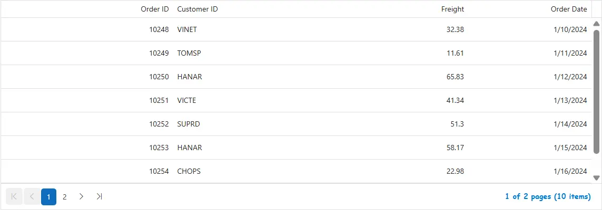

# Paging Customization in Blazor Data Grid

The appearance of paging elements in the [Blazor DataGrid](https://www.syncfusion.com/blazor-components/blazor-datagrid) can be customized using CSS. Styling options are available for different parts of the pager interface:

- **Root container:** The outermost wrapper that holds all pager content.
- **Pager container:** The inner flex container that aligns the page-size dropdown, numeric buttons, and navigation buttons.
- **Pager message:** The `.e-parentmsgbar` text that shows the current page information, such as “1 of 10 items”.
- **Navigation buttons:** Commands for first, previous, next, and last page navigation.
- **Numeric page buttons:** Clickable page numbers that jump directly to specific pages.
- **Current page button:** The highlight that marks the active numeric page button.

## Customize the pager root element

The **.e-gridpager** class styles the pager root element in the Blazor DataGrid. Use CSS to adjust the pager root appearance:

```css
.e-grid .e-gridpager {
    font-family: cursive;
    background-color: #deecf9;
}
```

Properties like **font-family**, **background-color**, and spacing-related styles can be changed to fit the grid layout design.


## Customize the pager container element

The **.e-pagercontainer** class styles the pager container in the Blazor DataGrid. Apply CSS to modify the pager container appearance:

```css
.e-grid .e-pagercontainer {
    border: 2px solid #00b5ff;
    font-family: cursive;
}
```

Properties such as **font-family**, **background-color**, and spacing-related styles can be adjusted to align with the grid design.


## Customize the pager message

The **.e-parentmsgbar** class styles the text that reports the visible item range and total count, such as `1 - 8 of 25 items`. Apply CSS to change the pager message appearance:

```css
.e-grid .e-gridpager .e-parentmsgbar {
    color: #0078d7;
    font-family: cursive;
    font-size: 14px;
    font-weight: 600;
    margin-right: 12px;
}
```

Properties such as **color**, **font-family**, **font-size**, **font-weight**, and spacing styles can be adjusted to match the pager design.



## Customize the pager navigation elements

The **.e-prevpagedisabled**, **.e-prevpage**, **.e-nextpage**, **.e-nextpagedisabled**, **.e-lastpagedisabled**, **.e-lastpage**, **.e-firstpage**, and **.e-firstpagedisabled** classes define the appearance of the pager navigation buttons in the Blazor DataGrid. Apply CSS to customize their styling:

```css
.e-grid .e-gridpager .e-prevpagedisabled,
.e-grid .e-gridpager .e-prevpage,
.e-grid .e-gridpager .e-nextpage,
.e-grid .e-gridpager .e-nextpagedisabled,
.e-grid .e-gridpager .e-lastpagedisabled,
.e-grid .e-gridpager .e-lastpage,
.e-grid .e-gridpager .e-firstpage,
.e-grid .e-gridpager .e-firstpagedisabled {
    background-color: #deecf9;
}

.e-grid .e-gridpager .e-prevpage:focus-visible,
.e-grid .e-gridpager .e-nextpage:focus-visible,
.e-grid .e-gridpager .e-firstpage:focus-visible,
.e-grid .e-gridpager .e-lastpage:focus-visible {
    outline: 2px solid #0078d7;
    outline-offset: 2px;
}
```

Properties like **background-color** can be adjusted to match the design. The `:focus-visible` outline should be retained to maintain a visible keyboard focus state for accessibility.


## Customize the numeric item states

The numeric pager area has two related classes: **.e-numericitem** for every numeric page button and **.e-currentitem** for the active page button.

### Numeric button elements

The **.e-numericitem** class styles the numeric page buttons in the Blazor DataGrid. Apply CSS to change the numeric button appearance:

```css
.e-grid .e-gridpager .e-numericitem {
    background-color: #5290cb;
    color: #ffffff;
    cursor: pointer;
}

.e-grid .e-gridpager .e-numericitem:hover {
    background-color: white;
    color: #007bff;
}
```

Properties such as **background-color**, **color**, and **`:hover` styles** can be modified to improve clarity and interaction.


### Current page numeric element

The **.e-currentitem** class styles the current page button in the Blazor DataGrid pager. Use CSS to adjust the current page button:

```css
.e-grid .e-gridpager .e-currentitem {
    background-color: #0078d7;
    color: #fff;
}
```

Properties like **background-color** and **color** can be changed to highlight the active page.





@using Syncfusion.Blazor.Grids

<SfGrid DataSource="@Orders" Height="315" AllowPaging="true">
    <GridPageSettings PageSize="8"></GridPageSettings>
    <GridColumns>
        <GridColumn Field=@nameof(OrderData.OrderID) HeaderText="Order ID" TextAlign="TextAlign.Right" Width="140"></GridColumn>
        <GridColumn Field=@nameof(OrderData.CustomerID) HeaderText="Customer ID" Width="120"></GridColumn>
        <GridColumn Field=@nameof(OrderData.Freight) HeaderText="Freight" TextAlign="TextAlign.Right" Width="120"></GridColumn>
        <GridColumn Field=@nameof(OrderData.OrderDate) HeaderText="Order Date" Format="d" Width="100" TextAlign="TextAlign.Right"></GridColumn>
    </GridColumns>
</SfGrid>

<style>
    /* current page numeric element */
    .e-grid .e-gridpager .e-currentitem {
        background-color: #0078d7;
        color: #fff;
    }
    /* numeric button elements */
    .e-grid .e-gridpager .e-numericitem {
        background-color: #5290cb;
        color: #ffffff;
        cursor: pointer;
    }
    .e-grid .e-gridpager .e-numericitem:hover {
        background-color: white;
        color: #007bff;
    }
    /* pager navigation elements */
    .e-grid .e-gridpager .e-prevpagedisabled,
    .e-grid .e-gridpager .e-prevpage,
    .e-grid .e-gridpager .e-nextpage,
    .e-grid .e-gridpager .e-nextpagedisabled,
    .e-grid .e-gridpager .e-lastpagedisabled,
    .e-grid .e-gridpager .e-lastpage,
    .e-grid .e-gridpager .e-firstpage,
    .e-grid .e-gridpager .e-firstpagedisabled {
        background-color: #deecf9;
    }
    /* pager container element */
    .e-grid .e-pagercontainer {
        border: 2px solid #00b5ff;
        font-family: cursive;
    }
    /* pager root element */
    .e-grid .e-gridpager {
        font-family: cursive;
        background-color: #deecf9;
    }
    /* pager message element */
    .e-grid .e-gridpager .e-parentmsgbar {
        color: #0078d7;
        font-family: cursive;
        font-size: 14px;
        font-weight: 600;
        margin-right: 12px;
    }
</style>

@code {
    private List<OrderData> Orders { get; set; }

    protected override void OnInitialized()
    {
        Orders = OrderData.GetAllRecords();
    }
}





    internal sealed class OrderData
    {
        private static readonly List<OrderData> Data = new();

        public OrderData(int orderID, string customerID, double freight, DateTime orderDate)
        {
            OrderID = orderID;
            CustomerID = customerID;
            Freight = freight;
            OrderDate = orderDate;
        }

        internal static List<OrderData> GetAllRecords()
        {
            if (Data.Count == 0)
            {
                Data.Add(new OrderData(10248, "VINET", 32.38, new DateTime(2024, 1, 10)));
                Data.Add(new OrderData(10249, "TOMSP", 11.61, new DateTime(2024, 1, 11)));
                Data.Add(new OrderData(10250, "HANAR", 65.83, new DateTime(2024, 1, 12)));
                Data.Add(new OrderData(10251, "VICTE", 41.34, new DateTime(2024, 1, 13)));
                Data.Add(new OrderData(10252, "SUPRD", 51.3, new DateTime(2024, 1, 14)));
                Data.Add(new OrderData(10253, "HANAR", 58.17, new DateTime(2024, 1, 15)));
                Data.Add(new OrderData(10254, "CHOPS", 22.98, new DateTime(2024, 1, 16)));
                Data.Add(new OrderData(10255, "RICSU", 148.33, new DateTime(2024, 1, 17)));
                Data.Add(new OrderData(10256, "WELLI", 13.97, new DateTime(2024, 1, 18)));
                Data.Add(new OrderData(10257, "HILAA", 81.91, new DateTime(2024, 1, 19)));
            }

            return new List<OrderData>(Data);
        }

        public int OrderID { get; set; }
        public string CustomerID { get; set; }
        public double Freight { get; set; }
        public DateTime OrderDate { get; set; }
    }




