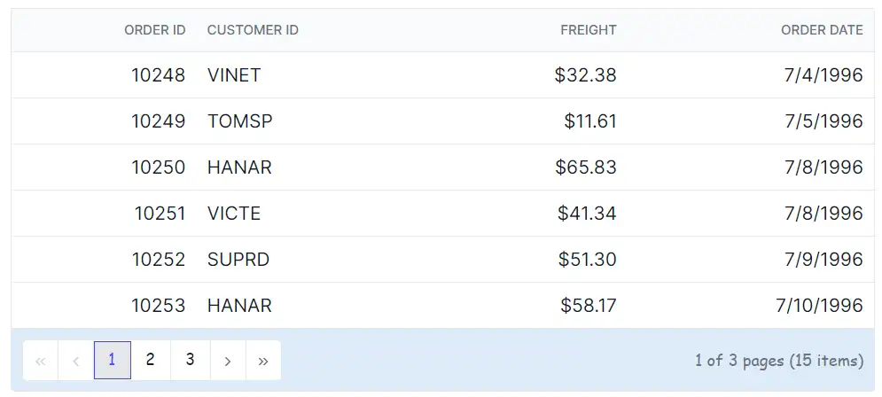
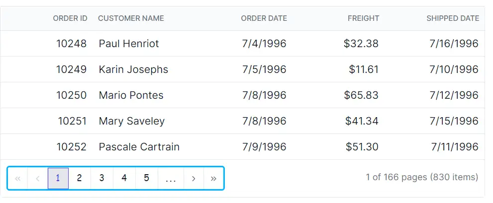
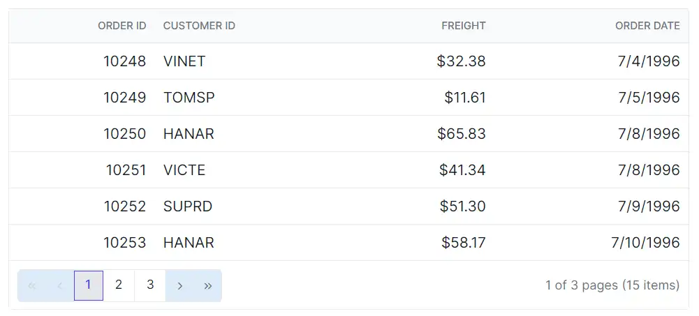
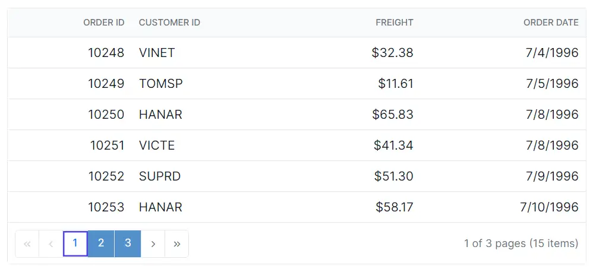
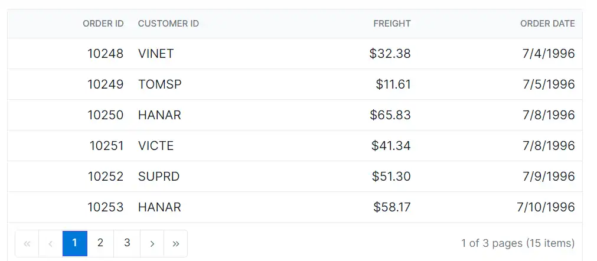

# Paging Customization in Blazor Data Grid

The appearance of paging elements in the [Blazor DataGrid](https://www.syncfusion.com/blazor-components/blazor-datagrid) can be customized using CSS. Styling options are available for different parts of the pager interface:

- **Pager root element:** The outermost wrapper that holds all pager content.
- **Pager container element:** The inner layout that positions the controls.
- **Pager navigation buttons:** Commands for first, previous, next, and last page navigation.
- **Pager numeric buttons:** Buttons that jump directly to specific pages.
- **Current page indicator:** The highlighting that marks the active numeric page button.

## Customize the pager root element

The **.e-gridpager** class styles the pager root element in the Blazor DataGrid. The following example applies custom styling to the pager root:

```css
.e-grid .e-gridpager {
    font-family: cursive;
    background-color: #deecf9;
}
```

Modify properties such as **font-family**, **background-color**, and spacing-related styles to match the design requirements. When overriding theme defaults, add `!important` to the property if the rule does not apply.



## Customize the pager container element

The **.e-pagercontainer** class styles the pager container element in the Blazor DataGrid. The following example applies custom styling:

```css
.e-grid .e-pagercontainer {
    border: 2px solid #00b5ff;
    font-family: cursive;
}
```

Modify properties such as **font-family**, **background-color**, and spacing-related styles to match the design requirements. When overriding theme defaults, add `!important` to the property if the rule does not apply.



## Customize the pager navigation buttons

The **.e-prevpagedisabled**, **.e-prevpage**, **.e-nextpage**, **.e-nextpagedisabled**, **.e-lastpagedisabled**, **.e-lastpage**, **.e-firstpage**, and **.e-firstpagedisabled** classes define the appearance of the pager navigation buttons in the Blazor DataGrid. The following example applies custom styling:

```css
.e-grid .e-gridpager .e-prevpagedisabled,
.e-grid .e-gridpager .e-prevpage,
.e-grid .e-gridpager .e-nextpage,
.e-grid .e-gridpager .e-nextpagedisabled,
.e-grid .e-gridpager .e-lastpagedisabled,
.e-grid .e-gridpager .e-lastpage,
.e-grid .e-gridpager .e-firstpage,
.e-grid .e-gridpager .e-firstpagedisabled {
    background-color: #deecf9;
}
```

Adjust properties like **background-color** to match the design, while keeping clear focus styles for accessibility.



## Customize the pager numeric buttons

The **.e-numericitem** class styles the numeric page buttons in the Blazor DataGrid. The following example applies custom styling:

```css
.e-grid .e-gridpager .e-numericitem {
    background-color: #5290cb;
    color: #ffffff;
    cursor: pointer;
}

.e-grid .e-gridpager .e-numericitem:hover {
    background-color: white;
    color: #007bff;
}

```

Modify properties such as **background-color**, **color**, and **hover** effects to match design requirements. Include `:focus`, `:active`, and `:disabled` states for accessibility and user feedback.



## Customize the current page indicator

The **.e-currentitem** class styles the current page indicator in the Blazor DataGrid pager. The following example applies custom styling:

```css
.e-grid .e-gridpager .e-currentitem {
    background-color: #0078d7;
    color: #fff;
}
```

Change properties like **background-color** and **color** to highlight the active page.







@using Syncfusion.Blazor.Grids

<SfGrid @ref="Grid" DataSource="@Orders" Height="315" AllowPaging="true">
    <GridPageSettings PageSize="8"></GridPageSettings>
    <GridColumns>
        <GridColumn Field=@nameof(OrderData.OrderID) HeaderText="Order ID" TextAlign="TextAlign.Right" Width="140"></GridColumn>
        <GridColumn Field=@nameof(OrderData.CustomerID) HeaderText="Customer ID" Width="120"></GridColumn>
        <GridColumn Field=@nameof(OrderData.Freight) HeaderText="Freight" TextAlign="TextAlign.Right" Width="120"></GridColumn>
        <GridColumn Field=@nameof(OrderData.OrderDate) HeaderText="Order Date" Format="d" Width="100" TextAlign="TextAlign.Right"></GridColumn>
    </GridColumns>
</SfGrid>

<style>
    .e-grid .e-gridpager .e-currentitem {
        background-color: #0078d7;
        color: #fff;
    }
    .e-grid .e-gridpager .e-numericitem {
        background-color: #5290cb;
        color: #ffffff;
        cursor: pointer;
    }
    .e-grid .e-gridpager .e-numericitem:hover {
        background-color: white;
        color: #007bff;
    }
    .e-grid .e-gridpager .e-prevpagedisabled,
    .e-grid .e-gridpager .e-prevpage,
    .e-grid .e-gridpager .e-nextpage,
    .e-grid .e-gridpager .e-nextpagedisabled,
    .e-grid .e-gridpager .e-lastpagedisabled,
    .e-grid .e-gridpager .e-lastpage,
    .e-grid .e-gridpager .e-firstpage,
    .e-grid .e-gridpager .e-firstpagedisabled {
        background-color: #deecf9;
    }
    .e-grid .e-pagercontainer {
        border: 2px solid #00b5ff;
        font-family: cursive;
    }
    .e-grid .e-gridpager {
        font-family: cursive;
        background-color: #deecf9;
    }
</style>

@code {
    private SfGrid<OrderData> Grid;
    private List<OrderData> Orders { get; set; }

    protected override void OnInitialized()
    {
        Orders = OrderData.GetAllRecords();
    }
}





internal sealed class OrderData
{
    private static readonly List<OrderData> Data = new();

    public OrderData(int orderID, string customerID, double freight, DateTime orderDate)
    {
        OrderID = orderID;
        CustomerID = customerID;
        Freight = freight;
        OrderDate = orderDate;
    }

    internal static List<OrderData> GetAllRecords()
    {
        if (Data.Count == 0)
        {
            Data.Add(new OrderData(10248, "VINET", 32.38, new DateTime(2024, 1, 10)));
            Data.Add(new OrderData(10249, "TOMSP", 11.61, new DateTime(2024, 1, 11)));
            Data.Add(new OrderData(10250, "HANAR", 65.83, new DateTime(2024, 1, 12)));
            Data.Add(new OrderData(10251, "VICTE", 41.34, new DateTime(2024, 1, 13)));
            Data.Add(new OrderData(10252, "SUPRD", 51.3, new DateTime(2024, 1, 14)));
            Data.Add(new OrderData(10253, "HANAR", 58.17, new DateTime(2024, 1, 15)));
            Data.Add(new OrderData(10254, "CHOPS", 22.98, new DateTime(2024, 1, 16)));
            Data.Add(new OrderData(10255, "RICSU", 148.33, new DateTime(2024, 1, 17)));
            Data.Add(new OrderData(10256, "WELLI", 13.97, new DateTime(2024, 1, 18)));
            Data.Add(new OrderData(10257, "HILAA", 81.91, new DateTime(2024, 1, 19)));
        }

        return Data;
    }

    public int OrderID { get; set; }
    public string CustomerID { get; set; }
    public double Freight { get; set; }
    public DateTime OrderDate { get; set; }
}




